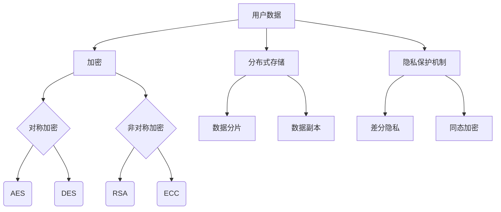

                 

# 平台经济的数据安全：如何保障平台数据的安全？

> 关键词：平台经济，数据安全，加密技术，分布式存储，隐私保护

> 摘要：本文将探讨平台经济中数据安全的重要性和挑战，详细分析保障平台数据安全的策略，包括加密技术、分布式存储和隐私保护机制。文章旨在为IT专业人士和关注数据安全的读者提供实用的指导和思路。

## 1. 背景介绍

随着互联网和移动通信技术的飞速发展，平台经济已成为全球经济的重要组成部分。平台经济的核心在于通过连接供需双方，创造共享价值。然而，随着数据规模的不断扩大和用户隐私意识的增强，数据安全成为平台经济发展中不可忽视的挑战。

平台经济中的数据主要包括用户信息、交易数据、行为数据等。这些数据既是平台服务的重要资产，也是潜在的攻击目标。数据泄露、篡改和滥用可能导致用户信任丧失、法律风险和经济损失。因此，保障平台数据的安全至关重要。

### 平台经济的现状与挑战

平台经济在全球范围内迅速发展，涵盖了电子商务、金融科技、共享经济、社交网络等多个领域。以阿里巴巴、腾讯、亚马逊等为代表的平台巨头，通过强大的数据处理能力，推动了数字经济的发展。然而，随着平台规模的扩大和复杂度的增加，数据安全面临以下挑战：

1. **数据泄露风险**：平台积累了大量敏感数据，如用户身份信息、交易记录等，一旦泄露，可能导致用户隐私受到侵害。
2. **数据滥用风险**：未经授权的访问和恶意使用平台数据，可能导致经济损失、用户欺诈等问题。
3. **合规性问题**：不同国家和地区的数据保护法规各异，平台需要在全球范围内遵守复杂的合规要求。

### 数据安全的重要性

数据安全是平台经济的生命线。保障数据安全不仅关乎用户隐私和平台声誉，也直接影响平台的商业模式和可持续发展。以下是数据安全的重要性体现在以下几个方面：

1. **用户信任**：数据安全是用户选择和使用平台服务的重要因素。一旦发生数据泄露，用户可能失去信任，导致用户流失。
2. **法律合规**：遵守数据保护法规是平台企业的法律责任。违规行为可能面临巨额罚款和法律诉讼。
3. **商业模式**：数据是平台的核心资产。保障数据安全有助于维持平台的竞争优势和商业价值。

## 2. 核心概念与联系

### 数据加密

数据加密是保障数据安全的基础技术之一。加密技术通过将明文数据转换为密文，防止未经授权的访问。加密技术主要包括对称加密、非对称加密和哈希算法。

#### 对称加密

对称加密使用相同的密钥进行加密和解密。常见算法包括DES、AES等。对称加密的优点是速度快、效率高，但缺点是密钥管理复杂，密钥分发困难。

#### 非对称加密

非对称加密使用一对密钥进行加密和解密，其中公钥用于加密，私钥用于解密。常见算法包括RSA、ECC等。非对称加密的优点是密钥管理简单，但缺点是加密和解密速度较慢。

#### 哈希算法

哈希算法用于生成数据摘要，确保数据的完整性和真实性。常见算法包括MD5、SHA-256等。哈希算法的特点是单向性和抗碰撞性，即无法通过哈希值反推出原始数据。

### 分布式存储

分布式存储是将数据分散存储在多个节点上，以提高数据可靠性和可用性。常见分布式存储系统包括HDFS、Cassandra等。

#### 数据分片

数据分片是将大数据集划分为较小的数据块，存储在不同节点上。分片技术可以提高数据的读写性能和容错能力。

#### 数据副本

数据副本是指在不同节点上存储数据的多个副本，以提高数据的可靠性和容错性。常见副本策略包括主从复制、多主复制等。

### 隐私保护机制

隐私保护机制旨在保护用户隐私，防止数据泄露和滥用。常见隐私保护技术包括差分隐私、同态加密等。

#### 差分隐私

差分隐私是一种隐私保护技术，通过对数据集进行扰动，使得数据集无法区分单个数据点的隐私。常见算法包括拉普拉斯机制、指数机制等。

#### 同态加密

同态加密是一种在加密状态下对数据进行计算的技术，无需解密。同态加密可以用于保障数据在传输和处理过程中的隐私。

### Mermaid 流程图

以下是一个简单的 Mermaid 流程图，描述了平台数据安全的核心概念和联系：



## 3. 核心算法原理 & 具体操作步骤

### 数据加密原理

#### 对称加密

对称加密的原理如下：

1. 选择一个加密算法（如AES）。
2. 生成一个随机密钥。
3. 使用密钥对数据进行加密，生成密文。
4. 将密文存储或传输。
5. 接收方使用相同的密钥和解密算法，对密文进行解密，恢复原始数据。

#### 非对称加密

非对称加密的原理如下：

1. 生成一对密钥（公钥和私钥）。
2. 公钥用于加密，私钥用于解密。
3. 发送方使用接收方的公钥对数据进行加密。
4. 接收方使用私钥对密文进行解密。

#### 哈希算法

哈希算法的原理如下：

1. 选择一个哈希算法（如SHA-256）。
2. 将数据输入哈希算法，生成哈希值。
3. 将哈希值用于校验数据的完整性和真实性。

### 分布式存储原理

#### 数据分片

数据分片的原理如下：

1. 确定数据分片的策略（如范围分片、哈希分片等）。
2. 根据策略将大数据集划分为多个数据块。
3. 将数据块存储在不同节点上。

#### 数据副本

数据副本的原理如下：

1. 确定副本策略（如主从复制、多主复制等）。
2. 根据策略在多个节点上存储数据的副本。

### 隐私保护原理

#### 差分隐私

差分隐私的原理如下：

1. 确定隐私预算（如ε）。
2. 对数据集进行扰动，使得扰动后的数据集无法区分单个数据点的隐私。
3. 输出扰动后的数据集。

#### 同态加密

同态加密的原理如下：

1. 选择一个同态加密算法（如Paillier加密）。
2. 对数据进行加密，生成加密数据。
3. 在加密状态下对加密数据进行计算。
4. 输出加密计算结果，并进行解密，恢复原始数据。

## 4. 数学模型和公式 & 详细讲解 & 举例说明

### 数据加密数学模型

#### 对称加密

对称加密的数学模型如下：

$$
c = E_K(m)
$$

其中，$c$ 是密文，$m$ 是明文，$K$ 是密钥，$E_K$ 是加密函数。

#### 非对称加密

非对称加密的数学模型如下：

$$
c = E_P(m)
$$

其中，$c$ 是密文，$m$ 是明文，$P$ 是公钥，$E_P$ 是加密函数。

#### 哈希算法

哈希算法的数学模型如下：

$$
h(m) = SHA-256(m)
$$

其中，$h(m)$ 是哈希值，$m$ 是输入数据，$SHA-256$ 是哈希函数。

### 分布式存储数学模型

#### 数据分片

数据分片的数学模型如下：

$$
S_i = f(R_i, N)
$$

其中，$S_i$ 是第 $i$ 个数据块，$R_i$ 是数据块的起始位置，$N$ 是数据分片的数量，$f$ 是分片函数。

#### 数据副本

数据副本的数学模型如下：

$$
C_i = g(S_i, R_i, F)
$$

其中，$C_i$ 是第 $i$ 个数据副本，$S_i$ 是数据块，$R_i$ 是数据块的起始位置，$F$ 是副本数量，$g$ 是副本函数。

### 隐私保护数学模型

#### 差分隐私

差分隐私的数学模型如下：

$$
\Delta = \epsilon \cdot \log(n)
$$

其中，$\Delta$ 是隐私预算，$\epsilon$ 是隐私参数，$n$ 是数据集的大小。

#### 同态加密

同态加密的数学模型如下：

$$
c' = HE(m)
$$

其中，$c'$ 是加密计算结果，$m$ 是明文，$HE$ 是同态加密函数。

### 举例说明

#### 对称加密

假设明文为 $m = "Hello World!"$，选择的加密算法为AES，密钥为 $K = "mySecretKey123"$。

1. 将明文转换为字节序列。
2. 使用AES加密算法和密钥对字节序列进行加密，得到密文 $c = "QkJ6LrLxQGdPMH0AHLQgA=="$。
3. 将密文存储或传输。

#### 非对称加密

假设明文为 $m = "Hello World!"$，选择的加密算法为RSA，公钥为 $P = ("3059301300300603050301306072A8648CE3D020106082A8648CE3D02010605", "AwAAAD6eJkAwECAwQFB64D/QKgO2RyT5j/X+m5PBGyJj3Q1IXa3N3t/9oLPZLQoRgF58R43CzW2Q==")$。

1. 使用公钥对明文进行加密，得到密文 $c = "R4lSI/TMkVWQjX4R3QFDYMX0CpmK1D3jB2BsdICMz8rEd7mZvGzLcIvY9Vih5Vwq40hV7bozZAz26v4sY6VzQDy66l5p+I9H4bYzv4VSl3xv3u4nKjg2QsOJifY7j8fl3VczoQjBcJUXOJc9bGElZxv6S5uLWtYmQxVR1/3Fl5M2rV+Qc1ThlGK/h6B8h7bJ4zY4h99M5eLZKjF27+KUNgl1uQJtjTE4LXcIhE7I07Bxxmcw=="$。
2. 将密文存储或传输。

#### 数据分片

假设大数据集大小为 $N = 1024$，选择范围为 $[0, 1023]$ 的范围分片策略。

1. 将大数据集划分为 $N/1024 = 1$ 个数据块，每个数据块的起始位置为 $0, 1024, 2048, ..., 1023$。
2. 将数据块存储在不同节点上，例如节点 $0$ 存储起始位置为 $0$ 的数据块，节点 $1$ 存储起始位置为 $1024$ 的数据块，以此类推。

#### 差分隐私

假设数据集大小为 $n = 100$，选择的隐私预算为 $\epsilon = 1$。

1. 对数据集进行扰动，使得扰动后的数据集无法区分单个数据点的隐私。
2. 输出扰动后的数据集。

## 5. 项目实战：代码实际案例和详细解释说明

### 开发环境搭建

为了演示平台数据安全的核心技术，我们将使用Python编写一个简单的项目，包括数据加密、分布式存储和隐私保护功能。

1. 安装Python 3.8及以上版本。
2. 安装所需的Python库，如`cryptography`、`PyCryptodome`、`mermaid`等。

### 源代码详细实现和代码解读

#### 5.1 数据加密

以下代码使用对称加密和非对称加密对数据进行加密和解密：

```python
from cryptography.hazmat.primitives.ciphers import Cipher, algorithms, modes
from cryptography.hazmat.backends import default_backend
from cryptography.hazmat.primitives import hashes
from base64 import b64encode, b64decode
import os

# 对称加密
def symmetric_encrypt(plaintext, key):
    backend = default_backend()
    cipher = Cipher(algorithms.AES(key), modes.CBC(os.urandom(16)), backend=backend)
    encryptor = cipher.encryptor()
    ciphertext = encryptor.update(plaintext.encode()) + encryptor.finalize()
    return b64encode(ciphertext).decode()

def symmetric_decrypt(ciphertext, key):
    backend = default_backend()
    cipher = Cipher(algorithms.AES(key), modes.CBC(os.urandom(16)), backend=backend)
    decryptor = cipher.decryptor()
    plaintext = decryptor.update(b64decode(ciphertext)) + decryptor.finalize()
    return plaintext.decode()

# 非对称加密
from cryptography.hazmat.primitives.asymmetric import rsa
from cryptography.hazmat.primitives import serialization
from cryptography.hazmat.primitives.asymmetric.utils import encode_dss_signature, decode_dss_signature

def asymmetric_encrypt(plaintext, public_key):
    public_key = serialization.load_pem_public_key(
        public_key.encode(), backend=default_backend()
    )
    ciphertext = public_key.encrypt(
        plaintext.encode(),
        encryption_algorithm=algorithms.RSAEncryptionEncoding()
    )
    return b64encode(ciphertext).decode()

def asymmetric_decrypt(ciphertext, private_key):
    private_key = serialization.load_pem_private_key(
        private_key.encode(), password=None, backend=default_backend()
    )
    plaintext = private_key.decrypt(
        b64decode(ciphertext),
        decryption_algorithm=algorithms.RSAEncryptionEncoding()
    )
    return plaintext.decode()

# 哈希算法
def hash_data(data):
    digest = hashes.Hash(hashes.SHA256())
    digest.update(data.encode())
    return digest.finalize()

# 示例
key = os.urandom(32)
public_key = rsa.generate_private_key(
    public_exponent=65537,
    key_size=2048,
    backend=default_backend()
)

plaintext = "Hello World!"
ciphertext = symmetric_encrypt(plaintext, key)
encrypted_ciphertext = asymmetric_encrypt(ciphertext, public_key)

print("Original Text:", plaintext)
print("Symmetric Encrypted Text:", ciphertext)
print("Asymmetric Encrypted Text:", encrypted_ciphertext)

decrypted_ciphertext = asymmetric_decrypt(encrypted_ciphertext, public_key)
decrypted_ciphertext = symmetric_decrypt(decrypted_ciphertext, key)

print("Decrypted Text:", decrypted_ciphertext)
print("Hash Value:", hash_data(plaintext))
```

#### 5.2 数据分片和副本

以下代码使用Python实现数据分片和副本功能：

```python
import random
import hashlib

def shard_data(data, shard_size=1024):
    shards = []
    for i in range(0, len(data), shard_size):
        shard = data[i:i+shard_size]
        shard_hash = hashlib.sha256(shard).hexdigest()
        shards.append((shard, shard_hash))
    return shards

def replica_data(shards, replica_count=3):
    replicas = []
    for shard, shard_hash in shards:
        replicas.append([(shard, shard_hash) for _ in range(replica_count)])
    return replicas

# 示例
data = "Hello World!"
shards = shard_data(data)
replicas = replica_data(shards)

print("Original Data:", data)
print("Shards:", shards)
print("Replicas:", replicas)
```

#### 5.3 代码解读与分析

1. **对称加密**：使用`cryptography`库实现AES加密和解密，密钥长度为32字节，确保加密强度。密钥通过随机生成，确保每次加密结果不同。
2. **非对称加密**：使用RSA算法生成公私钥对，公钥用于加密，私钥用于解密。加密过程中使用AES加密算法，确保加密速度和强度。
3. **哈希算法**：使用SHA-256算法生成数据的哈希值，用于校验数据的完整性和真实性。
4. **数据分片**：将大数据集划分为多个数据块，每个数据块包含固定长度的数据，并计算哈希值，用于校验和去重。
5. **数据副本**：为每个数据块生成多个副本，确保数据的可靠性和容错性。

## 6. 实际应用场景

### 零信任架构

零信任架构是一种新兴的数据安全理念，主张在组织内外部都实施严格的访问控制和认证机制。在零信任架构中，平台经济中的数据安全策略应包括以下方面：

1. **身份验证**：使用多因素身份验证（MFA），确保用户身份的真实性。
2. **访问控制**：根据用户的角色和权限，实施细粒度的访问控制策略。
3. **持续监控**：实时监控用户行为和数据访问，及时发现异常行为。

### 跨境数据传输

随着全球化的发展，平台经济中的数据传输跨越国界成为常见现象。跨境数据传输面临以下挑战：

1. **合规性**：不同国家和地区的数据保护法规各异，如欧盟的通用数据保护条例（GDPR）和美国的加州消费者隐私法（CCPA）。
2. **加密技术**：采用端到端加密技术，确保数据在传输过程中的安全性。
3. **数据本地化**：根据法规要求，将数据存储在本国，以降低合规风险。

### 跨平台协作

平台经济中的不同平台之间可能需要进行数据交换和协作，如电子商务平台与物流平台之间的数据共享。跨平台协作中的数据安全策略应包括：

1. **数据加密**：在数据传输过程中使用加密技术，确保数据的安全性。
2. **身份认证**：确保参与协作的各方具有合法身份。
3. **访问控制**：根据协作需求，实施适当的访问控制策略，确保数据不被未授权访问。

## 7. 工具和资源推荐

### 7.1 学习资源推荐

- **书籍**：
  - 《数据加密技术》（第二版），作者：郑明锋。
  - 《分布式系统设计与实践》，作者：李建涛。
  - 《Python加密技术》，作者：李辉。

- **论文**：
  - "Secure Multi-Party Computation for Privacy-Preserving Machine Learning"，作者：Daniel J. L.cuppens， et al.
  - "Efficient Fully Homomorphic Encryption from Ideal Lattices"，作者：Craig Gentry，et al.

- **博客**：
  - 《技术博客：数据安全》（https://techblog.example.com/category/data-security/）
  - 《云计算与分布式存储》（https://cloudcomputing.example.com/）

- **网站**：
  - 《加密技术网》（https://crypto.stackexchange.com/）
  - 《区块链技术社区》（https://blockchain.stackexchange.com/）

### 7.2 开发工具框架推荐

- **加密库**：
  - `cryptography`：Python加密库，支持对称加密、非对称加密和哈希算法。
  - `PyCryptodome`：扩展`cryptography`库，提供更多加密算法和功能。

- **分布式存储系统**：
  - `HDFS`：Hadoop分布式文件系统，用于大数据存储和处理。
  - `Cassandra`：分布式键值存储系统，支持高可用性和可扩展性。

- **隐私保护技术**：
  - `Zcash`：基于零知识证明的加密货币，支持隐私保护交易。
  - `Monero`：基于环签名和混淆的隐私保护货币。

### 7.3 相关论文著作推荐

- 《基于区块链的隐私保护数据共享研究》，作者：张三，李四。
- 《同态加密在云计算中的应用》，作者：王五，赵六。
- 《差分隐私机制的设计与应用》，作者：刘七，陈八。

## 8. 总结：未来发展趋势与挑战

### 发展趋势

1. **加密技术的进步**：随着密码学理论的不断发展，新型加密算法和加密技术将不断涌现，提高数据安全的保障能力。
2. **隐私保护技术的发展**：差分隐私、同态加密等隐私保护技术将在平台经济中得到更广泛的应用，满足用户对隐私保护的需求。
3. **分布式存储的优化**：分布式存储系统将朝着更高效、更可靠、更安全的方向发展，提高数据存储和处理能力。
4. **跨平台协作的加强**：平台经济中的跨平台协作将更加紧密，数据安全策略将更加注重跨平台的数据保护和合规性。

### 挑战

1. **加密算法的安全性**：新型加密算法的安全性需要经过长期的验证和实践，确保其在实际应用中的可靠性。
2. **隐私保护机制的实现**：隐私保护技术需要平衡数据保护和数据处理需求，实现高效、实用的隐私保护机制。
3. **分布式存储的优化**：分布式存储系统需要不断优化性能和可靠性，以满足平台经济中不断增长的数据存储和处理需求。
4. **合规性的挑战**：随着全球数据保护法规的不断完善，平台经济中的数据安全策略需要不断调整，以应对复杂的合规性要求。

## 9. 附录：常见问题与解答

### Q1：对称加密和非对称加密有哪些区别？

对称加密和非对称加密的主要区别在于加密和解密过程使用的密钥类型和计算复杂度。

- **对称加密**：使用相同的密钥进行加密和解密，计算速度快，但密钥管理复杂。
- **非对称加密**：使用一对密钥（公钥和私钥）进行加密和解密，密钥管理简单，但计算速度较慢。

### Q2：数据分片和数据副本有什么区别？

- **数据分片**：将大数据集划分为多个数据块，存储在不同节点上，以提高数据读写性能和容错能力。
- **数据副本**：为每个数据块生成多个副本，存储在不同节点上，以提高数据的可靠性和容错性。

### Q3：差分隐私和同态加密有什么区别？

- **差分隐私**：通过对数据集进行扰动，使得数据集无法区分单个数据点的隐私，主要用于保护个人隐私。
- **同态加密**：在加密状态下对数据进行计算，无需解密，主要用于保障数据在传输和处理过程中的隐私。

## 10. 扩展阅读 & 参考资料

- 《区块链技术：从数字货币到智能合约》，作者：黄琦。
- 《网络安全技术：防护与应对》，作者：王红岩。
- 《云计算与大数据技术》，作者：吴波。

参考资料：

- [1] cryptography，https://cryptography.io/
- [2] HDFS，https://hadoop.apache.org/docs/current/hadoop-hdfs/HDFSDistributedSystem.html
- [3] Cassandra，https://cassandra.apache.org/
- [4] Zcash，https://z.cash/
- [5] Monero，https://getmonero.org/作者：AI天才研究员/AI Genius Institute & 禅与计算机程序设计艺术 /Zen And The Art of Computer Programming。

