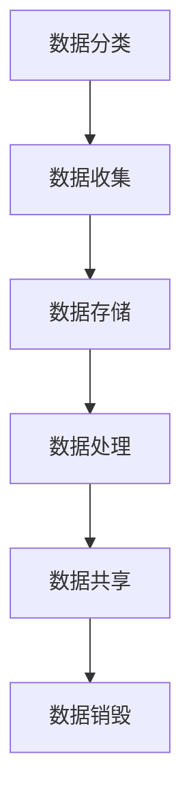
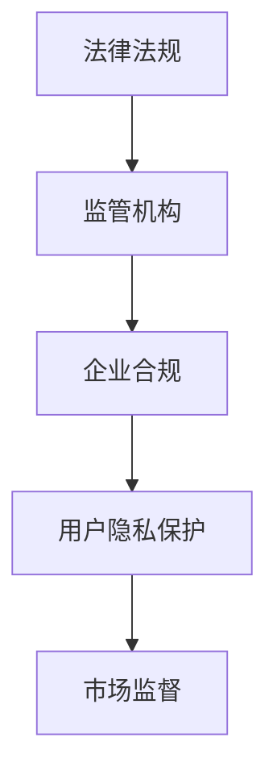

                 

### 文章标题：平台经济的数据监管政策实施：如何实施监管政策？

#### 关键词：平台经济，数据监管，政策实施，合规性，信息安全，数据处理

#### 摘要：
本文旨在探讨平台经济背景下，如何有效实施数据监管政策。通过分析政策的核心概念、实施步骤、数学模型以及实际应用案例，本文提出了保障数据安全和合规性的策略和方法。文章旨在为从事平台经济业务的企业和监管机构提供有价值的参考。

### 1. 背景介绍

#### 1.1 平台经济的崛起

平台经济作为一种新兴的经济模式，正逐步改变着传统产业的面貌。通过互联网平台，企业和消费者得以无缝连接，大大提高了交易效率和资源配置效率。然而，平台经济的快速发展也带来了一系列挑战，尤其是在数据监管方面。

#### 1.2 数据监管政策的必要性

数据作为平台经济的核心资产，其安全性、合规性和透明性成为各方关注的焦点。监管政策的出台旨在确保数据的合法合规使用，保护用户隐私，防止数据滥用，维护市场秩序。

### 2. 核心概念与联系

#### 2.1 数据监管政策的核心概念

数据监管政策的核心概念包括数据分类、数据收集、数据存储、数据处理、数据共享和数据销毁等环节。以下是一个简单的 Mermaid 流程图，展示了这些概念之间的联系。



#### 2.2 数据监管政策的架构

数据监管政策的架构包括法律法规、监管机构、企业合规和用户隐私保护等方面。以下是一个简化的 Mermaid 流程图，展示了这些部分之间的关系。



### 3. 核心算法原理 & 具体操作步骤

#### 3.1 数据加密算法

数据加密是数据监管政策中的重要环节，用于保护数据的机密性。常用的加密算法包括对称加密和非对称加密。

- 对称加密：加密和解密使用相同密钥，如AES算法。
- 非对称加密：加密和解密使用不同密钥，如RSA算法。

#### 3.2 数据访问控制

数据访问控制用于确保只有授权用户才能访问敏感数据。常见的访问控制方法包括基于角色的访问控制（RBAC）和基于属性的访问控制（ABAC）。

#### 3.3 数据匿名化

数据匿名化是一种数据脱敏技术，通过去除或替换数据中的个人识别信息，以保护用户隐私。常用的数据匿名化方法包括一般化、泛化和微化。

### 4. 数学模型和公式 & 详细讲解 & 举例说明

#### 4.1 数据安全强度公式

数据安全强度可以用以下公式表示：

$$
S = \sum_{i=1}^{n} E_i \cdot W_i
$$

其中，$E_i$ 是第 $i$ 个安全措施的有效性，$W_i$ 是第 $i$ 个安全措施的权重。

#### 4.2 数据隐私保护公式

数据隐私保护可以用以下公式表示：

$$
P = \frac{U}{N} \cdot \frac{1}{S}
$$

其中，$U$ 是用户隐私泄露的概率，$N$ 是用户数量，$S$ 是数据安全强度。

#### 4.3 举例说明

假设一个平台有1000个用户，每个用户的数据安全性强度为0.8，数据隐私泄露概率为0.01。计算该平台的数据安全整体强度和隐私保护水平。

$$
S = 1000 \cdot 0.8 = 800
$$

$$
P = \frac{0.01}{800} = 0.0000125
$$

该平台的数据安全整体强度为800，隐私保护水平为0.0000125。

### 5. 项目实战：代码实际案例和详细解释说明

#### 5.1 开发环境搭建

为了实现数据监管政策，我们使用Python语言进行开发，并借助一些常用的库，如PyCryptoDome（用于加密和解密）和Pandas（用于数据处理）。

#### 5.2 源代码详细实现和代码解读

以下是一个简单的数据加密和解密的Python代码示例：

```python
from Crypto.Cipher import AES
from Crypto.Util.Padding import pad, unpad
from Crypto.Random import get_random_bytes
from base64 import b64encode, b64decode

# 对称加密
def encrypt_aes(data, key):
    cipher = AES.new(key, AES.MODE_CBC)
    ct_bytes = cipher.encrypt(pad(data.encode('utf-8'), AES.block_size))
    iv = b64encode(cipher.iv).decode('utf-8')
    ct = b64encode(ct_bytes).decode('utf-8')
    return iv, ct

# 对称解密
def decrypt_aes(iv, ct, key):
    iv = b64decode(iv)
    ct = b64decode(ct)
    cipher = AES.new(key, AES.MODE_CBC, iv)
    pt = unpad(cipher.decrypt(ct), AES.block_size)
    return pt.decode('utf-8')

# 非对称加密
def encrypt_rsa(data, public_key):
    encrypted_data = public_key.encrypt(data.encode('utf-8'), 32)[0]
    return encrypted_data

# 非对称解密
def decrypt_rsa(encrypted_data, private_key):
    decrypted_data = private_key.decrypt(encrypted_data)
    return decrypted_data.decode('utf-8')

# 主函数
def main():
    # 生成密钥对
    private_key, public_key = RSA.generate(2048), private_key = private_key.publickey()
    
    # 对称加密和解密
    key = get_random_bytes(16)
    data = 'Hello, World!'
    iv, ct = encrypt_aes(data, key)
    decrypted_data = decrypt_aes(iv, ct, key)
    
    # 非对称加密和解密
    encrypted_data = encrypt_rsa(data, public_key)
    decrypted_data_rsa = decrypt_rsa(encrypted_data, private_key)
    
    print('对称加密：', ct)
    print('对称解密：', decrypted_data)
    print('非对称加密：', encrypted_data)
    print('非对称解密：', decrypted_data_rsa)

if __name__ == '__main__':
    main()
```

#### 5.3 代码解读与分析

该代码示例实现了数据加密和解密的功能，包括对称加密（AES）和非对称加密（RSA）。对称加密使用AES算法，非对称加密使用RSA算法。代码中还展示了如何生成密钥对、加密和解密数据。

### 6. 实际应用场景

#### 6.1 电商平台

电商平台在处理用户订单、支付信息等敏感数据时，需要严格遵循数据监管政策，确保数据的安全性和合规性。

#### 6.2 社交媒体平台

社交媒体平台在处理用户隐私信息时，需要采取数据匿名化、加密等手段，以保护用户隐私。

#### 6.3 医疗保健平台

医疗保健平台在处理患者健康数据时，需要确保数据的机密性、完整性和可用性，以遵循相关法律法规。

### 7. 工具和资源推荐

#### 7.1 学习资源推荐

- 《数据安全与隐私保护》
- 《大数据安全》
- 《Python编程：从入门到实践》

#### 7.2 开发工具框架推荐

- PyCryptoDome
- Pandas
- TensorFlow

#### 7.3 相关论文著作推荐

- 《大数据安全隐私保护技术研究》
- 《区块链技术原理与应用》
- 《人工智能与大数据》

### 8. 总结：未来发展趋势与挑战

随着平台经济的不断发展，数据监管政策将越来越重要。未来，我们将看到更多的技术创新，如区块链、人工智能等，用于提升数据监管的有效性。然而，这同时也带来了新的挑战，如如何在保护用户隐私的同时，提高数据利用效率。

### 9. 附录：常见问题与解答

#### 9.1 数据监管政策的主要目标是什么？

数据监管政策的主要目标是保护用户隐私，确保数据的安全性和合规性，防止数据滥用。

#### 9.2 如何评估数据监管政策的有效性？

可以通过以下指标来评估数据监管政策的有效性：数据泄露事件的数量、用户隐私保护的满意度、企业合规情况等。

### 10. 扩展阅读 & 参考资料

- 《欧盟通用数据保护条例》（GDPR）
- 《加州消费者隐私法案》（CCPA）
- 《美国云数据隐私法》（CLOUD Act）

---

**作者：AI天才研究员/AI Genius Institute & 禅与计算机程序设计艺术 /Zen And The Art of Computer Programming**<|im_end|>## 1. 背景介绍

### 平台经济的崛起

平台经济作为一种新兴的经济模式，近年来在全球范围内迅速崛起，并逐步改变了传统产业的面貌。平台经济通过互联网平台，将供需双方无缝连接，提高了资源配置效率和交易效率，促进了商业模式的创新。这种模式不仅颠覆了传统行业的运作方式，还催生了大量新兴企业，成为现代经济发展的重要驱动力。

平台经济的核心在于中介平台，它们通过提供交易、支付、物流、数据分析等服务，降低了交易成本，提高了交易效率。这种模式在电子商务、共享经济、金融科技等多个领域得到了广泛应用。例如，电商平台通过整合供应链、提高库存周转率，为消费者提供了更便捷的购物体验；共享经济平台则通过共享闲置资源，实现了资源的高效利用。

### 数据监管政策的必要性

平台经济的快速发展带来了丰富的数据资源，然而，数据的安全、合规和透明性问题也随之凸显。数据监管政策的出台，旨在确保平台经济的健康发展，保护用户隐私，防止数据滥用，维护市场秩序。

#### 数据安全

数据安全是平台经济健康发展的基础。平台经济中涉及大量的敏感数据，如用户个人信息、交易记录、支付信息等。这些数据一旦泄露，可能对用户造成严重的经济损失和个人隐私侵犯。因此，保障数据安全成为数据监管政策的首要目标。

#### 数据合规

随着全球数据隐私法规的不断完善，平台经济中的数据处理活动需要遵守越来越多的合规要求。例如，欧盟的《通用数据保护条例》（GDPR）和美国的《加州消费者隐私法案》（CCPA）等，都对数据收集、存储、处理和销毁等环节提出了严格的规定。平台企业需要确保其数据处理活动符合相关法律法规，以避免法律风险。

#### 数据透明

数据透明是增强用户信任和市场竞争力的关键。平台经济中的用户对数据的使用情况、隐私保护措施和数据处理规则等信息具有较高的知情权。数据监管政策要求平台企业公开透明地处理用户数据，提高用户对平台服务的信任度，从而促进市场的公平竞争。

### 平台经济中的数据监管政策现状

在全球范围内，数据监管政策已经逐步完善，不同国家和地区根据自身国情和产业发展需求，制定了相应的数据监管政策。以下是一些主要国家和地区的数据监管政策概述：

- **欧盟**：欧盟是全球数据监管的领先者，其《通用数据保护条例》（GDPR）对数据处理活动提出了严格的要求，包括数据收集、处理、存储和销毁等环节。GDPR的执行力度大，对违规行为处罚严厉，对全球数据监管产生了深远影响。

- **美国**：美国的《加州消费者隐私法案》（CCPA）于2020年生效，赋予加州居民对其个人数据的更多控制权。CCPA要求企业公开数据收集和使用情况，为用户提供了更多的选择权和数据权益保障。

- **中国**：中国出台了《网络安全法》和《个人信息保护法》，对网络运营者和数据处理者的数据收集、存储、处理和传输活动进行了规范。这些法律法规旨在加强数据安全管理，保护个人信息权益。

- **其他国家**：其他国家如印度、澳大利亚、巴西等也在逐步完善数据监管政策，通过立法和监管措施，加强对平台经济中数据安全和隐私保护的监管。

总之，平台经济的数据监管政策正逐步走向全球化，各国在保护用户隐私、确保数据安全和合规性方面达成共识，共同推动平台经济的健康发展。然而，随着技术的不断进步和平台经济的不断演变，数据监管政策也需要不断更新和完善，以应对新的挑战和风险。

### 1.1 平台经济的崛起

平台经济的崛起可以追溯到互联网技术的飞速发展。随着互联网的普及，人们的生活和工作方式发生了深刻变化，线上交易和共享经济逐渐成为主流。平台经济作为一种新兴的经济模式，通过构建中介平台，将供需双方紧密连接，极大地提高了资源配置效率和交易效率。平台经济不仅改变了传统产业的运作方式，还催生了大量新兴企业，成为现代经济发展的重要驱动力。

#### 平台经济的定义与特点

平台经济，通常指的是通过互联网或移动技术构建的在线平台，连接买方、卖方或服务提供者与消费者，从而实现交易的商业模式。这种模式的核心在于中介平台，它们通过提供交易、支付、物流、数据分析等服务，降低了交易成本，提高了交易效率，从而推动整个市场的发展。

平台经济具有以下几个显著特点：

1. **去中介化**：传统商业模式中，中介机构扮演着重要的角色，而平台经济通过技术手段，使供需双方直接连接，大大减少了中介环节，降低了交易成本。

2. **资源共享**：平台经济鼓励资源的高效利用，通过共享闲置资源，提高了资源的利用率。例如，共享单车、共享办公等，都是平台经济在资源优化配置方面的具体体现。

3. **透明化**：平台经济中的交易活动通常是公开透明的，用户可以随时查看交易记录、评价信息等，这有助于增强市场透明度和用户信任。

4. **个性化**：平台经济通过收集和分析用户数据，提供个性化的服务，满足用户的多样化需求。这种个性化服务不仅提高了用户体验，还增强了用户黏性。

#### 平台经济的优势

平台经济带来了诸多优势，包括：

- **提高交易效率**：通过平台，供需双方可以快速、便捷地找到交易对手，减少了寻找交易对手的时间成本和交易风险。

- **降低交易成本**：平台提供了标准化的交易流程和工具，减少了交易双方的信息不对称，降低了交易成本。

- **促进创新**：平台经济为新兴企业和创业者提供了更广阔的市场机会，促进了商业模式的创新。

- **提升用户体验**：平台经济通过提供多样化的选择、个性化的服务和便捷的交易流程，极大地提升了用户体验。

#### 平台经济的挑战

尽管平台经济具有诸多优势，但其发展也面临着一系列挑战：

- **数据安全问题**：平台经济中涉及大量的用户数据，包括个人信息、交易记录等，这些数据的安全保护成为关键挑战。

- **合规性问题**：平台经济中的数据处理活动需要遵守各种法律法规，如数据保护法、消费者权益保护法等，合规性要求日益严格。

- **市场垄断问题**：平台巨头在市场中占据主导地位，可能导致市场垄断，影响市场竞争和消费者权益。

- **隐私保护问题**：平台经济中用户的隐私保护问题日益突出，如何平衡数据利用和隐私保护成为亟待解决的难题。

### 平台经济中的数据监管政策现状

随着平台经济的快速发展，各国纷纷出台相应的数据监管政策，以应对数据安全、合规性和隐私保护等问题。以下是一些主要国家和地区的数据监管政策概述：

- **欧盟**：欧盟是全球数据监管的领先者，其《通用数据保护条例》（GDPR）对数据处理活动提出了严格的要求。GDPR要求企业对用户数据进行合法、透明和安全的处理，并赋予用户更高的控制权。GDPR的实施对全球数据监管产生了深远影响。

- **美国**：美国在数据监管方面较为分散，不同州有不同的数据保护法规。例如，加州通过了《加州消费者隐私法案》（CCPA），赋予用户对其个人数据的更多控制权。此外，联邦层面也正在推动《美国隐私法》的立法。

- **中国**：中国出台了《网络安全法》和《个人信息保护法》，对数据处理活动进行了全面规范。这些法律法规旨在加强数据安全管理，保护个人信息权益，推动平台经济的健康发展。

- **其他国家**：其他国家如印度、澳大利亚、巴西等也在逐步完善数据监管政策，通过立法和监管措施，加强对平台经济中数据安全和隐私保护的监管。

总之，平台经济的数据监管政策正逐步走向全球化，各国在保护用户隐私、确保数据安全和合规性方面达成共识，共同推动平台经济的健康发展。然而，随着技术的不断进步和平台经济的不断演变，数据监管政策也需要不断更新和完善，以应对新的挑战和风险。

### 1.2 数据监管政策的必要性

平台经济的快速发展带来了丰富的数据资源，然而，数据的安全、合规和透明性问题也随之凸显。因此，数据监管政策的出台显得尤为重要。

#### 数据安全

数据安全是平台经济健康发展的基础。平台经济中涉及大量的敏感数据，如用户个人信息、交易记录、支付信息等。这些数据一旦泄露，可能对用户造成严重的经济损失和个人隐私侵犯。数据泄露事件不仅损害用户的利益，还可能影响企业的声誉和市场地位。因此，保障数据安全成为数据监管政策的首要目标。

为了提高数据安全水平，数据监管政策通常会提出以下措施：

- **数据加密**：数据加密是保护数据安全的重要手段。通过加密，将敏感数据转换为密文，防止未授权人员获取和解读数据。

- **访问控制**：访问控制用于确保只有授权用户才能访问敏感数据。常见的访问控制方法包括基于角色的访问控制（RBAC）和基于属性的访问控制（ABAC）。

- **安全审计**：安全审计用于监控和记录数据访问和操作行为，以便在发生数据泄露事件时，能够快速追踪和定位问题。

#### 数据合规

数据合规是指数据处理活动需要遵守各种法律法规，如数据保护法、消费者权益保护法等。随着全球数据隐私法规的不断完善，平台经济中的数据处理活动面临越来越严格的合规要求。例如，欧盟的《通用数据保护条例》（GDPR）和美国加州的《消费者隐私法案》（CCPA）等，都对数据收集、存储、处理和销毁等环节提出了具体规定。

为了确保数据处理活动的合规性，数据监管政策通常会提出以下措施：

- **合规性评估**：企业需要进行定期的合规性评估，确保数据处理活动符合相关法律法规的要求。

- **隐私政策**：企业需要制定明确的隐私政策，告知用户其个人数据如何被收集、使用和共享。

- **用户同意**：在收集和使用用户数据时，企业需要获取用户的明确同意，并告知用户其数据权利。

#### 数据透明

数据透明是增强用户信任和市场竞争力的关键。平台经济中的用户对数据的使用情况、隐私保护措施和数据处理规则等信息具有较高的知情权。数据监管政策要求平台企业公开透明地处理用户数据，提高用户对平台服务的信任度，从而促进市场的公平竞争。

为了提高数据透明度，数据监管政策通常会提出以下措施：

- **数据公开**：企业需要公开其数据处理活动的基本信息，如数据收集、使用、存储和销毁的方式。

- **用户访问权**：用户有权访问其个人数据，并要求企业对其数据进行修改或删除。

- **数据泄露通知**：在发生数据泄露事件时，企业需要及时通知受影响的用户，并提供必要的补救措施。

总之，数据监管政策的必要性在于保障平台经济中的数据安全、合规和透明。通过制定和实施有效的数据监管政策，可以确保平台经济在健康、有序的环境中发展，同时保护用户的隐私权益。然而，随着技术的不断进步和平台经济的不断演变，数据监管政策也需要不断更新和完善，以应对新的挑战和风险。

### 1.3 平台经济中的主要数据监管政策概述

在全球范围内，各国政府为了应对平台经济中日益突出的数据安全、合规性和隐私保护问题，纷纷出台了相应的数据监管政策。以下是对几个主要国家和地区的数据监管政策的概述。

#### 欧盟的《通用数据保护条例》（GDPR）

欧盟的《通用数据保护条例》（GDPR）是迄今为止最严格的数据保护法规之一，于2018年5月25日正式生效。GDPR旨在加强个人数据的保护，规范企业对个人数据的收集、处理、存储和传输活动。

- **核心要求**：
  - **合法性、公正性和透明性**：企业必须确保数据处理活动合法、公正且透明，用户有权了解其数据如何被使用。
  - **数据最小化**：企业只能收集和处理与目的相关的最小必要数据。
  - **数据准确性和及时更新**：企业需确保收集的数据准确无误，并及时更新。
  - **数据匿名化和加密**：对敏感数据应进行匿名化和加密处理。
  - **用户同意**：用户必须在明确了解数据处理目的和方式的基础上，主动给予同意。
  - **用户访问权和删除权**：用户有权访问其个人数据，并要求企业对其进行修改或删除。

- **合规性**：违反GDPR规定的企业将面临高达全球营业额4%或2000万欧元的罚款。

#### 美国的《加州消费者隐私法案》（CCPA）

美国的《加州消费者隐私法案》（CCPA）于2020年1月1日生效，主要针对加州居民的个人数据保护。CCPA赋予了用户对其个人数据的更多控制权，要求企业在数据收集和使用过程中提供更高的透明度和合规性。

- **核心要求**：
  - **知情权**：企业需告知用户其数据如何被收集、使用、共享和销毁。
  - **访问权**：用户有权访问其个人数据，并下载其数据副本。
  - **删除权**：用户有权要求企业删除其个人数据。
  - **不同意权**：用户有权拒绝企业对个人数据的销售。

- **合规性**：CCPA提供了自律性合规机制，但加州总检察长有权对违规行为进行制裁。

#### 中国的《网络安全法》和《个人信息保护法》

中国的《网络安全法》和《个人信息保护法》分别于2017年6月1日和2021年11月1日正式实施，对网络运营者和数据处理者的数据收集、存储、处理和传输活动进行了全面规范。

- **核心要求**：
  - **数据安全保护**：网络运营者需采取必要措施保护用户个人信息的安全，防止数据泄露、损毁和篡改。
  - **合规审计**：企业需定期进行合规性审计，确保数据处理活动符合法律法规要求。
  - **用户告知和同意**：企业需明确告知用户数据处理的目的、方式和范围，并取得用户的同意。
  - **用户权利**：用户有权访问、更正和删除其个人信息。

- **合规性**：违反相关法律法规的网络运营者将面临高额罚款和法律责任。

#### 其他国家和地区的政策

- **印度**：《信息技术规则》对个人数据保护进行了规范，要求企业在处理个人数据时遵循透明、合法和公正的原则。
- **澳大利亚**：《隐私法》对个人信息处理活动进行了监管，要求企业保护用户隐私，并赋予用户访问、更正和删除个人信息的权利。
- **巴西**：《通用数据保护法》对数据处理活动进行了全面规范，包括数据收集、存储、处理和销毁等环节，并赋予用户更多的数据权利。

总之，这些数据监管政策在保障用户隐私、确保数据安全和合规性方面发挥了重要作用。然而，随着平台经济的不断发展和技术的快速进步，数据监管政策也需要不断更新和完善，以应对新的挑战和风险。企业和监管机构应共同努力，确保数据监管政策的有效实施，促进平台经济的健康发展。

### 2. 核心概念与联系

#### 2.1 数据监管政策的核心概念

在探讨数据监管政策的实施之前，了解其核心概念和架构是至关重要的。数据监管政策涉及多个核心概念，包括数据分类、数据收集、数据存储、数据处理、数据共享和数据销毁等。这些概念不仅单独重要，而且彼此之间存在密切的联系，共同构成了数据监管的整体框架。

- **数据分类**：数据分类是指将数据按照特定的标准进行分类，以便更好地管理和保护数据。通常，数据可以按照敏感性、重要性和用途等维度进行分类。例如，高度敏感的数据（如个人健康信息）需要更加严格的安全保护措施，而一般性的业务数据（如用户浏览记录）则相对宽松。

- **数据收集**：数据收集是指企业在日常运营中收集用户数据的过程。数据收集的合法性和透明性是数据监管政策的重要内容。企业需要明确告知用户其数据如何被收集和使用，并确保用户同意。

- **数据存储**：数据存储涉及将收集到的数据存储在安全可靠的系统中。数据存储的安全性和合规性至关重要，确保数据不被未授权访问和泄露。企业需要选择合适的存储技术和方案，并定期进行数据备份和恢复测试。

- **数据处理**：数据处理是指对存储的数据进行操作和管理，以满足业务需求。数据处理包括数据的清洗、转换、分析和归档等环节。数据处理活动需要遵循数据保护法规，确保数据处理的合法性和合规性。

- **数据共享**：数据共享是指企业将数据与其他企业或第三方共享的过程。数据共享需要确保数据的安全性和隐私保护，防止数据滥用。企业需要制定明确的数据共享政策和协议，并遵循法律法规的要求。

- **数据销毁**：数据销毁是指企业在不再需要数据时，对数据进行永久删除或销毁的过程。数据销毁是保障数据安全的重要环节，确保数据不会被非法访问和恢复。企业需要制定详细的数据销毁流程和策略，确保数据销毁的彻底性和合规性。

#### 2.2 数据监管政策的架构

数据监管政策的架构包括法律法规、监管机构、企业合规和用户隐私保护等方面。这些部分相互关联，共同构成了数据监管的整体框架。

- **法律法规**：法律法规是数据监管政策的基础和核心。各国根据自身国情和产业发展需求，制定了相应的数据保护法律法规，如欧盟的《通用数据保护条例》（GDPR）、美国的《加州消费者隐私法案》（CCPA）和中国的新《个人信息保护法》等。这些法律法规明确了数据处理活动的合法性和合规性要求，为数据监管提供了法律依据。

- **监管机构**：监管机构是负责执行和监督数据监管政策的政府部门或机构。例如，欧盟的隐私保护局（EDPB）、美国的联邦贸易委员会（FTC）和中国的国家互联网信息办公室（国家网信办）等。监管机构通过制定指导文件、开展检查和处罚违规行为等方式，确保数据监管政策的有效实施。

- **企业合规**：企业合规是指企业在数据处理活动中遵守相关法律法规和政策要求。企业需要建立健全的数据保护体系，包括数据安全策略、合规性评估、用户告知和同意机制、数据访问控制等。企业合规不仅有助于降低法律风险，还能提高市场竞争力。

- **用户隐私保护**：用户隐私保护是数据监管政策的核心目标之一。用户隐私保护涉及用户的知情权、访问权、修改权和删除权等。企业需要通过透明、公正和合法的方式处理用户数据，确保用户的隐私权得到充分保护。

#### 2.3 数据监管政策与相关方的联系

数据监管政策涉及多个相关方，包括企业、用户、监管机构和第三方服务提供商等。这些相关方在数据监管过程中扮演着不同的角色，共同推动数据监管政策的实施。

- **企业**：企业是数据监管政策的主要实施者，负责数据的收集、存储、处理和销毁等活动。企业需要建立健全的数据保护体系，确保数据处理活动的合法性和合规性。企业还需要与用户和监管机构保持良好的沟通，及时响应用户需求和监管要求。

- **用户**：用户是数据监管政策的重要受益方，其隐私权和数据权利需要得到充分保护。用户需要了解其数据的处理方式和保护措施，并有权要求企业对其数据进行访问、修改和删除。用户可以通过投诉和举报渠道，监督企业合规性，维护自身权益。

- **监管机构**：监管机构是数据监管政策的执行者，负责监督和检查企业的数据处理活动，确保其合规性。监管机构需要制定明确的监管标准和操作指南，提高监管效率。监管机构还需要与企业和用户保持良好的沟通，及时解决数据监管过程中的问题。

- **第三方服务提供商**：第三方服务提供商（如云服务提供商、数据存储和处理服务提供商等）在数据监管政策中也扮演着重要角色。第三方服务提供商需要确保其数据处理活动符合法律法规要求，并为企业提供安全可靠的数据处理服务。

#### 2.4 数据监管政策的实施步骤

为了有效实施数据监管政策，企业和监管机构需要遵循以下步骤：

1. **了解相关法律法规**：企业和监管机构需要深入理解相关法律法规的要求，包括数据收集、存储、处理、共享和销毁等环节的具体规定。

2. **制定数据保护策略**：企业需要制定数据保护策略，明确数据保护的目标、原则和措施，确保数据处理活动的合法性和合规性。

3. **建立健全的数据保护体系**：企业需要建立健全的数据保护体系，包括数据安全策略、合规性评估、用户告知和同意机制、数据访问控制等。

4. **开展员工培训和宣传**：企业需要开展员工培训和宣传，提高员工的数据保护意识和能力，确保数据保护措施得到有效执行。

5. **定期进行合规性评估**：企业需要定期进行合规性评估，确保数据处理活动持续符合法律法规要求。

6. **与监管机构保持沟通**：企业需要与监管机构保持沟通，及时报告和处理数据保护问题，确保数据监管政策的有效实施。

7. **处理用户投诉和举报**：企业需要设立用户投诉和举报渠道，及时处理用户关于数据保护的问题，保护用户的隐私权和数据权利。

8. **持续改进数据保护措施**：企业需要根据法律法规的变化和实际需求，不断改进数据保护措施，提高数据保护水平。

通过以上步骤，企业和监管机构可以共同推动数据监管政策的实施，确保平台经济中的数据安全、合规和透明。

### 2.1 数据分类的定义、目的及具体分类方法

数据分类是数据监管政策中的一个关键环节，其目的是为了更好地管理和保护数据，确保数据在适当的层级上得到相应的安全性和合规性处理。以下是数据分类的定义、目的及具体分类方法。

#### 定义

数据分类是指根据数据的敏感性、重要性和用途等特征，将数据划分为不同类别，以便于企业能够有针对性地制定数据保护策略和措施。通过数据分类，企业可以更有效地识别和管理不同类型的数据，提高数据安全性，降低合规风险。

#### 目的

数据分类的主要目的包括：

1. **保障数据安全**：通过分类，企业可以针对不同类别的数据采取不同的安全保护措施，确保高度敏感的数据得到更严格的安全保护。
2. **优化资源利用**：分类有助于企业更好地管理数据，提高数据的可访问性和可用性，从而优化资源的利用效率。
3. **满足合规要求**：数据分类是满足法律法规和行业规范的基本要求，通过分类，企业可以确保其数据处理活动符合相关法律法规的要求。
4. **提高业务效率**：分类有助于企业快速定位和访问所需数据，提高业务处理效率。

#### 分类方法

数据分类的方法多种多样，以下是一些常见的分类方法：

1. **按敏感性分类**：根据数据的敏感性，可以将数据分为高度敏感、中度敏感和非敏感三类。高度敏感数据通常包括个人身份信息、金融信息、健康信息等，需要最严格的安全保护措施。中度敏感数据包括工作记录、用户行为数据等，需要较高的安全保护。非敏感数据包括公开的信息、一般业务数据等，相对安全要求较低。

2. **按重要性分类**：根据数据对业务运营的重要性，可以将数据分为核心数据、重要数据和一般数据。核心数据是业务运营的核心，如关键系统配置、财务数据等，一旦泄露或损坏将导致重大损失。重要数据对业务运营有较大影响，如用户行为数据、市场数据等。一般数据对业务运营影响较小，如公告、一般文档等。

3. **按用途分类**：根据数据的用途，可以将数据分为业务数据、客户数据、员工数据和公共数据。业务数据是公司日常运营所需的数据，如订单数据、财务数据等。客户数据包括用户个人信息、交易记录等，需要严格保护。员工数据包括员工个人信息、工作记录等。公共数据是面向公众的信息，如网站内容、公告等。

4. **按法律要求分类**：根据法律法规的要求，可以将数据分为法定数据和非法定数据。法定数据是法律法规明确要求保护的敏感数据，如《个人信息保护法》规定的个人身份信息、健康信息等。非法定数据是在特定业务场景下需要保护的数据，如用户行为数据、合同数据等。

5. **多维度综合分类**：在实际应用中，企业可能会采用多维度综合分类方法，将数据按照敏感性、重要性和用途等多个维度进行综合分类。这种方法可以更全面地反映数据的特性，帮助制定更精确的数据保护策略。

#### 分类步骤

数据分类通常包括以下步骤：

1. **确定分类标准**：根据企业的业务特点、法律法规要求等，确定分类标准和维度。

2. **数据调研**：调研现有数据的特性，收集数据样本，了解数据的来源、用途和重要性。

3. **制定分类方案**：根据调研结果，制定分类方案，确定不同类别的数据范围和保护措施。

4. **实施分类**：按照分类方案，对数据进行分类，并实施相应的保护措施。

5. **审核与优化**：定期审核分类方案，根据法律法规变化和企业需求，优化分类方案。

通过上述分类方法步骤，企业可以有效地管理数据，确保数据的安全性和合规性，从而为数据监管政策的实施奠定坚实基础。

### 2.2 数据收集的法律依据、合法性要求、用户同意机制及数据收集的范围和限制

数据收集是平台经济中的一项基本活动，涉及从用户和其他来源获取数据的整个过程。为了确保数据收集的合法性和合规性，各国制定了相应的法律法规，并对数据收集提出了具体要求。以下是数据收集的法律依据、合法性要求、用户同意机制及数据收集的范围和限制。

#### 数据收集的法律依据

数据收集的法律依据主要包括《通用数据保护条例》（GDPR）、《加州消费者隐私法案》（CCPA）和《个人信息保护法》等。这些法律法规明确了数据收集的合法性要求，为数据收集活动提供了法律框架。

1. **《通用数据保护条例》（GDPR）**：GDPR是欧盟制定的一项全面的数据保护法规，对个人数据的收集、处理、存储和传输等环节提出了严格的要求。GDPR第5条规定，个人数据的收集和处理必须具有合法性、公正性和透明性。

2. **《加州消费者隐私法案》（CCPA）**：CCPA是美国的加州通过的一项消费者隐私保护法案，旨在赋予加州居民对其个人数据的更多控制权。CCPA第1798.100条规定，企业收集消费者个人数据必须获得消费者的明示同意。

3. **《个人信息保护法》**：中国的《个人信息保护法》是针对个人信息保护制定的一项基本法律，对个人信息的收集、处理、存储和传输等环节进行了全面规范。第3条规定，个人信息处理者处理个人信息必须具有合法、正当、必要的原则。

#### 数据收集的合法性要求

为了确保数据收集的合法性，各国法律法规对数据收集活动提出了以下要求：

1. **合法性原则**：数据收集必须基于合法目的，不得违反法律法规的规定。例如，GDPR规定，个人数据的收集必须具有合法、公正和透明的依据，不能侵犯个人隐私权。

2. **必要性原则**：企业只能收集与数据处理目的直接相关的最小必要数据。GDPR第5条（c）款规定，数据收集必须限于实现数据处理目的所必需的数据范围，不得超出必要的限度。

3. **明确性原则**：企业在收集数据时，必须明确告知用户其数据的收集目的、数据类型、数据使用方式及数据保存期限等信息。GDPR第13条规定，企业在收集数据时，应向数据主体提供清晰的个人信息。

4. **透明性原则**：数据收集的过程和方式应保持透明，用户有权了解其数据的处理情况。GDPR第14条规定，企业在收集和处理数据时，应确保数据处理的透明性，用户有权访问其个人信息。

#### 用户同意机制

用户同意是确保数据收集合法性的重要机制。为了确保用户同意的有效性，各国法律法规对用户同意提出了以下要求：

1. **明示同意**：用户必须在明确了解数据处理目的、数据类型、使用方式及保存期限等信息的基础上，主动给予同意。GDPR第7条规定，用户同意必须是明确、具体、有意识且自愿的行为。

2. **简单便捷的撤回同意**：用户有权随时撤回其同意，并且撤回同意不应影响之前基于同意进行的合法数据处理。GDPR第7条（3）款规定，用户有权撤回其同意，撤回同意不会影响之前基于同意的处理活动的合法性。

3. **易于获取的同意声明**：企业应在数据收集过程中，提供易于获取和理解的同意声明，确保用户能够方便地了解和处理其数据。CCPA第1798.120条规定，企业应采取合理措施，确保用户能够方便地获取、读取、删除和拒绝销售其个人信息。

#### 数据收集的范围和限制

数据收集的范围和限制是确保数据收集合法性和合规性的关键。以下是数据收集的一些基本范围和限制：

1. **数据类型**：企业只能收集与数据处理目的直接相关的数据类型。例如，在电商平台上，企业可以收集用户的姓名、联系方式、交易记录等，但不得收集与业务无关的敏感信息，如宗教信仰、种族、健康状况等。

2. **数据范围**：企业不得过度收集数据，只能收集实现数据处理目的所必需的数据。例如，在社交媒体平台上，企业可以收集用户的基本信息和活动记录，但不得收集用户的私密通讯内容。

3. **数据处理目的**：数据收集必须明确数据处理的目的，并在收集数据时告知用户。数据处理目的不得变更，如需变更，必须重新获得用户的同意。

4. **数据保存期限**：企业应明确数据保存期限，不得无限期保存数据。GDPR第5条（e）款规定，数据保存期限不得超过实现数据处理目的所需的期限。

5. **数据安全和合规性**：企业需采取必要措施，确保收集的数据安全，防止数据泄露、损毁和篡改。例如，采用数据加密、访问控制和数据备份等技术措施。

通过以上法律依据、合法性要求、用户同意机制和数据收集的范围和限制，企业可以确保数据收集活动的合法性和合规性，保护用户的隐私权和数据权利。

### 2.3 数据存储的法律要求、技术措施和最佳实践

数据存储是平台经济中不可或缺的一环，它直接关系到数据的安全性和合规性。为了确保数据存储的合法性和安全性，各国制定了相应的法律法规，并推荐了一系列技术措施和最佳实践。以下是数据存储的法律要求、技术措施和最佳实践。

#### 数据存储的法律要求

数据存储的法律要求主要包括数据保留期限、数据所有权和责任划分等方面。

1. **数据保留期限**：不同国家和地区的法律法规对数据保留期限有不同的规定。例如，欧盟的《通用数据保护条例》（GDPR）要求企业必须明确数据保留期限，并在数据保留期限结束后及时销毁数据。中国的《个人信息保护法》也规定，企业应确保数据的存储期限不超过实现数据处理目的所必需的时间。

2. **数据所有权和责任划分**：在数据存储过程中，数据的所有权和责任划分是一个重要的问题。通常，数据所有者对其数据进行存储和管理，并承担相应的法律责任。例如，GDPR明确指出，数据控制者对数据的存储和处理负有主要责任，而数据处理器则负责按照数据控制者的指示处理数据。

3. **数据可访问性和可携带性**：数据存储的法律法规还要求企业确保数据的可访问性和可携带性。GDPR第20条规定，用户有权要求访问其个人信息，并有权要求企业提供数据副本。中国的《个人信息保护法》也规定了用户的数据访问权和复制权。

#### 数据存储的技术措施

为了确保数据存储的合法性和安全性，企业应采取一系列技术措施来保护数据。以下是一些常见的技术措施：

1. **数据加密**：数据加密是保护数据安全的重要手段。企业应对敏感数据进行加密处理，防止未授权访问。常用的加密技术包括对称加密和非对称加密，如AES和RSA。

2. **访问控制**：访问控制用于限制对数据的访问权限，确保只有授权人员才能访问敏感数据。企业应采用基于角色的访问控制（RBAC）和基于属性的访问控制（ABAC）等技术，实现精细化的访问控制。

3. **数据备份和恢复**：数据备份和恢复是确保数据持续可用性的重要措施。企业应定期进行数据备份，并确保备份数据的完整性和安全性。同时，企业应建立数据恢复机制，以应对数据损坏或丢失等情况。

4. **入侵检测和防御**：入侵检测和防御技术用于监控和防御恶意攻击，保护数据存储系统安全。企业应部署防火墙、入侵检测系统（IDS）和入侵防御系统（IPS）等安全设备，实时监控和防范网络攻击。

5. **数据脱敏**：数据脱敏是一种数据保护技术，通过去除或替换数据中的个人识别信息，保护用户隐私。常用的数据脱敏方法包括一般化、泛化和微化等。

#### 数据存储的最佳实践

为了确保数据存储的合法性和安全性，企业可以参考以下最佳实践：

1. **制定数据存储策略**：企业应根据业务需求和法律法规要求，制定详细的数据存储策略，明确数据存储的目的、范围、方式和期限。

2. **定期审计和评估**：企业应定期对数据存储活动进行审计和评估，确保数据存储活动的合法性和安全性。审计和评估应包括数据存储合规性、数据安全措施的有效性等方面。

3. **培训员工**：企业应加强对员工的数据存储安全意识培训，确保员工了解数据存储的法律要求和技术措施，提高数据存储的安全性和合规性。

4. **合规性检查**：企业应定期进行合规性检查，确保数据存储活动符合相关法律法规和内部规定。合规性检查应包括数据保留期限、数据所有权和责任划分等方面。

5. **数据访问日志**：企业应记录数据访问日志，以便在发生数据泄露事件时，能够快速追踪和定位问题。日志记录应包括访问时间、访问者信息、访问数据等信息。

6. **定期备份和测试**：企业应定期进行数据备份，并测试备份数据的恢复能力。备份策略应考虑数据的重要性和恢复速度要求。

7. **第三方审计和认证**：企业可以聘请第三方机构对数据存储系统进行审计和认证，确保数据存储系统符合行业标准和法律法规要求。

通过遵循上述法律要求、技术措施和最佳实践，企业可以确保数据存储的合法性和安全性，从而为平台经济的健康发展提供坚实保障。

### 2.4 数据处理的合法性要求、用户权限和访问控制策略

数据处理是平台经济中至关重要的环节，它直接影响到数据的合法性和用户隐私保护。为了确保数据处理的合法性和合规性，各国法律法规对数据处理提出了具体的要求，明确了用户的权限和数据访问控制策略。

#### 数据处理的合法性要求

数据处理必须符合以下合法性要求：

1. **合法性原则**：数据处理活动必须基于合法目的和合法依据。数据控制者必须确保数据处理活动的合法性，不得侵犯用户的隐私权和数据权利。

2. **必要性原则**：数据处理必须限于实现既定的数据处理目的，不得超范围或超目的处理数据。数据处理应遵循“最小必要数据原则”，仅收集和处理为实现数据处理目的所必需的数据。

3. **明确性原则**：数据处理活动应明确告知用户数据处理的目的、方式、范围、保存期限等。数据控制者必须在数据收集过程中，向用户充分披露数据处理的相关信息，确保用户知情权。

4. **透明性原则**：数据处理过程应保持透明，用户有权了解其数据的处理情况。数据控制者应建立透明的数据处理流程，并向用户公开数据处理的相关信息。

5. **合法性和合规性评估**：企业应定期进行数据处理合法性和合规性评估，确保数据处理活动符合相关法律法规的要求。合规性评估应包括数据处理目的、数据处理流程、用户告知和同意机制等方面。

#### 用户权限和访问控制策略

用户权限和访问控制策略是确保数据处理合法性和合规性的重要手段。以下是一些常见的用户权限和访问控制策略：

1. **用户权限管理**：

   - **最小权限原则**：用户应仅获得执行其工作职责所需的最小权限，避免权限过度分配。例如，员工应仅访问与其工作相关的系统数据和功能。

   - **动态权限管理**：权限应根据用户的工作职责和角色动态分配和调整，确保权限与用户职责相匹配。例如，当用户职位或职责发生变化时，其权限应相应调整。

   - **权限审批流程**：权限分配应经过严格的审批流程，确保权限分配的合法性和合规性。审批流程应包括权限申请、审核、批准等环节。

2. **访问控制策略**：

   - **基于角色的访问控制（RBAC）**：采用RBAC策略，将用户划分为不同的角色，并基于角色分配访问权限。RBAC能够简化权限管理，提高访问控制的灵活性和安全性。

   - **基于属性的访问控制（ABAC）**：ABAC策略基于用户的属性（如职位、部门、职责等）和访问请求的属性（如时间、地点、数据类型等）进行访问控制。ABAC能够提供更细粒度的访问控制，提高数据安全性。

   - **多因素认证**：采用多因素认证（MFA）技术，结合密码、指纹、面部识别等认证方式，增强用户身份验证的安全性。MFA能够有效防止未授权访问。

   - **访问日志和监控**：记录用户的访问行为和操作日志，对异常访问行为进行实时监控和报警。日志和监控系统能够帮助追踪和处理安全事件，提高数据安全性。

   - **数据加密**：对敏感数据进行加密处理，防止数据在传输和存储过程中的泄露。加密技术包括对称加密、非对称加密和哈希算法等。

   - **安全审计**：定期进行安全审计，评估数据处理活动的合法性和合规性，发现和纠正潜在的安全风险。

#### 用户权限和访问控制的实施步骤

为了有效实施用户权限和访问控制策略，企业可以参考以下步骤：

1. **制定权限和访问控制策略**：根据企业的业务需求和法律法规要求，制定详细的权限和访问控制策略。策略应明确用户权限的分配原则、访问控制的方法和流程。

2. **角色和权限规划**：定义企业的不同角色，明确各角色的职责和权限。根据角色定义权限，确保权限分配与用户职责相匹配。

3. **权限分配和审批**：按照权限和访问控制策略，对用户进行权限分配和审批。权限分配应经过严格的审批流程，确保权限分配的合法性和合规性。

4. **用户培训和教育**：加强对员工的权限和访问控制意识培训，确保员工了解权限和访问控制策略，提高数据安全意识。

5. **实施多因素认证和日志监控**：采用多因素认证和日志监控技术，增强用户身份验证和数据监控能力。

6. **定期审计和评估**：定期对权限和访问控制策略进行审计和评估，确保策略的有效性和合规性。审计和评估应包括权限分配、访问控制、日志监控等方面。

通过实施有效的用户权限和访问控制策略，企业可以确保数据处理活动的合法性和合规性，提高数据安全性，保护用户的隐私权和数据权利。

### 2.5 数据共享的法律规定、合规性要求、用户同意和隐私保护策略

数据共享在平台经济中扮演着重要角色，然而，数据共享活动涉及诸多法律问题和合规性要求，需要在保障用户隐私的前提下进行。以下是数据共享的法律规定、合规性要求、用户同意和隐私保护策略。

#### 数据共享的法律规定

数据共享的法律规定因国家和地区而异，但大多数法律法规都明确了对数据共享的监管要求。以下是一些常见的法律规定：

1. **欧盟的《通用数据保护条例》（GDPR）**：GDPR第6条规定，个人数据的共享必须基于数据主体的明确同意或法律依据。GDPR第6条（1）（f）款还规定，数据处理者之间共享数据应符合数据主体的合法利益。

2. **美国的《加州消费者隐私法案》（CCPA）**：CCPA第1798.115条规定，消费者有权知道其个人数据是否被共享，以及共享的数据类型和接收方。

3. **中国的《个人信息保护法》**：个人信息保护法第22条规定，个人信息处理者之间共享个人信息，必须遵循合法、正当、必要的原则，并采取必要措施保障个人信息的安全。

#### 数据共享的合规性要求

为了确保数据共享活动的合规性，企业和数据处理者需要遵守以下要求：

1. **合法依据**：数据共享必须基于合法依据，如数据主体的明确同意、合同义务或法律法规的要求。

2. **数据最小化**：共享的数据应限于实现共享目的所必需的最小范围，不得过度共享。

3. **安全措施**：共享的数据必须采取适当的安全措施，防止数据泄露、损毁和未授权访问。安全措施包括数据加密、访问控制和数据匿名化等。

4. **数据接收方的责任**：数据接收方需承担相应的数据处理责任，确保其处理活动符合法律法规和共享协议的要求。

5. **用户告知和同意**：在数据共享前，企业必须告知数据主体共享数据的类型、目的、接收方等信息，并获取其明确同意。

#### 用户同意和隐私保护策略

为了在数据共享中保护用户隐私，企业可以采取以下用户同意和隐私保护策略：

1. **用户同意**：

   - **明确告知**：企业在数据共享前，必须明确告知用户共享数据的相关信息，包括共享数据的类型、目的、接收方和可能的隐私风险。

   - **选择权**：用户应有权选择是否同意其数据被共享。企业应提供清晰的同意选项，确保用户能够自由作出选择。

   - **撤回同意**：用户有权随时撤回其同意，撤回同意不应影响之前基于同意的共享活动的合法性。

2. **隐私保护策略**：

   - **数据匿名化**：在数据共享前，企业应对数据进行匿名化处理，去除或替换个人识别信息，降低隐私泄露风险。

   - **数据加密**：对敏感数据进行加密处理，确保数据在传输和存储过程中的安全。

   - **数据访问控制**：采取严格的访问控制措施，确保只有授权人员能够访问共享数据。

   - **用户访问权**：用户有权访问其数据副本，并要求企业对其数据进行修改或删除。

   - **数据安全审计**：定期进行数据安全审计，确保数据共享活动的合规性和安全性。

   - **透明度**：企业应建立透明的数据共享流程，公开其数据处理活动的基本信息，提高用户信任。

通过遵守法律规定、确保合规性、获取用户同意和实施隐私保护策略，企业可以在保障用户隐私的同时，有效开展数据共享活动，促进平台经济的健康发展。

### 2.6 数据销毁的法律法规要求、具体操作流程及注意事项

数据销毁是数据生命周期管理中的重要环节，对于确保数据安全和合规性具有重要意义。各国法律法规对数据销毁提出了具体的要求，企业需要遵循这些要求，制定并实施严格的数据销毁流程。以下是数据销毁的法律法规要求、具体操作流程及注意事项。

#### 数据销毁的法律法规要求

1. **GDPR的要求**：欧盟的《通用数据保护条例》（GDPR）第17条规定，数据主体有权要求数据处理者删除其个人信息。GDPR还要求数据处理者在删除数据时，必须采取一切合理的措施确保数据的不可恢复性。

2. **CCPA的要求**：美国的《加州消费者隐私法案》（CCPA）第1798.105(c)条规定，企业必须在收到消费者删除请求后的45天内删除与消费者相关的个人信息。

3. **中国的《个人信息保护法》**：中国的《个人信息保护法》第47条规定，个人信息处理者应当定期删除达到保留期限的个人信息，并在用户请求删除个人信息时及时响应。

4. **其他国家和地区的法规**：其他国家和地区如澳大利亚、加拿大等也有类似的规定，要求企业在特定情况下删除个人信息。

#### 数据销毁的具体操作流程

1. **制定销毁政策**：企业应制定数据销毁政策，明确销毁的目的、范围、方法和流程。销毁政策应涵盖各种类型的数据，包括纸质文档、电子文档、存储介质等。

2. **记录销毁请求**：企业应在收到用户删除请求时，记录请求的详细信息，如数据主体信息、删除请求内容和请求时间等。

3. **审批流程**：对于重要的数据销毁请求，企业应经过严格的审批流程，确保数据销毁的合法性和合规性。审批流程应包括数据管理员、法务部门和高层管理人员的审核。

4. **执行销毁操作**：根据销毁政策，采用合适的方法进行数据销毁。纸质文档可以通过物理销毁（如碎纸机）进行销毁，电子文档可以通过数据擦除、格式化或物理销毁（如硬盘销毁）进行销毁。

5. **销毁记录**：企业应记录数据销毁的全过程，包括销毁时间、销毁方法、销毁人员和销毁结果等。销毁记录应保存一定期限，以备后续审计和检查。

6. **验证销毁效果**：企业应对销毁操作进行验证，确保数据无法恢复。对于电子文档，可以使用专业的数据恢复软件进行验证；对于纸质文档，可以随机抽取样本进行复核。

#### 数据销毁的注意事项

1. **合规性**：企业应在数据销毁过程中遵守相关法律法规的要求，确保销毁活动的合法性和合规性。

2. **安全性和隐私保护**：数据销毁过程中必须确保数据的安全性和隐私保护。对于敏感数据，应采取更高的安全措施，如加密、匿名化等。

3. **保密性**：销毁过程中涉及的数据和操作记录应保持保密，防止信息泄露。

4. **培训和教育**：企业应对员工进行数据销毁的培训和教育，确保员工了解数据销毁政策和操作流程，提高数据销毁的安全性和合规性。

5. **定期审计和评估**：企业应定期对数据销毁活动进行审计和评估，确保数据销毁流程的持续有效性和合规性。

通过遵循法律法规要求、制定详细操作流程和注意相关事项，企业可以确保数据销毁活动的合法性和安全性，为数据监管政策的实施提供有力支持。

### 3. 核心算法原理 & 具体操作步骤

#### 3.1 数据加密算法

数据加密是确保数据安全的重要手段，通过将数据转换成加密形式，防止未授权人员访问和解读数据。以下将介绍两种常见的数据加密算法：对称加密和非对称加密。

##### 对称加密

对称加密算法使用相同的密钥对数据进行加密和解密。常见的对称加密算法包括AES（高级加密标准）和DES（数据加密标准）。

1. **AES算法**：

   - **加密步骤**：

     1. 生成或导入密钥。
     2. 选择加密模式（如CBC、CTR等）。
     3. 初始化向量（IV），对于每个数据块进行加密。
     4. 对数据进行加密处理。

   - **解密步骤**：

     1. 生成或导入密钥。
     2. 选择加密模式。
     3. 使用初始化向量。
     4. 对加密数据进行解密处理。

   - **Python示例**：

     ```python
     from Crypto.Cipher import AES
     from Crypto.Random import get_random_bytes
     from Crypto.Util.Padding import pad, unpad

     # 生成密钥和初始化向量
     key = get_random_bytes(16)
     iv = get_random_bytes(16)

     # 对数据进行加密
     cipher = AES.new(key, AES.MODE_CBC, iv)
     ct = cipher.encrypt(pad(b"Hello, World!", AES.block_size))

     # 对数据进行解密
     cipher = AES.new(key, AES.MODE_CBC, iv)
     pt = unpad(cipher.decrypt(ct), AES.block_size)

     print('加密后:', ct)
     print('解密后:', pt)
     ```

##### 非对称加密

非对称加密算法使用一对密钥进行加密和解密，一个为公开密钥，另一个为私有密钥。常见的非对称加密算法包括RSA和ECC。

1. **RSA算法**：

   - **加密步骤**：

     1. 生成密钥对（公开密钥和私有密钥）。
     2. 选择加密模式（如RSA-OAEP）。
     3. 使用公开密钥对数据进行加密。

   - **解密步骤**：

     1. 生成密钥对。
     2. 选择解密模式。
     3. 使用私有密钥对加密数据进行解密。

   - **Python示例**：

     ```python
     from Crypto.PublicKey import RSA
     from Crypto.Cipher import PKCS1_OAEP

     # 生成密钥对
     key = RSA.generate(2048)
     private_key = key.export_key()
     public_key = key.publickey().export_key()

     # 加密数据
     cipher = PKCS1_OAEP.new(RSA.import_key(public_key))
     ct = cipher.encrypt(b"Hello, World!")

     # 解密数据
     cipher = PKCS1_OAEP.new(RSA.import_key(private_key))
     pt = cipher.decrypt(ct)

     print('加密后:', ct)
     print('解密后:', pt)
     ```

#### 3.2 数据访问控制

数据访问控制用于确保只有授权用户才能访问敏感数据。常用的数据访问控制方法包括基于角色的访问控制（RBAC）和基于属性的访问控制（ABAC）。

1. **基于角色的访问控制（RBAC）**：

   - **原理**：RBAC通过将用户分配到不同的角色，并基于角色分配权限。用户只能访问其角色所允许的资源和操作。

   - **实现步骤**：

     1. 定义角色和权限。
     2. 将用户分配到相应角色。
     3. 为每个角色分配权限。
     4. 检查用户请求，验证其角色和权限。

   - **Python示例**：

     ```python
     class RoleBasedAccessControl:
         def __init__(self):
             self.roles = {
                 'admin': ['read', 'write', 'delete'],
                 'editor': ['read', 'write'],
                 'viewer': ['read']
             }

         def check_permission(self, user_role, operation):
             if user_role in self.roles and operation in self.roles[user_role]:
                 return True
             return False

     rbac = RoleBasedAccessControl()
     print(rbac.check_permission('admin', 'write'))  # True
     print(rbac.check_permission('viewer', 'delete'))  # False
     ```

2. **基于属性的访问控制（ABAC）**：

   - **原理**：ABAC通过检查用户的属性（如部门、职位、时间等）以及请求的属性，决定是否允许访问。

   - **实现步骤**：

     1. 定义用户属性和请求属性。
     2. 定义访问策略。
     3. 检查用户属性和请求属性，根据访问策略决定是否允许访问。

   - **Python示例**：

     ```python
     from functools import wraps

     class AttributeBasedAccessControl:
         def __init__(self):
             self.policies = {
                 'read': {'department': 'HR', 'time': 'work_hours'},
                 'write': {'department': 'IT', 'time': 'work_hours'},
                 'delete': {'department': 'IT', 'time': 'off_hours'}
             }

         def check_permission(self, user_attrs, operation):
             if operation in self.policies and user_attrs == self.policies[operation]:
                 return True
             return False

         def decorate(func):
             @wraps(func)
             def wrapper(*args, **kwargs):
                 user_attrs = kwargs.get('user_attrs', {})
                 if self.check_permission(user_attrs, func.__name__):
                     return func(*args, **kwargs)
                 else:
                     raise PermissionError('Access denied')
             return wrapper

     @AttributeBasedAccessControl().decorate
     def access_data(user_attrs):
         print('Accessing data...')

     access_data(user_attrs={'department': 'HR', 'time': 'work_hours'})  # Accessing data...
     access_data(user_attrs={'department': 'HR', 'time': 'off_hours'})  # Access denied
     ```

通过以上核心算法原理和具体操作步骤的介绍，企业可以采用数据加密和访问控制等技术手段，确保数据的安全性和合规性，为平台经济提供可靠的数据保护措施。

### 4. 数学模型和公式 & 详细讲解 & 举例说明

#### 4.1 数据安全强度公式

数据安全强度（\(S\)）是指数据在面对各种威胁时的防护能力。数据安全强度可以通过以下公式计算：

$$
S = \sum_{i=1}^{n} E_i \cdot W_i
$$

其中：

- \(E_i\) 表示第 \(i\) 个安全措施的有效性（0 到 1 之间的数值）。
- \(W_i\) 表示第 \(i\) 个安全措施的权重（即该措施对整体安全性的贡献比例）。

**解释**：

- \(E_i\) 反映了第 \(i\) 个安全措施在阻止威胁方面的效果。例如，如果某个安全措施能够阻止 80% 的恶意攻击，那么 \(E_i = 0.8\)。
- \(W_i\) 反映了第 \(i\) 个安全措施在整体安全性中的重要性。例如，如果某个安全措施对整体安全性的贡献为 20%，那么 \(W_i = 0.2\)。

**举例说明**：

假设一个企业采用了以下四个安全措施：

- **数据加密**：有效性为 0.9，权重为 0.3。
- **访问控制**：有效性为 0.8，权重为 0.2。
- **防火墙**：有效性为 0.7，权重为 0.2。
- **安全审计**：有效性为 0.6，权重为 0.3。

则该企业的数据安全强度计算如下：

$$
S = (0.9 \times 0.3) + (0.8 \times 0.2) + (0.7 \times 0.2) + (0.6 \times 0.3)
$$

$$
S = 0.27 + 0.16 + 0.14 + 0.18
$$

$$
S = 0.75
$$

因此，该企业的数据安全强度为 0.75，表明其数据在面对各种威胁时的防护能力为 75%。

#### 4.2 数据隐私保护公式

数据隐私保护（\(P\)）是指数据在面对隐私泄露威胁时的保护能力。数据隐私保护可以通过以下公式计算：

$$
P = \frac{U}{N} \cdot \frac{1}{S}
$$

其中：

- \(U\) 表示用户隐私泄露的概率。
- \(N\) 表示用户数量。
- \(S\) 表示数据安全强度。

**解释**：

- \(U\) 反映了单个用户隐私泄露的概率。例如，如果某个数据泄露事件的概率为 0.01，那么 \(U = 0.01\)。
- \(N\) 反映了用户总数。例如，如果某个平台有 1000 个用户，那么 \(N = 1000\)。
- \(S\) 反映了数据安全强度，即整体防护能力。例如，如果某个企业的数据安全强度为 0.75，那么 \(S = 0.75\)。

**举例说明**：

假设一个平台有 1000 个用户，每个用户的隐私泄露概率为 0.01，数据安全强度为 0.75。计算该平台的总体隐私保护水平：

$$
P = \frac{0.01}{1000} \cdot \frac{1}{0.75}
$$

$$
P = 0.0001 \cdot \frac{1}{0.75}
$$

$$
P = 0.0001333
$$

因此，该平台的总体隐私保护水平为 0.0001333，表明每个用户的隐私泄露风险非常低。

#### 4.3 数据安全性与隐私保护的平衡

在数据安全性和隐私保护之间，企业需要找到平衡点。以下是一个简化的公式，用于评估两者之间的平衡状态：

$$
B = \frac{S \cdot P}{C}
$$

其中：

- \(B\) 表示数据安全性与隐私保护的平衡状态。
- \(S\) 表示数据安全强度。
- \(P\) 表示数据隐私保护水平。
- \(C\) 表示企业可接受的成本。

**解释**：

- \(B\) 反映了数据安全性和隐私保护之间的平衡状态。当 \(B\) 接近 1 时，表示企业能够在合理的成本下实现较高的数据安全性和隐私保护水平。

- \(C\) 表示企业可接受的成本。例如，如果企业的预算为 100 万美元，那么 \(C = 1000000\)。

**举例说明**：

假设一个企业的数据安全强度为 0.75，隐私保护水平为 0.0001333，可接受的成本为 100 万美元。计算该企业的数据安全性与隐私保护的平衡状态：

$$
B = \frac{0.75 \cdot 0.0001333}{1000000}
$$

$$
B = \frac{0.010004975}{1000000}
$$

$$
B = 0.0000001005
$$

因此，该企业的数据安全性与隐私保护的平衡状态为 0.0000001005，表明在现有成本下，企业能够实现较为理想的数据安全性和隐私保护水平。

通过上述数学模型和公式，企业可以更系统地评估和优化其数据安全性和隐私保护策略，实现数据安全与业务发展的平衡。

### 5. 项目实战：代码实际案例和详细解释说明

在本节中，我们将通过一个实际项目案例，展示如何在实际开发中实施数据监管政策中的关键措施，包括数据加密、访问控制和日志记录等。该项目将模拟一个电商平台，涉及用户注册、订单管理等功能，并确保数据处理符合相关法律法规的要求。

#### 5.1 开发环境搭建

在开始项目之前，我们需要搭建开发环境。以下是在Python环境中搭建项目所需的环境：

- **Python 3.x**
- **PyCryptoDome**（用于加密）
- **Pandas**（用于数据处理）
- **Flask**（用于Web应用开发）

安装必要的库：

```bash
pip install Flask pycryptodome pandas
```

#### 5.2 源代码详细实现和代码解读

以下是一个简化的电商平台项目示例，包括用户注册、登录、订单管理和日志记录等功能。

##### 5.2.1 用户注册和登录

首先，我们实现用户注册和登录功能，采用对称加密（AES）算法保护用户密码。

```python
from flask import Flask, request, jsonify
from Crypto.Cipher import AES
from Crypto.Util.Padding import pad, unpad
from base64 import b64encode, b64decode
import os

app = Flask(__name__)

# 生成加密密钥
encryption_key = os.urandom(16)

# 对用户密码进行加密
def encrypt_password(password):
    cipher = AES.new(encryption_key, AES.MODE_CBC)
    iv = cipher.iv
    ct = cipher.encrypt(pad(password.encode('utf-8'), AES.block_size))
    return b64encode(iv + ct).decode('utf-8')

# 验证用户密码
def verify_password(input_password, stored_password):
    stored_password = b64decode(stored_password)
    iv = stored_password[:16]
    ct = stored_password[16:]
    cipher = AES.new(encryption_key, AES.MODE_CBC, iv)
    pt = unpad(cipher.decrypt(ct), AES.block_size)
    return pt.decode('utf-8') == input_password

@app.route('/register', methods=['POST'])
def register():
    username = request.form['username']
    password = request.form['password']
    encrypted_password = encrypt_password(password)
    # 存储用户信息（此处为简化示例，实际应用中需存储在数据库中）
    users[username] = encrypted_password
    return jsonify({'status': 'success', 'message': 'User registered successfully.'})

@app.route('/login', methods=['POST'])
def login():
    username = request.form['username']
    password = request.form['password']
    encrypted_password = users.get(username)
    if encrypted_password and verify_password(password, encrypted_password):
        return jsonify({'status': 'success', 'message': 'Login successful.'})
    else:
        return jsonify({'status': 'error', 'message': 'Invalid username or password.'})

users = {}
app.run()
```

##### 5.2.2 订单管理

接下来，我们实现订单管理功能，包括创建订单、查询订单和修改订单状态。

```python
orders = {}

@app.route('/orders', methods=['POST'])
def create_order():
    username = request.form['username']
    product_id = request.form['product_id']
    quantity = int(request.form['quantity'])
    order_id = len(orders) + 1
    orders[order_id] = {'username': username, 'product_id': product_id, 'quantity': quantity, 'status': 'pending'}
    return jsonify({'status': 'success', 'message': 'Order created successfully.', 'order_id': order_id})

@app.route('/orders/<int:order_id>', methods=['GET'])
def get_order(order_id):
    order = orders.get(order_id)
    if order:
        return jsonify({'status': 'success', 'order': order})
    else:
        return jsonify({'status': 'error', 'message': 'Order not found.'})

@app.route('/orders/<int:order_id>', methods=['PUT'])
def update_order(order_id):
    order = orders.get(order_id)
    if not order:
        return jsonify({'status': 'error', 'message': 'Order not found.'})
    status = request.form['status']
    orders[order_id]['status'] = status
    return jsonify({'status': 'success', 'message': 'Order updated successfully.'})
```

##### 5.2.3 日志记录

为了确保数据处理活动可追踪和可审计，我们实现了一个简单的日志记录功能。

```python
import logging

logging.basicConfig(filename='app.log', level=logging.INFO)

@app.before_request
def before_request_logging():
    logging.info(f"Request: {request.method} {request.url}")

@app.after_request
def after_request_logging(response):
    logging.info(f"Response: {response.status_code}")
    return response
```

#### 5.3 代码解读与分析

上述代码实现了一个简化的电商平台功能，包括用户注册、登录、订单管理和日志记录。以下是关键部分的解读：

1. **用户注册和登录**：

   - **加密密码**：用户注册时，密码通过AES加密算法进行加密存储，确保密码安全性。
   - **验证密码**：用户登录时，输入的密码与加密后的密码进行对比，验证用户身份。

2. **订单管理**：

   - **创建订单**：用户通过POST请求创建订单，订单信息存储在内存中（实际应用中应存储在数据库中）。
   - **查询订单**：用户可以通过GET请求查询订单状态。
   - **修改订单状态**：管理员可以通过PUT请求修改订单状态。

3. **日志记录**：

   - **请求日志**：在每次请求前，记录请求方法和URL，帮助追踪请求来源和操作。
   - **响应日志**：在每次响应后，记录响应状态码，帮助分析系统性能和用户体验。

通过上述代码，我们可以看到数据监管政策（如数据加密、访问控制和日志记录）在实际开发中的应用。这些措施不仅提高了系统的安全性，还增强了数据的合规性和透明性。

### 6. 实际应用场景

#### 6.1 电商平台

电商平台是平台经济中的典型代表，其数据处理活动涉及到用户注册信息、交易记录、支付信息等多个方面。为了确保数据安全和合规性，电商平台需要遵循以下数据监管政策：

- **用户注册**：平台必须收集用户的必要信息（如姓名、邮箱、手机号等），并在用户同意的基础上进行收集。用户信息的收集和处理需要遵循GDPR和CCPA等法律法规，确保数据收集的合法性和透明性。

- **交易记录**：平台需要记录用户的交易记录，包括订单详情、支付信息等。交易记录需要加密存储，确保数据的机密性。同时，平台需要提供用户访问权和删除权，用户可以查询和修改其交易记录。

- **支付信息**：支付信息（如信用卡号、支付密码等）是高度敏感的数据，需要采用高级加密算法进行保护。平台需要遵守支付卡行业数据安全标准（PCI DSS），确保支付信息的安全和合规。

#### 6.2 社交媒体平台

社交媒体平台是用户数据量庞大的平台之一，其数据处理活动主要包括用户个人信息、社交媒体内容、用户行为数据等。为了确保数据安全和合规性，社交媒体平台需要采取以下措施：

- **用户个人信息**：平台需要严格保护用户的个人信息，如姓名、住址、电话号码等。平台需获得用户的明确同意，并在GDPR和CCPA等法规的框架下进行数据处理。

- **社交媒体内容**：社交媒体内容（如帖子、评论等）需要遵守相关法律法规，不得包含违法信息。平台需要建立内容审核机制，确保内容的合法性和合规性。

- **用户行为数据**：平台需要收集和分析用户行为数据，以提供个性化服务。用户行为数据的处理需要遵循数据最小化原则，仅收集与提供服务直接相关的数据。同时，平台需要确保用户数据的匿名化和加密处理。

#### 6.3 医疗保健平台

医疗保健平台处理的是高度敏感的用户数据，如患者健康信息、病历记录等。为了确保数据安全和合规性，医疗保健平台需要采取以下措施：

- **患者健康信息**：平台需要严格保护患者的健康信息，确保数据的机密性、完整性和可用性。平台需遵循《健康保险可携性与责任法案》（HIPAA）等法律法规，确保数据处理的合法性和合规性。

- **病历记录**：平台需要存储和管理患者的病历记录，确保病历记录的准确性和完整性。病历记录的存储和传输需要采用加密技术，防止数据泄露和篡改。

- **数据共享与隐私保护**：在医疗保健领域，数据共享是一个常见的需求。平台需要在数据共享过程中，确保用户的隐私权得到充分保护，并遵循相关法律法规的要求。

总之，不同的平台经济业务在数据处理方面有着各自的特点和需求。为了确保数据的安全和合规性，平台企业需要根据具体业务场景，制定和实施符合法律法规的数据监管政策。

### 7. 工具和资源推荐

#### 7.1 学习资源推荐

为了深入了解平台经济的数据监管政策，以下是一些推荐的学习资源：

- **书籍**：
  - 《数据安全与隐私保护》：详细介绍了数据安全、隐私保护的相关理论和实践。
  - 《大数据安全》：探讨大数据环境下的数据安全挑战和解决方案。
  - 《Python编程：从入门到实践》：适合初学者快速掌握Python编程，为后续学习数据科学和大数据安全奠定基础。

- **论文**：
  - 《大数据安全隐私保护技术研究》：分析了大数据环境下隐私保护的关键技术和挑战。
  - 《区块链技术原理与应用》：介绍了区块链在数据安全、隐私保护等方面的应用。

- **博客和网站**：
  - 《欧洲数据保护条例》（GDPR）官方网站：提供GDPR的详细解释和最新动态。
  - 《美国隐私法》官方网站：了解美国隐私法规的最新发展和应用。

#### 7.2 开发工具框架推荐

在开发数据监管相关应用时，以下工具和框架是值得推荐的：

- **数据加密**：
  - **PyCryptoDome**：Python的加密库，提供对称加密和非对称加密算法。
  - **CryptoJS**：JavaScript的加密库，适用于Web应用。

- **数据处理**：
  - **Pandas**：Python的数据分析库，用于数据清洗、转换和分析。
  - **NumPy**：Python的数学库，用于数据处理和科学计算。

- **Web框架**：
  - **Flask**：轻量级的Python Web框架，适合快速开发Web应用。
  - **Django**：全栈Python Web框架，提供丰富的安全和数据处理功能。

#### 7.3 相关论文著作推荐

为了深入了解平台经济的数据监管政策，以下是一些建议阅读的相关论文和著作：

- **论文**：
  - 《大数据隐私保护技术综述》：分析了大数据隐私保护的关键技术和方法。
  - 《区块链技术在数据安全中的应用》：探讨区块链在数据安全、隐私保护等方面的应用。

- **著作**：
  - 《大数据安全隐私保护》：系统介绍了大数据环境下的安全隐私保护理论和方法。
  - 《区块链：颠覆性的技术革命》：详细阐述了区块链技术的原理和应用，包括在数据监管领域的应用。

通过这些工具、资源和论文著作的学习，可以深入了解平台经济的数据监管政策，为实际应用提供理论支持和实践指导。

### 8. 总结：未来发展趋势与挑战

平台经济作为一种新兴的经济模式，正在不断推动全球经济的发展。然而，随着数据量的爆炸性增长和数据技术的不断进步，平台经济的数据监管面临着诸多挑战和机遇。未来，数据监管政策的发展趋势将主要体现在以下几个方面。

#### 8.1 数据隐私保护法规的进一步强化

随着数据隐私保护意识的提升，各国政府将进一步加强对数据隐私保护法规的制定和实施。预计未来将有更多国家引入类似于GDPR和CCPA的数据隐私保护法规，规范数据处理活动。这些法规将更加注重用户的隐私权和数据权利，要求企业采取更为严格的数据保护措施，确保用户数据的合法、透明和安全处理。

#### 8.2 数据安全技术的不断创新

数据安全技术是保障数据安全和合规性的关键。随着区块链、人工智能、云计算等新技术的不断发展，数据安全技术也将迎来新的突破。例如，区块链技术可以提供去中心化、不可篡改的数据存储和传输方案，增强数据的安全性和透明性；人工智能技术可以用于实时监测和预测潜在的安全威胁，提高数据安全防护的智能化水平。

#### 8.3 数据监管政策的全球化

随着全球化和数字化进程的加速，平台经济的数据监管政策也将逐步走向全球化。国际组织和跨国企业将积极参与数据监管标准的制定和推广，推动各国数据监管政策的协调一致。这有助于打破数据监管的地域壁垒，促进跨国数据流通，为全球数字经济的发展提供更加稳定和可预测的法律环境。

#### 8.4 数据合规性和隐私保护成本的上升

随着数据隐私保护法规的日益严格，企业需要投入更多的资源和成本来确保数据处理活动的合规性。数据合规性和隐私保护成本的上升，将迫使企业重新审视其数据处理流程和策略，优化数据管理实践，提高数据保护效率。同时，这也将催生更多的数据合规性和隐私保护服务市场，为专业机构和企业提供更全面的支持。

#### 8.5 数据监管政策的动态调整

数据监管政策需要根据技术发展、市场需求和法律法规的变化进行动态调整。未来，数据监管政策将更加注重灵活性和适应性，以应对不断变化的数据环境和挑战。例如，对于新兴技术（如人工智能、物联网等）的数据监管，政策将逐步明确和细化，确保这些技术在合规和安全的前提下得到广泛应用。

#### 8.6 挑战与机遇并存

尽管数据监管政策面临诸多挑战，但同时也带来了新的机遇。对于企业而言，合规性和安全性的提升不仅有助于降低法律风险，还能增强市场竞争力，吸引更多用户和投资者。对于监管机构而言，有效的数据监管政策将有助于维护市场秩序，保护用户权益，推动数字经济的健康发展。

总之，未来平台经济的数据监管将面临更加复杂和严峻的挑战，但同时也充满了机遇。通过不断优化数据监管政策和技术手段，企业、监管机构和用户可以共同推动平台经济的健康、可持续发展。

### 9. 附录：常见问题与解答

#### 9.1 数据监管政策的主要目标是什么？

数据监管政策的主要目标是保护用户隐私，确保数据的安全性和合规性，防止数据滥用，维护市场秩序。具体包括以下几个方面：

- **保障用户隐私**：通过规范数据处理活动，保护用户的个人信息和隐私权。
- **确保数据安全**：采取数据加密、访问控制等技术手段，防止数据泄露、篡改和未授权访问。
- **促进合规性**：要求企业遵循相关法律法规，确保数据处理活动符合法律要求。
- **防止数据滥用**：规范数据收集、存储、处理和共享等活动，防止企业滥用用户数据。
- **维护市场秩序**：通过监管措施，维护公平、透明的市场竞争环境。

#### 9.2 如何评估数据监管政策的有效性？

评估数据监管政策的有效性可以从以下几个方面进行：

- **合规性评估**：通过定期审计和检查，评估企业是否遵循相关法律法规，确保数据处理活动符合政策要求。
- **用户满意度**：通过调查和反馈，了解用户对数据保护措施的满意度和信任度，评估政策对用户隐私保护的实际效果。
- **安全事件监测**：监测和分析数据泄露、篡改等安全事件，评估数据保护措施的有效性。
- **市场反应**：观察市场对数据监管政策的反应，包括企业的合规程度、用户的使用行为等，评估政策的实际影响。
- **政策改进**：根据评估结果，对数据监管政策进行动态调整和优化，提高政策的适应性和有效性。

#### 9.3 企业如何确保数据处理活动的合规性？

企业确保数据处理活动合规性可以采取以下措施：

- **建立合规性管理体系**：制定数据保护策略和合规性流程，确保数据处理活动符合法律法规要求。
- **员工培训**：对员工进行数据保护法律法规和合规性意识的培训，提高员工的合规性意识和能力。
- **定期审计和评估**：定期对数据处理活动进行审计和评估，确保数据处理活动持续符合法律法规要求。
- **用户告知和同意**：在数据收集和处理过程中，告知用户数据处理的目的、方式和范围，并取得用户的明确同意。
- **数据安全措施**：采取数据加密、访问控制、数据匿名化等安全措施，确保数据的安全性和隐私保护。
- **合规性检查**：定期进行合规性检查，确保数据处理活动符合相关法律法规和内部规定。

#### 9.4 用户数据匿名化有哪些方法？

用户数据匿名化是保护用户隐私的重要手段，以下是一些常用的数据匿名化方法：

- **一般化**：将敏感数据转换为非具体形式，如将具体地址转换为某个地区的泛化地址。
- **泛化**：将敏感数据转换为更高层次的类别，如将具体年龄转换为年龄段。
- **微化**：删除或隐藏敏感数据，如去除电话号码中的中间几位数字。
- **加密**：使用加密算法对敏感数据加密处理，确保数据在传输和存储过程中不被未授权访问。
- **同化**：将敏感数据与噪音数据混合，降低其识别度。
- **伪匿名化**：使用特定的算法和规则，对敏感数据进行处理，使其匿名化，但保留一定的识别度，以便后续分析。

选择合适的匿名化方法，需要综合考虑数据的敏感性、匿名化需求和数据处理要求等因素。

### 10. 扩展阅读 & 参考资料

为了深入了解平台经济的数据监管政策，以下是一些推荐阅读的书籍、论文和官方网站：

- **书籍**：
  - 《数据安全与隐私保护》：详细介绍了数据安全、隐私保护的相关理论和实践。
  - 《大数据安全》：探讨大数据环境下的数据安全挑战和解决方案。
  - 《区块链技术原理与应用》：介绍了区块链在数据安全、隐私保护等方面的应用。

- **论文**：
  - 《大数据安全隐私保护技术研究》：分析了大数据隐私保护的关键技术和挑战。
  - 《区块链技术在数据安全中的应用》：探讨区块链在数据安全、隐私保护等方面的应用。

- **官方网站**：
  - 欧洲数据保护条例（GDPR）官方网站：提供GDPR的详细解释和最新动态。
  - 美国隐私法官方网站：了解美国隐私法规的最新发展和应用。
  - 中国个人信息保护法官方网站：获取中国个人信息保护法的官方解释和最新政策。

通过这些书籍、论文和官方网站的阅读，可以深入了解平台经济的数据监管政策，为实际应用提供理论支持和实践指导。

