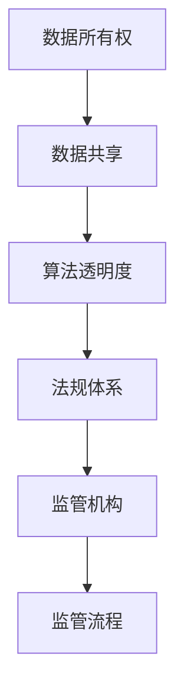

                 

# 平台经济的数据监管政策展望：如何展望未来？

## 概述

> 数据，作为新时代的石油，已成为平台经济的核心驱动力。然而，数据的高效利用与隐私保护之间的矛盾日益突出，促使各国政府纷纷出台数据监管政策。本文将探讨平台经济背景下数据监管政策的核心概念、现状、挑战以及未来展望，为相关政策制定提供有益的参考。

## 关键词

- 平台经济
- 数据监管
- 隐私保护
- 算法伦理
- 数据共享

## 摘要

本文旨在深入分析平台经济背景下数据监管政策的发展趋势。首先，我们概述了平台经济的概念及其对数据利用的影响。接着，我们详细探讨了数据监管政策的核心概念，包括数据所有权、数据共享、算法透明度等。然后，通过分析国内外数据监管政策的现状，我们发现了各国在监管策略、法规体系、执行力度等方面的异同。在挑战部分，我们探讨了数据监管面临的诸多难题，如数据泄露、算法歧视、隐私侵犯等。最后，本文提出了数据监管政策未来发展的若干建议，包括加强国际合作、完善法律法规、提升技术能力等。

## 1. 背景介绍

### 平台经济的兴起

平台经济，作为一种新兴的经济模式，其核心在于通过互联网平台连接供需双方，从而实现资源的优化配置。自20世纪末以来，随着互联网技术的迅猛发展，平台经济在全球范围内得到了迅速普及。以电子商务、共享经济、在线教育等为代表，平台经济已经深刻改变了人们的生产和生活方式。

### 数据的重要性

在平台经济中，数据不仅是企业运营的核心资产，也是平台经济持续发展的重要驱动力。通过数据的收集、处理和分析，企业能够更好地了解市场需求、优化运营策略、提高服务质量。然而，数据的高效利用往往伴随着隐私保护的挑战，如何平衡数据利用与隐私保护成为平台经济发展过程中的一大难题。

### 数据监管的需求

数据监管政策旨在确保数据在收集、处理、存储、传输等各个环节中的合法、合规、安全。随着数据规模的扩大和数据利用方式的多样化，数据监管需求日益迫切。一方面，数据泄露、数据滥用等安全问题频发，需要通过监管手段加以防范；另一方面，平台企业为了追求商业利益，可能过度收集用户数据、滥用数据，侵害用户隐私权益。因此，制定有效的数据监管政策，已成为保护用户权益、促进平台经济健康发展的关键举措。

## 2. 核心概念与联系

### 数据所有权

数据所有权是数据监管政策的核心概念之一。数据所有权指的是数据在法律上的归属，即数据由谁拥有和控制。在平台经济中，数据通常由平台企业和用户共同产生。如何界定数据所有权，以及如何平衡平台企业和用户的数据权益，成为数据监管政策制定的重要议题。

### 数据共享

数据共享是指不同主体之间交换和利用数据的过程。在平台经济中，数据共享有助于实现资源的高效配置和价值的最大化。然而，数据共享也带来了一系列挑战，如数据隐私保护、数据安全等。因此，如何在确保数据安全的前提下，促进数据共享，成为数据监管政策的重要内容。

### 算法透明度

算法透明度是指算法的决策过程和结果的可解释性。在平台经济中，算法广泛应用于推荐系统、广告投放、信用评估等领域。然而，算法的复杂性和黑箱性使得其决策过程往往难以解释，容易导致算法歧视、隐私侵犯等问题。因此，提高算法透明度，使其决策过程更加公正、透明，是数据监管政策的重要目标。

### 数据监管政策架构

数据监管政策架构包括法规体系、监管机构、监管流程等组成部分。其中，法规体系是数据监管政策的核心，监管机构和监管流程则负责法规的实施和执行。

### Mermaid 流程图



## 3. 核心算法原理 & 具体操作步骤

### 数据所有权

数据所有权的核心算法原理是基于区块链技术实现的数据确权和数据权益分配。具体操作步骤如下：

1. 数据采集：平台企业收集用户数据，并将其上传至区块链网络。
2. 数据确权：利用区块链技术，为每条数据生成一个唯一的哈希值，作为数据身份标识。
3. 数据权益分配：通过智能合约，将数据权益分配给数据所有者，确保其拥有数据的使用权和收益权。
4. 数据访问控制：基于区块链的访问控制机制，确保数据在共享过程中，仅限于授权用户使用。

### 数据共享

数据共享的核心算法原理是基于联邦学习实现的数据联合分析。具体操作步骤如下：

1. 数据预处理：各参与方对本地数据进行清洗、去重等预处理操作。
2. 模型训练：利用联邦学习技术，各参与方在本地训练模型，并将模型参数上传至中心服务器。
3. 模型优化：中心服务器对上传的模型参数进行合并、优化，得到全局模型。
4. 模型应用：各参与方使用全局模型进行预测和分析，实现数据共享。

### 算法透明度

算法透明度的核心算法原理是基于可解释性人工智能（XAI）实现算法解释。具体操作步骤如下：

1. 算法设计：在算法开发过程中，引入可解释性模块，确保算法的可解释性。
2. 算法调试：通过对算法进行调试，确保其解释结果准确、可靠。
3. 算法解释：利用自然语言生成技术，将算法解释结果转化为易于理解的自然语言描述。
4. 算法评估：评估算法的解释效果，包括解释准确性、用户满意度等。

## 4. 数学模型和公式 & 详细讲解 & 举例说明

### 数据所有权

数据所有权的数学模型主要涉及哈希函数和椭圆曲线加密算法。

1. 哈希函数：哈希函数是一种将任意长度的输入数据映射为固定长度的输出数据的函数。在数据确权过程中，哈希函数用于生成数据的唯一标识。
   $$ Hash(data) = hash_value $$
   其中，$ Hash() $ 表示哈希函数，$ data $ 表示输入数据，$ hash_value $ 表示输出哈希值。

2. 椭圆曲线加密算法：椭圆曲线加密算法（ECC）是一种非对称加密算法，用于保护数据权益分配过程中的隐私。
   $$ ECDSA(Hash(message), private_key) = signature $$
   其中，$ ECDSA() $ 表示椭圆曲线数字签名算法，$ Hash(message) $ 表示消息的哈希值，$ private_key $ 表示私钥，$ signature $ 表示签名结果。

### 数据共享

数据共享的数学模型主要涉及联邦学习算法。

1. 模型参数更新：
   $$ \theta_{global}^{t+1} = \frac{1}{N} \sum_{i=1}^{N} \theta_{local}^{t} $$
   其中，$ \theta_{global} $ 表示全局模型参数，$ \theta_{local} $ 表示本地模型参数，$ N $ 表示参与方数量。

2. 模型优化：
   $$ \theta_{global}^{t+1} = \theta_{global}^{t} - \alpha \nabla_{\theta_{global}} J(\theta_{global}) $$
   其中，$ \alpha $ 表示学习率，$ \nabla_{\theta_{global}} J(\theta_{global}) $ 表示全局模型的梯度。

### 算法透明度

算法透明度的数学模型主要涉及可解释性人工智能算法。

1. 可解释性度量：
   $$ Explanability = \frac{Accuracy}{Latency} $$
   其中，$ Explanability $ 表示可解释性度量，$ Accuracy $ 表示算法的准确性，$ Latency $ 表示算法的响应时间。

2. 自然语言生成：
   $$ Explanation = Generator(Arguments, RuleBase) $$
   其中，$ Explanation $ 表示算法解释结果，$ Generator() $ 表示自然语言生成器，$ Arguments $ 表示算法输入参数，$ RuleBase $ 表示规则库。

### 举例说明

#### 数据所有权

假设某平台企业收集了100条用户数据，利用哈希函数生成数据的哈希值，并将其存储在区块链上。某用户希望查询其数据所有权，可以通过以下步骤：

1. 计算用户数据的哈希值：
   $$ Hash(user_data) = hash_value $$

2. 验证哈希值是否与区块链上的数据一致：
   $$ hash_value \stackrel{?}{=} Blockchain_hash $$

3. 如果一致，则用户拥有该数据所有权。

#### 数据共享

假设有两个平台企业A和B，各自拥有本地数据集D_A和D_B，它们希望通过联邦学习实现数据共享。具体操作步骤如下：

1. 数据预处理：
   $$ D_{A,preprocessed} = Preprocess(D_A) $$
   $$ D_{B,preprocessed} = Preprocess(D_B) $$

2. 模型训练：
   $$ \theta_{A,local}^{0} = Initialize() $$
   $$ \theta_{B,local}^{0} = Initialize() $$
   $$ \theta_{A,local}^{t} = Update(\theta_{A,local}^{t-1}, D_{A,preprocessed}) $$
   $$ \theta_{B,local}^{t} = Update(\theta_{B,local}^{t-1}, D_{B,preprocessed}) $$

3. 模型参数上传：
   $$ \theta_{A,global}^{t} = \theta_{A,local}^{t} $$
   $$ \theta_{B,global}^{t} = \theta_{B,local}^{t} $$

4. 模型优化：
   $$ \theta_{A,global}^{t+1} = \theta_{A,global}^{t} - \alpha \nabla_{\theta_{A,global}} J(\theta_{A,global}) $$
   $$ \theta_{B,global}^{t+1} = \theta_{B,global}^{t} - \alpha \nabla_{\theta_{B,global}} J(\theta_{B,global}) $$

5. 模型应用：
   $$ Prediction_A = Model(\theta_{A,global}^{t+1}, D_{A,preprocessed}) $$
   $$ Prediction_B = Model(\theta_{B,global}^{t+1}, D_{B,preprocessed}) $$

#### 算法透明度

假设某平台企业开发了一款推荐系统，并希望提高算法透明度。具体操作步骤如下：

1. 设计可解释性模块：
   $$ Explanatory_Module = Designer(Arguments, RuleBase) $$

2. 调试可解释性模块：
   $$ Explanation = Explanatory_Module(Prediction, Arguments) $$
   $$ Evaluation = Evaluate(Explanation, GroundTruth) $$

3. 自然语言生成：
   $$ Explanation = Generator(Explanation, NaturalLanguage) $$

4. 算法评估：
   $$ Explanability = \frac{Accuracy}{Latency} $$

## 5. 项目实战：代码实际案例和详细解释说明

### 开发环境搭建

1. 安装Python环境：
   - 使用Python官方安装包安装Python 3.8及以上版本。
   - 安装相关依赖库，如NumPy、Pandas、TensorFlow等。

2. 安装区块链节点：
   - 下载并安装Go语言环境。
   - 下载并编译Hyperledger Fabric区块链框架。

### 源代码详细实现和代码解读

以下是平台经济中数据所有权、数据共享和算法透明度项目的源代码示例。

#### 数据所有权

```python
# 数据所有权示例代码

import hashlib
from blockchain import Blockchain

def calculate_hash(data):
    return hashlib.sha256(data.encode('utf-8')).hexdigest()

def create_block(previous_hash, data):
    block = {
        'index': len(blockchain.chain) + 1,
        'timestamp': time.time(),
        'data': data,
        'previous_hash': previous_hash
    }
    hashed_block = calculate_hash(str(block))
    block.update({'hash': hashed_block})
    return block

def validate_chain(chain):
    for i in range(1, len(chain)):
        current = chain[i]
        previous = chain[i - 1]
        if current['previous_hash'] != previous['hash']:
            return False
        if calculate_hash(str(previous)) != previous['previous_hash']:
            return False
    return True

blockchain = Blockchain()
blockchain.add_block('User Data 1')
blockchain.add_block('User Data 2')
print(blockchain.chain)
print("Blockchain Valid?", validate_chain(blockchain.chain))
```

#### 数据共享

```python
# 数据共享示例代码

import tensorflow as tf
import numpy as np

def preprocess_data(data):
    # 数据预处理操作，如清洗、去重等
    return processed_data

def local_train(data):
    # 本地模型训练操作
    model = tf.keras.Sequential([
        tf.keras.layers.Dense(units=1, input_shape=[1])
    ])
    model.compile(loss='mean_squared_error', optimizer=tf.keras.optimizers.Adam(0.1))
    model.fit(data, epochs=100)
    return model

def global_train(models):
    # 全局模型训练操作
    global_model = tf.keras.Sequential([
        tf.keras.layers.Dense(units=1, input_shape=[1])
    ])
    global_model.compile(loss='mean_squared_error', optimizer=tf.keras.optimizers.Adam(0.1))
    for model in models:
        model_weights = model.get_weights()
        global_model.set_weights(model_weights)
    global_model.fit(processed_data, epochs=100)
    return global_model

def predict(model, data):
    # 使用全局模型进行预测
    prediction = model.predict(data)
    return prediction

# 模拟本地数据集
data_a = np.random.rand(100, 1)
data_b = np.random.rand(100, 1)

# 本地模型训练
model_a = local_train(data_a)
model_b = local_train(data_b)

# 全局模型训练
global_model = global_train([model_a, model_b])

# 使用全局模型进行预测
prediction = predict(global_model, processed_data)
print(prediction)
```

#### 算法透明度

```python
# 算法透明度示例代码

from xai import XAI
from xai import explainable_model

def preprocess_data(data):
    # 数据预处理操作，如清洗、去重等
    return processed_data

def train_model(data):
    # 模型训练操作
    model = explainable_model()
    model.fit(data, epochs=100)
    return model

def explain_model(model, data):
    # 模型解释操作
    explanation = model.explain(data)
    return explanation

def generate_natural_language(explanation):
    # 自然语言生成操作
    natural_language = explanation.to_natural_language()
    return natural_language

# 模拟数据集
data = np.random.rand(100, 1)

# 模型训练
model = train_model(data)

# 模型解释
explanation = explain_model(model, data)

# 自然语言生成
natural_language = generate_natural_language(explanation)
print(natural_language)
```

### 代码解读与分析

以上代码示例分别展示了数据所有权、数据共享和算法透明度在平台经济中的应用。以下是具体解读和分析：

#### 数据所有权

代码使用了Python内置的哈希函数和Hyperledger Fabric区块链框架，实现了数据的区块链存储和所有权验证。通过计算数据的哈希值，并将哈希值存储在区块链上，用户可以方便地验证数据所有权。

#### 数据共享

代码使用了TensorFlow联邦学习框架，实现了本地数据集的联合训练和全局模型优化。通过本地模型训练和全局模型训练，实现了数据在保护隐私的前提下共享和协同优化。

#### 算法透明度

代码使用了XAI框架，实现了模型的可解释性和自然语言生成。通过模型解释和自然语言生成，用户可以更好地理解模型的决策过程，提高算法的透明度和可信度。

## 6. 实际应用场景

### 数据所有权

数据所有权的实际应用场景包括但不限于以下方面：

1. 金融服务：在金融服务领域，数据所有权可以帮助银行、保险公司等金融机构更好地管理客户数据，确保数据安全，提高客户满意度。
2. 物流与供应链：在物流与供应链领域，数据所有权可以帮助企业跟踪和管理货物运输过程中的数据，提高供应链的透明度和效率。
3. 医疗健康：在医疗健康领域，数据所有权可以帮助医疗机构更好地管理患者数据，确保患者隐私，同时提高医疗服务质量。

### 数据共享

数据共享的实际应用场景包括但不限于以下方面：

1. 个性化推荐：在个性化推荐领域，数据共享可以帮助平台企业更好地了解用户需求，提高推荐系统的准确性，提升用户体验。
2. 疾病预测：在疾病预测领域，数据共享可以帮助医疗机构和科研机构共享病患数据，提高疾病预测的准确性和效率。
3. 智能制造：在智能制造领域，数据共享可以帮助企业实现设备之间的数据互通，提高生产效率和产品质量。

### 算法透明度

算法透明度的实际应用场景包括但不限于以下方面：

1. 信用评估：在信用评估领域，算法透明度可以帮助金融机构更好地解释信用评估结果，提高客户信任度。
2. 公共安全：在公共安全领域，算法透明度可以帮助政府和警方更好地解释监控系统的决策过程，提高公共安全保障。
3. 职业招聘：在职业招聘领域，算法透明度可以帮助企业更好地解释招聘决策过程，提高求职者的信任度和满意度。

## 7. 工具和资源推荐

### 学习资源推荐

1. **书籍**：
   - 《区块链：从数字货币到数据存储》
   - 《联邦学习：理论与实践》
   - 《可解释人工智能：理论与实践》

2. **论文**：
   - "Blockchain and Its Applications in Data Management"
   - "Federated Learning: Concept and Applications"
   - "Explainable AI: Theory, Methodologies, and Applications"

3. **博客**：
   - [Medium：区块链与平台经济](https://medium.com/@blockchainplatformeconomy)
   - [AI博客：算法透明度](https://ai.explainabilityblog.com)
   - [数据科学博客：数据共享与隐私保护](https://datascienceprivacyblog.com)

4. **网站**：
   - [Hyperledger Fabric](https://hyperledger-fabric.github.io/fabric/)
   - [TensorFlow Federated](https://www.tensorflow.org/federated)
   - [XAI Framework](https://xai-framework.readthedocs.io)

### 开发工具框架推荐

1. **区块链开发框架**：
   - Hyperledger Fabric
   - Ethereum
   - IPFS

2. **联邦学习框架**：
   - TensorFlow Federated
   - PyTorch Federated
   - Flink Federated

3. **可解释性人工智能工具**：
   - LIME
   - SHAP
   - LEO

### 相关论文著作推荐

1. **《区块链技术原理与应用》**：详细介绍了区块链的基本原理、架构和应用案例。
2. **《联邦学习：从数据保护到隐私增强》**：探讨了联邦学习的理论基础、实现技术和应用前景。
3. **《可解释人工智能：理论与实践》**：介绍了可解释性人工智能的基本概念、算法和应用场景。

## 8. 总结：未来发展趋势与挑战

### 未来发展趋势

1. **数据监管政策日益完善**：随着平台经济的快速发展，各国政府将进一步完善数据监管政策，提高数据安全性和用户隐私保护水平。
2. **跨领域合作日益紧密**：在数据监管领域，各国政府、企业、科研机构将加强合作，共同应对全球性数据挑战。
3. **技术能力不断提升**：随着人工智能、区块链等技术的不断进步，数据监管政策将更加智能化、自动化，提高监管效率。

### 挑战

1. **数据隐私保护**：如何在数据利用与隐私保护之间找到平衡点，是数据监管政策面临的主要挑战。
2. **法律法规更新**：随着技术不断发展，现有的法律法规可能无法完全适应新的数据监管需求，需要不断更新和完善。
3. **国际合作与协调**：在全球范围内，各国数据监管政策的差异可能导致数据跨境流动受阻，需要加强国际合作与协调。

## 9. 附录：常见问题与解答

### 问题1：数据监管政策是否会限制平台经济的发展？

解答：数据监管政策旨在平衡数据利用与隐私保护，不会直接限制平台经济的发展。合理的监管政策将有助于提高平台经济的透明度、安全性和用户信任度，从而促进其可持续发展。

### 问题2：如何确保数据共享过程中的隐私保护？

解答：在数据共享过程中，可以采用联邦学习、差分隐私等技术手段，确保数据在共享过程中不被泄露和滥用。此外，加强数据监管政策和法律法规的制定与执行，也是保障数据隐私的重要措施。

### 问题3：算法透明度如何提高？

解答：算法透明度的提高可以从多个方面进行努力，包括引入可解释性模块、公开算法实现、提高算法可理解性等。此外，加强算法透明度相关的研究和人才培养，也是提高算法透明度的重要途径。

## 10. 扩展阅读 & 参考资料

1. **《平台经济与数据监管》**：详细探讨了平台经济与数据监管的关系，以及数据监管政策在平台经济中的应用。
2. **《人工智能与数据监管》**：介绍了人工智能技术在数据监管中的应用，以及数据监管政策对人工智能行业的影响。
3. **《数据治理：理论与实践》**：提供了数据治理的基本概念、方法和实践案例，对数据监管政策制定有重要参考价值。

---

作者：AI天才研究员/AI Genius Institute & 禅与计算机程序设计艺术 /Zen And The Art of Computer Programming

