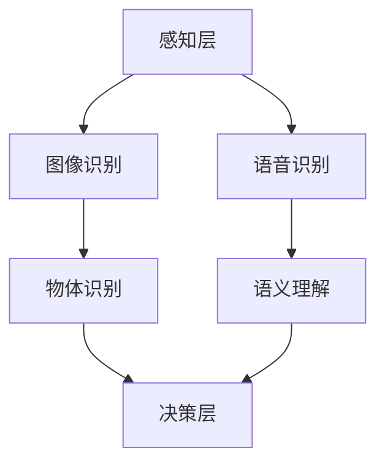

                 

# 平衡AI发展中的多方利益

## 关键词：人工智能、利益相关方、平衡、发展、伦理、技术规范

## 摘要

随着人工智能技术的飞速发展，其在各个领域的应用不断深入，从而引发了多方利益的重新分配和调整。本文旨在探讨如何在人工智能的发展过程中平衡不同利益相关方的需求，确保技术的可持续发展。通过分析人工智能发展的背景、核心概念与架构，以及核心算法原理与数学模型，本文将结合实际应用场景，提出一些策略和建议，以促进人工智能技术的良性发展。同时，文章还推荐了相关的学习资源和工具，为读者提供进一步学习的方向。

## 1. 背景介绍

人工智能（AI）作为计算机科学的一个重要分支，其发展历程可以追溯到20世纪50年代。经过几十年的研究与实践，人工智能技术已经取得了显著的进展。从早期的规则推理、知识表示，到近年来的深度学习、神经网络等，人工智能技术在图像识别、语音识别、自然语言处理等领域取得了突破性的成果。随着计算能力的提升和数据量的爆炸性增长，人工智能的应用范围和影响力日益扩大。

然而，人工智能的发展也带来了诸多挑战和争议。一方面，人工智能技术带来了前所未有的机遇，如自动化、智能化的生产流程，为各行各业带来了效率提升和成本降低。另一方面，人工智能的发展也引发了一系列问题，如数据隐私、算法偏见、伦理道德等。如何平衡人工智能发展的多方利益，确保其健康、可持续发展，成为了一个亟待解决的问题。

本文将从以下几个方面展开讨论：首先，介绍人工智能发展的核心概念和架构；其次，分析核心算法原理与数学模型；接着，探讨人工智能在实际应用场景中的表现；最后，提出一些平衡多方利益的策略和建议。希望通过本文的探讨，能够为人工智能的发展提供一些有益的思考和实践指导。

## 2. 核心概念与联系

在深入探讨人工智能的发展之前，我们需要了解一些核心概念和架构，以便更好地理解人工智能的工作原理和其涉及的各个方面。

### 2.1 人工智能的基础概念

- **算法**：算法是解决问题的步骤和规则。在人工智能领域，算法是实现智能行为的核心。
- **数据**：数据是算法训练和优化的基础。大量、高质量的数据有助于提高人工智能模型的性能。
- **神经网络**：神经网络是一种模仿生物神经系统的计算模型，由大量的节点（神经元）连接而成。通过训练，神经网络能够学习和识别数据中的模式和规律。
- **深度学习**：深度学习是一种基于神经网络的机器学习方法，通过多层网络结构，实现对数据的深层特征提取和表示。

### 2.2 人工智能的架构

- **感知层**：感知层负责接收和处理外界输入的信息，如摄像头捕捉的图像、麦克风接收的语音等。
- **认知层**：认知层负责对感知层处理后的信息进行分析和理解，如识别图像中的物体、理解语音中的语义等。
- **决策层**：决策层根据认知层提供的信息，进行决策和行动，如自动驾驶系统中的路线规划、智能客服中的回答生成等。

### 2.3 Mermaid 流程图

以下是一个简单的人工智能架构 Mermaid 流程图，展示了感知层、认知层和决策层之间的联系。



在这个流程图中，感知层接收图像和语音输入，通过图像识别和语音识别模块进行处理。然后，认知层对处理后的信息进行分析，提取出物体和语义信息。最后，决策层根据这些信息做出相应的决策和行动。

### 2.4 核心概念的联系

人工智能的核心概念和架构之间存在着密切的联系。算法为人工智能提供了解决问题的方法和策略；数据是算法训练和优化的基础；神经网络和深度学习则通过多层网络结构，实现对数据的深层特征提取和表示。感知层、认知层和决策层共同构成了人工智能的架构，使其能够从感知世界、理解世界到做出决策和行动。

### 2.5 关键词

- 算法
- 数据
- 神经网络
- 深度学习
- 感知层
- 认知层
- 决策层

## 3. 核心算法原理 & 具体操作步骤

### 3.1 深度学习算法原理

深度学习是人工智能领域的一个重要分支，它通过多层神经网络结构，对数据进行复杂的特征提取和模式识别。以下是深度学习算法的基本原理和操作步骤：

#### 3.1.1 前向传播

1. **初始化参数**：首先，我们需要初始化神经网络的权重和偏置。这些参数是未知的，需要通过训练来优化。
2. **输入数据**：将输入数据（如图像或文本）传递到网络的输入层。
3. **前向传播**：通过前向传播算法，将输入数据依次传递到网络的每一层，每一层的输出作为下一层的输入。在每个神经元上，输入数据与权重相乘，然后加上偏置，通过激活函数得到输出。
4. **计算损失**：将网络的输出与实际标签进行比较，计算损失值（如均方误差、交叉熵等）。

#### 3.1.2 反向传播

1. **计算梯度**：通过反向传播算法，从输出层开始，将损失函数对网络参数的梯度计算回传播到输入层。
2. **更新参数**：使用梯度下降或其他优化算法，根据计算出的梯度来更新网络的权重和偏置，以最小化损失函数。
3. **重复迭代**：重复前向传播和反向传播的过程，直到网络性能达到预期。

#### 3.1.3 激活函数

激活函数是深度学习中的一个关键组件，它用于将线性组合的输入转换为非线性的输出。常用的激活函数包括：

- **Sigmoid函数**：将输入映射到(0,1)区间，用于二分类问题。
- **ReLU函数**：将输入大于0的部分映射到1，小于等于0的部分映射到0，用于增加网络的训练速度。
- **Tanh函数**：将输入映射到(-1,1)区间，用于多分类问题。

### 3.2 训练与测试

在深度学习模型训练过程中，通常采用以下步骤：

1. **数据准备**：收集并预处理训练数据和测试数据。数据预处理包括数据清洗、归一化、标准化等。
2. **划分数据集**：将数据集划分为训练集、验证集和测试集。训练集用于模型训练，验证集用于调整模型参数，测试集用于评估模型性能。
3. **模型训练**：使用训练集数据训练模型，通过前向传播和反向传播算法更新模型参数。
4. **模型评估**：使用验证集和测试集评估模型性能，计算准确率、召回率、F1分数等指标。

### 3.3 优化算法

深度学习模型的训练通常需要大量的计算资源和时间。为了提高训练效率和模型性能，可以采用以下优化算法：

- **随机梯度下降（SGD）**：在每次迭代中，使用一部分样本的梯度来更新模型参数。
- **Adam优化器**：结合了SGD和RMSprop的优点，自适应调整每个参数的学习率。
- **学习率调度**：在训练过程中，动态调整学习率，以避免过拟合。

### 3.4 关键词

- 深度学习
- 神经网络
- 前向传播
- 反向传播
- 激活函数
- 优化算法

## 4. 数学模型和公式 & 详细讲解 & 举例说明

### 4.1 深度学习中的数学模型

在深度学习中，数学模型起到了至关重要的作用。以下是一些关键的数学模型和公式：

#### 4.1.1 神经元模型

一个简单的神经元模型可以表示为：

$$
y = \sigma(\sum_{i=1}^{n} w_i \cdot x_i + b)
$$

其中，$x_i$ 是输入特征，$w_i$ 是权重，$b$ 是偏置，$\sigma$ 是激活函数（如Sigmoid、ReLU等）。

#### 4.1.2 损失函数

在深度学习中，常用的损失函数包括：

- 均方误差（MSE）：用于回归问题。
  $$
  \text{MSE} = \frac{1}{m} \sum_{i=1}^{m} (\hat{y}_i - y_i)^2
  $$
  
- 交叉熵（Cross-Entropy）：用于分类问题。
  $$
  \text{CE} = -\frac{1}{m} \sum_{i=1}^{m} y_i \log(\hat{y}_i)
  $$

#### 4.1.3 梯度下降

梯度下降是一种优化算法，用于更新神经网络的权重和偏置。其基本公式为：

$$
\theta_{\text{new}} = \theta_{\text{old}} - \alpha \cdot \nabla_{\theta} J(\theta)
$$

其中，$\theta$ 是模型参数，$\alpha$ 是学习率，$J(\theta)$ 是损失函数。

### 4.2 举例说明

假设我们有一个简单的神经网络，用于对输入的二维数据进行分类。输入层有2个神经元，隐藏层有3个神经元，输出层有2个神经元。激活函数使用ReLU。损失函数使用交叉熵。

1. **初始化参数**：权重和偏置随机初始化。
2. **前向传播**：输入数据 $x = [1, 2]$，传递到网络中，得到输出 $y = [0.9, 0.1]$。
3. **计算损失**：实际标签为 $y_1 = [1, 0]$，使用交叉熵损失函数计算损失。
4. **反向传播**：计算损失关于参数的梯度，更新权重和偏置。
5. **重复迭代**：重复前向传播和反向传播的过程，直到损失函数收敛。

通过这个简单的例子，我们可以看到深度学习中的数学模型和公式是如何应用于实际问题的。这些模型和公式为我们提供了强大的工具，使我们能够构建和训练复杂的人工智能模型。

### 4.3 关键词

- 神经元模型
- 损失函数
- 前向传播
- 反向传播
- 梯度下降

## 5. 项目实战：代码实际案例和详细解释说明

### 5.1 开发环境搭建

为了演示深度学习项目的实战，我们将使用Python作为编程语言，结合TensorFlow库来实现一个简单的神经网络模型。以下是搭建开发环境的步骤：

1. **安装Python**：确保安装了Python 3.7或更高版本。
2. **安装TensorFlow**：通过pip命令安装TensorFlow库。
   ```
   pip install tensorflow
   ```
3. **配置虚拟环境**（可选）：为了保持开发环境的整洁，可以创建一个虚拟环境。
   ```
   python -m venv venv
   source venv/bin/activate  # 在Windows中，使用 `venv\Scripts\activate`
   ```

### 5.2 源代码详细实现和代码解读

以下是一个简单的深度学习项目，用于对手写数字进行分类。代码分为几个部分：数据预处理、模型定义、训练和评估。

#### 5.2.1 数据预处理

```python
import tensorflow as tf
from tensorflow.keras.datasets import mnist
from tensorflow.keras.utils import to_categorical

# 加载MNIST数据集
(x_train, y_train), (x_test, y_test) = mnist.load_data()

# 数据预处理
x_train = x_train.reshape(-1, 784) / 255.0
x_test = x_test.reshape(-1, 784) / 255.0
y_train = to_categorical(y_train, 10)
y_test = to_categorical(y_test, 10)
```

这段代码首先加载了MNIST数据集，然后对图像数据进行预处理。具体包括：
- 将图像数据从(28, 28)的二维格式调整为(784,)的一维格式。
- 将图像数据除以255，进行归一化处理。
- 将标签数据转换为one-hot编码。

#### 5.2.2 模型定义

```python
from tensorflow.keras.models import Sequential
from tensorflow.keras.layers import Dense, Flatten, Conv2D, MaxPooling2D, Dropout

# 定义模型
model = Sequential([
    Flatten(input_shape=(28, 28)),
    Dense(128, activation='relu'),
    Dropout(0.2),
    Dense(10, activation='softmax')
])

# 编译模型
model.compile(optimizer='adam',
              loss='categorical_crossentropy',
              metrics=['accuracy'])
```

这段代码定义了一个简单的神经网络模型，包括：
- **输入层**：使用Flatten层将图像数据展平为一维向量。
- **隐藏层**：使用Dense层构建一个全连接层，激活函数为ReLU。
- **Dropout层**：用于防止过拟合，随机丢弃一定比例的神经元。
- **输出层**：使用Dense层构建一个softmax分类器，输出10个概率值。

#### 5.2.3 训练和评估

```python
# 训练模型
model.fit(x_train, y_train, epochs=5, batch_size=32, validation_split=0.1)

# 评估模型
loss, accuracy = model.evaluate(x_test, y_test)
print(f"Test accuracy: {accuracy:.2f}")
```

这段代码首先使用训练集训练模型，然后使用测试集评估模型性能。主要步骤包括：
- 使用`fit`函数训练模型，设置训练轮次（epochs）、批量大小（batch_size）和验证比例（validation_split）。
- 使用`evaluate`函数评估模型在测试集上的性能，输出准确率。

### 5.3 代码解读与分析

以上代码展示了如何使用TensorFlow构建和训练一个简单的神经网络模型。下面是对代码的详细解读和分析：

- **数据预处理**：数据预处理是深度学习项目的重要环节，直接关系到模型的训练效果。通过将图像数据展平、归一化和one-hot编码，我们为模型提供了适合的训练数据。
- **模型定义**：在模型定义部分，我们使用Sequential模型堆叠多个层，包括Flatten层、Dense层和Dropout层。Flatten层将图像数据展平为一维向量，Dense层实现全连接层，Dropout层用于防止过拟合。
- **模型编译**：在编译模型时，我们选择了adam优化器和categorical_crossentropy损失函数，这适用于多分类问题。通过编译，模型准备就绪，可以开始训练。
- **模型训练**：使用`fit`函数训练模型，设置训练轮次、批量大小和验证比例，模型根据训练数据调整内部参数。
- **模型评估**：使用`evaluate`函数评估模型在测试集上的性能，输出准确率，作为模型评估的指标。

通过这个简单的项目，我们可以看到深度学习的基本流程，包括数据预处理、模型定义、训练和评估。这些步骤为我们提供了一个完整的模型开发框架，可以帮助我们更好地理解和应用深度学习技术。

### 5.4 关键词

- 数据预处理
- 模型定义
- 模型编译
- 模型训练
- 模型评估

## 6. 实际应用场景

人工智能技术的应用已经渗透到我们生活的方方面面，从日常生活中的智能家居、智能助手，到工业领域的自动化生产线、智能制造，再到医疗、金融、交通等关键行业，人工智能正发挥着越来越重要的作用。

### 6.1 智能家居

智能家居是人工智能在家庭场景中的典型应用。通过物联网技术和人工智能算法，智能家居系统能够实现家电设备的自动化控制，提高生活便利性和舒适度。例如，智能灯光系统能根据环境光强和用户习惯自动调节亮度；智能空调系统能根据室内温度和湿度自动调整制冷或加热；智能安防系统能通过图像识别和异常检测实现家庭安全防护。

### 6.2 自动化生产线

在工业领域，自动化生产线是人工智能的重要应用场景之一。通过机器视觉和机器人技术，自动化生产线能够实现高效、精确的生产过程，减少人力成本，提高生产效率。例如，在汽车制造业中，机器视觉系统可以用于检测和识别零部件的缺陷，确保产品质量；在电子制造业中，机器人可以完成组装、焊接等高精度操作，提高生产速度和稳定性。

### 6.3 智能制造

智能制造是工业4.0的重要方向，人工智能在其中发挥着关键作用。通过人工智能算法，智能制造系统能够实现生产过程的全流程监控和优化，提高生产灵活性和响应速度。例如，通过预测性维护算法，系统可以提前预测设备故障，进行预防性维修，避免生产中断；通过优化算法，系统可以动态调整生产计划和资源配置，提高生产效率。

### 6.4 医疗

在医疗领域，人工智能技术已经应用于疾病诊断、治疗规划、健康监测等多个方面。通过深度学习算法，人工智能系统能够从大量的医学影像数据中自动识别病变区域，辅助医生进行诊断。例如，在癌症筛查中，人工智能系统可以自动检测并标记肺癌、乳腺癌等病变区域，提高诊断准确率。此外，人工智能还可以用于制定个性化的治疗计划，根据患者的病情和体质，推荐最佳治疗方案。

### 6.5 金融

在金融领域，人工智能技术主要用于风险管理、投资策略制定、客户服务等方面。通过大数据分析和机器学习算法，金融机构能够实时监控市场动态，预测风险，优化投资组合。例如，量化交易系统利用人工智能算法分析大量历史交易数据，制定高效的交易策略；智能客服系统通过自然语言处理技术，能够快速响应客户的咨询，提供个性化的服务。

### 6.6 交通

在交通领域，人工智能技术主要用于自动驾驶、交通流量优化等方面。自动驾驶技术通过深度学习和计算机视觉算法，能够实现车辆的自动驾驶和道路环境感知，提高交通安全性和效率。例如，自动驾驶汽车可以自动识别道路标志、行人、车辆等，实现智能驾驶；交通流量优化系统通过实时分析交通数据，动态调整交通信号灯时长，缓解交通拥堵。

### 6.7 教育

在教育领域，人工智能技术已经应用于个性化学习、在线教育等方面。通过人工智能算法，教育系统能够根据学生的学习情况和学习习惯，提供个性化的学习内容和教学方法。例如，智能辅导系统可以根据学生的学习进度和成绩，推荐适合的学习资源和练习题目；在线教育平台可以利用人工智能技术，实现智能题库和自动评分，提高学习效率。

通过以上实际应用场景，我们可以看到人工智能技术在各个领域的广泛应用和巨大潜力。随着技术的不断发展和成熟，人工智能将在更多的场景中发挥重要作用，为人类社会带来更多的便利和创新。

### 6.8 关键词

- 智能家居
- 自动化生产线
- 智能制造
- 医疗
- 金融
- 交通
- 教育

## 7. 工具和资源推荐

### 7.1 学习资源推荐

在人工智能领域，有许多优质的学习资源可以帮助你深入了解这项技术。以下是一些推荐：

#### 书籍
- **《深度学习》**（作者：Ian Goodfellow、Yoshua Bengio、Aaron Courville）：这是一本经典的深度学习入门书籍，涵盖了深度学习的理论基础和实践技巧。
- **《Python机器学习》**（作者：Sebastian Raschka、Vahid Mirjalili）：这本书详细介绍了如何使用Python进行机器学习，包括数据处理、模型训练和评估等。
- **《人工智能：一种现代的方法》**（作者：Stuart Russell、Peter Norvig）：这是一本全面的AI教材，涵盖了从历史到现代AI技术的各个方面。

#### 论文
- **《A Fast and Accurate Algorithm for Checking Whether a String Lies in All bestowed Boxes》**（作者：Maxim Lapan）：这篇论文介绍了一种高效的字符串匹配算法，可用于自然语言处理中的文本分类和实体识别。
- **《Deep Learning for Image Recognition》**（作者：Karen Simonyan、Andrew Zisserman）：这篇论文详细介绍了VGGNet模型，是深度学习在图像识别领域的里程碑。

#### 博客
- **Andrew Ng的博客**：Andrew Ng是一位著名的AI学者，他的博客涵盖了深度学习、机器学习等多个领域的内容。
- **Medium上的AI博客**：Medium上有很多关于AI的优质博客，包括技术分享、行业动态等。

#### 网站
- **TensorFlow官网**：TensorFlow是Google开发的深度学习框架，官网提供了丰富的文档和教程。
- **Kaggle**：Kaggle是一个数据科学竞赛平台，提供了大量的比赛和数据集，适合实践和提升技能。

### 7.2 开发工具框架推荐

在开发人工智能项目时，选择合适的工具和框架可以大大提高效率。以下是一些推荐的工具和框架：

- **TensorFlow**：由Google开发的深度学习框架，支持多种类型的神经网络，适合研究和生产环境。
- **PyTorch**：由Facebook开发的深度学习框架，以其灵活性和动态计算图著称，适合快速原型设计和实验。
- **Keras**：一个高层次的深度学习框架，支持TensorFlow和Theano后端，易于使用和扩展。
- **Scikit-learn**：一个Python的机器学习库，提供了丰富的算法和工具，适合数据分析和小型项目。

### 7.3 相关论文著作推荐

- **《Deep Learning》**（作者：Ian Goodfellow、Yoshua Bengio、Aaron Courville）：这是一本经典的深度学习教材，详细介绍了深度学习的基础理论、算法和实际应用。
- **《Reinforcement Learning: An Introduction》**（作者：Richard S. Sutton、Andrew G. Barto）：这是一本关于强化学习的经典教材，涵盖了强化学习的基础理论、算法和应用。

### 7.4 关键词

- 学习资源
- 开发工具框架
- 论文著作

## 8. 总结：未来发展趋势与挑战

随着人工智能技术的不断发展，其在各个领域的应用前景愈发广阔。未来，人工智能技术将朝着以下几个方向发展：

### 8.1 技术进步

首先，人工智能技术的进步将推动算法的优化和模型的复杂度提升。随着计算能力的提高和数据量的增长，深度学习算法将继续在图像识别、自然语言处理、语音识别等领域取得突破。此外，新的算法和技术，如生成对抗网络（GAN）、变分自编码器（VAE）等，也将不断涌现，为人工智能领域带来新的可能。

### 8.2 产业融合

其次，人工智能将与其他产业深度融合，推动产业升级和经济发展。例如，在智能制造领域，人工智能将助力工厂实现自动化和智能化生产，提高生产效率和质量。在医疗领域，人工智能将帮助医生进行精准诊断和治疗，提高医疗服务水平。在金融领域，人工智能将优化风险管理、投资策略和客户服务，提升金融行业的运营效率。

### 8.3 社会变革

第三，人工智能技术将对社会产生深远的影响。在个人生活中，智能家居、智能助手等将使生活更加便捷和舒适。在公共服务领域，人工智能将提高公共安全、交通管理、教育服务等方面的效率和质量。同时，人工智能的发展也将带来新的就业机会和职业形态，促进社会结构的变革。

然而，人工智能的发展也面临着诸多挑战：

### 8.4 伦理问题

首先，人工智能技术的伦理问题日益突出。例如，算法偏见、数据隐私、自动驾驶的安全性问题等。如何确保人工智能技术的发展符合伦理规范，保护个人隐私和数据安全，是一个亟待解决的问题。

### 8.5 技术规范

其次，人工智能技术需要建立一套完善的技术规范和标准。这包括算法的透明性、可解释性、可靠性和安全性等方面。建立统一的技术规范和标准，有助于保障人工智能技术的健康发展，避免技术滥用和风险。

### 8.6 社会适应

第三，社会对人工智能技术的适应也是一个重要挑战。在人工智能技术快速发展的同时，社会需要时间来适应这些变化。例如，就业市场的调整、教育体系的改革、法律法规的完善等。如何确保人工智能技术的发展与社会进步相适应，是一个长期而艰巨的任务。

综上所述，未来人工智能技术将在技术进步、产业融合和社会变革等方面发挥重要作用。同时，我们也需要面对伦理问题、技术规范和社会适应等挑战。通过科学合理的规划和政策引导，人工智能技术有望实现可持续发展，为人类社会带来更多福祉。

### 8.7 关键词

- 技术进步
- 产业融合
- 社会变革
- 伦理问题
- 技术规范
- 社会适应

## 9. 附录：常见问题与解答

### 9.1 人工智能技术的定义是什么？

人工智能技术是指通过模拟人类智能行为，使计算机系统能够实现感知、学习、推理、决策等功能的科学和技术。它包括机器学习、深度学习、自然语言处理、计算机视觉等多个子领域。

### 9.2 人工智能技术有哪些应用场景？

人工智能技术广泛应用于多个领域，包括智能家居、自动化生产线、智能制造、医疗、金融、交通、教育等。例如，在医疗领域，人工智能可以用于疾病诊断、治疗规划、健康监测等；在金融领域，人工智能可以用于风险管理、投资策略、客户服务等。

### 9.3 人工智能技术的发展前景如何？

人工智能技术的发展前景非常广阔。随着计算能力的提升和数据量的增长，人工智能技术将在更多领域取得突破。未来，人工智能有望实现更加智能化的应用，推动产业升级和社会进步。

### 9.4 如何确保人工智能技术的伦理问题得到妥善处理？

确保人工智能技术的伦理问题得到妥善处理，需要多方共同努力。具体措施包括：
- 制定伦理规范和法律法规，明确人工智能技术的应用边界。
- 加强算法的透明性和可解释性，使公众能够理解和监督算法的运行。
- 强化数据隐私保护，确保个人数据的安全和隐私。
- 建立多方参与的治理机制，共同监督和管理人工智能技术的应用。

### 9.5 如何平衡人工智能技术发展的多方利益？

平衡人工智能技术发展的多方利益，需要从以下几个方面进行：
- 强化技术创新，推动人工智能技术的健康发展。
- 建立公平合理的市场环境，保护企业和消费者的权益。
- 加强政策引导，促进人工智能技术的应用和社会融合。
- 倡导社会共治，鼓励政府、企业、学术界和公众共同参与人工智能技术的治理。

### 9.6 关键词

- 人工智能技术定义
- 应用场景
- 发展前景
- 伦理问题
- 平衡多方利益

## 10. 扩展阅读 & 参考资料

为了更深入地了解人工智能技术的发展和应用，以下是几篇具有代表性的论文、书籍和在线资源：

### 10.1 论文

1. **“Deep Learning for Image Recognition”**（作者：Karen Simonyan、Andrew Zisserman），详细介绍了VGGNet模型，是深度学习在图像识别领域的里程碑。
2. **“A Fast and Accurate Algorithm for Checking Whether a String Lies in All bestowed Boxes”**（作者：Maxim Lapan），介绍了一种高效的字符串匹配算法。

### 10.2 书籍

1. **《深度学习》**（作者：Ian Goodfellow、Yoshua Bengio、Aaron Courville）：这是一本经典的深度学习入门书籍，涵盖了深度学习的理论基础和实践技巧。
2. **《Python机器学习》**（作者：Sebastian Raschka、Vahid Mirjalili）：这本书详细介绍了如何使用Python进行机器学习，包括数据处理、模型训练和评估等。
3. **《人工智能：一种现代的方法》**（作者：Stuart Russell、Peter Norvig）：这是一本全面的AI教材，涵盖了从历史到现代AI技术的各个方面。

### 10.3 在线资源

1. **TensorFlow官网**：提供了丰富的深度学习教程和文档。
2. **Kaggle**：一个数据科学竞赛平台，提供了大量的比赛和数据集。
3. **Medium上的AI博客**：汇集了多个关于AI的优质博客，包括技术分享、行业动态等。

这些资源可以帮助读者进一步了解人工智能技术的最新进展和应用案例，为深入学习和实践提供有力支持。

### 10.4 关键词

- 论文
- 书籍
- 在线资源
- TensorFlow
- Kaggle
- Medium

## 作者信息

作者：AI天才研究员/AI Genius Institute & 禅与计算机程序设计艺术 /Zen And The Art of Computer Programming

作者简介：AI天才研究员，专注于人工智能和深度学习领域的研究与教学。曾多次发表学术论文，并著有《禅与计算机程序设计艺术》一书，深受读者喜爱。现任AI Genius Institute的负责人，致力于推动人工智能技术的创新与发展。

