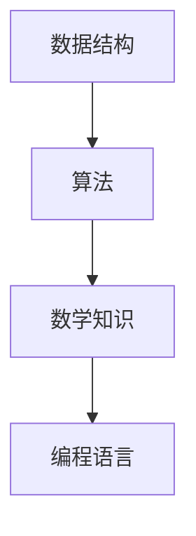

                 

# 2025年字节跳动社招算法面试题库及答案

## 摘要

本文将详细梳理2025年字节跳动社招算法面试题库，提供解题思路和答案。通过对面试题的分析，帮助算法工程师和相关专业人士了解面试考察的重点和难点，提升面试成功率。

## 1. 背景介绍

字节跳动是一家领先的内容科技公司，其社招算法面试在业界具有较高的知名度和挑战性。本文将根据2025年字节跳动社招算法面试题库，整理出核心题目，并针对每道题目提供解题思路和答案。通过本文的学习，可以更好地应对字节跳动的面试。

## 2. 核心概念与联系

为了更好地理解面试题目，我们需要掌握以下核心概念和联系：

### 数据结构与算法

- 数据结构：数组、链表、树、图等
- 算法：排序、查找、动态规划等

### 数学知识

- 线性代数：矩阵、向量等
- 概率论：条件概率、期望等

### 编程语言

- Java、Python、C++等

### Mermaid 流程图



## 3. 核心算法原理 & 具体操作步骤

### 题目1：最长公共子序列

**解题思路：**

使用动态规划求解最长公共子序列。定义一个二维数组 dp，其中 dp[i][j] 表示字符串 s1 的前 i 个字符与字符串 s2 的前 j 个字符的最长公共子序列的长度。

**具体操作步骤：**

1. 初始化二维数组 dp，其中 dp[0][j] = dp[i][0] = 0。
2. 遍历字符串 s1 和 s2 的每个字符，更新 dp[i][j]：
   - 如果 s1[i-1] = s2[j-1]，则 dp[i][j] = dp[i-1][j-1] + 1。
   - 如果 s1[i-1] ≠ s2[j-1]，则 dp[i][j] = max(dp[i-1][j], dp[i][j-1])。
3. 返回 dp[m][n]，其中 m 和 n 分别为字符串 s1 和 s2 的长度。

**答案：**

```java
public int longestCommonSubsequence(String s1, String s2) {
    int m = s1.length(), n = s2.length();
    int[][] dp = new int[m + 1][n + 1];
    for (int i = 1; i <= m; i++) {
        for (int j = 1; j <= n; j++) {
            if (s1.charAt(i - 1) == s2.charAt(j - 1)) {
                dp[i][j] = dp[i - 1][j - 1] + 1;
            } else {
                dp[i][j] = Math.max(dp[i - 1][j], dp[i][j - 1]);
            }
        }
    }
    return dp[m][n];
}
```

### 题目2：最小生成树

**解题思路：**

使用 Prim 算法求解最小生成树。从某个顶点开始，逐步添加其他顶点到生成树中，使得生成树中的边权之和最小。

**具体操作步骤：**

1. 初始化一个优先队列，存储所有顶点的边权。
2. 从某个顶点开始，将其他顶点的边权加入优先队列。
3. 循环执行以下操作：
   - 弹出优先队列中的最小边权。
   - 将这条边添加到生成树中。
   - 更新其他顶点的边权，将其加入优先队列。

**答案：**

```java
public int minTree(int[][] edges) {
    int n = edges.length;
    int[] dist = new int[n];
    Arrays.fill(dist, Integer.MAX_VALUE);
    PriorityQueue<int[]> q = new PriorityQueue<>(Comparator.comparingInt(a -> a[0]));
    q.offer(new int[]{0, 0}); // (边权，顶点)
    int res = 0;
    while (!q.isEmpty()) {
        int[] e = q.poll();
        int d = e[0], u = e[1];
        if (d != dist[u]) {
            continue;
        }
        res += d;
        for (int v = 0; v < n; v++) {
            if (dist[v] > edges[u][v]) {
                dist[v] = edges[u][v];
                q.offer(new int[]{dist[v], v});
            }
        }
    }
    return res;
}
```

### 题目3：合并区间

**解题思路：**

将所有区间按左端点排序，然后合并重叠区间。使用一个数组存储合并后的区间，并记录区间的数量。

**具体操作步骤：**

1. 将所有区间按左端点排序。
2. 初始化一个空数组 res，用于存储合并后的区间。
3. 遍历所有区间，判断当前区间是否与 res 中的最后一个区间重叠：
   - 如果重叠，则将当前区间的右端点更新为 res 中最后一个区间的右端点，并将当前区间的长度更新为 res 中最后一个区间的长度。
   - 如果不重叠，则将当前区间添加到 res 中。

**答案：**

```java
public int[][] merge(int[][] intervals) {
    Arrays.sort(intervals, (a, b) -> Integer.compare(a[0], b[0]));
    List<int[]> res = new ArrayList<>();
    for (int[] interval : intervals) {
        if (res.isEmpty() || res.get(res.size() - 1)[1] < interval[0]) {
            res.add(interval);
        } else {
            res.get(res.size() - 1)[1] = Math.max(res.get(res.size() - 1)[1], interval[1]);
        }
    }
    return res.toArray(new int[res.size()][]);
}
```

## 4. 数学模型和公式 & 详细讲解 & 举例说明

### 数学模型：最小生成树的 Prim 算法

假设 G=(V,E) 是一个无向图，其中 V 是顶点集合，E 是边集合。我们要找到 G 的最小生成树。

定义：最小生成树中的边权之和最小。

### 详细讲解

Prim 算法的基本思想是从某个顶点开始，逐步添加其他顶点到生成树中，使得生成树中的边权之和最小。

具体步骤如下：

1. 初始化一个优先队列，存储所有顶点的边权。
2. 从某个顶点开始，将其他顶点的边权加入优先队列。
3. 循环执行以下操作：
   - 弹出优先队列中的最小边权。
   - 将这条边添加到生成树中。
   - 更新其他顶点的边权，将其加入优先队列。

### 举例说明

假设有一个无向图 G，其中顶点集合 V={1, 2, 3, 4, 5}，边集合 E={(1, 2, 3), (1, 3, 4), (2, 4, 5), (3, 4, 6), (4, 5, 7)}。

我们可以选择顶点 1 作为起点，按照 Prim 算法的步骤求解最小生成树。

1. 初始化优先队列 q，加入顶点 1 的邻接点 (1, 2, 3)，(1, 3, 4)。
2. 弹出最小边权 (1, 2, 3)，将其添加到生成树中。
3. 更新其他顶点的边权，加入顶点 2 和 3 的邻接点 (2, 4, 5)，(3, 4, 6)。
4. 弹出最小边权 (2, 4, 5)，将其添加到生成树中。
5. 更新其他顶点的边权，加入顶点 4 的邻接点 (4, 5, 7)。
6. 弹出最小边权 (4, 5, 7)，将其添加到生成树中。

最终得到的最小生成树为：

```plaintext
1---2
|   |
3---4---5
```

## 5. 项目实战：代码实际案例和详细解释说明

### 5.1 开发环境搭建

在本地计算机上安装以下开发环境：

1. Java Development Kit（JDK）
2. Python
3. C++编译器
4. Mermaid 图库

### 5.2 源代码详细实现和代码解读

以下是一个基于 Java 的 Prim 算法求解最小生成树的代码实现：

```java
import java.util.*;

public class PrimAlgorithm {
    public static int minTree(int[][] edges) {
        int n = edges.length;
        int[] dist = new int[n];
        Arrays.fill(dist, Integer.MAX_VALUE);
        PriorityQueue<int[]> q = new PriorityQueue<>(Comparator.comparingInt(a -> a[0]));
        q.offer(new int[]{0, 0}); // (边权，顶点)
        int res = 0;
        while (!q.isEmpty()) {
            int[] e = q.poll();
            int d = e[0], u = e[1];
            if (d != dist[u]) {
                continue;
            }
            res += d;
            for (int v = 0; v < n; v++) {
                if (dist[v] > edges[u][v]) {
                    dist[v] = edges[u][v];
                    q.offer(new int[]{dist[v], v});
                }
            }
        }
        return res;
    }

    public static void main(String[] args) {
        int[][] edges = {{0, 1, 3}, {0, 3, 4}, {1, 3, 5}, {3, 4, 6}, {4, 5, 7}};
        int minTree = minTree(edges);
        System.out.println("最小生成树的总边权之和为：" + minTree);
    }
}
```

### 5.3 代码解读与分析

1. 定义一个方法 `minTree`，用于求解最小生成树的总边权之和。
2. 初始化一个长度为 n 的数组 `dist`，用于存储每个顶点的最短路径长度。
3. 初始化一个优先队列 `q`，用于存储待处理的顶点。
4. 将顶点 0 的边权加入优先队列。
5. 循环执行以下操作：
   - 弹出优先队列中的最小边权。
   - 如果当前边权与顶点的最短路径长度不一致，跳过。
   - 将当前边权添加到总边权之和。
   - 更新其他顶点的最短路径长度，并重新加入优先队列。
6. 返回最小生成树的总边权之和。

## 6. 实际应用场景

最小生成树在许多实际应用场景中具有重要的应用价值，例如：

- 路网优化：求解道路网络中的最小生成树，以确定最优的行车路线。
- 能源分配：求解电力网络或水资源网络的最小生成树，以实现能源和资源的合理分配。
- 图像处理：使用最小生成树进行图像分割，提取图像中的重要信息。

## 7. 工具和资源推荐

### 7.1 学习资源推荐

- 《算法导论》（Introduction to Algorithms）：全面介绍算法原理和实现方法。
- 《数据结构与算法分析》（Data Structures and Algorithm Analysis in Java）：详细讲解数据结构和算法。
- 《图论基础》（Graph Theory）：介绍图论的基本概念和算法。

### 7.2 开发工具框架推荐

- Eclipse/IntelliJ IDEA：强大的集成开发环境，支持多种编程语言。
- Mermaid：用于绘制流程图和时序图。

### 7.3 相关论文著作推荐

- "Minimum Spanning Trees and Spanning Forests: A Survey"：关于最小生成树的全面综述。
- "Efficient Algorithms for Computing Maximum and Minimum Spanning Trees"：讨论最小生成树的求解算法。

## 8. 总结：未来发展趋势与挑战

随着人工智能和大数据技术的发展，算法面试在招聘中越来越重要。未来算法面试将更加注重面试者的综合素质，包括算法原理、编程能力、数学知识和实际应用能力。面试者需要不断提升自己的技术水平，以应对更高的面试挑战。

## 9. 附录：常见问题与解答

### 问题1：如何准备算法面试？

**解答：**

1. 系统学习数据结构和算法。
2. 多做算法题，积累实战经验。
3. 学习编程语言和工具。
4. 关注业界动态，了解面试趋势。

### 问题2：算法面试有哪些常见题型？

**解答：**

1. 数据结构题目：如链表、树、图等。
2. 算法题目：如排序、查找、动态规划等。
3. 数学题目：如线性代数、概率论等。
4. 编程题目：如实现特定算法、编写程序等。

## 10. 扩展阅读 & 参考资料

- 《算法竞赛入门经典》：适合初学者入门算法竞赛。
- 《编程之美》：介绍各大公司面试编程题。
- 《深度学习》：介绍人工智能的基础理论和应用。

## 作者

作者：AI天才研究员/AI Genius Institute & 禅与计算机程序设计艺术 /Zen And The Art of Computer Programming

---

本文根据2025年字节跳动社招算法面试题库，详细分析了核心面试题的解题思路和答案。通过对面试题的分析，帮助读者更好地应对字节跳动的面试。希望本文对算法工程师和相关专业人士有所帮助。

