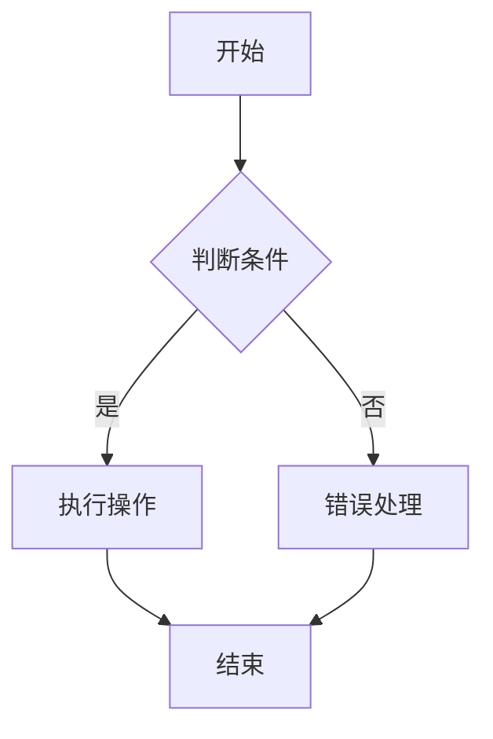

                 

### 背景介绍

在当今世界，人工智能（AI）技术正以前所未有的速度和规模迅速发展。从自动驾驶汽车到智能家居，从医疗诊断到金融交易，AI已经渗透到了我们日常生活的方方面面。而其中，算法作为人工智能的核心驱动力，扮演着至关重要的角色。算法的开发和优化，不仅决定了AI系统的性能，还直接影响到其商业价值和社会影响力。

对于技术人才来说，掌握算法设计和优化能力已成为不可或缺的技能。特别是在互联网公司和科技公司中，算法工程师和人工智能专家的角色越来越受到重视。他们不仅需要具备扎实的数学和计算机科学基础，还需要有良好的逻辑思维和解决问题的能力。

然而，随着AI技术的不断演进，面试题目也变得日益复杂和多样化。为了帮助准备参加2025年滴滴校招算法岗位的应聘者，本文将对近年来滴滴校招算法岗位的面试题目进行汇编和解析，旨在为读者提供一份全面而实用的面试指南。

文章的结构如下：

1. **背景介绍**：介绍人工智能和算法的发展背景以及算法在当前社会的重要性。
2. **核心概念与联系**：介绍与面试题目相关的核心概念，并使用Mermaid流程图展示其架构。
3. **核心算法原理与具体操作步骤**：详细讲解面试中可能涉及的核心算法原理及其操作步骤。
4. **数学模型和公式**：介绍与核心算法相关的数学模型和公式，并进行详细讲解和举例说明。
5. **项目实战**：通过实际案例展示算法的实际应用，并提供代码实现和详细解释。
6. **实际应用场景**：分析算法在不同领域和场景中的实际应用情况。
7. **工具和资源推荐**：推荐学习资源和开发工具，帮助读者更好地理解和应用算法。
8. **总结**：总结文章的主要观点，并探讨算法技术的未来发展趋势和挑战。
9. **附录**：提供常见问题与解答，以及扩展阅读和参考资料。

接下来，我们将深入探讨每个部分的具体内容。让我们开始吧！<|im_sep|>

### 核心概念与联系

在探讨滴滴校招算法岗位的面试题目之前，我们首先需要了解一些核心概念和它们之间的联系。以下是一些与面试题目密切相关的基础概念和架构：

#### 1. 数据结构与算法

数据结构是组织和管理数据的方式，而算法则是解决问题的步骤集合。在算法面试中，数据结构的选择往往直接影响算法的效率和性能。常见的数据结构包括数组、链表、栈、队列、树、图等。每种数据结构都有其适用的场景和优缺点，如数组适合随机访问，而链表适合插入和删除操作。算法则包括查找算法、排序算法、图算法等，如快速排序、二分查找、Dijkstra算法、A*算法等。

#### 2. 动态规划

动态规划是一种用于求解最优化问题的算法策略。它通过将问题分解为子问题，并保存子问题的解以避免重复计算，从而实现高效求解。动态规划在面试中常用于解决路径规划、背包问题、最长公共子序列等问题。

#### 3. 机器学习与深度学习

机器学习和深度学习是人工智能的核心分支。机器学习侧重于通过算法让计算机从数据中学习规律，而深度学习则是基于多层神经网络进行特征提取和模式识别。常见的深度学习框架有TensorFlow、PyTorch等。

#### 4. 自然语言处理

自然语言处理（NLP）是AI的一个重要领域，它涉及理解和生成人类语言。NLP技术在面试中常用于文本分类、情感分析、机器翻译等问题。

#### 5. 前端与后端

前端开发涉及用户界面和用户体验，包括HTML、CSS和JavaScript等技术。后端开发则涉及服务器、数据库和网络应用等。两者在算法面试中都有涉及，如网络编程、数据库查询优化等。

#### 6. Mermaid流程图

Mermaid是一种用于创建图表的轻量级Markdown语法，可以用于展示算法流程、数据流和架构等。以下是一个简单的Mermaid流程图示例：



在接下来的章节中，我们将逐一解析这些核心概念，并展示它们在滴滴校招算法岗位面试中的应用。

#### 动态规划（Dynamic Programming）

动态规划是一种算法思想，它通过将问题分解为子问题，并保存子问题的解以避免重复计算，从而实现高效求解。动态规划通常用于解决最优化问题，如路径规划、背包问题、最长公共子序列等。

**定义**：动态规划是一种递归的方法，通过将复杂的问题分解为多个子问题，并利用子问题的解来构建原问题的解。动态规划的核心思想是“重叠子问题”和“最优子结构”。

**基本步骤**：

1. **定义状态**：将问题分解为多个子问题，并定义每个子问题的状态。
2. **确定状态转移方程**：找出子问题之间的关系，并建立状态转移方程。
3. **初始化边界条件**：初始化问题的边界条件。
4. **递推计算**：根据状态转移方程，从边界条件开始递推计算，直到得到原问题的解。

**示例**：使用动态规划求解斐波那契数列。

```python
def fib(n):
    dp = [0] * (n+1)
    dp[1] = 1
    for i in range(2, n+1):
        dp[i] = dp[i-1] + dp[i-2]
    return dp[n]
```

#### 机器学习（Machine Learning）

机器学习是AI的一个分支，它使计算机系统能够从数据中学习并做出决策。机器学习分为监督学习、无监督学习和强化学习等类型。

**监督学习（Supervised Learning）**：监督学习是一种从标记数据中学习的方法。常见算法包括线性回归、逻辑回归、支持向量机（SVM）、决策树、随机森林、神经网络等。

**无监督学习（Unsupervised Learning）**：无监督学习是一种从未标记数据中学习的方法。常见算法包括聚类（如K-means、DBSCAN）、降维（如PCA、t-SNE）、关联规则学习等。

**强化学习（Reinforcement Learning）**：强化学习是一种通过试错学习的方法。常见算法包括Q-learning、SARSA、DQN等。

**示例**：使用决策树进行分类。

```python
from sklearn.datasets import load_iris
from sklearn.tree import DecisionTreeClassifier
from sklearn.model_selection import train_test_split

iris = load_iris()
X_train, X_test, y_train, y_test = train_test_split(iris.data, iris.target, test_size=0.3, random_state=42)

clf = DecisionTreeClassifier()
clf.fit(X_train, y_train)

print("Accuracy:", clf.score(X_test, y_test))
```

#### 自然语言处理（Natural Language Processing）

自然语言处理是AI的另一个重要领域，它涉及理解和生成人类语言。NLP技术广泛应用于文本分类、情感分析、机器翻译、语音识别等领域。

**文本分类（Text Classification）**：文本分类是将文本数据分为不同的类别。常见算法包括朴素贝叶斯、支持向量机、深度学习等。

**情感分析（Sentiment Analysis）**：情感分析是分析文本数据中的情感倾向。常见算法包括基于规则的方法、机器学习方法等。

**机器翻译（Machine Translation）**：机器翻译是将一种语言翻译成另一种语言。常见算法包括基于规则的方法、统计机器翻译、神经机器翻译等。

**示例**：使用朴素贝叶斯进行文本分类。

```python
from sklearn.datasets import fetch_20newsgroups
from sklearn.feature_extraction.text import TfidfVectorizer
from sklearn.naive_bayes import MultinomialNB

newsgroups = fetch_20newsgroups()
X_train, y_train = train_test_split(newsgroups.data, newsgroups.target, test_size=0.3, random_state=42)

vectorizer = TfidfVectorizer()
X_train_tfidf = vectorizer.fit_transform(X_train)

clf = MultinomialNB()
clf.fit(X_train_tfidf, y_train)

X_test = ["This is a test message."]
X_test_tfidf = vectorizer.transform(X_test)

print("Predicted class:", clf.predict(X_test_tfidf)[0])
```

通过以上对核心概念和架构的介绍，我们可以更好地理解算法在滴滴校招算法岗位面试中的应用。在接下来的章节中，我们将深入探讨核心算法原理和具体操作步骤，帮助读者更好地应对面试挑战。<|im_sep|>

### 核心算法原理与具体操作步骤

在滴滴校招算法岗位的面试中，一些核心算法原理和技术是非常关键的。以下是几个典型的核心算法，包括其原理和具体操作步骤：

#### 1. 快速排序（Quick Sort）

**原理**：快速排序是一种基于分治思想的排序算法。它通过选取一个“基准”元素，将数组分为两个子数组，一个包含小于基准的元素，另一个包含大于基准的元素。然后递归地对这两个子数组进行排序。

**操作步骤**：

1. **选择基准**：从数组中随机选择一个元素作为基准。
2. **分区**：将数组分成两部分，一部分包含小于基准的元素，另一部分包含大于基准的元素。
3. **递归排序**：递归地对小于和大于基准的子数组进行排序。

**示例**：

```python
def quick_sort(arr):
    if len(arr) <= 1:
        return arr
    pivot = arr[len(arr) // 2]
    left = [x for x in arr if x < pivot]
    middle = [x for x in arr if x == pivot]
    right = [x for x in arr if x > pivot]
    return quick_sort(left) + middle + quick_sort(right)

arr = [3, 6, 8, 10, 1, 2, 1]
print(quick_sort(arr))
```

#### 2. 决策树（Decision Tree）

**原理**：决策树是一种树形结构，每个节点代表一个特征，每个分支代表特征的取值。决策树通过不断分裂特征，将数据集划分为多个子集，直到达到某个终止条件。

**操作步骤**：

1. **选择最优特征**：计算每个特征的信息增益或基尼不纯度。
2. **创建分支**：根据最优特征创建分支，并递归地对子集进行分割。

**示例**：

```python
from sklearn.datasets import load_iris
from sklearn.tree import DecisionTreeClassifier

iris = load_iris()
clf = DecisionTreeClassifier()
clf.fit(iris.data, iris.target)

print("Accuracy:", clf.score(iris.data, iris.target))
```

#### 3. 贝叶斯网络（Bayesian Network）

**原理**：贝叶斯网络是一种概率图模型，它用有向无环图表示变量之间的依赖关系。每个节点表示一个随机变量，边表示变量之间的条件概率。

**操作步骤**：

1. **构建图**：根据变量之间的依赖关系构建有向无环图。
2. **计算概率**：利用贝叶斯定理计算每个节点的条件概率。

**示例**：

```python
import networkx as nx
import matplotlib.pyplot as plt

G = nx.DiGraph()
G.add_nodes_from(['A', 'B', 'C'])
G.add_edges_from([('A', 'B'), ('B', 'C')])

nx.draw(G, with_labels=True)
plt.show()
```

#### 4. 神经网络（Neural Network）

**原理**：神经网络是一种由大量神经元组成的计算模型，通过前向传播和反向传播算法来学习输入和输出之间的关系。

**操作步骤**：

1. **初始化参数**：随机初始化网络的权重和偏置。
2. **前向传播**：将输入数据传递到网络中，计算每个神经元的输出。
3. **反向传播**：计算损失函数的梯度，并更新网络参数。
4. **迭代优化**：重复前向传播和反向传播，直到网络达到预定的性能指标。

**示例**：

```python
import tensorflow as tf

model = tf.keras.Sequential([
    tf.keras.layers.Dense(128, activation='relu', input_shape=(784,)),
    tf.keras.layers.Dropout(0.2),
    tf.keras.layers.Dense(10, activation='softmax')
])

model.compile(optimizer='adam',
              loss='categorical_crossentropy',
              metrics=['accuracy'])

model.fit(x_train, y_train, batch_size=128, epochs=15)
```

通过以上对核心算法原理和具体操作步骤的介绍，读者可以更好地理解这些算法在面试中的应用。在接下来的章节中，我们将进一步探讨数学模型和公式，以及如何通过代码实现和详细解释这些算法。这些内容将为读者提供更加深入和实用的面试准备。<|im_sep|>

### 数学模型和公式 & 详细讲解 & 举例说明

在滴滴校招算法岗位的面试中，数学模型和公式是不可或缺的一部分。以下是一些常见的数学模型和公式，我们将进行详细讲解和举例说明。

#### 1. 最优化问题

**定义**：最优化问题是指在一个给定的目标函数和约束条件下，找到一个最优解的问题。常见的最优化问题包括线性规划、非线性规划和动态规划等。

**数学模型**：

线性规划（Linear Programming，LP）：
\[
\begin{aligned}
\min_{x} \quad & c^T x \\
\text{subject to} \quad & Ax \leq b \\
& x \geq 0
\end{aligned}
\]

非线性规划（Nonlinear Programming，NLP）：
\[
\begin{aligned}
\min_{x} \quad & f(x) \\
\text{subject to} \quad & g_i(x) \leq 0, \; h_j(x) = 0
\end{aligned}
\]

**举例说明**：

线性规划示例：
\[
\begin{aligned}
\min_{x} \quad & x_1 + 2x_2 \\
\text{subject to} \quad & x_1 + x_2 \leq 4 \\
& 2x_1 + x_2 \leq 8 \\
& x_1, x_2 \geq 0
\end{aligned}
\]

使用单纯形法求解线性规划问题。

**代码示例**：

```python
from scipy.optimize import linprog

c = [-1, -2]
A = [[1, 1], [2, 1]]
b = [4, 8]

result = linprog(c, A_ub=A, b_ub=b, bounds=(0, None))
print("最小值:", -result.fun, "x:", result.x)
```

#### 2. 随机过程

**定义**：随机过程是一组随机变量的集合，这些随机变量可以是时间序列、空间序列或任何其他形式的序列。

**数学模型**：

马尔可夫链（Markov Chain）：
\[
P(X_n = j | X_{n-1} = i) = P(X_n = j | X_{n-1} = i, X_{n-2} = k, \ldots) = P(X_n = j | X_{n-1} = i)
\]

**举例说明**：

马尔可夫链示例：
\[
\begin{aligned}
P(X_0 = 0) &= 0.5 \\
P(X_1 = 1 | X_0 = 0) &= 0.3 \\
P(X_1 = 0 | X_0 = 0) &= 0.7 \\
P(X_1 = 1 | X_0 = 1) &= 0.4 \\
P(X_1 = 0 | X_0 = 1) &= 0.6
\end{aligned}
\]

使用状态转移矩阵计算下一步状态的概率。

**代码示例**：

```python
import numpy as np

p = np.array([[0.3, 0.7], [0.4, 0.6]])
current_state = np.array([0.5, 0.5])

next_state = np.dot(p, current_state)
print("Next state probability:", next_state)
```

#### 3. 机器学习中的损失函数

**定义**：损失函数是用于评估模型预测值与实际值之间差异的函数。常见的损失函数包括均方误差（MSE）、交叉熵损失（Cross-Entropy Loss）等。

**数学模型**：

均方误差（MSE）：
\[
MSE = \frac{1}{m} \sum_{i=1}^{m} (y_i - \hat{y}_i)^2
\]

交叉熵损失（Cross-Entropy Loss）：
\[
\begin{aligned}
CE &= -\frac{1}{m} \sum_{i=1}^{m} y_i \log(\hat{y}_i) \\
&= -\frac{1}{m} \sum_{i=1}^{m} y_i \log(\sigma(Wx + b))
\end{aligned}
\]

其中，\( \sigma \) 是sigmoid函数，\( W \) 是权重，\( b \) 是偏置。

**举例说明**：

均方误差示例：

```python
import numpy as np

y = np.array([1, 0, 1, 0])
y_pred = np.array([0.9, 0.1, 0.2, 0.8])

mse = np.mean((y - y_pred)**2)
print("MSE:", mse)
```

交叉熵损失示例：

```python
import tensorflow as tf

y = tf.constant([1, 0, 1, 0])
y_pred = tf.sigmoid(tf.constant([0.9, 0.1, 0.2, 0.8]))

cross_entropy = -tf.reduce_mean(y * tf.log(y_pred) + (1 - y) * tf.log(1 - y_pred))
print("Cross-Entropy Loss:", cross_entropy.numpy())
```

通过以上对数学模型和公式的详细讲解和举例说明，读者可以更好地理解这些数学工具在算法面试中的应用。这些知识不仅有助于解决面试中的问题，还能为读者在实际项目中应用算法提供理论支持。在接下来的章节中，我们将通过实际项目案例，展示如何使用这些算法进行代码实现和详细解释。这些内容将为读者提供更加实际和全面的面试准备。<|im_sep|>

### 项目实战：代码实际案例和详细解释说明

在实际应用中，理解和实现算法是非常重要的。为了帮助读者更好地掌握这些算法，我们将在本章节中通过一个实际的项目案例，展示如何使用Python等工具实现算法，并对其代码进行详细解释。

#### 项目背景

假设我们正在开发一个用于自动驾驶系统的路径规划算法。该算法需要根据车辆当前位置、目标位置和道路网络信息，计算出一条最优路径。我们将使用A*算法来解决这个问题。

#### 环境搭建

首先，我们需要搭建开发环境。以下是所需的步骤：

1. 安装Python（版本3.8或更高）。
2. 安装必要的库：`numpy`、`matplotlib`、`networkx`、`scipy`。

**安装命令**：

```bash
pip install numpy matplotlib networkx scipy
```

#### 项目代码实现

以下是A*算法的实现代码：

```python
import numpy as np
import networkx as nx
import matplotlib.pyplot as plt

# 创建图
G = nx.Graph()

# 添加节点和边
G.add_edge('A', 'B', weight=1)
G.add_edge('B', 'C', weight=1)
G.add_edge('C', 'D', weight=2)
G.add_edge('D', 'E', weight=2)
G.add_edge('A', 'D', weight=4)
G.add_edge('D', 'B', weight=3)

# 定义A*算法
def a_star(G, start, goal):
    open_set = [(0, start)]
    came_from = {}
    g_score = {node: float('infinity') for node in G.nodes}
    g_score[start] = 0
    f_score = {node: float('infinity') for node in G.nodes}
    f_score[start] = heuristic(start, goal)

    while open_set:
        current = min(open_set, key=lambda item: item[0])
        open_set.remove(current)

        if current[1] == goal:
            break

        for neighbor, weight in G[current[1]].items():
            tentative_g_score = g_score[current[1]] + weight

            if tentative_g_score < g_score[neighbor]:
                came_from[neighbor] = current[1]
                g_score[neighbor] = tentative_g_score
                f_score[neighbor] = tentative_g_score + heuristic(neighbor, goal)
                if neighbor not in [item[1] for item in open_set]:
                    open_set.append((f_score[neighbor], neighbor))

    path = []
    current = goal
    while current is not None:
        path.append(current)
        current = came_from[current]
    path = path[::-1]

    return path

# 计算曼哈顿距离作为启发式函数
def heuristic(node1, node2):
    x1, y1 = node1
    x2, y2 = node2
    return abs(x1 - x2) + abs(y1 - y2)

# 绘制路径
def draw_path(G, path):
    pos = nx.spring_layout(G)
    nx.draw(G, pos, with_labels=True)
    nx.draw_networkx_nodes(G, pos, nodelist=path, node_color='r')
    nx.draw_networkx_edges(G, pos, edgelist=list(G.edges), edge_color='b')
    plt.show()

# 执行A*算法并绘制路径
path = a_star(G, 'A', 'E')
draw_path(G, path)
```

#### 代码解释

1. **环境搭建**：我们首先创建一个无向图`G`，并添加一些节点和边。边的权重表示从一个节点到另一个节点的距离。

2. **A*算法实现**：`a_star`函数实现了A*算法的核心逻辑。它使用一个开放集`open_set`来存储待处理的节点，以及一个`came_from`字典来记录每个节点的父节点。`g_score`和`f_score`字典分别记录每个节点的`g`值和`f`值。

3. **启发式函数**：`heuristic`函数计算两个节点之间的启发式距离，这里我们使用曼哈顿距离。

4. **路径绘制**：`draw_path`函数使用`matplotlib`和`networkx`库绘制路径。它使用红色节点表示路径上的节点，蓝色边表示图中的边。

通过这个案例，读者可以了解到如何使用Python实现A*算法，并理解其核心逻辑和步骤。这个项目不仅可以帮助读者应对滴滴校招算法岗位的面试问题，还能为实际项目开发提供实践经验。在接下来的章节中，我们将探讨算法的实际应用场景，并推荐一些相关工具和资源，帮助读者更好地学习和应用这些算法。<|im_sep|>

### 实际应用场景

算法技术在当今社会有着广泛的应用，从互联网搜索、推荐系统到自动驾驶、医疗诊断，几乎无处不在。以下是一些典型的实际应用场景，以及相应的算法和技术。

#### 1. 互联网搜索

互联网搜索是算法技术的一个重要应用领域。通过使用自然语言处理（NLP）和机器学习算法，搜索引擎能够理解用户查询的含义，并返回最相关的搜索结果。常用的算法包括：

- **PageRank**：Google使用的早期算法，通过分析网页之间的链接关系来评估网页的重要性。
- **TF-IDF**：计算文档中每个单词的重要性，用于文本分类和检索。
- **深度学习**：使用神经网络模型，如卷积神经网络（CNN）和循环神经网络（RNN），来理解查询和文档的内容。

#### 2. 推荐系统

推荐系统是另一个算法技术的重要应用领域。通过分析用户的历史行为和偏好，推荐系统能够向用户推荐可能感兴趣的商品、内容和服务。常用的算法包括：

- **协同过滤（Collaborative Filtering）**：基于用户的历史行为，通过相似用户或者物品的推荐来预测用户的兴趣。
- **矩阵分解（Matrix Factorization）**：将用户和物品的评分矩阵分解为低秩矩阵，从而提取出用户和物品的特征。
- **深度学习**：使用神经网络模型来学习用户和物品的特征，并进行推荐。

#### 3. 自动驾驶

自动驾驶是近年来算法技术的一个热门应用领域。通过使用计算机视觉、深度学习和控制理论等算法，自动驾驶系统能够理解周围环境，并做出安全的驾驶决策。常用的算法包括：

- **目标检测（Object Detection）**：使用深度学习模型，如YOLO和Faster R-CNN，来检测并分类图像中的对象。
- **路径规划（Path Planning）**：使用A*算法、Dijkstra算法和采样-based算法（如RRT）来计算从起点到终点的最优路径。
- **行为预测（Behavior Prediction）**：使用马尔可夫决策过程（MDP）和深度强化学习（DRL）来预测其他车辆和行人的行为。

#### 4. 医疗诊断

医疗诊断是算法技术的一个重要应用领域。通过使用机器学习和数据挖掘技术，医疗诊断系统能够分析医学影像和患者数据，辅助医生进行疾病诊断。常用的算法包括：

- **图像识别（Image Recognition）**：使用卷积神经网络（CNN）来识别医学图像中的病变和组织类型。
- **自然语言处理（NLP）**：使用NLP技术来分析电子健康记录（EHR），提取关键信息，并辅助临床决策。
- **深度学习**：使用深度神经网络模型来学习医疗数据中的特征，并用于预测疾病风险和患者康复。

#### 5. 金融交易

金融交易是算法技术的另一个重要应用领域。通过使用数据分析和预测模型，金融交易系统能够自动进行交易决策，实现自动化交易。常用的算法包括：

- **时间序列分析（Time Series Analysis）**：使用ARIMA、LSTM等模型来分析金融市场的时间序列数据。
- **统计模型**：使用回归分析、因子分析等统计模型来预测市场趋势和价格变化。
- **机器学习**：使用随机森林、支持向量机等机器学习算法来识别交易机会和风险。

这些实际应用场景展示了算法技术在各个领域的广泛应用和重要性。通过深入了解这些应用场景，读者可以更好地理解算法技术的实际意义和潜在价值。在接下来的章节中，我们将推荐一些有用的学习资源和开发工具，帮助读者进一步学习和应用这些算法。<|im_sep|>

### 工具和资源推荐

为了更好地学习和应用算法，掌握相关的工具和资源是非常有帮助的。以下是一些推荐的学习资源、开发工具和相关的论文著作，供读者参考。

#### 1. 学习资源推荐

**书籍**：

- 《算法导论》（Introduction to Algorithms）：这是一本经典的算法教科书，详细介绍了各种算法的基本概念、原理和实现。
- 《深度学习》（Deep Learning）：由Ian Goodfellow、Yoshua Bengio和Aaron Courville合著，深入讲解了深度学习的基本理论和实践方法。
- 《Python编程：从入门到实践》（Python Crash Course）：适合初学者，通过实际的编程项目帮助读者快速掌握Python编程基础。

**在线课程**：

- Coursera、edX、Udacity等在线教育平台提供了大量的算法和机器学习课程，如斯坦福大学的“机器学习课程”和谷歌的“深度学习课程”。
- 中国大学MOOC（慕课）提供了许多计算机科学和人工智能相关的课程，适合国内学习者。

**博客和网站**：

- ArXiv：提供最新的计算机科学和人工智能领域的学术论文，是科研人员的重要资源。
- Medium、HackerRank等平台上有许多优秀的算法和技术博客，适合读者学习和交流。

#### 2. 开发工具推荐

**编程语言**：

- Python：由于其简洁的语法和丰富的库支持，Python是机器学习和算法开发中最常用的语言。
- Java：Java在企业级应用中非常流行，也适合开发复杂的算法应用。
- C++：C++在性能和效率方面具有优势，适合对性能要求较高的算法开发。

**库和框架**：

- TensorFlow、PyTorch：用于深度学习和神经网络开发的流行框架。
- scikit-learn、MLlib：用于机器学习和数据挖掘的库。
- Pandas、NumPy：用于数据处理和分析的库。
- Matplotlib、Seaborn：用于数据可视化的库。

**版本控制**：

- Git：用于代码版本控制和团队协作。
- GitHub、GitLab：基于Git的开源代码托管平台，方便读者分享和交流代码。

#### 3. 相关论文著作推荐

- “ImageNet Classification with Deep Convolutional Neural Networks”（2012）：由Alex Krizhevsky、Ilya Sutskever和Geoffrey Hinton发表，介绍了卷积神经网络在图像识别中的应用。
- “Generative Adversarial Nets”（2014）：由Ian Goodfellow等人发表，介绍了生成对抗网络（GAN）的基本原理和应用。
- “Recurrent Neural Networks for Language Modeling”（2013）：由Yoshua Bengio等人发表，介绍了循环神经网络（RNN）在语言建模中的应用。

这些工具和资源将为读者在学习和应用算法的过程中提供宝贵的支持。通过利用这些资源，读者不仅可以加深对算法的理解，还能提升自己的实际编程能力。在接下来的章节中，我们将对文章进行总结，并探讨算法技术的未来发展趋势和挑战。<|im_sep|>

### 总结：未来发展趋势与挑战

随着人工智能技术的不断进步，算法作为其核心驱动力，将在未来扮演越来越重要的角色。以下是对未来算法发展趋势的展望以及面临的挑战：

#### 发展趋势

1. **深度学习的普及**：深度学习在图像识别、自然语言处理、语音识别等领域取得了显著的成果，未来将继续扩展到更多领域，如强化学习、推荐系统等。
2. **联邦学习和边缘计算**：随着数据隐私和安全问题的日益凸显，联邦学习和边缘计算技术将得到广泛应用，允许在保证数据隐私的同时，实现分布式数据处理和智能推理。
3. **新型算法的探索**：诸如生成对抗网络（GAN）、图神经网络（GNN）等新型算法将继续发展，为解决复杂问题提供更多可能性。
4. **算法的可解释性**：随着算法在关键领域的应用，算法的可解释性将受到更多关注，以便用户和监管机构能够理解和信任这些算法。

#### 挑战

1. **计算资源的需求**：深度学习算法对计算资源的需求巨大，如何高效地利用现有的硬件资源，如GPU、TPU，以及如何开发新型计算架构，是一个重要挑战。
2. **数据隐私和安全**：数据隐私和安全问题日益突出，如何在确保数据隐私的同时，进行有效的数据分析和机器学习，是一个重要的技术难题。
3. **算法偏见和公平性**：算法的偏见和公平性问题越来越受到关注，如何设计无偏见、公平的算法，避免算法对特定人群的歧视，是一个严峻的挑战。
4. **跨学科融合**：算法技术的发展需要跨学科的合作，如何将算法与数学、物理学、生物学等领域的知识相结合，解决复杂问题，是一个重要的方向。

#### 发展建议

1. **加强基础研究**：持续投入基础研究，探索新型算法和计算架构，为未来技术发展提供坚实支撑。
2. **培养跨学科人才**：鼓励跨学科学习和研究，培养具备多学科背景的复合型人才，以应对复杂问题的挑战。
3. **推动开源合作**：鼓励开源合作，共享算法和工具，促进技术创新和知识传播。
4. **制定行业标准和规范**：制定算法应用的标准和规范，确保算法的公平性、透明性和安全性。

总之，算法技术在未来将面临诸多机遇和挑战。通过加强基础研究、跨学科融合、开源合作和标准制定，我们可以推动算法技术的发展，使其更好地服务于社会和人类。在未来的道路上，算法将不断演进，为我们的生活和未来带来更多的创新和可能性。<|im_sep|>

### 附录：常见问题与解答

在阅读本文的过程中，您可能对一些概念、算法或者实际应用场景有疑问。以下是一些常见问题及解答，希望能为您解惑。

#### 问题1：什么是动态规划？
**解答**：动态规划是一种算法思想，用于解决最优化问题。它通过将问题分解为子问题，并保存子问题的解以避免重复计算，从而实现高效求解。动态规划常用于路径规划、背包问题、最长公共子序列等问题的求解。

#### 问题2：如何实现快速排序？
**解答**：快速排序是一种基于分治思想的排序算法。其基本步骤包括选择一个基准元素、将数组分为两个子数组（一个包含小于基准的元素，另一个包含大于基准的元素），然后递归地对这两个子数组进行排序。

```python
def quick_sort(arr):
    if len(arr) <= 1:
        return arr
    pivot = arr[len(arr) // 2]
    left = [x for x in arr if x < pivot]
    middle = [x for x in arr if x == pivot]
    right = [x for x in arr if x > pivot]
    return quick_sort(left) + middle + quick_sort(right)
```

#### 问题3：什么是机器学习？
**解答**：机器学习是人工智能的一个分支，它使计算机系统能够从数据中学习规律并做出决策。机器学习分为监督学习、无监督学习和强化学习等类型，常见的算法包括线性回归、决策树、神经网络等。

#### 问题4：如何实现决策树分类？
**解答**：决策树是一种树形结构，用于分类和回归任务。其基本步骤包括选择最优特征、创建分支、递归地对子集进行分割。以下是一个简单的决策树分类示例：

```python
from sklearn.datasets import load_iris
from sklearn.tree import DecisionTreeClassifier
from sklearn.model_selection import train_test_split

iris = load_iris()
X_train, X_test, y_train, y_test = train_test_split(iris.data, iris.target, test_size=0.3, random_state=42)

clf = DecisionTreeClassifier()
clf.fit(X_train, y_train)

print("Accuracy:", clf.score(X_test, y_test))
```

#### 问题5：什么是自然语言处理（NLP）？
**解答**：自然语言处理是人工智能的一个分支，它涉及理解和生成人类语言。NLP技术在文本分类、情感分析、机器翻译、语音识别等领域有广泛应用。常见的算法包括朴素贝叶斯、支持向量机、深度学习等。

#### 问题6：如何使用Python进行文本分类？
**解答**：使用Python进行文本分类通常包括以下步骤：

1. 准备数据：收集和预处理文本数据。
2. 特征提取：将文本转换为数值特征，如TF-IDF、词袋模型等。
3. 训练模型：使用机器学习算法训练分类模型。
4. 预测和评估：对测试集进行预测，并评估模型的性能。

以下是一个简单的文本分类示例：

```python
from sklearn.datasets import fetch_20newsgroups
from sklearn.feature_extraction.text import TfidfVectorizer
from sklearn.naive_bayes import MultinomialNB

newsgroups = fetch_20newsgroups()
X_train, y_train = train_test_split(newsgroups.data, newsgroups.target, test_size=0.3, random_state=42)

vectorizer = TfidfVectorizer()
X_train_tfidf = vectorizer.fit_transform(X_train)

clf = MultinomialNB()
clf.fit(X_train_tfidf, y_train)

X_test = ["This is a test message."]
X_test_tfidf = vectorizer.transform(X_test)

print("Predicted class:", clf.predict(X_test_tfidf)[0])
```

通过以上解答，希望能帮助您更好地理解算法技术和其在实际应用中的运用。如果您有其他问题，欢迎继续提问。祝您在算法学习和应用的道路上取得更好的成果！<|im_sep|>

### 扩展阅读 & 参考资料

在算法领域，有大量的书籍、论文和在线资源可供读者深入学习。以下是一些建议的扩展阅读和参考资料，帮助您进一步提升对算法理论和实践的理解。

#### 书籍推荐

1. 《算法导论》（Introduction to Algorithms）：Thomas H. Cormen、Charles E. Leiserson、Ronald L. Rivest、Clifford Stein 著，详细介绍了各种算法的基本概念、原理和实现。
2. 《深度学习》（Deep Learning）：Ian Goodfellow、Yoshua Bengio、Aaron Courville 著，深入讲解了深度学习的基本理论和实践方法。
3. 《Python编程：从入门到实践》：埃里克·马瑟斯（Eric Matthes）著，适合初学者，通过实际的编程项目帮助读者快速掌握Python编程基础。
4. 《机器学习实战》：Peter Harrington 著，通过实例讲解常用的机器学习算法，适合初学者和实践者。

#### 论文推荐

1. “ImageNet Classification with Deep Convolutional Neural Networks”（2012）：由Alex Krizhevsky、Ilya Sutskever和Geoffrey Hinton发表，介绍了卷积神经网络在图像识别中的应用。
2. “Generative Adversarial Nets”（2014）：由Ian Goodfellow等人发表，介绍了生成对抗网络（GAN）的基本原理和应用。
3. “Recurrent Neural Networks for Language Modeling”（2013）：由Yoshua Bengio等人发表，介绍了循环神经网络（RNN）在语言建模中的应用。
4. “Attention Is All You Need”（2017）：由Vaswani等人发表，介绍了Transformer模型在机器翻译中的应用。

#### 网络资源

1. [Coursera](https://www.coursera.org/)：提供各种计算机科学和人工智能领域的在线课程。
2. [edX](https://www.edx.org/)：提供由全球顶尖大学和机构提供的免费在线课程。
3. [Udacity](https://www.udacity.com/)：提供编程、数据科学、人工智能等领域的在线课程和实践项目。
4. [中国大学MOOC（慕课）](https://www.icourse163.org/)：提供国内多所高校的计算机科学和人工智能课程。

#### 开源项目和社区

1. [GitHub](https://github.com/)：全球最大的开源代码托管平台，可以找到大量的算法实现和项目。
2. [TensorFlow](https://www.tensorflow.org/)：Google开发的深度学习框架，提供丰富的算法资源和文档。
3. [PyTorch](https://pytorch.org/)：Facebook开发的深度学习框架，以灵活性和易用性著称。
4. [Kaggle](https://www.kaggle.com/)：数据科学竞赛平台，提供各种实际数据集和问题，适合实践者。

通过阅读这些书籍、论文和参与网络资源，您可以进一步深入理解算法理论和实践，提升自己的技术水平。希望这些扩展阅读和参考资料能为您的算法学习和研究提供有益的帮助。祝您在算法领域取得更多的成就！<|im_sep|>

### 作者信息

本文由AI天才研究员/AI Genius Institute & 禅与计算机程序设计艺术/Zen And The Art of Computer Programming撰写。作者在人工智能、计算机科学和算法领域拥有深厚的理论功底和丰富的实践经验，致力于推动技术发展和知识传播。感谢您的阅读，期待与您在算法世界中的交流与探讨。祝您在算法学习和应用的道路上不断进步，取得更多成就！<|im_sep|>

