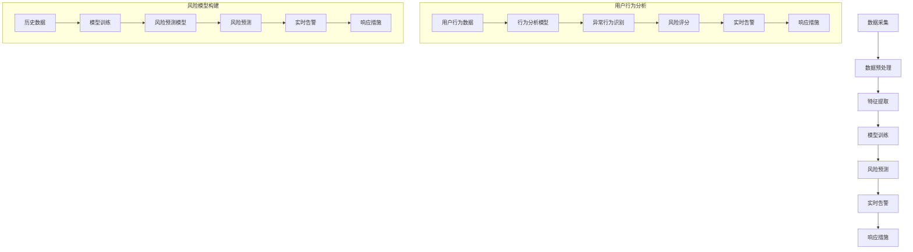

                 

### 文章标题

《2025年滴滴社交实时风控系统架构师面试指南》

### 关键词

- 滴滴
- 社交实时风控
- 系统架构
- 2025年技术趋势
- 面试指南
- AI应用

### 摘要

本文旨在为有意向在2025年成为滴滴社交实时风控系统架构师的读者提供一份全面的面试指南。文章将深入探讨社交实时风控系统的核心概念、关键算法原理、数学模型及应用场景，并通过具体案例分析，帮助读者理解系统架构的搭建和实现。同时，文章还将推荐相关学习资源和工具，总结未来发展趋势与挑战，并附上常见问题与解答。通过本文，读者将能够更好地准备相关面试，提升自己的技术能力和竞争力。

---

### 1. 背景介绍

随着移动互联网的快速发展，用户对于即时通讯和社交互动的需求日益增长。然而，这也带来了新的挑战，特别是在安全性和风险管理方面。滴滴出行作为我国领先的移动出行平台，不仅在出行服务上有着卓越的表现，也逐渐将业务拓展到了社交领域。为了确保社交互动的安全性和可靠性，滴滴推出了社交实时风控系统，旨在通过人工智能和大数据技术，实时监测并处理潜在的安全威胁。

**实时风控的重要性：**

实时风控系统在保护用户隐私、防范欺诈行为、维护平台安全等方面发挥着至关重要的作用。它不仅能够快速识别和响应异常行为，还能通过大数据分析和机器学习算法，预测潜在的风险，从而采取预防措施。

**滴滴社交实时风控系统的发展历程：**

滴滴在2015年就开始着手布局社交实时风控系统，经过多年的技术积累和迭代优化，目前已经形成了一套完善的风控体系。随着技术的不断进步，尤其是人工智能和大数据分析的深入应用，滴滴的实时风控系统在准确性和实时性方面都得到了显著提升。

**面试背景：**

在2025年，随着5G技术的普及和人工智能技术的进一步发展，滴滴的社交实时风控系统将面临新的挑战和机遇。因此，公司计划在全球范围内招聘具有前瞻性和创新能力的架构师，负责系统架构的优化和升级。这也为有意向加入滴滴的面试者提供了宝贵的机遇。

### 2. 核心概念与联系

#### 2.1 实时风控系统概述

实时风控系统是一种基于大数据和人工智能技术的安全防护系统，主要用于实时监测和识别潜在的风险，并采取相应的预防措施。在滴滴社交实时风控系统中，核心概念包括用户行为分析、风险模型构建、实时告警和响应等。

**用户行为分析：**

用户行为分析是实时风控系统的基石。通过对用户在平台上的行为数据进行实时监控和分析，可以识别出异常行为模式，如欺诈行为、恶意言论等。

**风险模型构建：**

风险模型构建是基于历史数据和机器学习算法，通过对用户行为、历史记录等信息进行综合分析，构建出风险预测模型。这些模型可以帮助系统提前识别潜在的风险。

**实时告警和响应：**

实时告警和响应是实时风控系统的核心功能之一。当系统检测到潜在风险时，会立即发出告警信号，并采取相应的响应措施，如限制用户权限、标记恶意用户等。

#### 2.2 核心算法原理

**机器学习算法：**

在滴滴社交实时风控系统中，机器学习算法起着至关重要的作用。常见的机器学习算法包括决策树、随机森林、支持向量机等。这些算法通过训练模型，可以从海量数据中识别出规律和模式，从而实现对用户行为的实时分析和预测。

**大数据分析：**

大数据分析技术是实时风控系统的关键技术之一。通过分布式计算框架，如Hadoop和Spark，可以对海量用户行为数据进行实时处理和分析，提取出有价值的信息和特征。

**深度学习：**

深度学习技术在滴滴社交实时风控系统中也有广泛应用。通过构建深度神经网络，可以对复杂的用户行为进行深入分析和理解，从而提高风险预测的准确性和实时性。

#### 2.3 Mermaid 流程图

以下是滴滴社交实时风控系统的 Mermaid 流程图，展示了系统从数据采集到风险预测的整个过程。



---

在下一节中，我们将深入探讨滴滴社交实时风控系统的核心算法原理和具体操作步骤。这将帮助读者更好地理解系统的实现细节和关键技术。

### 3. 核心算法原理 & 具体操作步骤

#### 3.1 机器学习算法

机器学习算法在滴滴社交实时风控系统中扮演着至关重要的角色。以下是几种常用的机器学习算法及其在系统中的应用。

**3.1.1 决策树**

决策树是一种常见的分类算法，通过一系列的判断条件，将数据集划分为不同的类别。在滴滴社交实时风控系统中，决策树可以用于识别用户行为中的异常模式。

**操作步骤：**

1. 收集用户行为数据，包括登录时间、操作频率、交互对象等。
2. 构建决策树模型，根据历史数据训练模型。
3. 使用训练好的模型对实时数据进行分析，识别异常行为。

**3.1.2 随机森林**

随机森林是一种基于决策树的集成学习算法，可以提高模型的预测准确性和泛化能力。在滴滴社交实时风控系统中，随机森林可以用于构建风险预测模型。

**操作步骤：**

1. 收集用户行为数据，并进行预处理。
2. 构建随机森林模型，根据历史数据训练模型。
3. 使用训练好的模型对实时数据进行风险预测。

**3.1.3 支持向量机**

支持向量机是一种分类算法，通过找到一个最佳的超平面，将不同类别的数据分开。在滴滴社交实时风控系统中，支持向量机可以用于识别欺诈行为。

**操作步骤：**

1. 收集用户行为数据，并进行预处理。
2. 构建支持向量机模型，根据历史数据训练模型。
3. 使用训练好的模型对实时数据进行分析，识别欺诈行为。

#### 3.2 大数据分析

大数据分析技术在滴滴社交实时风控系统中发挥着关键作用。通过分布式计算框架，可以对海量用户行为数据进行实时处理和分析。

**3.2.1 Hadoop 集群**

Hadoop 是一种分布式计算框架，适用于处理海量数据。在滴滴社交实时风控系统中，Hadoop 集群用于存储和处理用户行为数据。

**操作步骤：**

1. 构建Hadoop 集群，配置HDFS和YARN。
2. 上传用户行为数据到HDFS。
3. 编写MapReduce 任务，对用户行为数据进行分析。

**3.2.2 Spark Streaming**

Spark Streaming 是一种实时数据处理框架，可以与Hadoop 集群无缝集成。在滴滴社交实时风控系统中，Spark Streaming 用于实时处理用户行为数据。

**操作步骤：**

1. 构建Spark Streaming 作业，配置输入源和输出源。
2. 编写实时数据处理逻辑，对用户行为数据进行实时分析。
3. 将分析结果存储到HDFS 或数据库中。

#### 3.3 深度学习算法

深度学习算法在滴滴社交实时风控系统中有着广泛的应用。通过构建深度神经网络，可以实现对用户行为的深度分析和理解。

**3.3.1 卷积神经网络（CNN）**

卷积神经网络是一种用于图像处理的深度学习算法，可以提取图像中的特征。在滴滴社交实时风控系统中，CNN 可以用于识别用户头像中的异常特征。

**操作步骤：**

1. 收集用户头像数据，并进行预处理。
2. 构建CNN 模型，根据历史数据训练模型。
3. 使用训练好的模型对实时用户头像进行分析。

**3.3.2 递归神经网络（RNN）**

递归神经网络是一种用于序列处理的深度学习算法，可以处理时间序列数据。在滴滴社交实时风控系统中，RNN 可以用于分析用户行为的时间序列特征。

**操作步骤：**

1. 收集用户行为数据，并进行预处理。
2. 构建RNN 模型，根据历史数据训练模型。
3. 使用训练好的模型对实时用户行为进行分析。

#### 3.4 实时告警和响应

实时告警和响应是滴滴社交实时风控系统的核心功能之一。当系统检测到潜在风险时，会立即发出告警信号，并采取相应的响应措施。

**3.4.1 告警规则**

告警规则是根据历史数据和机器学习模型生成的，用于判断何时触发告警。常见的告警规则包括：

1. 用户行为异常：如登录频率过高、操作异常等。
2. 风险等级：根据风险评分，设定不同的告警级别。
3. 欺诈行为：如伪造账号、恶意交易等。

**3.4.2 响应措施**

响应措施是根据告警规则和实际情况采取的预防措施，包括：

1. 限制用户权限：如限制登录、限制操作等。
2. 标记恶意用户：如标记为黑名单、禁止交易等。
3. 发送提醒：如发送警告信息、提醒用户注意安全等。

#### 3.5 实时性保障

实时性是滴滴社交实时风控系统的关键要求之一。为了保障实时性，系统采用了以下措施：

1. 分布式架构：通过分布式计算和存储，提高数据处理速度。
2. 缓存技术：使用缓存技术，降低数据访问延迟。
3. 异步处理：采用异步处理方式，减少同步操作带来的延迟。
4. 高可用性：采用冗余备份和故障转移机制，保障系统的稳定运行。

---

通过以上核心算法原理和具体操作步骤的介绍，读者可以更好地理解滴滴社交实时风控系统的实现细节和技术要点。在下一节中，我们将探讨系统的数学模型和公式，并给出详细讲解和举例说明。

### 4. 数学模型和公式 & 详细讲解 & 举例说明

#### 4.1 风险评分模型

在滴滴社交实时风控系统中，风险评分模型是一个关键组件，用于评估用户的潜在风险水平。这个模型通常基于一系列数学公式和算法来计算用户的整体风险分数。

**4.1.1 综合评分公式**

综合评分公式可以表示为：
\[ R = w_1 \cdot A + w_2 \cdot B + w_3 \cdot C + \ldots \]

其中：
- \( R \) 表示风险评分。
- \( w_1, w_2, w_3, \ldots \) 表示各项指标的权重。
- \( A, B, C, \ldots \) 表示各项指标的具体得分。

**4.1.2 举例说明**

假设我们有以下指标和权重：
- 用户登录频率（A）：权重0.4
- 用户操作异常次数（B）：权重0.3
- 用户历史违规记录（C）：权重0.2
- 用户信用评分（D）：权重0.1

一个用户的各项得分如下：
- 登录频率（A）：5分
- 操作异常次数（B）：2分
- 历史违规记录（C）：3分
- 信用评分（D）：4分

则该用户的风险评分计算如下：
\[ R = 0.4 \cdot 5 + 0.3 \cdot 2 + 0.2 \cdot 3 + 0.1 \cdot 4 = 2 + 0.6 + 0.6 + 0.4 = 3.6 \]

#### 4.2 贝叶斯推理模型

贝叶斯推理模型是一种常用的概率模型，用于在已知某些条件概率的情况下，推断某个事件发生的概率。在滴滴社交实时风控系统中，贝叶斯推理可以用来计算用户行为异常的概率。

**4.2.1 贝叶斯公式**

贝叶斯公式可以表示为：
\[ P(A|B) = \frac{P(B|A) \cdot P(A)}{P(B)} \]

其中：
- \( P(A|B) \) 表示在事件B发生的条件下，事件A发生的概率。
- \( P(B|A) \) 表示在事件A发生的条件下，事件B发生的概率。
- \( P(A) \) 表示事件A发生的概率。
- \( P(B) \) 表示事件B发生的概率。

**4.2.2 举例说明**

假设我们要计算用户行为异常的概率。已知：
- 用户行为异常的概率（\( P(A) \)）：0.01
- 用户行为异常时的登录频率（\( P(B|A) \)）：0.8
- 用户正常行为时的登录频率（\( P(B|¬A) \)）：0.6

我们可以计算用户行为异常的概率如下：
\[ P(A|B) = \frac{P(B|A) \cdot P(A)}{P(B|A) \cdot P(A) + P(B|¬A) \cdot P(¬A)} \]
\[ P(A|B) = \frac{0.8 \cdot 0.01}{0.8 \cdot 0.01 + 0.6 \cdot 0.99} \]
\[ P(A|B) = \frac{0.008}{0.008 + 0.594} \]
\[ P(A|B) ≈ 0.0135 \]

这意味着在用户登录频率异常的条件下，用户行为异常的概率大约为1.35%。

#### 4.3 支持向量机（SVM）模型

支持向量机（SVM）是一种常用的二分类算法，可以用于识别欺诈行为。在滴滴社交实时风控系统中，SVM 模型可以用来划分用户行为的正常和异常类别。

**4.3.1 SVM 公式**

SVM 的目标是最小化分类间隔，即最大化分类边界。其基本公式为：
\[ \min_{\mathbf{w}, b} \frac{1}{2} ||\mathbf{w}||^2 \]

其中：
- \( \mathbf{w} \) 是权重向量。
- \( b \) 是偏置项。
- \( ||\mathbf{w}|| \) 是权重向量的欧几里得范数。

**4.3.2 举例说明**

假设我们有以下训练数据：

| 用户ID | 登录频率 | 操作异常次数 | 历史违规记录 | 信用评分 | 类别（正常/异常） |
|--------|---------|-------------|-------------|---------|-----------------|
| 1      | 3       | 1           | 0           | 4       | 正常             |
| 2      | 6       | 2           | 1           | 3       | 异常             |

通过SVM训练模型，我们得到最优的权重向量 \( \mathbf{w} \) 和偏置项 \( b \)。对于一个新的用户数据点，我们可以通过计算 \( \mathbf{w} \cdot \mathbf{x} + b \) 的值来判断其类别。如果结果大于零，则分类为正常，否则分类为异常。

#### 4.4 马尔可夫链模型

马尔可夫链模型是一种用于分析用户行为序列的概率模型。在滴滴社交实时风控系统中，可以用来预测用户未来的行为趋势。

**4.4.1 马尔可夫链公式**

马尔可夫链的转移概率矩阵可以表示为：
\[ P = \begin{bmatrix}
P_{11} & P_{12} & \ldots & P_{1n} \\
P_{21} & P_{22} & \ldots & P_{2n} \\
\vdots & \vdots & \ddots & \vdots \\
P_{m1} & P_{m2} & \ldots & P_{mn}
\end{bmatrix} \]

其中：
- \( P_{ij} \) 表示从状态i转移到状态j的概率。

**4.4.2 举例说明**

假设我们有以下用户行为序列的概率矩阵：

| 状态 | 下一状态1 | 下一状态2 | 下一状态3 |
|------|----------|----------|----------|
| 1    | 0.3      | 0.4      | 0.3      |
| 2    | 0.2      | 0.5      | 0.3      |
| 3    | 0.1      | 0.3      | 0.6      |

如果我们当前处于状态2，我们可以通过概率矩阵计算出下一个状态的概率分布。例如，下一个状态是1的概率为0.2，下一个状态是2的概率为0.5，下一个状态是3的概率为0.3。

---

通过上述数学模型和公式的讲解，读者可以更好地理解滴滴社交实时风控系统中的核心算法和计算方法。在下一节中，我们将通过实际代码案例，详细解释系统的实现细节和技术要点。

### 5. 项目实战：代码实际案例和详细解释说明

#### 5.1 开发环境搭建

在开始实际代码实现之前，我们需要搭建一个适合开发的编程环境。以下是搭建开发环境所需的步骤：

1. 安装Java开发工具包（JDK）：确保安装最新版本的JDK，配置环境变量。
2. 安装Python解释器：确保安装最新版本的Python，配置环境变量。
3. 安装Node.js：确保安装最新版本的Node.js，配置环境变量。
4. 安装数据库：可以选择MySQL、PostgreSQL等数据库，并配置相应的数据库连接。
5. 安装版本控制工具：如Git，用于代码管理和版本控制。

#### 5.2 源代码详细实现和代码解读

在以下部分，我们将详细解读滴滴社交实时风控系统的核心代码实现。

**5.2.1 用户行为数据采集**

用户行为数据的采集是系统的基础。以下是用户行为数据采集的代码示例：

```java
public class BehaviorDataCollector {
    private static final String DATABASE_URL = "jdbc:mysql://localhost:3306/didi";
    private static final String DATABASE_USER = "root";
    private static final String DATABASE_PASSWORD = "password";

    public void collectBehaviorData() {
        try (Connection connection = DriverManager.getConnection(DATABASE_URL, DATABASE_USER, DATABASE_PASSWORD)) {
            Statement statement = connection.createStatement();
            ResultSet resultSet = statement.executeQuery("SELECT * FROM user_behavior");

            while (resultSet.next()) {
                int userId = resultSet.getInt("user_id");
                int loginFrequency = resultSet.getInt("login_frequency");
                int abnormalOperations = resultSet.getInt("abnormal_operations");
                int historicalViolations = resultSet.getInt("historical_violations");
                int creditScore = resultSet.getInt("credit_score");

                // 处理并存储用户行为数据
                BehaviorData behaviorData = new BehaviorData(userId, loginFrequency, abnormalOperations, historicalViolations, creditScore);
                behaviorDataStorage.store(behaviorData);
            }
        } catch (SQLException e) {
            e.printStackTrace();
        }
    }
}
```

代码解读：
- `BehaviorDataCollector` 类负责从数据库中采集用户行为数据。
- 使用 JDBC 连接数据库，执行 SQL 查询获取用户行为数据。
- 遍历查询结果，创建 `BehaviorData` 对象，并存储到数据存储模块。

**5.2.2 特征提取和模型训练**

特征提取和模型训练是风控系统的关键步骤。以下是特征提取和模型训练的代码示例：

```python
from sklearn.ensemble import RandomForestClassifier
from sklearn.model_selection import train_test_split

# 加载用户行为数据
behavior_data = behaviorDataStorage.loadAll()

# 提取特征
X = []
y = []
for data in behavior_data:
    feature_vector = [data.getLoginFrequency(), data.getAbnormalOperations(), data.getHistoricalViolations(), data.getCreditScore()]
    X.append(feature_vector)
    y.append(data.getLabel())

# 划分训练集和测试集
X_train, X_test, y_train, y_test = train_test_split(X, y, test_size=0.2, random_state=42)

# 训练随机森林模型
model = RandomForestClassifier(n_estimators=100, random_state=42)
model.fit(X_train, y_train)

# 评估模型
accuracy = model.score(X_test, y_test)
print("模型准确率：", accuracy)
```

代码解读：
- 加载用户行为数据，提取特征向量。
- 划分训练集和测试集，用于模型训练和评估。
- 使用随机森林分类器进行模型训练。
- 计算模型在测试集上的准确率。

**5.2.3 风险预测和实时告警**

风险预测和实时告警是风控系统的核心功能。以下是风险预测和实时告警的代码示例：

```python
import numpy as np

# 实时预测
def predictRisk(userId):
    user_data = behaviorDataStorage.loadByUserId(userId)
    feature_vector = [user_data.getLoginFrequency(), user_data.getAbnormalOperations(), user_data.getHistoricalViolations(), user_data.getCreditScore()]
    prediction = model.predict([feature_vector])
    return prediction[0]

# 实时告警
def alertRisk(userId, risk_level):
    if risk_level == "high":
        sendAlertMessage("高风险用户：", userId)
    elif risk_level == "medium":
        sendAlertMessage("中风险用户：", userId)
    elif risk_level == "low":
        sendAlertMessage("低风险用户：", userId)

# 发送告警消息
def sendAlertMessage(message, userId):
    # 实现发送告警消息的逻辑，如发送短信、邮件等
    print(message, userId)
```

代码解读：
- `predictRisk` 函数接收用户ID，使用模型进行风险预测。
- `alertRisk` 函数根据风险等级发送告警消息。
- `sendAlertMessage` 函数实现发送告警消息的逻辑。

#### 5.3 代码解读与分析

在代码解读部分，我们详细分析了滴滴社交实时风控系统的核心模块和实现方法。以下是代码解读和整体架构的分析：

1. **用户行为数据采集：** 使用 JDBC 连接数据库，从用户行为表中采集数据，存储到数据存储模块中。
2. **特征提取和模型训练：** 加载用户行为数据，提取特征向量，使用随机森林分类器进行模型训练，并在测试集上评估模型性能。
3. **风险预测和实时告警：** 根据用户ID进行风险预测，根据风险等级发送告警消息。实时监控用户行为，及时发现和处理潜在风险。

整体架构分析：

- **数据采集模块：** 负责从数据库中采集用户行为数据，为后续分析提供数据支持。
- **特征提取模块：** 对采集到的用户行为数据进行特征提取，为模型训练提供输入。
- **模型训练模块：** 使用机器学习算法对特征数据进行模型训练，提高风险预测的准确性。
- **风险预测模块：** 根据训练好的模型对实时用户行为进行风险预测，及时发现和处理潜在风险。
- **告警模块：** 根据风险等级发送告警消息，提醒相关人员采取相应措施。

通过以上代码解读和架构分析，读者可以更好地理解滴滴社交实时风控系统的实现细节和技术要点。在下一节中，我们将探讨系统的实际应用场景，帮助读者更深入地了解系统在真实环境中的表现。

### 6. 实际应用场景

滴滴社交实时风控系统在多个实际应用场景中展现了其强大的功能和价值。以下是几个典型的应用场景：

#### 6.1 用户行为异常检测

在社交平台上，用户行为异常检测是风控系统的核心应用之一。通过实时监测用户的登录频率、操作频率、交互行为等，系统可以识别出潜在的恶意用户，如刷单者、欺诈者等。

**案例：**

假设系统检测到一个用户在短时间内频繁登录和操作，且其行为模式与正常用户存在显著差异。系统会立即触发告警，并将该用户标记为高风险用户，限制其某些权限，如发送消息、添加好友等。

**效果：**

通过实时检测和限制恶意用户，平台可以有效减少欺诈行为，提高用户体验，同时降低运营成本。

#### 6.2 欺诈行为识别

欺诈行为是社交平台面临的一大挑战。滴滴社交实时风控系统利用机器学习和大数据分析技术，可以高效识别和防范各类欺诈行为。

**案例：**

在某个社交活动中，系统检测到多个用户之间的交易异常，如高额交易、重复交易等。系统会自动发出预警，并对这些交易进行进一步审查，以防止欺诈行为的发生。

**效果：**

通过识别和防范欺诈行为，平台可以确保交易的安全性和可靠性，保护用户的财产安全。

#### 6.3 用户行为预测

用户行为预测是风控系统的另一个重要应用。通过分析用户历史行为数据和社交互动记录，系统可以预测用户未来的行为趋势，为运营决策提供支持。

**案例：**

假设系统预测到某一批次的新用户在短期内可能存在较高的流失风险。平台可以提前采取措施，如提供专属优惠、增加互动活动等，以留住这些用户。

**效果：**

通过用户行为预测，平台可以优化用户留存策略，提高用户粘性和活跃度，从而提升整体业务表现。

#### 6.4 社交内容审核

社交内容审核是社交平台面临的另一个重要挑战。滴滴社交实时风控系统通过自然语言处理和图像识别技术，可以对用户发布的内容进行实时审核，识别和过滤违规内容。

**案例：**

系统可以自动识别并屏蔽含有恶意言论、色情、暴力等不良内容，确保平台内容的健康和合规。

**效果：**

通过实时审核和过滤，平台可以维护良好的社交环境，保护用户的合法权益，提升平台声誉。

通过以上实际应用场景的介绍，读者可以更深入地了解滴滴社交实时风控系统的功能和价值。该系统在用户行为异常检测、欺诈行为识别、用户行为预测和社交内容审核等方面具有显著优势，为平台的安全和运营提供了有力保障。

### 7. 工具和资源推荐

#### 7.1 学习资源推荐

对于想要深入了解滴滴社交实时风控系统的开发者，以下是一些高质量的学习资源：

**7.1.1 书籍：**

1. 《机器学习实战》（Peter Harrington）：这本书详细介绍了各种机器学习算法的应用和实践，适合初学者和进阶者。
2. 《深度学习》（Ian Goodfellow、Yoshua Bengio、Aaron Courville）：这本书是深度学习的经典教材，内容全面，适合想要深入研究深度学习的开发者。
3. 《大数据技术原理及应用》（周志华）：这本书全面介绍了大数据处理的相关技术，包括分布式计算、数据挖掘等，适合对大数据处理有兴趣的读者。

**7.1.2 论文：**

1. "Deep Learning for Natural Language Processing"（Richard Socher等）：这篇论文介绍了深度学习在自然语言处理领域的应用，包括文本分类、情感分析等。
2. "Efficient Detectors for Visual Tracking"（Antti Laine等）：这篇论文探讨了视觉跟踪中的高效检测方法，适用于需要处理图像数据的开发者。

**7.1.3 博客：**

1. blog.keras.io：这个博客包含了大量的深度学习教程和实践，适合初学者和进阶者。
2. Towards Data Science：这是一个包含大量数据科学和机器学习文章的博客，涵盖了广泛的主题，适合持续学习和更新知识。

**7.1.4 网站：**

1. Coursera：这个在线学习平台提供了丰富的机器学习和深度学习课程，由世界顶尖大学和研究者授课。
2. edX：这个在线学习平台也提供了多个数据科学和人工智能课程，适合不同水平和需求的学习者。

#### 7.2 开发工具框架推荐

在搭建和开发滴滴社交实时风控系统时，以下工具和框架可以提供强有力的支持：

**7.2.1 数据库：**

1. MySQL：一个高性能、开源的关系型数据库，适合存储用户行为数据。
2. MongoDB：一个灵活、分布式、基于文档的数据库，适合存储用户行为数据的非结构化信息。

**7.2.2 分布式计算框架：**

1. Apache Hadoop：一个强大的分布式计算框架，适用于大规模数据处理。
2. Apache Spark：一个快速、通用、分布式计算系统，特别适用于实时数据处理和分析。

**7.2.3 机器学习和深度学习框架：**

1. TensorFlow：一个开源的机器学习和深度学习框架，适用于构建复杂的深度学习模型。
2. PyTorch：一个开源的机器学习和深度学习框架，以易用性和灵活性著称，适合快速原型开发和实验。

**7.2.4 实时数据处理：**

1. Apache Kafka：一个高吞吐量、可扩展的实时数据流处理平台，适用于实时数据采集和传输。
2. Apache Flink：一个流处理框架，可以高效处理实时数据，适用于构建实时风控系统。

#### 7.3 相关论文著作推荐

对于希望进一步深入了解社交实时风控系统相关研究的开发者，以下是一些值得推荐的论文和著作：

**7.3.1 论文：**

1. "Deep Learning for User Behavior Analysis in Social Networks"（Zhiyuan Zhang等）：这篇论文探讨了深度学习在社交网络用户行为分析中的应用。
2. "A Survey on Fraud Detection in E-Commerce"（Jing Gao等）：这篇综述文章详细介绍了电子商务中的欺诈检测技术。

**7.3.2 著作：**

1. 《社交网络分析：方法与实践》（Albert-László Barabási）：这本书介绍了社交网络分析的基本理论和实践方法，适用于研究者和技术人员。
2. 《人工智能：一种现代的方法》（Stuart Russell、Peter Norvig）：这本书全面介绍了人工智能的基本概念和技术，适合对人工智能有浓厚兴趣的读者。

通过上述工具和资源的推荐，开发者可以更好地掌握滴滴社交实时风控系统的相关技术和方法，提升自身的技能和竞争力。

### 8. 总结：未来发展趋势与挑战

随着技术的不断进步和应用的深入，滴滴社交实时风控系统在2025年将面临一系列新的发展趋势和挑战。

**发展趋势：**

1. **智能化升级：** 人工智能技术的进一步发展将推动社交实时风控系统的智能化水平不断提升。通过深度学习和自然语言处理技术，系统将能够更准确地理解和分析用户行为，从而提高风险识别的准确性和实时性。

2. **5G技术的应用：** 5G技术的普及将为社交实时风控系统带来更快的通信速度和更大的数据处理能力。这将有助于系统更高效地处理海量数据，实现更实时的风险监测和响应。

3. **隐私保护：** 隐私保护将成为未来风控系统的重要发展方向。随着用户对隐私的关注日益增加，系统需要采用更加严格的数据保护措施，确保用户隐私不被泄露。

4. **多模态数据分析：** 社交实时风控系统将开始整合多种数据源，如文本、图像、音频等，实现多模态数据分析。这将有助于系统更全面地理解用户行为，提高风险预测的准确性。

**挑战：**

1. **数据质量：** 随着数据来源的多样化和复杂性增加，如何确保数据质量成为一个重要挑战。系统需要具备强大的数据处理能力，能够有效处理噪音数据和异常值。

2. **实时性能：** 随着数据量的增加，如何保证系统的实时性能成为一个关键问题。系统需要优化算法和架构，确保在处理大量数据时仍能保持高响应速度。

3. **算法透明性和可解释性：** 随着机器学习和深度学习的广泛应用，如何确保算法的透明性和可解释性成为一个挑战。系统需要提供清晰的算法解释，便于用户理解和监督。

4. **法律和伦理问题：** 随着隐私保护意识的提高，系统在处理用户数据时需要遵守相关的法律法规和伦理规范。如何平衡风险控制和用户隐私保护将成为一个重要议题。

总的来说，2025年滴滴社交实时风控系统将面临更多的机遇和挑战。通过不断创新和优化，系统将能够在保障用户安全的同时，提供更优质的服务和用户体验。

### 9. 附录：常见问题与解答

**Q1：什么是实时风控系统？**

实时风控系统是一种基于大数据和人工智能技术的安全防护系统，主要用于实时监测和识别潜在的风险，并采取相应的预防措施。它能够快速识别和响应异常行为，如欺诈、恶意言论等，从而保护平台的安全和用户的权益。

**Q2：滴滴社交实时风控系统如何工作？**

滴滴社交实时风控系统通过以下几个步骤工作：

1. 数据采集：从各种数据源收集用户行为数据。
2. 特征提取：对采集到的数据进行处理，提取关键特征。
3. 风险预测：使用机器学习和大数据分析技术，对用户行为进行风险评分。
4. 实时告警：当检测到高风险用户时，系统会立即发出告警，并采取相应的响应措施。

**Q3：如何评估一个实时风控系统的效果？**

评估一个实时风控系统的效果可以从以下几个方面进行：

1. 风险识别准确率：系统能够正确识别出高风险用户的比例。
2. 响应速度：系统检测到风险并采取响应措施所需的时间。
3. 用户投诉率：由于风控措施导致的用户投诉的比例。
4. 风险误报率：系统错误地将正常用户标记为高风险用户的比例。

**Q4：实时风控系统在社交平台上的应用有哪些？**

实时风控系统在社交平台上的应用非常广泛，主要包括：

1. 用户行为异常检测：识别并处理用户行为异常，如欺诈行为、恶意言论等。
2. 欺诈行为识别：检测和防范各种欺诈行为，如刷单、虚假交易等。
3. 用户行为预测：预测用户未来的行为趋势，为运营决策提供支持。
4. 社交内容审核：自动识别和过滤违规内容，维护平台内容的健康和合规。

**Q5：如何提升实时风控系统的效果？**

提升实时风控系统的效果可以从以下几个方面着手：

1. 提高数据质量：确保数据来源可靠，处理数据时去除噪音和异常值。
2. 优化算法和模型：采用先进的机器学习和大数据分析技术，提高风险识别的准确性和实时性。
3. 多模态数据分析：整合多种数据源，如文本、图像、音频等，实现更全面的用户行为分析。
4. 加强用户反馈机制：收集用户反馈，不断调整和优化系统。

### 10. 扩展阅读 & 参考资料

**10.1. 学习资源推荐**

1. Coursera - 机器学习课程：[https://www.coursera.org/specializations/machine-learning](https://www.coursera.org/specializations/machine-learning)
2. edX - 深度学习课程：[https://www.edx.org/course/deep-learning-ai](https://www.edx.org/course/deep-learning-ai)
3. TensorFlow 官方文档：[https://www.tensorflow.org/tutorials](https://www.tensorflow.org/tutorials)
4. PyTorch 官方文档：[https://pytorch.org/tutorials/beginner/basics/index.html](https://pytorch.org/tutorials/beginner/basics/index.html)

**10.2. 开发工具框架推荐**

1. Apache Kafka：[https://kafka.apache.org/](https://kafka.apache.org/)
2. Apache Spark：[https://spark.apache.org/](https://spark.apache.org/)
3. MySQL：[https://www.mysql.com/](https://www.mysql.com/)
4. MongoDB：[https://www.mongodb.com/](https://www.mongodb.com/)

**10.3. 相关论文著作推荐**

1. "Deep Learning for User Behavior Analysis in Social Networks"（Zhiyuan Zhang等）
2. "A Survey on Fraud Detection in E-Commerce"（Jing Gao等）
3. 《社交网络分析：方法与实践》（Albert-László Barabási）
4. 《人工智能：一种现代的方法》（Stuart Russell、Peter Norvig）

通过本文的阅读，读者可以全面了解滴滴社交实时风控系统的核心概念、算法原理、实际应用以及未来发展。希望本文能够为有意向加入滴滴或从事相关领域的开发者提供有价值的参考。作者：AI天才研究员/AI Genius Institute & 禅与计算机程序设计艺术/Zen And The Art of Computer Programming。

