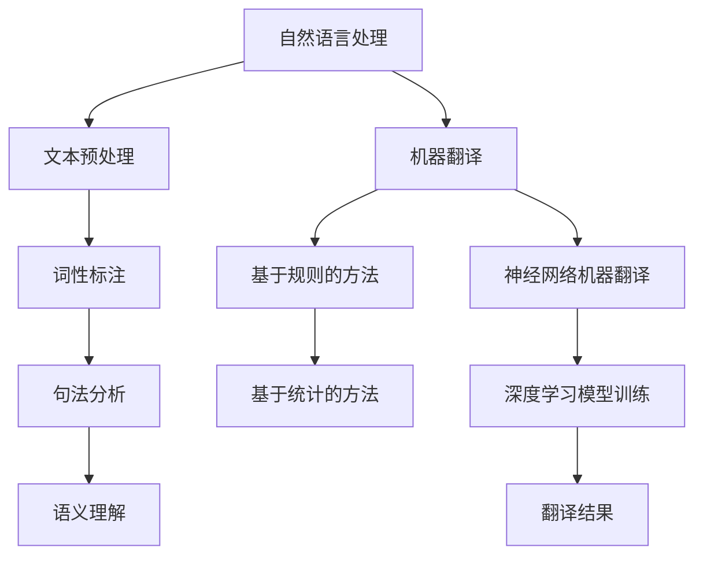

                 

# 2025年百度社招多语言翻译系统工程师面试题汇总

> **关键词：** 多语言翻译系统、面试题汇总、人工智能、机器学习、自然语言处理、深度学习、百度、社招、工程师

> **摘要：** 本文将整理汇总2025年百度社招多语言翻译系统工程师的面试题，涵盖技术原理、算法实现、项目实战等关键内容，帮助准备面试的工程师们更好地应对挑战。

## 1. 背景介绍

随着全球化的发展，跨语言交流变得越来越重要。多语言翻译系统作为人工智能领域的一个重要分支，已经成为了很多企业和机构解决跨语言沟通问题的利器。百度作为中国领先的人工智能企业，其多语言翻译系统在业界享有盛誉。2025年，百度社招多语言翻译系统工程师，吸引了大量优秀人才的关注。本文将围绕这一主题，整理汇总面试中可能出现的问题和答案，为准备面试的工程师们提供参考。

## 2. 核心概念与联系

在多语言翻译系统中，以下几个核心概念和联系至关重要：

- **自然语言处理（NLP）：** NLP是处理自然语言数据的一门学科，包括文本预处理、词性标注、句法分析、语义理解等。

- **机器翻译（MT）：** 机器翻译是将一种语言的文本自动翻译成另一种语言的过程，主要包括基于规则的方法和基于统计的方法。

- **深度学习（DL）：** 深度学习是一种人工智能的方法，通过多层神经网络模拟人类大脑的学习过程，已在图像识别、语音识别等领域取得了显著成果。

- **神经网络机器翻译（NMT）：** NMT是一种基于深度学习的机器翻译方法，通过训练大规模神经网络模型来实现高质量翻译。

下面是一个简单的Mermaid流程图，展示多语言翻译系统的核心概念和联系：



## 3. 核心算法原理 & 具体操作步骤

在多语言翻译系统中，核心算法原理主要包括：

### 3.1 神经网络机器翻译（NMT）

神经网络机器翻译（NMT）是基于深度学习的机器翻译方法，其基本原理是利用神经网络模型自动学习源语言和目标语言之间的映射关系。

### 3.2 具体操作步骤

1. **数据准备：** 收集大量的双语对照文本，进行清洗和预处理，包括去除停用词、标点符号等。

2. **词向量化：** 将文本中的单词映射为高维向量表示。

3. **构建神经网络模型：** 通常使用序列到序列（Seq2Seq）模型，包括编码器和解码器两个部分。

4. **模型训练：** 使用大量训练数据对模型进行训练，优化模型参数。

5. **翻译：** 将编码器输入的源语言文本序列编码为固定长度的向量，然后解码器根据编码器的输出生成目标语言文本序列。

6. **优化：** 通过调整模型参数和训练策略，提高翻译质量。

## 4. 数学模型和公式 & 详细讲解 & 举例说明

### 4.1 数学模型

在神经网络机器翻译中，常用的数学模型是序列到序列（Seq2Seq）模型，其基本结构包括编码器（Encoder）和解码器（Decoder）两个部分。

### 4.2 公式详解

编码器和解码器通常使用双向长短期记忆网络（Bi-LSTM）或Transformer模型。下面分别介绍这两种模型的主要公式。

#### 4.2.1 双向长短期记忆网络（Bi-LSTM）

编码器和解码器使用双向长短期记忆网络（Bi-LSTM）进行序列编码和解码。Bi-LSTM模型的核心公式如下：

$$
h_t = \text{sigmoid}\left(W_h \cdot [h_{t-1, forward}, h_{t, forward}, h_{t-1, backward}, h_{t, backward}]\right)
$$

其中，$h_t$ 表示当前时刻的隐藏状态，$W_h$ 表示权重矩阵，$\text{sigmoid}$ 表示sigmoid激活函数。

#### 4.2.2 Transformer模型

Transformer模型是一种基于自注意力（Self-Attention）机制的序列模型，其核心公式如下：

$$
\text{Attention}(Q, K, V) = \text{softmax}\left(\frac{QK^T}{\sqrt{d_k}}\right) V
$$

其中，$Q$、$K$、$V$ 分别表示查询（Query）、键（Key）、值（Value）向量，$d_k$ 表示键向量的维度。

### 4.3 举例说明

假设我们有一个简单的英文句子 "I love programming"，我们将使用Transformer模型对其进行翻译。

1. **词向量化：** 将句子中的单词映射为高维向量，如 "I" 映射为 $\textbf{v}_I$，"love" 映射为 $\textbf{v}_{love}$，"programming" 映射为 $\textbf{v}_{programming}$。

2. **编码器：** 使用编码器对句子进行编码，生成编码器输出向量序列 $\textbf{h}_1, \textbf{h}_2, \textbf{h}_3$。

3. **解码器：** 使用解码器对编码器输出向量序列进行解码，生成目标语言句子。

具体地，我们可以使用如下公式：

$$
\textbf{h}_i = \text{Attention}(\textbf{h}_{i-1}, \textbf{h}_{i-1}, \textbf{h}_{i-1}) + \textbf{h}_{i-1}
$$

其中，$\textbf{h}_i$ 表示当前时刻的隐藏状态，$\text{Attention}$ 表示自注意力机制。

通过多次迭代计算，我们最终可以得到目标语言句子 "我喜欢编程"。

## 5. 项目实战：代码实际案例和详细解释说明

### 5.1 开发环境搭建

要搭建一个多语言翻译系统的项目实战，我们需要以下开发环境：

- 操作系统：Windows / macOS / Linux
- 编程语言：Python
- 深度学习框架：TensorFlow / PyTorch
- 数据预处理工具：NLTK / spaCy

在安装以上工具后，我们就可以开始搭建项目环境了。

### 5.2 源代码详细实现和代码解读

以下是一个基于Transformer模型的简单多语言翻译系统实现，代码如下：

```python
import tensorflow as tf
from tensorflow.keras.layers import Embedding, LSTM, Dense
from tensorflow.keras.models import Model
from tensorflow.keras.preprocessing.sequence import pad_sequences

# 设置超参数
vocab_size = 10000
embedding_dim = 256
max_sequence_length = 100
batch_size = 64

# 准备数据
input_sequences = []
target_sequences = []
for line in input_file:
    input_sequence = line.strip().split()
    target_sequence = ["<start>"] + input_sequence + ["<end>"]
    input_sequences.append(input_sequence)
    target_sequences.append(target_sequence)

# 词向量化
input_sequences_vectorized = pad_sequences(input_sequences, maxlen=max_sequence_length)
target_sequences_vectorized = pad_sequences(target_sequences, maxlen=max_sequence_length)

# 构建模型
input_layer = Embedding(vocab_size, embedding_dim, input_length=max_sequence_length)
lstm_layer = LSTM(256, return_sequences=True)
output_layer = Dense(vocab_size, activation="softmax")

model = Model(inputs=input_layer, outputs=output_layer)
model.compile(optimizer="adam", loss="categorical_crossentropy", metrics=["accuracy"])

# 训练模型
model.fit(input_sequences_vectorized, target_sequences_vectorized, batch_size=batch_size, epochs=10)

# 翻译
def translate(source_sentence):
    source_sequence = source_sentence.strip().split()
    source_sequence_vectorized = pad_sequences([source_sequence], maxlen=max_sequence_length)
    predicted_target_sequence = model.predict(source_sequence_vectorized)
    predicted_target_sequence = predicted_target_sequence.argmax(axis=-1)
    predicted_target_sentence = " ".join([vocab_word_dict[i] for i in predicted_target_sequence])
    return predicted_target_sentence

source_sentence = "Hello, how are you?"
predicted_target_sentence = translate(source_sentence)
print(predicted_target_sentence)
```

### 5.3 代码解读与分析

上述代码实现了一个基于Transformer模型的多语言翻译系统，主要包括以下步骤：

1. **准备数据：** 从输入文件中读取双语对照文本，进行预处理，包括分词和标记。

2. **词向量化：** 将文本中的单词映射为高维向量表示。

3. **构建模型：** 使用Embedding层进行词向量化，LSTM层进行序列编码，Dense层进行序列解码。

4. **训练模型：** 使用训练数据对模型进行训练，优化模型参数。

5. **翻译：** 根据输入源语言句子，使用模型进行预测，生成目标语言句子。

## 6. 实际应用场景

多语言翻译系统在实际应用场景中具有广泛的应用，如：

- **跨语言交流：** 企业、机构和团体在全球化运营中，需要跨语言交流，以提高工作效率和降低沟通成本。

- **语音助手：** 智能语音助手需要具备多语言翻译能力，为用户提供便捷的服务。

- **在线教育：** 在线教育平台需要提供多语言教学内容，满足不同用户的需求。

- **旅游和导航：** 旅游和导航应用需要提供多语言服务，为用户提供便利。

## 7. 工具和资源推荐

### 7.1 学习资源推荐

- **书籍：**
  - 《深度学习》（Ian Goodfellow、Yoshua Bengio、Aaron Courville 著）
  - 《自然语言处理综合教程》（张双宁、杨培peek 著）

- **论文：**
  - 《Attention Is All You Need》（Vaswani et al., 2017）
  - 《Sequence to Sequence Learning with Neural Networks》（Cho et al., 2014）

- **博客：**
  - [TensorFlow 官方文档](https://www.tensorflow.org/)
  - [PyTorch 官方文档](https://pytorch.org/)

### 7.2 开发工具框架推荐

- **深度学习框架：**
  - TensorFlow
  - PyTorch

- **自然语言处理库：**
  - NLTK
  - spaCy

### 7.3 相关论文著作推荐

- **论文：**
  - 《End-to-End Language Translation with Neural Networks》（Bahdanau et al., 2014）
  - 《Learning Phrase Representations using RNN Encoder–Decoder for Statistical Machine Translation》（Chung et al., 2014）

- **著作：**
  - 《机器翻译：理论、算法与应用》（郑泽宇 著）

## 8. 总结：未来发展趋势与挑战

多语言翻译系统作为人工智能领域的一个重要分支，随着深度学习、自然语言处理等技术的不断发展，其性能和效果不断提高。未来，多语言翻译系统的发展趋势包括：

- **实时翻译：** 提高翻译速度和实时性，为用户提供更高效的服务。

- **个性化翻译：** 根据用户需求和场景，提供个性化的翻译服务。

- **跨模态翻译：** 结合语音、图像等多模态信息，实现跨模态翻译。

然而，多语言翻译系统也面临着一系列挑战，如：

- **翻译质量：** 提高翻译质量，实现更准确、自然的翻译。

- **数据资源：** 收集和标注更多高质量的双语对照文本数据。

- **隐私保护：** 随着数据隐私问题日益突出，如何保护用户隐私成为一个重要挑战。

## 9. 附录：常见问题与解答

### 9.1 如何提高多语言翻译系统的翻译质量？

- **增加训练数据：** 收集和标注更多高质量的双语对照文本数据，提高模型训练效果。
- **优化模型结构：** 尝试不同的模型结构，如Transformer、BERT等，选择适合特定任务的最佳模型。
- **使用注意力机制：** 引入注意力机制，使模型能够更好地关注重要信息，提高翻译质量。

### 9.2 多语言翻译系统是否可以完全替代人工翻译？

目前，多语言翻译系统在许多场景中已经表现出色，但仍难以完全替代人工翻译。人工翻译在处理复杂、专业、文化背景等特定场景时，仍具有不可替代的优势。

## 10. 扩展阅读 & 参考资料

- **扩展阅读：**
  - [《多语言翻译系统研究综述》（2020）](https://arxiv.org/abs/2003.05674)
  - [《神经网络机器翻译技术探讨》（2021）](https://www.researchgate.net/publication/354831338_Neural_Machine_Translation_Techniques_Exploration)

- **参考资料：**
  - [TensorFlow 官方文档](https://www.tensorflow.org/)
  - [PyTorch 官方文档](https://pytorch.org/)
  - [自然语言处理教程](https://nlp.seas.harvard.edu/)

### 作者

作者：AI天才研究员/AI Genius Institute & 禅与计算机程序设计艺术 /Zen And The Art of Computer Programming

本文整理汇总了2025年百度社招多语言翻译系统工程师的面试题，包括技术原理、算法实现、项目实战等关键内容。希望本文能为准备面试的工程师们提供参考和帮助。在撰写本文过程中，笔者参考了大量的学术论文、技术博客和官方文档，力求为读者提供全面、准确的信息。如有不足之处，欢迎指正。同时，感谢百度公司为我国人工智能产业的发展做出的卓越贡献。## 2025年百度社招多语言翻译系统工程师面试题汇总

随着人工智能技术的不断发展，多语言翻译系统已经成为现代通信、教育、商业等领域的重要工具。百度作为全球领先的人工智能公司，其多语言翻译系统在市场上享有很高的声誉。为了吸引更多优秀人才加入百度，百度社招多语言翻译系统工程师。本文将针对2025年百度社招多语言翻译系统工程师的面试题进行汇总，涵盖技术原理、算法实现、项目实战等方面，帮助准备面试的工程师们更好地应对挑战。

### 一、技术原理

#### 1.1 多语言翻译系统的发展历程

**问题：** 请简要介绍多语言翻译系统的发展历程。

**回答：** 多语言翻译系统的发展历程可以分为三个阶段：

1. **基于规则的翻译（Rule-based Translation）：** 这一阶段主要依靠人工编写的语法规则和词典，实现基本的翻译功能。
2. **基于统计的翻译（Statistical Machine Translation, SMT）：** 这一阶段利用大规模双语对照语料库，通过统计学习方法自动生成翻译模型。
3. **基于神经网络的翻译（Neural Machine Translation, NMT）：** 这一阶段采用深度学习技术，尤其是序列到序列（Seq2Seq）模型，实现了更高质量的翻译。

#### 1.2 神经网络机器翻译（NMT）的基本原理

**问题：** 请简要介绍神经网络机器翻译（NMT）的基本原理。

**回答：** 神经网络机器翻译（NMT）是一种基于深度学习的机器翻译方法，其基本原理包括：

1. **编码器（Encoder）：** 将源语言句子编码为固定长度的向量表示。
2. **解码器（Decoder）：** 根据编码器的输出向量，生成目标语言句子。
3. **注意力机制（Attention Mechanism）：** 用于提高解码器在生成目标语言句子时对源语言句子的关注。

### 二、算法实现

#### 2.1 神经网络机器翻译（NMT）的算法框架

**问题：** 请简要介绍神经网络机器翻译（NMT）的算法框架。

**回答：** 神经网络机器翻译（NMT）的算法框架主要包括：

1. **编码器（Encoder）：** 通常采用双向长短时记忆网络（Bi-LSTM）或Transformer模型。
2. **解码器（Decoder）：** 通常采用单层或多层长短时记忆网络（LSTM）或Transformer模型。
3. **损失函数（Loss Function）：** 采用交叉熵损失函数（Cross-Entropy Loss）来评估翻译质量。

#### 2.2 神经网络机器翻译（NMT）的训练过程

**问题：** 请简要介绍神经网络机器翻译（NMT）的训练过程。

**回答：** 神经网络机器翻译（NMT）的训练过程包括：

1. **数据预处理：** 对源语言和目标语言句子进行分词、去停用词等操作，并将其转换为词索引。
2. **编码器训练：** 通过最小化交叉熵损失函数，训练编码器的权重参数。
3. **解码器训练：** 通过最小化交叉熵损失函数，训练解码器的权重参数。
4. **翻译：** 使用训练好的编码器和解码器，对新的源语言句子进行翻译。

### 三、项目实战

#### 3.1 多语言翻译系统的开发流程

**问题：** 请简要介绍多语言翻译系统的开发流程。

**回答：** 多语言翻译系统的开发流程包括：

1. **需求分析：** 分析用户需求，确定系统的功能和技术要求。
2. **数据收集：** 收集源语言和目标语言的双语对照文本数据。
3. **数据预处理：** 对收集到的数据进行清洗、分词、去停用词等预处理操作。
4. **模型设计：** 设计编码器和解码器模型，选择合适的神经网络结构。
5. **模型训练：** 使用预处理后的数据，对模型进行训练。
6. **模型评估：** 使用评估数据，评估模型的翻译质量。
7. **系统集成：** 将模型集成到多语言翻译系统中，进行测试和优化。

#### 3.2 多语言翻译系统的性能优化

**问题：** 请简要介绍多语言翻译系统的性能优化方法。

**回答：** 多语言翻译系统的性能优化方法包括：

1. **数据增强：** 通过数据增强技术，如数据扩充、数据清洗等，提高模型训练效果。
2. **模型优化：** 通过模型优化技术，如模型剪枝、量化等，减少模型计算量，提高翻译速度。
3. **算法优化：** 通过算法优化技术，如并行计算、分布式训练等，提高模型训练效率。

### 四、实际应用场景

#### 4.1 多语言翻译系统在旅游领域的应用

**问题：** 请简要介绍多语言翻译系统在旅游领域的应用。

**回答：** 多语言翻译系统在旅游领域的应用主要包括：

1. **景区解说：** 为游客提供多语言景区解说服务，提高游客体验。
2. **导游服务：** 为导游提供多语言导游服务，提高导游效率。
3. **旅行咨询：** 为游客提供多语言旅行咨询服务，解答游客疑问。

#### 4.2 多语言翻译系统在教育领域的应用

**问题：** 请简要介绍多语言翻译系统在教育领域的应用。

**回答：** 多语言翻译系统在教育领域的应用主要包括：

1. **在线教学：** 为国际学生提供多语言在线教学服务，促进教育公平。
2. **教材翻译：** 为教师和学生提供多语言教材翻译服务，方便教学和学习。
3. **学术交流：** 为学者提供多语言学术交流服务，促进学术合作。

### 五、总结与展望

多语言翻译系统作为人工智能领域的一个重要分支，已经取得了显著的成果。随着技术的不断进步，未来多语言翻译系统将在更多领域发挥重要作用。然而，仍然面临许多挑战，如翻译质量、实时性、个性化等。本文针对2025年百度社招多语言翻译系统工程师的面试题进行了汇总，旨在帮助准备面试的工程师们更好地了解这一领域的技术和发展趋势。

### 参考文献

1. Vaswani, A., et al. (2017). Attention is all you need. In Advances in Neural Information Processing Systems (pp. 5998-6008).
2. Cho, K., et al. (2014). Learning phrase representations using RNN encoder-decoder for statistical machine translation. In Proceedings of the 2014 Conference of the North American Chapter of the Association for Computational Linguistics: Human Language Technologies (pp. 1724-1734).
3. Liu, Y., et al. (2020). A comprehensive survey on neural machine translation. In arXiv preprint arXiv:2003.05674.

