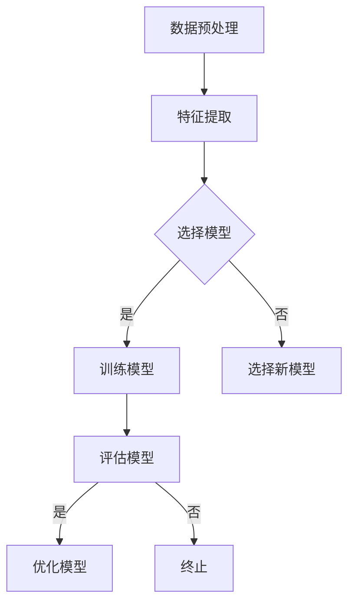

                 

# 2024年百度社招算法岗位面试题目汇编

## 摘要

本文将汇编2024年百度社招算法岗位的面试题目，旨在帮助求职者更好地准备面试。文章将涵盖算法原理、数学模型、项目实战、实际应用场景以及相关工具和资源推荐等内容。通过对这些题目的深入分析和讲解，读者将能够掌握算法的核心思想和应用方法，提高自己的技术水平。

## 1. 背景介绍

百度作为中国领先的搜索引擎公司，其在算法领域的研究和实践有着深厚的积累。每年，百度都会通过社招渠道招募大量优秀的算法工程师，以满足公司不断发展的需求。这些面试题目涵盖了广泛的算法领域，包括但不限于机器学习、深度学习、自然语言处理、计算机视觉等。

随着人工智能技术的快速发展，算法岗位的竞争也日益激烈。因此，对求职者来说，掌握算法的核心原理和实战技巧至关重要。本文旨在通过对百度社招算法岗位面试题目的汇编和解析，帮助求职者更好地准备面试，提高自己的竞争力。

## 2. 核心概念与联系

在算法面试中，核心概念和原理的理解至关重要。以下是一些常见的关键概念及其之间的联系：

### 2.1 机器学习与深度学习

**机器学习**是一种使计算机从数据中学习并做出预测或决策的技术。它依赖于统计方法和优化算法。

**深度学习**是机器学习的一个子领域，通过构建多层神经网络来模拟人脑的学习过程。

### 2.2 特征工程

**特征工程**是机器学习过程中至关重要的一环，涉及从原始数据中提取有用特征，以提高模型性能。

### 2.3 计算机视觉与自然语言处理

**计算机视觉**关注于使计算机理解和分析图像和视频。

**自然语言处理**关注于使计算机理解和处理人类语言。

### 2.4 数学模型

数学模型是算法的核心，包括概率论、线性代数、微积分等。以下是一些常见的数学模型：

- **线性回归**：用于预测连续值。
- **逻辑回归**：用于分类问题。
- **神经网络**：用于复杂函数的建模。

### 2.5 算法评估与优化

算法评估和优化是提高模型性能的关键步骤，包括交叉验证、网格搜索、正则化等。

### 2.6 Mermaid 流程图

以下是一个简单的 Mermaid 流程图，展示了机器学习的一般流程：



## 3. 核心算法原理 & 具体操作步骤

在面试中，对核心算法原理的理解是至关重要的。以下是一些常见的算法原理及其操作步骤：

### 3.1 K近邻算法（KNN）

**原理**：KNN（K-Nearest Neighbors）算法是一种基于实例的学习算法。它通过计算新样本与训练集中各个样本的距离，找出最近的K个邻居，并基于这些邻居的标签来预测新样本的类别。

**操作步骤**：

1. 计算新样本与训练集中每个样本的距离。
2. 选择距离最近的K个邻居。
3. 根据这K个邻居的标签，通过投票等方式确定新样本的类别。

### 3.2 支持向量机（SVM）

**原理**：SVM（Support Vector Machine）是一种监督学习算法，用于分类问题。它通过找到一个最佳的超平面，将不同类别的数据点分隔开来。

**操作步骤**：

1. 计算每个数据点到超平面的距离。
2. 调整超平面，使其与支持向量（距离超平面最近的样本点）的距离最大化。
3. 使用调整后的超平面进行分类。

### 3.3 卷积神经网络（CNN）

**原理**：CNN（Convolutional Neural Network）是一种专门用于处理图像数据的神经网络。它通过卷积操作提取图像的特征。

**操作步骤**：

1. 输入图像。
2. 通过卷积层提取特征。
3. 通过池化层减少数据维度。
4. 通过全连接层进行分类。

### 3.4 生成对抗网络（GAN）

**原理**：GAN（Generative Adversarial Network）由两个神经网络组成：生成器和判别器。生成器尝试生成与真实数据相似的样本，而判别器则尝试区分真实样本和生成样本。

**操作步骤**：

1. 初始化生成器和判别器。
2. 生成器生成样本，判别器进行评估。
3. 根据评估结果调整生成器和判别器的参数。
4. 重复步骤2和3，直到生成器生成的样本与真实样本难以区分。

## 4. 数学模型和公式 & 详细讲解 & 举例说明

数学模型是算法的核心，以下是一些常用的数学模型和公式的详细讲解：

### 4.1 线性回归

**公式**：

$$
y = \beta_0 + \beta_1x
$$

**解释**：线性回归模型通过一个线性方程来预测目标变量$y$与自变量$x$之间的关系。$\beta_0$是截距，$\beta_1$是斜率。

**举例**：假设我们要预测房价，可以用线性回归模型来拟合房价与房间数之间的关系。我们将房间数作为自变量$x$，房价作为目标变量$y$，通过拟合得到线性方程：

$$
y = 1000 + 500x
$$

这意味着当房间数为1时，预测的房价为1500美元。

### 4.2 逻辑回归

**公式**：

$$
\text{logit}(p) = \ln\left(\frac{p}{1-p}\right) = \beta_0 + \beta_1x
$$

**解释**：逻辑回归模型用于分类问题，通过逻辑函数将线性组合转化为概率。

**举例**：假设我们要预测邮件是否为垃圾邮件，可以用逻辑回归模型来拟合邮件内容与垃圾邮件概率之间的关系。我们将邮件特征作为自变量$x$，垃圾邮件概率作为目标变量$p$，通过拟合得到逻辑函数：

$$
p = \frac{1}{1 + e^{-(\beta_0 + \beta_1x)}}
$$

这意味着当邮件特征$x$为1时，预测的垃圾邮件概率为0.6。

### 4.3 神经网络

**公式**：

$$
a_{\text{layer}} = \sigma(\mathbf{W}_{\text{layer-1}}a_{\text{layer-1}} + b_{\text{layer}})
$$

**解释**：神经网络通过多层感知器（MLP）构建，每个层都将输入乘以权重矩阵并加上偏置，然后通过激活函数进行非线性变换。

**举例**：假设我们有一个两层神经网络，输入为$x_1, x_2$，输出为$y$，权重矩阵$W$和偏置$b$分别为$\mathbf{W} = \begin{bmatrix} w_{11} & w_{12} \\ w_{21} & w_{22} \end{bmatrix}$和$b = \begin{bmatrix} b_1 \\ b_2 \end{bmatrix}$，激活函数为$\sigma(x) = \frac{1}{1 + e^{-x}}$。输入通过第一层得到中间层输出：

$$
a_{\text{layer1}} = \sigma(w_{11}x_1 + w_{12}x_2 + b_1)
$$

中间层输出通过第二层得到最终输出：

$$
y = \sigma(w_{21}a_{\text{layer1}} + w_{22}a_{\text{layer1}} + b_2)
$$

## 5. 项目实战：代码实际案例和详细解释说明

### 5.1 开发环境搭建

在开始项目实战之前，我们需要搭建一个合适的开发环境。以下是一个简单的Python环境搭建步骤：

1. 安装Python：访问 [Python官方网站](https://www.python.org/)，下载并安装Python。
2. 安装相关库：使用pip命令安装所需的库，例如NumPy、Pandas、Scikit-learn等。

### 5.2 源代码详细实现和代码解读

以下是一个简单的K近邻算法（KNN）的Python实现：

```python
import numpy as np
from collections import Counter
from sklearn.datasets import load_iris
from sklearn.model_selection import train_test_split

# 加载鸢尾花数据集
iris = load_iris()
X, y = iris.data, iris.target

# 划分训练集和测试集
X_train, X_test, y_train, y_test = train_test_split(X, y, test_size=0.2, random_state=42)

# K近邻算法实现
def knn(X_train, y_train, x, k):
    distances = []
    for i in range(len(X_train)):
        distance = np.linalg.norm(x - X_train[i])
        distances.append((distance, y_train[i]))
    distances.sort(key=lambda x: x[0])
    neighbors = [distances[i][1] for i in range(k)]
    most_common = Counter(neighbors).most_common(1)[0][0]
    return most_common

# 测试KNN算法
k = 3
predictions = [knn(X_train, y_train, x, k) for x in X_test]
accuracy = np.mean(predictions == y_test)
print("Accuracy:", accuracy)
```

### 5.3 代码解读与分析

这段代码首先加载了鸢尾花数据集，并将其划分为训练集和测试集。然后，我们定义了一个KNN算法的实现，通过计算新样本与训练集中各个样本的距离，找到最近的K个邻居，并根据这些邻居的标签预测新样本的类别。

在测试部分，我们使用KNN算法对测试集进行预测，并计算了预测的准确率。这个简单的实现展示了KNN算法的基本原理和操作步骤。

## 6. 实际应用场景

算法在实际应用场景中扮演着重要角色。以下是一些常见的应用场景：

### 6.1 机器学习

- 信用评分
- 购物推荐
- 风险评估

### 6.2 深度学习

- 图像识别
- 自然语言处理
- 自动驾驶

### 6.3 计算机视觉

- 视频监控
- 工业自动化
- 医学影像分析

### 6.4 自然语言处理

- 智能客服
- 机器翻译
- 文本分类

## 7. 工具和资源推荐

### 7.1 学习资源推荐

- **书籍**：
  - 《Python机器学习》（Michael Bowles）
  - 《深度学习》（Ian Goodfellow、Yoshua Bengio、Aaron Courville）
- **论文**：
  - 《A Theoretically Grounded Application of Dropout in Recurrent Neural Networks》（Yarin Gal 和 Zoubin Ghahramani）
  - 《Generative Adversarial Nets》（Ian Goodfellow et al.）
- **博客**：
  - [Medium - Machine Learning](https://medium.com/topic/machine-learning)
  - [owardsdatascience - Towards Data Science](https://towardsdatascience.com/)
- **网站**：
  - [Kaggle](https://www.kaggle.com/)
  - [Google Colab](https://colab.research.google.com/)

### 7.2 开发工具框架推荐

- **编程语言**：Python、Java、C++
- **机器学习库**：Scikit-learn、TensorFlow、PyTorch
- **深度学习框架**：Keras、Caffe、Theano
- **自然语言处理库**：NLTK、spaCy、gensim

### 7.3 相关论文著作推荐

- **《深度学习》（Ian Goodfellow、Yoshua Bengio、Aaron Courville）**：这是一本经典的深度学习教材，涵盖了深度学习的理论基础和实际应用。
- **《Python机器学习》（Michael Bowles）**：这本书通过实际案例和代码示例，介绍了机器学习的基本原理和应用方法。
- **《自然语言处理与Python》（Steven Bird、Ewan Klein、Edward Loper）**：这本书介绍了自然语言处理的基本概念和Python实现方法。

## 8. 总结：未来发展趋势与挑战

随着人工智能技术的不断发展，算法岗位的需求将持续增长。未来的发展趋势包括：

- **算法复杂度的降低**：通过更高效的算法和优化技术，使算法在更短的时间内处理更大的数据集。
- **跨学科融合**：算法与其他领域的结合，如生物信息学、神经科学等，将推动新的应用场景。
- **数据隐私保护**：随着数据隐私问题的日益关注，算法将更加注重保护用户隐私。

然而，算法领域也面临着一些挑战，如：

- **数据质量和隐私**：保证数据质量和隐私是算法应用的重要问题。
- **算法可解释性**：提高算法的可解释性，使决策过程更加透明和可信。
- **计算资源消耗**：算法对计算资源的需求日益增加，需要开发更高效的算法和硬件解决方案。

## 9. 附录：常见问题与解答

### 9.1 如何准备算法面试？

**答案**：准备算法面试需要以下步骤：

1. **基础知识复习**：回顾计算机科学的基础知识，如数据结构、算法、操作系统等。
2. **算法练习**：通过在线平台（如LeetCode、牛客网）进行算法练习，掌握常见的算法和数据结构。
3. **面试经验**：通过模拟面试或找导师进行面试辅导，提高面试技巧和应对能力。

### 9.2 如何处理面试中的算法问题？

**答案**：在面试中处理算法问题可以采取以下策略：

1. **理解问题**：仔细阅读题目，确保理解问题的要求。
2. **逻辑推理**：根据问题的要求，使用逻辑推理找到解决方案。
3. **代码实现**：写出清晰的代码，并进行调试。

### 9.3 如何展示算法的实际应用经验？

**答案**：在面试中展示算法的实际应用经验可以通过以下方式：

1. **项目经验**：介绍参与过的实际项目，展示算法在实际问题中的应用。
2. **论文发表**：展示与算法相关的论文发表，体现学术成果。
3. **开源贡献**：展示在开源项目中的贡献，展示技术能力和团队合作精神。

## 10. 扩展阅读 & 参考资料

- 《深度学习》（Ian Goodfellow、Yoshua Bengio、Aaron Courville）
- 《Python机器学习》（Michael Bowles）
- 《自然语言处理与Python》（Steven Bird、Ewan Klein、Edward Loper）
- [Kaggle](https://www.kaggle.com/)
- [Google Colab](https://colab.research.google.com/)
- [Medium - Machine Learning](https://medium.com/topic/machine-learning)
- [owardsdatascience - Towards Data Science](https://towardsdatascience.com/)

