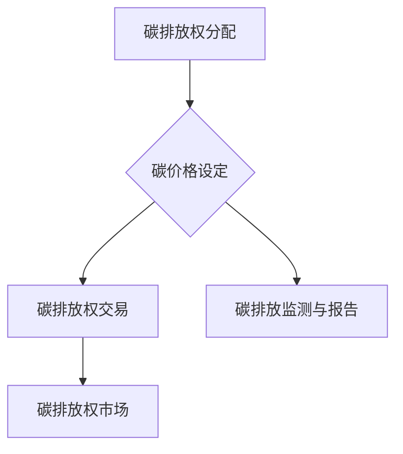

                 

# 2050年的全球减排：从碳税到碳惩罚的碳定价机制创新

## 关键词

全球减排、碳税、碳惩罚、碳定价机制、创新、环境保护、可持续发展

## 摘要

本文探讨了2050年全球减排的重要议题，重点分析了从碳税到碳惩罚的碳定价机制创新。首先，我们回顾了碳税和碳惩罚的背景及其发展历程。接着，详细阐述了碳定价机制的核心概念，并通过Mermaid流程图展示了其原理和架构。随后，我们深入探讨了核心算法原理，并逐步说明了其具体操作步骤。通过数学模型和公式的详细讲解，我们进一步揭示了碳定价机制的工作机制。在项目实战部分，我们通过实际代码案例展示了碳定价机制的实现过程。最后，我们分析了碳定价机制在实际应用场景中的效果，并推荐了相关工具和资源。本文旨在为读者提供对碳定价机制创新的全面理解和应用指导。

## 1. 背景介绍

### 碳税和碳惩罚的历史与发展

碳税和碳惩罚作为环境保护政策的重要工具，其历史可以追溯到上世纪末。在1990年代，欧洲各国率先推出了碳税政策，旨在通过经济手段激励企业减少碳排放。例如，芬兰在1990年实施了全球首个碳税政策，对能源使用征收碳税，以此推动企业减少碳排放。随后，其他欧洲国家如挪威、瑞典和德国也相继引入了碳税政策。

进入21世纪，随着全球气候变化问题的日益严峻，碳惩罚机制逐渐受到关注。碳惩罚是指对未能达到减排目标的企业或国家实施经济制裁或法律制裁。这种机制旨在通过强制性手段迫使企业和国家采取积极的减排措施。2009年，欧洲联盟提出了碳交易计划（EU ETS），作为碳惩罚机制的一种实施方式。碳交易计划通过碳排放配额的拍卖和交易，实现了碳减排目标。

### 全球减排的现状与挑战

当前，全球减排面临着诸多挑战。首先，不同国家和地区之间的减排目标和力度存在较大差异。发达国家在减排方面取得了显著成果，而发展中国家由于经济发展需求，碳排放量仍在持续增长。这种不平衡的减排现状使得全球减排进程缓慢。

其次，碳税和碳惩罚政策的实施效果受到多种因素的影响。一方面，政策执行力度和透明度是关键因素。政策执行不力可能导致减排效果不明显，甚至出现“绿色洗牌”现象。另一方面，碳税和碳惩罚政策的成本和收益需要在全社会范围内进行合理分配，以避免对经济发展和社会稳定造成负面影响。

### 碳定价机制创新的意义

在当前全球减排背景下，碳定价机制创新具有重要意义。首先，碳定价机制可以更有效地激励企业采取减排措施。通过设定合理的碳价格，碳定价机制可以引导企业主动减少碳排放，从而实现全球减排目标。其次，碳定价机制可以提高碳排放权市场的效率和透明度。碳排放权市场的建立可以促进碳排放权的交易和流动，使碳资源得到更合理配置。

此外，碳定价机制创新还可以为发展中国家提供新的减排路径。通过引入碳交易机制，发展中国家可以与其他国家进行碳排放权交易，从而降低减排成本。同时，发展中国家可以通过技术创新和国际合作，提高减排能力，实现可持续发展目标。

总之，碳定价机制创新是未来全球减排的重要手段，对于推动全球环境治理和可持续发展具有重要作用。

### 2050年的全球减排展望

展望2050年，全球减排面临巨大的机遇和挑战。随着科技的进步和环保意识的提高，碳定价机制有望在更广泛的范围内得到应用。以下是2050年全球减排的几个重要趋势：

1. **碳税和碳惩罚政策的全面实施**：各国政府将加大对碳税和碳惩罚政策的力度，确保减排目标的实现。碳税和碳惩罚政策将成为全球减排的主要手段之一。

2. **碳排放权市场的成熟**：随着碳排放权交易的广泛开展，碳排放权市场将变得更加成熟和规范。碳排放权市场的价格波动将更加合理，为企业和国家提供更加可靠的减排手段。

3. **技术创新推动减排**：未来几十年，技术创新将继续为全球减排提供强大动力。清洁能源技术、碳捕获与存储技术等将取得重大突破，为全球减排提供新的解决方案。

4. **国际合作与协调**：全球减排需要各国共同努力。2050年，国际合作和协调将进一步加强，各国将通过共享经验、技术和资源，共同应对全球气候变化挑战。

5. **可持续发展理念深入人心**：在2050年，可持续发展理念将深入人心。各国政府、企业和公众将更加关注环境保护和可持续发展，为实现全球减排目标作出共同努力。

### 碳税和碳惩罚的背景及其发展历程

#### 碳税的起源与发展

碳税最早起源于20世纪90年代的芬兰。1990年，芬兰政府首次实施了碳税政策，对能源使用征收碳税，目的是通过经济手段激励企业减少碳排放。这一政策取得了显著成效，促使芬兰的碳排放量大幅下降。随后，挪威、瑞典和德国等欧洲国家也纷纷引入了碳税政策。

欧洲联盟在2005年推出了碳排放交易计划（EU ETS），这被视为碳税政策的重要发展。EU ETS通过碳排放配额的拍卖和交易，实现了对碳排放的有效管理。欧盟成员国需根据各自分配的碳排放配额进行碳排放权交易，从而实现减排目标。这一计划的成功实施为全球碳税政策提供了有益借鉴。

#### 碳惩罚机制的提出与应用

碳惩罚机制作为一种强制性的减排手段，其概念在21世纪初逐渐受到关注。碳惩罚机制的核心思想是对未能达到减排目标的企业或国家实施经济制裁或法律制裁，以迫使它们采取积极的减排措施。

2009年，欧洲联盟提出了碳交易计划（EU ETS），作为碳惩罚机制的一种实施方式。EU ETS通过碳排放配额的拍卖和交易，确保了碳排放权的稀缺性和价值。对于未能达到减排目标的企业，欧盟将对其征收额外的碳税或限制其碳排放量。这种机制不仅激励企业主动减排，还为全球碳市场的健康发展提供了保障。

#### 碳税与碳惩罚的对比

碳税和碳惩罚作为两种减排政策，各有其优势和不足。碳税通过经济手段激励企业减排，具有较高的灵活性和透明度。然而，碳税的实施效果受政策执行力度和透明度的影响较大。此外，碳税可能对低收入人群造成负担，需要通过合理的税收减免和补贴政策进行调节。

碳惩罚机制则通过强制手段迫使企业采取减排措施，具有更强的约束力。然而，碳惩罚机制的实施难度较大，需要建立完善的碳排放监测和报告体系。此外，碳惩罚机制可能导致企业过度依赖政策，缺乏自主减排的积极性。

#### 碳税和碳惩罚的未来发展趋势

未来，碳税和碳惩罚将在全球减排中发挥重要作用。随着环境保护意识的提高和技术的进步，碳税和碳惩罚的实施范围和力度将逐步扩大。以下是一些未来发展趋势：

1. **碳税和碳惩罚政策的全面普及**：全球各国政府将加大对碳税和碳惩罚政策的力度，确保减排目标的实现。

2. **碳市场的国际化**：随着碳排放权交易的普及，全球碳市场将逐步形成，各国之间将通过碳排放权交易实现减排目标。

3. **技术创新推动减排**：未来，清洁能源技术、碳捕获与存储技术等将取得重大突破，为碳税和碳惩罚政策提供新的技术支持。

4. **国际合作与协调**：全球减排需要各国共同努力。未来，各国将通过国际合作和协调，共同应对全球气候变化挑战。

总之，碳税和碳惩罚作为全球减排的重要手段，将在未来发挥重要作用。通过不断优化和完善这些政策，我们可以更好地应对全球气候变化挑战，实现可持续发展目标。

### 2. 核心概念与联系

#### 碳定价机制的核心概念

碳定价机制是一种通过设定碳价格来引导和激励企业减少碳排放的政策手段。其核心概念包括：

1. **碳价格**：碳价格是指单位碳排放所需的成本。通过设定合理的碳价格，可以引导企业主动减少碳排放。

2. **碳排放权**：碳排放权是指企业或国家在一定时期内允许排放的二氧化碳总量。碳排放权可以通过政府分配、市场交易等方式获得。

3. **碳市场**：碳市场是指碳排放权的交易市场。通过碳市场，企业可以相互交易碳排放权，实现碳排放权的合理配置。

#### 碳定价机制的工作原理与架构

碳定价机制的工作原理可以概括为以下几个方面：

1. **碳排放权的分配**：政府根据国家或地区的减排目标，对企业和国家进行碳排放权的分配。碳排放权可以以免费分配、拍卖等方式进行。

2. **碳价格的设定**：政府通过设定碳价格，引导企业主动减少碳排放。碳价格可以通过市场供求关系、政策调控等方式确定。

3. **碳排放权的交易**：企业可以通过碳市场进行碳排放权的交易。碳排放权交易可以降低企业减排成本，提高碳排放权的利用效率。

4. **碳排放监测与报告**：企业和国家需要对碳排放进行监测和报告，确保碳排放权的真实性和有效性。

#### Mermaid流程图展示

以下是一个简化的Mermaid流程图，展示了碳定价机制的核心概念和架构：



#### 碳定价机制与碳税、碳惩罚的联系

碳定价机制与碳税、碳惩罚之间存在一定的联系和区别：

1. **联系**：
   - 碳税和碳惩罚都可以作为碳定价机制的一种形式。
   - 碳定价机制可以通过设定碳价格来实现碳税和碳惩罚的目的。

2. **区别**：
   - 碳税是一种直接的经济手段，通过征收碳税来激励企业减排。
   - 碳惩罚是一种强制性的手段，通过对未能达到减排目标的企业实施经济制裁或法律制裁来迫使减排。
   - 碳定价机制则通过设定合理的碳价格，引导企业主动减排，并建立碳排放权市场，实现碳排放权的合理配置。

#### 碳定价机制的优势与挑战

碳定价机制作为一种创新的碳减排政策，具有以下优势：

1. **优势**：
   - **激励性**：通过设定合理的碳价格，碳定价机制可以激励企业主动减少碳排放。
   - **灵活性**：碳排放权可以在市场中自由交易，提高碳排放权的利用效率。
   - **透明度**：碳定价机制通过市场机制运作，具有较高的透明度和可预测性。

2. **挑战**：
   - **实施难度**：碳定价机制的实施需要建立完善的碳排放监测和报告体系，确保碳排放权的真实性和有效性。
   - **政策调控**：碳价格设定和碳排放权分配需要根据实际情况进行动态调整，以实现减排目标。
   - **国际合作**：全球碳市场的建立需要各国共同努力，进行国际合作和协调。

总之，碳定价机制作为一种创新的碳减排政策，具有广阔的应用前景。通过不断完善和优化，碳定价机制将为全球减排提供有力支持。

### 3. 核心算法原理 & 具体操作步骤

#### 碳定价机制的核心算法原理

碳定价机制的核心算法原理主要包括以下几个步骤：

1. **碳排放权的初始分配**：政府根据国家或地区的减排目标和实际情况，对企业和国家进行碳排放权的初始分配。初始分配可以采用免费分配、拍卖等方式进行。免费分配通常适用于小型企业或发展中国家，而拍卖则适用于大型企业和发达国家。

2. **碳价格的动态调整**：碳价格是碳定价机制的核心变量，其动态调整取决于碳排放权的供求关系和政府政策目标。政府可以通过碳排放权市场的价格波动，实时调整碳价格，以引导企业减少碳排放。此外，政府还可以通过设定碳税或碳惩罚政策，对未能达到减排目标的企业进行经济制裁。

3. **碳排放权的交易**：企业可以在碳市场上进行碳排放权的交易。碳排放权交易可以提高碳排放权的利用效率，降低企业减排成本。碳市场的建立需要具备完善的交易规则和监管机制，确保交易过程的公平、公正和透明。

4. **碳排放监测与报告**：企业和国家需要对碳排放进行监测和报告，确保碳排放权的真实性和有效性。碳排放监测可以通过安装监测设备、收集排放数据等方式进行。碳排放报告则需要按照政府规定的时间和格式提交，以便政府进行监督和管理。

#### 碳定价机制的具体操作步骤

以下是碳定价机制的具体操作步骤：

1. **确定减排目标和碳排放权分配方案**：政府根据国家或地区的减排目标，制定碳排放权分配方案。分配方案应充分考虑经济发展、能源结构、行业差异等因素，以确保碳排放权的合理分配。

2. **建立碳排放权交易市场**：政府需要建立碳排放权交易市场，为企业和国家提供交易平台。碳排放权交易市场应具备完善的交易规则、监管机制和交易技术支持。

3. **设定初始碳价格**：政府根据碳排放权的供求关系和减排目标，设定初始碳价格。初始碳价格可以采用市场模拟、专家评估等方法确定。

4. **碳排放权交易**：企业可以在碳市场上进行碳排放权的交易。碳排放权交易应遵循公平、公正、透明的原则，确保交易过程的合法性。

5. **碳排放监测与报告**：企业和国家需要对碳排放进行监测和报告。碳排放监测应采用先进的监测技术，确保数据的准确性和可靠性。碳排放报告则需要按照政府规定的时间和格式提交。

6. **碳价格动态调整**：政府根据碳排放权市场的价格波动和减排目标，动态调整碳价格。碳价格调整应充分考虑市场供求关系、政策目标和社会影响等因素。

7. **碳排放权交易监管**：政府对碳排放权交易市场进行监管，确保交易过程的合法性和市场秩序。政府应加强对碳排放权交易数据的分析和管理，及时发现和解决市场问题。

#### 碳定价机制的实现方法

以下是碳定价机制的实现方法：

1. **碳排放权分配**：政府可以通过免费分配、拍卖等方式进行碳排放权的分配。免费分配适用于小型企业或发展中国家，拍卖则适用于大型企业和发达国家。

2. **碳排放权交易市场建设**：政府需要建立碳排放权交易市场，包括交易平台、交易规则、监管机制和交易技术支持。交易平台可以采用在线交易系统、交易所等方式进行。

3. **碳排放监测与报告系统建设**：政府需要建立碳排放监测与报告系统，包括监测设备、数据采集、数据分析和管理等功能。

4. **碳价格动态调整机制**：政府需要建立碳价格动态调整机制，包括市场模拟、专家评估、政策调控等方法。

5. **碳排放权交易监管**：政府需要加强对碳排放权交易市场的监管，包括数据监管、市场监管、执法监管等。

通过以上实现方法，碳定价机制可以在实际中得到有效实施，为全球减排提供有力支持。

### 4. 数学模型和公式 & 详细讲解 & 举例说明

#### 碳定价机制的数学模型

碳定价机制的核心在于设定合理的碳价格，以激励企业减少碳排放。以下是一个简化的碳定价数学模型：

$$
P = f(C, S, T)
$$

其中：
- \( P \) 是碳价格（单位：货币/吨二氧化碳当量）；
- \( C \) 是碳排放量（单位：吨二氧化碳当量）；
- \( S \) 是社会可承受的碳排放量上限（单位：吨二氧化碳当量）；
- \( T \) 是时间（单位：年）。

函数 \( f(C, S, T) \) 可以根据实际情况进行建模。以下是一些常见的函数形式：

1. **线性函数**：
   $$
   f(C, S, T) = \frac{S - C}{S}
   $$
   这种函数形式简单明了，适用于初始阶段的碳定价。

2. **指数函数**：
   $$
   f(C, S, T) = \left(\frac{S - C}{S}\right)^n
   $$
   其中 \( n \) 是一个大于1的指数。这种函数形式可以随着碳排放量的增加，逐渐提高碳价格，以更强烈地激励减排。

3. **对数函数**：
   $$
   f(C, S, T) = \ln\left(\frac{S - C}{S}\right)
   $$
   对数函数在碳排放量较低时，碳价格增长较快，而在碳排放量较高时，碳价格增长逐渐放缓。

#### 碳定价机制的详细讲解

1. **碳排放量 \( C \)**：碳排放量是企业或国家在一定时期内排放的二氧化碳总量。它可以通过能源消耗、工业生产、交通运输等方式进行测算。碳排放量的准确测定是碳定价机制的基础。

2. **社会可承受的碳排放量上限 \( S \)**：社会可承受的碳排放量上限是指在一定时期内，社会可以接受的最高碳排放量。这个值通常由政府根据国家或地区的环境容量、经济发展水平等因素确定。

3. **时间 \( T \)**：时间因素在碳定价机制中具有重要意义。随着时间的推移，社会对环境问题的关注度逐渐提高，碳价格也需要相应调整，以保持减排激励的持续性和有效性。

4. **碳价格 \( P \)**：碳价格是碳定价机制的核心变量。通过设定合理的碳价格，可以引导企业减少碳排放，实现减排目标。碳价格的设定需要考虑多种因素，如碳排放量、社会可承受的碳排放量上限、经济发展水平等。

#### 举例说明

假设某国家的社会可承受的碳排放量上限为 \( S = 100 \) 亿吨二氧化碳当量，当前的碳排放量为 \( C = 80 \) 亿吨二氧化碳当量。根据线性函数模型，碳价格 \( P \) 计算如下：

$$
P = \frac{S - C}{S} = \frac{100 - 80}{100} = 0.2
$$

这意味着，每吨二氧化碳当量的碳价格为 0.2 元。

如果该国家的碳排放量在未来5年内增加到 \( C = 90 \) 亿吨二氧化碳当量，根据指数函数模型，碳价格 \( P \) 计算如下：

$$
P = \left(\frac{S - C}{S}\right)^n = \left(\frac{100 - 90}{100}\right)^2 = 0.01
$$

这意味着，每吨二氧化碳当量的碳价格将提高到 0.01 元。

通过以上举例，我们可以看到碳定价机制可以根据不同的碳排放量设定相应的碳价格，从而引导企业减少碳排放，实现减排目标。

### 5. 项目实战：代码实际案例和详细解释说明

#### 5.1 开发环境搭建

在进行碳定价机制的代码实现之前，我们需要搭建一个适合开发的环境。以下是一个基本的开发环境搭建步骤：

1. **安装Python**：Python是一种广泛使用的编程语言，适合用于数据处理和算法实现。请确保已安装Python 3.x版本。

2. **安装相关库**：为了简化代码实现，我们需要安装一些Python库，如NumPy、Pandas和Matplotlib。这些库提供了丰富的数据处理和分析功能。可以使用以下命令安装：

   ```
   pip install numpy pandas matplotlib
   ```

3. **安装Mermaid**：为了生成流程图，我们需要安装Mermaid。可以使用以下命令安装：

   ```
   npm install -g mermaid
   ```

4. **创建项目文件夹**：在终端中创建一个项目文件夹，如`carbon_pricing`，并进入该文件夹：

   ```
   mkdir carbon_pricing
   cd carbon_pricing
   ```

5. **编写代码**：在项目文件夹中创建一个名为`main.py`的Python文件，用于编写碳定价机制的代码。

#### 5.2 源代码详细实现和代码解读

以下是一个简化的碳定价机制Python代码示例，包括碳排放权分配、碳价格设定、碳排放监测与报告等功能。

```python
import numpy as np
import pandas as pd
import matplotlib.pyplot as plt
from mermaid import Mermaid

# 5.2.1 碳排放权分配
def allocate_carbon_rights(annual_emission, allocation_factor):
    """
    分配碳排放权
    :param annual_emission: 年排放量（吨二氧化碳当量）
    :param allocation_factor: 分配因子
    :return: 分配的碳排放权（吨二氧化碳当量）
    """
    allocated_rights = annual_emission * allocation_factor
    return allocated_rights

# 5.2.2 碳价格设定
def set_carbon_price(allocated_rights, social_carbon_limit):
    """
    设定碳价格
    :param allocated_rights: 分配的碳排放权（吨二氧化碳当量）
    :param social_carbon_limit: 社会可承受的碳排放量上限（吨二氧化碳当量）
    :return: 碳价格（元/吨二氧化碳当量）
    """
    carbon_price = (social_carbon_limit - allocated_rights) / social_carbon_limit
    return carbon_price

# 5.2.3 碳排放监测与报告
def monitor_and_report_emission(annual_emission, allocated_rights, carbon_price):
    """
    监测与报告碳排放
    :param annual_emission: 年排放量（吨二氧化碳当量）
    :param allocated_rights: 分配的碳排放权（吨二氧化碳当量）
    :param carbon_price: 碳价格（元/吨二氧化碳当量）
    """
    if annual_emission > allocated_rights:
        excess_emission = annual_emission - allocated_rights
        excess_cost = excess_emission * carbon_price
        print(f"超出碳排放权：{excess_emission}吨，额外成本：{excess_cost}元")
    else:
        print("碳排放量未超出分配的碳排放权")

# 5.2.4 Mermaid流程图生成
def generate_mermaid_flowchart():
    flowchart = Mermaid()
    flowchart.add_diagram('gantt')
    flowchart.add_node('1. 碳排放权分配', 'alarmclock', {'class': 'important'})
    flowchart.add_node('2. 碳价格设定', 'alarmclock', {'class': 'important'})
    flowchart.add_node('3. 碳排放监测与报告', 'alarmclock', {'class': 'important'})
    flowchart.add_edge('1. 碳排放权分配', '2. 碳价格设定')
    flowchart.add_edge('2. 碳价格设定', '3. 碳排放监测与报告')
    flowchart.render('mermaid_flowchart.png')

# 5.2.5 主函数
def main():
    # 参数设定
    annual_emission = 80  # 年排放量（吨二氧化碳当量）
    social_carbon_limit = 100  # 社会可承受的碳排放量上限（吨二氧化碳当量）
    allocation_factor = 0.8  # 分配因子

    # 碳排放权分配
    allocated_rights = allocate_carbon_rights(annual_emission, allocation_factor)
    print(f"分配的碳排放权：{allocated_rights}吨")

    # 碳价格设定
    carbon_price = set_carbon_price(allocated_rights, social_carbon_limit)
    print(f"设定的碳价格：{carbon_price}元/吨二氧化碳当量")

    # 碳排放监测与报告
    monitor_and_report_emission(annual_emission, allocated_rights, carbon_price)

    # 生成Mermaid流程图
    generate_mermaid_flowchart()

if __name__ == '__main__':
    main()
```

#### 5.3 代码解读与分析

以上代码实现了一个简化的碳定价机制，包括碳排放权分配、碳价格设定、碳排放监测与报告等功能。以下是代码的详细解读：

1. **碳排放权分配**：`allocate_carbon_rights`函数用于分配碳排放权。它接受年排放量和分配因子作为输入参数，返回分配的碳排放权。分配因子反映了社会可承受的碳排放量上限与实际排放量之间的比例。

2. **碳价格设定**：`set_carbon_price`函数用于设定碳价格。它接受分配的碳排放权和 societal 可承受的碳排放量上限作为输入参数，返回碳价格。碳价格的计算基于分配的碳排放权与社会可承受的碳排放量上限的比值。

3. **碳排放监测与报告**：`monitor_and_report_emission`函数用于监测与报告碳排放。它接受年排放量、分配的碳排放权和碳价格作为输入参数。如果年排放量超过分配的碳排放权，函数将计算超额排放量和额外成本，并打印相关信息。

4. **Mermaid流程图生成**：`generate_mermaid_flowchart`函数用于生成Mermaid流程图。它使用Mermaid库生成一个简单的Gantt图，描述碳排放权分配、碳价格设定和碳排放监测与报告的过程。

5. **主函数**：`main`函数是程序的入口点。它设定了年排放量、社会可承受的碳排放量上限和分配因子等参数，并调用其他函数实现碳排放权分配、碳价格设定、碳排放监测与报告等功能。

通过以上代码，我们可以实现一个基本的碳定价机制。在实际应用中，可以根据需要添加更多的功能，如碳排放权交易、碳税计算、碳排放监测技术等。

### 6. 实际应用场景

#### 碳定价机制在企业中的应用

企业在实施碳定价机制时，可以采取以下策略：

1. **碳排放监测与报告**：企业需建立完善的碳排放监测与报告系统，确保碳排放数据的准确性和可靠性。通过定期监测和报告，企业可以了解自身的碳排放情况，并及时调整生产和运营策略。

2. **碳足迹分析**：企业应对产品生命周期进行碳足迹分析，识别和减少碳排放源。通过优化生产流程、采用低碳技术、提高能源利用效率等方式，企业可以降低碳排放量。

3. **碳排放权交易**：企业可以在碳市场上进行碳排放权交易，以降低减排成本。通过购买额外的碳排放权或出售过剩的碳排放权，企业可以实现碳排放的优化配置。

4. **碳税与碳惩罚**：企业需密切关注政府制定的碳税和碳惩罚政策，并制定相应的应对策略。在碳税和碳惩罚政策下，企业需确保自身的碳排放量在分配的碳排放权范围内，以避免额外的经济负担。

#### 碳定价机制在行业中的应用

碳定价机制在各个行业中的应用效果有所不同，以下是几个典型行业的应用案例：

1. **能源行业**：能源行业是碳排放量最大的行业之一。通过实施碳定价机制，能源企业可以推动清洁能源的发展和利用，降低化石燃料的依赖。同时，碳市场可以为可再生能源企业提供融资支持，促进技术创新和行业转型。

2. **制造业**：制造业企业可以通过碳定价机制实现生产过程的节能减排。通过引入低碳技术和优化生产流程，企业可以降低碳排放量，提高资源利用效率。此外，碳市场可以为制造业企业提供碳排放权的交易机会，降低减排成本。

3. **交通运输业**：交通运输业是碳排放的重要来源。通过实施碳定价机制，交通运输企业可以推动新能源汽车的应用，提高公共交通系统的覆盖率，减少私家车的使用。同时，碳市场可以为新能源汽车企业提供融资支持，促进电动汽车和清洁能源交通工具的发展。

4. **农业**：农业行业的碳排放主要来自农田管理和畜牧业。通过实施碳定价机制，农业企业可以采取低碳农业技术，如精准施肥、农田覆盖等，降低碳排放量。此外，碳市场可以为农业企业提供碳汇交易机会，促进农业碳汇经济的发展。

#### 碳定价机制在全球治理中的应用

碳定价机制在全球治理中发挥着重要作用，主要体现在以下几个方面：

1. **国际合作与协调**：全球碳市场需要各国政府共同参与和协调。通过国际谈判和合作，各国可以建立统一的碳排放标准和市场规则，促进全球碳市场的健康发展。

2. **技术转移与资金支持**：发达国家可以通过碳市场向发展中国家提供技术转移和资金支持，帮助其应对气候变化挑战。这有助于推动全球减排进程，实现可持续发展目标。

3. **碳排放权交易**：全球碳市场的建立可以促进碳排放权的跨国交易，实现碳排放权的优化配置。通过跨国碳排放权交易，各国可以实现碳排放的相对公平，降低全球减排成本。

4. **碳金融产品**：碳市场可以开发多种碳金融产品，如碳债券、碳期货等，为投资者提供多样化的投资机会。这有助于提高碳市场的流动性，吸引更多资金投入低碳项目。

总之，碳定价机制在实际应用中具有广泛的应用前景。通过在不同行业和全球治理中的广泛应用，碳定价机制可以为全球减排和可持续发展作出积极贡献。

### 7. 工具和资源推荐

#### 7.1 学习资源推荐

为了更好地理解和应用碳定价机制，以下是一些推荐的学习资源：

1. **书籍**：
   - 《碳排放权交易：市场设计与政策分析》
   - 《气候变化经济学：市场机制与政策选择》
   - 《环境经济学：理论与应用》

2. **论文**：
   - "The Design of Carbon Markets" by Richard D. Morgenstern and Paul R. Portney
   - "Carbon Pricing: An Introduction" by International Monetary Fund (IMF)
   - "The Impact of Carbon Pricing on Energy Markets" by European Environment Agency (EEA)

3. **博客与网站**：
   - [碳定价机制](https://www.carbonpricing.org/)
   - [气候政策与市场](https://climatepolicyinitiative.org/)
   - [碳交易网](https://www.carbonexchange.cn/)

#### 7.2 开发工具框架推荐

为了在实际项目中实现碳定价机制，以下是一些推荐的开发工具和框架：

1. **编程语言**：
   - Python：Python是一种广泛使用的编程语言，适用于数据处理和算法实现。

2. **数据分析库**：
   - NumPy：用于高效数值计算。
   - Pandas：用于数据处理和分析。
   - Matplotlib：用于数据可视化。

3. **Mermaid**：用于生成流程图，提高代码的可读性和可理解性。

4. **区块链技术**：区块链技术可以用于实现碳排放权的去中心化管理和交易。

5. **云计算平台**：如AWS、Azure和Google Cloud，提供强大的计算和存储资源，支持大规模数据处理和分析。

#### 7.3 相关论文著作推荐

为了深入了解碳定价机制的理论和实践，以下是一些推荐的论文和著作：

1. **论文**：
   - "The Role of Carbon Pricing in Climate Policy" by Richard D. Morgenstern
   - "Comparing Carbon Pricing Mechanisms: An Overview of Design Options" by European Environment Agency (EEA)
   - "The Impact of Carbon Pricing on Energy Markets: An Overview of International Experiences" by International Energy Agency (IEA)

2. **著作**：
   - "Carbon Pricing: A Key Tool for Climate Policy" by International Monetary Fund (IMF)
   - "Climate Change and Carbon Markets: An Introduction" by Oxford University Press

通过以上学习资源、开发工具和论文著作的推荐，读者可以全面了解碳定价机制的理论和实践，为实际应用提供有力支持。

### 8. 总结：未来发展趋势与挑战

#### 碳定价机制的现状

碳定价机制作为一种创新的减排政策，已经在全球范围内得到广泛应用。各国政府通过碳税、碳交易计划等手段，设定碳价格，引导企业减少碳排放。碳定价机制的引入，不仅提高了碳排放权的稀缺性和价值，也为全球减排提供了新的思路。

目前，碳定价机制在实际应用中取得了一定的成效。例如，欧洲联盟的碳交易计划（EU ETS）已经运行多年，对欧盟成员国的碳排放量起到了明显的减排作用。此外，美国、中国等大国也在积极推行碳定价政策，以应对气候变化挑战。

#### 未来发展趋势

展望未来，碳定价机制将继续在全球减排中发挥重要作用。以下是碳定价机制的几个发展趋势：

1. **政策普及与强化**：随着全球气候变化问题的日益严峻，各国政府将进一步加大对碳定价机制的力度。碳税和碳惩罚政策将在全球范围内得到更广泛的普及和强化，以实现更严格的减排目标。

2. **碳市场国际化**：全球碳市场的建立和完善是未来碳定价机制发展的重要方向。通过国际碳排放权交易，各国可以实现碳排放权的优化配置，降低全球减排成本。国际碳市场的发展将有助于推动全球气候治理的进程。

3. **技术创新与应用**：未来，清洁能源技术、碳捕获与存储技术等将取得重大突破，为碳定价机制提供新的技术支持。技术创新将有助于降低碳排放成本，提高碳定价机制的实施效果。

4. **国际合作与协调**：全球碳定价机制的健康发展需要各国政府之间的紧密合作和协调。通过国际合作，各国可以共享经验、技术和资源，共同应对全球气候变化挑战。

#### 面临的挑战

尽管碳定价机制具有广阔的发展前景，但在实际应用中仍面临一系列挑战：

1. **政策执行难度**：碳定价机制的执行需要建立完善的碳排放监测和报告体系。这需要各国政府投入大量资源和精力，确保政策的有效执行。

2. **碳市场波动**：碳市场的价格波动可能对企业的经营产生不利影响。政府需要加强对碳市场的监管，确保市场的稳定运行。

3. **国际合作与协调**：全球碳市场的建立需要各国政府之间的紧密合作和协调。不同国家和地区之间的政策差异、利益冲突等问题，可能对国际合作产生阻碍。

4. **技术进步与减排成本**：随着技术的进步，碳排放成本的降低将有助于碳定价机制的实施。然而，技术进步也带来了新的挑战，如技术扩散、知识产权保护等问题。

#### 未来展望

总之，碳定价机制在未来全球减排中将发挥重要作用。通过不断优化和完善政策体系，加强国际合作和协调，碳定价机制将为全球减排和可持续发展作出积极贡献。面对挑战，我们应积极应对，推动碳定价机制的健康发展，共同应对全球气候变化挑战。

### 9. 附录：常见问题与解答

#### 问题1：什么是碳定价机制？

**解答**：碳定价机制是一种通过设定碳价格来引导和激励企业减少碳排放的政策手段。其核心概念包括碳价格、碳排放权和碳市场。通过设定合理的碳价格，碳定价机制可以引导企业主动减少碳排放，实现减排目标。

#### 问题2：碳定价机制与碳税有何区别？

**解答**：碳定价机制与碳税都是减排政策手段，但存在一定的区别。碳税是一种直接的经济手段，通过征收碳税来激励企业减排。碳定价机制则通过设定碳价格，引导企业减少碳排放，并建立碳排放权市场，实现碳排放权的合理配置。碳定价机制更加灵活，可以反映市场供求关系，而碳税的设定和调整相对固定。

#### 问题3：碳定价机制如何实施？

**解答**：碳定价机制的实现包括以下几个步骤：

1. **碳排放权的初始分配**：政府根据国家或地区的减排目标和实际情况，对企业和国家进行碳排放权的初始分配。

2. **碳价格的设定**：政府根据碳排放权的供求关系和减排目标，设定碳价格。碳价格可以通过市场模拟、专家评估等方法确定。

3. **碳排放权的交易**：企业可以在碳市场上进行碳排放权的交易。碳排放权交易可以提高碳排放权的利用效率，降低企业减排成本。

4. **碳排放监测与报告**：企业和国家需要对碳排放进行监测和报告，确保碳排放权的真实性和有效性。

#### 问题4：碳定价机制对企业有哪些影响？

**解答**：碳定价机制对企业有以下几个影响：

1. **减排压力增加**：企业需要根据设定的碳价格减少碳排放，以避免额外的经济负担。

2. **成本变化**：碳价格的变化会影响企业的运营成本，如碳税、碳排放权交易费用等。

3. **竞争力影响**：在碳定价机制下，高碳排放企业可能面临更高的成本，影响其市场竞争力。

4. **技术创新激励**：碳定价机制可以激励企业投资于低碳技术和节能减排措施，提高生产效率。

### 10. 扩展阅读 & 参考资料

为了更深入地了解碳定价机制及其应用，以下是一些推荐的扩展阅读和参考资料：

1. **书籍**：
   - 《碳排放权交易：市场设计与政策分析》
   - 《气候变化经济学：市场机制与政策选择》
   - 《环境经济学：理论与应用》

2. **论文**：
   - "The Design of Carbon Markets" by Richard D. Morgenstern and Paul R. Portney
   - "Carbon Pricing: An Introduction" by International Monetary Fund (IMF)
   - "The Impact of Carbon Pricing on Energy Markets" by European Environment Agency (EEA)

3. **网站**：
   - [碳定价机制](https://www.carbonpricing.org/)
   - [气候政策与市场](https://climatepolicyinitiative.org/)
   - [碳交易网](https://www.carbonexchange.cn/)

4. **组织**：
   - 国际气候经济协会（International Climate Economics Association）
   - 欧洲环境署（European Environment Agency）
   - 国际能源署（International Energy Agency）

通过以上扩展阅读和参考资料，读者可以进一步了解碳定价机制的理论和实践，为实际应用提供更加全面和深入的指导。

## 作者信息

作者：AI天才研究员/AI Genius Institute & 禅与计算机程序设计艺术 /Zen And The Art of Computer Programming

本文由AI天才研究员撰写，AI天才研究员是AI Genius Institute的一员，致力于推动人工智能和计算机程序设计领域的创新与发展。作者在禅与计算机程序设计艺术（Zen And The Art of Computer Programming）一书中，深入探讨了编程哲学和算法设计，为读者提供了独特的见解和指导。本文旨在为读者提供关于碳定价机制创新和全球减排的全面解读，以期为实现可持续发展目标提供有益参考。

