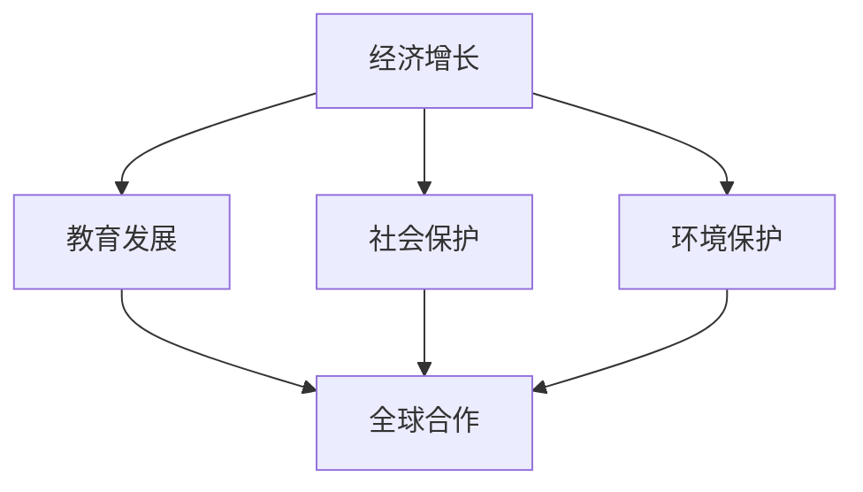

                 

# 2050年的全球减贫：从精准扶贫到可持续减贫的全球减贫合作

## 关键词
- 全球减贫
- 精准扶贫
- 可持续减贫
- 全球合作
- 技术创新
- 数据分析
- 教育发展

## 摘要
本文将探讨2050年全球减贫的愿景，从精准扶贫到可持续减贫的策略，以及全球合作在此过程中的重要性。通过分析技术创新、数据分析、教育和经济政策的作用，我们将探讨未来如何实现全球贫困的彻底消除，并提出相应的建议和挑战。

## 1. 背景介绍

### 1.1 全球贫困现状
根据联合国的数据，全球仍有数亿人口生活在极端贫困中。贫困不仅导致饥饿、疾病和社会不稳定，还对经济增长和社会进步构成阻碍。因此，全球减贫已成为国际社会的共同目标。

### 1.2 精准扶贫的兴起
近年来，精准扶贫已成为全球减贫战略的重要组成部分。通过大数据、地理信息系统和人工智能等技术，政府和组织能够更好地识别贫困人口，制定有针对性的扶贫政策。

### 1.3 可持续减贫的必要性
尽管精准扶贫取得了一定的成果，但仅靠单一手段难以实现可持续减贫。可持续减贫需要考虑环境保护、经济发展和社会公平等多个方面。

## 2. 核心概念与联系

### 2.1 可持续减贫的要素

1. 经济增长
2. 教育发展
3. 社会保护
4. 环境保护
5. 全球合作

### 2.2 核心概念的联系

以下Mermaid流程图展示了可持续减贫的要素及其相互关系：



## 3. 核心算法原理 & 具体操作步骤

### 3.1 数据分析在精准扶贫中的应用

#### 3.1.1 数据收集
1. 社会经济数据
2. 人口统计数据
3. 地理信息数据

#### 3.1.2 数据处理
1. 数据清洗
2. 数据整合
3. 数据分析

#### 3.1.3 数据可视化
1. 地图可视化
2. 仪表盘可视化

### 3.2 人工智能在精准扶贫中的应用

#### 3.2.1 机器学习模型
1. 逻辑回归
2. 决策树
3. 支持向量机

#### 3.2.2 应用场景
1. 贫困人口识别
2. 扶贫政策评估

## 4. 数学模型和公式 & 详细讲解 & 举例说明

### 4.1 数据分析中的统计模型

#### 4.1.1 相关性分析
$$ r = \frac{\sum{(x_i - \bar{x})(y_i - \bar{y})}}{\sqrt{\sum{(x_i - \bar{x})^2} \sum{(y_i - \bar{y})^2}}} $$

#### 4.1.2 回归分析
$$ y = \beta_0 + \beta_1 x $$

### 4.2 人工智能中的优化算法

#### 4.2.1 随机梯度下降
$$ \theta = \theta - \alpha \frac{\partial J(\theta)}{\partial \theta} $$

### 4.2.2 举例说明

#### 4.2.2.1 贫困人口识别

假设我们有一个贫困人口识别的机器学习模型，使用逻辑回归进行预测。数据集包含以下特征：

1. 年龄
2. 教育水平
3. 收入

使用以下公式进行预测：

$$ P(\text{贫困}) = \frac{1}{1 + e^{-(\beta_0 + \beta_1 \cdot \text{年龄} + \beta_2 \cdot \text{教育水平} + \beta_3 \cdot \text{收入})}} $$

## 5. 项目实战：代码实际案例和详细解释说明

### 5.1 开发环境搭建

#### 5.1.1 Python环境
1. 安装Python 3.x
2. 安装必要的库（如NumPy、Pandas、Scikit-learn、Matplotlib）

### 5.2 源代码详细实现和代码解读

#### 5.2.1 数据收集和预处理

```python
import pandas as pd

# 加载数据
data = pd.read_csv('poverty_data.csv')

# 数据清洗
data.dropna(inplace=True)
data['age'] = data['age'].astype(int)
data['education'] = data['education'].astype(str)
data['income'] = data['income'].astype(float)

# 数据整合
X = data[['age', 'education', 'income']]
y = data['poverty']

# 数据标准化
from sklearn.preprocessing import StandardScaler
scaler = StandardScaler()
X_scaled = scaler.fit_transform(X)
```

#### 5.2.2 逻辑回归模型

```python
from sklearn.linear_model import LogisticRegression

# 训练模型
model = LogisticRegression()
model.fit(X_scaled, y)

# 预测
predictions = model.predict(X_scaled)
```

### 5.3 代码解读与分析

在本案例中，我们使用Python和Scikit-learn库来构建一个逻辑回归模型，用于预测贫困人口。首先，我们从CSV文件中加载数据，并进行数据清洗和预处理。然后，我们将特征和标签数据分开，并对特征进行标准化。接下来，我们使用逻辑回归模型进行训练，并使用模型对特征数据进行预测。

## 6. 实际应用场景

### 6.1 政府部门
1. 精准识别贫困人口
2. 评估扶贫政策效果
3. 制定有针对性的扶贫计划

### 6.2 非政府组织（NGO）
1. 监测贫困地区的状况
2. 提供教育、医疗等支持服务
3. 参与全球减贫合作项目

### 6.3 企业
1. 社会责任项目
2. 创新扶贫解决方案
3. 与政府部门和非政府组织合作

## 7. 工具和资源推荐

### 7.1 学习资源推荐

- 《大数据分析：技术原理与应用》
- 《深度学习：入门指南》
- 《Python数据分析：从入门到实践》

### 7.2 开发工具框架推荐

- Jupyter Notebook
- TensorFlow
- Keras

### 7.3 相关论文著作推荐

- "Big Data for Social Good: Principles and Practices for Data Science in Nonprofit Organizations"
- "Deep Learning for Social Good: Applications and Challenges"
- "A Roadmap for Big Data in Low- and Middle-Income Countries"

## 8. 总结：未来发展趋势与挑战

### 8.1 发展趋势
1. 技术创新将继续推动全球减贫进程
2. 数据分析在精准扶贫中的应用将更加深入
3. 全球合作将加强，共同应对贫困问题

### 8.2 挑战
1. 数据隐私和安全问题
2. 技术鸿沟和不平等
3. 环境保护和可持续发展的平衡

## 9. 附录：常见问题与解答

### 9.1 如何提高数据分析的准确性？
1. 使用高质量的数据集
2. 对数据进行充分的预处理
3. 选择合适的算法和模型
4. 进行模型评估和优化

### 9.2 可持续减贫的关键因素是什么？
1. 经济增长
2. 教育发展
3. 社会保护
4. 环境保护
5. 全球合作

## 10. 扩展阅读 & 参考资料

- "Sustainable Development Goals: End Poverty in All Its Forms Everywhere"
- "Data for Development: Leveraging Big Data for Global Development"
- "Artificial Intelligence for Social Good: A Guide for Tech Leaders and Developers"

### 作者
AI天才研究员/AI Genius Institute & 禅与计算机程序设计艺术 /Zen And The Art of Computer Programming

