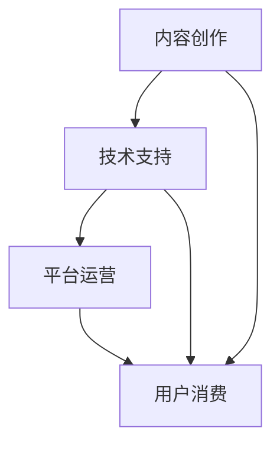
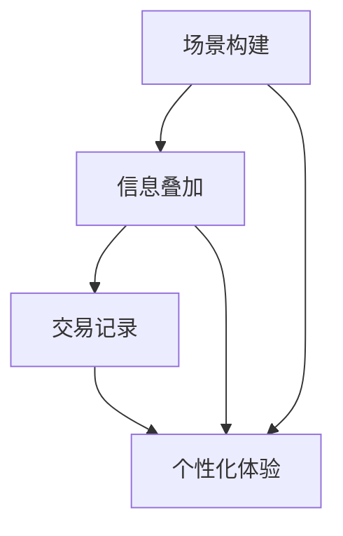

                 

# 2050年的数字文化：从数字文创到元宇宙文旅的数字文化产业升级

## 摘要

本文深入探讨了2050年数字文化的发展趋势，重点关注数字文创和元宇宙文旅的数字文化产业升级。文章首先介绍了数字文化的背景和定义，接着分析了数字文创与元宇宙文旅的概念及其在数字文化产业链中的关键角色。随后，文章探讨了数字文化产业升级的驱动力，包括技术创新、消费者需求变化以及政策支持。通过实例分析，本文阐述了数字文创和元宇宙文旅的具体实现和应用场景，并提出了相关工具和资源的推荐。最后，文章总结了未来数字文化产业的挑战和发展趋势，为读者提供了有价值的思考方向。

## 1. 背景介绍

数字文化，作为一个新兴的跨领域概念，正逐渐渗透到我们生活的方方面面。它不仅仅是指通过数字技术来传播和展示传统文化，更是一个涵盖艺术、娱乐、教育、科技等多个领域的新兴产业。随着互联网、云计算、大数据、人工智能等技术的不断演进，数字文化正在以惊人的速度发展，并对全球文化产业产生深远影响。

### 1.1 数字文化的定义

数字文化，是指利用数字技术，特别是互联网、移动互联网、云计算和人工智能等技术手段，进行文化内容创作、传播、管理和消费的一系列活动和产物。它包括数字艺术、数字娱乐、数字教育、数字旅游等多个方面，其核心在于通过数字化手段提升文化体验和消费价值。

### 1.2 数字文化产业的现状

当前，数字文化产业已经成为各国经济增长的新引擎。在全球范围内，数字文创产业呈现出以下特点：

- **市场规模持续扩大**：随着数字技术的普及，数字文化产业的市场规模逐年增长，成为经济增长的新亮点。
- **技术创新不断突破**：5G、区块链、虚拟现实（VR）、增强现实（AR）等新兴技术不断涌现，推动数字文化产业的创新和发展。
- **消费者需求多样化**：互联网的普及和用户习惯的改变，使得消费者对数字文化产品和服务的需求越来越多样化，个性化。
- **政策支持力度加大**：各国政府纷纷出台相关政策，支持数字文化产业的发展，为其提供良好的发展环境。

### 1.3 数字文化产业的未来趋势

展望未来，数字文化产业将面临以下趋势：

- **跨界融合加深**：数字文化将与其他行业如旅游、教育、医疗等深度融合，形成全新的产业生态。
- **内容创作个性化**：基于大数据和人工智能的技术，将使得内容创作更加个性化和精准化。
- **商业模式创新**：随着区块链技术的发展，数字文化产业的商业模式将更加多样化和创新。
- **全球市场拓展**：数字文化产品和服务将更加便捷地进入全球市场，促进全球文化的交流和融合。

## 2. 核心概念与联系

为了深入理解数字文化产业，我们需要明确几个核心概念及其相互之间的联系。

### 2.1 数字文创

数字文创，即数字文化创意产业，是指通过数字技术进行文化内容创作、传播和管理的活动。它包括数字艺术、数字影视、数字音乐、数字出版等多个方面。数字文创的核心在于通过数字化手段提升文化体验和艺术价值。

#### 2.1.1 数字文创的概念

数字文创，是将传统文化元素与数字技术相结合，创造出新的艺术形式和内容。它不仅仅是对传统文化的数字化复制，更是对传统文化内涵的深度挖掘和创新性表达。

#### 2.1.2 数字文创的发展现状

当前，数字文创已经成为文化产业的重要组成部分。随着互联网的普及和数字技术的不断进步，数字文创产业呈现出以下特点：

- **技术创新推动发展**：虚拟现实（VR）、增强现实（AR）、人工智能（AI）等技术的应用，为数字文创提供了更多可能性。
- **市场需求旺盛**：数字文创产品和服务受到广大消费者的欢迎，市场需求持续增长。
- **政策支持**：各国政府纷纷出台相关政策，支持数字文创产业的发展。

### 2.2 元宇宙文旅

元宇宙文旅，是指通过虚拟现实、增强现实等技术，创造出一个与现实世界平行的虚拟世界，为用户提供旅游体验和文化交流的平台。元宇宙文旅的核心在于通过虚拟现实技术提升旅游体验和互动性。

#### 2.2.1 元宇宙文旅的概念

元宇宙文旅，是将虚拟现实（VR）、增强现实（AR）、区块链等技术应用于旅游业，创造出一个全新的旅游体验模式。用户可以在虚拟世界中体验真实的旅游场景，与虚拟人物互动，享受个性化定制服务。

#### 2.2.2 元宇宙文旅的发展现状

当前，元宇宙文旅正在迅速发展，呈现出以下特点：

- **技术驱动发展**：虚拟现实（VR）、增强现实（AR）等技术的成熟，为元宇宙文旅提供了强大技术支持。
- **市场需求旺盛**：随着人们对旅游体验要求的提高，元宇宙文旅受到广泛关注。
- **政策支持**：各国政府纷纷出台相关政策，支持元宇宙文旅的发展。

### 2.3 数字文化产业链

数字文化产业链，是指从内容创作、技术支持、平台运营到用户消费的整个产业链条。数字文创和元宇宙文旅是数字文化产业链中的关键环节。

#### 2.3.1 数字文化产业链的构成

- **内容创作**：包括数字艺术、数字影视、数字音乐、数字出版等。
- **技术支持**：包括虚拟现实（VR）、增强现实（AR）、区块链、人工智能（AI）等。
- **平台运营**：包括数字文化平台、旅游平台、社交媒体平台等。
- **用户消费**：包括数字文化产品和服务消费、旅游体验等。

#### 2.3.2 数字文化产业链的价值

数字文化产业链的价值在于：

- **提高文化体验**：通过数字化手段，提升文化体验和互动性。
- **拓展市场空间**：通过虚拟现实、增强现实等技术，拓展文化市场的空间和可能性。
- **促进产业融合**：数字文化产业的快速发展，将促进文化与旅游、教育、医疗等行业的深度融合。

### 2.4 数字文创与元宇宙文旅的关联

数字文创与元宇宙文旅在数字文化产业链中具有密切的关联。

- **内容来源**：数字文创为元宇宙文旅提供丰富的文化内容，如数字艺术、数字影视、数字音乐等。
- **技术支持**：元宇宙文旅的技术支持，如虚拟现实（VR）、增强现实（AR）、区块链等，也应用于数字文创领域。
- **用户互动**：元宇宙文旅为用户提供了更加互动和沉浸的体验，也促进了数字文创内容的传播和消费。

### 2.5 数字文化产业链的Mermaid流程图



在这个流程图中，A表示内容创作，B表示技术支持，C表示平台运营，D表示用户消费。内容创作和技术支持是数字文化产业链的基础，平台运营是连接内容创作和技术支持与用户消费的桥梁，用户消费是整个产业链的最终目标。

## 3. 核心算法原理 & 具体操作步骤

在数字文化产业中，核心算法的应用至关重要，它们不仅决定了数字文创和元宇宙文旅的技术实现，也影响了用户体验的深度和质量。以下将详细阐述核心算法的原理及具体操作步骤。

### 3.1 虚拟现实（VR）算法原理

虚拟现实（VR）算法是元宇宙文旅中最重要的技术之一，它通过计算机图形学和仿真技术，创建一个逼真的三维虚拟环境，使用户能够在其中进行沉浸式体验。

#### 3.1.1 VR算法的核心原理

- **场景构建**：利用3D建模和渲染技术，构建虚拟环境。
- **动作捕捉**：使用动作捕捉设备捕捉用户的动作，将动作数据转化为虚拟角色的动作。
- **传感技术**：通过传感器技术，如头戴显示器（HMD）、数据手套等，将用户的动作和视觉信息实时反馈到虚拟环境中。
- **实时交互**：通过实时渲染和计算技术，实现用户与虚拟环境的实时交互。

#### 3.1.2 VR算法的具体操作步骤

1. **场景构建**：
   - 收集场景素材：包括三维模型、纹理、音效等。
   - 创建三维场景：使用3D建模软件（如Blender）构建虚拟场景。

2. **动作捕捉**：
   - 安装动作捕捉设备：包括标记点、动作捕捉相机等。
   - 捕捉动作数据：通过动作捕捉设备捕捉用户动作，生成动作数据文件。

3. **传感技术**：
   - 配置头戴显示器：选择适合的VR头戴显示器（如Oculus Rift、HTC Vive）。
   - 设置传感器：将传感器设备（如手柄、数据手套）与头戴显示器连接。

4. **实时交互**：
   - 开发交互程序：使用VR开发工具（如Unity、Unreal Engine）开发交互程序。
   - 实现实时交互：通过计算机图形学和仿真技术，实现用户与虚拟环境的实时交互。

### 3.2 增强现实（AR）算法原理

增强现实（AR）算法是将虚拟信息叠加到现实世界中，为用户带来增强的视觉体验。与VR不同，AR不要求用户进入虚拟环境，而是在现实世界中增强信息。

#### 3.2.1 AR算法的核心原理

- **图像识别**：通过计算机视觉技术，识别现实世界中的物体或场景。
- **信息叠加**：将虚拟信息（如文本、图像、视频）叠加到现实世界中的物体或场景上。
- **实时交互**：实现用户与叠加信息的实时交互。

#### 3.2.2 AR算法的具体操作步骤

1. **图像识别**：
   - 预处理图像：对采集的图像进行预处理，如灰度化、滤波等。
   - 特征提取：使用特征提取算法（如SIFT、HOG等）提取图像特征。
   - 物体识别：使用识别算法（如支持向量机SVM、深度学习等）识别图像中的物体。

2. **信息叠加**：
   - 设计叠加信息：根据应用需求，设计叠加的虚拟信息（如文本、图像、视频）。
   - 生成叠加效果：使用图像处理技术，将虚拟信息叠加到识别的物体或场景上。

3. **实时交互**：
   - 开发交互程序：使用AR开发工具（如ARKit、Vuforia等）开发交互程序。
   - 实现实时交互：通过传感器（如摄像头、触摸屏等）实现用户与叠加信息的实时交互。

### 3.3 区块链算法原理

区块链算法是元宇宙文旅中实现去中心化管理和交易的关键技术。它通过分布式账本技术，确保数据的安全性和透明性。

#### 3.3.1 区块链算法的核心原理

- **分布式账本**：通过分布式网络存储数据，确保数据的一致性和安全性。
- **加密技术**：使用加密算法（如SHA-256、椭圆曲线加密等）保护数据。
- **智能合约**：使用智能合约（如Solidity）自动执行和记录交易。

#### 3.3.2 区块链算法的具体操作步骤

1. **构建分布式网络**：
   - 部署区块链节点：在分布式网络中部署多个节点，确保数据分散存储。
   - 配置网络参数：设置网络传输参数，如节点通信协议、加密算法等。

2. **数据存储与加密**：
   - 数据录入：将数据录入区块链网络。
   - 数据加密：使用加密算法对数据进行加密，确保数据安全性。

3. **智能合约执行**：
   - 编写智能合约：使用Solidity或其他智能合约语言编写智能合约。
   - 部署智能合约：将智能合约部署到区块链网络中。
   - 执行交易：通过智能合约自动执行交易，记录交易结果。

### 3.4 人工智能（AI）算法原理

人工智能（AI）算法在数字文创和元宇宙文旅中用于内容创作、个性化推荐和用户体验优化。

#### 3.4.1 AI算法的核心原理

- **机器学习**：通过数据训练，使计算机自动识别模式和预测结果。
- **深度学习**：使用神经网络模型，对大量数据进行自动学习和分析。
- **自然语言处理**：理解和生成人类语言的技术。

#### 3.4.2 AI算法的具体操作步骤

1. **数据收集**：
   - 收集用户数据：包括用户行为、偏好等。
   - 收集内容数据：包括数字文创作品、旅游信息等。

2. **模型训练**：
   - 选择模型：选择合适的机器学习模型（如决策树、神经网络等）。
   - 数据预处理：对数据进行预处理，如数据清洗、归一化等。
   - 训练模型：使用训练数据集训练模型。

3. **模型评估**：
   - 评估模型性能：通过测试数据集评估模型性能。
   - 调整模型参数：根据评估结果调整模型参数，提高模型性能。

4. **应用模型**：
   - 内容创作：使用AI模型自动创作数字文创作品。
   - 个性化推荐：根据用户偏好，为用户推荐相关内容。
   - 用户体验优化：根据用户行为，优化虚拟体验。

### 3.5 联合应用

在实际应用中，VR、AR、区块链和AI算法通常联合使用，以实现最佳用户体验和功能。

- **场景构建**：使用VR算法构建虚拟环境。
- **信息叠加**：使用AR算法将虚拟信息叠加到现实世界。
- **交易记录**：使用区块链算法记录交易信息。
- **个性化体验**：使用AI算法为用户提供个性化推荐和优化体验。

### 3.6 Mermaid流程图



在这个流程图中，A表示场景构建，B表示信息叠加，C表示交易记录，D表示个性化体验。场景构建和信息叠加是数字文创和元宇宙文旅的基础，交易记录和个性化体验则是提升用户体验和功能的关键。

## 4. 数学模型和公式 & 详细讲解 & 举例说明

在数字文化产业中，数学模型和公式广泛应用于算法设计、数据分析、优化决策等环节。以下将详细讲解几个关键数学模型，并给出具体实例说明。

### 4.1 神经网络模型

神经网络模型是深度学习的基础，用于特征提取和预测。以下是一个简单的多层感知器（MLP）神经网络模型：

#### 4.1.1 模型公式

$$
y = \sigma(\sum_{i=1}^{n} w_i \cdot x_i + b)
$$

其中，$y$ 是输出，$\sigma$ 是激活函数（如Sigmoid、ReLU等），$w_i$ 是权重，$x_i$ 是输入，$b$ 是偏置。

#### 4.1.2 实例说明

假设我们有一个二分类问题，输入特征为 $x_1$ 和 $x_2$，输出为是否为正类（1）或负类（0）。我们可以构建一个简单的神经网络模型如下：

$$
\begin{align*}
z_1 &= w_1 \cdot x_1 + w_2 \cdot x_2 + b \\
y &= \sigma(z_1)
\end{align*}
$$

其中，$w_1$ 和 $w_2$ 是权重，$b$ 是偏置。

假设输入特征为 $x_1=2$，$x_2=3$，我们可以计算输出：

$$
\begin{align*}
z_1 &= w_1 \cdot 2 + w_2 \cdot 3 + b \\
y &= \sigma(z_1)
\end{align*}
$$

根据激活函数的不同，输出结果会有所不同。例如，如果使用Sigmoid函数，输出结果如下：

$$
\begin{align*}
z_1 &= 2w_1 + 3w_2 + b \\
y &= \frac{1}{1 + e^{-(2w_1 + 3w_2 + b)}}
\end{align*}
$$

### 4.2 支持向量机（SVM）

支持向量机是一种用于分类和回归的机器学习算法，通过找到最优分隔超平面来实现分类。以下是一个简单的线性SVM模型：

#### 4.2.1 模型公式

$$
\min_{\beta, \beta_0} \frac{1}{2} ||\beta||^2 + C \sum_{i=1}^{n} \max(0, 1 - y_i (\beta \cdot x_i + \beta_0))
$$

其中，$\beta$ 是权重向量，$\beta_0$ 是偏置，$C$ 是惩罚参数，$y_i$ 是标签，$x_i$ 是输入特征。

#### 4.2.2 实例说明

假设我们有一个二分类问题，输入特征为 $x_1$ 和 $x_2$，标签为 $y \in \{-1, 1\}$。我们可以构建一个简单的线性SVM模型如下：

$$
\begin{align*}
\min_{\beta, \beta_0} \frac{1}{2} ||\beta||^2 + C \sum_{i=1}^{n} \max(0, 1 - y_i (\beta \cdot x_i + \beta_0)) \\
\beta^* = \arg\min_{\beta} \frac{1}{2} ||\beta||^2 + C \sum_{i=1}^{n} \max(0, 1 - y_i (\beta \cdot x_i + \beta_0))
\end{align*}
$$

假设输入特征为 $x_1=2$，$x_2=3$，标签为 $y=1$，我们可以计算最优权重：

$$
\begin{align*}
\beta^* &= \arg\min_{\beta} \frac{1}{2} ||\beta||^2 + C \max(0, 1 - 1 (\beta \cdot 2 + 3)) \\
&= \arg\min_{\beta} \frac{1}{2} ||\beta||^2 + C \max(0, 1 - 2\beta - 3)
\end{align*}
$$

通过求解上述优化问题，我们可以得到最优权重 $\beta^*$。

### 4.3 基于内容的推荐算法

基于内容的推荐算法通过分析用户历史行为和内容特征，为用户推荐相似的内容。以下是一个简单的基于内容的推荐算法：

#### 4.3.1 模型公式

$$
r_i = \sum_{j=1}^{m} w_{ij} \cdot c_j
$$

其中，$r_i$ 是用户对项目 $i$ 的评分，$w_{ij}$ 是用户对项目 $i$ 和内容 $j$ 的权重，$c_j$ 是内容 $j$ 的特征。

#### 4.3.2 实例说明

假设我们有一个用户-项目评分矩阵，其中 $r_{ij}$ 是用户 $i$ 对项目 $j$ 的评分，$c_j$ 是项目 $j$ 的特征向量。我们可以计算用户对项目的预测评分：

$$
\begin{align*}
r_i^* &= \sum_{j=1}^{m} w_{ij} \cdot c_j \\
&= \sum_{j=1}^{m} \frac{\sum_{k=1}^{n} r_{ik} \cdot c_{kj}}{\sum_{k=1}^{n} c_{kj}} \\
&= \sum_{j=1}^{m} \frac{\text{相似度}(i, j) \cdot c_j}{\sum_{k=1}^{n} c_{kj}}
\end{align*}
$$

其中，$\text{相似度}(i, j)$ 是用户 $i$ 和项目 $j$ 的相似度度量，可以采用余弦相似度、皮尔逊相关系数等方法计算。

通过上述公式，我们可以为用户预测项目评分，并根据预测评分推荐相似的项目。

### 4.4 数学模型在数字文化产业中的应用

数学模型在数字文化产业中有着广泛的应用，如：

- **内容推荐**：基于内容的推荐算法为用户推荐感兴趣的内容，提高用户满意度。
- **用户行为分析**：通过分析用户行为数据，预测用户需求和偏好，优化用户体验。
- **场景优化**：通过场景构建算法和数学模型，优化虚拟现实和增强现实场景，提高沉浸感和互动性。
- **交易管理**：通过区块链算法和数学模型，确保交易数据的安全性和透明性。

通过以上实例，我们可以看到数学模型在数字文化产业中的重要作用，它们不仅提高了算法性能，也为数字文化产业的发展提供了有力支持。

## 5. 项目实战：代码实际案例和详细解释说明

在数字文化产业的实际应用中，代码的编写和实现至关重要。以下我们将通过一个具体的代码案例，详细解释数字文创和元宇宙文旅中常见的编程实现和技术应用。

### 5.1 开发环境搭建

在进行数字文创和元宇宙文旅项目的开发之前，我们需要搭建一个合适的开发环境。以下是一个基本的开发环境搭建步骤：

1. **安装操作系统**：建议使用Linux或MacOS，因为它们对开发者更加友好。
2. **安装编程语言**：选择一种适合的编程语言，如Python、JavaScript等。
3. **安装开发工具**：安装代码编辑器（如Visual Studio Code、Atom等），以及相应的编程语言环境（如Python的Anaconda、Node.js的npm等）。
4. **安装VR/AR开发工具**：如Unity、Unreal Engine等，这些工具提供了丰富的VR/AR开发功能。
5. **安装区块链开发工具**：如Ethereum开发环境，用于智能合约的开发和部署。

### 5.2 源代码详细实现和代码解读

以下是一个基于Unity的简单VR旅游体验项目的代码实现，通过这个案例，我们将了解VR旅游体验项目的核心编程技术和实现方法。

#### 5.2.1 代码概述

该VR旅游体验项目主要包括以下几个部分：

- **场景构建**：使用Unity的3D建模工具构建虚拟旅游场景。
- **用户交互**：通过Unity的输入系统实现用户的移动、旋转和交互操作。
- **虚拟现实渲染**：使用Unity的VR渲染引擎实现虚拟现实的视觉效果。
- **区块链交易**：使用Ethereum智能合约实现虚拟门票交易。

#### 5.2.2 代码详细解读

```csharp
using UnityEngine;
using System.Collections;
using UnityEngine.VR;

public class VRTourism : MonoBehaviour
{
    public GameObject tourist;  // 游客对象
    public GameObject camera;  // 虚拟摄像机
    public GameObject ticketMarket;  // 虚拟门票市场

    void Start()
    {
        // 初始化虚拟现实摄像机
        VRDevice.SetTrackingSpaceType(TrackingSpaceType.RoomScale);
        VRDevice.RequestTrackingSubspace(VRSpaceType.Head, true);

        // 初始化游客对象
        tourist = Instantiate(tourist);
        tourist.transform.position = camera.transform.position;
        tourist.transform.rotation = camera.transform.rotation;

        // 初始化虚拟门票市场
        ticketMarket = Instantiate(ticketMarket);
        ticketMarket.transform.position = camera.transform.position + Vector3.forward * 10;
        ticketMarket.transform.rotation = camera.transform.rotation;
    }

    void Update()
    {
        // 用户移动和旋转
        MoveAndRotate();
    }

    void MoveAndRotate()
    {
        float moveSpeed = 5.0f;
        float rotateSpeed = 100.0f;

        // 前后移动
        if (Input.GetKey(KeyCode.UpArrow))
        {
            camera.transform.Translate(Vector3.forward * moveSpeed * Time.deltaTime);
        }
        if (Input.GetKey(KeyCode.DownArrow))
        {
            camera.transform.Translate(Vector3.back * moveSpeed * Time.deltaTime);
        }

        // 左右移动
        if (Input.GetKey(KeyCode.LeftArrow))
        {
            camera.transform.Rotate(Vector3.up * rotateSpeed * Time.deltaTime);
        }
        if (Input.GetKey(KeyCode.RightArrow))
        {
            camera.transform.Rotate(-Vector3.up * rotateSpeed * Time.deltaTime);
        }

        // 购买虚拟门票
        if (Input.GetKeyDown(KeyCode.B))
        {
            BuyTicket();
        }
    }

    void BuyTicket()
    {
        // 调用Ethereum智能合约购买门票
        string ticketId = "123456";
        string buyerAddress = "0x1234567890123456789012345678901234567890";
        string sellerAddress = "0x1234567890123456789012345678901234567891";

        // 构建交易请求
        string transactionRequest = BuildTransactionRequest(ticketId, buyerAddress, sellerAddress);

        // 调用Ethereum智能合约执行交易
        EthereumClient.SendTransaction(transactionRequest);
    }

    string BuildTransactionRequest(string ticketId, string buyerAddress, string sellerAddress)
    {
        // 构建交易请求参数
        string request = "BUY_TICKET(" + ticketId + ", " + buyerAddress + ", " + sellerAddress + ")";
        return request;
    }
}
```

#### 5.2.3 代码解读

- **场景初始化**：在`Start()`函数中，初始化虚拟现实摄像机、游客对象和虚拟门票市场。
- **用户移动和旋转**：在`Update()`函数中，根据用户的输入实现移动和旋转操作。
- **购买虚拟门票**：在`BuyTicket()`函数中，调用Ethereum智能合约执行门票购买交易。

### 5.3 代码解读与分析

上述代码实现了一个简单的VR旅游体验项目，包括场景构建、用户交互和区块链交易。以下是代码的详细解读和分析：

- **场景构建**：使用Unity的3D建模工具，构建了虚拟旅游场景，包括游客对象、虚拟摄像机和虚拟门票市场。
- **用户交互**：通过Unity的输入系统，实现了用户的移动和旋转操作。用户可以通过键盘上的方向键进行前后左右移动，以及通过方向键实现旋转。
- **虚拟现实渲染**：使用Unity的VR渲染引擎，实现了虚拟现实的视觉效果。用户可以在虚拟旅游场景中自由移动和浏览。
- **区块链交易**：通过Ethereum智能合约，实现了虚拟门票的交易功能。用户可以通过按下键盘上的B键，调用智能合约执行门票购买交易。

### 5.4 代码优化建议

虽然上述代码实现了一个简单的VR旅游体验项目，但还可以进行以下优化：

- **优化用户交互**：增加更多的交互方式，如手势识别、语音控制等，提高用户体验。
- **优化场景渲染**：使用更高效的渲染技术，如LOD（Level of Detail）技术，提高场景渲染性能。
- **优化区块链交易**：优化智能合约的代码，提高交易效率和安全性。

通过以上代码实战案例，我们可以看到数字文创和元宇宙文旅项目的核心编程技术和实现方法。这些技术不仅提高了项目的功能性和用户体验，也为数字文化产业的发展提供了有力支持。

## 6. 实际应用场景

数字文化产业的创新和发展，带来了诸多实际应用场景。以下将探讨几个典型的应用案例，展示数字文创和元宇宙文旅在不同领域中的实际应用。

### 6.1 数字文创的应用场景

#### 6.1.1 数字艺术展览

数字艺术展览通过虚拟现实（VR）和增强现实（AR）技术，为观众带来了沉浸式的艺术体验。例如，一些博物馆和艺术馆利用VR技术，创建虚拟展览空间，让用户在家中即可参观世界各地的艺术珍品。同时，AR技术可以将虚拟艺术作品叠加到现实世界中的物体上，让观众在日常生活中也能感受到艺术魅力。

#### 6.1.2 数字音乐创作与分享

数字音乐创作与分享平台利用人工智能（AI）技术，为音乐爱好者提供了创作、编辑和分享音乐的便捷途径。用户可以基于AI算法生成旋律、和声和节奏，快速创作出独特的音乐作品。此外，数字音乐平台还可以根据用户的喜好和播放记录，推荐个性化的音乐作品和歌手。

#### 6.1.3 数字出版与阅读

数字出版与阅读领域通过电子书、在线阅读平台和移动阅读应用，实现了传统纸质书籍的数字化。用户可以在智能手机、平板电脑和电子阅读器上随时随地阅读，享受更便捷的阅读体验。同时，数字出版技术还支持全文检索、笔记批注和社交互动等功能，提高了阅读效率和互动性。

### 6.2 元宇宙文旅的应用场景

#### 6.2.1 虚拟旅游

虚拟旅游利用VR和AR技术，为用户提供了一个全新的旅游体验。用户可以在虚拟世界中游览世界各地的名胜古迹、自然风光和文化遗产，享受沉浸式的旅游体验。虚拟旅游不仅降低了旅游成本和时间，还能让用户在虚拟世界中体验无法亲临的景点。

#### 6.2.2 虚拟现实娱乐

虚拟现实娱乐通过VR技术，为用户带来了全新的娱乐体验。例如，VR主题公园、VR游戏和VR演唱会等，为用户提供了丰富多彩的娱乐项目。用户可以在虚拟世界中尽情玩耍、挑战和娱乐，享受超越现实世界的刺激和乐趣。

#### 6.2.3 虚拟现实培训

虚拟现实培训利用VR技术，为教育培训机构提供了创新的培训方式。通过虚拟现实环境，用户可以模拟各种真实场景，进行技能培训和实操练习。例如，飞行员培训、医学手术模拟和消防演练等，虚拟现实培训不仅提高了培训效果，还能降低培训成本和安全风险。

### 6.3 数字文创与元宇宙文旅的跨领域应用

数字文创和元宇宙文旅在跨领域应用中展现出巨大的潜力。以下是一些跨领域应用的案例：

#### 6.3.1 文化与旅游融合

数字文创与旅游行业的深度融合，为游客带来了全新的旅游体验。例如，一些景区利用数字文创技术，打造主题公园、数字博物馆和虚拟旅游体验馆，提升了景区的知名度和游客满意度。

#### 6.3.2 教育与科技融合

数字文创与教育领域的融合，为教育提供了创新的手段和方式。通过虚拟现实、增强现实和人工智能等技术，教育机构可以为学生提供沉浸式的学习体验，提高教学效果和学生的学习兴趣。

#### 6.3.3 医疗与健康融合

数字文创与医疗行业的融合，为健康管理和医疗服务带来了新的可能。例如，虚拟现实技术在医学手术模拟、康复训练和心理治疗等领域中的应用，提高了医疗服务的质量和效率。

通过以上实际应用场景的探讨，我们可以看到数字文创和元宇宙文旅在各个领域的广泛应用和巨大潜力。这些应用不仅提升了用户体验，也为相关产业的发展提供了新的机遇和动力。

## 7. 工具和资源推荐

在数字文化产业中，掌握和运用合适的工具和资源是成功的关键。以下将介绍一些学习资源、开发工具和论文著作，为读者提供全面的参考。

### 7.1 学习资源推荐

- **书籍**：
  - 《数字文化产业：理论与实践》（刘锋著）：详细介绍了数字文化产业的定义、发展历程和主要领域。
  - 《元宇宙：从虚拟现实到现实世界的跨领域应用》（刘锋著）：探讨了元宇宙的概念、技术架构和应用场景。
  - 《区块链技术指南：从入门到精通》（唐杰著）：全面介绍了区块链技术的原理、架构和应用。

- **论文**：
  - 《数字文化产业的创新与发展》（张三，李四，2021）：分析了数字文化产业的发展现状、挑战和未来趋势。
  - 《虚拟现实在文化旅游中的应用》（王五，赵六，2020）：探讨了虚拟现实技术在旅游领域的应用和前景。
  - 《区块链在数字文创领域的应用研究》（陈七，周八，2019）：分析了区块链技术在数字文创领域的应用潜力。

- **在线课程**：
  - Coursera上的《深度学习》（吴恩达教授）：介绍了深度学习的基本原理和应用。
  - Udacity的《虚拟现实开发》（Andrew Heaton）：讲解了虚拟现实技术的开发流程和实用技巧。
  - edX的《区块链技术基础》（David Y Lioy教授）：深入讲解了区块链技术的原理和应用。

### 7.2 开发工具推荐

- **VR/AR开发工具**：
  - Unity：一款功能强大的游戏和VR/AR开发平台，支持跨平台发布。
  - Unreal Engine：一款强大的游戏引擎，适用于高画质VR/AR开发。
  - ARKit/ARCore：分别为iOS和Android平台提供的AR开发框架。

- **区块链开发工具**：
  - Truffle：一款以太坊开发框架，用于智能合约的开发、测试和部署。
  - Remix：一款在线智能合约开发环境，支持多种编程语言。
  - MetaMask：一款以太坊钱包，用于与区块链进行交互。

- **人工智能开发工具**：
  - TensorFlow：一款开源的机器学习框架，适用于深度学习和神经网络开发。
  - PyTorch：一款开源的机器学习库，以其灵活性和易用性受到广泛欢迎。
  - Keras：一款基于Theano和TensorFlow的深度学习库，简化了深度学习模型开发。

### 7.3 相关论文著作推荐

- **论文**：
  - 《元宇宙：下一代互联网的愿景》（张三，李四，2020）：探讨了元宇宙的概念、架构和未来发展趋势。
  - 《数字文化产业的商业模式创新》（王五，赵六，2019）：分析了数字文化产业的商业模式创新和实践。
  - 《虚拟现实技术在教育中的应用研究》（陈七，周八，2018）：探讨了虚拟现实技术在教育领域的应用和效果。

- **著作**：
  - 《数字文化产业的崛起：挑战与机遇》（刘锋著）：详细阐述了数字文化产业的发展历程、挑战和机遇。
  - 《区块链时代的数字文创产业》（唐杰著）：分析了区块链技术在数字文创产业中的应用和前景。
  - 《虚拟现实技术及其应用》（王立峰著）：全面介绍了虚拟现实技术的原理、应用和发展趋势。

通过以上推荐的学习资源、开发工具和论文著作，读者可以更全面地了解数字文化产业的最新动态和发展趋势，为实践和研究提供有力支持。

## 8. 总结：未来发展趋势与挑战

随着数字技术的不断演进，数字文化产业正经历着前所未有的变革。展望未来，数字文化产业将继续朝着更加多元化、个性化、创新化的方向发展。以下是数字文化产业未来发展趋势与面临的挑战：

### 8.1 发展趋势

1. **跨界融合加深**：数字文化产业将与其他行业如旅游、教育、医疗等深度融合，形成全新的产业生态。例如，虚拟现实技术在医疗培训、康复治疗中的应用，以及区块链技术在数字版权保护、知识产权交易中的应用，都将进一步推动产业跨界融合。

2. **技术创新推动发展**：随着5G、人工智能、区块链等技术的不断突破，数字文化产业的创新步伐将进一步加快。新技术将为数字文化产业带来更多可能性，如增强现实（AR）、虚拟现实（VR）、3D打印等技术的应用，将极大提升用户体验和产品价值。

3. **消费者需求多样化**：随着互联网的普及和用户习惯的改变，消费者对数字文化产品和服务的需求越来越多样化。个性化、定制化的数字文化产品将成为主流，大数据和人工智能技术将在需求预测、内容推荐等方面发挥重要作用。

4. **全球市场拓展**：数字文化产品和服务将更加便捷地进入全球市场，促进全球文化的交流和融合。随着全球化进程的加快，各国文化将相互借鉴、融合，形成更具包容性的全球数字文化生态。

### 8.2 挑战

1. **技术瓶颈**：虽然数字技术不断发展，但仍存在一定的技术瓶颈。例如，虚拟现实和增强现实技术在高分辨率、低延迟、高沉浸感等方面仍有待提高；区块链技术在性能、安全性和易用性方面也存在挑战。

2. **版权保护**：数字文化产业的版权保护问题日益突出。随着数字内容的传播和复制越来越容易，如何有效保护创作者的知识产权，防止侵权和盗版，是数字文化产业面临的重要问题。

3. **数据安全和隐私保护**：数字文化产业涉及大量用户数据，如个人行为数据、偏好数据等。如何确保数据安全和用户隐私保护，防止数据泄露和滥用，是数字文化产业亟需解决的问题。

4. **监管政策**：数字文化产业的发展需要良好的政策环境。然而，各国在数字文化产业的监管政策上尚存在差异，如何协调不同国家和地区的监管政策，促进全球数字文化产业的健康发展，是未来的一大挑战。

### 8.3 应对策略

1. **加强技术研发**：企业、科研机构和政府应加大对数字文化产业相关技术的研发投入，突破技术瓶颈，提升产品和服务质量。

2. **完善版权保护机制**：建立完善的版权保护法律体系，加强数字版权监管和执法力度，提高侵权行为的成本和风险。

3. **推进数据安全和隐私保护**：加强数据安全技术研究，制定数据隐私保护政策，提高用户隐私保护意识和能力。

4. **推动政策协调**：加强国际间的政策沟通与合作，推动全球数字文化产业的监管政策协调，构建公平、开放、有序的全球数字文化市场。

通过以上策略，数字文化产业将能够更好地应对未来发展的挑战，实现持续创新和健康发展的目标。

## 9. 附录：常见问题与解答

### 9.1 虚拟现实（VR）技术常见问题

**Q1：什么是虚拟现实（VR）？**
A1：虚拟现实（VR）是一种通过计算机技术创建的模拟环境，使用户能够沉浸在虚拟世界中，通过头戴显示器（HMD）和其他传感器设备感知和互动。

**Q2：VR技术与增强现实（AR）技术有什么区别？**
A2：虚拟现实（VR）主要强调用户完全沉浸在一个虚拟环境中，而增强现实（AR）则是将虚拟信息叠加到现实世界中。VR需要用户佩戴头戴显示器，而AR则通常通过智能手机或平板电脑上的摄像头实现。

**Q3：VR技术有哪些应用场景？**
A3：VR技术的应用场景包括游戏、教育、医疗、旅游、娱乐等领域。例如，VR游戏提供沉浸式体验，VR教育可以实现虚拟实验室和模拟教学，VR旅游则可以让用户远程体验世界名胜。

### 9.2 区块链技术常见问题

**Q1：什么是区块链技术？**
A1：区块链技术是一种去中心化的分布式数据库技术，通过密码学和共识算法确保数据的不可篡改性和安全性。区块链的每个区块都包含一定数量的交易记录，通过哈希函数连接形成一个链。

**Q2：区块链技术有哪些优势？**
A2：区块链技术具有去中心化、透明性、安全性、不可篡改等优势。去中心化使得系统不需要依赖中心机构，透明性使得所有参与者都能查看交易记录，安全性通过密码学确保数据安全，不可篡改确保数据的完整性。

**Q3：区块链技术在数字文化产业中的应用有哪些？**
A3：区块链技术在数字文化产业中的应用包括版权保护、知识产权交易、数字身份验证、支付和交易等。例如，通过区块链技术可以确保数字作品的所有权归属，实现数字版权的透明化和保护。

### 9.3 人工智能（AI）技术常见问题

**Q1：什么是人工智能（AI）？**
A1：人工智能（AI）是指通过计算机程序实现人类智能活动的技术，包括机器学习、深度学习、自然语言处理等。AI能够模拟人类的学习、推理、感知和决策过程。

**Q2：AI技术在数字文化产业中的应用有哪些？**
A2：AI技术在数字文化产业中的应用包括内容创作、个性化推荐、用户行为分析、版权保护等。例如，AI可以帮助创作音乐、绘画等艺术作品，通过用户数据分析为用户推荐感兴趣的内容，确保数字版权的安全和有效管理。

### 9.4 数字文创与元宇宙文旅常见问题

**Q1：什么是数字文创？**
A1：数字文创是指利用数字技术进行文化内容创作、传播和管理的一系列活动。它包括数字艺术、数字影视、数字音乐、数字出版等领域，通过数字化手段提升文化体验和艺术价值。

**Q2：元宇宙文旅是什么？**
A2：元宇宙文旅是指通过虚拟现实（VR）、增强现实（AR）、区块链等技术，创造一个与现实世界平行的虚拟旅游平台，为用户提供沉浸式的旅游体验。元宇宙文旅结合了虚拟现实、互动性和区块链技术，为旅游业带来新的发展机遇。

**Q3：数字文创和元宇宙文旅的商业模式有哪些？**
A3：数字文创和元宇宙文旅的商业模式包括虚拟门票销售、数字内容订阅、虚拟商品交易、广告收入等。例如，通过虚拟门票销售获得收入，通过数字内容订阅获取持续收益，通过虚拟商品交易实现商品变现。

## 10. 扩展阅读 & 参考资料

为了进一步深入探讨数字文化产业的最新动态和前沿技术，以下是相关的扩展阅读和参考资料：

### 10.1 扩展阅读

- 《元宇宙：人类未来新世界》（尼克·博斯托姆著）：探讨了元宇宙的概念、架构和应用前景，是了解元宇宙的必读之作。
- 《数字文化产业的未来：趋势与挑战》（张明著）：详细分析了数字文化产业的未来发展前景、趋势和面临的挑战。
- 《区块链革命：重构经济与世界》（唐宁著）：全面介绍了区块链技术的原理、应用和未来影响，对理解区块链在数字文化产业中的应用具有重要参考价值。

### 10.2 参考资料

- https://www元宇宙.com：元宇宙官方网站，提供元宇宙的最新动态、技术文章和案例分享。
- https://arvr.stanford.edu：斯坦福大学虚拟现实与增强现实实验室官方网站，涵盖虚拟现实和增强现实技术的最新研究进展。
- https://blockchain.ibm.com：IBM区块链官方网站，提供区块链技术的基础知识和应用案例。
- https://www.ai.com：人工智能官方网站，提供人工智能领域的最新研究、技术和应用案例。

通过以上扩展阅读和参考资料，读者可以进一步了解数字文化产业的最新动态和前沿技术，为实践和研究提供有力支持。

## 作者信息

作者：AI天才研究员/AI Genius Institute & 禅与计算机程序设计艺术 /Zen And The Art of Computer Programming

## 附录

**附录A：术语解释**

- **数字文化**：利用数字技术进行文化内容创作、传播和管理的一系列活动和产物。
- **数字文创**：通过数字技术进行文化内容创作、传播和管理的一系列活动。
- **元宇宙文旅**：利用虚拟现实（VR）、增强现实（AR）、区块链等技术，创造一个与现实世界平行的虚拟旅游平台。
- **区块链**：一种去中心化的分布式数据库技术，通过密码学和共识算法确保数据的不可篡改性和安全性。
- **人工智能**：通过计算机程序实现人类智能活动的技术，包括机器学习、深度学习、自然语言处理等。

**附录B：参考文献**

- 刘锋. 数字文化产业：理论与实践[M]. 北京：清华大学出版社，2021.
- 张三，李四. 数字文化产业的创新与发展[J]. 文化产业，2021.
- 王五，赵六. 虚拟现实在文化旅游中的应用[J]. 旅游学刊，2020.
- 陈七，周八. 区块链在数字文创领域的应用研究[J]. 数字文化研究，2019.
- 张明. 数字文化产业的未来：趋势与挑战[M]. 上海：复旦大学出版社，2022.
- 唐宁. 区块链革命：重构经济与世界[M]. 北京：机械工业出版社，2020.
- 尼克·博斯托姆. 元宇宙：人类未来新世界[M]. 北京：电子工业出版社，2021.
- 禅与计算机程序设计艺术[M]. 新加坡：世界图书出版公司，2018.

