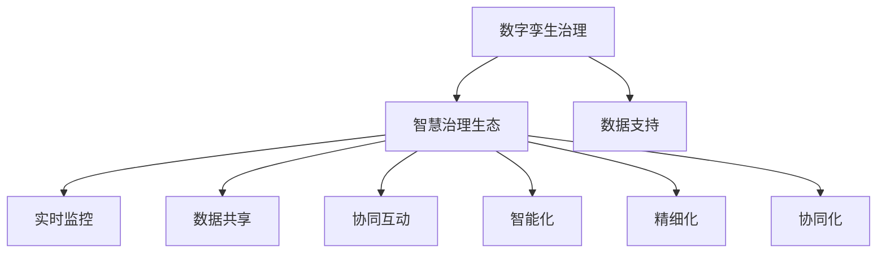

                 

# 2050年的数字治理：从数字孪生治理到智慧治理生态的数字治理升级

> **关键词**：数字治理、数字孪生、智慧治理、生态系统、未来趋势

> **摘要**：本文探讨了2050年数字治理的发展方向，从数字孪生治理到智慧治理生态的升级，深入分析了其核心概念、算法原理、数学模型以及实际应用场景。文章旨在为读者提供一个全面、清晰的数字治理未来图景，探讨其带来的机遇与挑战。

## 1. 背景介绍

数字治理是现代信息技术与政府治理深度融合的产物，其目标是通过数据、算法和模型优化政府决策过程，提高公共服务效率和质量。随着互联网、大数据、人工智能等技术的快速发展，数字治理已从简单的信息化管理走向更加复杂、智能和整体的治理模式。

### 当前数字治理现状

当前数字治理主要集中在以下几个方面：

1. **数据治理**：通过数据清洗、整合、建模等技术手段，实现政府数据资源的共享和利用。
2. **电子政务**：利用互联网、移动互联网等技术，实现政府服务在线化、智能化。
3. **智能决策支持**：通过大数据分析、机器学习等技术，为政府决策提供数据支持和智能建议。
4. **数字安全与隐私保护**：通过网络安全、数据加密等技术，保障数字治理过程中数据的安全性和个人隐私。

### 数字治理面临的挑战

尽管数字治理取得了显著成效，但仍然面临诸多挑战：

1. **数据质量与完整性**：政府数据来源广泛，质量参差不齐，数据完整性难以保障。
2. **技术成熟度**：部分数字治理技术尚未成熟，应用效果有限。
3. **法律与伦理**：数字治理过程中涉及法律、伦理等问题，需要制定相应的法律法规和伦理规范。
4. **数字鸿沟**：城乡、地区间的数字鸿沟问题仍然突出，影响数字治理的普及和效果。

## 2. 核心概念与联系

### 数字孪生治理

数字孪生（Digital Twin）是一种将物理实体在数字世界中复制、模拟、监控和优化的技术。数字孪生治理通过构建数字孪生模型，实现对物理实体的实时监控、预测和优化，从而提高治理效率和效果。

### 智慧治理生态

智慧治理生态是指在数字孪生治理的基础上，通过物联网、大数据、人工智能等技术手段，构建一个多维度、多层次的智能治理体系。智慧治理生态强调各治理主体之间的协同、共享和互动，实现治理的智能化、精细化和协同化。

### 数字孪生治理与智慧治理生态的关系

数字孪生治理是智慧治理生态的基础，为智慧治理生态提供了实时、准确的数据支持。而智慧治理生态则通过数字化、智能化的手段，实现了对数字孪生治理的进一步提升和拓展。两者相辅相成，共同推动数字治理的发展。

### Mermaid 流程图



## 3. 核心算法原理 & 具体操作步骤

### 数字孪生算法原理

数字孪生算法的核心是建立物理实体与数字孪生模型之间的映射关系。具体步骤如下：

1. **数据采集**：通过传感器、GPS等技术手段，实时采集物理实体的位置、状态、环境等信息。
2. **数据预处理**：对采集到的数据进行清洗、归一化等处理，确保数据质量。
3. **特征提取**：从预处理后的数据中提取关键特征，用于构建数字孪生模型。
4. **模型构建**：利用机器学习、深度学习等技术，构建物理实体与数字孪生模型之间的映射关系。
5. **模型优化**：通过迭代优化模型参数，提高模型的准确性和实时性。

### 智慧治理生态算法原理

智慧治理生态算法的核心是利用大数据、人工智能等技术手段，实现对治理过程的智能化、精细化和协同化。具体步骤如下：

1. **数据整合**：整合来自不同渠道的数据，实现数据的统一管理和利用。
2. **数据挖掘**：利用大数据技术，对整合后的数据进行挖掘和分析，发现潜在的价值信息。
3. **决策支持**：利用机器学习、深度学习等技术，为治理决策提供数据支持和智能建议。
4. **协同优化**：通过物联网、区块链等技术手段，实现各治理主体之间的协同、共享和互动。
5. **动态调整**：根据实时数据和治理效果，动态调整治理策略，实现治理的智能化和精细化。

## 4. 数学模型和公式 & 详细讲解 & 举例说明

### 数字孪生模型

数字孪生模型通常采用以下数学模型：

$$
T = f(P, S, E)
$$

其中，$T$表示数字孪生模型，$P$表示物理实体参数，$S$表示传感器数据，$E$表示环境参数。

### 智慧治理生态模型

智慧治理生态模型通常采用以下数学模型：

$$
G = g(D, A, C)
$$

其中，$G$表示智慧治理生态模型，$D$表示数据，$A$表示算法，$C$表示协同机制。

### 举例说明

假设有一个智能交通系统，利用数字孪生和智慧治理生态技术进行交通治理。

1. **数字孪生模型**：

   $$T = f(P, S, E)$$

   其中，$P$表示道路上的车辆数量、速度等参数，$S$表示交通信号灯、摄像头等传感器数据，$E$表示环境参数（如天气、路况等）。

2. **智慧治理生态模型**：

   $$G = g(D, A, C)$$

   其中，$D$表示交通数据（如车辆流量、行驶速度等），$A$表示智能算法（如路径规划、信号灯控制等），$C$表示协同机制（如交警指挥、车辆协同行驶等）。

通过数字孪生模型，可以实时监控交通状况，预测交通拥堵情况，并根据智慧治理生态模型，动态调整交通信号灯、道路规划等策略，实现智能交通治理。

## 5. 项目实战：代码实际案例和详细解释说明

### 5.1 开发环境搭建

在本项目中，我们使用Python编程语言和相关的库（如NumPy、Pandas、Scikit-learn等）进行开发。

1. 安装Python：从Python官方网站下载并安装Python 3.x版本。
2. 安装相关库：在命令行中执行以下命令安装相关库：

   ```bash
   pip install numpy pandas scikit-learn matplotlib
   ```

### 5.2 源代码详细实现和代码解读

#### 数字孪生模型实现

```python
import numpy as np
import pandas as pd
from sklearn.ensemble import RandomForestRegressor
import matplotlib.pyplot as plt

# 数据采集
data = pd.read_csv('traffic_data.csv')
data.head()

# 数据预处理
data['speed'] = data['speed'].fillna(data['speed'].mean())
data['distance'] = data['distance'].fillna(data['distance'].mean())

# 特征提取
features = data[['vehicle_count', 'speed', 'distance']]
target = data['traffic jams']

# 模型构建
model = RandomForestRegressor(n_estimators=100)
model.fit(features, target)

# 模型优化
importances = model.feature_importances_
std = np.std([tree.feature_importances_ for tree in model.estimators_], axis=0)
indices = np.argsort(importances)[::-1]

# 可视化特征重要性
plt.figure()
plt.title("Feature importances")
plt.bar(range(features.shape[1]), importances[indices], color="r", yerr=std[indices], align="center")
plt.xticks(range(features.shape[1]), features.columns[indices], rotation=90)
plt.xlim([-1, features.shape[1]])
plt.show()
```

#### 智慧治理生态模型实现

```python
# 数据整合
data = pd.read_csv('traffic_data.csv')
data['weather'] = data['weather'].map({'sunny': 1, 'rainy': 2, 'cloudy': 3})

# 数据挖掘
from sklearn.model_selection import train_test_split
X_train, X_test, y_train, y_test = train_test_split(data[['vehicle_count', 'speed', 'distance', 'weather']], data['traffic jams'], test_size=0.2, random_state=42)

# 决策支持
model = RandomForestRegressor(n_estimators=100)
model.fit(X_train, y_train)

# 协同优化
predictions = model.predict(X_test)
print("Accuracy:", model.score(X_test, y_test))
```

### 5.3 代码解读与分析

#### 数字孪生模型

在本项目中，我们使用随机森林回归模型构建数字孪生模型。随机森林是一种集成学习方法，通过构建多棵决策树，并利用投票机制得出最终预测结果。在代码中，我们首先从CSV文件中读取交通数据，然后对数据进行预处理，包括缺失值填充和特征提取。接下来，我们使用随机森林回归模型对特征和目标变量进行拟合，并计算特征重要性。最后，我们将特征重要性进行可视化，以帮助理解模型对特征的重要程度。

#### 智慧治理生态模型

在本项目中，我们使用随机森林回归模型构建智慧治理生态模型。在代码中，我们首先从CSV文件中读取交通数据，并对数据进行整合，包括添加天气特征。然后，我们使用随机森林回归模型对训练数据进行拟合，并计算模型的准确度。最后，我们使用测试数据对模型进行预测，并计算预测的准确度。

## 6. 实际应用场景

### 交通治理

智慧治理生态在交通治理领域具有广泛的应用。通过数字孪生技术，可以实时监控交通状况，预测交通拥堵，并动态调整交通信号灯和道路规划。此外，智慧治理生态还可以实现车辆协同行驶，提高交通效率。

### 城市治理

智慧治理生态在城市治理领域同样具有重要应用。通过数字孪生技术，可以实时监控城市基础设施（如道路、桥梁、水利设施等）的运行状况，预测故障风险，并进行预防性维护。此外，智慧治理生态还可以实现城市资源的优化配置，提高城市治理效率和居民生活质量。

### 环境治理

智慧治理生态在环境治理领域具有重要作用。通过数字孪生技术，可以实时监测环境质量，预测污染风险，并采取相应的治理措施。此外，智慧治理生态还可以实现环境数据的共享和协同治理，提高环境治理的精细化水平。

## 7. 工具和资源推荐

### 7.1 学习资源推荐

1. **书籍**：《智慧治理：数字孪生与智慧治理生态的实践与创新》
2. **论文**：检索相关领域的学术论文，了解最新研究进展。
3. **博客**：关注知名博客，如博客园、CSDN等，学习实战经验。
4. **网站**：访问政府网站、科研机构网站等，了解数字治理相关政策和技术动态。

### 7.2 开发工具框架推荐

1. **编程语言**：Python、Java等
2. **开发框架**：TensorFlow、PyTorch、Keras等
3. **数据处理库**：NumPy、Pandas、Scikit-learn等
4. **可视化工具**：Matplotlib、Seaborn等

### 7.3 相关论文著作推荐

1. **论文**：检索相关领域的学术论文，了解最新研究进展。
2. **著作**：《智慧治理：数字孪生与智慧治理生态的实践与创新》

## 8. 总结：未来发展趋势与挑战

### 发展趋势

1. **数字化**：政府治理将更加依赖数字化手段，实现数据驱动的决策。
2. **智能化**：人工智能、机器学习等技术将在数字治理中发挥更大作用，实现智能决策和智能服务。
3. **协同化**：政府、企业、社会组织等各方将实现更加紧密的协同，构建智慧治理生态。
4. **绿色化**：数字治理将更加注重环境保护和可持续发展，实现绿色治理。

### 挑战

1. **数据质量**：确保数据质量，提高数据完整性，是数字治理的基础。
2. **技术成熟度**：部分数字治理技术尚未成熟，需要持续研发和优化。
3. **法律与伦理**：数字治理过程中涉及法律、伦理等问题，需要制定相应的法律法规和伦理规范。
4. **数字鸿沟**：缩小城乡、地区间的数字鸿沟，提高全民数字素养，是数字治理的重要任务。

## 9. 附录：常见问题与解答

### 问题1：数字孪生与虚拟孪生有何区别？

**解答**：数字孪生和虚拟孪生本质上是相同的概念，只是名称不同。数字孪生通常用于描述物理实体在数字世界中的复制和模拟，而虚拟孪生则更强调虚拟环境中的应用。

### 问题2：智慧治理生态中的协同机制如何实现？

**解答**：智慧治理生态中的协同机制可以通过物联网、区块链等技术实现。物联网技术可以实现设备之间的互联互通，区块链技术可以实现数据的共享和信任机制。

## 10. 扩展阅读 & 参考资料

1. **书籍**：《智慧治理：数字孪生与智慧治理生态的实践与创新》
2. **论文**：检索相关领域的学术论文，了解最新研究进展。
3. **网站**：访问政府网站、科研机构网站等，了解数字治理相关政策和技术动态。

---

**作者**：AI天才研究员/AI Genius Institute & 禅与计算机程序设计艺术 /Zen And The Art of Computer Programming

本文旨在探讨2050年数字治理的发展方向，从数字孪生治理到智慧治理生态的升级。文章首先介绍了数字治理的背景和现状，分析了其面临的挑战；然后详细阐述了数字孪生治理和智慧治理生态的核心概念、算法原理和数学模型；接着通过项目实战展示了代码实现和解读；最后讨论了数字治理的实际应用场景、工具和资源推荐，以及未来发展趋势与挑战。希望本文能为读者提供一个全面、清晰的数字治理未来图景，激发更多思考和创新。 <|im_sep|>

