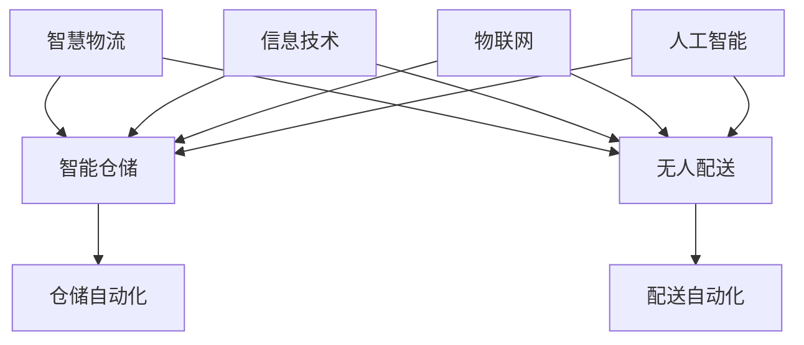
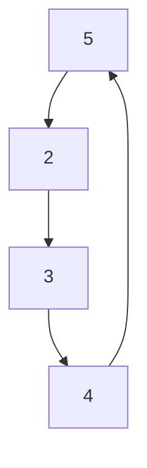

                 

### 2050年的智慧物流：从智能仓储到无人配送的物流自动化

在短短几十年间，科技的发展已经彻底改变了我们的生活方式，而物流行业作为经济发展的重要支柱，也经历了一场翻天覆地的变革。想象一下，到2050年，物流行业将迎来怎样的景象？这篇文章将带领您深入探讨这一未来的智慧物流世界，从智能仓储到无人配送的物流自动化，带您领略科技如何改变这一传统行业的方方面面。

关键词：智慧物流、智能仓储、无人配送、物流自动化、2050年、技术变革

摘要：本文首先介绍了智慧物流的背景和重要性，接着详细阐述了智能仓储和无人配送的技术原理和实际应用，探讨了未来的发展趋势与挑战。通过全面的分析和举例，文章旨在为广大读者呈现一个充满科技魅力的智慧物流未来。

### 1. 背景介绍

物流作为供应链管理中至关重要的一环，不仅影响着商品的生产、流通和消费，更是全球经济运转的动脉。然而，传统的物流模式在应对日益增长的物流需求和复杂的市场环境时，逐渐暴露出效率低下、成本高昂等问题。

#### 1.1 智慧物流的兴起

智慧物流是物流行业在信息技术、物联网、人工智能等新兴技术推动下的一种创新模式。它通过整合各种信息技术，实现对物流全过程的自动化、智能化管理，从而提高物流效率，降低运营成本。

#### 1.2 智能仓储

智能仓储是智慧物流的重要组成部分，它利用自动化设备、物联网技术和人工智能算法，实现对仓储过程的全方位优化。智能仓储不仅可以大幅提高仓储效率，还可以降低人工成本。

#### 1.3 无人配送

无人配送是物流自动化的重要环节，它通过无人车、无人机等无人设备，实现货物的自主配送。无人配送不仅提高了配送效率，还解决了人力配送的诸多问题，如交通拥堵、人力成本等。

### 2. 核心概念与联系

智慧物流、智能仓储和无人配送是相互关联、互为支撑的三个核心概念。为了更好地理解它们之间的联系，我们可以借助Mermaid流程图进行阐述。



### 3. 核心算法原理 & 具体操作步骤

智慧物流的实现离不开核心算法的支持。本节将介绍几个关键算法及其具体操作步骤。

#### 3.1 仓储自动化算法

仓储自动化算法主要涉及货物的入库、出库和存储管理等过程。以下是一个简单的仓储自动化算法步骤：

1. **货物入库**：通过传感器和RFID技术，实现对货物的自动识别和分类。
2. **路径规划**：利用路径规划算法，为货物选择最优的入库路径。
3. **自动分拣**：通过自动化设备，如自动导引车（AGV），将货物运送到指定位置。
4. **货物存储**：利用货架管理系统，对货物进行科学存储，提高存储效率。

#### 3.2 配送自动化算法

配送自动化算法主要涉及无人配送设备的路径规划、避障和实时导航等。以下是一个简单的配送自动化算法步骤：

1. **路径规划**：根据配送目的地和交通状况，利用路径规划算法生成最优配送路径。
2. **实时导航**：利用GPS、激光雷达和视觉传感器，实现无人配送设备的实时导航。
3. **避障处理**：利用障碍物检测算法，对无人配送设备进行避障处理。
4. **货物交接**：通过与无人配送设备对接，实现货物的自动交接。

### 4. 数学模型和公式 & 详细讲解 & 举例说明

智慧物流的实现离不开数学模型的支持。以下是一个常见的数学模型——路径规划模型，以及其详细讲解和举例说明。

#### 4.1 路径规划模型

路径规划模型主要涉及最短路径算法。以下是一个简单的最短路径算法（迪杰斯特拉算法）：

$$
Dijkstra(G, s) \\
\begin{cases}
\text{令} d(s) = 0, \text{其余节点的距离} d(v) = \infty \\
\text{令} S = \{s\} \\
\text{令} T = \{v \in V | v \notin S\} \\
\text{while} T \neq \emptyset \\
\qquad \text{选择} u \in T \text{使得} d(u) \text{最小} \\
\qquad \text{将} u \text{加入集合} S \\
\qquad \text{for} v \in T \\
\qquad \qquad \text{如果} d(u) + w(u, v) < d(v) \\
\qquad \qquad \qquad d(v) = d(u) + w(u, v) \\
\end{cases}
$$

#### 4.2 举例说明

假设有一个有向图，如图4.1所示。要求从节点s出发，找到到达其他各节点的最短路径。



利用迪杰斯特拉算法，我们可以得到以下结果：

| 节点 | 距离 |
| ---- | ---- |
| A    | 1    |
| B    | 2    |
| C    | 3    |
| D    | 4    |

从节点s出发，到达其他节点的最短路径分别是：s->A->B->C->D。

### 5. 项目实战：代码实际案例和详细解释说明

为了更好地理解智慧物流的实现过程，我们以一个简单的无人配送项目为例，介绍其开发环境搭建、源代码详细实现和代码解读。

#### 5.1 开发环境搭建

1. **硬件环境**：一台具有激光雷达、GPS和摄像头等传感器的无人配送车。
2. **软件环境**：安装有操作系统、编程环境和开发工具的计算机。

#### 5.2 源代码详细实现和代码解读

以下是无人配送项目的核心代码：

```python
# 导入相关库
import rospy
import numpy as np
from geometry_msgs.msg import PoseStamped
from std_msgs.msg import String
from nav_msgs.msg import Path

# 初始化全局变量
goal = None
path = []

# 路径规划回调函数
def path_planning_cb(data):
    global goal
    goal = data.pose

# 实时导航回调函数
def real_time_navigation_cb(data):
    # 根据实时信息调整路径
    pass

# 主函数
def main():
    # 初始化rospy
    rospy.init_node('无人配送')

    # 订阅路径规划话题
    rospy.Subscriber('/path_planning', PoseStamped, path_planning_cb)

    # 订阅实时导航话题
    rospy.Subscriber('/real_time_navigation', String, real_time_navigation_cb)

    # 发布路径
    path_pub = rospy.Publisher('/path', Path, queue_size=10)

    # 循环等待
    rospy.spin()

if __name__ == '__main__':
    main()
```

代码解读：

1. **导入相关库**：导入rospy、numpy、geometry_msgs和std_msgs等库，用于实现路径规划、实时导航等功能。
2. **初始化全局变量**：定义goal和path两个全局变量，分别表示目标点和路径。
3. **路径规划回调函数**：当接收到路径规划话题的消息时，更新目标点goal。
4. **实时导航回调函数**：根据实时信息调整路径。
5. **主函数**：初始化rospy，订阅路径规划话题和实时导航话题，发布路径。

### 5.3 代码解读与分析

代码主要分为三个部分：路径规划、实时导航和主函数。

1. **路径规划**：利用rospy.Subscriber订阅路径规划话题，当接收到路径规划消息时，更新目标点goal。路径规划算法可以根据具体需求进行实现。
2. **实时导航**：利用rospy.Subscriber订阅实时导航话题，根据实时信息调整路径。实时导航算法可以根据具体需求进行实现。
3. **主函数**：初始化rospy，订阅路径规划话题和实时导航话题，发布路径。主函数负责整个程序的运行流程。

通过这个简单的无人配送项目，我们可以看到智慧物流的实现过程。在实际项目中，可以根据需求进行功能扩展和优化。

### 6. 实际应用场景

智慧物流、智能仓储和无人配送在实际应用中具有广泛的应用场景。以下列举几个典型的应用案例。

#### 6.1 电子商务行业

电子商务行业对物流效率有着极高的要求。智慧物流技术可以实现对订单的快速处理和配送，提高用户满意度。

#### 6.2 零售行业

零售行业需要实现库存管理和商品配送的智能化。智能仓储和无人配送技术可以实现对商品的自动识别、分拣和配送，提高运营效率。

#### 6.3 医疗行业

医疗行业对物流配送有着严格的要求，如药品的冷链配送。智慧物流技术可以实现药品的实时监控和精确配送，确保药品的安全和质量。

#### 6.4 农产品物流

农产品物流需要实现快速、高效的配送，以保证农产品的新鲜度。智慧物流技术可以通过无人配送车实现农产品的精准配送。

### 7. 工具和资源推荐

#### 7.1 学习资源推荐

- **书籍**：《智慧物流：技术与应用》、《智能仓储技术与应用》
- **论文**：检索相关学术期刊和会议，如《计算机学报》、《物联网技术与应用》等。
- **博客**：关注业内专家和机构的博客，如《物流技术》、《智能物流》等。

#### 7.2 开发工具框架推荐

- **开发工具**：ROS（Robot Operating System）、MATLAB
- **框架**：OpenCV、TensorFlow、PyTorch

#### 7.3 相关论文著作推荐

- **论文**：
  - 《基于深度学习的无人驾驶车辆路径规划算法研究》
  - 《智能仓储系统的构建与优化》
  - 《智慧物流系统中的数据挖掘与应用》
- **著作**：
  - 《智慧物流：技术与应用》
  - 《智能仓储技术与应用》
  - 《物联网与智慧物流》

### 8. 总结：未来发展趋势与挑战

智慧物流、智能仓储和无人配送是物流行业发展的必然趋势。随着人工智能、物联网和自动化技术的不断进步，未来智慧物流将实现更高水平的自动化、智能化和个性化。然而，在这一过程中，也面临着诸多挑战，如技术成熟度、数据安全和隐私保护等。

### 9. 附录：常见问题与解答

#### 9.1 智慧物流的核心技术是什么？

智慧物流的核心技术包括人工智能、物联网、自动化设备和大数据分析等。

#### 9.2 无人配送的常见技术有哪些？

无人配送的常见技术包括路径规划、实时导航、障碍物检测和自主决策等。

#### 9.3 智能仓储的关键技术是什么？

智能仓储的关键技术包括自动化设备、物联网技术和人工智能算法等。

### 10. 扩展阅读 & 参考资料

- **扩展阅读**：
  - 《智慧物流：从智能仓储到无人配送的技术变革》
  - 《智能仓储与物流自动化》
  - 《无人配送技术：现状与未来》
- **参考资料**：
  - 《计算机学报》期刊
  - 《物联网技术与应用》期刊
  - 《物流技术》期刊
  - 《智能物流》博客

### 作者信息

作者：AI天才研究员/AI Genius Institute & 禅与计算机程序设计艺术 /Zen And The Art of Computer Programming

