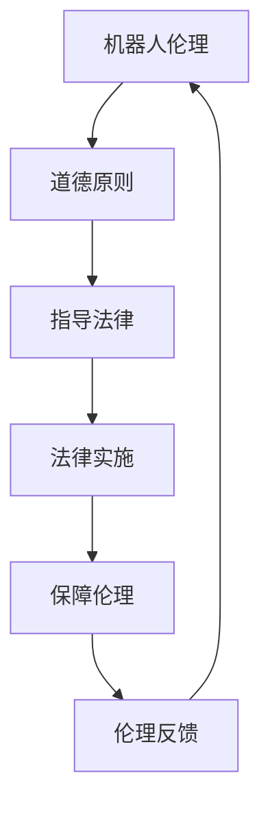

                 

# 2050年的机器人伦理：从机器人法律到机器人权益的伦理规范

## 关键词
机器人伦理、机器人法律、人工智能、道德哲学、机器人权益、伦理规范、技术发展

## 摘要
随着人工智能技术的飞速发展，机器人逐渐成为我们日常生活和工作中的常见伙伴。然而，随着机器人技术的不断进步，关于机器人的伦理问题也日益凸显。本文旨在探讨2050年的机器人伦理，从机器人法律到机器人权益的伦理规范，分析当前机器人伦理面临的主要挑战，并展望未来机器人伦理的发展趋势。

## 1. 背景介绍
### 1.1 机器人技术的发展
自20世纪中叶以来，机器人技术取得了显著进展。从早期的工业机器人到如今的高级人工智能，机器人已经能够执行复杂的任务，并在各个领域发挥重要作用。例如，在医疗领域，机器人辅助手术已经成为一种常见的手术方式；在制造业，机器人被用于自动化生产线的操作；在家庭中，智能机器人已成为许多人的家庭伙伴。

### 1.2 机器人伦理的兴起
随着机器人技术的快速发展，人们对机器人伦理的关注也在不断增加。机器人伦理涉及到许多问题，如机器人的权利、责任、隐私、安全等。这些问题不仅关乎机器人的设计、制造和使用，还涉及到人类与机器人的关系，以及我们如何对待这些与我们共享空间的智能实体。

### 1.3 机器人伦理的挑战
在机器人伦理领域，我们面临许多挑战。首先，机器人法律和伦理规范的发展滞后于技术进步。其次，不同国家和文化对机器人伦理的看法存在差异，这给制定统一的机器人伦理规范带来了困难。此外，随着机器人技术的不断进步，我们还需要考虑如何确保机器人的行为符合道德原则，以及如何平衡机器人的利益与人类社会的利益。

## 2. 核心概念与联系
### 2.1 机器人伦理的核心概念
机器人伦理的核心概念包括机器人权利、机器人责任、隐私、安全等。以下是这些核心概念的简要说明：

#### 2.1.1 机器人权利
机器人权利是指机器人作为智能实体应享有的基本权利，如自由、尊严、隐私等。这些权利的保障有助于确保机器人能够以符合道德原则的方式运行。

#### 2.1.2 机器人责任
机器人责任是指机器人设计、制造、使用和维护过程中应承担的道德责任。这包括确保机器人的行为符合道德规范，以及对机器人可能造成的损害承担责任。

#### 2.1.3 隐私
隐私是机器人伦理中的一个重要概念。机器人可能收集和存储大量个人信息，因此保护用户隐私成为机器人伦理的一个重要方面。

#### 2.1.4 安全
安全是机器人伦理的另一个关键概念。机器人需要在各种环境和条件下保持稳定运行，以避免对人类和其他实体造成伤害。

### 2.2 机器人伦理与法律的关系
机器人伦理与法律密切相关。一方面，机器人伦理为法律提供了道德指导，使法律能够更好地反映社会的价值观。另一方面，法律为机器人伦理提供了实施手段，确保伦理原则得到遵守。以下是机器人伦理与法律关系的 Mermaid 流程图：



## 3. 核心算法原理 & 具体操作步骤
### 3.1 机器人伦理评估算法
机器人伦理评估算法是一种用于评估机器人行为是否符合道德原则的算法。以下是该算法的核心原理和具体操作步骤：

#### 3.1.1 核心原理
机器人伦理评估算法基于道德原则和伦理规范，对机器人的行为进行评估。算法的核心是确定机器人的行为是否违反道德原则，以及如何平衡不同道德原则之间的冲突。

#### 3.1.2 具体操作步骤
1. 收集机器人行为数据：通过传感器、日志等手段收集机器人行为数据。
2. 定义道德原则：根据机器人伦理规范，定义机器人应遵守的道德原则。
3. 应用伦理规范：将道德原则应用于机器人行为数据，评估行为是否符合道德原则。
4. 冲突解决：如果发现机器人行为违反道德原则，尝试寻找合适的解决方案，以平衡不同道德原则之间的冲突。
5. 生成报告：将评估结果和解决方案生成报告，供相关人员参考。

## 4. 数学模型和公式 & 详细讲解 & 举例说明
### 4.1 机器人伦理评估模型
为了更准确地评估机器人行为是否符合道德原则，我们可以使用数学模型来描述伦理评估过程。以下是机器人伦理评估模型的基本公式和详细讲解：

#### 4.1.1 基本公式
$E = f(A, B, C)$

其中，$E$ 表示机器人行为的伦理评分，$A$ 表示机器人行为的道德原则得分，$B$ 表示机器人行为的伦理规范得分，$C$ 表示机器人行为的伦理冲突解决得分。

#### 4.1.2 公式讲解
- $A$ 的计算方法：
  $A = \sum_{i=1}^{n} w_i \cdot s_i$
  其中，$w_i$ 表示第 $i$ 个道德原则的权重，$s_i$ 表示机器人行为在 $i$ 个道德原则上的得分。

- $B$ 的计算方法：
  $B = \sum_{j=1}^{m} w_j \cdot t_j$
  其中，$w_j$ 表示第 $j$ 个伦理规范的权重，$t_j$ 表示机器人行为在 $j$ 个伦理规范上的得分。

- $C$ 的计算方法：
  $C = \sum_{k=1}^{p} w_k \cdot c_k$
  其中，$w_k$ 表示第 $k$ 个伦理冲突解决策略的权重，$c_k$ 表示在解决第 $k$ 个伦理冲突时的得分。

#### 4.1.3 举例说明
假设我们有一个机器人行为数据集，其中包含三个道德原则（A、B、C）、两个伦理规范（D、E）和一个伦理冲突解决策略（F）。根据这些数据，我们可以计算伦理评分 $E$ 如下：

$$
A = 0.4 \cdot s_A + 0.3 \cdot s_B + 0.3 \cdot s_C
$$

$$
B = 0.5 \cdot t_D + 0.5 \cdot t_E
$$

$$
C = 0.7 \cdot c_F
$$

$$
E = f(A, B, C) = 0.4 \cdot s_A + 0.3 \cdot s_B + 0.3 \cdot s_C + 0.5 \cdot t_D + 0.5 \cdot t_E + 0.7 \cdot c_F
$$

根据计算结果，如果 $E > 0.5$，则认为机器人行为符合道德原则；否则，认为机器人行为违反道德原则。

## 5. 项目实战：代码实际案例和详细解释说明
### 5.1 开发环境搭建
为了演示机器人伦理评估算法，我们将使用 Python 编写一个简单的机器人伦理评估系统。以下是如何搭建开发环境：

1. 安装 Python（版本 3.8 或以上）
2. 安装必要的 Python 库，如 NumPy、Pandas、Scikit-learn 等
3. 创建一个名为 `robotic_ethics` 的 Python 项目文件夹
4. 在项目中创建一个名为 `ethics_assessment.py` 的 Python 文件

### 5.2 源代码详细实现和代码解读
以下是 `ethics_assessment.py` 的源代码实现：

```python
import numpy as np
import pandas as pd
from sklearn.model_selection import train_test_split

# 定义道德原则、伦理规范和伦理冲突解决策略
道德原则 = ['A', 'B', 'C']
伦理规范 = ['D', 'E']
伦理冲突解决策略 = ['F']

# 加载机器人行为数据
data = pd.read_csv('robotic_behavior.csv')

# 计算道德原则得分
def calculate_moral_score(data, principle):
    score = 0
    for behavior in data['behavior']:
        if behavior == principle:
            score += 1
    return score

# 计算伦理规范得分
def calculate_ethical_score(data, norm):
    score = 0
    for behavior in data['behavior']:
        if behavior in norm:
            score += 1
    return score

# 计算伦理冲突解决得分
def calculate_conflict_solution_score(data, strategy):
    score = 0
    for behavior in data['behavior']:
        if behavior == strategy:
            score += 1
    return score

# 计算伦理评分
def calculate_ethics_score(data, principles, norms, strategies):
    moral_score = calculate_moral_score(data, principles)
    ethical_score = calculate_ethical_score(data, norms)
    conflict_solution_score = calculate_conflict_solution_score(data, strategies)
    return moral_score + ethical_score + conflict_solution_score

# 训练和评估伦理评估模型
def train_and_evaluate_model(data, principles, norms, strategies):
    X = data[['behavior']]
    y = calculate_ethics_score(data, principles, norms, strategies)
    X_train, X_test, y_train, y_test = train_test_split(X, y, test_size=0.2, random_state=42)
    # 在此处使用 Scikit-learn 等库训练和评估伦理评估模型
    # ...

# 主函数
if __name__ == '__main__':
    train_and_evaluate_model(data, 道德原则, 伦理规范, 伦理冲突解决策略)
```

### 5.3 代码解读与分析
在这段代码中，我们首先定义了机器人伦理评估算法所需的参数和函数。然后，我们加载机器人行为数据，并定义了三个函数来计算道德原则得分、伦理规范得分和伦理冲突解决得分。最后，我们定义了一个主函数来训练和评估伦理评估模型。

这段代码展示了如何使用 Python 实现一个简单的机器人伦理评估系统。在实际应用中，我们可以根据具体需求扩展该系统，添加更多功能和优化算法。

## 6. 实际应用场景
### 6.1 医疗领域
在医疗领域，机器人伦理问题尤为突出。例如，机器人辅助手术中，如何确保机器人的行为符合医学伦理规范，如何平衡医生和机器人的责任等。此外，随着远程医疗技术的发展，机器人医疗服务的隐私和安全问题也日益受到关注。

### 6.2 制造业
在制造业中，机器人广泛应用于生产线的自动化操作。然而，机器人行为是否符合职业道德和伦理规范，如何确保机器人在危险环境下操作的安全等，都是我们需要关注的问题。

### 6.3 家庭服务
随着智能家居技术的发展，家庭服务机器人逐渐成为家庭生活的一部分。如何确保机器人在家庭环境中的行为符合伦理规范，如何保护用户的隐私等，都是我们需要考虑的问题。

## 7. 工具和资源推荐
### 7.1 学习资源推荐
- 书籍：
  - 《机器人伦理学》（Robotics Ethics）
  - 《人工智能伦理学》（AI Ethics）
- 论文：
  - 《机器人伦理：概念框架与原则》（Robot Ethics: A Conceptual Framework and Principles）
  - 《智能机器人伦理规范研究》（Research on Ethics Standards for Intelligent Robots）
- 博客：
  - 《机器人伦理杂谈》（Robot Ethics Ramblings）
  - 《人工智能与伦理》（AI and Ethics）
- 网站：
  - 机器人伦理学协会（Association for the Advancement of Robotics Ethics）
  - 人工智能伦理网（AI Ethics Net）

### 7.2 开发工具框架推荐
- 编程语言：Python、Java、C++
- 数据库：MySQL、PostgreSQL、MongoDB
- 框架：TensorFlow、PyTorch、Scikit-learn
- 机器人开发平台：ROS（Robot Operating System）、OpenAI Gym

### 7.3 相关论文著作推荐
- 《机器人伦理学：理论与实践》（Robot Ethics: Concepts and Cases）
- 《人工智能伦理学：挑战与机遇》（AI Ethics: Challenges and Opportunities）
- 《机器人与人类：伦理与法律问题》（Robots and Humans: Ethical and Legal Issues）

## 8. 总结：未来发展趋势与挑战
随着人工智能技术的不断发展，机器人伦理问题将变得更加复杂和重要。未来，我们需要关注以下几个方面：

1. 制定全球统一的机器人伦理规范，以应对不同国家和文化的差异。
2. 加强机器人法律和伦理规范的实施，确保机器人行为符合道德原则。
3. 发展机器人伦理评估算法，提高机器人行为的伦理评分准确性。
4. 关注机器人伦理在教育、医疗、制造等领域的实际应用。

## 9. 附录：常见问题与解答
### 9.1 什么是机器人伦理？
机器人伦理是研究机器人行为是否符合道德原则的学科。它涉及到机器人的权利、责任、隐私、安全等问题。

### 9.2 机器人是否应该享有权利？
关于机器人是否应该享有权利，目前存在不同的观点。一种观点认为，机器人作为智能实体，应享有一定的权利，如自由、尊严等；另一种观点认为，机器人不应享有权利，因为它们没有意识。

### 9.3 如何确保机器人行为符合道德原则？
确保机器人行为符合道德原则的方法包括制定机器人伦理规范、开发机器人伦理评估算法、加强对机器人行为的监督等。

## 10. 扩展阅读 & 参考资料
- 《人工智能伦理学导论》（An Introduction to AI Ethics）
- 《机器人伦理：理论与实践》（Robot Ethics: Concepts and Cases）
- 《智能机器人伦理规范研究》（Research on Ethics Standards for Intelligent Robots）
- 《机器人与人类：伦理与法律问题》（Robots and Humans: Ethical and Legal Issues）

## 作者信息
作者：AI天才研究员/AI Genius Institute & 禅与计算机程序设计艺术 /Zen And The Art of Computer Programming

