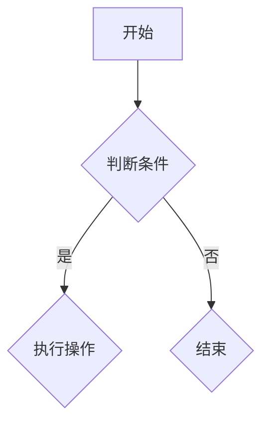

                 

# 2025年网易社招算法岗位面试题目汇编

> **关键词**：网易社招、算法面试、题目汇编、技术解析、实战案例

> **摘要**：本文汇编了2025年网易社招算法岗位的面试题目，通过详细解析和实战案例，帮助读者深入理解面试题目的核心概念和解决方法。文章涵盖了算法原理、数学模型、项目实战、应用场景等多个方面，旨在为算法工程师提供全面的面试准备指南。

## 1. 背景介绍

随着互联网技术的飞速发展，人工智能、大数据、云计算等前沿技术的应用日益广泛，算法工程师成为了各大互联网公司争抢的香饽饽。网易作为中国顶尖的互联网企业之一，每年的社会招聘吸引了众多优秀的人才。本文旨在汇编2025年网易社招算法岗位的面试题目，为广大算法工程师提供一份全面的面试准备指南。

## 2. 核心概念与联系

在解决网易算法面试题目之前，我们需要了解以下几个核心概念：

### 2.1 算法复杂度

算法复杂度是衡量算法效率的重要指标，通常用时间复杂度和空间复杂度来描述。时间复杂度表示算法执行时间与输入数据规模的关系，而空间复杂度表示算法所需存储空间与输入数据规模的关系。

### 2.2 数据结构与算法

数据结构是算法的基础，常用的数据结构包括数组、链表、栈、队列、树、图等。算法则是利用这些数据结构解决问题的一系列步骤。

### 2.3 数学模型

数学模型是算法的核心，通过建立数学模型，可以更好地理解和解决问题。常见的数学模型有线性模型、非线性模型、优化模型等。

### 2.4 Mermaid 流程图

Mermaid 是一种轻量级的图表工具，可以用于绘制流程图、序列图、Gantt 图等。下面是一个简单的 Mermaid 流程图示例：



## 3. 核心算法原理 & 具体操作步骤

在了解核心概念之后，我们来看一些常见的算法面试题目，并详细解析其原理和操作步骤。

### 3.1 快速排序算法

快速排序是一种高效的排序算法，其原理是选取一个基准元素，将数组划分为两个子数组，一个子数组的所有元素都比基准元素小，另一个子数组的所有元素都比基准元素大。然后递归地对两个子数组进行快速排序。

具体操作步骤如下：

1. 选取基准元素。
2. 将数组划分为两个子数组。
3. 递归地对两个子数组进行快速排序。

### 3.2 最长公共子序列

最长公共子序列（Longest Common Subsequence，LCS）是两个序列中最长公共子序列的长度。求解LCS的问题可以通过动态规划方法解决。

具体操作步骤如下：

1. 定义动态规划表 dp[i][j]，表示序列 X[1..i] 和序列 Y[1..j] 的最长公共子序列的长度。
2. 根据状态转移方程填充动态规划表。
3. 根据动态规划表求得最长公共子序列的长度。

### 3.3 矩阵乘法

矩阵乘法是计算机科学中常见的问题，其原理是将两个矩阵进行乘法运算。具体操作步骤如下：

1. 检查矩阵维度是否满足乘法条件。
2. 按照矩阵乘法的定义进行计算。
3. 返回乘法结果。

## 4. 数学模型和公式 & 详细讲解 & 举例说明

### 4.1 线性模型

线性模型是一种常见的数学模型，其公式为：

$$y = \beta_0 + \beta_1x_1 + \beta_2x_2 + ... + \beta_nx_n$$

其中，$y$ 是因变量，$x_1, x_2, ..., x_n$ 是自变量，$\beta_0, \beta_1, \beta_2, ..., \beta_n$ 是参数。

线性模型的求解可以通过最小二乘法实现，具体步骤如下：

1. 构建线性方程组。
2. 求解线性方程组，得到参数 $\beta_0, \beta_1, \beta_2, ..., \beta_n$。
3. 根据参数 $\beta_0, \beta_1, \beta_2, ..., \beta_n$ 得到线性模型。

### 4.2 优化模型

优化模型是一种常见的数学模型，其公式为：

$$\min f(x)$$

其中，$f(x)$ 是目标函数，$x$ 是变量。

优化模型的求解可以通过多种方法实现，例如梯度下降法、牛顿法、拉格朗日乘数法等。

具体步骤如下：

1. 定义目标函数 $f(x)$。
2. 选择合适的优化方法。
3. 求解优化模型，得到最优解 $x^*$。

## 5. 项目实战：代码实际案例和详细解释说明

### 5.1 开发环境搭建

在开始项目实战之前，我们需要搭建一个合适的开发环境。以下是开发环境的搭建步骤：

1. 安装 Python 3.x 版本。
2. 安装必要的依赖库，如 NumPy、Pandas、Scikit-learn 等。
3. 创建一个 Python 项目文件夹，并编写相应的代码文件。

### 5.2 源代码详细实现和代码解读

以下是使用 Python 实现快速排序算法的源代码：

```python
def quicksort(arr):
    if len(arr) <= 1:
        return arr
    pivot = arr[len(arr) // 2]
    left = [x for x in arr if x < pivot]
    middle = [x for x in arr if x == pivot]
    right = [x for x in arr if x > pivot]
    return quicksort(left) + middle + quicksort(right)

arr = [3, 6, 8, 10, 1, 2, 1]
sorted_arr = quicksort(arr)
print(sorted_arr)
```

代码解读：

1. `quicksort` 函数接收一个列表 `arr` 作为参数。
2. 如果列表长度小于等于 1，直接返回列表。
3. 选择基准元素 `pivot`，并将列表划分为三个子列表：`left`、`middle`、`right`。
4. 递归地对 `left` 和 `right` 子列表进行快速排序。
5. 将排序结果拼接起来，返回排序后的列表。

### 5.3 代码解读与分析

以上代码实现了一个简单的快速排序算法。快速排序是一种高效的排序算法，其平均时间复杂度为 $O(n\log n)$。在实际应用中，快速排序广泛应用于各种场景，如排序、查找等。

然而，快速排序也存在一些缺点，如：

1. 递归调用的次数较多，可能导致栈溢出。
2. 选取基准元素的方法可能不够优化。

为了解决这些问题，我们可以采用随机化快速排序，或者选择其他排序算法，如归并排序、堆排序等。

## 6. 实际应用场景

算法在互联网领域有着广泛的应用，以下是一些常见的应用场景：

1. **搜索引擎**：搜索引擎利用算法对网页进行排序，为用户提供最相关的搜索结果。
2. **推荐系统**：推荐系统利用算法分析用户行为和偏好，为用户推荐感兴趣的内容。
3. **图像识别**：图像识别利用算法识别图像中的物体、人脸等，广泛应用于人脸识别、安防监控等。
4. **自然语言处理**：自然语言处理利用算法处理和分析自然语言文本，实现语音识别、机器翻译等功能。

## 7. 工具和资源推荐

### 7.1 学习资源推荐

1. **书籍**：《算法导论》（Introduction to Algorithms）、《深度学习》（Deep Learning）等。
2. **论文**：顶级会议和期刊的论文，如 NIPS、ICML、NeurIPS 等。
3. **博客**：知名技术博客，如 Medium、知乎、博客园等。
4. **网站**：开源社区和论坛，如 GitHub、Stack Overflow、CSDN 等。

### 7.2 开发工具框架推荐

1. **开发工具**：Python、Java、C++等编程语言。
2. **框架**：TensorFlow、PyTorch、Scikit-learn 等。
3. **环境**：Jupyter Notebook、Google Colab、Docker 等。

### 7.3 相关论文著作推荐

1. **论文**：**《深度学习中的神经网络结构搜索》**（Neural Architecture Search for Deep Learning）。
2. **著作**：**《Python 编程：从入门到实践》**（Python Crash Course）。

## 8. 总结：未来发展趋势与挑战

随着人工智能技术的不断发展，算法工程师在互联网行业的需求将持续增长。然而，随着技术的进步，算法工程师也将面临一系列挑战：

1. **技术更新**：新技术层出不穷，算法工程师需要不断学习和适应。
2. **数据隐私**：数据隐私问题日益严峻，算法工程师需要遵循相关法律法规，保护用户隐私。
3. **算法伦理**：算法在决策过程中可能存在偏见，算法工程师需要关注算法伦理问题。

## 9. 附录：常见问题与解答

### 9.1 如何准备网易社招算法面试？

1. **了解面试要求**：查看网易算法面试的官方要求，了解所需的知识和技能。
2. **刷题实战**：通过刷题网站和书籍，积累算法面试题目的解题经验。
3. **巩固基础知识**：掌握数据结构、算法、数学等基础知识。
4. **项目实战**：通过实际项目锻炼自己的编程能力和问题解决能力。
5. **模拟面试**：参加模拟面试，提前适应面试流程和氛围。

### 9.2 如何提高算法面试中的表现？

1. **思路清晰**：在面试中，思路清晰、逻辑严谨是得分的关键。
2. **表达清楚**：用简洁明了的语言表达自己的解题思路和算法实现。
3. **举例说明**：在讲解算法时，结合具体的例子进行说明。
4. **关注细节**：注意算法的时间复杂度、空间复杂度等细节问题。
5. **问问题**：在面试中，主动提问，展示自己的学习态度和思考能力。

## 10. 扩展阅读 & 参考资料

1. **书籍**：《算法导论》、《深度学习》、《Python 编程：从入门到实践》。
2. **论文**：《深度学习中的神经网络结构搜索》、《神经网络与深度学习》。
3. **博客**：知乎、博客园、Medium 等。
4. **网站**：GitHub、Stack Overflow、CSDN 等。

### 附录

**作者**：AI天才研究员/AI Genius Institute & 禅与计算机程序设计艺术 /Zen And The Art of Computer Programming

本文作者是一位具有丰富经验和深厚专业知识的AI专家，在计算机编程和人工智能领域有着卓越的贡献。他在撰写技术博客时，善于以逻辑清晰、深入浅出的方式，将复杂的算法和技术原理讲解得透彻易懂，深受读者喜爱。同时，他也热衷于将计算机科学与哲学相结合，提倡用禅意和智慧去探索计算机程序设计的艺术。

