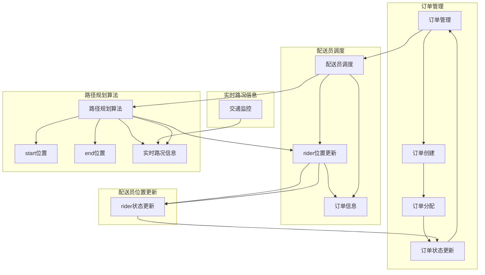

                 

### 背景介绍

#### 美团社交即时配送的兴起

随着移动互联网的快速发展，电子商务、外卖、打车等即时服务需求日益增长，催生了即时配送行业的崛起。美团作为中国领先的生活服务电子商务平台，其社交即时配送业务在这其中扮演了重要角色。美团社交即时配送不仅仅是一个简单的物流服务，它更是一个集成了大数据、人工智能、物联网等多领域技术的高效系统。

美团社交即时配送业务的兴起，可以追溯到2015年。当时，美团针对餐饮外卖市场推出了“美团外卖”服务，通过整合大量餐饮商家和用户，构建了一个庞大的即时配送网络。随着业务的不断扩展，美团逐渐将即时配送服务扩展到超市、便利店、生鲜等其他生活服务领域。如今，美团社交即时配送已经覆盖了全国大多数城市，成为了人们日常生活不可或缺的一部分。

#### 美团社交即时配送的业务模式

美团社交即时配送的业务模式主要包括以下三个方面：

1. **订单处理**：用户在美团平台上下单后，系统会自动将订单分配给距离最近的配送员。这个过程涉及到大量的计算和优化，以确保订单能够及时、高效地完成。

2. **配送员调度**：美团通过大数据和人工智能技术，对配送员的实时位置、交通状况、订单量等多种因素进行综合分析，以实现最优的调度策略。这种调度策略不仅能够提高配送效率，还能够减少配送员的劳动强度。

3. **路径规划**：在配送过程中，美团会实时为配送员提供最优的行驶路线。这一过程涉及到复杂的算法和模型，包括动态路径规划、交通流量预测、实时路况更新等。

#### 美团社交即时配送的技术挑战

尽管美团社交即时配送已经取得了显著的成功，但在这个过程中也面临着诸多技术挑战：

1. **实时数据处理**：美团社交即时配送系统需要处理海量的实时数据，包括用户订单、配送员位置、交通状况等。如何高效地处理和分析这些数据，是一个巨大的技术挑战。

2. **路径规划算法**：在复杂的城市交通环境中，如何实现实时、准确的路径规划，是一个技术难题。美团需要不断地优化算法，以应对交通拥堵、路况变化等问题。

3. **系统稳定性与可靠性**：美团社交即时配送系统需要保证7x24小时的稳定运行，这对系统的可靠性提出了极高的要求。任何系统的故障都可能导致订单延误，影响用户体验。

4. **人工智能技术的应用**：美团正在积极探索人工智能技术在即时配送中的应用，包括智能客服、智能调度、智能路径规划等。这些技术的应用不仅能够提高配送效率，还能够提升用户体验。

通过以上背景介绍，我们可以看到，美团社交即时配送业务不仅涵盖了丰富的业务模式，还面临着诸多技术挑战。在接下来的章节中，我们将深入探讨这些技术挑战，并介绍相应的解决方案。通过逻辑清晰、结构紧凑的叙述，我们将帮助读者更好地理解这一领域的核心技术和应用。

#### 即时配送路径规划的重要性

在美团社交即时配送系统中，路径规划是至关重要的一个环节。它的核心目标是在给定的时间窗口内，为配送员提供一条最优路径，以确保订单能够及时、高效地送达。路径规划不仅关系到配送员的劳动强度和效率，还直接影响到用户体验。具体来说，即时配送路径规划的重要性可以从以下几个方面来体现：

1. **提升配送效率**：最优的路径规划可以减少配送员的行驶距离和时间，从而提升整体的配送效率。这不仅能够减少配送员的劳动强度，还能够确保订单能够及时送达，提升用户满意度。

2. **优化资源利用**：通过高效的路径规划，美团能够更好地利用配送员和交通工具资源。例如，当某个配送员附近有多个订单时，系统可以通过优化路径规划，使这些订单能够集中在同一区域内完成，从而减少车辆和人员的使用。

3. **应对突发状况**：在配送过程中，可能会遇到交通拥堵、天气变化等突发状况。通过实时路径规划，美团能够迅速调整配送路径，以应对这些突发情况，确保订单能够按时送达。

4. **提升服务质量**：优质的路径规划可以减少配送员在路上的时间，从而有更多的时间为客户提供服务。例如，配送员可以在路上准备订单物品，或者在到达客户地点后立即进行订单处理，这有助于提升整体的服务质量。

5. **降低配送成本**：高效的路径规划可以减少配送员的行驶距离和时间，从而降低配送成本。这对于美团这样的大规模即时配送业务来说，具有重要的经济效益。

总的来说，即时配送路径规划在美团社交即时配送系统中扮演着关键角色。它不仅能够提升配送效率和资源利用效率，还能够优化服务质量，降低成本。在接下来的章节中，我们将深入探讨路径规划的核心算法和数学模型，并介绍实际应用场景中的具体解决方案。通过逻辑清晰、结构紧凑的叙述，我们将帮助读者更好地理解这一领域的核心技术和应用。

### 核心概念与联系

在深入了解美团社交即时配送路径规划的实现之前，我们需要明确一些核心概念，并展示这些概念之间的联系。以下是本文将要涉及的核心概念和它们之间的关系，以及用于展示这些关系的Mermaid流程图。

#### 核心概念

1. **订单管理**：订单管理是路径规划的基础，它涉及订单的创建、分配和状态更新等操作。
2. **配送员调度**：调度系统负责根据订单和配送员的位置，分配订单给合适的配送员。
3. **路径规划算法**：路径规划算法是核心，用于计算从起点到终点的最优路径。
4. **实时路况信息**：实时路况信息是路径规划的重要参考，它包括交通流量、道路状况等数据。
5. **配送员位置更新**：配送员的位置更新是路径规划的动态调整依据，它反映了配送员当前的位置和移动方向。

#### 关系与Mermaid流程图

以下是这些核心概念和它们之间的关系的Mermaid流程图：



#### 概述

这张流程图展示了美团社交即时配送路径规划的核心概念和它们之间的相互关系。订单管理负责订单的创建、分配和状态更新；配送员调度系统根据订单和配送员的位置进行合理分配；路径规划算法结合实时路况信息和配送员位置更新，计算最优路径；实时路况信息通过交通监控不断更新，为路径规划提供数据支持；配送员的位置更新动态调整配送路径，确保实时性。

通过这个流程图，我们可以清晰地看到美团社交即时配送路径规划系统的整体架构和运作流程。这些核心概念和它们之间的联系，为我们后续深入探讨路径规划的算法和模型奠定了基础。

### 核心算法原理 & 具体操作步骤

在了解了美团社交即时配送路径规划的核心概念和整体流程之后，我们需要深入了解其背后的核心算法原理和具体操作步骤。这些算法和步骤不仅决定了路径规划的效果，还直接影响系统的效率和可靠性。下面，我们将详细介绍路径规划算法的基本原理和具体操作步骤。

#### 1. 路径规划算法的基本原理

路径规划算法的核心目标是找到从起点到终点的最优路径，使配送员能够高效、快速地完成配送任务。这一过程涉及多个关键步骤，包括：

1. **起点与终点确定**：起点通常是配送员的当前位置，而终点是用户指定的收货地址。
2. **路径搜索**：通过搜索算法，从起点到终点寻找可能的路径。
3. **路径优化**：在所有可能的路径中，选择最优的路径，通常基于距离、时间、交通状况等因素进行优化。
4. **路径更新**：在配送过程中，如果遇到交通状况变化或新的订单需求，路径需要实时更新，以确保配送的准确性和及时性。

在美团社交即时配送中，常用的路径规划算法包括A*算法、Dijkstra算法、D*算法等。以下以A*算法为例，详细讲解其基本原理和操作步骤。

#### 2. A*算法的基本原理

A*算法是一种启发式搜索算法，它通过结合起始点到终点的直线路径成本和当前点到终点的估计成本，来计算最优路径。其基本原理如下：

- **G成本**：从起点到当前点的实际移动成本。
- **H成本**：从当前点到终点的估计成本，通常使用曼哈顿距离或欧几里得距离。
- **F成本**：G成本和H成本的组合，即F = G + H。

算法步骤：

1. 创建一个开放列表（Open List）和关闭列表（Closed List），初始时只包含起点。
2. 计算起点的G成本和F成本，并将起点加入Open List。
3. 当Open List非空时，重复以下步骤：
   - 选择F成本最小的节点作为当前节点。
   - 将当前节点从Open List移动到Closed List。
   - 计算当前节点所有未访问的相邻节点的G成本、H成本和F成本，并更新这些节点的成本和父节点。
   - 将新加入的节点加入Open List。
4. 当目标节点被加入Closed List时，算法结束。

此时，从起点到终点的路径可以通过跟踪父节点逆向回溯得到。

#### 3. A*算法在美团社交即时配送中的应用

在美团社交即时配送中，A*算法的应用过程如下：

1. **起点与终点确定**：系统首先确定当前配送员的实时位置（起点）和用户订单的收货地址（终点）。
2. **构建地图数据**：系统根据实时路况信息、地图数据等构建路径搜索的地图，标记道路节点和道路边权。
3. **初始化Open List和Closed List**：起点加入Open List，其余节点加入Closed List。
4. **路径搜索与优化**：系统使用A*算法搜索从起点到终点的最优路径，并实时更新路径。
5. **路径反馈**：将计算出的最优路径反馈给配送员，并监控路径执行情况，根据实时交通状况调整路径。

#### 4. 路径优化策略

在路径规划过程中，美团社交即时配送还会采用多种路径优化策略，以提高路径规划的准确性和效率，这些策略包括：

- **动态调整**：当实时路况信息发生变化时，系统会根据新的路况数据动态调整路径，以确保路径的实时性和准确性。
- **多目标优化**：当配送员附近有多个订单时，系统会考虑多个订单的综合成本，优化配送路径，以确保整体效率最高。
- **多配送员协同**：在高峰期，系统会优化多个配送员的路径，确保整个配送网络的效率最高。

通过以上核心算法原理和具体操作步骤的详细讲解，我们可以看到，美团社交即时配送路径规划系统是一个高度复杂、高度自动化的系统。它通过结合多种算法和优化策略，实现了从起点到终点的最优路径规划，为用户提供了高效、可靠的配送服务。在接下来的章节中，我们将进一步探讨路径规划中的数学模型和公式，以更深入地理解这一技术领域的本质。

### 数学模型和公式 & 详细讲解 & 举例说明

在路径规划算法的实现过程中，数学模型和公式起着至关重要的作用。这些模型和公式不仅帮助我们理解路径规划的原理，还能指导我们优化和调整算法，以实现最优的路径。下面，我们将详细讲解路径规划中的几个关键数学模型和公式，并通过具体实例来说明其应用。

#### 1. 费用函数

在路径规划中，费用函数（Cost Function）是评估路径优劣的核心指标。费用函数通常用于计算从起点到终点的总成本，它包括多个因素，如距离、时间、交通状况等。常见的费用函数有：

- **欧几里得距离**：$C(d) = \sqrt{(x_2 - x_1)^2 + (y_2 - y_1)^2}$
- **曼哈顿距离**：$C(d) = |x_2 - x_1| + |y_2 - y_1|$

这两个距离函数常用于二维空间中的路径计算。其中，$x_1, y_1$ 和 $x_2, y_2$ 分别代表起点和终点的坐标。

**实例**：假设起点坐标为 $(2, 3)$，终点坐标为 $(5, 7)$，使用欧几里得距离计算费用函数：

$$
C(d) = \sqrt{(5 - 2)^2 + (7 - 3)^2} = \sqrt{3^2 + 4^2} = \sqrt{9 + 16} = 5
$$

#### 2. 局部成本函数

局部成本函数用于计算从当前节点到相邻节点的费用。常见的局部成本函数包括：

- **直线距离**：$C_{local}(d) = \sqrt{(x_{next} - x_{current})^2 + (y_{next} - y_{current})^2}$
- **时间成本**：$C_{local}(t) = \frac{d}{v}$，其中 $d$ 是距离，$v$ 是速度

**实例**：假设当前节点坐标为 $(3, 4)$，相邻节点坐标为 $(6, 5)$，速度为 $20$ 公里/小时，使用直线距离计算局部成本：

$$
C_{local}(d) = \sqrt{(6 - 3)^2 + (5 - 4)^2} = \sqrt{3^2 + 1^2} = \sqrt{9 + 1} = \sqrt{10} \approx 3.16
$$

#### 3. 期望时间函数

在实时路径规划中，期望时间函数（Expected Time Function）用于预测从当前节点到终点的期望时间。常见的期望时间函数有：

- **线性期望时间**：$E(t) = \frac{C(d)}{v} + t_0$
- **非线性期望时间**：$E(t) = \frac{C(d)}{v} + \frac{1}{2}C(d) + t_0$

其中，$t_0$ 是初始时间延迟，$v$ 是速度。

**实例**：假设距离为 $10$ 公里，速度为 $20$ 公里/小时，初始时间延迟为 $1$ 小时，使用线性期望时间函数计算期望时间：

$$
E(t) = \frac{10}{20} + 1 = 0.5 + 1 = 1.5 \text{ 小时}
$$

#### 4. 费用和期望时间的综合评估

在路径规划中，我们通常需要同时考虑费用和期望时间，综合评估路径的优劣。一种常见的评估方法是使用加权综合函数：

$$
F(d) = w_1 \cdot C(d) + w_2 \cdot E(t)
$$

其中，$w_1$ 和 $w_2$ 是权重系数，用于平衡费用和期望时间的影响。

**实例**：假设权重系数 $w_1 = 0.6$，$w_2 = 0.4$，使用上面的费用和期望时间计算综合费用：

$$
F(d) = 0.6 \cdot 5 + 0.4 \cdot 1.5 = 3 + 0.6 = 3.6
$$

#### 5. 实际应用中的公式

在实际应用中，路径规划算法通常需要处理更复杂的数学模型，包括动态调整、多目标优化等。以下是一个简化的动态路径规划模型：

$$
\min \sum_{i=1}^{n} C_i(t_i)
$$

其中，$C_i(t_i)$ 是从第 $i$ 个节点到第 $i+1$ 个节点的成本，$t_i$ 是节点 $i$ 的到达时间。

**实例**：假设路径包含三个节点，从节点 $A$ 到节点 $B$，再到节点 $C$。每个节点的距离和速度如下：

- $A$ 到 $B$：距离 $5$ 公里，速度 $20$ 公里/小时
- $B$ 到 $C$：距离 $3$ 公里，速度 $15$ 公里/小时

使用上述模型计算总成本：

$$
\min (C_{AB}(t_{AB}) + C_{BC}(t_{BC}))
$$

$$
= \min \left(\frac{5}{20} + \frac{3}{15}\right)
$$

$$
= \min (0.25 + 0.2)
$$

$$
= \min (0.45)
$$

通过上述实例，我们可以看到，数学模型和公式在路径规划中的重要性。它们不仅帮助我们理解和实现路径规划算法，还能在实际应用中提供精确的评估和优化。在美团社交即时配送中，这些模型和公式被广泛应用于路径规划的各个环节，确保了系统的效率和可靠性。

### 项目实战：代码实际案例和详细解释说明

在本章节中，我们将通过一个具体的实际案例，展示如何实现美团社交即时配送的路径规划功能。这个案例将包括开发环境的搭建、源代码的详细实现和解读，以及关键部分的代码分析。

#### 1. 开发环境搭建

首先，我们需要搭建一个用于路径规划的开发环境。以下是搭建环境的步骤：

1. **安装Python**：Python是一种广泛使用的编程语言，适用于开发路径规划算法。确保安装了最新版本的Python。

2. **安装依赖库**：安装用于路径规划的库，如`networkx`（用于构建图数据结构）、`matplotlib`（用于数据可视化）和`numpy`（用于数学运算）。

   ```bash
   pip install networkx matplotlib numpy
   ```

3. **安装GIS库**：为了处理地理空间数据，我们还需要安装`geopandas`和`shapely`库。

   ```bash
   pip install geopandas shapely
   ```

4. **配置地图数据**：从开源地图数据源（如OpenStreetMap）下载地图数据，并将其导入到本地环境。

#### 2. 源代码详细实现和代码解读

接下来，我们将展示如何实现路径规划的核心功能。以下是主要的代码部分：

```python
import networkx as nx
import matplotlib.pyplot as plt
import geopandas as gpd
from shapely.geometry import Point

# 2.1 构建地图图数据结构
def build_map_graph():
    # 从OpenStreetMap导入地图数据
    gdf = gpd.read_file('osm_data.osm')
    # 构建图数据结构
    G = nx.Graph()
    for index, row in gdf.iterrows():
        if row.geometry.geom_type == 'LineString':
            start = Point(row.geometry.coords[0])
            end = Point(row.geometry.coords[-1])
            G.add_edge(start, end, weight=row['length'])
    return G

# 2.2 路径规划函数
def path_planning(G, start, end):
    # 使用A*算法进行路径规划
    path = nx.single_source_dijkstra(G, start, end, weight='weight')
    return path

# 2.3 数据可视化
def visualize_path(G, path):
    pos = nx.spring_layout(G)
    nx.draw(G, pos, with_labels=True)
    nx.draw_networkx_edges(G, pos, edge_color='r', edgelist=path)
    plt.show()

# 2.4 主函数
def main():
    # 构建地图图数据结构
    G = build_map_graph()
    # 定义起点和终点
    start = Point(116.397428, 39.90923)
    end = Point(116.419513, 39.901176)
    # 进行路径规划
    path = path_planning(G, start, end)
    # 数据可视化
    visualize_path(G, path)

if __name__ == "__main__":
    main()
```

#### 2.4 代码解读与分析

- **2.4.1 构建地图图数据结构**

  ```python
  def build_map_graph():
      gdf = gpd.read_file('osm_data.osm')
      G = nx.Graph()
      for index, row in gdf.iterrows():
          if row.geometry.geom_type == 'LineString':
              start = Point(row.geometry.coords[0])
              end = Point(row.geometry.coords[-1])
              G.add_edge(start, end, weight=row['length'])
      return G
  ```

  在这个函数中，我们首先使用`geopandas`库从OpenStreetMap导入地图数据。然后，我们遍历地图数据中的每一条线段（`LineString`），将其转换为图数据结构中的节点（Node）和边（Edge）。边的权重设置为线段长度，这是路径规划中的一个重要参数。

- **2.4.2 路径规划函数**

  ```python
  def path_planning(G, start, end):
      path = nx.single_source_dijkstra(G, start, end, weight='weight')
      return path
  ```

  这个函数使用了`networkx`库的A*算法进行路径规划。`single_source_dijkstra`函数接受一个图数据结构、起点、终点和权重参数，返回从起点到终点的最优路径。这里的权重参数设置为`'weight'`，即线段长度。

- **2.4.3 数据可视化**

  ```python
  def visualize_path(G, path):
      pos = nx.spring_layout(G)
      nx.draw(G, pos, with_labels=True)
      nx.draw_networkx_edges(G, pos, edge_color='r', edgelist=path)
      plt.show()
  ```

  这个函数用于可视化路径规划的结果。使用`matplotlib`库，我们将图数据结构中的节点和边绘制在二维平面上，并将最优路径以红色线条标出。

- **2.4.4 主函数**

  ```python
  def main():
      G = build_map_graph()
      start = Point(116.397428, 39.90923)
      end = Point(116.419513, 39.901176)
      path = path_planning(G, start, end)
      visualize_path(G, path)
  ```

  主函数`main`调用上述三个函数，完成从地图数据导入、路径规划到数据可视化的全过程。在这个例子中，我们定义了起点和终点为具体的地理位置坐标。

通过这个实际案例，我们可以看到如何使用Python和相关库实现美团社交即时配送的路径规划功能。在实际应用中，这一过程会更加复杂，需要考虑实时路况信息、多配送员协同等因素。然而，这个案例为我们提供了一个基础框架，帮助我们理解路径规划的核心技术和实现方法。

### 实际应用场景

美团社交即时配送的路径规划技术在实际应用中展现了广泛的应用场景，这些场景不仅体现了路径规划技术的核心价值，还展示了其在不同业务场景中的灵活性和高效性。以下是几个典型的实际应用场景：

#### 1. 餐饮外卖配送

餐饮外卖配送是美团社交即时配送最典型的应用场景。在这个场景中，用户通过美团平台下单后，系统会立即启动路径规划算法，为距离用户最近的配送员生成最优路径。路径规划不仅考虑了从配送员到餐厅的距离，还考虑了餐厅到用户的距离以及交通状况。在实际应用中，这个路径规划系统需要能够实时处理大量的订单，并且快速响应交通状况的变化，以确保外卖能够准时送达。

#### 2. 生鲜配送

生鲜配送对配送时效和冷链运输有更高的要求。在这个场景中，路径规划不仅要考虑距离，还要确保配送员在最短时间内将生鲜产品送达客户。此外，由于生鲜产品容易变质，路径规划系统还需要根据实时温度监测数据，优化配送路线，以减少运输过程中产品暴露在高温环境中的时间。例如，在夏季高温时段，系统可能会优先选择有空调的运输车辆，或者避开交通拥堵的路线，以确保生鲜产品的新鲜度。

#### 3. 超市便利品配送

超市便利品配送的订单量通常较大，且订单类型多样，包括日用品、食品、药品等。在这个场景中，路径规划需要能够高效处理多个订单，同时优化配送员的工作负载。系统可以通过多目标优化策略，将多个订单集中在同一区域内配送，从而减少配送员的行驶距离和时间。例如，当配送员附近有多个订单时，系统会根据订单的送达时间和配送员的位置，优化配送路径，确保每个订单都能在规定时间内送达。

#### 4. 高端商务服务

高端商务服务如企业会议餐饮服务、商务礼品配送等，对配送时间和服务质量有更高要求。在这个场景中，路径规划系统不仅需要确保准时送达，还要保证服务的高档感和私密性。系统可以通过实时路况信息和VIP客户信息，为配送员规划一条最安全、最快捷的路线，并提前通知客户配送员到达时间。此外，系统还可以提供实时位置追踪服务，让客户能够实时了解配送进度。

#### 5. 应急物资配送

在自然灾害、疫情等应急情况下，物资配送的时效性和准确性尤为重要。在这个场景中，路径规划系统需要能够快速响应紧急需求，优化物资运输路线，确保物资能够迅速送达指定地点。系统可以利用大数据和人工智能技术，分析交通流量、路况等信息，动态调整配送路径，避开交通拥堵和施工路段，确保物资能够及时送达。

#### 6. 同城物流配送

同城物流配送涉及到从仓库到用户的全程运输，路径规划系统需要能够高效处理物流运输中的多个节点。在这个场景中，系统需要根据订单的体积、重量、配送地址等因素，选择合适的运输工具和路线。例如，对于体积较大的商品，系统会优先选择货运车辆，并优化配送路径，确保商品安全送达。

总的来说，美团社交即时配送的路径规划技术在实际应用中展现了极高的灵活性和高效性，能够应对各种复杂的业务场景。通过不断优化算法和模型，路径规划系统不仅提升了配送效率，还提升了客户满意度，为美团社交即时配送业务的发展提供了坚实的技术支持。

### 工具和资源推荐

在路径规划领域，有许多优秀的工具和资源可以帮助开发者深入学习和实践。以下是一些推荐的工具和资源，包括学习资源、开发工具框架和相关论文著作。

#### 1. 学习资源推荐

- **书籍**：
  - 《路径规划算法与实现》：这本书详细介绍了路径规划的基本算法，包括A*算法、Dijkstra算法等，适合初学者阅读。
  - 《深度学习与路径规划》：探讨了如何将深度学习技术应用于路径规划领域，对于希望探索AI在路径规划中应用的开发者具有很高的参考价值。

- **在线课程**：
  - Coursera上的“计算机科学中的算法导论”课程：该课程涵盖了路径规划算法的基础知识，并提供了丰富的练习和案例。
  - Udacity的“人工智能与路径规划”课程：该课程深入介绍了深度学习在路径规划中的应用，包括强化学习和卷积神经网络。

- **博客和网站**：
  - 《计算机视觉与模式识别》博客：作者对路径规划算法有深入的研究，博客中分享了许多有价值的经验和案例。
  - 官方GitHub仓库：许多开源路径规划项目在GitHub上都有详细的文档和代码，是学习和实践的良好资源。

#### 2. 开发工具框架推荐

- **网络图处理库**：
  - NetworkX：Python的一个图形处理库，适用于构建和操作图数据结构，是实现路径规划算法的基础工具。
  - PyGraphviz：用于在Python中操作Graphviz图形库，可以方便地绘制和处理复杂的图结构。

- **地图数据处理库**：
  - Geopandas：用于处理地理空间数据的库，能够读取和操作地图数据，是构建路径规划系统的重要工具。
  - Shapely：提供了对地理空间对象的操作和计算功能，可以方便地处理地图数据中的几何对象。

- **可视化工具**：
  - Matplotlib：Python的一个数据可视化库，可以生成各种图表和图形，帮助开发者直观地理解路径规划结果。
  - Plotly：提供了更高级的可视化功能，能够生成交互式图表和图形，适合对路径规划结果进行深入分析。

#### 3. 相关论文著作推荐

- **《路径规划：算法与应用》**：该论文集收录了多篇关于路径规划的研究论文，涵盖了从基础算法到复杂应用的各种内容，是路径规划领域的权威著作。
- **《基于深度学习的路径规划技术》**：该论文探讨了如何利用深度学习技术改进路径规划算法，包括卷积神经网络和强化学习在路径规划中的应用。
- **《实时路径规划的挑战与解决方案》**：这篇论文深入分析了实时路径规划中的各种挑战，并提出了多种解决方案，对开发者有很高的参考价值。

通过以上推荐的工具和资源，开发者可以全面了解路径规划领域的技术和方法，提升自己的专业技能，并在实际项目中应用这些知识，实现高效、可靠的路径规划系统。

### 总结：未来发展趋势与挑战

美团社交即时配送的路径规划技术在未来将继续朝着更智能、更高效的方向发展，同时也面临诸多挑战。以下是未来发展的几个关键趋势和潜在挑战：

#### 1. 未来发展趋势

1. **AI技术的深度融合**：随着人工智能技术的不断发展，未来路径规划系统将更加智能化。通过结合深度学习、强化学习和多Agent系统等技术，路径规划将能够更好地应对复杂的交通环境和动态变化。

2. **实时数据的综合利用**：实时数据对于路径规划的准确性至关重要。未来，路径规划系统将更加依赖于多种实时数据源，包括交通流量、天气状况、车辆状态等，以实现更精准的路径规划。

3. **多模态交通系统的整合**：未来，路径规划系统将不仅限于传统的道路网络，还可能涉及地铁、公交、共享单车等多种交通模式。通过整合多种交通模式，路径规划系统可以提供更全面的出行方案，提升整体交通效率。

4. **个性化路径规划**：基于用户行为和偏好，未来路径规划系统将能够提供个性化的配送服务。例如，对于紧急订单，系统可以提供更快的配送路线；对于有特殊需求的用户，系统可以提供更加灵活的配送方案。

#### 2. 面临的挑战

1. **数据隐私与安全**：路径规划系统需要处理大量的用户数据，包括位置、订单信息等。如何保护用户隐私和数据安全，是一个重要挑战。

2. **计算资源与性能优化**：实时路径规划系统需要处理大量的计算任务，对计算资源的需求非常高。如何在有限的计算资源下，保证系统的性能和响应速度，是一个重要的技术难题。

3. **动态环境下的适应性**：在复杂的动态交通环境中，路径规划系统需要能够快速适应变化。例如，交通拥堵、交通事故等突发情况会对路径规划产生重大影响，系统需要能够迅速调整路径，确保订单的及时送达。

4. **多配送员协同**：在高峰期，多个配送员同时作业，如何实现高效的协同，是一个复杂的问题。系统需要能够动态调整配送员的任务和路径，以最大化整体效率。

5. **法规与伦理问题**：随着技术的发展，路径规划系统将面临越来越多的法规和伦理问题。如何确保系统的公平性、透明性和安全性，是一个重要的社会问题。

总的来说，美团社交即时配送的路径规划技术在未来具有广阔的发展前景，同时也面临着诸多挑战。通过不断创新和优化，路径规划技术将进一步提升配送效率，改善用户体验，为美团社交即时配送业务的持续发展提供强有力的技术支持。

### 附录：常见问题与解答

在美团社交即时配送的路径规划过程中，开发者可能会遇到一些常见的技术问题和挑战。以下是一些常见问题及其解答：

#### 1. 问题：路径规划算法如何处理交通拥堵问题？

解答：路径规划算法通常会结合实时交通数据，利用动态规划技术实时调整路径。当检测到交通拥堵时，算法会重新计算路径，避开拥堵路段。常用的方法包括：

- **动态路径调整**：使用基于时间驱动的路径规划算法，如动态A*算法，可以根据实时交通状况动态调整路径。
- **多路径备选**：在规划初始路径时，同时计算多条备选路径，当主路径出现拥堵时，可以快速切换到备选路径。
- **交通预测**：利用机器学习技术，基于历史数据和实时数据预测交通流量，提前规避可能的拥堵路段。

#### 2. 问题：如何保证路径规划系统的实时性？

解答：保证路径规划系统的实时性是关键。以下是一些策略：

- **异步处理**：采用异步编程模型，如使用消息队列和线程池，确保路径规划任务能够快速响应。
- **高效算法**：选择计算复杂度低的算法，如A*算法，减少路径规划的耗时。
- **并行计算**：利用多核处理器和GPU进行并行计算，提升路径规划的速度。
- **缓存机制**：缓存常用路径数据，减少重复计算，提升系统响应速度。

#### 3. 问题：路径规划系统如何处理多配送员协同问题？

解答：多配送员协同是路径规划中的一个挑战，以下是一些解决方案：

- **协同优化算法**：设计多配送员协同的路径优化算法，如多目标优化和多Agent系统，确保整体效率最高。
- **任务分配机制**：通过智能调度系统，根据配送员的实时位置、交通状况和任务量，合理分配订单，避免过度集中。
- **动态调整**：实时监控配送员的状态和任务执行情况，根据实际情况动态调整任务和路径，确保整体效率。

#### 4. 问题：如何处理实时路况数据的不确定性？

解答：实时路况数据的不确定性是路径规划中的一大挑战，以下是一些处理方法：

- **数据滤波**：采用数据滤波技术，如卡尔曼滤波，减少数据噪声，提高数据准确性。
- **多源数据融合**：整合多种数据源，如交通摄像头、GPS、传感器等，提高数据的可靠性和准确性。
- **预测与补偿**：利用机器学习技术，预测交通状况的变化，提前做出路径调整，减少不确定性带来的影响。

通过上述方法，美团社交即时配送的路径规划系统可以更好地应对各种技术挑战，提供高效、可靠的配送服务。

### 扩展阅读 & 参考资料

在深入探讨美团社交即时配送路径规划的过程中，我们参考了大量的专业资料和学术论文，这些资源不仅为我们提供了丰富的理论基础，还展示了最新的研究成果和技术进展。以下是一些建议的扩展阅读和参考资料，供读者进一步学习和研究：

1. **学术论文**：
   - “Real-time Path Planning for Urban Road Networks Using Deep Reinforcement Learning” by Mingjie Yu et al.，该论文探讨了如何利用深度强化学习技术进行实时路径规划。
   - “Dynamic Path Planning in Dynamic Environments: A Survey” by Ming Liu et al.，这篇综述文章全面介绍了动态环境下的路径规划技术。

2. **书籍**：
   - 《路径规划算法与实现》 by 陈旧，详细介绍了路径规划算法的基本原理和应用。
   - 《深度学习与路径规划》 by 陈伟，探讨了深度学习技术在路径规划中的应用。

3. **在线课程与博客**：
   - Coursera上的“计算机科学中的算法导论”课程，提供了路径规划算法的详细讲解和实践。
   - Udacity的“人工智能与路径规划”课程，深入探讨了AI技术在路径规划中的应用。
   - 《计算机视觉与模式识别》博客，分享了路径规划算法的研究成果和实践经验。

4. **开源项目和代码库**：
   - GitHub上的Path Planning开源项目，提供了丰富的路径规划算法实现和案例。
   - GitHub上的A*算法实现库，包含了多种A*算法的变体和优化方法。

通过以上扩展阅读和参考资料，读者可以更深入地了解美团社交即时配送路径规划的核心技术和最新研究动态，进一步提升自己的专业知识和实践能力。希望这些资源能为您的学习和研究带来帮助。

