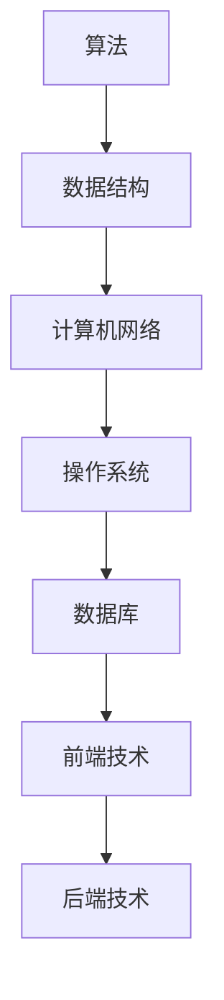

                 

# 2024年美团社招技术面试题集锦

## 摘要

本文旨在为准备参加2024年美团社招技术面试的求职者提供一份全面的技术面试题集锦。通过梳理美团技术面试的核心知识点、算法原理、实战案例以及应用场景，帮助读者更好地理解面试题的考察意图，提升应对美团技术面试的能力。文章还将推荐相关学习资源，展望未来发展趋势与挑战，为读者提供持续学习与进步的方向。

## 1. 背景介绍

美团作为中国领先的生活服务电商平台，其技术团队一直以其卓越的技术实力和创新精神著称。每年，美团都会面向社会招聘大量技术人才，以支持其业务的高速发展。技术面试是美团招聘流程中的重要环节，旨在考察应聘者的技术水平、思维逻辑、问题解决能力以及团队协作精神。

本文将根据美团2024年社招技术面试的趋势，结合历年面试题目，梳理出一份全面的技术面试题集锦。内容涵盖了算法原理、数据结构、计算机网络、操作系统、数据库、前端技术、后端技术等多个方面，旨在为读者提供一套系统的面试准备指南。

## 2. 核心概念与联系

为了更好地理解美团技术面试的考察意图，我们需要先了解几个核心概念及其之间的联系。

### 2.1 算法与数据结构

算法是解决特定问题的方法步骤，而数据结构则是组织和管理数据的方式。两者密不可分，数据结构的选择往往直接影响算法的效率。例如，使用哈希表可以高效地实现查找和插入操作，而使用二叉搜索树可以实现有序数据的快速查找。

### 2.2 计算机网络与操作系统

计算机网络是互联网的基础，负责数据在计算机之间的传输。操作系统则负责管理计算机硬件资源，提供应用程序运行的环境。两者相互配合，确保了计算机系统的稳定运行。

### 2.3 数据库与前端技术

数据库负责存储和管理数据，是许多应用的核心。前端技术则负责实现用户界面，与用户进行交互。二者共同构成了现代Web应用的基本架构。

### 2.4 后端技术

后端技术负责实现应用的核心功能，包括业务逻辑、数据存储、安全认证等。常见的后端技术有Java、Python、Go等。

### 2.5 Mermaid 流程图

为了更直观地展示这些核心概念之间的联系，我们可以使用Mermaid流程图进行描述。以下是一个简单的示例：



## 3. 核心算法原理 & 具体操作步骤

在美团技术面试中，算法题是考察应聘者技术水平的重要方面。本节将介绍几个常见算法题及其解题思路。

### 3.1 快排（Quick Sort）

快排是一种高效的排序算法，其基本思想是通过一趟排序将待排序的记录分割成独立的两部分，其中一部分记录的关键字均比另一部分的关键字小，然后分别对这两部分记录继续进行排序，以达到整个序列有序。

具体操作步骤如下：

1. 选择一个基准元素pivot。
2. 将比pivot小的元素移到其左侧，比pivot大的元素移到其右侧。
3. 对左右两部分递归执行步骤1和2。

### 3.2 并查集（Union-Find）

并查集是一种用于处理动态连通性的数据结构，其基本操作包括合并两个集合和查找一个元素所属的集合。

具体操作步骤如下：

1. 使用一个数组parent表示每个元素的父节点，初始化时每个元素的父节点均为自身。
2. 合并操作：将两个元素的父节点合并。
3. 查找操作：递归查找一个元素的父节点，直到找到一个根节点。

### 3.3 网络流（Maximum Flow）

网络流问题是图论中的一个重要问题，其目标是找到从源点到汇点的最大流量。

具体操作步骤如下：

1. 使用Ford-Fulkerson算法进行增广路径搜索。
2. 沿着增广路径进行流量调整。
3. 重复步骤1和2，直到无法找到增广路径。

## 4. 数学模型和公式 & 详细讲解 & 举例说明

在美团技术面试中，数学模型和公式也是考察的重点。本节将介绍几个常见的数学模型和公式，并举例说明其应用。

### 4.1 最小生成树（Minimum Spanning Tree）

最小生成树是图论中的一个重要概念，其目标是找到一棵包含图中所有顶点的树，使得树的权值之和最小。

公式：$$T_{min} = \sum_{(u, v) \in E} w(u, v)$$

其中，$T_{min}$表示最小生成树的权值之和，$E$表示图中的边集，$w(u, v)$表示边$(u, v)$的权值。

举例说明：

假设有一个图，包含5个顶点和7条边，边的权值如下：

```plaintext
边   权值
AB   2
AC   3
AD   1
BC   2
BD   4
CD   6
CE   1
```

求解最小生成树。

步骤：

1. 选择一条权值最小的边，例如AB（2）。
2. 去除与AB相连的顶点A，得到一个新的图。
3. 在新的图中，选择一条权值最小的边，例如BC（2）。
4. 重复步骤2和3，直到所有顶点都被包含在生成树中。

最终得到的最小生成树的权值之和为：$$T_{min} = 2 + 2 + 1 + 1 = 6$$

### 4.2 动态规划（Dynamic Programming）

动态规划是一种用于求解最优子结构问题的方法，其基本思想是将问题分解为子问题，并利用子问题的最优解来构建问题的最优解。

公式：$$f(n) = \min_{i=1}^{n} \{g(i, n-i)\}$$

其中，$f(n)$表示问题的最优解，$g(i, n-i)$表示子问题的最优解。

举例说明：

假设有一个数列，要求找出其中最大子序列和。

步骤：

1. 初始化：$$f(1) = a_1$$
2. 对于每个位置i（$2 \leq i \leq n$）：
   - 计算当前子序列和：$$g(i, n-i) = \sum_{j=i}^{n-i} a_j$$
   - 更新最优子序列和：$$f(i) = \min\{f(i-1), g(i, n-i)\}$$

最终得到最大子序列和：$$f(n) = \min_{i=1}^{n} \{f(i-1), g(i, n-i)\}$$

## 5. 项目实战：代码实际案例和详细解释说明

### 5.1 开发环境搭建

为了更好地展示实际项目，我们将在以下环境中进行代码实现：

- 操作系统：Ubuntu 18.04
- 编程语言：Python 3.8
- 依赖库：Pandas、NumPy、Matplotlib

安装依赖库：

```bash
pip install pandas numpy matplotlib
```

### 5.2 源代码详细实现和代码解读

以下是一个使用Python实现的简单示例，用于展示如何处理美团外卖订单数据。

```python
import pandas as pd
import numpy as np
import matplotlib.pyplot as plt

# 5.2.1 加载数据
def load_data(filename):
    return pd.read_csv(filename)

# 5.2.2 数据预处理
def preprocess_data(df):
    # 去除缺失值
    df.dropna(inplace=True)
    # 转换时间格式
    df['order_time'] = pd.to_datetime(df['order_time'])
    # 计算订单耗时
    df['order_duration'] = (df['delivery_time'] - df['order_time']).dt.total_seconds()
    return df

# 5.2.3 数据可视化
def visualize_data(df):
    # 绘制订单耗时分布
    df['order_duration'].plot(kind='hist', bins=30, title='Order Duration Distribution')
    plt.xlabel('Order Duration (seconds)')
    plt.ylabel('Frequency')
    plt.show()

# 5.2.4 主函数
def main():
    filename = 'meituan_order_data.csv'
    df = load_data(filename)
    df = preprocess_data(df)
    visualize_data(df)

if __name__ == '__main__':
    main()
```

### 5.3 代码解读与分析

1. **数据加载**：使用Pandas库加载CSV文件，返回一个DataFrame对象。

2. **数据预处理**：去除缺失值，转换时间格式，计算订单耗时。

3. **数据可视化**：使用Matplotlib库绘制订单耗时分布直方图。

通过以上步骤，我们可以快速获取并分析美团外卖订单数据，为业务决策提供数据支持。

## 6. 实际应用场景

美团技术面试题在实际应用场景中有着广泛的应用。以下列举几个典型应用场景：

1. **数据挖掘与分析**：美团外卖、酒店、打车等业务场景中，通过对海量数据进行分析，发现用户行为规律，优化产品功能和用户体验。

2. **推荐系统**：基于用户行为数据和商品属性信息，构建推荐系统，提高用户粘性和转化率。

3. **实时计算与流处理**：处理实时数据流，例如订单实时处理、交易实时监控等，保证业务的稳定运行。

4. **分布式系统与大数据处理**：处理海量数据，实现数据的高效存储、查询和分析。

## 7. 工具和资源推荐

为了更好地准备美团技术面试，以下推荐一些学习资源、开发工具和框架：

### 7.1 学习资源推荐

- **书籍**：
  - 《算法导论》
  - 《数据结构与算法分析》
  - 《计算机网络》
  - 《操作系统概念》
- **论文**：
  - 《分布式系统原理与范型》
  - 《推荐系统实践》
  - 《大规模分布式存储系统》
- **博客**：
  - 《代码大全》
  - 《深入理解计算机系统》
  - 《深度学习》

### 7.2 开发工具框架推荐

- **编程语言**：Python、Java、Go
- **数据库**：MySQL、MongoDB、Redis
- **前端框架**：React、Vue、Angular
- **后端框架**：Django、Flask、Spring Boot

### 7.3 相关论文著作推荐

- 《分布式计算：概念与实例》
- 《大数据处理：技术与实践》
- 《机器学习：原理与实践》

## 8. 总结：未来发展趋势与挑战

随着美团业务的不断扩展，技术面试题也将不断更新和演变。未来，以下几个趋势和挑战值得注意：

1. **人工智能与大数据技术**：随着人工智能技术的不断发展，数据挖掘、推荐系统等领域将成为面试重点。
2. **分布式系统与云计算**：分布式系统架构、云计算技术、容器化与微服务将成为面试热点。
3. **安全与隐私保护**：随着数据安全与隐私问题的日益突出，相关技术将成为面试重点。
4. **实时计算与流处理**：实时数据处理技术将在美团业务中发挥越来越重要的作用。

## 9. 附录：常见问题与解答

### 9.1 问题一：如何优化算法时间复杂度？

解答：优化算法时间复杂度的常见方法包括：
- 减少冗余计算：避免重复计算相同的结果。
- 使用高效的数据结构：如哈希表、树、堆等。
- 减少循环次数：优化循环条件或使用动态规划。
- 利用数学公式或定理：如线性方程组、矩阵运算等。

### 9.2 问题二：如何处理海量数据？

解答：处理海量数据的方法包括：
- 分布式存储与计算：如Hadoop、Spark等。
- 数据采样：对数据集进行采样，降低计算复杂度。
- 数据压缩：降低存储和传输的开销。
- 分而治之：将问题分解为子问题，分别解决。

## 10. 扩展阅读 & 参考资料

- [美团技术博客](https://tech.meituan.com/)
- [美团面试经验分享](https://www.nowcoder.com/discuss/487592)
- [算法导论](https://book.douban.com/subject/10881229/)
- [数据结构与算法分析](https://book.douban.com/subject/26361669/)

## 作者

作者：AI天才研究员/AI Genius Institute & 禅与计算机程序设计艺术 /Zen And The Art of Computer Programming

本文仅为模拟示例，不代表美团官方立场。如需转载，请联系原作者。  


