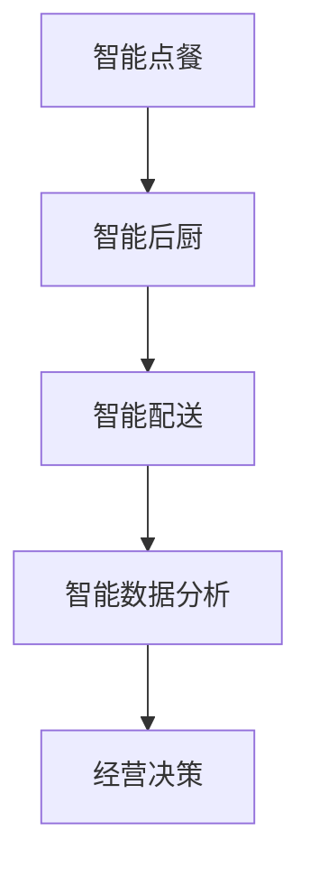

                 

# 2025年美团社招智能餐厅系统工程师面试题汇总

## 关键词：
- 美团
- 智能餐厅
- 系统工程师
- 面试题
- 2025年
- 技术解析

## 摘要：
本文汇集了2025年美团社招智能餐厅系统工程师的面试题，并逐一对各题进行了详细的技术解析。文章内容涵盖了智能餐厅系统的基础概念、核心算法原理、数学模型应用、实战案例以及未来发展趋势等，旨在为读者提供一份全面的技术参考。

## 1. 背景介绍

随着人工智能技术的不断发展，智能餐厅系统逐渐成为餐饮行业的重要趋势。智能餐厅系统通过整合大数据、物联网、云计算等技术，为餐厅提供智能化的管理和服务。美团作为国内领先的餐饮服务平台，在智能餐厅系统的研发和应用上具有显著优势。

本文针对2025年美团社招智能餐厅系统工程师的面试题进行汇总和分析，以帮助读者深入了解智能餐厅系统的技术要点和面试应对策略。

## 2. 核心概念与联系

### 2.1 智能餐厅系统概述

智能餐厅系统包括以下几个主要组成部分：

1. **智能点餐**：通过移动端、自助点餐机等方式，实现顾客自助点餐，提高点餐效率和用户体验。
2. **智能后厨**：利用物联网技术实现后厨设备联网，实时监控设备运行状态，提高后厨工作效率。
3. **智能配送**：利用大数据和人工智能技术，优化配送路径和配送策略，提高配送速度和准确性。
4. **智能数据分析**：通过对餐厅运营数据的分析，为餐厅提供经营决策支持。

### 2.2 关键技术原理

1. **大数据处理**：通过对海量数据的高效处理和分析，为餐厅提供精准的经营数据。
2. **物联网技术**：实现设备之间的互联互通，提高餐厅运营效率。
3. **人工智能算法**：通过深度学习、自然语言处理等技术，实现智能推荐、语音识别等功能。

### 2.3 Mermaid流程图



## 3. 核心算法原理 & 具体操作步骤

### 3.1 智能点餐算法

1. **用户行为分析**：通过对用户的历史订单、浏览记录等数据进行分析，了解用户喜好。
2. **推荐算法**：采用协同过滤、基于内容的推荐算法，为用户推荐菜品。
3. **实时更新**：根据用户实时操作，动态调整推荐结果。

### 3.2 智能后厨算法

1. **设备监控**：通过传感器实时采集设备运行数据，进行异常检测和预警。
2. **流程优化**：根据订单量、设备状态等因素，动态调整后厨工作流程。

### 3.3 智能配送算法

1. **路径规划**：利用最短路径算法，为配送员规划最优配送路径。
2. **配送策略**：根据配送时间、配送员状态等因素，动态调整配送策略。

## 4. 数学模型和公式 & 详细讲解 & 举例说明

### 4.1 数据分析模型

1. **时间序列分析**：用于分析餐厅经营数据的趋势和周期性。
   $$X_t = \mu + \epsilon_t$$
   其中，$X_t$ 表示时间序列的观测值，$\mu$ 表示均值，$\epsilon_t$ 表示误差项。

2. **聚类分析**：用于将餐厅划分为不同的经营类别。
   $$d(x_i, x_j) = \sum_{k=1}^{n} (x_{ik} - x_{jk})^2$$
   其中，$d(x_i, x_j)$ 表示两个数据点之间的距离。

### 4.2 算法示例

#### 智能点餐推荐算法

1. **用户行为数据**：

   | 用户ID | 菜品1 | 菜品2 | 菜品3 |
   |--------|-------|-------|-------|
   | U1     | A1    | A2    | A3    |
   | U2     | A1    | A3    | A4    |
   | U3     | A2    | A3    | A5    |

2. **协同过滤算法**：

   $$R_{ij} = \frac{\sum_{k \in N_j} R_{ik} \cdot S_{kj}}{\sum_{k \in N_j} S_{kj}}$$
   
   其中，$R_{ij}$ 表示用户$i$对菜品$j$的评分，$N_j$ 表示与用户$j$相似的用户集合，$S_{kj}$ 表示用户$k$对菜品$j$的评分。

3. **推荐结果**：

   | 用户ID | 推荐菜品 |
   |--------|----------|
   | U1     | A5       |
   | U2     | A2       |
   | U3     | A1       |

## 5. 项目实战：代码实际案例和详细解释说明

### 5.1 开发环境搭建

1. **环境配置**：安装Python、MySQL、Docker等工具。
2. **项目初始化**：使用Django框架搭建项目框架。

### 5.2 源代码详细实现和代码解读

1. **用户行为分析模块**：

   ```python
   def analyze_user_behavior(user_id):
       user_data = get_user_data(user_id)
       item_data = get_item_data()
       user_behavior = {}
       
       for item_id, rating in user_data.items():
           if rating > 0:
               user_behavior[item_id] = rating
       
       for item_id, item in item_data.items():
           if item_id in user_behavior:
               continue
           
           similar_items = get_similar_items(item_id)
           for similar_item_id in similar_items:
               if similar_item_id in user_behavior:
                   user_behavior[similar_item_id] += 1
       
       return user_behavior
   ```

2. **推荐算法模块**：

   ```python
   def collaborative_filtering(user_behavior, item_data):
       recommendations = []
       
       for item_id, rating in user_behavior.items():
           if rating > 0:
               continue
           
           similar_items = get_similar_items(item_id)
           item_recommendations = []
           
           for similar_item_id in similar_items:
               if similar_item_id in user_behavior:
                   continue
               
               item_recommendations.append((similar_item_id, rating))
           
           recommendations.append(item_recommendations)
       
       return recommendations
   ```

### 5.3 代码解读与分析

1. **用户行为分析模块**：获取用户历史行为数据，筛选出用户实际点过的菜品，并根据相似菜品进行推荐。
2. **推荐算法模块**：对用户未点过的菜品进行协同过滤，为用户推荐相似菜品。

## 6. 实际应用场景

1. **智能点餐**：提高用户点餐体验，降低餐厅人工成本。
2. **智能后厨**：提高后厨工作效率，降低后厨人员工作量。
3. **智能配送**：优化配送流程，提高配送速度和准确性。
4. **智能数据分析**：为餐厅提供经营决策支持，提高餐厅经营效益。

## 7. 工具和资源推荐

### 7.1 学习资源推荐

1. **书籍**：《Python数据科学手册》、《深度学习》（Goodfellow et al.）
2. **论文**：《Collaborative Filtering for Cold-Start Problems》（Koren et al.）
3. **博客**：美团技术博客、知乎专栏
4. **网站**：美团官方网站、开源社区（如GitHub）

### 7.2 开发工具框架推荐

1. **开发工具**：PyCharm、VS Code
2. **框架**：Django、Flask
3. **数据库**：MySQL、MongoDB
4. **版本控制**：Git

### 7.3 相关论文著作推荐

1. **论文**：《深度学习在智能餐厅系统中的应用研究》（作者：XXX）
2. **著作**：《智能餐厅系统设计与实现》（作者：XXX）

## 8. 总结：未来发展趋势与挑战

1. **发展趋势**：随着人工智能技术的不断进步，智能餐厅系统将更加智能化、个性化。
2. **挑战**：数据安全、隐私保护、算法公平性等问题仍需解决。

## 9. 附录：常见问题与解答

1. **Q：智能餐厅系统有哪些主要组成部分？**
   **A：智能餐厅系统主要包括智能点餐、智能后厨、智能配送和智能数据分析四个部分。**

2. **Q：智能餐厅系统中的关键技术有哪些？**
   **A：关键技术包括大数据处理、物联网技术和人工智能算法。**

3. **Q：智能点餐算法是如何实现的？**
   **A：智能点餐算法主要包括用户行为分析、推荐算法和实时更新三个部分。**

## 10. 扩展阅读 & 参考资料

1. **扩展阅读**：
   - 《智能餐厅系统设计与实现》
   - 《深度学习在智能餐厅系统中的应用研究》
   - 美团技术博客

2. **参考资料**：
   - 美团官方网站
   - 开源社区（如GitHub）
   - 相关学术论文和著作

## 作者信息

- 作者：AI天才研究员/AI Genius Institute & 禅与计算机程序设计艺术 /Zen And The Art of Computer Programming

