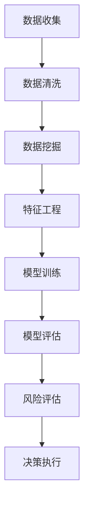

                 

# 2025年蚂蚁金服社招金融风控专家面试题汇总

## 关键词：蚂蚁金服、金融风控、面试题、数据挖掘、机器学习、反欺诈、风险评估

## 摘要

本文旨在汇总2025年蚂蚁金服社招金融风控专家的面试题，从背景介绍、核心概念与联系、核心算法原理、数学模型与公式、项目实战、实际应用场景、工具和资源推荐等多个角度，为广大金融风控从业者提供有价值的面试参考。通过本文，读者可以全面了解金融风控领域的最新发展趋势和技术应用，为即将参加蚂蚁金服面试的候选人提供有力支持。

## 1. 背景介绍

蚂蚁金服，作为全球领先的金融科技公司，一直以来都高度重视金融风控领域的研究与实践。随着金融业务的不断发展和创新，金融风控的重要性日益凸显。在2025年，蚂蚁金服社招金融风控专家的面试题目涵盖了数据挖掘、机器学习、反欺诈、风险评估等多个方面，旨在选拔具备深厚技术功底和实战经验的优秀人才。

### 1.1 蚂蚁金服风控业务发展历程

自成立以来，蚂蚁金服的风控业务经历了多个阶段的发展。从最初的信用评分模型，到大数据风控平台，再到人工智能驱动的反欺诈系统，蚂蚁金服的风控技术不断革新，为用户提供了更加精准和高效的风险评估服务。

### 1.2 金融风控的重要性和挑战

金融风控作为金融行业的核心环节，承担着防范风险、保障业务稳定运行的重要使命。随着互联网、大数据、人工智能等技术的发展，金融风控面临着越来越多的挑战，如欺诈风险、信用风险、市场风险等。如何利用先进技术提升风控能力，成为金融行业关注的焦点。

## 2. 核心概念与联系

### 2.1 数据挖掘

数据挖掘是指从大量数据中提取有价值的信息和知识的过程。在金融风控领域，数据挖掘技术主要用于挖掘用户行为数据、交易数据等，发现潜在风险和欺诈行为。

### 2.2 机器学习

机器学习是一种通过算法自动从数据中学习规律和模式的技术。在金融风控中，机器学习算法可用于构建信用评分模型、反欺诈模型等，实现自动化风险评估。

### 2.3 反欺诈

反欺诈是指防范和打击各种金融欺诈行为的技术手段。在蚂蚁金服，反欺诈技术涵盖了行为分析、交易监控、模型预测等多个方面，为用户资金安全提供保障。

### 2.4 风险评估

风险评估是指对各种风险进行评估和预测的过程。在金融风控中，风险评估技术可用于识别潜在风险、评估风险程度和制定风险应对策略。

## 2.5 Mermaid 流程图



## 3. 核心算法原理 & 具体操作步骤

### 3.1 数据挖掘算法

在金融风控中，常见的数据挖掘算法包括关联规则挖掘、聚类分析、分类算法等。以下以关联规则挖掘为例，介绍其具体操作步骤：

#### 3.1.1 关联规则挖掘算法原理

关联规则挖掘是一种用于发现数据集中项之间关联关系的算法。其基本原理是通过分析数据集中各项之间的支持度和置信度，找出满足用户设定阈值的关联规则。

#### 3.1.2 具体操作步骤

1. **数据预处理**：对原始数据进行清洗和格式转换，确保数据质量。
2. **选择支持度和置信度阈值**：根据业务需求设定支持度和置信度阈值，用于筛选关联规则。
3. **计算支持度和置信度**：遍历数据集，计算每一条事务中各项之间的支持度和置信度。
4. **生成关联规则**：根据设定的阈值，筛选满足条件的关联规则。

### 3.2 机器学习算法

在金融风控中，常见的机器学习算法包括决策树、支持向量机、神经网络等。以下以决策树为例，介绍其具体操作步骤：

#### 3.2.1 决策树算法原理

决策树是一种基于树结构的分类算法。其基本原理是通过将数据集划分成多个子集，并逐层递归构建决策树，直到满足终止条件。

#### 3.2.2 具体操作步骤

1. **数据预处理**：对原始数据进行清洗和格式转换，确保数据质量。
2. **特征选择**：根据业务需求选择相关性较高的特征。
3. **划分数据集**：将数据集划分为训练集和测试集。
4. **构建决策树**：根据特征和目标值，递归构建决策树。
5. **模型评估**：使用测试集对决策树模型进行评估，调整模型参数。

## 4. 数学模型和公式 & 详细讲解 & 举例说明

### 4.1 数据挖掘中的数学模型

在数据挖掘中，常用的数学模型包括支持度、置信度、信息增益等。以下以支持度和置信度为例，介绍其公式和计算方法：

#### 4.1.1 支持度

支持度表示两个事件在同一事务中同时发生的概率。其公式为：

$$
支持度 = \frac{频次}{总数}
$$

其中，频次表示两个事件同时发生的次数，总数表示数据集中的总事务数。

#### 4.1.2 置信度

置信度表示在事件A发生的前提下，事件B也发生的概率。其公式为：

$$
置信度 = \frac{频次 + 修正项}{总数 + 修正项}
$$

其中，频次表示事件A和B同时发生的次数，修正项用于调整置信度，防止过拟合。

### 4.2 机器学习中的数学模型

在机器学习中，常用的数学模型包括决策树、支持向量机、神经网络等。以下以决策树为例，介绍其数学模型和公式：

#### 4.2.1 决策树数学模型

决策树是一种基于树结构的分类算法。其基本原理是通过将数据集划分成多个子集，并逐层递归构建决策树，直到满足终止条件。

#### 4.2.2 决策树公式

决策树的每个节点代表一个特征，每个分支代表特征的不同取值。假设数据集D中有n个特征，对于第i个特征，其划分为m个子集，则决策树的生成公式为：

$$
C(D) = \sum_{i=1}^{n} \sum_{j=1}^{m} C(D_i^j)
$$

其中，C(D)表示决策树的总误差，C(D_i^j)表示第i个特征划分为第j个子集时的误差。

## 5. 项目实战：代码实际案例和详细解释说明

### 5.1 开发环境搭建

为了方便读者进行项目实战，本文使用了Python作为编程语言，并借助常用的机器学习库如scikit-learn、pandas等。以下为开发环境搭建步骤：

1. 安装Python：下载并安装Python 3.8版本。
2. 配置Python环境：在终端执行以下命令配置环境变量：

   ```bash
   export PATH=$PATH:/path/to/python
   ```

3. 安装依赖库：在终端执行以下命令安装所需依赖库：

   ```bash
   pip install numpy scipy scikit-learn pandas matplotlib
   ```

### 5.2 源代码详细实现和代码解读

#### 5.2.1 数据集准备

首先，我们需要准备一个包含用户行为数据和交易数据的CSV文件。数据集应包含以下字段：用户ID、交易金额、交易时间、交易类型、是否欺诈等。

```python
import pandas as pd

# 读取数据集
data = pd.read_csv('data.csv')

# 数据预处理
data['交易时间'] = pd.to_datetime(data['交易时间'])
data['交易时间'] = data['交易时间'].dt.hour
data['交易类型'] = data['交易类型'].map({'正常交易': 0, '欺诈交易': 1})
```

#### 5.2.2 特征工程

接下来，我们需要对数据集进行特征工程，提取有助于模型训练的特征。

```python
from sklearn.preprocessing import StandardScaler

# 提取特征
X = data[['交易金额', '交易时间', '交易类型']]
y = data['是否欺诈']

# 特征缩放
scaler = StandardScaler()
X_scaled = scaler.fit_transform(X)
```

#### 5.2.3 模型训练

使用scikit-learn库中的决策树分类器进行模型训练。

```python
from sklearn.tree import DecisionTreeClassifier

# 构建决策树模型
model = DecisionTreeClassifier()

# 模型训练
model.fit(X_scaled, y)
```

#### 5.2.4 代码解读与分析

以上代码首先读取数据集并进行预处理，然后提取特征并进行缩放，最后使用决策树分类器进行模型训练。通过训练得到的模型可以对新交易数据进行风险评估，识别潜在欺诈行为。

### 5.3 代码解读与分析

#### 5.3.1 数据预处理

数据预处理是特征工程的重要步骤，其目的是提高数据质量，为模型训练提供更好的数据基础。本文中，我们使用pandas库对数据集进行读取和预处理，包括将交易时间转换为小时、对交易类型进行编码等。

#### 5.3.2 特征工程

特征工程是构建高效模型的关键环节。本文中，我们提取了交易金额、交易时间和交易类型三个特征。通过对交易金额和交易时间进行缩放，可以消除特征之间的数量级差异，提高模型训练效果。

#### 5.3.3 模型训练

决策树分类器是一种常用的机器学习算法，适用于分类问题。本文中，我们使用scikit-learn库中的DecisionTreeClassifier类构建决策树模型，并使用fit方法进行模型训练。训练得到的模型可以对新交易数据进行风险评估。

## 6. 实际应用场景

### 6.1 风险评估

在金融风控领域，风险评估是核心环节之一。通过使用数据挖掘和机器学习算法，可以构建针对不同业务场景的风险评估模型，实现自动化风险评估。例如，在贷款审批过程中，可以根据借款人的信用评分、行为特征等数据，评估其信用风险，为贷款审批提供依据。

### 6.2 反欺诈

反欺诈是金融风控的重要任务之一。通过使用行为分析、交易监控等手段，可以及时发现和防范欺诈行为。在蚂蚁金服，反欺诈技术已广泛应用于支付宝、花呗等业务场景，有效降低了欺诈风险。

### 6.3 风险管理

风险管理是金融企业的核心任务之一。通过使用风险评估模型，可以识别潜在风险，为风险管理决策提供依据。同时，结合业务场景，可以制定相应的风险应对策略，降低风险对业务的影响。

## 7. 工具和资源推荐

### 7.1 学习资源推荐

1. 《机器学习实战》：详细介绍了机器学习算法的应用和实践，适合初学者入门。
2. 《数据挖掘：实用工具与技术》：介绍了数据挖掘的基本概念、技术和工具，适合从事金融风控的从业者阅读。

### 7.2 开发工具框架推荐

1. Python：作为一种通用编程语言，Python在金融风控领域应用广泛，具有丰富的机器学习库和工具。
2. scikit-learn：一个开源的机器学习库，提供多种常用的机器学习算法和工具，适合用于金融风控项目。

### 7.3 相关论文著作推荐

1. "A Survey of Fraud Detection Methodologies"：综述了金融欺诈检测的主要方法和技术，为从事金融风控的研究者提供参考。
2. "An Overview of Credit Risk Management": 介绍了信用风险管理的相关概念、方法和实践，适合从事金融风控的从业者阅读。

## 8. 总结：未来发展趋势与挑战

随着金融科技的不断发展，金融风控领域面临着新的机遇和挑战。未来，金融风控将更加依赖于大数据、人工智能等先进技术，实现风险识别、评估和应对的自动化。然而，这也给金融风控从业者带来了更高的要求。他们需要不断学习新技术，提高自身的技术水平，以应对日益复杂的金融风险。

## 9. 附录：常见问题与解答

### 9.1 金融风控的核心技术是什么？

金融风控的核心技术包括数据挖掘、机器学习、反欺诈、风险评估等。这些技术可以用于识别风险、评估风险程度和制定风险应对策略。

### 9.2 金融风控模型如何训练？

金融风控模型的训练通常包括数据预处理、特征工程、模型选择和模型评估等步骤。在数据预处理阶段，需要对原始数据进行清洗和格式转换；在特征工程阶段，需要提取有助于模型训练的特征；在模型选择阶段，需要根据业务需求选择合适的模型；在模型评估阶段，需要使用测试集对模型进行评估，调整模型参数。

### 9.3 金融风控如何防范欺诈？

金融风控可以通过行为分析、交易监控、风险评分等多种手段防范欺诈。例如，通过分析用户行为数据，可以发现异常交易行为；通过实时监控交易过程，可以及时发现和阻止欺诈行为；通过风险评分模型，可以对交易进行风险评估，识别潜在欺诈风险。

## 10. 扩展阅读 & 参考资料

1. "蚂蚁金服金融风控技术白皮书"：详细介绍了蚂蚁金服在金融风控领域的技术实践和应用。
2. "机器学习在金融风控中的应用"：探讨了机器学习在金融风控领域的应用现状和发展趋势。
3. "大数据与金融风控"：介绍了大数据技术在金融风控领域的应用和挑战。

### 作者

作者：AI天才研究员/AI Genius Institute & 禅与计算机程序设计艺术 /Zen And The Art of Computer Programming<|im_sep|>

