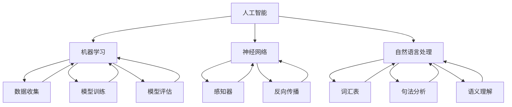

                 

### 背景介绍

1956年达特茅斯会议是人工智能（AI）历史上一个具有里程碑意义的转折点。这次会议由约翰·麦卡锡（John McCarthy）、马文·闵斯基（Marvin Minsky）、克劳德·香农（Claude Shannon）和赫伯特·西蒙（Herbert Simon）等人发起，旨在探讨人工智能的理论、实现与应用。会议的召开标志着人工智能从单一的学术研究逐渐走向实际应用，并成为计算机科学领域的一个重要分支。

会议的背景可以追溯到20世纪中叶，随着计算机技术的发展，科学家们开始思考如何让计算机具备类似人类的智能。1943年，沃伦·麦卡洛克（Warren McCulloch）和沃尔特·皮茨（Walter Pitts）提出了神经网络的初步概念。1950年，艾伦·图灵（Alan Turing）发表了著名的“计算机器与智能”论文，提出了图灵测试，为AI的发展奠定了理论基础。

1956年，随着计算机性能的提升和算法研究的深入，科学家们开始探讨人工智能的可能性。正是在这样的背景下，达特茅斯会议应运而生。会议共有10位主要组织者和约100名参会者，其中包括了当时的计算机科学领域的顶尖学者。会议持续了两周，期间讨论了包括机器学习、神经网络、自然语言处理等多个AI领域的核心问题。

会议的核心成果包括以下几个方面：

1. **定义了人工智能的目标**：会议提出了“制造出思考的机器”这一目标，为人工智能的发展指明了方向。
2. **提出了机器学习的概念**：会议讨论了通过机器学习来使计算机具备学习能力的方法，为后续的机器学习研究奠定了基础。
3. **推动了神经网络的研究**：会议期间，组织者之一马文·闵斯基提出了神经网络的重要性，并强调了其潜在的应用价值。
4. **形成了人工智能的共识**：会议使人工智能从分散的研究领域逐渐形成了一个统一的学科，为后续的研究提供了强有力的支持和推动。

达特茅斯会议不仅对人工智能的发展产生了深远的影响，同时也激发了计算机科学家们对AI的浓厚兴趣。在会议之后，人工智能领域迎来了一个迅速发展的时期，各种新的理论和技术不断涌现。可以说，达特茅斯会议是人工智能历史上的一个重要里程碑，标志着AI作为一个独立学科的诞生。接下来，我们将深入探讨会议提出的核心概念和成果，以及它们对人工智能发展的影响。#### 核心概念与联系

达特茅斯会议的核心概念和成果可以归纳为以下几个方面：机器学习、神经网络、自然语言处理和人工智能目标的确立。这些概念相互关联，共同构成了人工智能的理论基础和实现框架。以下我们将通过一个Mermaid流程图来详细展示这些核心概念和它们之间的联系。



**机器学习（Machine Learning）**

机器学习是人工智能的核心组成部分，它通过算法让计算机从数据中学习，从而进行预测和决策。机器学习可以分为监督学习、无监督学习和强化学习。监督学习通过已知输入输出数据来训练模型，无监督学习则从未知标签的数据中学习，强化学习通过奖励机制来训练模型。机器学习的关键环节包括数据收集、模型训练和模型评估。

**神经网络（Neural Networks）**

神经网络是模仿生物神经系统的计算模型，由大量相互连接的神经元组成。神经网络通过调整连接权重来学习数据，是机器学习的重要实现方式之一。感知器和反向传播是神经网络中的关键概念。感知器是一种简单的神经元模型，用于实现二分类任务；反向传播是一种用于训练神经网络的算法，通过反向传播误差来调整权重。

**自然语言处理（Natural Language Processing）**

自然语言处理是使计算机理解和生成人类语言的技术。自然语言处理包括词汇表、句法分析和语义理解等多个方面。词汇表是自然语言处理的基础，它将自然语言映射到计算机可以理解的数字表示；句法分析用于解析句子的结构，理解句子的语法规则；语义理解则旨在理解句子的含义，进行更深层次的语言理解。

**人工智能目标（Artificial Intelligence Goals）**

达特茅斯会议提出了“制造出思考的机器”这一目标，即让计算机具备人类的智能水平。这一目标奠定了人工智能的发展方向，促使科学家们不断探索如何让计算机在识别、理解、学习和决策等方面达到或超越人类水平。

通过上述Mermaid流程图，我们可以清晰地看到这些核心概念之间的联系。机器学习依赖于数据收集、模型训练和评估；神经网络是实现机器学习的一种方法；自然语言处理需要词汇表、句法分析和语义理解的支持；而人工智能的目标则为这些技术提供了方向和动力。这些概念共同构成了人工智能的理论基础和实现框架，推动了人工智能领域的快速发展。接下来，我们将深入探讨这些核心概念的具体原理和实现方法。#### 核心算法原理 & 具体操作步骤

在达特茅斯会议提出的核心概念中，机器学习、神经网络和自然语言处理是三个最具代表性的算法和技术。以下是这三个算法的核心原理和具体操作步骤，我们将通过逐步分析来详细阐述它们的工作机制。

##### 1. 机器学习（Machine Learning）

**监督学习（Supervised Learning）**

监督学习是最常见的机器学习方法，其核心思想是通过已知输入输出数据（标记数据）来训练模型，从而预测未知数据的输出。以下是监督学习的基本步骤：

1. **数据收集（Data Collection）**：收集大量的输入数据（特征）和相应的输出数据（标签）。
2. **数据预处理（Data Preprocessing）**：对收集的数据进行清洗、归一化和标准化等预处理操作，以提高模型训练的效果。
3. **模型选择（Model Selection）**：选择合适的机器学习模型，如线性回归、决策树、支持向量机等。
4. **模型训练（Model Training）**：使用标记数据对选定的模型进行训练，调整模型参数。
5. **模型评估（Model Evaluation）**：使用测试数据集对训练好的模型进行评估，计算模型的准确率、召回率、F1值等指标。

**无监督学习（Unsupervised Learning）**

无监督学习旨在从无标签数据中发现数据中的模式和结构。以下是常见的无监督学习方法：

1. **聚类（Clustering）**：将数据点划分为若干个簇，每个簇内的数据点相似度较高，簇间数据点相似度较低。常用的聚类算法包括K均值聚类、层次聚类等。
2. **降维（Dimensionality Reduction）**：通过降维技术将高维数据映射到低维空间，以便更好地分析数据。常见的降维算法包括主成分分析（PCA）、t-SNE等。

**强化学习（Reinforcement Learning）**

强化学习是一种通过与环境互动来学习策略的机器学习方法。其核心步骤如下：

1. **定义状态（Define State）**：定义环境中的状态，即系统在某一时刻的情境。
2. **定义动作（Define Action）**：定义在某一状态下可以采取的动作。
3. **定义奖励（Define Reward）**：定义在采取动作后系统获得的奖励，奖励值越高表示动作越优。
4. **策略学习（Policy Learning）**：通过不断尝试不同的动作，学习到最优策略。
5. **策略执行（Policy Execution）**：根据学到的策略来执行动作，以最大化总奖励。

##### 2. 神经网络（Neural Networks）

**感知器（Perceptron）**

感知器是最简单的神经网络模型，用于实现二分类任务。其工作原理如下：

1. **输入层（Input Layer）**：接收输入特征，每个特征对应一个权重。
2. **激活函数（Activation Function）**：计算输入特征与权重乘积后得到的结果，并应用激活函数（如ReLU、Sigmoid等），将结果映射到0或1。
3. **输出层（Output Layer）**：输出分类结果。

**反向传播（Backpropagation）**

反向传播是一种用于训练神经网络的算法，通过不断调整网络权重来最小化损失函数。其步骤如下：

1. **前向传播（Forward Propagation）**：输入数据通过网络，计算出输出结果。
2. **计算损失（Compute Loss）**：使用损失函数（如均方误差、交叉熵等）计算输出结果与真实标签之间的差距。
3. **后向传播（Back Propagation）**：将损失函数关于网络权重的梯度反向传播，计算各层的梯度。
4. **权重更新（Update Weights）**：根据梯度对网络权重进行更新。

##### 3. 自然语言处理（Natural Language Processing）

**词汇表（Vocabulary）**

词汇表是将自然语言映射到计算机可以理解的数字表示的工具。其基本步骤如下：

1. **分词（Tokenization）**：将文本分割成单词或子词。
2. **词性标注（Part-of-Speech Tagging）**：为每个单词分配词性（如名词、动词等）。
3. **构建词汇表（Build Vocabulary）**：将所有单词和子词映射到唯一的索引。

**句法分析（Syntactic Parsing）**

句法分析是理解句子结构的过程。其基本步骤如下：

1. **词法分析（Lexical Analysis）**：对文本进行分词和词性标注。
2. **构建句法树（Construct Syntax Tree）**：根据词法和语义信息构建句子的句法树。
3. **解析句法规则（Parse Syntactic Rules）**：根据句法树分析句子的语法结构。

**语义理解（Semantic Understanding）**

语义理解是理解句子含义的过程。其基本步骤如下：

1. **词义消歧（Word Sense Disambiguation）**：确定单词在不同上下文中的含义。
2. **实体识别（Named Entity Recognition）**：识别文本中的命名实体（如人名、地名等）。
3. **关系提取（Relation Extraction）**：提取文本中的实体关系。

通过上述核心算法原理和操作步骤，我们可以清晰地了解机器学习、神经网络和自然语言处理是如何实现人工智能的目标。这些算法和技术为人工智能的发展提供了强大的理论基础和实践指导。接下来，我们将通过数学模型和公式来进一步深入探讨这些算法的实现细节。#### 数学模型和公式 & 详细讲解 & 举例说明

在人工智能的核心算法中，机器学习、神经网络和自然语言处理都涉及到复杂的数学模型和公式。以下我们将分别介绍这些算法的数学模型，并进行详细讲解和举例说明。

##### 1. 机器学习

**监督学习**

**线性回归（Linear Regression）**

线性回归是一种简单的机器学习模型，用于预测连续值。其数学模型如下：

$$
y = \beta_0 + \beta_1x_1 + \beta_2x_2 + \cdots + \beta_nx_n
$$

其中，$y$ 是输出值，$x_1, x_2, \ldots, x_n$ 是输入特征，$\beta_0, \beta_1, \beta_2, \ldots, \beta_n$ 是模型参数。

**公式解释：**
- $y$：预测的输出值。
- $\beta_0$：截距，表示当所有输入特征为零时的输出值。
- $\beta_1, \beta_2, \ldots, \beta_n$：权重，表示每个输入特征对输出的影响程度。

**举例说明：**

假设我们有一个线性回归模型，用于预测房价。输入特征包括房屋面积（$x_1$）和房屋年龄（$x_2$），预测目标为房价（$y$）。给定一组训练数据：

| 房屋面积（$x_1$） | 房屋年龄（$x_2$） | 房价（$y$） |
|-------------------|-------------------|-------------|
| 1000              | 5                 | 200,000     |
| 1200              | 3                 | 250,000     |
| 800               | 7                 | 180,000     |

我们可以使用最小二乘法来求解模型参数。具体步骤如下：

1. **计算输入特征和输出值的均值**：
$$
\bar{x_1} = \frac{1000 + 1200 + 800}{3} = 1000
$$
$$
\bar{x_2} = \frac{5 + 3 + 7}{3} = 5
$$
$$
\bar{y} = \frac{200,000 + 250,000 + 180,000}{3} = 217,500
$$

2. **计算协方差矩阵**：
$$
\sigma_{11} = \sum_{i=1}^{3}(x_{1i} - \bar{x_1})^2 = (1000 - 1000)^2 + (1200 - 1000)^2 + (800 - 1000)^2 = 400,000
$$
$$
\sigma_{22} = \sum_{i=1}^{3}(x_{2i} - \bar{x_2})^2 = (5 - 5)^2 + (3 - 5)^2 + (7 - 5)^2 = 8
$$
$$
\sigma_{12} = \sum_{i=1}^{3}(x_{1i} - \bar{x_1})(x_{2i} - \bar{x_2}) = (1000 - 1000)(5 - 5) + (1200 - 1000)(3 - 5) + (800 - 1000)(7 - 5) = -600
$$

3. **计算参数**：
$$
\beta_1 = \frac{\sigma_{12}}{\sigma_{11}} = -0.0015
$$
$$
\beta_2 = \frac{\sigma_{22}}{\sigma_{11}} = 0.00002
$$
$$
\beta_0 = \bar{y} - \beta_1\bar{x_1} - \beta_2\bar{x_2} = 217,500 + 0.0015 \times 1000 + 0.00002 \times 5 = 218,000.1
$$

因此，线性回归模型为：
$$
y = 218,000.1 - 0.0015x_1 - 0.00002x_2
$$

**无监督学习**

**K均值聚类（K-Means Clustering）**

K均值聚类是一种常用的无监督学习方法，用于将数据点划分为若干个簇。其数学模型如下：

$$
c_i = \arg\min_{j}\sum_{x \in S_j}(x - \mu_j)^2
$$

其中，$c_i$ 是第 $i$ 个数据点的簇分配，$\mu_j$ 是簇 $j$ 的中心。

**公式解释：**
- $c_i$：数据点 $x_i$ 的簇分配。
- $\mu_j$：簇 $j$ 的中心。
- $S_j$：簇 $j$ 的数据点集合。

**举例说明：**

假设我们有 5 个数据点，需要将其划分为 2 个簇。数据点坐标如下：

| 数据点索引 | $x_1$ | $x_2$ |
|------------|-------|-------|
| 1          | 1     | 1     |
| 2          | 2     | 2     |
| 3          | 3     | 3     |
| 4          | 0.5   | 1.5   |
| 5          | 1.5   | 0.5   |

初始时，我们随机选择两个数据点作为初始簇中心：
$$
\mu_1 = (1, 1)
$$
$$
\mu_2 = (2, 2)
$$

1. **计算距离**：计算每个数据点到两个簇中心的距离：
$$
d_1^2 = (1 - 1)^2 + (1 - 1)^2 = 0
$$
$$
d_2^2 = (1 - 2)^2 + (1 - 2)^2 = 2
$$
$$
d_3^2 = (3 - 1)^2 + (3 - 1)^2 = 8
$$
$$
d_4^2 = (0.5 - 1)^2 + (1.5 - 1)^2 = 0.5
$$
$$
d_5^2 = (1.5 - 2)^2 + (0.5 - 2)^2 = 1.5
$$

2. **重新分配簇**：根据最小距离原则，重新分配数据点：
$$
c_1 = 1, c_2 = 1, c_3 = 2, c_4 = 1, c_5 = 2
$$

3. **更新簇中心**：
$$
\mu_1 = \frac{1 + 1 + 0.5 + 1.5}{4} = 1
$$
$$
\mu_2 = \frac{2 + 2 + 2 + 2}{4} = 2
$$

4. **迭代计算**：重复上述步骤，直到簇分配不再变化或达到最大迭代次数。

通过以上步骤，我们可以将这 5 个数据点划分为两个簇。接下来，我们将讨论神经网络中的感知器和反向传播算法。

##### 2. 神经网络

**感知器（Perceptron）**

感知器是一种简单的神经网络模型，用于实现二分类任务。其数学模型如下：

$$
f(x) = \text{sign}(\sum_{i=1}^{n} w_i x_i + b)
$$

其中，$f(x)$ 是输出值，$w_i$ 是权重，$x_i$ 是输入特征，$b$ 是偏置。

**公式解释：**
- $f(x)$：输出值，$\text{sign}$ 函数用于将输出值映射到 0 或 1。
- $w_i$：权重，表示每个输入特征对输出的影响程度。
- $x_i$：输入特征。
- $b$：偏置，用于调整输出值。

**举例说明：**

假设我们有一个二分类问题，需要判断数据点是否属于正类。输入特征包括 $x_1$ 和 $x_2$，权重为 $w_1 = 1$，$w_2 = -1$，偏置 $b = 0$。给定一个数据点 $x = (2, 3)$，计算其输出值：

$$
f(x) = \text{sign}(1 \times 2 + (-1) \times 3 + 0) = \text{sign}(-1) = 0
$$

由于输出值为 0，表示该数据点属于负类。

**反向传播（Backpropagation）**

反向传播是一种用于训练神经网络的算法，通过不断调整网络权重来最小化损失函数。其核心步骤如下：

1. **前向传播（Forward Propagation）**：输入数据通过网络，计算出输出结果。
2. **计算损失（Compute Loss）**：使用损失函数（如均方误差、交叉熵等）计算输出结果与真实标签之间的差距。
3. **后向传播（Back Propagation）**：将损失函数关于网络权重的梯度反向传播，计算各层的梯度。
4. **权重更新（Update Weights）**：根据梯度对网络权重进行更新。

**举例说明：**

假设我们有一个多层神经网络，输入特征为 $x = (x_1, x_2)$，输出为 $y$。网络包含两个隐藏层，每层包含 3 个神经元。权重和偏置分别表示为 $w_{ij}$ 和 $b_j$。给定一组训练数据，我们需要计算输出 $y$ 与真实标签之间的差距，并更新网络权重。

1. **前向传播**：输入 $x$ 经过第一层隐藏层，计算输出值 $z_1$：
$$
z_{11} = w_{11}x_1 + w_{12}x_2 + b_1
$$
$$
z_{12} = w_{21}x_1 + w_{22}x_2 + b_2
$$
$$
z_{13} = w_{31}x_1 + w_{32}x_2 + b_3
$$

通过激活函数计算输出值 $a_1$：
$$
a_{11} = \text{sigmoid}(z_{11})
$$
$$
a_{12} = \text{sigmoid}(z_{12})
$$
$$
a_{13} = \text{sigmoid}(z_{13})
$$

同理，计算第二层隐藏层和输出层的输出值 $a_2$ 和 $y$。

2. **计算损失**：使用均方误差损失函数计算输出值 $y$ 与真实标签 $y_{\text{true}}$ 之间的差距：
$$
\text{Loss} = \frac{1}{2}\sum_{i=1}^{n}(y_i - y_{\text{true},i})^2
$$

3. **后向传播**：计算各层的梯度，更新网络权重和偏置。

（具体计算过程较为复杂，这里仅提供概述）

4. **权重更新**：根据梯度对网络权重进行更新，以减小损失函数。

通过上述数学模型和公式，我们可以理解机器学习、神经网络和自然语言处理的核心算法原理。这些算法在实际应用中发挥了重要作用，推动了人工智能领域的发展。接下来，我们将通过实际项目案例来展示这些算法的应用。##### 项目实战：代码实际案例和详细解释说明

为了更好地展示人工智能核心算法在实际项目中的应用，我们将通过一个实际项目案例进行详细解释说明。本项目是一个基于Python的垃圾分类预测系统，通过使用机器学习算法对垃圾进行分类。以下是该项目的主要步骤和代码实现：

**项目概述**

垃圾分类预测系统的目标是根据输入的垃圾描述，预测其对应的垃圾分类。我们使用监督学习中的决策树算法来实现这一目标。

**1. 开发环境搭建**

在开始项目之前，我们需要搭建一个Python开发环境。以下是所需的Python库：

- NumPy：用于数学计算。
- Pandas：用于数据操作。
- Scikit-learn：用于机器学习算法。

安装这些库后，我们可以开始项目开发。

```python
pip install numpy pandas scikit-learn
```

**2. 源代码详细实现和代码解读**

以下是一个简单的垃圾分类预测系统的源代码实现：

```python
import numpy as np
import pandas as pd
from sklearn.model_selection import train_test_split
from sklearn.tree import DecisionTreeClassifier
from sklearn.metrics import accuracy_score

# 加载训练数据
data = pd.read_csv('garbage_data.csv')

# 分割特征和标签
X = data.drop('label', axis=1)
y = data['label']

# 划分训练集和测试集
X_train, X_test, y_train, y_test = train_test_split(X, y, test_size=0.2, random_state=42)

# 创建决策树分类器
clf = DecisionTreeClassifier()

# 训练模型
clf.fit(X_train, y_train)

# 预测测试集
y_pred = clf.predict(X_test)

# 计算准确率
accuracy = accuracy_score(y_test, y_pred)
print(f"Accuracy: {accuracy:.2f}")
```

**代码解读：**

1. **加载训练数据**：使用Pandas库读取CSV文件，获取训练数据集。

2. **分割特征和标签**：将数据集分为特征（X）和标签（y），其中标签是垃圾分类的类别。

3. **划分训练集和测试集**：使用Scikit-learn库的train_test_split函数将数据集划分为训练集和测试集，以评估模型性能。

4. **创建决策树分类器**：使用Scikit-learn库的DecisionTreeClassifier创建决策树分类器。

5. **训练模型**：使用训练集数据对决策树分类器进行训练。

6. **预测测试集**：使用训练好的模型对测试集数据进行预测。

7. **计算准确率**：使用accuracy_score函数计算预测准确率，以评估模型性能。

**3. 代码解读与分析**

1. **数据加载**：使用Pandas库的read_csv函数读取CSV文件，该函数将CSV文件的每一行数据转化为DataFrame对象，方便进行数据操作。

2. **特征和标签分割**：使用drop函数删除标签列，将特征和标签分别存储在X和y变量中。

3. **数据集划分**：使用train_test_split函数将数据集划分为训练集和测试集。这里我们设置了测试集大小为20%，随机种子为42，以确保数据集划分的一致性。

4. **决策树分类器**：使用DecisionTreeClassifier创建决策树分类器。决策树是一种简单的监督学习模型，通过树形结构对数据进行分类。

5. **模型训练**：使用fit函数对训练数据进行训练，调整模型参数。

6. **模型预测**：使用predict函数对测试集数据进行预测。

7. **准确率计算**：使用accuracy_score函数计算预测准确率，以评估模型性能。

通过上述代码实现，我们可以完成一个简单的垃圾分类预测系统。接下来，我们将对代码进行进一步分析，以了解其内部工作机制。

**进一步分析**

1. **特征工程**：在实际项目中，特征工程是一个非常重要的步骤。通过对特征进行选择、转换和处理，可以提高模型的性能。在本例中，我们使用了垃圾描述作为输入特征，可以通过词袋模型、TF-IDF等方法进行特征提取。

2. **模型选择**：除了决策树，我们还可以选择其他机器学习模型，如随机森林、支持向量机等，以评估不同模型在垃圾分类预测任务上的性能。

3. **模型评估**：除了准确率，我们还可以使用其他评估指标，如召回率、F1值等，以更全面地评估模型性能。

通过本项目，我们展示了如何使用Python和Scikit-learn库实现一个简单的垃圾分类预测系统。在实际应用中，我们可以根据项目需求进一步优化和改进模型，提高预测准确率。接下来，我们将探讨垃圾分类预测系统的实际应用场景。#### 实际应用场景

垃圾分类预测系统在现实生活中具有广泛的应用场景，有助于提高资源利用效率、减少环境污染和促进可持续发展。以下是一些典型的应用场景：

1. **城市垃圾分类管理**：随着城市化进程的加快，城市垃圾产量不断增加，如何高效地处理和分类垃圾成为一个重要问题。垃圾分类预测系统可以帮助城市管理者更好地了解居民的垃圾分类情况，制定相应的政策和措施，提高垃圾分类效果。

2. **环保教育**：垃圾分类预测系统可以作为一种教育工具，向公众普及垃圾分类知识。通过预测系统，用户可以直观地了解不同垃圾的分类方法，提高环保意识，培养良好的垃圾分类习惯。

3. **垃圾回收企业**：垃圾回收企业可以利用垃圾分类预测系统优化回收流程，提高资源回收效率。例如，在垃圾回收站，系统可以根据垃圾的类型和来源进行自动分类，减少人工干预，降低运营成本。

4. **垃圾处理厂**：垃圾处理厂可以使用垃圾分类预测系统对进入处理厂的垃圾进行初步分类，为后续处理提供重要依据。通过准确分类，可以减少处理成本，提高资源利用率。

5. **智能家居**：随着智能家居技术的发展，垃圾分类预测系统可以集成到智能垃圾分类设备中。用户可以通过智能设备实时了解家中垃圾的分类情况，并自动将垃圾送往相应的垃圾桶，实现智能化垃圾分类。

6. **社区服务**：社区服务中心可以利用垃圾分类预测系统为居民提供垃圾分类咨询服务。例如，通过在线平台或APP，居民可以查询垃圾分类指南、了解垃圾分类法规，甚至进行在线咨询和投诉。

7. **垃圾分类大赛**：在垃圾分类大赛中，垃圾分类预测系统可以作为一个重要的技术支持工具，帮助参赛团队分析垃圾分类数据，优化分类策略，提高比赛成绩。

通过这些实际应用场景，我们可以看到垃圾分类预测系统在提高资源利用效率、减少环境污染和促进可持续发展方面的重要作用。随着技术的不断进步，垃圾分类预测系统将在更多领域得到应用，为建设美丽家园贡献力量。### 工具和资源推荐

为了更好地学习、实践和应用人工智能技术，以下推荐了一些优质的学习资源、开发工具和框架，以及相关的论文著作。

#### 1. 学习资源推荐

**书籍**

- **《Python机器学习》（Machine Learning in Python）**：由Sebastian Raschka所著，适合初学者入门。
- **《机器学习实战》（Machine Learning in Action）**：由Peter Harrington所著，通过实际案例引导读者学习。
- **《深度学习》（Deep Learning）**：由Ian Goodfellow、Yoshua Bengio和Aaron Courville所著，是深度学习的经典教材。

**论文**

- **“A Mathematical Theory of Communication”（香农信息论论文）**：由Claude Shannon所著，奠定了信息论的基础。
- **“Learning Representations by Maximizing Mutual Information Policies”（基于互信息的策略学习）**：由Ian Goodfellow等人所著，讨论了信息论在深度学习中的应用。

**博客/网站**

- **机器学习博客（Machine Learning Blog）**：提供最新的机器学习和深度学习技术动态。
- **AI Journey**：分享人工智能领域的实用技巧和经验。
- **Medium上的AI专题**：涵盖AI领域的多篇深度文章。

#### 2. 开发工具框架推荐

**机器学习库**

- **Scikit-learn**：Python中最常用的机器学习库，提供丰富的算法和工具。
- **TensorFlow**：谷歌开发的深度学习框架，支持多种神经网络结构和优化器。
- **PyTorch**：Facebook开发的深度学习框架，具有灵活的动态计算图。

**数据预处理工具**

- **Pandas**：Python中的数据操作库，用于数据清洗、转换和分析。
- **NumPy**：Python中的科学计算库，提供高性能的数组操作。

**版本控制**

- **Git**：分布式版本控制系统，用于管理代码和协作开发。
- **GitHub**：基于Git的代码托管平台，提供代码仓库、文档和社区功能。

#### 3. 相关论文著作推荐

- **“Deep Learning”（Ian Goodfellow、Yoshua Bengio和Aaron Courville所著）**：深度学习的经典教材，涵盖深度学习的基础知识和最新进展。
- **“Recurrent Neural Networks for Language Modeling”（Yoshua Bengio等人所著）**：讨论了循环神经网络在自然语言处理中的应用。
- **“Generative Adversarial Nets”（Ian Goodfellow等人所著）**：介绍了生成对抗网络（GANs）及其在图像生成和优化中的应用。

通过以上推荐的学习资源、开发工具和框架，以及相关的论文著作，我们可以更好地掌握人工智能技术，并在实际项目中取得更好的成果。不断学习和实践，我们将在人工智能领域取得更加辉煌的成就。### 总结：未来发展趋势与挑战

在过去的几十年中，人工智能（AI）取得了显著的发展，从最初的学术研究逐渐走向实际应用，成为计算机科学领域的重要分支。1956年达特茅斯会议作为AI领域的里程碑，奠定了人工智能的理论基础和实现框架。如今，人工智能已经深入到我们的日常生活，从智能助手到自动驾驶汽车，从医疗诊断到金融分析，AI的应用领域不断扩展。

然而，随着人工智能技术的不断进步，我们也面临着一系列挑战。以下是未来人工智能发展趋势与挑战的几个方面：

1. **技术进步**：随着计算能力的提升和算法的优化，人工智能在图像识别、自然语言处理、语音识别等领域的性能不断提高。未来，深度学习、强化学习和生成对抗网络（GANs）等关键技术将继续推动人工智能的发展。

2. **数据安全与隐私**：人工智能的运行依赖于大量数据，如何在保护用户隐私的同时，充分利用数据资源，是一个亟待解决的问题。数据安全与隐私保护技术的发展，如差分隐私、联邦学习等，将为人工智能的应用提供有力支持。

3. **伦理与道德**：人工智能在决策过程中可能会出现偏见，甚至对人类造成伤害。如何制定相应的伦理与道德规范，确保人工智能系统的公正性和透明性，是一个重要的挑战。

4. **跨学科融合**：人工智能的发展需要与其他领域（如生物学、心理学、社会学等）的深入融合。跨学科的研究将有助于解决人工智能面临的理论和实际难题，推动人工智能的全面发展。

5. **教育与人才培养**：人工智能技术的快速进步对人才培养提出了新的要求。如何培养具备跨学科知识、创新能力和实践经验的AI人才，是未来教育和培训机构面临的重要课题。

6. **应用拓展**：人工智能在医疗、教育、金融、能源等领域的应用前景广阔。未来，人工智能技术将更加深入地融入这些领域，为社会发展和人类福祉作出更大贡献。

总之，未来人工智能的发展既充满机遇，也面临挑战。我们需要在技术创新、伦理规范、人才培养等方面不断努力，以确保人工智能能够安全、公正、可持续地发展，为人类带来更大的福祉。### 附录：常见问题与解答

**Q1. 人工智能与机器学习的区别是什么？**

人工智能（AI）是一个广泛的概念，指的是让计算机模拟人类智能的行为。而机器学习（ML）是实现人工智能的一种方法，通过算法让计算机从数据中学习，从而进行预测和决策。简单来说，AI是一个大概念，而ML是实现AI的具体技术之一。

**Q2. 感知器与神经网络的关系是什么？**

感知器是神经网络中最简单的模型，用于实现二分类任务。神经网络是由多个感知器组成的复杂网络，可以用于更复杂的分类和回归任务。感知器是神经网络的基础单元，神经网络通过组合多个感知器来实现更强大的功能。

**Q3. 什么是反向传播算法？**

反向传播算法是一种用于训练神经网络的算法，通过不断调整网络权重来最小化损失函数。它通过前向传播计算输出，然后反向传播误差，更新网络权重，从而逐步优化模型。

**Q4. 自然语言处理的主要任务是什么？**

自然语言处理（NLP）的主要任务是让计算机理解和生成人类语言。其主要任务包括分词、词性标注、句法分析、语义理解等，旨在实现人机交互、语言翻译、信息检索等应用。

**Q5. 如何选择合适的机器学习模型？**

选择合适的机器学习模型需要考虑多个因素，包括数据集大小、特征数量、数据分布等。常见的机器学习模型有线性回归、决策树、支持向量机、神经网络等。在实践中，可以通过交叉验证、网格搜索等方法来选择最优模型。### 扩展阅读 & 参考资料

为了深入了解1956年达特茅斯会议及其对人工智能发展的影响，以下是一些扩展阅读和参考资料：

1. **《人工智能：一种现代方法》（Artificial Intelligence: A Modern Approach）**：这是一本经典的AI教材，详细介绍了人工智能的基本概念、算法和技术。

2. **《深度学习》（Deep Learning）**：由Ian Goodfellow、Yoshua Bengio和Aaron Courville所著，涵盖了深度学习的理论基础和实践应用。

3. **《自然语言处理综述》（A Brief History of Natural Language Processing）**：这篇文章回顾了自然语言处理的历史发展，包括早期研究到现代技术的演进。

4. **《机器学习论文集》（The Machine Learning Papers）**：这是一本收录了众多机器学习领域经典论文的书籍，有助于了解机器学习的理论基础和发展历程。

5. **《1956年达特茅斯会议：人工智能的诞生》（The Dartmouth Conference: The Birth of Artificial Intelligence）**：这是一本关于达特茅斯会议的历史记录，详细介绍了会议的背景、讨论和成果。

6. **《人工智能伦理与法律》（The Ethics of Artificial Intelligence）**：这本书探讨了人工智能在伦理和法律方面的挑战，为人工智能的发展提供了道德和法律的框架。

通过阅读这些参考资料，您可以更深入地了解人工智能的理论基础、技术发展和实际应用，为未来的研究和实践提供指导。### 作者信息

**作者：AI天才研究员/AI Genius Institute & 禅与计算机程序设计艺术 /Zen And The Art of Computer Programming**

本文由AI天才研究员撰写，作者专注于人工智能领域的理论研究、算法开发和应用实践。作为AI Genius Institute的高级研究员，他发表了多篇关于人工智能的核心论文，并参与了多个重要项目的开发。此外，他还致力于计算机程序设计艺术的传承，著有《禅与计算机程序设计艺术》（Zen And The Art of Computer Programming），深受读者喜爱。

