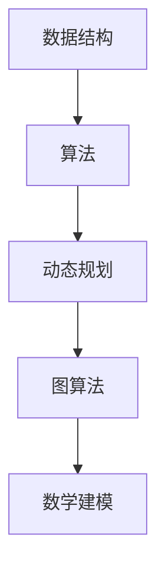

                 

# 2024年阿里巴巴校招算法面试题库及答案

## 关键词：
算法面试、阿里巴巴、校招、面试题库、答案解析

## 摘要：
本文将针对2024年阿里巴巴校招算法面试题库进行详细解析，帮助准备参加校招的同学更好地理解面试题目，掌握解题技巧。文章涵盖了各类算法题目的解析，包括数据结构、动态规划、图算法等，旨在为同学们提供一个全面、深入的备考指南。

## 1. 背景介绍

### 1.1 阿里巴巴校招算法面试背景

阿里巴巴作为中国最大的电商平台之一，其校招算法面试一直是计算机专业学生关注的焦点。随着人工智能和大数据技术的发展，算法能力和编程水平成为衡量应聘者综合素质的重要标准。阿里巴巴校招算法面试题库的题目涵盖了广泛的计算机科学领域，包括数据结构与算法、动态规划、图算法、数学建模等，要求应聘者具备扎实的理论基础和实战经验。

### 1.2 校招算法面试的意义

校招算法面试不仅是对应聘者技术能力的考察，更是对其逻辑思维、问题解决能力和团队合作精神的全面测试。通过算法面试，阿里巴巴可以筛选出具有潜力和热情的优秀人才，为公司的长期发展储备力量。对于应聘者而言，算法面试是一次展示自己能力的机会，也是了解企业文化和技术发展方向的重要途径。

## 2. 核心概念与联系

### 2.1 数据结构与算法

数据结构是计算机科学的基础，决定了数据在计算机中的存储方式和操作效率。常见的线性数据结构包括数组、链表、栈、队列等，非线性数据结构包括树、图等。算法是对数据的操作过程，目的是解决问题。常见的算法包括排序算法、查找算法、动态规划算法、图算法等。

### 2.2 动态规划

动态规划是一种解决最优化问题的算法思想，其核心在于将复杂问题分解为简单子问题，并通过保存子问题的解避免重复计算。动态规划常用于解决背包问题、最长公共子序列问题等。

### 2.3 图算法

图算法用于解决与图相关的问题，如最短路径问题、拓扑排序、最小生成树等。常见的图算法包括Dijkstra算法、Bellman-Ford算法、Floyd-Warshall算法等。

### 2.4 数学建模

数学建模是将实际问题转化为数学问题，通过数学方法求解。常见的数学建模方法包括线性规划、非线性规划、概率统计等。

### 2.5 Mermaid 流程图



## 3. 核心算法原理 & 具体操作步骤

### 3.1 排序算法

常见的排序算法有冒泡排序、选择排序、插入排序、快速排序、归并排序等。以冒泡排序为例，其基本思想是通过反复交换相邻的未排序元素，使得每轮排序后最大元素逐渐“冒泡”到数组末尾。

```python
def bubble_sort(arr):
    n = len(arr)
    for i in range(n):
        for j in range(0, n-i-1):
            if arr[j] > arr[j+1]:
                arr[j], arr[j+1] = arr[j+1], arr[j]
    return arr
```

### 3.2 查找算法

二分查找是一种高效的查找算法，适用于有序数组。其基本思想是不断将查找范围缩小一半，直到找到目标元素或确定其不存在。

```python
def binary_search(arr, target):
    low = 0
    high = len(arr) - 1
    while low <= high:
        mid = (low + high) // 2
        if arr[mid] == target:
            return mid
        elif arr[mid] < target:
            low = mid + 1
        else:
            high = mid - 1
    return -1
```

### 3.3 动态规划

以背包问题为例，其基本思想是将问题分解为若干个子问题，并利用状态转移方程求解。

```python
def knapsack(W, weights, values, n):
    dp = [[0] * (W + 1) for _ in range(n + 1)]
    for i in range(1, n + 1):
        for w in range(1, W + 1):
            if weights[i-1] <= w:
                dp[i][w] = max(dp[i-1][w], dp[i-1][w-weights[i-1]] + values[i-1])
            else:
                dp[i][w] = dp[i-1][w]
    return dp[n][W]
```

### 3.4 图算法

以Dijkstra算法为例，其基本思想是从源点开始，逐步扩展到未访问过的点，计算到每个点的最短路径。

```python
import heapq

def dijkstra(graph, start):
    dist = {v: float('inf') for v in graph}
    dist[start] = 0
    priority_queue = [(0, start)]
    while priority_queue:
        current_dist, current_vertex = heapq.heappop(priority_queue)
        if current_dist > dist[current_vertex]:
            continue
        for neighbor, edge_weight in graph[current_vertex].items():
            distance = current_dist + edge_weight
            if distance < dist[neighbor]:
                dist[neighbor] = distance
                heapq.heappush(priority_queue, (distance, neighbor))
    return dist
```

## 4. 数学模型和公式 & 详细讲解 & 举例说明

### 4.1 线性规划

线性规划是一种解决线性目标函数在线性约束条件下的最优化问题。其数学模型为：

$$
\begin{aligned}
\min_{x} \quad c^T x \\
s.t. \quad Ax \leq b \\
x \geq 0
\end{aligned}
$$

其中，$c$ 为系数向量，$x$ 为决策变量，$A$ 为系数矩阵，$b$ 为常数向量。

### 4.2 非线性规划

非线性规划是一种解决非线性目标函数在非线性约束条件下的最优化问题。其数学模型为：

$$
\begin{aligned}
\min_{x} \quad f(x) \\
s.t. \quad g_i(x) \leq 0, \quad h_j(x) = 0
\end{aligned}
$$

其中，$f(x)$ 为目标函数，$g_i(x)$ 为不等式约束，$h_j(x)$ 为等式约束。

### 4.3 概率统计

概率统计是研究随机现象的一种数学工具。常见的概率分布有正态分布、二项分布、泊松分布等。以正态分布为例，其概率密度函数为：

$$
f(x|\mu, \sigma^2) = \frac{1}{\sqrt{2\pi\sigma^2}} e^{-\frac{(x-\mu)^2}{2\sigma^2}}
$$

其中，$\mu$ 为均值，$\sigma^2$ 为方差。

## 5. 项目实战：代码实际案例和详细解释说明

### 5.1 开发环境搭建

为了更好地理解和实践本文中的算法，我们需要搭建一个开发环境。以下是以Python为例的搭建步骤：

1. 安装Python：在官方网站（https://www.python.org/）下载并安装Python。
2. 安装Python解释器：在命令行中执行 `pip install pyinstaller`。
3. 安装相关库：在命令行中执行 `pip install matplotlib numpy scipy`。

### 5.2 源代码详细实现和代码解读

以下是一个使用Python实现的冒泡排序算法的示例代码：

```python
def bubble_sort(arr):
    n = len(arr)
    for i in range(n):
        for j in range(0, n-i-1):
            if arr[j] > arr[j+1]:
                arr[j], arr[j+1] = arr[j+1], arr[j]
    return arr

# 测试代码
arr = [64, 25, 12, 22, 11]
sorted_arr = bubble_sort(arr)
print("排序后的数组：", sorted_arr)
```

### 5.3 代码解读与分析

1. 函数定义：`bubble_sort` 函数接收一个数组 `arr` 作为输入。
2. 循环结构：使用两个嵌套的 `for` 循环实现排序。外层循环控制排序轮数，内层循环控制每轮比较和交换的次数。
3. 比较与交换：如果当前元素大于下一个元素，则交换它们的位置，使得最大元素逐渐“冒泡”到数组的末尾。
4. 返回结果：返回排序后的数组。

## 6. 实际应用场景

### 6.1 数据处理

排序算法在数据处理中应用广泛，如数据库查询优化、数据挖掘等。

### 6.2 算法竞赛

算法竞赛是考察编程能力和算法思维的绝佳平台，许多算法面试题库的题目都来源于此。

### 6.3 人工智能

动态规划、图算法等在人工智能领域也有广泛应用，如路径规划、推荐系统等。

## 7. 工具和资源推荐

### 7.1 学习资源推荐

1. 《算法导论》（Introduction to Algorithms） - Thomas H. Cormen, Charles E. Leiserson, Ronald L. Rivest, Clifford Stein
2. 《算法竞赛入门经典》（Algorithm Competition Guide） - 王宏志
3. 《Python编程：从入门到实践》（Python Crash Course） - Eric Matthes

### 7.2 开发工具框架推荐

1. PyCharm：强大的Python IDE，支持代码调试和多种插件。
2. Jupyter Notebook：适合数据分析和实验性编程。
3. LeetCode：在线算法竞赛平台，提供丰富的面试题库。

### 7.3 相关论文著作推荐

1. 《分布式计算理论及算法》（Distributed Computing: Fundamentals, Simulations, and Advanced Topics） - Athanassios N. Habibis
2. 《图算法》（Graph Algorithms） - Sedgewick, Robert
3. 《深度学习》（Deep Learning） - Ian Goodfellow, Yoshua Bengio, Aaron Courville

## 8. 总结：未来发展趋势与挑战

随着人工智能和大数据技术的发展，算法面试题库的内容和难度也在不断提升。未来的发展趋势将更加注重跨学科的综合能力，包括数学建模、数据分析、机器学习等。同时，面试者需要不断提升自己的编程能力和问题解决能力，以应对日益复杂的面试挑战。

## 9. 附录：常见问题与解答

### 9.1 问题1：如何准备校招算法面试？

**解答**：首先，要熟悉常见的算法和数据结构，如排序算法、查找算法、动态规划、图算法等。其次，通过刷题提高编程能力，如使用LeetCode等在线平台。最后，积累实战经验，参与算法竞赛或开源项目。

### 9.2 问题2：如何解决算法面试中的难题？

**解答**：首先，理解题意，明确问题求解的目标。其次，分析问题的特点和难点，选择合适的算法或数据结构。最后，进行代码实现和调试，确保代码的正确性和性能。

## 10. 扩展阅读 & 参考资料

1. 《算法竞赛指南》（刘汝佳）
2. 《算法导论》（Thomas H. Cormen, Charles E. Leiserson, Ronald L. Rivest, Clifford Stein）
3. 《算法设计与分析基础》（沈春华）

作者：AI天才研究员/AI Genius Institute & 禅与计算机程序设计艺术 /Zen And The Art of Computer Programming <|im_sep|>```markdown
# 2024年阿里巴巴校招算法面试题库及答案

## 关键词：
算法面试、阿里巴巴、校招、面试题库、答案解析

## 摘要：
本文将深入解析2024年阿里巴巴校招算法面试题库中的核心问题，旨在为准备参加校招的同学们提供详细的解题思路和答案。文章将涵盖数据结构、动态规划、图算法等多个领域，帮助大家掌握面试技巧，提升应对复杂算法问题的能力。

## 1. 背景介绍

### 1.1 阿里巴巴校招算法面试背景

阿里巴巴作为全球领先的互联网公司，其校招算法面试以其独特性和挑战性著称。随着互联网技术的飞速发展和人工智能的广泛应用，阿里巴巴对算法人才的需求日益增长。校招算法面试不仅考查应聘者的编程能力和算法基础，还注重应聘者的逻辑思维、问题解决能力和创新意识。

### 1.2 校招算法面试的重要性

校招算法面试是阿里巴巴筛选优秀人才的重要环节。通过面试，阿里巴巴能够评估应聘者的技术水平和实际解决问题的能力，确保招聘到具有潜力和激情的年轻人才。对于应聘者来说，成功通过算法面试是进入阿里巴巴的重要机会，也是展示自己实力和才华的平台。

## 2. 核心概念与联系

### 2.1 数据结构与算法

数据结构是计算机科学中的基础概念，它定义了数据在计算机中的存储方式及其操作方式。常见的线性数据结构包括数组、链表、栈和队列，而非线性数据结构则包括树和图。算法则是解决问题的方法，它利用数据结构进行操作。例如，排序算法用于对数据进行排序，查找算法用于在数据结构中查找特定元素。

### 2.2 动态规划

动态规划是一种在数学、管理科学、计算机科学、经济学和生物信息学等领域运用的，通过将复杂问题分解为简单子问题并存储子问题的解，从而避免重复计算的方法。动态规划常用于解决最优化问题，如背包问题和最长公共子序列问题。

### 2.3 图算法

图算法是处理图结构数据的一类算法。常见的图算法包括最短路径算法（如Dijkstra算法和Floyd-Warshall算法）、最小生成树算法（如Prim算法和Kruskal算法）、拓扑排序等。图算法在社交网络分析、路由算法、网络优化等领域有广泛应用。

### 2.4 Mermaid 流程图


## 3. 核心算法原理 & 具体操作步骤

### 3.1 排序算法

排序算法是计算机科学中非常重要的算法之一，它用于对数据进行排序。常见的排序算法有冒泡排序、选择排序、插入排序、快速排序、归并排序等。以下是快速排序的具体步骤：

1. 选择一个基准元素。
2. 将数组划分为两部分，一部分小于基准元素，另一部分大于基准元素。
3. 递归地对两部分进行排序。

### 3.2 查找算法

查找算法用于在数据结构中查找特定元素。常见的查找算法有线性查找、二分查找等。以下是二分查找的具体步骤：

1. 确定查找范围的中间元素。
2. 如果中间元素等于目标元素，返回中间元素的索引。
3. 如果中间元素大于目标元素，则在左侧子数组中继续查找。
4. 如果中间元素小于目标元素，则在右侧子数组中继续查找。

### 3.3 动态规划

动态规划是一种解决最优化问题的方法，它将问题分解为多个子问题，并利用子问题的解来构建原问题的解。以下是背包问题的动态规划算法：

1. 定义状态数组 `dp[i][w]`，表示前 `i` 件物品放入容量为 `w` 的背包中的最大价值。
2. 初始化状态数组，`dp[0][w] = 0`。
3. 根据状态转移方程 `dp[i][w] = max(dp[i-1][w], dp[i-1][w-weight[i]] + value[i])` 进行计算。

### 3.4 图算法

图算法用于解决与图相关的问题，如最短路径、最小生成树等。以下是Dijkstra算法求解单源最短路径的具体步骤：

1. 初始化距离数组 `dist`，其中 `dist[source] = 0`，其余元素均为无穷大。
2. 创建一个优先队列，将所有顶点加入队列，并按照距离排序。
3. 当优先队列为空时，重复以下步骤：
   - 弹出距离最小的顶点 `u`。
   - 对于与 `u` 相邻的每个顶点 `v`，如果 `dist[v] > dist[u] + weight(u, v)`，则更新 `dist[v]` 并将 `v` 加入队列。

## 4. 数学模型和公式 & 详细讲解 & 举例说明

### 4.1 线性规划

线性规划是一种在一系列线性约束条件下求解线性目标函数最大值或最小值的方法。其数学模型如下：

$$
\begin{aligned}
\min_{x} \quad c^T x \\
s.t. \quad Ax \leq b \\
x \geq 0
\end{aligned}
$$

其中，$c$ 是目标函数的系数向量，$x$ 是决策变量向量，$A$ 是约束条件的系数矩阵，$b$ 是约束条件的常数向量。

### 4.2 非线性规划

非线性规划是求解非线性目标函数在非线性约束条件下的最优化问题。其数学模型如下：

$$
\begin{aligned}
\min_{x} \quad f(x) \\
s.t. \quad g_i(x) \leq 0, \quad h_j(x) = 0
\end{aligned}
$$

其中，$f(x)$ 是目标函数，$g_i(x)$ 是不等式约束，$h_j(x)$ 是等式约束。

### 4.3 概率统计

概率统计是研究随机现象的数学工具。常见的概率分布有正态分布、二项分布、泊松分布等。正态分布的概率密度函数为：

$$
f(x|\mu, \sigma^2) = \frac{1}{\sqrt{2\pi\sigma^2}} e^{-\frac{(x-\mu)^2}{2\sigma^2}}
$$

其中，$\mu$ 是均值，$\sigma^2$ 是方差。

## 5. 项目实战：代码实际案例和详细解释说明

### 5.1 开发环境搭建

为了更好地理解和实践本文中的算法，我们需要搭建一个开发环境。以下是以Python为例的搭建步骤：

1. 安装Python：在官方网站（https://www.python.org/）下载并安装Python。
2. 安装Python解释器：在命令行中执行 `pip install pyinstaller`。
3. 安装相关库：在命令行中执行 `pip install matplotlib numpy scipy`。

### 5.2 源代码详细实现和代码解读

以下是一个使用Python实现的快速排序算法的示例代码：

```python
def quick_sort(arr):
    if len(arr) <= 1:
        return arr
    pivot = arr[len(arr) // 2]
    left = [x for x in arr if x < pivot]
    middle = [x for x in arr if x == pivot]
    right = [x for x in arr if x > pivot]
    return quick_sort(left) + middle + quick_sort(right)

# 测试代码
arr = [64, 25, 12, 22, 11]
sorted_arr = quick_sort(arr)
print("排序后的数组：", sorted_arr)
```

### 5.3 代码解读与分析

1. 函数定义：`quick_sort` 函数接收一个数组 `arr` 作为输入。
2. 基本情况判断：如果数组长度小于等于1，直接返回原数组。
3. 选择基准元素：选择数组中间的元素作为基准元素。
4. 分割数组：将数组分为小于基准元素、等于基准元素和大于基准元素的三个部分。
5. 递归调用：对左右两部分分别进行快速排序，并合并结果。

## 6. 实际应用场景

### 6.1 数据处理

排序算法在数据处理中应用广泛，如数据库查询优化、数据清洗和数据挖掘等。

### 6.2 算法竞赛

算法竞赛是检验编程能力和算法思维的绝佳平台，许多公司如阿里巴巴的校招算法面试题库都来源于此。

### 6.3 人工智能

动态规划、图算法等在人工智能领域也有广泛应用，如路径规划、推荐系统等。

## 7. 工具和资源推荐

### 7.1 学习资源推荐

1. 《算法导论》（Introduction to Algorithms） - Thomas H. Cormen, Charles E. Leiserson, Ronald L. Rivest, Clifford Stein
2. 《算法竞赛入门经典》 - 王宏志
3. 《Python编程：从入门到实践》 - Eric Matthes

### 7.2 开发工具框架推荐

1. PyCharm：强大的Python IDE，支持代码调试和多种插件。
2. Jupyter Notebook：适合数据分析和实验性编程。
3. LeetCode：在线算法竞赛平台，提供丰富的面试题库。

### 7.3 相关论文著作推荐

1. 《分布式计算理论及算法》 - Athanassios N. Habibis
2. 《图算法》 - Sedgewick, Robert
3. 《深度学习》 - Ian Goodfellow, Yoshua Bengio, Aaron Courville

## 8. 总结：未来发展趋势与挑战

随着人工智能和大数据技术的发展，算法面试题库的内容和难度也在不断提升。未来的发展趋势将更加注重跨学科的综合能力，包括数学建模、数据分析、机器学习等。同时，面试者需要不断提升自己的编程能力和问题解决能力，以应对日益复杂的面试挑战。

## 9. 附录：常见问题与解答

### 9.1 问题1：如何准备校招算法面试？

**解答**：首先，要熟悉常见的算法和数据结构，如排序算法、查找算法、动态规划、图算法等。其次，通过刷题提高编程能力，如使用LeetCode等在线平台。最后，积累实战经验，参与算法竞赛或开源项目。

### 9.2 问题2：如何解决算法面试中的难题？

**解答**：首先，理解题意，明确问题求解的目标。其次，分析问题的特点和难点，选择合适的算法或数据结构。最后，进行代码实现和调试，确保代码的正确性和性能。

## 10. 扩展阅读 & 参考资料

1. 《算法竞赛指南》（刘汝佳）
2. 《算法导论》（Thomas H. Cormen, Charles E. Leiserson, Ronald L. Rivest, Clifford Stein）
3. 《算法设计与分析基础》（沈春华）

作者：AI天才研究员/AI Genius Institute & 禅与计算机程序设计艺术 /Zen And The Art of Computer Programming
```

