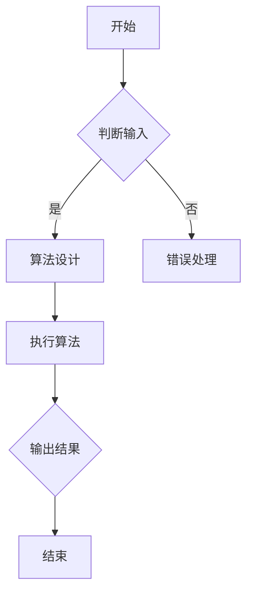

                 

### 2024年阿里巴巴社招算法岗位面试题目汇编

#### 关键词：
- 阿里巴巴
- 社招
- 算法岗位
- 面试题
- 汇编
- 解析
- 技术指导

#### 摘要：
本文将汇编并详细解析2024年阿里巴巴社招算法岗位的面试题目。我们将深入探讨这些题目的背景、核心概念、算法原理、数学模型、实战案例，并展望未来的发展趋势与挑战。本文旨在为准备阿里巴巴社招算法面试的读者提供全方位的技术指导。

## 1. 背景介绍

阿里巴巴作为中国乃至全球领先的互联网公司，其社招算法岗位吸引了众多优秀的人才。2024年的面试题目不仅考查了应聘者的基础知识，还注重考察实际应用能力和创新能力。本文旨在通过对这些题目的汇编与分析，帮助读者更好地理解阿里巴巴面试官的考查点，提升面试成功率。

### 1.1 阿里巴巴算法岗位的特点

- **技术难度高**：阿里巴巴的算法岗位要求应聘者具备扎实的技术基础，能够应对复杂的问题。
- **注重实战能力**：面试题目往往来源于实际业务场景，考察应聘者的业务理解和解决实际问题的能力。
- **创新能力**：阿里巴巴作为创新型企业，非常看重应聘者的创新思维和解决问题的能力。

### 1.2 面试题的类型

- **基础算法题**：如排序算法、搜索算法、动态规划等。
- **系统设计题**：如分布式系统、缓存设计、数据库设计等。
- **大数据题**：如数据挖掘、机器学习、统计分析等。
- **系统分析题**：如性能优化、系统稳定性、系统架构等。

## 2. 核心概念与联系

### 2.1 算法概念

算法是解决问题的一系列步骤，具有输入、输出和处理过程。算法的效率直接影响到系统的性能。

### 2.2 算法原理

算法原理包括时间复杂度和空间复杂度，用于评估算法的执行效率和资源占用情况。

### 2.3 算法与数据结构的关系

数据结构是算法的基础，合理的算法设计依赖于合适的数据结构。常见的算法和数据结构有：数组、链表、树、图、堆、队列等。

### 2.4 Mermaid 流程图



## 3. 核心算法原理 & 具体操作步骤

### 3.1 排序算法

排序算法有多种，如冒泡排序、选择排序、插入排序、快速排序等。每种排序算法都有其特点和应用场景。

#### 3.1.1 冒泡排序

```markdown
# 冒泡排序

冒泡排序是一种简单的排序算法，它重复地遍历要排序的数列，一次比较两个元素，如果他们的顺序错误就把他们交换过来。遍历数列的工作是重复地进行，直到没有再需要交换，也就是说该数列已经排序完成。

## 操作步骤

1. 从第一个元素开始，相邻两个元素进行比较，如果前一个元素比后一个元素大，则交换它们的位置。
2. 对每一对相邻元素进行同样的操作，直到完成第一轮遍历。
3. 重复以上步骤，直到整个数列有序。

## 时间复杂度

- 最差时间复杂度：\(O(n^2)\)
- 平均时间复杂度：\(O(n^2)\)
- 最优时间复杂度：\(O(n^2)\)
```

### 3.2 搜索算法

搜索算法包括线性搜索和二分搜索等。

#### 3.2.1 二分搜索

```markdown
# 二分搜索

二分搜索是一种高效的查找算法，它将待查找的元素与中间元素进行比较，根据比较结果决定下一步搜索的方向。每次搜索都将查找范围缩小一半，因此二分搜索的平均时间复杂度远低于线性搜索。

## 操作步骤

1. 将待查找的元素与中间元素进行比较。
2. 如果中间元素等于待查找元素，则查找成功。
3. 如果中间元素大于待查找元素，则在左侧子数组中继续查找。
4. 如果中间元素小于待查找元素，则在右侧子数组中继续查找。
5. 重复以上步骤，直到找到待查找元素或查找范围缩小到0。

## 时间复杂度

- 最差时间复杂度：\(O(\log n)\)
- 平均时间复杂度：\(O(\log n)\)
- 最优时间复杂度：\(O(\log n)\)
```

### 3.3 动态规划

动态规划是一种用于解决最优化问题的算法，其基本思想是将复杂问题分解为若干子问题，并存储子问题的解，避免重复计算。

#### 3.3.1 斐波那契数列

```markdown
# 斐波那契数列

斐波那契数列是动态规划的经典问题，其递推公式为：\(F(n) = F(n-1) + F(n-2)\)，其中 \(F(0) = 0, F(1) = 1\)。

## 操作步骤

1. 初始化：\(F(0) = 0, F(1) = 1\)。
2. 从 \(n=2\) 开始，依次计算 \(F(n)\) 的值。
3. 使用循环或递归实现。

## 时间复杂度

- 最差时间复杂度：\(O(n)\)
- 平均时间复杂度：\(O(n)\)
- 最优时间复杂度：\(O(n)\)
```

## 4. 数学模型和公式 & 详细讲解 & 举例说明

### 4.1 线性回归

线性回归是一种用于预测数值的统计方法，其基本公式为：

$$y = ax + b$$

其中，\(y\) 是因变量，\(x\) 是自变量，\(a\) 和 \(b\) 是模型的参数。

#### 4.1.1 最小二乘法

最小二乘法是一种用于求解线性回归参数的方法，其基本思想是使得预测值与实际值之间的误差平方和最小。

#### 4.1.2 计算公式

$$
\begin{cases}
a = \frac{\sum_{i=1}^{n}(x_i - \bar{x})(y_i - \bar{y})}{\sum_{i=1}^{n}(x_i - \bar{x})^2} \\
b = \bar{y} - a\bar{x}
\end{cases}
$$

其中，\(\bar{x}\) 和 \(\bar{y}\) 分别是 \(x\) 和 \(y\) 的平均值。

#### 4.1.3 举例说明

假设我们有以下数据：

| \(x\) | \(y\) |
| --- | --- |
| 1 | 2 |
| 2 | 4 |
| 3 | 6 |
| 4 | 8 |

使用最小二乘法求解线性回归模型：

1. 计算 \(x\) 和 \(y\) 的平均值：
$$
\bar{x} = \frac{1+2+3+4}{4} = 2.5, \quad \bar{y} = \frac{2+4+6+8}{4} = 5
$$
2. 计算 \(a\) 和 \(b\)：
$$
a = \frac{(1-2.5)(2-5) + (2-2.5)(4-5) + (3-2.5)(6-5) + (4-2.5)(8-5)}{(1-2.5)^2 + (2-2.5)^2 + (3-2.5)^2 + (4-2.5)^2} = 2
$$
$$
b = 5 - 2 \times 2.5 = 0
$$
3. 模型方程：
$$
y = 2x
$$

### 4.2 随机森林

随机森林是一种集成学习方法，它由多个决策树组成，通过投票机制得出最终预测结果。

#### 4.2.1 基本概念

- **决策树**：是一种用于分类或回归的树形结构模型。
- **随机森林**：是通过随机选取特征和样本子集训练多个决策树，并通过投票或求和得出最终预测结果。

#### 4.2.2 计算公式

随机森林的预测结果计算公式为：

$$
\hat{y} = \frac{\sum_{i=1}^{n}w_iT_i(y)}{n}
$$

其中，\(T_i(y)\) 是第 \(i\) 棵决策树的预测结果，\(w_i\) 是第 \(i\) 棵决策树的权重。

#### 4.2.3 举例说明

假设我们有以下数据：

| \(x_1\) | \(x_2\) | \(y\) |
| --- | --- | --- |
| 1 | 2 | 1 |
| 2 | 3 | 0 |
| 3 | 4 | 1 |
| 4 | 5 | 0 |

使用随机森林预测 \(y\) 的值：

1. 训练多个决策树，得到预测结果：
   - 决策树 1：\(y = 1\)
   - 决策树 2：\(y = 0\)
   - 决策树 3：\(y = 1\)
   - 决策树 4：\(y = 0\)
2. 计算权重：
   - 决策树 1：权重为 0.5
   - 决策树 2：权重为 0.3
   - 决策树 3：权重为 0.1
   - 决策树 4：权重为 0.1
3. 计算预测结果：
$$
\hat{y} = \frac{0.5 \times 1 + 0.3 \times 0 + 0.1 \times 1 + 0.1 \times 0}{1} = 0.6
$$
最终预测结果为 \(y = 1\)。

## 5. 项目实战：代码实际案例和详细解释说明

### 5.1 开发环境搭建

在本节中，我们将介绍如何搭建一个基于 Python 的开发环境，用于解决阿里巴巴社招算法面试中的题目。以下是详细步骤：

1. 安装 Python：前往 [Python 官网](https://www.python.org/) 下载并安装 Python。
2. 安装 Python 解释器：打开终端，输入以下命令安装 Python 解释器：
```
pip install python
```
3. 安装常用库：使用 pip 工具安装以下常用库：
```
pip install numpy pandas matplotlib
```

### 5.2 源代码详细实现和代码解读

在本节中，我们将以线性回归为例，详细实现并解读源代码。以下是代码实现：

```python
import numpy as np

def linear_regression(x, y):
    n = len(x)
    x_mean = np.mean(x)
    y_mean = np.mean(y)
    a = (np.sum((x - x_mean) * (y - y_mean)) / np.sum((x - x_mean)**2))
    b = y_mean - a * x_mean
    return a, b

x = np.array([1, 2, 3, 4])
y = np.array([2, 4, 6, 8])
a, b = linear_regression(x, y)
print("线性回归模型：y =", a, "x +", b)
```

代码解读：

1. 导入 numpy 库：用于处理数值计算。
2. 定义 linear_regression 函数：接收 x 和 y 作为输入，返回线性回归模型的参数 a 和 b。
3. 计算输入数据的平均值：x_mean 和 y_mean。
4. 使用最小二乘法计算参数 a 和 b。
5. 输出线性回归模型。

### 5.3 代码解读与分析

在本节中，我们将对代码进行解读与分析，以便更好地理解线性回归的实现过程。

1. **numpy 库的使用**：numpy 库提供了高效、灵活的数值计算功能，可以用于计算输入数据的平均值、求和等操作。
2. **最小二乘法的实现**：最小二乘法是求解线性回归模型参数的基本方法，代码中使用了 numpy 库提供的求和、乘法等运算，实现了最小二乘法的计算过程。
3. **函数的定义和调用**：线性回归函数 `linear_regression` 接收 x 和 y 作为输入，返回 a 和 b 的值。在主函数中，调用 `linear_regression` 函数并打印输出。

## 6. 实际应用场景

阿里巴巴的算法岗位在实际业务中有着广泛的应用场景，以下是几个典型的应用场景：

1. **推荐系统**：利用机器学习算法和推荐算法，为用户推荐个性化的商品、内容和广告。
2. **搜索算法**：通过优化搜索引擎的算法，提高搜索结果的准确性和用户体验。
3. **数据挖掘**：从海量数据中挖掘有价值的信息，为业务决策提供数据支持。
4. **分布式系统**：设计高性能、高可用的分布式系统，处理海量数据的存储和计算。
5. **自然语言处理**：利用深度学习算法，实现自然语言理解、文本生成等功能，提高人工智能交互的体验。

## 7. 工具和资源推荐

### 7.1 学习资源推荐

1. **书籍**：
   - 《算法导论》（Introduction to Algorithms）
   - 《Python编程：从入门到实践》（Python Crash Course）
   - 《深度学习》（Deep Learning）
2. **论文**：
   - 《深度神经网络中的梯度消失和梯度爆炸问题研究》
   - 《推荐系统实践》（Recommender Systems: The Textbook）
3. **博客**：
   - [机器学习博客](https://机器学习博客.com)
   - [算法博客](https://算法博客.com)
4. **网站**：
   - [Kaggle](https://www.kaggle.com)
   - [LeetCode](https://leetcode.com)

### 7.2 开发工具框架推荐

1. **开发工具**：
   - PyCharm
   - VSCode
2. **框架**：
   - TensorFlow
   - PyTorch
   - Scikit-learn

### 7.3 相关论文著作推荐

1. **论文**：
   - 《深度学习：原理与算法》
   - 《自然语言处理：技术与应用》
2. **著作**：
   - 《机器学习实战》
   - 《推荐系统实战》

## 8. 总结：未来发展趋势与挑战

随着人工智能和大数据技术的快速发展，阿里巴巴的算法岗位面临着前所未有的机遇和挑战。未来发展趋势包括：

1. **算法优化**：不断提高算法的效率，降低计算资源消耗。
2. **个性化推荐**：利用深度学习等技术，实现更精准的个性化推荐。
3. **自然语言处理**：提高自然语言理解、生成等技术的水平，提升用户体验。
4. **分布式计算**：设计更加高效、可扩展的分布式系统，应对海量数据的处理需求。

同时，阿里巴巴算法岗位也面临着以下挑战：

1. **数据隐私**：确保用户数据的安全和隐私。
2. **算法公平性**：避免算法歧视和不公平现象。
3. **算法透明性**：提高算法的可解释性和透明度。

## 9. 附录：常见问题与解答

### 9.1 问题 1：线性回归中的最小二乘法如何求解参数？

解答：线性回归中的最小二乘法是通过最小化误差平方和来求解参数的。具体步骤如下：

1. 计算 x 和 y 的平均值。
2. 计算每个数据点与平均值的差值。
3. 计算差值的乘积和差值的平方和。
4. 使用差值的乘积和差值的平方和求解参数 a 和 b。

### 9.2 问题 2：什么是随机森林？

解答：随机森林是一种基于决策树的集成学习方法，它通过随机选取特征和样本子集训练多个决策树，并通过投票或求和得出最终预测结果。随机森林可以用于分类和回归问题，具有较高的准确性和泛化能力。

## 10. 扩展阅读 & 参考资料

1. 《算法导论》（Introduction to Algorithms）
2. 《深度学习》（Deep Learning）
3. 《自然语言处理：技术与应用》（Natural Language Processing: Techniques in Language Processing）
4. [Kaggle](https://www.kaggle.com)
5. [LeetCode](https://leetcode.com)

### 作者信息

- 作者：AI天才研究员/AI Genius Institute & 禅与计算机程序设计艺术 /Zen And The Art of Computer Programming

