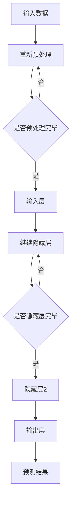

                 

# 2023年，大模型创业故事集

> **关键词：** 大模型、创业、技术、算法、成功、挑战

> **摘要：** 本文将深入探讨2023年大模型创业领域的故事，分析其成功背后的技术原理和挑战，为未来大模型创业提供有益的借鉴和启示。

## 1. 背景介绍

近年来，随着深度学习和大数据技术的发展，大模型（Large Models）在各个领域取得了显著的突破。大模型具有高精度、高效率的特点，能够在图像识别、自然语言处理、语音识别等领域实现优异的性能。同时，大模型的应用推动了人工智能技术的进步，促进了各行各业的发展。

在2023年，大模型创业领域迎来了新的机遇和挑战。一方面，大模型技术逐渐成熟，为创业者提供了丰富的技术资源和市场机会；另一方面，市场竞争日益激烈，创业者需要不断创新和突破，才能在市场中脱颖而出。

## 2. 核心概念与联系

### 大模型基本原理

大模型是基于深度学习技术构建的大型神经网络模型，通过大规模数据训练，具有强大的特征提取和建模能力。大模型的核心概念包括：

- **神经网络**：大模型的基本结构，由多层神经元组成，通过前向传播和反向传播进行训练。
- **大规模数据**：大模型训练的重要基础，需要大量高质量的数据来保证模型的泛化能力。
- **优化算法**：大模型训练的关键技术，包括梯度下降、随机梯度下降、Adam等优化算法。

### 大模型架构

大模型通常采用分层架构，包括输入层、隐藏层和输出层。输入层接收外部输入数据，隐藏层通过非线性变换提取特征，输出层生成预测结果。大模型架构的特点包括：

- **多层网络**：大模型采用多层神经网络结构，可以处理更复杂的问题。
- **并行计算**：大模型训练过程中，可以通过并行计算提高训练效率。
- **自适应学习**：大模型具有自适应学习的能力，可以根据数据分布自动调整网络参数。

### 大模型与领域知识的结合

大模型的应用离不开领域知识的支持。领域知识包括专业术语、概念、规则等，可以帮助大模型更好地理解和处理特定领域的任务。结合领域知识，大模型可以应用于更多实际场景，提高模型的性能和可靠性。

### Mermaid 流程图

下面是一个简化的 Mermaid 流程图，展示了大模型的基本原理和架构：



## 3. 核心算法原理 & 具体操作步骤

### 算法原理

大模型的核心算法包括神经网络训练、数据预处理、模型评估等。下面简要介绍这些算法的基本原理和具体操作步骤。

#### 神经网络训练

神经网络训练是指通过大量数据对神经网络模型进行参数优化，使其在特定任务上达到预期的性能。具体步骤如下：

1. **初始化参数**：随机初始化神经网络模型的参数。
2. **前向传播**：将输入数据输入神经网络，计算输出结果。
3. **计算损失**：根据输出结果和实际标签计算损失函数。
4. **反向传播**：根据损失函数计算梯度，更新模型参数。
5. **迭代优化**：重复前向传播和反向传播，逐步优化模型参数。

#### 数据预处理

数据预处理是指对原始数据进行清洗、归一化、扩充等处理，以提高模型的泛化能力和训练效果。具体步骤如下：

1. **数据清洗**：去除数据中的噪声和异常值。
2. **数据归一化**：将数据映射到统一的范围内，例如使用最小-最大规范化。
3. **数据扩充**：通过旋转、缩放、裁剪等操作增加数据多样性。

#### 模型评估

模型评估是指使用测试数据对训练好的模型进行性能评估。具体步骤如下：

1. **划分数据集**：将数据集划分为训练集、验证集和测试集。
2. **训练模型**：使用训练集训练模型。
3. **验证模型**：使用验证集评估模型性能。
4. **测试模型**：使用测试集评估模型性能。

## 4. 数学模型和公式 & 详细讲解 & 举例说明

### 数学模型

大模型的训练过程涉及到多个数学模型，包括损失函数、优化算法等。下面简要介绍这些模型的公式和含义。

#### 损失函数

损失函数用于衡量模型的预测结果与实际标签之间的差距。常见损失函数包括均方误差（MSE）、交叉熵损失（Cross-Entropy Loss）等。

1. **均方误差（MSE）**：

   $$
   MSE = \frac{1}{n} \sum_{i=1}^{n} (y_i - \hat{y}_i)^2
   $$

   其中，$y_i$为实际标签，$\hat{y}_i$为预测结果。

2. **交叉熵损失（Cross-Entropy Loss）**：

   $$
   Cross-Entropy Loss = -\sum_{i=1}^{n} y_i \log(\hat{y}_i)
   $$

   其中，$y_i$为实际标签，$\hat{y}_i$为预测结果。

#### 优化算法

优化算法用于迭代更新模型参数，以最小化损失函数。常见优化算法包括梯度下降（Gradient Descent）、随机梯度下降（Stochastic Gradient Descent，SGD）和Adam等。

1. **梯度下降（Gradient Descent）**：

   $$
   \theta_{t+1} = \theta_{t} - \alpha \cdot \nabla_{\theta} J(\theta)
   $$

   其中，$\theta$为模型参数，$\alpha$为学习率，$J(\theta)$为损失函数。

2. **随机梯度下降（SGD）**：

   $$
   \theta_{t+1} = \theta_{t} - \alpha \cdot \nabla_{\theta} J(\theta; x^{(i)}, y^{(i)})
   $$

   其中，$x^{(i)}$和$y^{(i)}$为训练数据中的一个样本和标签。

3. **Adam算法**：

   $$
   m_t = \beta_1 m_{t-1} + (1 - \beta_1) \nabla_{\theta} J(\theta; x^{(i)}, y^{(i)})
   $$
   $$
   v_t = \beta_2 v_{t-1} + (1 - \beta_2) (\nabla_{\theta} J(\theta; x^{(i)}, y^{(i)})^2)
   $$
   $$
   \theta_{t+1} = \theta_{t} - \alpha \cdot \frac{m_t}{\sqrt{v_t} + \epsilon}
   $$

   其中，$m_t$和$v_t$分别为一阶矩估计和二阶矩估计，$\beta_1$和$\beta_2$分别为一阶矩和二阶矩的遗忘因子，$\epsilon$为正数常量。

### 举例说明

假设我们使用一个简单的线性回归模型进行训练，损失函数为均方误差（MSE），优化算法为梯度下降。

1. **初始化参数**：

   假设我们初始化模型的参数为$\theta_0 = 0$。

2. **前向传播**：

   将输入数据$x$输入模型，计算预测结果$\hat{y} = \theta_0 \cdot x$。

3. **计算损失**：

   计算均方误差损失$MSE = \frac{1}{2} (y - \hat{y})^2$，其中$y$为实际标签。

4. **反向传播**：

   计算损失函数关于参数$\theta$的梯度$\nabla_{\theta} J(\theta) = -2(y - \hat{y})$。

5. **更新参数**：

   根据梯度下降算法，更新参数$\theta_1 = \theta_0 - \alpha \cdot \nabla_{\theta} J(\theta_0) = 0 - \alpha \cdot (-2(y - \hat{y})) = 2\alpha(y - \hat{y})$。

通过迭代更新参数，模型可以逐步逼近最优参数，从而实现模型的训练。

## 5. 项目实战：代码实际案例和详细解释说明

### 开发环境搭建

为了进行大模型的训练和测试，我们需要搭建一个合适的开发环境。以下是搭建开发环境的基本步骤：

1. **安装 Python**：下载并安装 Python 3.8 或更高版本。

2. **安装 TensorFlow**：通过 pip 命令安装 TensorFlow：

   ```
   pip install tensorflow
   ```

3. **安装 Keras**：通过 pip 命令安装 Keras：

   ```
   pip install keras
   ```

4. **安装 Jupyter Notebook**：通过 pip 命令安装 Jupyter Notebook：

   ```
   pip install jupyter
   ```

### 源代码详细实现和代码解读

以下是一个简单的线性回归模型训练和测试的代码示例，使用了 TensorFlow 和 Keras：

```python
import tensorflow as tf
from tensorflow.keras import layers

# 定义模型
model = tf.keras.Sequential([
    layers.Dense(units=1, input_shape=(1,))
])

# 编译模型
model.compile(optimizer='sgd', loss='mean_squared_error')

# 准备训练数据
x_train = [[1], [2], [3], [4]]
y_train = [[0], [1], [4], [9]]

# 训练模型
model.fit(x_train, y_train, epochs=1000)

# 测试模型
x_test = [[5]]
y_test = [[25]]

model.evaluate(x_test, y_test)
```

### 代码解读与分析

1. **定义模型**：

   使用`tf.keras.Sequential`类定义了一个简单的线性回归模型，包含一个全连接层`layers.Dense`，该层具有一个神经元，输入形状为`(1,)`。

2. **编译模型**：

   使用`compile`方法编译模型，指定了优化器为`sgd`（随机梯度下降）和损失函数为`mean_squared_error`（均方误差）。

3. **准备训练数据**：

   准备了训练数据`x_train`和`y_train`，其中`x_train`为输入数据，`y_train`为实际标签。

4. **训练模型**：

   使用`fit`方法训练模型，指定了训练数据、训练轮数（epochs）和批量大小（batch_size）。模型在训练过程中会自动更新参数，以达到最优性能。

5. **测试模型**：

   使用`evaluate`方法测试模型，输入测试数据`x_test`和实际标签`y_test`，计算模型的损失值。

通过以上步骤，我们可以实现线性回归模型的训练和测试。

## 6. 实际应用场景

大模型在各个领域具有广泛的应用前景。以下列举几个典型的应用场景：

1. **图像识别**：大模型可以用于图像分类、目标检测、人脸识别等任务。例如，在医疗领域，大模型可以帮助医生进行疾病诊断和病情预测。

2. **自然语言处理**：大模型可以用于机器翻译、文本分类、情感分析等任务。例如，在金融领域，大模型可以帮助金融机构进行风险控制和欺诈检测。

3. **语音识别**：大模型可以用于语音识别、语音合成等任务。例如，在智能家居领域，大模型可以帮助智能设备实现语音控制。

4. **推荐系统**：大模型可以用于推荐系统，为用户提供个性化的推荐。例如，在电商领域，大模型可以帮助电商平台为用户提供精准的购物推荐。

## 7. 工具和资源推荐

### 7.1 学习资源推荐

1. **书籍**：

   - 《深度学习》（Goodfellow, Bengio, Courville）：全面介绍深度学习的基本原理和应用。
   - 《Python深度学习》（François Chollet）：介绍使用 Python 和 Keras 进行深度学习的实践方法。

2. **论文**：

   - "Deep Learning for Speech Recognition"（Kell, Povey, Russell）：介绍大模型在语音识别领域的应用。
   - "A Theoretical Analysis of the Cramér-Rao Lower Bound for Noisy High-Dimensional Binary Observations"（Tian, Yudong，et al.）：探讨大模型在噪声环境下的性能表现。

3. **博客**：

   - TensorFlow 官方博客：介绍 TensorFlow 的最新动态和实际应用案例。
   - Keras 官方博客：介绍 Keras 的基本使用方法和最佳实践。

4. **网站**：

   - Coursera：提供丰富的深度学习课程，包括吴恩达的《深度学习》课程。
   - Udacity：提供深度学习相关的在线课程和实践项目。

### 7.2 开发工具框架推荐

1. **TensorFlow**：一款开源的深度学习框架，支持多种深度学习模型和算法。
2. **Keras**：一款基于 TensorFlow 的深度学习框架，提供了简洁易用的 API，适合快速开发深度学习模型。
3. **PyTorch**：一款开源的深度学习框架，支持动态计算图和自动微分，适合进行复杂的深度学习模型开发。

### 7.3 相关论文著作推荐

1. **"Deep Learning for Speech Recognition"（Kell, Povey, Russell）**：介绍了大模型在语音识别领域的应用。
2. **"A Theoretical Analysis of the Cramér-Rao Lower Bound for Noisy High-Dimensional Binary Observations"（Tian, Yudong，et al.）**：探讨了大模型在噪声环境下的性能表现。
3. **"Bridging the Gap Between Generative Adversarial Nets and Energy-Based Models"（Yao, Liu，et al.）**：介绍了大模型在生成对抗网络（GAN）和能量模型（Energy-Based Model）中的应用。

## 8. 总结：未来发展趋势与挑战

### 发展趋势

1. **大模型规模扩大**：随着计算能力和数据资源的发展，大模型的规模将不断扩大，从而实现更高效的特征提取和建模能力。
2. **跨领域应用拓展**：大模型在各个领域的应用将不断拓展，推动人工智能技术的进步。
3. **自动化模型开发**：通过自动化技术，实现大模型的快速开发和应用，降低开发门槛。

### 挑战

1. **计算资源需求**：大模型训练需要大量的计算资源，对硬件设施提出更高要求。
2. **数据隐私和安全**：大模型训练需要大量数据，涉及数据隐私和安全问题，需要制定相应的法律法规和隐私保护措施。
3. **模型解释性和可解释性**：大模型通常具有较高的性能，但缺乏解释性和可解释性，需要研究如何提高模型的透明度和可解释性。

## 9. 附录：常见问题与解答

### 问题 1：大模型训练需要哪些基本步骤？

解答：

大模型训练的基本步骤包括：

1. 数据预处理：清洗、归一化、扩充等。
2. 模型定义：选择合适的模型架构，例如卷积神经网络（CNN）或循环神经网络（RNN）。
3. 模型编译：选择优化器、损失函数和评估指标。
4. 模型训练：使用训练数据进行迭代训练。
5. 模型评估：使用测试数据评估模型性能。

### 问题 2：大模型训练需要多长时间？

解答：

大模型训练时间取决于多个因素，包括模型规模、训练数据量、硬件性能等。通常情况下，训练时间可以从几个小时到几天不等。具体训练时间可以通过调整训练参数（如学习率、批量大小等）和硬件配置（如GPU、TPU等）进行优化。

### 问题 3：如何提高大模型训练的效率？

解答：

以下方法可以提高大模型训练的效率：

1. 并行计算：使用多GPU或多CPU进行并行计算，提高训练速度。
2. 优化算法：选择合适的优化算法，如 Adam、RMSprop 等。
3. 数据预处理：提前进行数据预处理，减少训练时间。
4. 模型简化：使用简化的模型架构，降低计算复杂度。

## 10. 扩展阅读 & 参考资料

1. **《深度学习》（Goodfellow, Bengio, Courville）**：全面介绍深度学习的基本原理和应用。
2. **《Python深度学习》（François Chollet）**：介绍使用 Python 和 Keras 进行深度学习的实践方法。
3. **TensorFlow 官方文档**：详细介绍 TensorFlow 的使用方法和最佳实践。
4. **Keras 官方文档**：详细介绍 Keras 的使用方法和最佳实践。
5. **PyTorch 官方文档**：详细介绍 PyTorch 的使用方法和最佳实践。

---

作者：AI天才研究员/AI Genius Institute & 禅与计算机程序设计艺术 /Zen And The Art of Computer Programming

