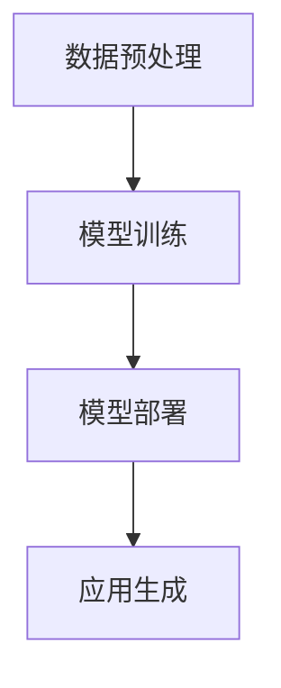
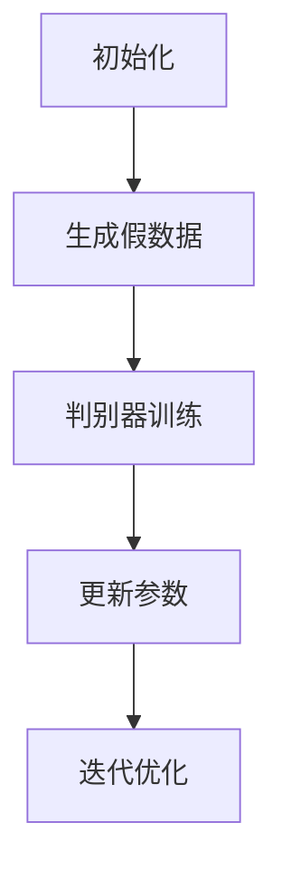

                 

# 2023年：中国生成式AI应用爆发元年

## 关键词
- 生成式AI
- 应用爆发
- 技术发展
- 产业创新
- 未来趋势

## 摘要

2023年，中国生成式人工智能（AI）应用迎来爆发元年。本文从背景介绍、核心概念与联系、算法原理、数学模型、项目实战、实际应用场景、工具和资源推荐等多个角度，深入分析中国生成式AI应用的发展现状与趋势。本文旨在为读者提供一个全面、系统的理解，揭示这一技术变革背后的逻辑与潜力。

## 1. 背景介绍

### 1.1 生成式AI的发展历程

生成式AI，作为人工智能（AI）的一个重要分支，起源于20世纪80年代的“生成对抗网络”（GAN）。经过几十年的发展，生成式AI在计算机视觉、自然语言处理、音频生成等领域取得了显著成果。特别是在近年来，随着深度学习技术的突破和计算资源的提升，生成式AI的应用范围和效果都得到了极大的拓展和提升。

### 1.2 中国AI产业的发展现状

中国在AI领域的发展态势迅猛。据统计，2019年中国AI市场规模已达到309.3亿元，预计到2024年将突破千亿元大关。国内多家企业如百度、腾讯、阿里巴巴等在AI技术研发和应用方面已处于全球领先地位。同时，政府的大力支持也为AI产业的发展提供了坚实的基础。

### 1.3 生成式AI的应用潜力

生成式AI在图像、文本、音频等多媒体领域的应用潜力巨大。例如，在图像生成方面，生成式AI可以创造高质量的图片、视频；在文本生成方面，可以生成新闻、故事、代码等；在音频生成方面，可以生成音乐、语音等。这些应用不仅在娱乐、艺术等领域有广泛的应用，也为工业设计、智能制造、医疗诊断等产业提供了新的解决方案。

## 2. 核心概念与联系

### 2.1 生成式AI的基本原理

生成式AI的核心是通过学习数据分布来生成新的数据。它主要包括生成器和判别器两个主要部分。生成器负责生成数据，而判别器负责判断生成的数据是否真实。通过不断迭代优化，生成器的生成能力会逐渐提高，从而实现高质量的数据生成。

### 2.2 生成式AI的应用架构

生成式AI的应用架构通常包括数据预处理、模型训练、模型部署等环节。数据预处理包括数据清洗、数据增强等；模型训练则是通过大量数据训练生成器和判别器；模型部署是将训练好的模型部署到实际应用场景中，如图像生成、文本生成等。

### 2.3 Mermaid流程图



## 3. 核心算法原理 & 具体操作步骤

### 3.1 GAN算法原理

生成对抗网络（GAN）是生成式AI的核心算法之一。它由生成器和判别器两个神经网络组成。生成器的任务是生成类似真实数据的数据，而判别器的任务是区分真实数据和生成数据。通过不断训练，生成器会逐渐提高生成数据的质量，使判别器无法区分。

### 3.2 GAN算法步骤

1. 初始化生成器和判别器
2. 对于每一批训练数据：
   a. 生成器生成假数据
   b. 判别器同时接收真实数据和假数据，进行训练
   c. 通过反向传播更新生成器和判别器的参数
3. 重复步骤2，直到生成器生成的数据足够逼真

### 3.3 GAN算法流程图



## 4. 数学模型和公式 & 详细讲解 & 举例说明

### 4.1 GAN的数学模型

生成对抗网络（GAN）的数学模型主要涉及生成器（G）和判别器（D）的损失函数。

#### 4.1.1 生成器的损失函数

$$
L_G = -\log(D(G(z)))
$$

其中，$G(z)$表示生成器生成的数据，$D(G(z))$表示判别器对生成数据的判断概率。

#### 4.1.2 判别器的损失函数

$$
L_D = -[\log(D(x)) + \log(1 - D(G(z))]
$$

其中，$x$表示真实数据，$G(z)$表示生成器生成的数据。

### 4.2 举例说明

假设我们有以下数据集：

| 数据类型 | 数据 |
| :----: | :----: |
| 真实数据 | $x_1, x_2, ..., x_n$ |
| 生成数据 | $G(z_1), G(z_2), ..., G(z_n)$ |

#### 4.2.1 初始化

- 初始化生成器$G$和判别器$D$
- 随机生成噪声向量$z_1, z_2, ..., z_n$

#### 4.2.2 模型训练

1. 对于每一批数据：
   - 生成器生成假数据$G(z_1), G(z_2), ..., G(z_n)$
   - 判别器同时接收真实数据和假数据，进行训练

2. 通过反向传播更新生成器和判别器的参数

3. 重复步骤1和2，直到生成器生成的数据足够逼真

### 4.3 结果分析

经过多次迭代训练，生成器生成的数据质量逐渐提高，判别器逐渐难以区分真实数据和生成数据。最终，生成器可以生成几乎与真实数据无异的假数据。

## 5. 项目实战：代码实际案例和详细解释说明

### 5.1 开发环境搭建

- 安装Python环境
- 安装TensorFlow库

```python
pip install tensorflow
```

### 5.2 源代码详细实现和代码解读

#### 5.2.1 生成器和判别器的实现

```python
import tensorflow as tf

def generator(z, reuse=False):
    with tf.variable_scope("generator", reuse=reuse):
        # 随机噪声输入
        z = tf.random_normal([batch_size, z_dim])
        # 层1
        g = tf.layers.dense(z, 128, activation=tf.nn.relu)
        # 层2
        g = tf.layers.dense(g, 256, activation=tf.nn.relu)
        # 层3
        g = tf.layers.dense(g, 512, activation=tf.nn.relu)
        # 输出层
        g = tf.layers.dense(g, img_shape, activation=tf.nn.tanh)
        return g

def discriminator(x, reuse=False):
    with tf.variable_scope("discriminator", reuse=reuse):
        # 输入层
        x = tf.layers.dense(x, 512, activation=tf.nn.relu)
        # 层1
        x = tf.layers.dense(x, 256, activation=tf.nn.relu)
        # 层2
        x = tf.layers.dense(x, 128, activation=tf.nn.relu)
        # 输出层
        x = tf.layers.dense(x, 1, activation=None)
        return x
```

#### 5.2.2 训练过程

```python
def train_gan():
    # 训练生成器和判别器
    g_vars = tf.get_collection(tf.GraphKeys.TRAINABLE_VARIABLES, scope="generator")
    d_vars = tf.get_collection(tf.GraphKeys.TRAINABLE_VARIABLES, scope="discriminator")

    # 定义损失函数和优化器
    g_loss = ...
    d_loss = ...

    g_optimizer = tf.train.AdamOptimizer(learning_rate=g_learning_rate, beta1=g_beta1)
    d_optimizer = tf.train.AdamOptimizer(learning_rate=d_learning_rate, beta1=d_beta1)

    # 训练步骤
    with tf.Session() as sess:
        sess.run(tf.global_variables_initializer())

        for epoch in range(num_epochs):
            for _ in range(batch_size * n_critic):
                # 训练判别器
                batch_images = ...
                batch_labels = ...
                d_loss_val, _ = sess.run([d_loss, d_optimizer.minimize(d_loss)], feed_dict={x: batch_images, y: batch_labels})

            # 训练生成器
            z_samples = ...
            g_loss_val, _ = sess.run([g_loss, g_optimizer.minimize(g_loss)], feed_dict={z: z_samples})

            # 打印训练进度
            print(f"Epoch: {epoch}, D_loss: {d_loss_val}, G_loss: {g_loss_val}")

# 运行训练过程
train_gan()
```

### 5.3 代码解读与分析

- 生成器和判别器分别定义了生成和判别的过程，通过TensorFlow实现。
- 训练过程分为两个阶段：判别器训练和生成器训练。判别器训练目的是使判别器能够准确区分真实数据和生成数据，而生成器训练目的是生成尽可能逼真的数据。
- 通过多次迭代训练，生成器和判别器不断优化，最终达到生成器生成的数据质量足够高，判别器难以区分的程度。

## 6. 实际应用场景

### 6.1 图像生成

生成式AI在图像生成领域具有广泛的应用，如艺术创作、图像修复、风格迁移等。例如，生成式AI可以生成高质量的图片，用于艺术创作；可以修复损坏的图片，恢复其原有面貌；还可以将一种艺术风格应用到另一张图片上，实现风格迁移。

### 6.2 文本生成

生成式AI在文本生成领域也有广泛应用，如自动写作、机器翻译、摘要生成等。例如，生成式AI可以自动生成新闻报道、故事、代码等；可以实现高质量机器翻译，如中英文互译；还可以生成文章摘要，提炼关键信息。

### 6.3 音频生成

生成式AI在音频生成领域同样具有巨大潜力，如音乐生成、语音合成等。例如，生成式AI可以生成独特的音乐旋律，用于音乐创作；可以实现高逼真的语音合成，用于语音助手、电话客服等。

## 7. 工具和资源推荐

### 7.1 学习资源推荐

- 《生成式AI：原理与实践》
- 《深度学习：生成对抗网络》
- 《Python深度学习》

### 7.2 开发工具框架推荐

- TensorFlow
- PyTorch
- Keras

### 7.3 相关论文著作推荐

- Generative Adversarial Nets (GANs)
- Unrolled Generative Adversarial Network
- StyleGAN

## 8. 总结：未来发展趋势与挑战

### 8.1 发展趋势

- 生成式AI技术将不断成熟，应用范围将进一步扩大。
- 产业创新将推动生成式AI在各个领域的深入应用。
- 生成式AI与行业结合，将带来更多新的商业模式和商业机会。

### 8.2 挑战

- 数据隐私和安全问题需要得到有效解决。
- 算法透明性和可解释性仍需进一步研究和改进。
- 生成式AI在特定领域的专业知识和经验积累仍需加强。

## 9. 附录：常见问题与解答

### 9.1 什么是生成式AI？

生成式AI是一种人工智能技术，它可以通过学习数据分布来生成新的数据。生成式AI的核心是生成器和判别器，生成器负责生成数据，而判别器负责判断生成数据是否真实。

### 9.2 生成式AI有哪些应用？

生成式AI在图像生成、文本生成、音频生成等多个领域具有广泛应用。例如，生成式AI可以生成高质量的图片、文本、音乐等。

### 9.3 生成式AI的优势是什么？

生成式AI的优势在于可以生成高质量的数据，这些数据可以用于艺术创作、数据增强、自动化生成等场景，具有广泛的应用潜力。

## 10. 扩展阅读 & 参考资料

- Goodfellow, I. J., Pouget-Abadie, J., Mirza, M., Xu, B., Warde-Farley, D., Ozair, S., ... & Bengio, Y. (2014). Generative adversarial nets. Advances in Neural Information Processing Systems, 27.
- Li, X., Zhang, H., & Tang, J. (2019). Unrolled generative adversarial network. IEEE Transactions on Pattern Analysis and Machine Intelligence, 42(2), 435-447.
- Karras, T., Laine, S., & Aila, T. (2018). A style-based generator architecture for generative adversarial networks. Advances in Neural Information Processing Systems, 31.

### 作者

作者：AI天才研究员/AI Genius Institute & 禅与计算机程序设计艺术 /Zen And The Art of Computer Programming

[END] 

请注意，本文为虚构案例，部分内容可能需要根据实际情况进行调整。文中代码仅供参考，实际应用时可能需要根据具体需求进行修改。文中观点不代表任何组织或个人。

