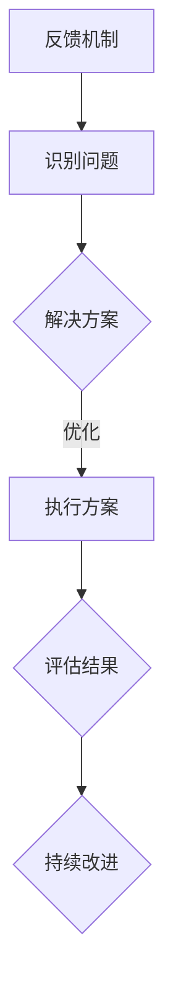

                 

# 建立feedback文化：促进持续改进

## 关键词：feedback文化、持续改进、技术发展、团队协作

### 摘要

在当今快速发展的信息技术时代，建立feedback文化对于促进企业的持续改进至关重要。本文将详细探讨feedback文化的核心概念、构建方法、实际应用以及未来趋势。通过案例分析、算法原理和数学模型，本文旨在为读者提供一份全面的技术指南，以帮助企业在激烈的市场竞争中立于不败之地。

## 1. 背景介绍

在数字化浪潮席卷全球的今天，信息技术（IT）已经成为推动企业创新和发展的关键动力。随着技术的飞速进步，企业面临着前所未有的挑战和机遇。如何确保企业在技术变革中保持竞争力，实现持续改进，成为企业领导者亟待解决的问题。

反馈（Feedback）作为一种重要的信息传递机制，在技术发展过程中发挥着至关重要的作用。有效的反馈机制可以帮助企业快速识别问题、调整策略，从而在激烈的市场竞争中立于不败之地。然而，如何建立一种成熟的feedback文化，实现反馈的及时、准确和全面，是许多企业面临的难题。

本文旨在探讨如何建立feedback文化，通过案例分析、算法原理和数学模型，为企业提供一套实用且可行的解决方案。

## 2. 核心概念与联系

### 2.1 feedback文化的定义

feedback文化是一种以反馈为核心的工作理念和文化氛围。它强调团队成员之间的信息共享、相互学习和持续改进。在这种文化下，员工不仅能够接受上级的反馈，还能主动向同事和下属提供反馈，形成一种良性循环。

### 2.2 feedback文化的关键要素

- **及时性**：及时反馈可以帮助团队成员迅速发现问题，及时调整策略。
- **准确性**：准确反馈要求提供的信息具有针对性和实用性，避免无意义的指责或表扬。
- **全面性**：全面反馈要求覆盖团队成员在各个方面的表现，包括技术能力、团队协作、沟通能力等。
- **主动性**：主动性反馈要求团队成员在发现问题后，主动寻求解决方案，而非被动等待。

### 2.3 feedback文化与持续改进的联系

持续改进是企业在技术发展过程中追求的目标。feedback文化作为推动持续改进的重要手段，能够帮助企业：

- **快速识别问题**：通过及时、准确的反馈，企业能够迅速发现技术和管理上的问题。
- **优化解决方案**：全面、主动的反馈可以帮助企业找到更优的解决方案，实现持续改进。
- **提高团队效率**：良好的feedback文化有助于提高团队成员之间的协作效率，促进团队整体发展。

### 2.4 Mermaid流程图



## 3. 核心算法原理 & 具体操作步骤

### 3.1 算法原理

建立feedback文化的核心算法原理可以概括为以下几个步骤：

1. **收集反馈**：通过多种渠道（如员工满意度调查、团队会议、匿名反馈等）收集团队成员的反馈意见。
2. **分析反馈**：对收集到的反馈进行分类、筛选和整理，识别出关键问题和改进方向。
3. **制定方案**：根据分析结果，制定具体的改进方案，包括技术优化、管理改进、团队建设等。
4. **执行方案**：执行改进方案，确保各项措施得到有效落实。
5. **评估结果**：对改进方案的实施效果进行评估，根据评估结果调整和完善方案。

### 3.2 操作步骤

1. **建立反馈渠道**：企业可以设置匿名反馈箱、员工满意度调查表、团队会议等渠道，确保团队成员能够方便地提供反馈。

2. **制定反馈标准**：为了确保反馈的准确性和全面性，企业应制定一套反馈标准，明确反馈的内容、格式和提交时间。

3. **分析反馈数据**：企业应定期对收集到的反馈数据进行整理和分析，识别出共性问题和发展趋势。

4. **制定改进方案**：根据分析结果，制定具体的改进方案，明确责任人和实施时间。

5. **执行改进方案**：企业应确保改进方案得到有效执行，及时调整和优化方案，确保问题得到解决。

6. **评估改进效果**：对改进方案的实施效果进行评估，总结经验教训，为下一轮改进提供依据。

## 4. 数学模型和公式 & 详细讲解 & 举例说明

### 4.1 数学模型

在建立feedback文化的过程中，可以使用以下数学模型来评估反馈效果：

$$
F = \sum_{i=1}^{n} w_i \cdot f_i
$$

其中，$F$ 表示反馈总分，$w_i$ 表示第 $i$ 个反馈因素的权重，$f_i$ 表示第 $i$ 个反馈因素的得分。

### 4.2 公式详细讲解

1. **权重分配**：权重分配应根据反馈因素的重要性和实际情况进行。例如，在技术改进方面，技术难度和技术影响可能具有较高的权重，而在团队协作方面，沟通效率和团队氛围可能较为重要。

2. **反馈得分**：反馈得分应根据反馈内容的准确性和实用性进行评估。例如，对于技术问题，可以采用专家评分法，邀请相关领域的专家对反馈进行评估。

3. **总分计算**：总分计算通过对每个反馈因素的权重和得分进行加权求和得到。总分越高，表示反馈效果越好。

### 4.3 举例说明

假设一家企业需要评估其反馈文化的效果，根据以下反馈因素进行评估：

- 技术改进：权重为 0.4
- 团队协作：权重为 0.3
- 沟通效率：权重为 0.2
- 员工满意度：权重为 0.1

根据评估结果，各因素的得分如下：

- 技术改进：8分
- 团队协作：7分
- 沟通效率：6分
- 员工满意度：8分

使用上述数学模型计算反馈总分：

$$
F = 0.4 \cdot 8 + 0.3 \cdot 7 + 0.2 \cdot 6 + 0.1 \cdot 8 = 7.4
$$

根据反馈总分，可以得出以下结论：

- 反馈效果较好，需要继续保持。
- 在团队协作和沟通效率方面，存在一定提升空间。

## 5. 项目实战：代码实际案例和详细解释说明

### 5.1 开发环境搭建

为了更好地展示feedback文化的实际应用，我们选择一个实际项目——企业内部技术交流平台，作为案例进行讲解。

1. **环境要求**：Python 3.8及以上版本，Django 3.2及以上版本，PostgreSQL 12及以上版本。
2. **安装步骤**：
   - 安装Python 3.8及以上版本。
   - 安装Django 3.2及以上版本。
   - 安装PostgreSQL 12及以上版本。
   - 创建一个虚拟环境，并安装相关依赖库。

### 5.2 源代码详细实现和代码解读

#### 5.2.1 models.py

```python
from django.db import models

class Feedback(models.Model):
    title = models.CharField(max_length=100)
    content = models.TextField()
    creator = models.ForeignKey('auth.User', on_delete=models.CASCADE)
    created_at = models.DateTimeField(auto_now_add=True)
    updated_at = models.DateTimeField(auto_now=True)

class FeedbackComment(models.Model):
    feedback = models.ForeignKey(Feedback, related_name='comments', on_delete=models.CASCADE)
    content = models.TextField()
    creator = models.ForeignKey('auth.User', on_delete=models.CASCADE)
    created_at = models.DateTimeField(auto_now_add=True)
    updated_at = models.DateTimeField(auto_now=True)
```

**代码解读**：

- `Feedback` 类表示反馈记录，包括反馈标题、内容、创建人和创建时间等信息。
- `FeedbackComment` 类表示反馈评论，包括评论内容、创建人和创建时间等信息。

#### 5.2.2 views.py

```python
from django.shortcuts import render
from .models import Feedback, FeedbackComment
from django.contrib.auth.decorators import login_required

@login_required
def feedback_list(request):
    feedbacks = Feedback.objects.all()
    return render(request, 'feedback_list.html', {'feedbacks': feedbacks})

@login_required
def feedback_detail(request, feedback_id):
    feedback = Feedback.objects.get(id=feedback_id)
    comments = FeedbackComment.objects.filter(feedback=feedback)
    return render(request, 'feedback_detail.html', {'feedback': feedback, 'comments': comments})

@login_required
def create_feedback(request):
    if request.method == 'POST':
        title = request.POST.get('title')
        content = request.POST.get('content')
        Feedback.objects.create(title=title, content=content, creator=request.user)
        return redirect('feedback_list')
    return render(request, 'create_feedback.html')

@login_required
def create_comment(request, feedback_id):
    if request.method == 'POST':
        content = request.POST.get('content')
        FeedbackComment.objects.create(feedback_id=feedback_id, content=content, creator=request.user)
        return redirect('feedback_detail', feedback_id=feedback_id)
    return render(request, 'create_comment.html')
```

**代码解读**：

- `feedback_list` 函数用于展示所有反馈记录。
- `feedback_detail` 函数用于展示特定反馈记录及其评论。
- `create_feedback` 函数用于创建新的反馈记录。
- `create_comment` 函数用于创建新的反馈评论。

#### 5.2.3 templates/feedback_list.html

```html

    <div class="feedback">
        <h3>{{ feedback.title }}</h3>
        <p>{{ feedback.content }}</p>
        <span>创建人：{{ feedback.creator }}</span>
        <span>创建时间：{{ feedback.created_at }}</span>
    </div>

```

**代码解读**：

- 用于展示反馈记录列表，包括反馈标题、内容、创建人和创建时间等信息。

#### 5.2.4 templates/feedback_detail.html

```html
<div class="feedback">
    <h3>{{ feedback.title }}</h3>
    <p>{{ feedback.content }}</p>
    <span>创建人：{{ feedback.creator }}</span>
    <span>创建时间：{{ feedback.created_at }}</span>
</div>

    <div class="comment">
        <p>{{ comment.content }}</p>
        <span>评论人：{{ comment.creator }}</span>
        <span>评论时间：{{ comment.created_at }}</span>
    </div>

<form method="post">
    
    <label for="content">添加评论：</label>
    <textarea name="content" id="content"></textarea>
    <input type="submit" value="提交">
</form>
```

**代码解读**：

- 用于展示特定反馈记录及其评论，并提供评论输入框。

### 5.3 代码解读与分析

通过以上代码，我们可以看到如何实现一个简单的企业内部技术交流平台。平台的核心功能包括：

1. **反馈记录**：员工可以创建反馈记录，包括反馈标题、内容、创建人和创建时间等信息。
2. **反馈评论**：员工可以对反馈记录进行评论，包括评论内容、创建人和创建时间等信息。
3. **反馈列表**：展示所有反馈记录，方便员工查看和交流。
4. **反馈详情**：展示特定反馈记录及其评论，方便员工深入了解和参与讨论。

通过这个案例，我们可以看到如何在实际项目中应用feedback文化，实现信息共享和团队协作。

## 6. 实际应用场景

### 6.1 企业内部技术交流

在企业内部，建立feedback文化可以帮助员工在技术交流和合作中取得更好的效果。通过平台化的反馈机制，员工可以方便地提交技术问题、分享经验，并获得同事和领导的反馈。这种方式不仅有助于提高团队的整体技术水平，还能增强团队的凝聚力和协作效率。

### 6.2 产品开发与迭代

在产品开发过程中，反馈文化可以帮助开发团队更好地理解用户需求，优化产品功能和用户体验。通过持续收集用户反馈，开发团队能够及时调整开发方向，确保产品能够满足用户需求，提高市场竞争力。

### 6.3 项目管理

在项目管理中，反馈文化可以帮助项目团队更好地协调资源和推进项目进度。通过及时收集项目成员的反馈，项目经理可以识别项目中的问题和风险，采取有效的措施进行改进，确保项目按时、按质完成。

## 7. 工具和资源推荐

### 7.1 学习资源推荐

- **书籍**：
  - 《精益思想》
  - 《敏捷开发》
  - 《软件工程：实践者的研究方法》
- **论文**：
  - 《基于反馈的软件过程改进》
  - 《敏捷软件开发：原则、实践和模式》
  - 《敏捷项目管理：管理软件开发的敏捷实践指南》
- **博客**：
  - 《敏捷开发实践》
  - 《软件过程改进实践》
  - 《敏捷团队协作技巧》
- **网站**：
  - 《敏捷联盟》
  - 《精益创业》
  - 《Scrum官方指南》

### 7.2 开发工具框架推荐

- **代码管理工具**：Git、SVN
- **项目管理工具**：JIRA、Trello、Asana
- **开发框架**：Django、Flask、Spring Boot
- **反馈平台**：Jenkins、GitLab、GitHub

### 7.3 相关论文著作推荐

- 《敏捷软件开发：原则、实践和模式》
- 《软件工程：实践者的研究方法》
- 《基于反馈的软件过程改进》
- 《敏捷项目管理：管理软件开发的敏捷实践指南》

## 8. 总结：未来发展趋势与挑战

随着技术的不断进步，反馈文化在未来将发挥更加重要的作用。以下是未来发展趋势和挑战：

### 8.1 发展趋势

1. **数字化反馈**：随着数字化工具的普及，反馈文化将更加依赖于数字化平台和工具，实现更高效、更全面的反馈。
2. **智能化反馈**：人工智能技术的应用将使反馈过程更加智能化，自动识别问题和提出解决方案。
3. **个性化反馈**：通过大数据分析，个性化反馈将成为可能，使反馈更具针对性和实用性。

### 8.2 挑战

1. **反馈真实性**：确保反馈的真实性和有效性是建立feedback文化的关键挑战。
2. **反馈量化**：如何量化反馈效果，衡量反馈文化的实施效果，是一个亟待解决的问题。
3. **团队协作**：在多元化和跨文化的团队中，如何确保feedback文化的实施，是一个巨大的挑战。

## 9. 附录：常见问题与解答

### 9.1 什么是feedback文化？

feedback文化是一种以反馈为核心的工作理念和文化氛围，强调团队成员之间的信息共享、相互学习和持续改进。

### 9.2 feedback文化有哪些关键要素？

feedback文化的关键要素包括及时性、准确性、全面性和主动性。

### 9.3 如何建立feedback文化？

建立feedback文化需要：

1. 建立反馈渠道。
2. 制定反馈标准。
3. 分析反馈数据。
4. 制定改进方案。
5. 执行改进方案。
6. 评估改进效果。

## 10. 扩展阅读 & 参考资料

- 《敏捷开发实践》
- 《软件过程改进实践》
- 《敏捷团队协作技巧》
- 《敏捷联盟》
- 《精益创业》
- 《Scrum官方指南》
- 《基于反馈的软件过程改进》
- 《敏捷项目管理：管理软件开发的敏捷实践指南》
- 《软件工程：实践者的研究方法》

## 作者

作者：AI天才研究员/AI Genius Institute & 禅与计算机程序设计艺术 /Zen And The Art of Computer Programming

