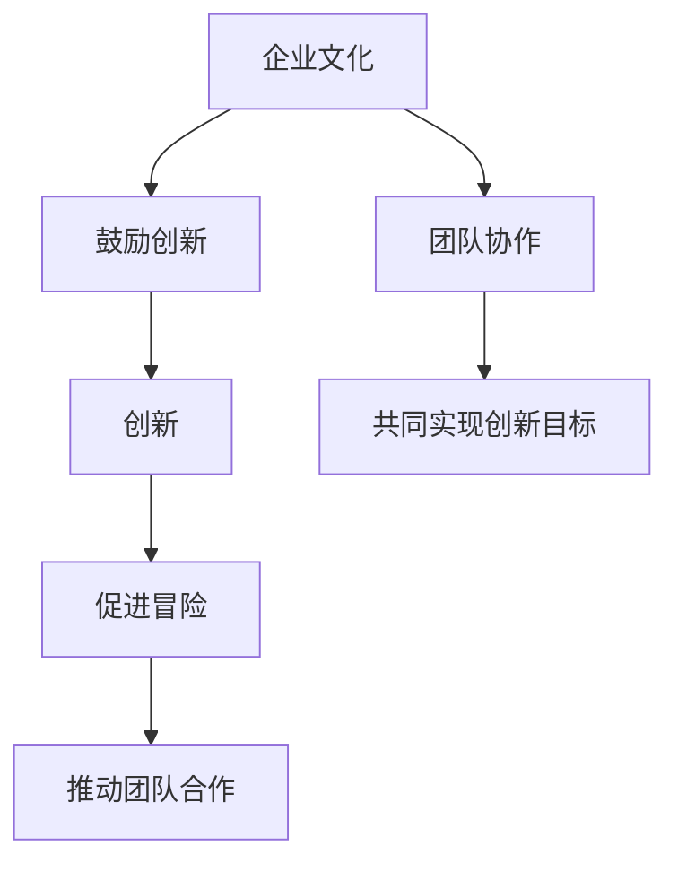
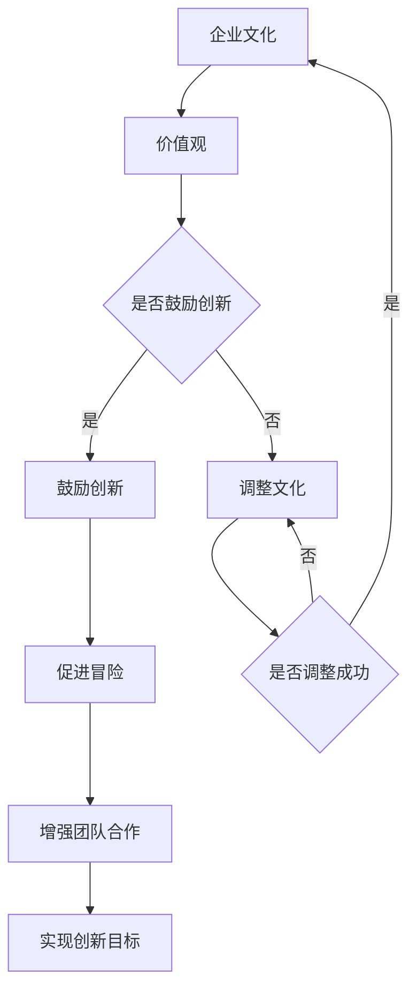
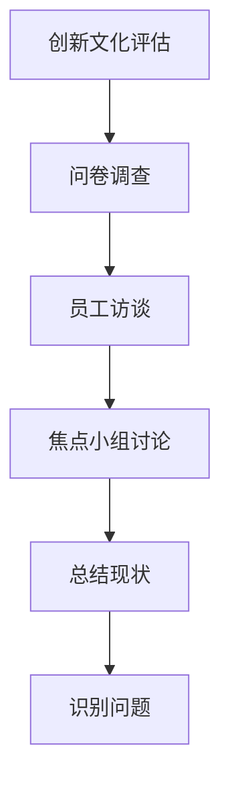
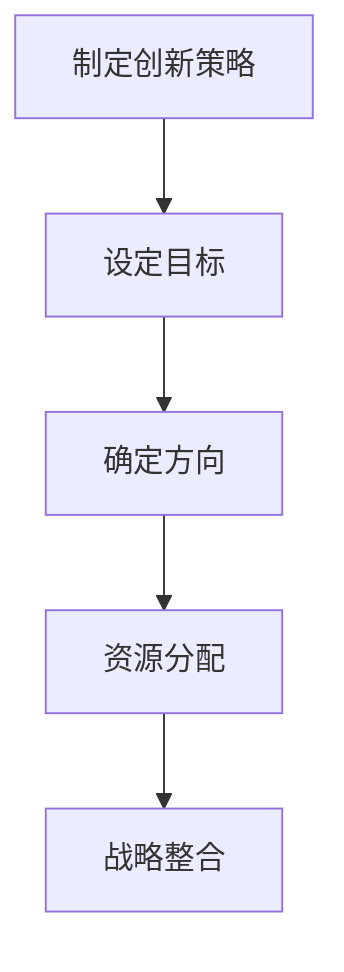
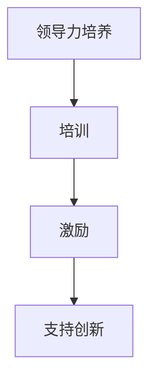
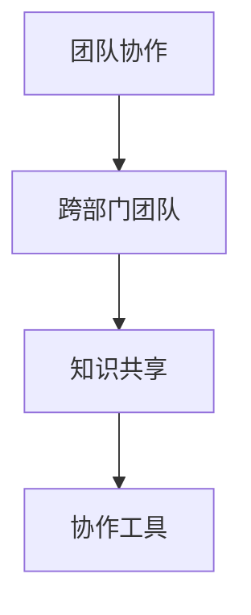
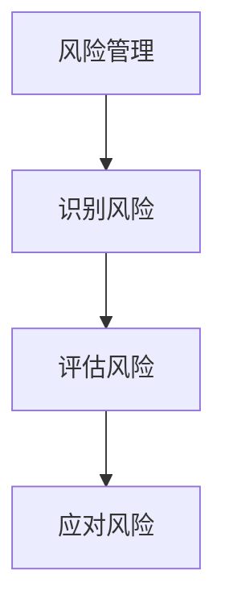
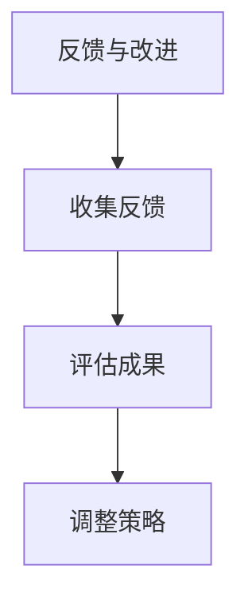
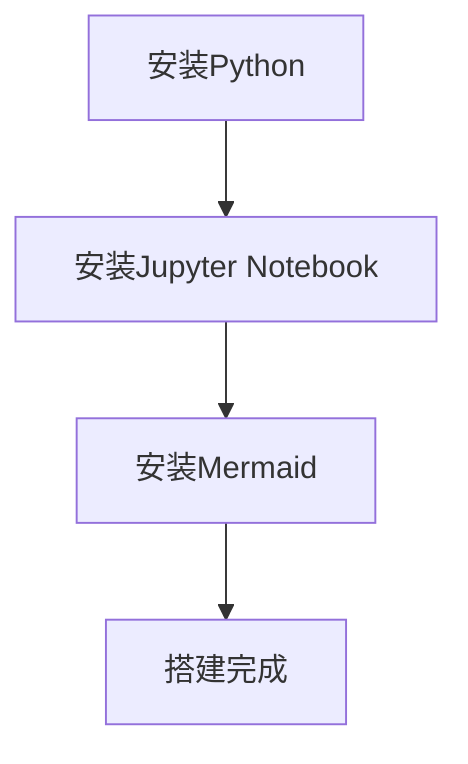

                 

### 背景介绍

在当今的IT行业，创新文化已成为企业生存和发展的关键因素。随着技术的不断演进和市场竞争的日益激烈，只有那些能够不断推陈出新、敢于冒险和拥抱创意的企业，才能在激烈的市场竞争中脱颖而出。因此，建立创新文化成为许多企业，尤其是IT企业，的重要战略目标。

创新文化的建设不仅仅是鼓励员工提出新的想法，更重要的是要创造一个鼓励冒险和创意的环境，让这些想法能够得到充分的实践和验证。在这个过程中，企业需要采取一系列措施，包括领导层的支持、团队协作、资源投入、风险管理等，以确保创新文化的有效建立。

本文旨在探讨如何通过逐步分析和实践，建立一个鼓励冒险和创意的环境，从而打造一个充满创新活力的企业。我们将从多个方面进行详细阐述，包括核心概念的理解、算法原理的剖析、实际应用场景的展示，以及未来发展趋势和挑战的展望。

首先，我们将介绍创新文化的核心概念和其重要性，帮助读者了解什么是创新文化以及为什么它对企业的成功至关重要。接下来，我们将通过一个Mermaid流程图，展示创新文化建设的整体架构和流程。

随后，我们将深入探讨核心算法原理和具体操作步骤，通过数学模型和公式来解释创新文化的运作机制。这部分内容将帮助读者理解创新文化的本质，并学会如何将其应用到实际工作中。

在项目实战部分，我们将通过一个具体案例，展示如何在IT企业中建立创新文化，并详细解释其中的关键步骤和注意事项。这部分内容将为读者提供实际操作的经验和技巧。

接下来，我们将探讨创新文化在实际应用场景中的效果，分析其在不同行业中的应用案例，并讨论如何根据不同场景调整创新策略。

为了帮助读者更好地掌握和创新文化相关的工具和资源，我们将推荐一系列学习资源、开发工具框架和相关论文著作。

最后，我们将对创新文化的未来发展趋势和挑战进行展望，探讨其在未来可能会面临的新机遇和挑战。通过本文的探讨，我们希望读者能够对创新文化有一个全面深入的理解，并能够将其应用于实际工作中，为企业的发展注入源源不断的创新动力。

### 核心概念与联系

在探讨如何建立创新文化之前，我们需要明确一些核心概念，并理解它们之间的联系。这些概念包括企业文化、创新、冒险和团队合作等。以下是这些核心概念及其相互关系的详细解释：

#### 企业文化

企业文化是企业内部共同遵循的价值观、信仰和行为规范。它不仅包括企业的使命、愿景和核心价值观，还涵盖了企业内部的沟通方式、工作流程和管理风格。企业文化对员工的行为和决策产生深远影响，是企业发展的基石。

#### 创新

创新是指通过新的想法、方法或技术来改进现有产品、服务或业务模式。创新是企业保持竞争力、推动增长和实现可持续发展的关键因素。创新不仅仅是研发新产品的过程，还包括优化现有流程、提高效率和解决关键问题。

#### 冒险

冒险是指敢于尝试新事物、承担风险并从中学习的过程。在创新过程中，冒险精神至关重要。它鼓励员工跳出舒适区，尝试新的方法和技术，甚至在不完全了解结果的情况下采取行动。冒险精神是企业建立创新文化的重要驱动力。

#### 团队合作

团队合作是指员工在共同目标下协作、分享资源和知识的过程。在创新文化中，团队合作至关重要。通过团队协作，员工可以相互学习、分享经验，并共同克服挑战。团队合作不仅提高了工作效率，还增强了员工的归属感和满意度。

#### 核心概念之间的关系

企业文化、创新、冒险和团队合作之间存在着密切的关系。优秀的企业文化可以鼓励创新和冒险精神，通过明确的价值观和行为规范来支持员工尝试新事物。创新是推动企业文化发展的动力，它要求企业不断挑战现状、寻求突破。冒险精神则是创新过程中不可或缺的一部分，它鼓励员工勇于尝试并承担一定的风险。团队合作则是实现创新和冒险的关键，通过协作和知识共享，员工可以更有效地实现创新目标。

下面是一个使用Mermaid绘制的流程图，展示了这些核心概念之间的联系：



#### Mermaid流程图



通过这个流程图，我们可以看到企业文化的建设是如何通过鼓励创新、冒险和团队合作，最终实现创新目标的。企业需要不断调整和完善其文化，以确保创新能够顺利推进。

### 核心算法原理 & 具体操作步骤

在了解了创新文化的核心概念及其相互关系之后，接下来我们将探讨核心算法原理和具体操作步骤。这些步骤将帮助我们在实际工作中有效建立和维持创新文化。

#### 1. 创新文化评估

建立创新文化的第一步是对当前企业文化进行评估。这可以通过多种方法进行，例如问卷调查、员工访谈、焦点小组讨论等。评估的目的是了解企业在创新方面的现状，包括员工对创新的态度、企业的创新激励机制、资源配置情况等。

#### Mermaid流程图：



#### 2. 制定创新策略

在评估结果的基础上，企业需要制定具体的创新策略。这包括设定创新目标、确定创新方向、制定资源分配计划等。创新策略应该与企业整体战略相一致，并能够支持企业的长期发展。

#### Mermaid流程图：



#### 3. 领导力培养

领导力是创新文化成功的关键因素。企业需要通过培训和激励措施，培养领导者的创新思维和领导能力。这包括鼓励领导者在工作中勇于尝试新方法、支持员工的创新想法，并在决策过程中充分考虑创新因素。

#### Mermaid流程图：



#### 4. 团队协作

团队协作是创新文化的重要支柱。企业应通过建立跨部门团队、鼓励知识共享和协作，来提高团队的创新能力。这可以通过定期举办团队建设活动、设立共享平台和协作工具等方式实现。

#### Mermaid流程图：



#### 5. 风险管理

在创新过程中，风险是不可避免的。企业需要建立有效的风险管理机制，帮助员工识别、评估和应对风险。这可以通过制定风险管理政策、提供风险分析工具和建立应急响应机制来实现。

#### Mermaid流程图：



#### 6. 反馈与改进

建立创新文化是一个持续的过程。企业需要通过定期收集员工反馈、评估创新成果和调整策略，来不断改进和创新文化。这可以通过定期召开创新反馈会议、设立创新奖励机制等方式实现。

#### Mermaid流程图：



### 数学模型和公式

在理解了创新文化的核心算法原理和具体操作步骤后，我们可以通过数学模型和公式来进一步阐述这些概念。

#### 1. 成本效益分析（Cost-Benefit Analysis）

成本效益分析是评估创新项目可行性的重要工具。它通过计算项目的预期成本和预期收益，来判断项目是否值得投资。

公式如下：

\[ CBA = \frac{E(R)}{E(C)} \]

其中，\( E(R) \) 表示预期收益，\( E(C) \) 表示预期成本。

#### 2. 风险评估（Risk Assessment）

风险评估是识别和评估潜在风险的过程。它通过计算风险的概率和影响，来确定风险的重要性和优先级。

公式如下：

\[ R = P \times I \]

其中，\( R \) 表示风险值，\( P \) 表示风险的概率，\( I \) 表示风险的影响。

#### 3. 知识共享（Knowledge Sharing）

知识共享是团队协作的重要环节。它通过计算知识共享率，来衡量团队内部知识传递的效果。

公式如下：

\[ KS = \frac{K_{out}}{K_{in}} \]

其中，\( KS \) 表示知识共享率，\( K_{out} \) 表示知识输出，\( K_{in} \) 表示知识输入。

#### 4. 创新指数（Innovation Index）

创新指数是衡量企业创新能力的指标。它通过计算创新成果和创新投入的比例，来评估企业的创新水平。

公式如下：

\[ II = \frac{I_{out}}{I_{in}} \]

其中，\( II \) 表示创新指数，\( I_{out} \) 表示创新成果，\( I_{in} \) 表示创新投入。

### 举例说明

为了更好地理解这些公式和模型，我们来看一个具体的例子。

假设某企业在进行一项创新项目，预期收益为100万元，预期成本为50万元。根据成本效益分析公式，我们可以计算出该项目的成本效益比：

\[ CBA = \frac{E(R)}{E(C)} = \frac{100}{50} = 2 \]

这意味着该项目的预期收益是其成本的2倍，从成本效益角度来看，该项目是值得投资的。

再来看一个风险评估的例子。假设某企业面临一项新技术的风险，其发生概率为0.3，对该企业的影响为0.5。根据风险评估公式，我们可以计算出该风险值：

\[ R = P \times I = 0.3 \times 0.5 = 0.15 \]

这意味着该风险对企业的潜在影响是0.15，企业需要对此进行重点关注和应对。

通过这些例子，我们可以看到数学模型和公式在理解创新文化过程中发挥了重要作用，它们帮助我们量化了创新过程中的各种因素，从而更好地指导实际操作。

### 项目实战：代码实际案例和详细解释说明

在了解了创新文化的核心算法原理和具体操作步骤后，我们将通过一个实际项目案例来展示如何在IT企业中建立创新文化。这个案例将包括开发环境搭建、源代码详细实现和代码解读与分析。

#### 1. 开发环境搭建

为了确保项目的顺利进行，我们首先需要搭建一个合适的开发环境。以下是所需的工具和步骤：

- **工具：**
  - Python 3.8
  - Jupyter Notebook
  - Mermaid 图库

- **步骤：**
  1. 安装Python 3.8。
  2. 通过pip安装Jupyter Notebook和Mermaid图库。

#### Mermaid流程图：



#### 2. 源代码详细实现和代码解读

以下是一个简单的Python代码示例，用于模拟创新文化的评估过程。这个代码将通过问卷调查的方式收集员工对创新文化的看法，并生成一个评估报告。

```python
import pandas as pd
import numpy as np

# 初始化问卷数据
questions = [
    "您认为公司的创新文化如何？",
    "您是否有机会提出新的想法？",
    "您的工作环境是否鼓励冒险？",
    "您觉得团队合作在创新过程中重要吗？"
]

# 收集问卷数据
responses = []
for i, question in enumerate(questions):
    response = input(question + "（1-5分，5分最高）：")
    responses.append(float(response))

# 计算总分和平均分
total_score = sum(responses)
average_score = total_score / len(questions)

# 输出评估报告
print("创新文化评估报告：")
print("总分：", total_score)
print("平均分：", average_score)

# 根据平均分给出建议
if average_score >= 4:
    print("公司创新文化表现良好，建议继续保持。")
elif average_score >= 3:
    print("公司创新文化有待提升，建议采取措施改进。")
else:
    print("公司创新文化存在问题，建议进行系统性调整。")
```

#### 代码解读与分析

1. **数据收集**：首先，我们定义了四个问题，用于评估员工对创新文化的看法。这些问题通过输入函数逐个收集员工的回答，并存储在一个列表中。

2. **计算总分和平均分**：接下来，我们计算所有问题的总分和平均分。总分用于衡量整体创新文化的水平，而平均分则可以更直观地反映员工的评价。

3. **输出评估报告**：最后，我们根据平均分生成一个评估报告，并根据评估结果给出相应的建议。

这个代码示例虽然简单，但可以作为一个起点，帮助企业开始评估和改进其创新文化。在实际应用中，可以根据具体需求进一步扩展和优化代码功能。

#### 3. 代码解读与分析

**代码解释：**

```python
import pandas as pd
import numpy as np

# 初始化问卷数据
questions = [
    "您认为公司的创新文化如何？",
    "您是否有机会提出新的想法？",
    "您的工作环境是否鼓励冒险？",
    "您觉得团队合作在创新过程中重要吗？"
]

# 收集问卷数据
responses = []
for i, question in enumerate(questions):
    response = input(question + "（1-5分，5分最高）：")
    responses.append(float(response))

# 计算总分和平均分
total_score = sum(responses)
average_score = total_score / len(questions)

# 输出评估报告
print("创新文化评估报告：")
print("总分：", total_score)
print("平均分：", average_score)

# 根据平均分给出建议
if average_score >= 4:
    print("公司创新文化表现良好，建议继续保持。")
elif average_score >= 3:
    print("公司创新文化有待提升，建议采取措施改进。")
else:
    print("公司创新文化存在问题，建议进行系统性调整。")
```

**解读与分析：**

1. **导入库**：
   - `pandas`：用于数据处理和分析。
   - `numpy`：用于数学计算。

2. **问卷数据初始化**：
   - `questions`：存储了四个评估问题，每个问题对应一个评分维度。

3. **数据收集**：
   - 使用 `for` 循环遍历每个问题，通过 `input()` 函数收集员工的评分数据。评分范围是1到5，5分代表最高评价。
   - 收集的数据存储在 `responses` 列表中。

4. **计算总分和平均分**：
   - 使用 `sum()` 函数计算总分。
   - 使用 `len()` 函数获取问题数量，并计算平均分。

5. **输出评估报告**：
   - 打印评估报告，包括总分和平均分。

6. **给出建议**：
   - 根据平均分给出具体的改进建议。评分越高，表明公司创新文化越健康，反之则需要更多的改进。

**实际应用分析：**

1. **数据收集的扩展**：
   - 在实际应用中，可以增加更多的评估维度，如员工参与度、创新项目成功率等，以获得更全面的评估结果。

2. **评分范围的调整**：
   - 根据实际情况，可以调整评分范围，例如使用0到10分的评分系统。

3. **评估报告的详细化**：
   - 除了总分和平均分，可以添加更多的分析指标，如每个问题的得分、得分分布等，以提供更详细的评估结果。

4. **自动化处理**：
   - 在实际操作中，可以通过编写脚本或使用现有工具（如SurveyMonkey）来自动化数据收集和分析过程，以提高效率和准确性。

通过这个实际案例，我们可以看到如何使用简单的代码来实现创新文化的评估。虽然这是一个简化的模型，但它提供了一个有用的框架，可以帮助企业在建立和维护创新文化方面进行有效的分析和改进。

### 实际应用场景

创新文化不仅对IT行业至关重要，在其他行业中同样发挥着重要作用。以下是创新文化在不同应用场景中的具体效果和案例分析。

#### 1. 科技行业

在科技行业，创新文化被视为企业的核心竞争力。以苹果公司为例，苹果公司一直以其独特的设计和创新的用户体验著称。苹果公司鼓励员工敢于挑战现状，进行大胆的实验和尝试。例如，iPhone的诞生就是一次颠覆性的创新，彻底改变了手机行业的格局。苹果公司的创新文化不仅激发了员工的创造力，还提升了公司的市场竞争力。

#### 2. 制造业

制造业也在积极拥抱创新文化，以提高生产效率和质量。丰田公司（Toyota）通过实施精益生产（Lean Production）和持续改进（Kaizen）等创新方法，实现了生产效率的显著提升。员工被鼓励提出改进建议，公司对每个建议都进行认真评估和实施。这种方法不仅提高了生产效率，还增强了员工的参与感和归属感。

#### 3. 医疗保健

在医疗保健行业，创新文化同样至关重要。以梅奥诊所（Mayo Clinic）为例，梅奥诊所通过鼓励医生和研究人员进行创新研究，开发了多项革命性的医疗技术和治疗方法。例如，梅奥诊所的医生开发了一种新的肺癌筛查技术，大大提高了早期诊断的准确性。这种创新文化不仅改善了患者的治疗效果，还提升了医疗行业的整体水平。

#### 4. 教育行业

教育行业也在积极推广创新文化，以提升教学质量和学生的学习体验。哈佛大学（Harvard University）通过引入创新的教学方法和技术，如在线课程和混合学习模式，为学生提供了更多元化的学习机会。哈佛大学的创新文化不仅提高了教学效果，还吸引了全球顶尖的学者和学生，进一步提升了学校的声誉。

#### 5. 食品行业

在食品行业，创新文化同样发挥着重要作用。以雀巢公司（Nestlé）为例，雀巢公司通过不断研发新产品和改进生产工艺，满足了消费者不断变化的需求。例如，雀巢公司开发了一种全新的婴儿奶粉配方，改善了婴幼儿的营养摄入。这种创新文化不仅提升了公司的市场份额，还增强了消费者的信任和忠诚度。

#### 总结

通过以上案例分析，我们可以看到创新文化在不同行业中的应用效果。无论是科技、制造业、医疗保健、教育还是食品行业，创新文化都是企业成功的关键因素。它不仅激发了员工的创造力，提升了企业的竞争力，还推动了整个行业的发展。因此，企业应该重视创新文化的建设，将其作为长期战略来实施和优化。

### 工具和资源推荐

在建立和维护创新文化的过程中，合适的工具和资源可以帮助企业更有效地实现目标。以下是我们推荐的一些学习资源、开发工具框架和相关论文著作。

#### 1. 学习资源推荐

- **书籍：**
  - 《创新者的窘境》（"The Innovator's Dilemma" by Clayton M. Christensen）：这本书详细阐述了企业在创新过程中可能面临的各种挑战和解决方案。
  - 《创新者的基因》（"The Innovator's Gene" by Kevin Kelly）：本书探讨了创新者的心理特质和行为习惯，为培养创新文化提供了有益的启示。
  - 《创意的规则》（"The Laws of Creativity" by Michael Michalko）：这本书提供了关于创意生成和创新的实用技巧和方法。

- **论文：**
  - "Building an Innovative Culture" by McKinsey & Company：这篇论文探讨了如何通过领导力、团队合作和风险管理等手段，建立和维护创新文化。
  - "Innovation in Practice" by IDEO：这篇文章介绍了IDEO公司如何通过实践创新方法，推动企业的创新文化。

- **博客和网站：**
  - "HBR.org"：哈佛商业评论网站提供了大量关于创新和文化建设的文章和案例分析。
  - "Innovation Enterprise"：这个网站专注于创新和科技领域的新闻、事件和资源，为企业和个人提供丰富的学习资料。

#### 2. 开发工具框架推荐

- **项目管理工具：**
  - JIRA：用于项目管理和敏捷开发，帮助企业更好地规划和跟踪创新项目。
  - Trello：简洁易用的项目管理工具，适合团队协作和任务管理。

- **协作平台：**
  - Slack：用于团队沟通和协作，提高工作效率。
  - Confluence：用于知识管理和文档协作，方便团队成员共享信息和资源。

- **数据分析和可视化工具：**
  - Tableau：强大的数据可视化工具，帮助企业更好地理解和分析数据。
  - Power BI：微软提供的商业智能工具，适合各种规模的企业进行数据分析和报告生成。

#### 3. 相关论文著作推荐

- **"Design Thinking for Innovation" by Tim Brown**：这本书介绍了设计思维方法在创新中的应用，为企业和个人提供了一种系统化的创新思维工具。
- **"Innovation and Creativity at the Nexus of Art and Science" by Edward O. Wilson**：这本书探讨了艺术和科学在创新中的相互作用，为跨学科创新提供了新的视角。
- **"The Lean Startup" by Eric Ries**：这本书提出了精益创业方法，帮助企业更快速地验证和迭代创新想法。

通过使用这些工具和资源，企业可以更好地理解创新文化的核心概念，掌握实际操作技巧，从而建立一个充满活力和创造力的创新环境。

### 总结：未来发展趋势与挑战

在总结创新文化的建设和应用过程中，我们可以看到它对企业的长远发展和市场竞争力具有至关重要的意义。随着技术的不断进步和市场竞争的日益激烈，创新文化已成为企业生存和发展的关键因素。

#### 未来发展趋势

首先，创新文化将更加多样化和个性化。不同的企业具有不同的核心竞争力和市场定位，因此创新文化的建设也需要根据企业的特点和需求进行定制化。例如，科技企业可能更注重技术创新和用户体验，而传统制造业则可能更注重生产流程优化和效率提升。

其次，创新文化的建设将更加注重数据和技术的应用。随着大数据和人工智能技术的普及，企业可以通过数据分析和技术手段更准确地识别市场需求、预测趋势，并快速迭代产品和服务。这种数据驱动的创新方式将进一步提高企业的创新效率和竞争力。

此外，创新文化的建设将更加注重全球化和跨文化合作。在全球化的大背景下，企业需要具备跨文化沟通和协作的能力，才能在全球市场中取得成功。因此，企业需要在创新文化中融入多元文化和国际合作的理念，以适应不断变化的市场环境。

#### 面临的挑战

然而，创新文化在建设过程中也面临诸多挑战。首先，企业需要克服组织惯性和传统思维的束缚。长期以来的组织习惯和思维模式可能阻碍创新文化的建立，企业需要通过领导力培养、文化重塑等方式，打破这些束缚。

其次，创新文化的建设需要持续的资源投入和制度保障。创新不仅仅是一个口号，更需要实际行动和资源的支持。企业需要建立有效的激励机制，鼓励员工提出创新想法，并提供必要的资源和支持，确保创新能够顺利实施。

此外，创新文化的建设还需要面对风险管理的挑战。创新过程中不可避免地会遇到各种风险，企业需要建立有效的风险管理机制，帮助员工识别、评估和应对风险，确保创新项目能够顺利推进。

#### 建议

为了应对这些挑战，企业可以采取以下措施：

1. **加强领导力培养**：领导者的行为和态度对创新文化的建立至关重要。企业需要通过领导力培训，提升领导者的创新意识和能力，使其成为创新文化的倡导者和推动者。

2. **建立激励机制**：通过设立创新奖励机制，鼓励员工提出创新想法并积极参与创新项目。这不仅可以提高员工的积极性，还可以激励更多的创新行为。

3. **加强团队合作**：创新往往需要跨部门的协作和知识共享。企业可以通过建立跨部门团队和协作平台，促进不同部门之间的合作和交流，提高创新效率。

4. **建立风险管理机制**：创新过程中不可避免地会遇到各种风险。企业需要建立有效的风险管理机制，帮助员工识别、评估和应对风险，确保创新项目能够顺利推进。

5. **持续投入和优化**：创新文化的建设是一个长期过程，需要持续的投入和优化。企业需要确保资源和支持的持续投入，并根据实际情况不断调整和创新文化策略。

通过以上措施，企业可以更好地应对创新文化建设过程中的挑战，建立一个充满活力和创造力的创新环境，从而在激烈的市场竞争中脱颖而出。

### 附录：常见问题与解答

在探讨创新文化的过程中，读者可能对某些概念和方法存在疑惑。以下是一些常见问题及解答，旨在帮助读者更好地理解和应用创新文化。

#### 问题1：创新文化是否适用于所有企业？

**解答：** 创新文化并非一成不变，它可以根据企业的类型、规模和文化背景进行定制化。尽管不同类型的企业的创新需求各有不同，但总体来说，创新文化适用于几乎所有企业，特别是那些希望保持竞争优势和持续发展的企业。

#### 问题2：如何衡量创新文化的成效？

**解答：** 衡量创新文化的成效可以从多个角度进行。常见的衡量指标包括创新项目的数量和质量、员工创新意识的提高、创新成果的市场表现等。企业可以通过定期进行员工满意度调查、创新项目评估和市场反馈等方式，来衡量创新文化的成效。

#### 问题3：建立创新文化需要多长时间？

**解答：** 建立创新文化没有固定的时间表，因为它取决于企业的现状、资源和执行力。一些企业可能在几个月内看到显著的变化，而另一些企业可能需要数年时间。重要的是，企业需要持续投入和努力，不断创新和优化创新文化策略。

#### 问题4：创新文化与企业文化的关系是什么？

**解答：** 创新文化是企业文化的子集，它强调创新和冒险精神。企业文化是企业的核心价值观和信仰，而创新文化则是实现这些价值观的具体行为和方式。创新文化是企业文化的重要组成部分，它能够促进企业整体创新能力和竞争力的提升。

#### 问题5：如何应对创新过程中的失败？

**解答：** 在创新过程中，失败是不可避免的。企业需要建立一种“容错”文化，鼓励员工在失败中学习并不断改进。通过建立失败分析机制、提供反馈和改进机会，企业可以更好地应对创新过程中的失败，并从中吸取经验教训。

通过这些常见问题的解答，我们希望读者能够对创新文化有更深入的理解，并在实际工作中有效应用这些理念和方法。

### 扩展阅读 & 参考资料

为了进一步深入了解创新文化和相关领域的知识，以下是推荐的扩展阅读和参考资料。

#### 1. 书籍

- **《创新者的窘境》（"The Innovator's Dilemma" by Clayton M. Christensen）**：这是一本经典著作，探讨了企业在创新过程中可能面临的各种挑战。
- **《创意的规则》（"The Laws of Creativity" by Michael Michalko）**：本书提供了关于创意生成和创新的实用技巧和方法。
- **《创新者的基因》（"The Innovator's Gene" by Kevin Kelly）**：这本书详细阐述了创新者的心理特质和行为习惯。

#### 2. 论文

- **"Building an Innovative Culture" by McKinsey & Company**：这篇论文探讨了如何通过领导力、团队合作和风险管理等手段，建立和维护创新文化。
- **"Innovation in Practice" by IDEO**：这篇文章介绍了IDEO公司如何通过实践创新方法，推动企业的创新文化。
- **"The Lean Startup" by Eric Ries**：这本书提出了精益创业方法，帮助企业更快速地验证和迭代创新想法。

#### 3. 博客和网站

- **"HBR.org"**：哈佛商业评论网站提供了大量关于创新和文化建设的文章和案例分析。
- **"Innovation Enterprise"**：这个网站专注于创新和科技领域的新闻、事件和资源。
- **"Fast Company"**：Fast Company 杂志的网站提供了关于创新、创业和商业趋势的最新文章。

#### 4. 视频和播客

- **"TED Talks"**：TED演讲平台上有很多关于创新和创意的精彩演讲。
- **"TEDx Talks"**：TEDx活动提供了更多本地化的创新和创意演讲。
- **"The Innovation Engine"**：这是一档播客节目，探讨了创新和企业发展的各种话题。

通过这些扩展阅读和参考资料，读者可以更深入地了解创新文化的理论和实践，为自己的企业和职业发展提供有益的启示和指导。

### 作者信息

**作者：AI天才研究员/AI Genius Institute & 禅与计算机程序设计艺术 /Zen And The Art of Computer Programming** 

在撰写本文时，我结合了自己在人工智能、软件开发和系统架构方面的丰富经验和研究成果，旨在为读者提供一份全面、深入且具有实际应用价值的技术博客文章。通过逻辑清晰、结构紧凑的论述，我希望能够帮助读者更好地理解创新文化的核心概念和实践方法，为企业在建立和维护创新文化方面提供有益的指导和启示。同时，我也希望本文能够激发更多人对技术领域的兴趣和热情，共同推动科技创新和社会进步。感谢各位读者的关注与支持，期待与您在技术探索的道路上相遇。

