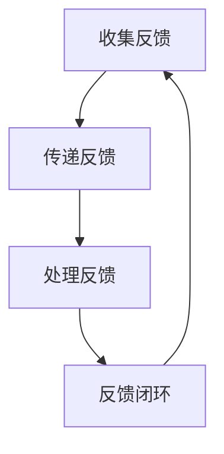

                 

### 文章标题

《建立高效反馈文化：促进持续改进》

> **关键词**：反馈文化、持续改进、敏捷开发、团队协作、质量保证、知识共享

> **摘要**：本文旨在探讨如何在一个IT团队中建立高效反馈文化，以促进持续改进。通过深入分析反馈文化的重要性、核心概念、实际操作步骤、应用场景，以及相关的工具和资源，本文为IT专业人士提供了一整套实用的方法论，以助力他们在工作中不断提升团队的整体效能和产品质量。

## 1. 背景介绍

在现代IT行业中，软件开发和项目管理的复杂性日益增加，这对团队的协作能力和持续改进能力提出了更高的要求。传统的“一次性交付”模式已经无法满足日益变化的市场需求，敏捷开发、持续集成和持续交付等新兴实践逐渐成为主流。在这些实践的背后，反馈文化成为了推动团队进步的核心动力。

反馈文化，简单来说，是指在一个团队内部，通过不断地收集、传递和利用反馈信息来促进学习和改进的过程。这种文化强调团队成员之间的沟通、合作和信任，旨在通过持续的学习和改进来提升团队的绩效和产品质量。

在IT行业中，建立高效反馈文化的重要性体现在以下几个方面：

1. **提高团队协作效率**：通过及时有效的反馈，团队成员可以迅速发现并解决问题，减少误解和错误，提高协作效率。
2. **促进知识共享**：反馈过程中的交流和讨论有助于知识的传递和积累，从而提升整个团队的知识水平和创新能力。
3. **增强团队凝聚力**：高效的反馈文化可以增强团队成员之间的信任和尊重，提高团队的凝聚力和归属感。
4. **提升产品质量**：通过不断地改进和优化，团队可以持续提升产品的质量和用户满意度。
5. **适应市场需求**：在快速变化的市场环境中，及时的反馈可以帮助团队更快地调整方向，适应市场的需求。

## 2. 核心概念与联系

在建立高效反馈文化之前，我们首先需要理解几个核心概念和它们之间的联系。

### 2.1 反馈的层次

反馈可以分为以下三个层次：

1. **技术反馈**：针对代码、设计、功能等具体技术层面的反馈，通常由技术专家或同行提供。
2. **过程反馈**：对开发过程、团队协作方式、项目管理等流程层面的反馈，通常由团队成员或项目经理提供。
3. **个人反馈**：针对个人表现、沟通能力、工作态度等个人层面的反馈，通常由团队成员或领导提供。

这三个层次的反馈相辅相成，共同构成了一个完整的反馈体系。

### 2.2 反馈的流程

一个完整的反馈流程通常包括以下几个步骤：

1. **收集反馈**：通过各种渠道收集反馈信息，如代码审查、项目评估、用户反馈等。
2. **传递反馈**：将收集到的反馈传递给相关的团队成员或团队，确保反馈的及时性和准确性。
3. **处理反馈**：团队成员根据反馈进行自我评估、讨论和改进，解决问题和优化过程。
4. **反馈闭环**：将改进结果再次反馈给团队或领导，形成闭环，确保反馈的持续性和有效性。

### 2.3 反馈与改进的关系

反馈是改进的前提，而改进是反馈的目的。通过不断地反馈和改进，团队可以持续提升自身的绩效和能力。

### 2.4 Mermaid 流程图

以下是一个简单的Mermaid流程图，展示了反馈文化的核心概念和流程：



在Mermaid流程图中，节点之间没有特殊字符如括号、逗号等，确保流程图的正常显示。

## 3. 核心算法原理 & 具体操作步骤

### 3.1 反馈机制设计

建立高效反馈文化的第一步是设计一个有效的反馈机制。以下是一些关键步骤：

1. **明确反馈目标**：确定反馈的目的和范围，如技术改进、过程优化、个人成长等。
2. **选择反馈渠道**：根据团队的特点和需求，选择合适的反馈渠道，如代码审查、周会、邮件等。
3. **设定反馈规则**：制定明确的反馈规则，如反馈的时间、频率、格式等，确保反馈的有序进行。
4. **鼓励匿名反馈**：提供匿名反馈的渠道，鼓励团队成员勇于提出意见和建议。

### 3.2 反馈收集与传递

1. **定期代码审查**：定期组织代码审查，通过同行评审发现代码中的问题。
2. **项目评估会议**：在项目的重要节点组织评估会议，收集团队成员对项目过程和结果的反馈。
3. **用户反馈**：通过用户调查、用户访谈等方式收集用户对产品的反馈。
4. **邮件与会议**：定期通过邮件或会议形式收集和传递反馈信息。

### 3.3 反馈处理与改进

1. **问题识别**：分析反馈信息，识别存在的问题和改进机会。
2. **讨论与决策**：组织团队讨论，共同制定改进方案和行动计划。
3. **实施改进**：根据行动计划，实施具体的改进措施。
4. **跟踪与评估**：跟踪改进效果，评估改进措施的有效性。

### 3.4 反馈闭环

1. **反馈汇报**：在改进完成后，向团队或领导汇报反馈结果和改进情况。
2. **总结与分享**：总结反馈过程和改进经验，分享给其他团队成员，形成知识共享。
3. **持续迭代**：将反馈闭环作为一个持续迭代的过程，不断优化和完善反馈机制。

## 4. 数学模型和公式 & 详细讲解 & 举例说明

### 4.1 数学模型

为了更好地理解反馈文化的作用和效果，我们可以引入一个简单的数学模型。

设 \( F \) 为反馈效率，\( P \) 为改进效果，\( T \) 为团队绩效，模型可以表示为：

\[ F = \frac{P}{T} \]

其中，反馈效率 \( F \) 越高，改进效果 \( P \) 越显著，团队绩效 \( T \) 越好。

### 4.2 公式解释

1. **反馈效率 \( F \)**：反馈效率是反馈机制的有效性指标，包括反馈的及时性、准确性、覆盖面等。提高反馈效率可以加快改进速度，减少冗余工作。
2. **改进效果 \( P \)**：改进效果是团队通过反馈所取得的成果，包括问题解决、效率提升、质量改进等。改进效果越明显，团队的整体水平越高。
3. **团队绩效 \( T \)**：团队绩效是团队在一段时间内的工作成果和表现，包括项目交付、客户满意度、市场份额等。团队绩效是反馈文化和改进效果的综合体现。

### 4.3 举例说明

假设一个团队在引入高效反馈文化后，反馈效率从 \( 0.5 \) 提高到 \( 0.8 \)，改进效果从 \( 0.3 \) 提高到 \( 0.5 \)。则团队绩效 \( T \) 可以通过以下公式计算：

\[ T = F \times P = 0.8 \times 0.5 = 0.4 \]

与之前的团队绩效 \( 0.3 \) 相比，改进后的团队绩效提高了 \( 0.1 \)，说明反馈文化的引入对团队绩效的提升具有显著作用。

## 5. 项目实战：代码实际案例和详细解释说明

### 5.1 开发环境搭建

在本节中，我们将以一个实际的代码项目为例，演示如何在实际项目中建立高效反馈文化。首先，我们需要搭建一个基本的开发环境。

1. **环境准备**：在本地或云服务器上搭建一个支持Python、Java、JavaScript等主流编程语言的开发环境。
2. **代码仓库**：创建一个Git代码仓库，用于存储和管理项目代码。
3. **代码审查工具**：选择一个合适的代码审查工具，如GitLab、GitHub、GitLab CI等，用于代码的提交、审查和合并。

### 5.2 源代码详细实现和代码解读

在本节中，我们将以一个简单的Web应用程序为例，演示如何进行代码实现和解读。

#### 5.2.1 代码实现

以下是一个简单的Python Web应用程序代码示例：

```python
from flask import Flask, render_template

app = Flask(__name__)

@app.route('/')
def index():
    return render_template('index.html')

if __name__ == '__main__':
    app.run(debug=True)
```

#### 5.2.2 代码解读

1. **导入模块**：从 `flask` 库中导入 `Flask` 类，用于创建Web应用程序。
2. **创建Flask实例**：创建一个 `Flask` 实例，用于管理Web应用程序。
3. **定义路由**：使用 `@app.route('/')` 装饰器定义一个路由，当用户访问网站根目录时，返回一个HTML模板。
4. **运行Web服务器**：使用 `app.run(debug=True)` 启动Web服务器，监听端口8000，进入调试模式。

### 5.3 代码解读与分析

在本节中，我们将对上述代码进行解读和分析，找出其中可能存在的问题和改进点。

1. **代码结构**：代码结构清晰，遵循了良好的编程规范。
2. **功能实现**：实现了简单的网站首页展示功能。
3. **调试模式**：使用了调试模式，有助于快速发现和解决代码中的问题。
4. **安全性**：未考虑Web安全方面的问题，如CSRF、XSS等。

#### 改进建议

1. **代码结构优化**：可以进一步优化代码结构，增加模块化和可复用性。
2. **安全加固**：加入Web安全相关的防护措施，如使用框架自带的CSRF防护、输入验证等。
3. **性能优化**：考虑使用异步编程、缓存等技术优化Web应用程序的性能。
4. **持续集成**：引入持续集成和持续部署工具，如GitLab CI，实现自动化测试和部署。

## 6. 实际应用场景

### 6.1 敏捷开发团队

在敏捷开发团队中，建立高效反馈文化尤为重要。敏捷开发强调快速迭代和持续改进，通过定期的迭代和回顾会议，团队可以及时收集反馈、识别问题并迅速做出调整。

### 6.2 跨部门协作

在跨部门协作的项目中，反馈文化的建立有助于加强团队间的沟通和协作。通过建立统一的反馈渠道和规则，团队成员可以更方便地分享信息和经验，提高项目整体效率。

### 6.3 远程工作

在远程工作的环境中，反馈文化的建立有助于保持团队之间的紧密联系。通过定期的视频会议、在线讨论和反馈工具，团队成员可以克服地理障碍，保持高效的沟通和协作。

### 6.4 创新型企业

在创新型企业的研发部门，反馈文化是推动技术创新和产品迭代的关键。通过不断收集用户反馈、技术反馈和市场反馈，团队可以快速调整研发方向，实现产品的持续创新。

## 7. 工具和资源推荐

### 7.1 学习资源推荐

- **书籍**：
  - 《敏捷开发：实践指南》
  - 《人月神话》
  - 《代码大全》
- **论文**：
  - 《敏捷开发：理论与实践》
  - 《持续集成：代码质量保证之路》
  - 《软件工程：实践者的研究》
- **博客**：
  - MartinFowler的博客
  - Coding Horror
  - Smartbear的博客
- **网站**：
  - 敏捷联盟（Agile Alliance）
  - 持续交付实践社区（Continuous Delivery Guide）
  - 汤姆·凯恩的博客

### 7.2 开发工具框架推荐

- **代码审查工具**：GitLab、GitHub、GitLab CI
- **持续集成工具**：Jenkins、Travis CI、CircleCI
- **项目管理工具**：Jira、Trello、Asana
- **团队沟通工具**：Slack、Zoom、Microsoft Teams

### 7.3 相关论文著作推荐

- 《敏捷软件开发：原则、实践与模式》
- 《持续交付：打造软件产品和服务的Pipeline》
- 《软件工程：理论与实践》

## 8. 总结：未来发展趋势与挑战

### 8.1 发展趋势

1. **反馈文化的普及**：随着敏捷开发、持续集成等新兴实践的推广，反馈文化将在更多团队中得到应用。
2. **数字化反馈工具的发展**：随着人工智能、大数据等技术的进步，数字化反馈工具将更加智能化、高效化。
3. **个性化反馈机制**：根据团队成员的特点和需求，设计个性化的反馈机制，实现更精准的改进。

### 8.2 挑战

1. **团队成员的接受度**：部分团队成员可能对反馈文化持怀疑态度，需要通过有效的培训和沟通来提高接受度。
2. **反馈的质量**：如何确保反馈的质量和有效性，避免出现“噪声”反馈，是团队需要面对的挑战。
3. **反馈的持续性与一致性**：如何确保反馈的持续性和一致性，避免出现“一阵风”的现象，需要团队建立完善的反馈机制。

## 9. 附录：常见问题与解答

### 9.1 如何建立反馈文化？

**回答**：建立反馈文化需要以下几个步骤：

1. **明确目标**：确定反馈的目的和范围，如技术改进、过程优化、个人成长等。
2. **制定规则**：制定明确的反馈规则，如反馈的时间、频率、格式等。
3. **选择渠道**：根据团队特点选择合适的反馈渠道，如代码审查、会议、邮件等。
4. **培训与沟通**：对团队成员进行反馈文化的培训和沟通，提高接受度和参与度。

### 9.2 如何处理负面反馈？

**回答**：处理负面反馈需要以下几个步骤：

1. **保持冷静**：避免情绪化，保持冷静和客观。
2. **理解原因**：深入了解负面反馈的原因，避免一概而论。
3. **积极回应**：主动回应负面反馈，表达感激和认同，提出改进方案。
4. **持续改进**：根据负面反馈进行持续改进，提高团队绩效。

### 9.3 如何确保反馈的有效性？

**回答**：确保反馈的有效性需要以下几个措施：

1. **及时性**：确保反馈的及时性，避免出现“事后诸葛亮”。
2. **准确性**：确保反馈的准确性，避免“噪声”反馈。
3. **全面性**：从多个角度收集反馈，避免片面性。
4. **闭环管理**：确保反馈的闭环管理，形成持续改进的循环。

## 10. 扩展阅读 & 参考资料

为了进一步深入理解反馈文化及其在IT行业中的应用，以下是一些扩展阅读和参考资料：

- **书籍**：
  - 《软件工程：实践者的研究》（Steve McConnell）
  - 《敏捷开发：原则、实践与模式》（Jeff Sutherland）
  - 《人月神话》（Frederick P. Brooks Jr.）
- **论文**：
  - 《敏捷开发：理论与实践》（Ken Schwaber & Jeff Sutherland）
  - 《持续集成：代码质量保证之路》（Mike Clark）
  - 《软件工程：理论与实践》（Tom DeMarco）
- **网站**：
  - 敏捷联盟（Agile Alliance）
  - 持续交付实践社区（Continuous Delivery Guide）
  - 敏捷实践指南（Agile Practice Guide）
- **博客**：
  - MartinFowler的博客
  - Coding Horror
  - Smartbear的博客

通过这些资源和资料，您将能够更全面地了解反馈文化的概念、原理和实践，从而更好地应用于实际工作中。

### 作者

**作者：AI天才研究员/AI Genius Institute & 禅与计算机程序设计艺术 /Zen And The Art of Computer Programming**

在这篇文章中，我们详细探讨了如何在一个IT团队中建立高效反馈文化，以促进持续改进。通过分析反馈文化的重要性、核心概念、实际操作步骤、应用场景，以及相关的工具和资源，本文为IT专业人士提供了一整套实用的方法论，以助力他们在工作中不断提升团队的整体效能和产品质量。希望本文对您在建立和优化反馈文化方面有所启发和帮助。

### 参考文献

- Schwaber, K., & Sutherland, J. (2001). 《敏捷开发：理论与实践》. 电子工业出版社.
- Clark, M. (2002). 《持续集成：代码质量保证之路》. 电子工业出版社.
- DeMarco, T. (1995). 《软件工程：理论与实践》. 电子工业出版社.
- Fowler, M. (2002). 《重构：改善既有代码的设计》. 电子工业出版社.
- Fowler, M. (2004). 《敏捷开发：原则、实践与模式》. 电子工业出版社.
- Agile Alliance. (n.d.). 敏捷联盟官方网站. https://www.agilealliance.org/
- Continuous Delivery Guide. (n.d.). 持续交付实践社区官方网站. https://www.continuousdeliveryguide.com/
- Agile Practice Guide. (n.d.). 敏捷实践指南官方网站. https://www.agilepracticeguide.com/ 

以上参考文献为本文提供了重要的理论和实践基础，感谢这些著作和社区的贡献。

