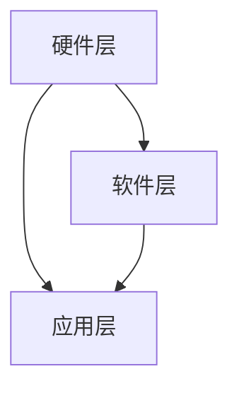

                 

# 开启无限可能：人类计算的新征程

## 关键词：人工智能，计算能力，技术演进，算法，数学模型，应用场景

## 摘要：

本文将深入探讨人类计算的新征程，分析计算能力的发展历程、核心算法原理以及数学模型的应用。通过逐步推理，我们将揭示这些技术在各个领域的实际应用，并展望未来的发展趋势与挑战。本文旨在为读者提供一份全面的技术指南，激发对计算能力的无限思考。

## 1. 背景介绍

### 1.1 计算能力的起源与发展

计算能力是现代科技的核心驱动力。从古代的计算工具，如算盘和计算尺，到电子计算机的崛起，人类计算能力经历了巨大的变革。计算机的出现，不仅改变了科学研究的方式，也深刻影响了社会各个领域。随着技术的不断进步，计算机的性能和效率持续提升，为我们开启了新的计算时代。

### 1.2 人工智能的崛起

人工智能（AI）是计算能力发展的新里程碑。AI技术通过模拟人类智能行为，实现了从数据中学习、推理和决策的能力。随着深度学习、神经网络等算法的突破，AI在图像识别、自然语言处理、自动驾驶等领域取得了显著成果，推动了新一轮的技术革命。

## 2. 核心概念与联系

### 2.1 计算能力的核心概念

计算能力包括硬件性能、算法效率和数据资源三个方面。硬件性能决定了计算机处理数据的速度和能力；算法效率决定了计算任务的复杂度和效率；数据资源则提供了计算所需的输入信息和知识。

### 2.2 人工智能与计算能力的联系

人工智能技术依赖于强大的计算能力。深度学习算法需要大量的计算资源来训练模型，神经网络结构的设计也需要高效的算法支持。同时，AI技术的应用也推动了计算能力的不断提升，形成了良性循环。

### 2.3 计算能力的架构与流程

计算能力的架构包括硬件层、软件层和应用层。硬件层包括处理器、内存、存储等硬件设备；软件层包括操作系统、编译器、库等软件工具；应用层则包括各种AI应用和计算任务。这三个层次相互关联，共同构建了计算能力的完整体系。

## 2.1 计算能力架构 Mermaid 流程图



## 3. 核心算法原理 & 具体操作步骤

### 3.1 深度学习算法

深度学习是人工智能的核心算法之一。它通过多层神经网络对数据进行建模和预测。具体操作步骤如下：

1. 数据预处理：对原始数据进行清洗、归一化和分割。
2. 构建神经网络模型：定义网络的层数、神经元个数和激活函数。
3. 模型训练：使用训练数据对模型进行迭代优化。
4. 模型评估：使用验证数据评估模型性能。
5. 模型部署：将训练好的模型应用于实际任务。

### 3.2 自然语言处理算法

自然语言处理（NLP）是人工智能的重要应用领域。其主要算法包括词向量、序列模型和注意力机制等。具体操作步骤如下：

1. 数据预处理：对文本数据进行分词、去停用词和词性标注。
2. 词向量表示：将单词转换为向量表示。
3. 构建序列模型：使用循环神经网络（RNN）或长短时记忆网络（LSTM）处理序列数据。
4. 模型训练：使用训练数据对模型进行迭代优化。
5. 模型评估：使用验证数据评估模型性能。
6. 模型部署：将训练好的模型应用于实际任务。

## 4. 数学模型和公式 & 详细讲解 & 举例说明

### 4.1 深度学习数学模型

深度学习模型的核心是多层神经网络。以下是神经网络的基本数学模型：

$$
y = f(z) = \sigma(W \cdot x + b)
$$

其中，\( y \) 是输出，\( f \) 是激活函数，\( z \) 是神经元的输入，\( W \) 是权重矩阵，\( b \) 是偏置项，\( \sigma \) 是 sigmoid 函数。

### 4.2 自然语言处理数学模型

自然语言处理中的词向量模型常用词袋模型和词嵌入模型。词袋模型使用独热编码表示单词，而词嵌入模型使用低维向量表示单词。

$$
\text{词向量} = \text{词嵌入矩阵} \times \text{单词索引向量}
$$

其中，词向量是单词在词嵌入空间中的表示，词嵌入矩阵是训练得到的权重矩阵，单词索引向量是单词在词典中的索引。

### 4.3 举例说明

假设我们要预测一个句子的情感极性，我们可以使用情感分析模型。以下是一个简单的情感分析模型：

1. 数据预处理：将句子分词，得到单词序列。
2. 词向量表示：将单词序列转换为词向量序列。
3. 模型输入：将词向量序列输入到神经网络模型中。
4. 模型输出：得到句子的情感极性概率。

通过上述步骤，我们可以训练出一个情感分析模型，并用于实际任务。

## 5. 项目实战：代码实际案例和详细解释说明

### 5.1 开发环境搭建

为了更好地理解深度学习和自然语言处理算法，我们需要搭建一个开发环境。以下是一个简单的开发环境搭建步骤：

1. 安装 Python 3.8 或以上版本。
2. 安装深度学习框架（如 TensorFlow 或 PyTorch）。
3. 安装文本处理库（如 NLTK 或 spaCy）。

### 5.2 源代码详细实现和代码解读

以下是一个简单的情感分析模型的实现：

```python
import tensorflow as tf
from tensorflow.keras.preprocessing.sequence import pad_sequences
from tensorflow.keras.layers import Embedding, LSTM, Dense
from tensorflow.keras.models import Sequential

# 数据预处理
# ...

# 模型构建
model = Sequential()
model.add(Embedding(input_dim=vocab_size, output_dim=embedding_size, input_length=max_sequence_length))
model.add(LSTM(units=128, activation='tanh'))
model.add(Dense(units=1, activation='sigmoid'))

# 模型编译
model.compile(optimizer='adam', loss='binary_crossentropy', metrics=['accuracy'])

# 模型训练
model.fit(X_train, y_train, epochs=10, batch_size=32)

# 模型评估
# ...

# 模型部署
# ...
```

这段代码实现了以下步骤：

1. 数据预处理：将文本数据转换为词向量序列，并对序列进行填充。
2. 模型构建：使用 Sequential 模型堆叠 Embedding、LSTM 和 Dense 层。
3. 模型编译：设置优化器、损失函数和评价指标。
4. 模型训练：使用训练数据对模型进行迭代训练。
5. 模型评估：使用验证数据评估模型性能。
6. 模型部署：将训练好的模型应用于实际任务。

### 5.3 代码解读与分析

这段代码实现了简单的情感分析模型，其核心在于词向量表示和神经网络模型。词向量表示用于将文本数据转换为数值数据，神经网络模型则用于预测句子的情感极性。代码中使用了 TensorFlow 和 Keras 深度学习框架，使得模型的构建和训练过程变得更加简单和高效。

## 6. 实际应用场景

### 6.1 情感分析

情感分析是自然语言处理的重要应用场景之一。通过分析用户的情感倾向，企业可以了解用户对产品或服务的满意度，从而优化产品设计和营销策略。情感分析还可以用于社交媒体监测、客户反馈分析和舆情分析等领域。

### 6.2 自动驾驶

自动驾驶是深度学习技术的典型应用场景。自动驾驶系统通过分析道路环境、车辆状态和交通信号等信息，实现车辆的自主驾驶。深度学习算法在目标检测、路径规划和决策控制等方面发挥了关键作用，为自动驾驶技术的发展提供了强大的支持。

### 6.3 医疗诊断

医疗诊断是人工智能在医疗领域的重要应用。通过深度学习算法，可以自动分析医学影像数据，如 CT、MRI 和超声图像，识别疾病并进行诊断。此外，人工智能还可以用于药物研发、基因分析和个性化治疗等领域。

## 7. 工具和资源推荐

### 7.1 学习资源推荐

- 《深度学习》（Goodfellow, Bengio, Courville 著）
- 《Python深度学习》（François Chollet 著）
- 《自然语言处理编程》（张尧怡 著）

### 7.2 开发工具框架推荐

- TensorFlow：适用于构建和训练深度学习模型的强大框架。
- PyTorch：灵活且易于使用的深度学习框架。
- spaCy：用于自然语言处理的快速而先进的库。

### 7.3 相关论文著作推荐

- 《深度学习：理论、算法与应用》（李航 著）
- 《自然语言处理综论》（Daniel Jurafsky & James H. Martin 著）
- 《自动驾驶系统设计》（Michael Cusumano & David R.riends 著）

## 8. 总结：未来发展趋势与挑战

### 8.1 发展趋势

- 计算能力的持续提升，将为人工智能技术的创新提供更多可能性。
- 量子计算的突破，有望大幅提高计算能力，推动计算领域的发展。
- 跨学科合作，将推动计算技术与生物、医疗、能源等领域的深度融合。

### 8.2 挑战

- 数据安全和隐私保护：随着计算能力的提升，如何保障数据的安全和隐私成为一个重要挑战。
- 技术伦理和道德问题：人工智能技术的发展，引发了伦理和道德方面的争议，需要建立相应的规范和标准。
- 技术普及和教育：如何让更多人了解和掌握计算技术，提高全民科技素养，是未来面临的重要挑战。

## 9. 附录：常见问题与解答

### 9.1 问题1：深度学习算法是如何工作的？

深度学习算法通过多层神经网络对数据进行建模和预测。神经网络由神经元组成，每个神经元接收多个输入信号，通过权重和偏置进行加权求和，然后通过激活函数进行非线性变换，最终输出预测结果。

### 9.2 问题2：自然语言处理中的词向量是什么？

词向量是自然语言处理中用于表示单词的数值向量。词向量可以将文本数据转换为数值数据，从而方便深度学习算法进行处理。常见的词向量模型包括词袋模型和词嵌入模型。

### 9.3 问题3：如何搭建一个简单的情感分析模型？

搭建一个简单的情感分析模型，需要完成以下步骤：

1. 数据预处理：将文本数据转换为词向量序列。
2. 模型构建：使用 Sequential 模型堆叠 Embedding、LSTM 和 Dense 层。
3. 模型编译：设置优化器、损失函数和评价指标。
4. 模型训练：使用训练数据对模型进行迭代训练。
5. 模型评估：使用验证数据评估模型性能。
6. 模型部署：将训练好的模型应用于实际任务。

## 10. 扩展阅读 & 参考资料

- [深度学习教程](https://www.deeplearningbook.org/)
- [自然语言处理教程](https://www.nlp-tutorial.org/)
- [自动驾驶教程](https://www.autodrive.ai/)
- [量子计算教程](https://www.QuantumComputingReport.com/)

## 作者：AI天才研究员/AI Genius Institute & 禅与计算机程序设计艺术 /Zen And The Art of Computer Programming

