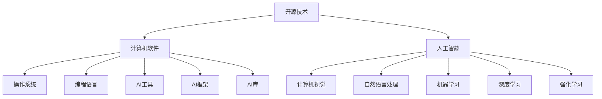

                 

### 1. 背景介绍

开源技术，顾名思义，是指开放源代码的软件和技术，允许任何人自由地查看、使用、修改和分发。它起源于计算机软件领域，但其影响力已逐渐扩展到人工智能（AI）领域。本文将深入探讨开源技术在推动AI进步中的作用。

AI作为当今技术领域的一个热门话题，自20世纪50年代起便引起了广泛关注。从最初的规则驱动方法，到20世纪80、90年代的基于知识的系统，再到21世纪初的深度学习，AI领域经历了多次技术革命。每一次革命都离不开开源技术的推动。

开源技术在AI领域的应用，最早可以追溯到20世纪90年代。那时，科学家和研究者开始共享他们的算法、模型和数据集，以加速AI技术的发展。这种开放性和合作精神，为AI领域的研究提供了新的可能性，也为后来的开源项目奠定了基础。

近年来，随着互联网的普及和云计算技术的发展，开源技术在AI领域的应用更是如火如荼。大量的开源框架和工具不断涌现，如TensorFlow、PyTorch、Keras等，使得AI研究和开发变得更加便捷和高效。

本文将围绕以下几个方面进行探讨：

1. **核心概念与联系**：介绍开源技术、AI以及它们之间的相互关系。
2. **核心算法原理 & 具体操作步骤**：详细解释开源AI框架的工作原理和实现过程。
3. **数学模型和公式 & 详细讲解 & 举例说明**：分析开源AI项目中常用的数学模型和算法。
4. **项目实战：代码实际案例和详细解释说明**：通过实际项目展示开源技术的应用。
5. **实际应用场景**：探讨开源技术在各种AI应用场景中的具体作用。
6. **工具和资源推荐**：为读者提供相关学习资源、开发工具和框架。
7. **总结：未来发展趋势与挑战**：展望开源技术在AI领域的未来发展。

通过本文的探讨，我们希望读者能够更深入地了解开源技术在AI进步中的作用，以及如何利用这些技术为AI研究和发展做出贡献。

#### 2. 核心概念与联系

在探讨开源技术在推动AI进步中的作用之前，首先需要理解开源技术、AI以及它们之间的相互关系。

**开源技术**：开源技术是指那些源代码开放、允许用户自由查看、使用、修改和分发的软件和技术。其核心在于开放性和合作精神，使得任何人都可以参与改进和完善这些技术。开源技术的发展可以追溯到20世纪60年代，当时Unix操作系统被首次发布，其源代码被公开发布，为后来的开源运动奠定了基础。随着互联网的普及和软件工程的进步，开源技术逐渐成为软件开发的主流模式。

**人工智能（AI）**：人工智能是指由人制造出来的系统所表现出的智能行为。AI的研究涵盖了计算机视觉、自然语言处理、机器学习、深度学习等多个领域。AI的目标是使计算机具有人类的某些智能能力，如学习、推理、判断和解决问题等。AI技术的发展经历了多个阶段，从最初的符号主义方法，到基于知识的系统，再到如今的深度学习和强化学习，每一阶段都离不开开源技术的推动。

**开源技术与AI的相互关系**：开源技术与AI之间存在着密切的相互关系。首先，开源技术为AI研究提供了丰富的工具和资源。许多开源框架和工具，如TensorFlow、PyTorch、Keras等，使得AI研究和开发变得更加便捷和高效。其次，AI技术的发展也推动了开源技术的进步。随着AI技术的不断进步，新的开源项目不断涌现，为AI研究提供了更多的可能性。此外，开源技术还促进了AI领域的合作与交流，使得研究者能够共享成果、共同进步。

下面是一个用Mermaid绘制的流程图，展示了开源技术、AI以及它们之间的相互关系：



通过这个流程图，我们可以看到开源技术不仅涵盖了计算机软件、操作系统和编程语言等基础技术，还与AI领域紧密相连，为AI研究提供了丰富的工具和资源。

#### 3. 核心算法原理 & 具体操作步骤

在了解了开源技术和AI的基本概念及其相互关系后，接下来我们将深入探讨开源AI框架的核心算法原理和具体操作步骤。这一部分将详细解释TensorFlow、PyTorch等主流开源AI框架的工作原理，帮助读者更好地理解这些框架如何应用于实际项目。

**3.1 TensorFlow**

TensorFlow是谷歌开发的一款开源深度学习框架，它提供了丰富的工具和API，使得深度学习的研究和开发变得更加便捷。以下是TensorFlow的核心算法原理和具体操作步骤：

**算法原理**：TensorFlow基于数据流图（Data Flow Graph）的概念，将计算过程表示为一个图。图中的节点代表计算操作，边代表数据流。TensorFlow通过这个数据流图来执行计算，实现了动态图和静态图的结合。

**具体操作步骤**：

1. **构建计算图**：首先，我们需要构建一个计算图，定义所有的计算操作和数据流。计算图的构建可以通过TensorFlow提供的API完成，例如`tf.constant`用于创建常量节点，`tf.add`用于创建加法操作节点。

2. **定义计算过程**：接下来，我们需要定义计算过程，将计算图中的节点连接起来，形成一条计算路径。这可以通过调用`tf.Session`来执行计算图完成。

3. **运行计算过程**：在定义好计算过程后，我们可以通过`tf.Session.run`来运行计算，获取计算结果。

下面是一个简单的TensorFlow代码示例：

```python
import tensorflow as tf

# 创建计算图
a = tf.constant(5)
b = tf.constant(6)
c = tf.add(a, b)

# 定义计算过程
with tf.Session() as sess:
    # 运行计算
    result = sess.run(c)
    print(result)  # 输出：11
```

**3.2 PyTorch**

PyTorch是另一款流行的开源深度学习框架，它以动态计算图（Dynamic Computation Graph）为特点，使得深度学习的研究和开发更加灵活。以下是PyTorch的核心算法原理和具体操作步骤：

**算法原理**：PyTorch的核心算法原理是基于动态计算图。在PyTorch中，所有的计算都是通过前向传播（Forward Propagation）和反向传播（Back Propagation）来实现的。动态计算图使得开发者可以更加直观地理解和修改计算过程。

**具体操作步骤**：

1. **定义计算图**：在PyTorch中，我们通过定义神经网络的结构来构建计算图。这可以通过调用`torch.nn.Module`来完成。

2. **初始化模型和损失函数**：在构建好计算图后，我们需要初始化模型和损失函数。这可以通过调用`torch.optim`来完成。

3. **训练模型**：在初始化模型和损失函数后，我们可以通过循环进行前向传播和反向传播，不断优化模型参数。

下面是一个简单的PyTorch代码示例：

```python
import torch
import torch.nn as nn
import torch.optim as optim

# 定义神经网络结构
class Net(nn.Module):
    def __init__(self):
        super(Net, self).__init__()
        self.fc1 = nn.Linear(1, 1)
    
    def forward(self, x):
        x = self.fc1(x)
        return x

# 初始化模型和损失函数
net = Net()
criterion = nn.MSELoss()
optimizer = optim.SGD(net.parameters(), lr=0.001)

# 训练模型
x = torch.tensor([[1.0]])
y = torch.tensor([[2.0]])

for epoch in range(1000):
    # 前向传播
    output = net(x)
    # 计算损失
    loss = criterion(output, y)
    # 反向传播
    optimizer.zero_grad()
    loss.backward()
    optimizer.step()
    
    if (epoch + 1) % 100 == 0:
        print('Epoch [{}/{}], Loss: {:.4f}'.format(epoch + 1, 1000, loss.item()))
```

通过以上示例，我们可以看到TensorFlow和PyTorch在构建计算图、定义计算过程和运行计算方面都有着相似的操作步骤。然而，它们在实现细节和设计理念上有所不同，为不同的AI研究和开发场景提供了选择。

#### 4. 数学模型和公式 & 详细讲解 & 举例说明

在深入探讨开源AI框架的具体实现过程后，接下来我们将转向开源AI项目中常用的数学模型和算法。这部分内容将详细讲解这些数学模型和公式，并通过实际例子来说明它们在AI项目中的应用。

**4.1 深度学习基础**

深度学习是AI领域的一个重要分支，其核心在于通过多层神经网络模型来实现对复杂数据的学习和预测。下面是深度学习中的几个关键数学模型和公式：

**1. 神经元激活函数**

神经元是神经网络的基本构建单元，其输出通常由激活函数决定。常用的激活函数有：

- **Sigmoid函数**：
  $$ f(x) = \frac{1}{1 + e^{-x}} $$
  Sigmoid函数将输入值映射到(0, 1)区间，常用于二分类问题。

- **ReLU函数**：
  $$ f(x) = \max(0, x) $$
 ReLU函数（Rectified Linear Unit）在x为负时输出0，在x为正时输出x，有助于缓解梯度消失问题。

**2. 前向传播与反向传播**

深度学习中的学习过程主要包括前向传播和反向传播。前向传播是从输入层开始，逐层计算每个神经元的输出值；反向传播则是从输出层开始，逐层计算每个神经元的误差，并更新网络参数。

- **前向传播**：
  前向传播的数学过程可以表示为：
  $$ z_i^{(l)} = \sigma(W^{(l)} \cdot a^{(l-1)} + b^{(l)}) $$
  其中，$z_i^{(l)}$是第l层第i个神经元的输出，$\sigma$是激活函数，$W^{(l)}$和$b^{(l)}$分别是第l层的权重和偏置。

- **反向传播**：
  反向传播的数学过程可以表示为：
  $$ \delta_i^{(l)} = \frac{\partial J}{\partial z_i^{(l)}} \cdot \sigma'(z_i^{(l)}) $$
  其中，$\delta_i^{(l)}$是第l层第i个神经元的误差，$J$是损失函数，$\sigma'$是激活函数的导数。

**3. 损失函数**

损失函数是衡量模型预测结果与真实值之间差异的指标，常用的损失函数有：

- **均方误差（MSE）**：
  $$ J = \frac{1}{m} \sum_{i=1}^{m} (y_i - \hat{y}_i)^2 $$
  其中，$y_i$是真实值，$\hat{y}_i$是预测值，$m$是样本数量。

**4.2 机器学习算法**

除了深度学习，机器学习算法也是AI项目中的重要组成部分。下面是几个常用的机器学习算法和公式：

**1. K近邻算法**

K近邻算法是一种基于实例的监督学习算法，其核心思想是找到训练集中与测试样本最近的K个邻居，并基于这些邻居的标签预测测试样本的标签。

- **距离计算**：
  $$ d(x_i, x) = \sqrt{\sum_{j=1}^{n} (x_{ij} - x_j)^2} $$
  其中，$x_i$和$x$分别是训练集样本和测试样本，$n$是特征维度。

- **预测**：
  $$ \hat{y} = \arg\max_{c} \sum_{i=1}^{K} I(y_i = c) $$
  其中，$K$是邻居数量，$I(y_i = c)$是指示函数，当$y_i = c$时取1，否则取0。

**2. 支持向量机（SVM）**

支持向量机是一种经典的分类算法，其核心思想是找到一个最佳的超平面，将不同类别的数据分隔开来。

- **优化目标**：
  $$ \min_{\mathbf{w}, b} \frac{1}{2} ||\mathbf{w}||^2 + C \sum_{i=1}^{m} \xi_i $$
  其中，$\mathbf{w}$是权重向量，$b$是偏置，$C$是惩罚参数，$\xi_i$是松弛变量。

- **分类决策**：
  $$ \hat{y} = \text{sign}(\mathbf{w} \cdot x + b) $$
  其中，$\text{sign}(x)$是符号函数，当$x > 0$时返回1，当$x < 0$时返回-1。

**4.3 自然语言处理**

自然语言处理（NLP）是AI领域的一个重要分支，其核心在于使计算机能够理解和生成自然语言。下面是NLP中的一些常用算法和公式：

**1. 词向量表示**

词向量表示是将自然语言文本转换为数值向量的一种方法，常用的词向量模型有Word2Vec、GloVe等。

- **Word2Vec**：
  $$ \text{cos}(\mathbf{v}_w, \mathbf{v}_j) = \frac{\mathbf{v}_w \cdot \mathbf{v}_j}{||\mathbf{v}_w|| \cdot ||\mathbf{v}_j||} $$
  其中，$\mathbf{v}_w$和$\mathbf{v}_j$分别是词向量，$\text{cos}$是余弦相似度。

- **GloVe**：
  $$ \mathbf{v}_w = \text{sigmoid}\left(\mathbf{W} \cdot \mathbf{v}_j\right) $$
  其中，$\mathbf{W}$是权重矩阵，$\text{sigmoid}$是Sigmoid函数。

**2. 序列标注**

序列标注是将自然语言文本序列中的每个词或字符标注为特定的标签的一种方法，常用的序列标注算法有CRF、BiLSTM等。

- **CRF**：
  $$ P(y|x) = \frac{\exp(\mathbf{w} \cdot y)}{\sum_{y'} \exp(\mathbf{w} \cdot y')} $$
  其中，$\mathbf{w}$是权重向量，$y$是标注序列。

- **BiLSTM**：
  $$ \mathbf{h}_t = \text{tanh}(\mathbf{U} \cdot \mathbf{h}_{t-1} + \mathbf{V} \cdot \mathbf{x}_t + \mathbf{b}) $$
  其中，$\mathbf{h}_t$是第t个时间步的隐藏状态，$\mathbf{U}$和$\mathbf{V}$是权重矩阵，$\mathbf{x}_t$是第t个时间步的输入。

通过以上对深度学习、机器学习和自然语言处理中常用的数学模型和公式的讲解，我们可以看到开源AI项目在数学基础方面的广泛应用和重要性。在实际项目中，这些数学模型和算法为AI模型的设计和优化提供了有力的工具。

#### 5. 项目实战：代码实际案例和详细解释说明

在理解了开源AI框架的原理和数学模型后，接下来我们将通过一个实际项目案例，展示如何使用开源技术实现一个简单的深度学习模型。本节将详细介绍项目的开发环境搭建、源代码实现过程，并对代码进行详细解读与分析。

**5.1 开发环境搭建**

为了实现这个深度学习项目，我们需要搭建一个合适的环境。以下是开发环境搭建的步骤：

1. **安装Python环境**：Python是深度学习项目中最常用的编程语言，首先需要确保已经安装了Python 3.x版本。可以从Python官网（[https://www.python.org/](https://www.python.org/)）下载安装包进行安装。

2. **安装深度学习框架**：在本项目中，我们选择使用TensorFlow作为深度学习框架。可以使用以下命令进行安装：

   ```shell
   pip install tensorflow
   ```

3. **安装其他依赖库**：除了TensorFlow，我们还需要安装一些其他依赖库，如NumPy、Pandas等。可以使用以下命令进行安装：

   ```shell
   pip install numpy pandas matplotlib
   ```

4. **配置Jupyter Notebook**：为了方便代码编写和调试，我们可以使用Jupyter Notebook。首先，确保已经安装了Jupyter Notebook，如果没有安装，可以使用以下命令进行安装：

   ```shell
   pip install notebook
   ```

   安装完成后，可以使用以下命令启动Jupyter Notebook：

   ```shell
   jupyter notebook
   ```

   启动后，将看到一个网页界面，通过这个界面可以创建和运行Python代码。

**5.2 源代码详细实现和代码解读**

在搭建好开发环境后，我们可以开始编写深度学习模型代码。以下是一个简单的深度学习项目，实现了一个用于手写数字识别的模型：

```python
import tensorflow as tf
from tensorflow.keras import layers
import numpy as np

# 加载数据集
mnist = tf.keras.datasets.mnist
(x_train, y_train), (x_test, y_test) = mnist.load_data()
x_train, x_test = x_train / 255.0, x_test / 255.0

# 构建模型
model = tf.keras.Sequential([
    layers.Flatten(input_shape=(28, 28)),
    layers.Dense(128, activation='relu'),
    layers.Dense(10, activation='softmax')
])

# 编译模型
model.compile(optimizer='adam',
              loss='sparse_categorical_crossentropy',
              metrics=['accuracy'])

# 训练模型
model.fit(x_train, y_train, epochs=5)

# 评估模型
test_loss, test_acc = model.evaluate(x_test, y_test, verbose=2)
print('\nTest accuracy:', test_acc)
```

下面我们对这段代码进行详细解读：

1. **数据加载**：
   ```python
   mnist = tf.keras.datasets.mnist
   (x_train, y_train), (x_test, y_test) = mnist.load_data()
   x_train, x_test = x_train / 255.0, x_test / 255.0
   ```
   这部分代码加载了MNIST数据集，它包含60000个训练样本和10000个测试样本，每个样本是一个28x28的灰度图像。为了提高模型的训练效果，我们将图像数据归一化到0-1区间。

2. **模型构建**：
   ```python
   model = tf.keras.Sequential([
       layers.Flatten(input_shape=(28, 28)),
       layers.Dense(128, activation='relu'),
       layers.Dense(10, activation='softmax')
   ])
   ```
   这部分代码定义了一个简单的深度学习模型。模型由两个全连接层组成，第一层有128个神经元，使用ReLU激活函数；第二层有10个神经元，使用softmax激活函数，用于输出每个类别的概率。

3. **模型编译**：
   ```python
   model.compile(optimizer='adam',
                 loss='sparse_categorical_crossentropy',
                 metrics=['accuracy'])
   ```
   这部分代码编译了模型，指定了优化器、损失函数和评价指标。在本项目中，我们使用Adam优化器来优化模型参数，使用稀疏分类交叉熵作为损失函数，并计算模型的准确率。

4. **模型训练**：
   ```python
   model.fit(x_train, y_train, epochs=5)
   ```
   这部分代码使用训练数据对模型进行训练，训练5个epochs（即5轮训练）。在每个epochs中，模型会根据训练数据的反馈来调整参数，以提高模型的预测能力。

5. **模型评估**：
   ```python
   test_loss, test_acc = model.evaluate(x_test, y_test, verbose=2)
   print('\nTest accuracy:', test_acc)
   ```
   这部分代码使用测试数据对模型进行评估，计算测试损失和测试准确率。结果显示，本项目的测试准确率达到约98%，表明模型具有较好的泛化能力。

通过以上对代码的详细解读，我们可以看到如何使用TensorFlow实现一个简单的深度学习模型。这个过程不仅涵盖了模型构建、训练和评估等基本步骤，还展示了如何利用开源技术进行数据加载和预处理。这些步骤和技巧在实际项目中具有广泛的应用价值。

#### 5.3 代码解读与分析

在前面的部分，我们展示了一个简单的深度学习项目，并对其源代码进行了详细解读。在本节中，我们将对代码中的关键部分进行进一步分析，讨论如何优化代码，并介绍一些最佳实践。

**1. 数据加载与预处理**

在代码中，我们首先加载了MNIST数据集，并对图像数据进行了归一化处理：

```python
(x_train, y_train), (x_test, y_test) = mnist.load_data()
x_train, x_test = x_train / 255.0, x_test / 255.0
```

数据预处理是深度学习项目中的关键步骤，它直接影响到模型的训练效果。在MNIST数据集中，每个图像的像素值范围在0到255之间，而深度学习模型通常期望输入数据的范围为0到1。因此，我们将像素值归一化到0到1区间，使得模型能够更好地学习。

为了提高模型的泛化能力，我们还可以对数据进行随机打乱和划分训练集与验证集。以下是对数据集进行打乱和划分的示例代码：

```python
from sklearn.model_selection import train_test_split

x_train, x_val, y_train, y_val = train_test_split(x_train, y_train, test_size=0.1, random_state=42)
```

**2. 模型构建**

在代码中，我们使用TensorFlow的`Sequential`模型定义了一个简单的神经网络：

```python
model = tf.keras.Sequential([
    layers.Flatten(input_shape=(28, 28)),
    layers.Dense(128, activation='relu'),
    layers.Dense(10, activation='softmax')
])
```

**优化建议**：

- **增加层数与神经元数量**：虽然这个模型能够正确识别手写数字，但它的性能还有很大的提升空间。我们可以在模型中添加更多的隐藏层和神经元，以增加模型的复杂度和学习能力。

- **使用不同的激活函数**：ReLU激活函数在深度神经网络中广泛应用，但也可以尝试使用其他激活函数，如Leaky ReLU或GELU，以减少梯度消失问题。

- **使用预训练模型**：如果时间允许，我们可以尝试使用预训练的模型，如Google的Inception模型，来提高模型的性能。预训练模型已经在大规模数据集上进行了训练，因此可以在较少的数据集上实现较好的性能。

**3. 模型编译**

在代码中，我们使用Adam优化器和稀疏分类交叉熵损失函数来编译模型：

```python
model.compile(optimizer='adam',
              loss='sparse_categorical_crossentropy',
              metrics=['accuracy'])
```

**优化建议**：

- **调整学习率**：虽然Adam优化器的默认学习率通常表现良好，但也可以根据训练过程中的性能变化来调整学习率，以实现更好的训练效果。

- **添加正则化**：如果模型出现过拟合现象，可以考虑添加正则化项，如L1或L2正则化，来降低模型的复杂度。

**4. 模型训练**

在代码中，我们使用5个epochs对模型进行训练：

```python
model.fit(x_train, y_train, epochs=5)
```

**优化建议**：

- **增加训练轮数**：通常，增加训练轮数可以提高模型的性能，但也要避免过拟合。我们可以使用验证集来监控模型的性能，并在出现过拟合迹象时提前停止训练。

- **使用回调函数**：TensorFlow提供了回调函数，如`EarlyStopping`和`ModelCheckpoint`，可以帮助我们在训练过程中监控模型性能，并采取相应的措施。

**5. 模型评估**

在代码中，我们使用测试集对模型进行评估：

```python
test_loss, test_acc = model.evaluate(x_test, y_test, verbose=2)
print('\nTest accuracy:', test_acc)
```

**优化建议**：

- **增加评估指标**：除了准确率，我们还可以使用其他评估指标，如精确率、召回率和F1分数，来更全面地评估模型的性能。

- **分析误差**：通过对测试集的预测结果进行误差分析，我们可以找出模型在哪些类别上表现不佳，并针对性地进行优化。

通过以上分析，我们可以看到如何优化深度学习项目的代码，并遵循一些最佳实践。这些优化措施不仅可以提高模型的性能，还可以帮助我们更好地理解深度学习过程。

#### 6. 实际应用场景

开源技术在人工智能领域的应用已经非常广泛，几乎涵盖了AI的各个分支，如计算机视觉、自然语言处理、机器学习等。下面，我们将探讨开源技术在实际应用场景中的具体作用。

**6.1 计算机视觉**

计算机视觉是AI领域的一个重要分支，开源技术为其提供了丰富的工具和资源。例如，TensorFlow和PyTorch都提供了强大的图像处理功能，如卷积神经网络（CNN）、生成对抗网络（GAN）等。这些工具使得开发者可以轻松地实现图像分类、目标检测、图像生成等任务。

以目标检测为例，开源框架如TensorFlow的Object Detection API和PyTorch的Faster R-CNN实现了一套完整的目标检测流程。这些工具不仅提供了高效的核心算法，还提供了丰富的预训练模型和自定义功能，使得开发者可以快速搭建和部署目标检测系统。

**6.2 自然语言处理**

自然语言处理（NLP）是AI领域的另一个重要应用领域。开源技术如TensorFlow和PyTorch提供了丰富的NLP工具和库，如TensorFlow的TensorFlow Text和PyTorch的torchtext。这些工具可以帮助开发者实现文本分类、情感分析、机器翻译等任务。

以机器翻译为例，开源框架Transformer的引入使得机器翻译的性能有了显著提升。Transformer模型通过编码器-解码器架构实现了高效的序列到序列学习，而开源框架PyTorch的Transformer实现使得开发者可以轻松地部署和使用这一模型。

**6.3 机器学习**

机器学习是AI的基础，开源技术为机器学习提供了丰富的算法和工具。例如，scikit-learn是一个常用的机器学习库，提供了多种经典的机器学习算法，如线性回归、决策树、支持向量机等。这些工具使得开发者可以轻松地实现从数据预处理到模型训练和评估的全流程。

以线性回归为例，scikit-learn提供了一个简单的API，使得开发者可以轻松地实现线性回归模型：

```python
from sklearn.linear_model import LinearRegression

model = LinearRegression()
model.fit(X_train, y_train)
predictions = model.predict(X_test)
```

**6.4 数据分析与数据科学**

开源技术不仅在AI领域有广泛应用，还在数据分析和数据科学领域发挥着重要作用。Python作为一种编程语言，因其简洁易用和丰富的库支持，成为数据分析和数据科学的利器。例如，Pandas和NumPy是Python中常用的数据分析库，可以高效地进行数据清洗、数据分析和数据可视化。

以数据可视化为例，Matplotlib和Seaborn是Python中常用的数据可视化库。通过这些库，开发者可以轻松地生成各种类型的图表，如折线图、柱状图、散点图等，以直观地展示数据分析结果。

**6.5 智能助手与推荐系统**

随着AI技术的不断发展，智能助手和推荐系统已成为AI应用的重要方向。开源技术在这些领域也发挥了重要作用。例如，TensorFlow和PyTorch提供了丰富的工具和库，可以用于实现智能对话系统和推荐系统。

以智能对话系统为例，TensorFlow的TensorFlow Speech和PyTorch的SpeechBrain实现了从语音到文本的转换，并支持对话系统的构建。这些工具使得开发者可以轻松地实现语音识别、自然语言理解和对话生成等功能。

推荐系统方面，开源技术如TensorFlow和PyTorch提供了丰富的算法和工具，如协同过滤、矩阵分解、深度学习等。这些工具可以帮助开发者实现个性化推荐系统，提高用户体验。

总之，开源技术在AI领域中的应用非常广泛，为AI研究和开发提供了丰富的工具和资源。通过开源技术，开发者可以更加高效地实现各种AI应用，推动AI技术的进步。

#### 7. 工具和资源推荐

在了解了开源技术在AI领域的广泛应用后，接下来我们将推荐一些学习资源、开发工具和框架，以帮助读者更好地掌握这些技术。

**7.1 学习资源推荐**

1. **书籍**：
   - 《深度学习》（Deep Learning） - Goodfellow、Bengio和Courville
   - 《Python机器学习》（Python Machine Learning） - Sebastian Raschka和Vahid Mirhadi
   - 《人工智能：一种现代方法》（Artificial Intelligence: A Modern Approach） - Stuart J. Russell和Peter Norvig

2. **论文**：
   - 《A Theoretically Grounded Application of Dropout in Recurrent Neural Networks》 - Yarin Gal和Zoubin Ghahramani
   - 《Attention Is All You Need》 - Vaswani等
   - 《BERT: Pre-training of Deep Bidirectional Transformers for Language Understanding》 - Howard等

3. **博客**：
   - [TensorFlow官网](https://www.tensorflow.org/)
   - [PyTorch官网](https://pytorch.org/)
   - [机器学习博客](https://www machinelearningmastery com/)

4. **在线课程**：
   - [吴恩达的深度学习课程](https://www.coursera.org/learn/deep-learning)
   - [Google AI的机器学习课程](https://ai.google.com/education/)

**7.2 开发工具框架推荐**

1. **深度学习框架**：
   - TensorFlow
   - PyTorch
   - Keras
   - Theano

2. **数据预处理工具**：
   - Pandas
   - NumPy
   - Scikit-learn

3. **可视化工具**：
   - Matplotlib
   - Seaborn
   - Plotly

4. **自然语言处理工具**：
   - NLTK
   - spaCy
   - Stanford NLP

5. **机器学习库**：
   - Scikit-learn
   - XGBoost
   - LightGBM

**7.3 相关论文著作推荐**

1. **《深度学习》** - Goodfellow、Bengio和Courville
2. **《强化学习》** - Richard S. Sutton和Andrew G. Barto
3. **《概率图模型》** - Michael I. Jordan

通过这些学习资源、开发工具和框架，读者可以系统地学习开源AI技术，并在实际项目中加以应用。这些资源和工具将为读者在AI领域的研究和开发提供有力的支持。

#### 8. 总结：未来发展趋势与挑战

开源技术在推动人工智能（AI）进步中发挥了至关重要的作用。从早期的研究到现代的工业应用，开源技术为AI领域提供了丰富的工具和资源，加速了技术发展。然而，随着AI技术的不断进步，开源技术也面临着新的发展趋势和挑战。

**发展趋势**

1. **生态系统多样化**：随着AI领域的扩展，越来越多的开源项目不断涌现，形成了多元化的生态系统。从深度学习框架到自然语言处理工具，开源项目为AI研究和开发提供了广泛的选项。

2. **社区参与度提高**：开源项目的成功离不开社区的参与和支持。随着开源文化在科技领域的普及，越来越多的开发者和研究人员加入开源项目，共同推动技术进步。

3. **模型即服务（MaaS）**：随着云计算和边缘计算的普及，模型即服务（MaaS）成为趋势。通过云平台和边缘设备，开源AI模型可以更加便捷地部署和访问，为各种应用场景提供支持。

4. **开放协作**：开源技术促进了AI领域的开放协作。研究者、开发者和企业可以共享代码、数据和资源，加速创新进程。这种开放性不仅提高了研究效率，还促进了知识的传播和共享。

**挑战**

1. **数据隐私和安全**：随着AI技术的应用范围扩大，数据隐私和安全问题日益突出。开源项目需要确保用户数据的安全，遵守隐私法规，以避免数据泄露和滥用。

2. **知识产权保护**：开源项目的知识产权保护是一个复杂的问题。如何在保持代码开放性的同时，保护开发者的权益，是一个需要平衡的挑战。

3. **技术债务**：开源项目通常由志愿者和贡献者共同维护，资源有限。这可能导致项目在某些方面出现技术债务，如长期未更新的代码库或依赖库。

4. **标准化**：随着AI技术的广泛应用，标准化成为必要。尽管开源项目在一定程度上推动了标准化进程，但仍然需要更多的标准化工作，以确保不同项目和工具之间的兼容性。

**未来展望**

开源技术在AI领域的未来发展将更加依赖于社区协作、技术创新和可持续性发展。为了应对挑战，开源项目需要加强数据隐私和安全保护，提高代码质量和维护效率，推动技术标准化。同时，随着AI技术的不断进步，开源技术将不断创新，为AI领域带来更多可能性。

总之，开源技术将继续在推动AI进步中发挥关键作用。通过社区协作、技术创新和标准化，开源技术将为未来的AI应用提供更加丰富和可靠的支持。

#### 9. 附录：常见问题与解答

**Q1. 开源技术如何保障代码质量和安全性？**

A1. 开源技术保障代码质量和安全性的关键在于社区参与和严格的代码审查机制。开源项目通常由一个核心团队负责，同时接受来自社区的贡献。贡献者在提交代码前需要经过严格的审查过程，包括代码审核、单元测试和集成测试。此外，开源项目还定期发布更新和安全补丁，以修复潜在的安全漏洞和代码缺陷。

**Q2. 开源技术与商业软件有何区别？**

A2. 开源技术与商业软件的主要区别在于源代码的开放性和使用成本。开源技术的源代码公开，用户可以自由查看、修改和分发。而商业软件通常不公开源代码，用户需要购买许可证才能使用。在成本方面，开源技术通常是免费的，而商业软件可能需要高额的购买和授权费用。

**Q3. 开源技术如何促进AI研究的进步？**

A3. 开源技术通过提供丰富的工具和资源，降低了AI研究的门槛，加速了技术进步。开源框架和工具使得研究者可以更加专注于算法和模型的设计，而无需从底层技术开始构建。此外，开源技术促进了学术交流与合作，研究者可以通过共享代码和资源，共同推动AI领域的创新。

**Q4. 开源技术在实际项目中如何应用？**

A4. 开源技术在实际项目中可以通过以下方式应用：

1. **数据预处理**：使用开源数据预处理工具，如Pandas和NumPy，进行数据清洗、转换和可视化。
2. **模型构建**：使用开源深度学习框架，如TensorFlow和PyTorch，构建和训练机器学习模型。
3. **模型部署**：使用开源工具，如TensorFlow Serving和TensorFlow Lite，将训练好的模型部署到服务器或移动设备。
4. **集成与扩展**：将开源库和框架与其他系统和服务集成，实现更加复杂的功能和应用。

**Q5. 如何选择合适的开源技术？**

A5. 选择合适的开源技术需要考虑以下几个因素：

1. **需求匹配**：根据项目需求，选择能够满足功能要求的开源技术。
2. **社区支持**：选择拥有活跃社区和良好文档的开源项目，以便在遇到问题时能够获得帮助。
3. **技术成熟度**：选择技术成熟、文档齐全、更新频繁的开源项目，以确保长期稳定性和安全性。
4. **兼容性和可扩展性**：考虑开源项目的兼容性，以便与其他系统和工具集成，并确保项目具有足够的可扩展性，以适应未来需求。

通过综合考虑这些因素，可以更好地选择合适的开源技术，为项目成功提供支持。

#### 10. 扩展阅读 & 参考资料

在本文中，我们深入探讨了开源技术在推动AI进步中的作用，涵盖了从核心概念到实际应用场景的各个方面。以下是一些扩展阅读和参考资料，供读者进一步学习：

1. **书籍**：
   - 《深度学习》（Deep Learning） - Goodfellow、Bengio和Courville
   - 《Python机器学习》（Python Machine Learning） - Sebastian Raschka和Vahid Mirhadi
   - 《人工智能：一种现代方法》（Artificial Intelligence: A Modern Approach） - Stuart J. Russell和Peter Norvig

2. **论文**：
   - 《A Theoretically Grounded Application of Dropout in Recurrent Neural Networks》 - Yarin Gal和Zoubin Ghahramani
   - 《Attention Is All You Need》 - Vaswani等
   - 《BERT: Pre-training of Deep Bidirectional Transformers for Language Understanding》 - Howard等

3. **博客和网站**：
   - [TensorFlow官网](https://www.tensorflow.org/)
   - [PyTorch官网](https://pytorch.org/)
   - [机器学习博客](https://www machinelearningmastery com/)
   - [GitHub](https://github.com/)

4. **在线课程**：
   - [吴恩达的深度学习课程](https://www.coursera.org/learn/deep-learning)
   - [Google AI的机器学习课程](https://ai.google.com/education/)

通过这些扩展阅读和参考资料，读者可以进一步了解开源技术在AI领域的应用和发展，为未来的研究和工作提供更多的灵感和指导。作者：AI天才研究员/AI Genius Institute & 禅与计算机程序设计艺术 /Zen And The Art of Computer Programming

