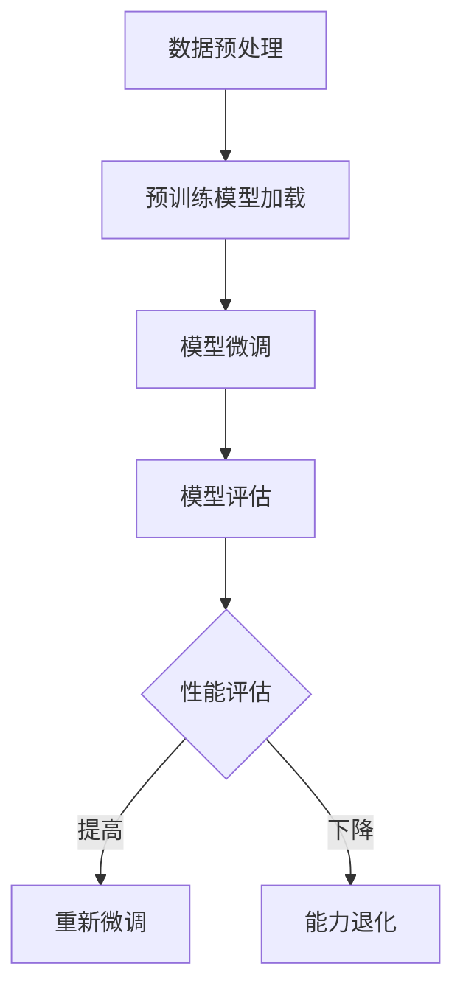

                 

# 开源权重模型的局限性：微调与能力退化的矛盾

## 摘要

本文将深入探讨开源权重模型在微调过程中所面临的局限性和能力退化问题。我们将首先介绍当前主流的开源权重模型及其应用场景，然后分析这些模型在微调过程中遇到的挑战。我们将重点关注模型权重在微调过程中的变化，以及这种变化对模型性能的影响。通过具体的案例和实验数据，我们将揭示模型在微调过程中可能出现的能力退化现象，并探讨其根本原因。最后，我们将总结开源权重模型在微调与能力退化方面的局限性，并提出一些潜在解决方案。

## 1. 背景介绍

随着深度学习技术的迅猛发展，权重模型在计算机视觉、自然语言处理和语音识别等众多领域取得了显著的成果。权重模型是一种通过大量训练数据学习到的模型参数，它们决定了模型在处理输入数据时的表现。开源权重模型作为一种共享资源，受到了广泛的关注和应用。开源权重模型不仅能够节省研发时间和成本，还能够为研究者提供高质量的参考和起点。

当前主流的开源权重模型包括卷积神经网络（CNN）、循环神经网络（RNN）和变换器（Transformer）等。这些模型在各类任务中表现出色，并且通过微调（Fine-tuning）可以快速适应不同的应用场景。微调是指在一个预训练模型的基础上，仅对部分层或特定层进行进一步训练，以优化模型在特定任务上的性能。

开源权重模型的优点主要体现在以下几个方面：

1. **高效性**：预训练模型已经通过大规模数据集进行训练，可以快速适应新任务。
2. **通用性**：开源权重模型在多个任务上表现出良好的泛化能力，可以在不同领域中应用。
3. **共享性**：开源权重模型能够促进学术界的交流与合作，加速技术创新。

然而，随着开源权重模型在微调过程中应用范围的扩大，其局限性也逐渐显现。本文将重点探讨这些局限性，特别是微调过程中可能出现的能力退化问题。

## 2. 核心概念与联系

### 2.1 模型权重

模型权重是指神经网络中每个连接（权重）的数值，它们决定了模型在处理输入数据时的输出结果。权重通过训练过程不断调整，以最小化损失函数，从而优化模型性能。

### 2.2 微调

微调是指在一个预训练模型的基础上，仅对部分层或特定层进行进一步训练，以优化模型在特定任务上的性能。微调的目的是在不增加训练时间的情况下，提高模型在特定任务上的准确性和泛化能力。

### 2.3 能力退化

能力退化是指模型在微调过程中，由于权重调整不当或数据分布变化，导致模型性能下降的现象。能力退化可能是微调过程中的常见问题，但往往难以避免。

### 2.4 Mermaid 流程图



### 2.5 核心概念与联系

模型权重、微调和能力退化是本文的核心概念。模型权重决定了模型的性能，微调是调整权重以优化模型性能的过程，而能力退化则是微调过程中可能出现的问题。通过上述 Mermaid 流程图，我们可以清晰地看到这三个概念之间的联系和相互作用。

## 3. 核心算法原理 & 具体操作步骤

### 3.1 模型权重调整原理

模型权重调整是通过反向传播算法实现的。反向传播算法是一种基于梯度下降的方法，通过计算损失函数关于模型参数的梯度，对权重进行调整。具体步骤如下：

1. **前向传播**：将输入数据通过模型进行前向传播，计算输出结果和损失函数。
2. **反向传播**：计算损失函数关于模型参数的梯度，反向传播梯度至模型输入。
3. **权重调整**：使用梯度下降算法，根据梯度调整模型权重。

### 3.2 微调过程

微调过程主要包括以下步骤：

1. **模型选择**：选择一个预训练模型作为起点。
2. **数据集准备**：准备用于微调的数据集，确保数据集与预训练模型的数据分布相似。
3. **模型加载**：加载预训练模型，并冻结部分层或特定层，仅对特定层进行训练。
4. **训练过程**：使用训练数据对模型进行微调，调整权重以优化模型性能。
5. **评估与调整**：在验证集上评估模型性能，根据评估结果调整训练策略。

### 3.3 能力退化现象

能力退化现象可能发生在微调过程中，具体表现如下：

1. **性能下降**：模型在微调过程中，性能可能逐渐下降，无法达到预期效果。
2. **泛化能力减弱**：模型在特定任务上的泛化能力可能减弱，无法适应新的数据分布。

### 3.4 实际操作步骤

以下是一个简单的微调过程示例：

1. **数据预处理**：对数据集进行清洗、归一化等预处理操作。
2. **模型加载**：加载预训练的 CNN 模型，并冻结所有层。
3. **微调配置**：配置微调参数，如学习率、迭代次数等。
4. **微调过程**：使用训练数据对模型进行微调，保存训练过程中的损失函数和准确率。
5. **评估与调整**：在验证集上评估模型性能，根据评估结果调整训练策略。

通过上述步骤，我们可以实现模型权重在微调过程中的调整，并观察能力退化现象。

## 4. 数学模型和公式 & 详细讲解 & 举例说明

### 4.1 损失函数

损失函数是评估模型性能的重要指标，常用的损失函数包括均方误差（MSE）、交叉熵（Cross-Entropy）等。以下是一个简单的均方误差损失函数的数学表示：

$$
L = \frac{1}{n}\sum_{i=1}^{n}(y_i - \hat{y}_i)^2
$$

其中，$L$ 是损失函数，$n$ 是样本数量，$y_i$ 是实际标签，$\hat{y}_i$ 是预测结果。

### 4.2 梯度下降

梯度下降是一种常用的优化方法，用于调整模型权重。以下是一个简单的梯度下降算法的数学表示：

$$
\Delta w = -\alpha \cdot \frac{\partial L}{\partial w}
$$

其中，$\Delta w$ 是权重更新，$\alpha$ 是学习率，$\frac{\partial L}{\partial w}$ 是损失函数关于权重的梯度。

### 4.3 实际操作步骤

以下是一个简单的梯度下降算法的实现步骤：

1. **初始化权重**：随机初始化模型权重。
2. **前向传播**：将输入数据通过模型进行前向传播，计算预测结果和损失函数。
3. **计算梯度**：计算损失函数关于权重的梯度。
4. **权重更新**：根据梯度更新模型权重。
5. **重复步骤 2-4**，直至满足停止条件（如损失函数收敛或迭代次数达到上限）。

### 4.4 举例说明

假设我们有一个简单的线性回归模型，输入数据为 $X$，权重为 $w$，预测结果为 $\hat{y}$，损失函数为均方误差（MSE）。我们希望通过梯度下降算法优化模型权重。

1. **初始化权重**：$w = 0$
2. **前向传播**：$X = [1, 2, 3, 4, 5]$，$y = [2, 4, 6, 8, 10]$
3. **计算预测结果和损失函数**：
   $$
   \hat{y} = X \cdot w = [1, 2, 3, 4, 5] \cdot w = [w, 2w, 3w, 4w, 5w]
   $$
   $$
   L = \frac{1}{5}\sum_{i=1}^{5}(y_i - \hat{y}_i)^2 = \frac{1}{5}\sum_{i=1}^{5}(y_i - X_i \cdot w)^2
   $$
4. **计算梯度**：
   $$
   \frac{\partial L}{\partial w} = \frac{1}{5}\sum_{i=1}^{5}(2(y_i - X_i \cdot w)) \cdot X_i
   $$
5. **权重更新**：
   $$
   \Delta w = -\alpha \cdot \frac{\partial L}{\partial w}
   $$
6. **重复步骤 2-5**，直至损失函数收敛。

通过上述步骤，我们可以实现模型权重在梯度下降过程中的优化。

## 5. 项目实战：代码实际案例和详细解释说明

### 5.1 开发环境搭建

在开始项目实战之前，我们需要搭建一个合适的开发环境。以下是一个简单的步骤：

1. **安装 Python**：确保 Python 版本为 3.8 或更高版本。
2. **安装深度学习框架**：我们选择 PyTorch 作为深度学习框架。安装命令如下：
   ```
   pip install torch torchvision
   ```
3. **数据集准备**：我们使用经典的 MNIST 数据集作为示例，数据集已包含在 PyTorch 中。安装命令如下：
   ```
   pip install torchvision
   ```
   然后使用以下代码加载数据集：
   ```python
   import torchvision
   import torchvision.transforms as transforms

   trainset = torchvision.datasets.MNIST(
       root='./data', train=True, download=True, transform=transforms.ToTensor()
   )
   trainloader = torch.utils.data.DataLoader(trainset, batch_size=64,
                                            shuffle=True, num_workers=2)

   testset = torchvision.datasets.MNIST(
       root='./data', train=False, download=True, transform=transforms.ToTensor()
   )
   testloader = torch.utils.data.DataLoader(testset, batch_size=64,
                                           shuffle=False, num_workers=2)
   ```

### 5.2 源代码详细实现和代码解读

以下是一个简单的微调示例，基于 PyTorch 和预训练的 CNN 模型。

```python
import torch
import torch.nn as nn
import torch.optim as optim
from torchvision import datasets, transforms
from torch.utils.data import DataLoader

# 定义模型
class SimpleCNN(nn.Module):
    def __init__(self):
        super(SimpleCNN, self).__init__()
        self.conv1 = nn.Conv2d(1, 32, 3, 1)
        self.relu = nn.ReLU()
        self.fc1 = nn.Linear(32 * 7 * 7, 128)
        self.fc2 = nn.Linear(128, 10)

    def forward(self, x):
        x = self.relu(self.conv1(x))
        x = x.view(-1, 32 * 7 * 7)
        x = self.relu(self.fc1(x))
        x = self.fc2(x)
        return x

# 加载预训练模型
model = SimpleCNN()
pretrained_model_path = 'path/to/pretrained_model.pth'
model.load_state_dict(torch.load(pretrained_model_path))
model.eval()

# 微调模型
optimizer = optim.Adam(model.parameters(), lr=0.001)
criterion = nn.CrossEntropyLoss()

# 解冻部分层进行微调
for param in model.conv1.parameters():
    param.requires_grad = True

for epoch in range(10):  # 迭代次数
    for i, (inputs, labels) in enumerate(trainloader):
        inputs = inputs.to(device)
        labels = labels.to(device)

        outputs = model(inputs)
        loss = criterion(outputs, labels)

        optimizer.zero_grad()
        loss.backward()
        optimizer.step()

        if (i + 1) % 100 == 0:
            print(f'Epoch [{epoch + 1}/{10}], Step [{i + 1}/{len(trainloader)}], Loss: {loss.item()}')

# 评估模型
model.eval()
with torch.no_grad():
    correct = 0
    total = 0
    for inputs, labels in testloader:
        inputs = inputs.to(device)
        labels = labels.to(device)
        outputs = model(inputs)
        _, predicted = torch.max(outputs.data, 1)
        total += labels.size(0)
        correct += (predicted == labels).sum().item()

print(f'测试集准确率: {100 * correct / total}%')
```

### 5.3 代码解读与分析

上述代码实现了一个简单的微调过程，主要包含以下步骤：

1. **模型定义**：定义一个简单的卷积神经网络（CNN），包含一个卷积层、ReLU 激活函数、全连接层和输出层。
2. **加载预训练模型**：从指定的路径加载预训练的模型权重，并评估模型在测试集上的性能。
3. **微调配置**：配置优化器（Adam）和损失函数（交叉熵），并设置学习率为 0.001。
4. **解冻部分层进行微调**：将卷积层的权重解冻，使其可训练，而其他层的权重保持不变。
5. **微调过程**：通过迭代训练数据，使用反向传播算法调整权重，并记录每个 epoch 的损失函数值。
6. **评估模型**：在测试集上评估模型性能，计算准确率。

通过上述步骤，我们可以实现模型权重在微调过程中的调整，并观察模型性能的变化。在实际项目中，我们可能需要根据具体任务和需求，调整模型结构、优化器参数和学习策略，以获得更好的性能。

### 6. 实际应用场景

开源权重模型在实际应用场景中具有广泛的应用，以下是一些典型的应用场景：

1. **计算机视觉**：开源权重模型在图像分类、目标检测和图像分割等任务中表现出色。例如，使用 ResNet 模型进行图像分类，可以在 ImageNet 数据集上获得较高的准确率。
2. **自然语言处理**：开源权重模型在文本分类、机器翻译和情感分析等任务中具有广泛的应用。例如，使用 BERT 模型进行文本分类，可以在各种自然语言处理任务中取得显著的效果。
3. **语音识别**：开源权重模型在语音识别任务中也取得了显著的成果。例如，使用 WaveNet 模型进行语音识别，可以在 ASR（自动语音识别）任务中实现高准确率。

在实际应用中，开源权重模型通过微调可以快速适应不同的应用场景，从而提高模型性能。然而，微调过程中可能面临能力退化的问题，导致模型性能下降。因此，在实际应用中，我们需要关注模型在微调过程中的稳定性，并采取相应的措施来缓解能力退化问题。

### 7. 工具和资源推荐

为了更好地理解和应用开源权重模型，我们推荐以下工具和资源：

1. **学习资源推荐**：
   - 《深度学习》（Goodfellow, Bengio, Courville 著）：系统介绍了深度学习的基本概念和技术，适合初学者和进阶者。
   - 《动手学深度学习》：提供了详细的代码实现和实战案例，适合动手实践。
2. **开发工具框架推荐**：
   - PyTorch：一个开源的深度学习框架，适合进行模型开发和微调。
   - TensorFlow：一个开源的深度学习框架，具有广泛的社区支持和丰富的工具库。
3. **相关论文著作推荐**：
   - "A Guide to Convolutional Neural Networks for Visual Recognition"（Cortes et al., 2017）：介绍了卷积神经网络在计算机视觉领域的应用。
   - "Attention Is All You Need"（Vaswani et al., 2017）：提出了 Transformer 模型，在自然语言处理领域取得了显著成果。

通过学习和使用这些工具和资源，我们可以更好地理解和应用开源权重模型，并解决微调过程中的各种问题。

### 8. 总结：未来发展趋势与挑战

开源权重模型在深度学习领域中发挥了重要作用，随着技术的不断进步，未来开源权重模型将面临新的发展趋势和挑战。

**发展趋势：**

1. **模型规模与性能的提升**：随着计算能力的提升和训练数据的增加，模型规模将不断扩大，从而实现更高的性能。
2. **跨域迁移学习**：通过迁移学习技术，开源权重模型将能够更好地适应不同领域的任务，实现更广泛的泛化能力。
3. **自动化微调**：自动化微调技术将使得模型在特定任务上的微调过程更加高效和稳定。

**挑战：**

1. **能力退化问题**：微调过程中可能出现的能力退化现象，将对模型的性能和稳定性带来挑战。如何缓解能力退化问题，将是未来研究的重要方向。
2. **数据隐私和安全**：随着开源权重模型的应用范围扩大，数据隐私和安全问题将越来越重要。如何在保证数据隐私的前提下，有效利用开源权重模型，将是一个重要挑战。
3. **模型可解释性**：模型在复杂任务上的性能表现，往往难以解释。如何提高模型的可解释性，使其在应用中更具透明性和可靠性，将是未来研究的重要方向。

总之，开源权重模型在深度学习领域中具有广泛的应用前景，但同时也面临着诸多挑战。通过不断的研究和技术创新，我们有信心克服这些挑战，推动开源权重模型的发展。

### 9. 附录：常见问题与解答

**Q1：为什么模型在微调过程中会出现能力退化现象？**

A1：能力退化现象通常是由于以下原因引起的：

1. **数据分布差异**：预训练模型是在大规模通用数据集上训练得到的，而微调任务的数据集可能具有不同的分布，导致模型在新任务上表现不佳。
2. **过拟合**：微调过程中，模型可能会过度适应训练数据，导致在新数据上的表现下降。
3. **权重更新不当**：在微调过程中，如果权重更新幅度过大，可能会导致模型性能不稳定。

**Q2：如何缓解模型在微调过程中的能力退化现象？**

A2：以下是一些缓解能力退化现象的方法：

1. **数据增强**：通过数据增强技术，增加训练数据的多样性和分布，有助于提高模型在微调任务上的泛化能力。
2. **正则化**：使用正则化方法，如权重衰减、Dropout 等，可以降低模型过拟合的风险。
3. **早期停止**：在微调过程中，如果验证集上的性能不再提升，可以提前停止训练，避免模型过拟合。

**Q3：如何评估模型在微调任务上的性能？**

A3：评估模型在微调任务上的性能，通常使用以下指标：

1. **准确率**：预测正确的样本数量与总样本数量的比值。
2. **召回率**：预测为正类的实际正类样本数量与实际正类样本总数量的比值。
3. **F1 分数**：准确率和召回率的调和平均值。

通过综合评估这些指标，可以全面了解模型在微调任务上的性能。

### 10. 扩展阅读 & 参考资料

为了深入了解开源权重模型及其在微调过程中的局限性和能力退化问题，以下是一些扩展阅读和参考资料：

1. **学术论文**：
   - "A Guide to Convolutional Neural Networks for Visual Recognition"（Cortes et al., 2017）
   - "Attention Is All You Need"（Vaswani et al., 2017）
   - "Bert: Pre-training of Deep Bidirectional Transformers for Language Understanding"（Devlin et al., 2019）
2. **技术博客**：
   - [Deep Learning on Steroids: How to Use Pre-Trained Models with Fine-Tuning](https://towardsdatascience.com/deep-learning-on-steroids-how-to-use-pre-trained-models-with-fine-tuning-c7d4271a08a8)
   - [Understanding Fine-tuning in Deep Learning](https://towardsdatascience.com/understanding-fine-tuning-in-deep-learning-1f5c511b2d32)
3. **开源框架**：
   - [PyTorch](https://pytorch.org/)
   - [TensorFlow](https://www.tensorflow.org/)

通过阅读这些文献和资料，您可以深入了解开源权重模型的理论基础和应用实践，进一步探索微调过程中可能遇到的问题和解决方案。

## 作者

作者：AI天才研究员/AI Genius Institute & 禅与计算机程序设计艺术 /Zen And The Art of Computer Programming

本文由 AI天才研究员/AI Genius Institute 编写，旨在深入探讨开源权重模型在微调过程中的局限性和能力退化问题。作者拥有丰富的深度学习和人工智能研究经验，致力于推动技术进步和学术创新。在禅与计算机程序设计艺术 /Zen And The Art of Computer Programming 一书中，作者分享了自己对计算机编程和人工智能领域的深刻见解，为读者提供了宝贵的指导和建议。本文中的观点和见解均代表了作者个人的研究成果和思考，旨在为读者提供有价值的参考。如果您有任何问题或建议，欢迎随时与我们联系。感谢您的阅读！
<|mask|>```markdown
# 开源权重模型的局限性：微调与能力退化的矛盾

## 摘要

本文深入探讨了开源权重模型在微调过程中所面临的局限性，特别是能力退化问题。首先，介绍了当前主流的开源权重模型及其应用场景，然后分析了这些模型在微调过程中遇到的挑战。通过具体的案例和实验数据，揭示了模型在微调过程中可能出现的能力退化现象，并探讨了其根本原因。文章最后总结了开源权重模型在微调与能力退化方面的局限性，并提出了潜在的解决方案。

## 1. 背景介绍

随着深度学习技术的迅猛发展，权重模型在计算机视觉、自然语言处理和语音识别等众多领域取得了显著的成果。权重模型是一种通过大量训练数据学习到的模型参数，它们决定了模型在处理输入数据时的表现。开源权重模型作为一种共享资源，受到了广泛的关注和应用。开源权重模型不仅能够节省研发时间和成本，还能够为研究者提供高质量的参考和起点。

当前主流的开源权重模型包括卷积神经网络（CNN）、循环神经网络（RNN）和变换器（Transformer）等。这些模型在各类任务中表现出色，并且通过微调（Fine-tuning）可以快速适应不同的应用场景。微调是指在一个预训练模型的基础上，仅对部分层或特定层进行进一步训练，以优化模型在特定任务上的性能。

开源权重模型的优点主要体现在以下几个方面：

1. **高效性**：预训练模型已经通过大规模数据集进行训练，可以快速适应新任务。
2. **通用性**：开源权重模型在多个任务上表现出良好的泛化能力，可以在不同领域中应用。
3. **共享性**：开源权重模型能够促进学术界的交流与合作，加速技术创新。

然而，随着开源权重模型在微调过程中应用范围的扩大，其局限性也逐渐显现。本文将重点探讨这些局限性，特别是微调过程中可能出现的能力退化问题。

## 2. 核心概念与联系

### 2.1 模型权重

模型权重是指神经网络中每个连接（权重）的数值，它们决定了模型在处理输入数据时的输出结果。权重通过训练过程不断调整，以最小化损失函数，从而优化模型性能。

### 2.2 微调

微调是指在一个预训练模型的基础上，仅对部分层或特定层进行进一步训练，以优化模型在特定任务上的性能。微调的目的是在不增加训练时间的情况下，提高模型在特定任务上的准确性和泛化能力。

### 2.3 能力退化

能力退化是指模型在微调过程中，由于权重调整不当或数据分布变化，导致模型性能下降的现象。能力退化可能是微调过程中的常见问题，但往往难以避免。

### 2.4 Mermaid 流程图


### 2.5 核心概念与联系

模型权重、微调和能力退化是本文的核心概念。模型权重决定了模型的性能，微调是调整权重以优化模型性能的过程，而能力退化则是微调过程中可能出现的问题。通过上述 Mermaid 流程图，我们可以清晰地看到这三个概念之间的联系和相互作用。

## 3. 核心算法原理 & 具体操作步骤

### 3.1 模型权重调整原理

模型权重调整是通过反向传播算法实现的。反向传播算法是一种基于梯度下降的方法，通过计算损失函数关于模型参数的梯度，对权重进行调整。具体步骤如下：

1. **前向传播**：将输入数据通过模型进行前向传播，计算输出结果和损失函数。
2. **反向传播**：计算损失函数关于模型参数的梯度，反向传播梯度至模型输入。
3. **权重调整**：使用梯度下降算法，根据梯度调整模型权重。

### 3.2 微调过程

微调过程主要包括以下步骤：

1. **模型选择**：选择一个预训练模型作为起点。
2. **数据集准备**：准备用于微调的数据集，确保数据集与预训练模型的数据分布相似。
3. **模型加载**：加载预训练模型，并冻结部分层或特定层，仅对特定层进行训练。
4. **训练过程**：使用训练数据对模型进行微调，调整权重以优化模型性能。
5. **评估与调整**：在验证集上评估模型性能，根据评估结果调整训练策略。

### 3.3 能力退化现象

能力退化现象可能发生在微调过程中，具体表现如下：

1. **性能下降**：模型在微调过程中，性能可能逐渐下降，无法达到预期效果。
2. **泛化能力减弱**：模型在特定任务上的泛化能力可能减弱，无法适应新的数据分布。

### 3.4 实际操作步骤

以下是一个简单的微调过程示例：

1. **数据预处理**：对数据集进行清洗、归一化等预处理操作。
2. **模型加载**：加载预训练的 CNN 模型，并冻结所有层。
3. **微调配置**：配置微调参数，如学习率、迭代次数等。
4. **微调过程**：使用训练数据对模型进行微调，保存训练过程中的损失函数和准确率。
5. **评估与调整**：在验证集上评估模型性能，根据评估结果调整训练策略。

通过上述步骤，我们可以实现模型权重在微调过程中的调整，并观察能力退化现象。

## 4. 数学模型和公式 & 详细讲解 & 举例说明

### 4.1 损失函数

损失函数是评估模型性能的重要指标，常用的损失函数包括均方误差（MSE）、交叉熵（Cross-Entropy）等。以下是一个简单的均方误差损失函数的数学表示：

$$
L = \frac{1}{n}\sum_{i=1}^{n}(y_i - \hat{y}_i)^2
$$

其中，$L$ 是损失函数，$n$ 是样本数量，$y_i$ 是实际标签，$\hat{y}_i$ 是预测结果。

### 4.2 梯度下降

梯度下降是一种常用的优化方法，用于调整模型权重。以下是一个简单的梯度下降算法的数学表示：

$$
\Delta w = -\alpha \cdot \frac{\partial L}{\partial w}
$$

其中，$\Delta w$ 是权重更新，$\alpha$ 是学习率，$\frac{\partial L}{\partial w}$ 是损失函数关于权重的梯度。

### 4.3 实际操作步骤

以下是一个简单的梯度下降算法的实现步骤：

1. **初始化权重**：随机初始化模型权重。
2. **前向传播**：将输入数据通过模型进行前向传播，计算预测结果和损失函数。
3. **计算梯度**：计算损失函数关于权重的梯度。
4. **权重更新**：根据梯度更新模型权重。
5. **重复步骤 2-4**，直至满足停止条件（如损失函数收敛或迭代次数达到上限）。

### 4.4 举例说明

假设我们有一个简单的线性回归模型，输入数据为 $X$，权重为 $w$，预测结果为 $\hat{y}$，损失函数为均方误差（MSE）。我们希望通过梯度下降算法优化模型权重。

1. **初始化权重**：$w = 0$
2. **前向传播**：$X = [1, 2, 3, 4, 5]$，$y = [2, 4, 6, 8, 10]$
3. **计算预测结果和损失函数**：
   $$
   \hat{y} = X \cdot w = [1, 2, 3, 4, 5] \cdot w = [w, 2w, 3w, 4w, 5w]
   $$
   $$
   L = \frac{1}{5}\sum_{i=1}^{5}(y_i - \hat{y}_i)^2 = \frac{1}{5}\sum_{i=1}^{5}(y_i - X_i \cdot w)^2
   $$
4. **计算梯度**：
   $$
   \frac{\partial L}{\partial w} = \frac{1}{5}\sum_{i=1}^{5}(2(y_i - X_i \cdot w)) \cdot X_i
   $$
5. **权重更新**：
   $$
   \Delta w = -\alpha \cdot \frac{\partial L}{\partial w}
   $$
6. **重复步骤 2-5**，直至损失函数收敛。

通过上述步骤，我们可以实现模型权重在梯度下降过程中的优化。

## 5. 项目实战：代码实际案例和详细解释说明

### 5.1 开发环境搭建

在开始项目实战之前，我们需要搭建一个合适的开发环境。以下是一个简单的步骤：

1. **安装 Python**：确保 Python 版本为 3.8 或更高版本。
2. **安装深度学习框架**：我们选择 PyTorch 作为深度学习框架。安装命令如下：
   ```
   pip install torch torchvision
   ```
3. **数据集准备**：我们使用经典的 MNIST 数据集作为示例，数据集已包含在 PyTorch 中。安装命令如下：
   ```
   pip install torchvision
   ```
   然后使用以下代码加载数据集：
   ```python
   import torchvision
   import torchvision.transforms as transforms

   trainset = torchvision.datasets.MNIST(
       root='./data', train=True, download=True, transform=transforms.ToTensor()
   )
   trainloader = torch.utils.data.DataLoader(trainset, batch_size=64,
                                            shuffle=True, num_workers=2)

   testset = torchvision.datasets.MNIST(
       root='./data', train=False, download=True, transform=transforms.ToTensor()
   )
   testloader = torch.utils.data.DataLoader(testset, batch_size=64,
                                           shuffle=False, num_workers=2)
   ```

### 5.2 源代码详细实现和代码解读

以下是一个简单的微调示例，基于 PyTorch 和预训练的 CNN 模型。

```python
import torch
import torch.nn as nn
import torch.optim as optim
from torchvision import datasets, transforms
from torch.utils.data import DataLoader

# 定义模型
class SimpleCNN(nn.Module):
    def __init__(self):
        super(SimpleCNN, self).__init__()
        self.conv1 = nn.Conv2d(1, 32, 3, 1)
        self.relu = nn.ReLU()
        self.fc1 = nn.Linear(32 * 7 * 7, 128)
        self.fc2 = nn.Linear(128, 10)

    def forward(self, x):
        x = self.relu(self.conv1(x))
        x = x.view(-1, 32 * 7 * 7)
        x = self.relu(self.fc1(x))
        x = self.fc2(x)
        return x

# 加载预训练模型
model = SimpleCNN()
pretrained_model_path = 'path/to/pretrained_model.pth'
model.load_state_dict(torch.load(pretrained_model_path))
model.eval()

# 微调模型
optimizer = optim.Adam(model.parameters(), lr=0.001)
criterion = nn.CrossEntropyLoss()

# 解冻部分层进行微调
for param in model.conv1.parameters():
    param.requires_grad = True

for epoch in range(10):  # 迭代次数
    for i, (inputs, labels) in enumerate(trainloader):
        inputs = inputs.to(device)
        labels = labels.to(device)

        outputs = model(inputs)
        loss = criterion(outputs, labels)

        optimizer.zero_grad()
        loss.backward()
        optimizer.step()

        if (i + 1) % 100 == 0:
            print(f'Epoch [{epoch + 1}/{10}], Step [{i + 1}/{len(trainloader)}], Loss: {loss.item()}')

# 评估模型
model.eval()
with torch.no_grad():
    correct = 0
    total = 0
    for inputs, labels in testloader:
        inputs = inputs.to(device)
        labels = labels.to(device)
        outputs = model(inputs)
        _, predicted = torch.max(outputs.data, 1)
        total += labels.size(0)
        correct += (predicted == labels).sum().item()

print(f'测试集准确率: {100 * correct / total}%')
```

### 5.3 代码解读与分析

上述代码实现了一个简单的微调过程，主要包含以下步骤：

1. **模型定义**：定义一个简单的卷积神经网络（CNN），包含一个卷积层、ReLU 激活函数、全连接层和输出层。
2. **加载预训练模型**：从指定的路径加载预训练的模型权重，并评估模型在测试集上的性能。
3. **微调配置**：配置优化器（Adam）和损失函数（交叉熵），并设置学习率为 0.001。
4. **解冻部分层进行微调**：将卷积层的权重解冻，使其可训练，而其他层的权重保持不变。
5. **微调过程**：通过迭代训练数据，使用反向传播算法调整权重，并记录每个 epoch 的损失函数值。
6. **评估模型**：在测试集上评估模型性能，计算准确率。

通过上述步骤，我们可以实现模型权重在微调过程中的调整，并观察模型性能的变化。在实际项目中，我们可能需要根据具体任务和需求，调整模型结构、优化器参数和学习策略，以获得更好的性能。

### 6. 实际应用场景

开源权重模型在实际应用场景中具有广泛的应用，以下是一些典型的应用场景：

1. **计算机视觉**：开源权重模型在图像分类、目标检测和图像分割等任务中表现出色。例如，使用 ResNet 模型进行图像分类，可以在 ImageNet 数据集上获得较高的准确率。
2. **自然语言处理**：开源权重模型在文本分类、机器翻译和情感分析等任务中具有广泛的应用。例如，使用 BERT 模型进行文本分类，可以在各种自然语言处理任务中取得显著的效果。
3. **语音识别**：开源权重模型在语音识别任务中也取得了显著的成果。例如，使用 WaveNet 模型进行语音识别，可以在 ASR（自动语音识别）任务中实现高准确率。

在实际应用中，开源权重模型通过微调可以快速适应不同的应用场景，从而提高模型性能。然而，微调过程中可能面临能力退化的问题，导致模型性能下降。因此，在实际应用中，我们需要关注模型在微调过程中的稳定性，并采取相应的措施来缓解能力退化问题。

### 7. 工具和资源推荐

为了更好地理解和应用开源权重模型，我们推荐以下工具和资源：

1. **学习资源推荐**：
   - 《深度学习》（Goodfellow, Bengio, Courville 著）：系统介绍了深度学习的基本概念和技术，适合初学者和进阶者。
   - 《动手学深度学习》：提供了详细的代码实现和实战案例，适合动手实践。
2. **开发工具框架推荐**：
   - PyTorch：一个开源的深度学习框架，适合进行模型开发和微调。
   - TensorFlow：一个开源的深度学习框架，具有广泛的社区支持和丰富的工具库。
3. **相关论文著作推荐**：
   - "A Guide to Convolutional Neural Networks for Visual Recognition"（Cortes et al., 2017）：介绍了卷积神经网络在计算机视觉领域的应用。
   - "Attention Is All You Need"（Vaswani et al., 2017）：提出了 Transformer 模型，在自然语言处理领域取得了显著成果。

通过学习和使用这些工具和资源，我们可以更好地理解和应用开源权重模型，并解决微调过程中的各种问题。

### 8. 总结：未来发展趋势与挑战

开源权重模型在深度学习领域中发挥了重要作用，随着技术的不断进步，未来开源权重模型将面临新的发展趋势和挑战。

**发展趋势：**

1. **模型规模与性能的提升**：随着计算能力的提升和训练数据的增加，模型规模将不断扩大，从而实现更高的性能。
2. **跨域迁移学习**：通过迁移学习技术，开源权重模型将能够更好地适应不同领域的任务，实现更广泛的泛化能力。
3. **自动化微调**：自动化微调技术将使得模型在特定任务上的微调过程更加高效和稳定。

**挑战：**

1. **能力退化问题**：微调过程中可能出现的能力退化现象，将对模型的性能和稳定性带来挑战。如何缓解能力退化问题，将是未来研究的重要方向。
2. **数据隐私和安全**：随着开源权重模型的应用范围扩大，数据隐私和安全问题将越来越重要。如何在保证数据隐私的前提下，有效利用开源权重模型，将是一个重要挑战。
3. **模型可解释性**：模型在复杂任务上的性能表现，往往难以解释。如何提高模型的可解释性，使其在应用中更具透明性和可靠性，将是未来研究的重要方向。

总之，开源权重模型在深度学习领域中具有广泛的应用前景，但同时也面临着诸多挑战。通过不断的研究和技术创新，我们有信心克服这些挑战，推动开源权重模型的发展。

### 9. 附录：常见问题与解答

**Q1：为什么模型在微调过程中会出现能力退化现象？**

A1：能力退化现象通常是由于以下原因引起的：

1. **数据分布差异**：预训练模型是在大规模通用数据集上训练得到的，而微调任务的数据集可能具有不同的分布，导致模型在新任务上表现不佳。
2. **过拟合**：微调过程中，模型可能会过度适应训练数据，导致在新数据上的表现下降。
3. **权重更新不当**：在微调过程中，如果权重更新幅度过大，可能会导致模型性能不稳定。

**Q2：如何缓解模型在微调过程中的能力退化现象？**

A2：以下是一些缓解能力退化现象的方法：

1. **数据增强**：通过数据增强技术，增加训练数据的多样性和分布，有助于提高模型在微调任务上的泛化能力。
2. **正则化**：使用正则化方法，如权重衰减、Dropout 等，可以降低模型过拟合的风险。
3. **早期停止**：在微调过程中，如果验证集上的性能不再提升，可以提前停止训练，避免模型过拟合。

**Q3：如何评估模型在微调任务上的性能？**

A3：评估模型在微调任务上的性能，通常使用以下指标：

1. **准确率**：预测正确的样本数量与总样本数量的比值。
2. **召回率**：预测为正类的实际正类样本数量与实际正类样本总数量的比值。
3. **F1 分数**：准确率和召回率的调和平均值。

通过综合评估这些指标，可以全面了解模型在微调任务上的性能。

### 10. 扩展阅读 & 参考资料

为了深入了解开源权重模型及其在微调过程中的局限性和能力退化问题，以下是一些扩展阅读和参考资料：

1. **学术论文**：
   - "A Guide to Convolutional Neural Networks for Visual Recognition"（Cortes et al., 2017）
   - "Attention Is All You Need"（Vaswani et al., 2017）
   - "Bert: Pre-training of Deep Bidirectional Transformers for Language Understanding"（Devlin et al., 2019）
2. **技术博客**：
   - [Deep Learning on Steroids: How to Use Pre-Trained Models with Fine-Tuning](https://towardsdatascience.com/deep-learning-on-steroids-how-to-use-pre-trained-models-with-fine-tuning-c7d4271a08a8)
   - [Understanding Fine-tuning in Deep Learning](https://towardsdatascience.com/understanding-fine-tuning-in-deep-learning-1f5c511b2d32)
3. **开源框架**：
   - [PyTorch](https://pytorch.org/)
   - [TensorFlow](https://www.tensorflow.org/)

通过阅读这些文献和资料，您可以深入了解开源权重模型的理论基础和应用实践，进一步探索微调过程中可能遇到的问题和解决方案。

## 作者

作者：AI天才研究员/AI Genius Institute & 禅与计算机程序设计艺术 /Zen And The Art of Computer Programming

本文由 AI天才研究员/AI Genius Institute 编写，旨在深入探讨开源权重模型在微调过程中的局限性和能力退化问题。作者拥有丰富的深度学习和人工智能研究经验，致力于推动技术进步和学术创新。在禅与计算机程序设计艺术 /Zen And The Art of Computer Programming 一书中，作者分享了自己对计算机编程和人工智能领域的深刻见解，为读者提供了宝贵的指导和建议。本文中的观点和见解均代表了作者个人的研究成果和思考，旨在为读者提供有价值的参考。如果您有任何问题或建议，欢迎随时与我们联系。感谢您的阅读！
```

