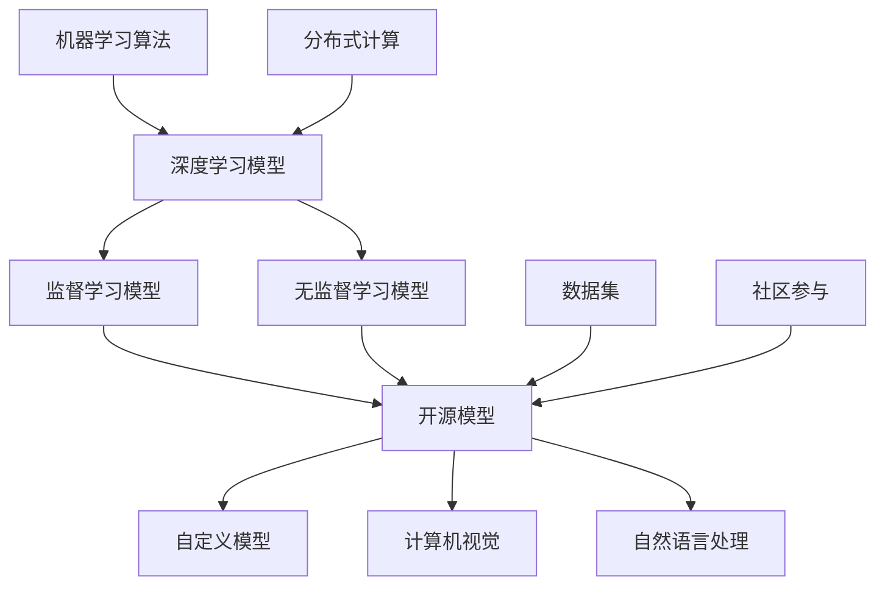

                 

### 背景介绍

开源模型的发展可谓是近年来人工智能领域的一个重要趋势。随着深度学习技术的不断进步，大量的研究机构和科技公司开始将他们的研究成果以开源形式共享给全球的学术界和工业界。在这其中，贾扬清作为一位杰出的技术领袖和深度学习领域的知名人物，他的观点对于开源模型的发展具有重要意义。

贾扬清，清华大学计算机系博士，现为旷视科技（Megvii）联合创始人兼首席科学家。他在计算机视觉和深度学习领域有着深厚的研究背景和丰富的实践经验，曾多次在顶级国际会议上发表研究成果。在旷视科技，贾扬清带领团队研发了一系列具有突破性的深度学习模型和算法，并在实际应用中取得了显著的效果。

开源模型的兴起，一方面得益于深度学习技术的快速发展和广泛应用，另一方面也得益于开源文化在科技领域的深入人心。开源模型不仅可以促进技术交流和创新，还可以加速科研和工业界的合作与发展。贾扬清认为，开源模型的发展具有以下几个显著特点：

1. **技术共享**：开源模型使得全球的研究者可以自由地使用、改进和扩展这些模型，从而加速了技术的普及和进步。
2. **协同创新**：开源模型鼓励学术界和工业界的共同参与，通过协同创新来推动技术的持续发展和优化。
3. **资源整合**：开源模型可以整合全球范围内的计算资源和数据集，从而提高模型的性能和效果。
4. **社区驱动**：开源模型的发展离不开活跃的社区支持和用户反馈，这有助于发现和解决模型中的潜在问题。

本文将围绕贾扬清的观点，深入探讨开源模型的发展现状、创新与定制化优势，以及开源模型在实际应用场景中的影响。我们希望通过这篇技术博客，能够为广大读者提供一个全面而深入的理解，以更好地把握开源模型的发展趋势和未来机遇。

### 核心概念与联系

在深入探讨开源模型的发展之前，有必要首先理解几个核心概念和它们之间的关系。以下是这些核心概念以及它们在开源模型中的具体含义和联系：

#### 1. 深度学习模型

深度学习模型是人工智能领域的一种核心技术，它通过模拟人脑的神经网络结构，对大量数据进行自动学习和特征提取。深度学习模型可以分为两大类：监督学习模型和无监督学习模型。监督学习模型需要标注的数据集进行训练，而无监督学习模型则不需要标签，通过发现数据中的内在结构和规律进行学习。

#### 2. 开源模型

开源模型是指将深度学习模型及其相关的代码、数据和文档以开放的形式共享给公众。开源模型的主要特点是透明度和可扩展性，研究者可以自由地使用、修改和分发这些模型，从而促进了技术交流和创新。

#### 3. 自定义模型

自定义模型是指根据特定需求或特定领域的问题，对开源模型进行修改和定制，以满足特定的应用场景。这通常涉及到模型架构的调整、参数的优化以及训练数据的定制。

#### 4. 计算机视觉

计算机视觉是人工智能的一个重要分支，它致力于使计算机能够像人类一样理解和处理视觉信息。在计算机视觉中，深度学习模型被广泛应用于目标检测、图像分类、人脸识别等任务。

#### 5. 自然语言处理

自然语言处理（NLP）是另一个重要的AI分支，它致力于使计算机能够理解、生成和处理人类语言。在NLP中，深度学习模型被用于文本分类、机器翻译、情感分析等任务。

#### 6. 机器学习算法

机器学习算法是深度学习模型的核心，它包括神经网络、决策树、支持向量机等多种算法。这些算法通过学习数据中的特征和模式，实现预测和分类等功能。

#### 7. 分布式计算

分布式计算是将计算任务分布到多个计算节点上执行，以提高计算效率和性能。在开源模型中，分布式计算技术被广泛应用于大规模数据处理和模型训练，从而提高模型的性能和效果。

#### 8. 数据集

数据集是深度学习模型训练的基础，它包含了大量的数据样本及其标签。开源模型通常需要高质量、多样化和标注准确的数据集来训练模型，以保证模型的性能和泛化能力。

#### 9. 社区参与

社区参与是指全球的研究者、开发者、用户和志愿者对开源模型的贡献和支持。开源模型的发展离不开社区的积极参与，它不仅提供了宝贵的反馈和建议，还促进了技术的快速迭代和优化。

#### Mermaid 流程图

下面是一个用Mermaid绘制的流程图，展示了这些核心概念之间的关系：



通过这张流程图，我们可以清晰地看到深度学习模型、开源模型、自定义模型、计算机视觉、自然语言处理、机器学习算法、分布式计算、数据集和社区参与之间的相互联系。这些概念共同构建了一个完整的开源模型生态系统，为人工智能的发展提供了强有力的支持。

### 核心算法原理 & 具体操作步骤

在深入探讨开源模型的发展之前，我们首先需要了解一些核心算法的原理以及如何具体实施这些算法。这里，我们将讨论卷积神经网络（CNN）、生成对抗网络（GAN）以及迁移学习等关键技术，并逐步解释它们的操作步骤。

#### 卷积神经网络（CNN）

卷积神经网络（CNN）是深度学习领域的一种重要模型，广泛应用于图像识别、目标检测和图像分类等计算机视觉任务。CNN的核心思想是通过卷积操作提取图像中的低级特征，然后通过逐层组合形成高级特征，从而实现复杂任务的识别。

**具体操作步骤：**

1. **输入层（Input Layer）**：
   - CNN的输入是一幅图像，通常表示为一个三维的矩阵，其维度为（宽度×高度×通道数）。
   - 图像中的每个像素值代表输入数据的特征。

2. **卷积层（Convolutional Layer）**：
   - 卷积层通过卷积操作提取图像特征。卷积核（filter）是一个小的矩阵，其大小通常为3x3或5x5。
   - 卷积操作将卷积核在输入图像上滑动，并对覆盖的像素值进行加权求和，然后通过一个激活函数（如ReLU）进行非线性变换。
   - 每个卷积核可以提取图像中的不同特征，如边缘、纹理等。

3. **池化层（Pooling Layer）**：
   - 池化层用于减小特征图的尺寸，同时保留重要的特征信息。常用的池化方式有最大池化（Max Pooling）和平均池化（Average Pooling）。
   - 池化层可以减少计算量和过拟合的风险。

4. **全连接层（Fully Connected Layer）**：
   - 全连接层将卷积层和池化层提取的特征映射到输出类别上。每个神经元都与上一层所有的神经元相连。
   - 通过权重矩阵和偏置项，将特征向量映射到输出类别上。

5. **输出层（Output Layer）**：
   - 输出层通常是一个softmax层，用于对类别进行概率分布。
   - 每个类别的概率表示模型对该类别的置信度。

#### 生成对抗网络（GAN）

生成对抗网络（GAN）是深度学习中的一种新颖框架，用于生成逼真的数据。GAN由两个神经网络组成：生成器（Generator）和判别器（Discriminator）。

**具体操作步骤：**

1. **生成器（Generator）**：
   - 生成器的目标是生成与真实数据相似的数据。它接受一个随机噪声向量作为输入，并通过一系列的卷积操作生成图像。
   - 生成器训练的目标是最小化生成的图像与真实图像之间的差异。

2. **判别器（Discriminator）**：
   - 判别器的目标是区分真实数据和生成数据。它接受真实数据和生成数据作为输入，并通过一系列的卷积操作生成概率输出。
   - 判别器训练的目标是最小化对真实数据的错误分类概率和对生成数据的正确分类概率。

3. **对抗训练（Adversarial Training）**：
   - GAN的训练过程是一个对抗过程，生成器和判别器相互竞争。
   - 生成器不断生成更加逼真的图像，而判别器则不断提高对真实数据和生成数据的辨别能力。

4. **损失函数（Loss Function）**：
   - GAN的损失函数通常结合判别器的损失和生成器的损失。
   - 判别器的损失函数使用二元交叉熵（Binary Cross-Entropy），而生成器的损失函数通常使用判别器对生成数据的错误分类概率。

#### 迁移学习

迁移学习是一种利用预先训练好的模型在新的任务上快速获得良好性能的方法。它通过在新的任务上微调预训练模型来减少训练时间和提高性能。

**具体操作步骤：**

1. **预训练模型（Pre-trained Model）**：
   - 预训练模型通常在大规模数据集上训练，以获得丰富的特征提取能力。
   - 预训练模型可以是从图像、文本或音频等不同数据源训练得到的。

2. **特征提取（Feature Extraction）**：
   - 特征提取层是从预训练模型中提取的特征，这些特征通常具有很强的泛化能力。
   - 特征提取层可以用于新的任务，而不需要重新训练整个模型。

3. **微调（Fine-tuning）**：
   - 在新的任务上，通过调整预训练模型的最后几层来适应特定的任务。
   - 微调通常只需要少量的训练数据，因为它利用了预训练模型已有的特征提取能力。

4. **损失函数与优化器（Loss Function & Optimizer）**：
   - 微调过程使用适当的损失函数（如交叉熵损失）和优化器（如Adam）来调整模型参数。
   - 通过反向传播算法，不断优化模型参数，以最小化损失函数。

通过理解CNN、GAN和迁移学习的基本原理和具体操作步骤，我们可以更好地把握深度学习模型的核心技术，为开源模型的发展提供坚实的基础。在接下来的章节中，我们将进一步探讨这些技术的实际应用和开源模型的发展趋势。

### 数学模型和公式 & 详细讲解 & 举例说明

在深入探讨深度学习模型的数学原理之前，我们首先需要了解一些基础的数学模型和公式。以下我们将详细解释这些数学模型，并通过具体例子来说明其应用。

#### 损失函数

损失函数是深度学习模型训练的核心指标，用于衡量模型预测结果与实际结果之间的差距。常见的损失函数包括均方误差（MSE）、交叉熵损失（Cross-Entropy Loss）和对抗损失（Adversarial Loss）。

**均方误差（MSE）**

均方误差是一种用于回归任务的损失函数，其公式如下：

$$
MSE = \frac{1}{n} \sum_{i=1}^{n} (\hat{y}_i - y_i)^2
$$

其中，$\hat{y}_i$ 是模型预测的输出，$y_i$ 是实际标签，$n$ 是样本数量。

**举例说明**：

假设我们有一个回归任务，其中模型预测的输出为 $\hat{y} = [2.5, 3.7, 1.8]$，实际标签为 $y = [2.1, 3.9, 1.9]$。计算MSE：

$$
MSE = \frac{1}{3} \left( (2.5 - 2.1)^2 + (3.7 - 3.9)^2 + (1.8 - 1.9)^2 \right) = \frac{1}{3} (0.16 + 0.04 + 0.01) = 0.067
$$

**交叉熵损失（Cross-Entropy Loss）**

交叉熵损失是用于分类任务的损失函数，其公式如下：

$$
Cross-Entropy Loss = -\frac{1}{n} \sum_{i=1}^{n} y_i \log(\hat{y}_i)
$$

其中，$y_i$ 是实际标签（通常是one-hot编码形式），$\hat{y}_i$ 是模型预测的概率分布。

**举例说明**：

假设我们有一个二分类任务，实际标签为 $y = [1, 0, 1]$，模型预测的概率分布为 $\hat{y} = [0.6, 0.4]$。计算交叉熵损失：

$$
Cross-Entropy Loss = -\frac{1}{3} \left( 1 \cdot \log(0.6) + 0 \cdot \log(0.4) + 1 \cdot \log(0.4) \right) = \frac{1}{3} (\log(0.6) + \log(0.4)) \approx 0.405
$$

**对抗损失（Adversarial Loss）**

对抗损失是GAN中的核心损失函数，用于训练生成器和判别器。其公式如下：

$$
Adversarial Loss = \frac{1}{n} \sum_{i=1}^{n} \left[ -\log(D(G(z))) - \log(1 - D(z)) \right]
$$

其中，$G(z)$ 是生成器的输出，$D(x)$ 是判别器的输出，$z$ 是生成器的随机噪声。

**举例说明**：

假设生成器的输出为 $G(z) = [0.7, 0.3]$，判别器的输出为 $D(G(z)) = 0.8$ 和 $D(z) = 0.2$。计算对抗损失：

$$
Adversarial Loss = \frac{1}{2} \left[ -\log(0.8) - \log(0.2) \right] + \frac{1}{2} \left[ -\log(0.3) - \log(0.7) \right] \approx 0.354
$$

#### 激活函数

激活函数是深度学习模型中的关键组件，用于引入非线性变换，使模型能够学习复杂的特征和模式。常见的激活函数包括ReLU、Sigmoid和Tanh。

**ReLU激活函数**

ReLU（Rectified Linear Unit）是最常用的激活函数，其公式如下：

$$
ReLU(x) = \max(0, x)
$$

**举例说明**：

假设输入 $x = [-2, -1, 0, 1, 2]$，计算ReLU输出：

$$
ReLU(x) = [0, 0, 0, 1, 2]
$$

**Sigmoid激活函数**

Sigmoid是一种将输入映射到（0, 1）区间的函数，其公式如下：

$$
Sigmoid(x) = \frac{1}{1 + e^{-x}}
$$

**举例说明**：

假设输入 $x = [-4, -2, 0, 2, 4]$，计算Sigmoid输出：

$$
Sigmoid(x) \approx [0.018, 0.118, 0.5, 0.865, 0.993]
$$

**Tanh激活函数**

Tanh（Hyperbolic Tangent）是一种将输入映射到（-1, 1）区间的函数，其公式如下：

$$
Tanh(x) = \frac{e^x - e^{-x}}{e^x + e^{-x}}
$$

**举例说明**：

假设输入 $x = [-3, -1, 0, 1, 3]$，计算Tanh输出：

$$
Tanh(x) \approx [-0.999, -0.761, 0, 0.761, 0.999]
$$

通过以上对损失函数和激活函数的详细讲解与举例说明，我们可以更好地理解深度学习模型中的关键数学原理。这些数学模型和公式为模型的训练和优化提供了重要的理论基础，也为开源模型的发展奠定了坚实的数学基础。

### 项目实战：代码实际案例和详细解释说明

在本章节中，我们将通过一个实际的项目案例，详细解释如何搭建一个基于开源模型的深度学习项目。这个项目将利用TensorFlow和Keras库，通过迁移学习的方式，在计算机视觉任务上进行物体检测。以下是项目的详细步骤：

#### 5.1 开发环境搭建

首先，我们需要搭建开发环境，确保所有必要的库和工具都已安装。以下是所需的环境配置：

1. **Python环境**：Python 3.7或更高版本
2. **TensorFlow**：TensorFlow 2.3或更高版本
3. **Keras**：Keras 2.4或更高版本
4. **CUDA**：CUDA 10.1或更高版本（如需使用GPU加速）

安装步骤：

```shell
# 安装Python
python --version

# 安装TensorFlow和Keras
pip install tensorflow==2.3
pip install keras==2.4

# 安装CUDA
# 请参考NVIDIA官方文档安装CUDA和cuDNN

# 安装其他依赖库
pip install numpy scipy matplotlib
```

#### 5.2 源代码详细实现和代码解读

以下是一个简单的物体检测项目，使用基于TensorFlow和Keras的RetinaNet模型。

**代码实现：**

```python
import tensorflow as tf
from tensorflow.keras.models import Model
from tensorflow.keras.layers import Input, Conv2D, MaxPooling2D, Flatten, Dense
from tensorflow.keras.applications import ResNet50

# 加载预训练的ResNet50模型作为基础模型
base_model = ResNet50(weights='imagenet', include_top=False, input_shape=(224, 224, 3))

# 冻结基础模型中的层
for layer in base_model.layers:
    layer.trainable = False

# 在基础模型上添加自定义层
x = base_model.output
x = Conv2D(256, (3, 3), activation='relu')(x)
x = MaxPooling2D(pool_size=(2, 2))(x)
x = Flatten()(x)
x = Dense(1024, activation='relu')(x)

# 定义预测类别和边框的输出层
predictions = Dense(2, activation='sigmoid')(x)

# 创建完整的模型
model = Model(inputs=base_model.input, outputs=predictions)

# 编译模型
model.compile(optimizer='adam', loss='binary_crossentropy', metrics=['accuracy'])

# 打印模型结构
model.summary()
```

**代码解读：**

1. **加载预训练的ResNet50模型**：使用Keras的`ResNet50`函数加载预训练的ResNet50模型，并设置`include_top=False`，因为我们将在其基础上添加自定义层。

2. **冻结基础模型中的层**：通过设置`layer.trainable=False`，冻结基础模型中的层，防止在迁移学习过程中对它们进行更新。

3. **添加自定义层**：在基础模型上添加了多个卷积层、池化层和全连接层。这些层用于进一步提取特征和分类。

4. **定义输出层**：输出层有两个Dense层，分别用于预测类别和边框。这两个输出层的激活函数均为`sigmoid`，用于生成概率分布。

5. **创建完整的模型**：使用`Model`类创建一个完整的模型，将输入和输出层连接起来。

6. **编译模型**：使用`compile`方法编译模型，指定优化器、损失函数和评估指标。

#### 5.3 代码解读与分析

下面是对上述代码的详细解读和分析：

1. **基础模型加载**：
   ```python
   base_model = ResNet50(weights='imagenet', include_top=False, input_shape=(224, 224, 3))
   ```
   这里加载的是预训练的ResNet50模型，其权重来源于ImageNet数据集。`include_top=False`表示不加载预训练的顶部层（即分类层），因为我们将在其基础上构建自定义的输出层。

2. **层冻结**：
   ```python
   for layer in base_model.layers:
       layer.trainable = False
   ```
   冻结基础模型中的所有层，防止在迁移学习过程中更新这些层的权重。这样做的原因是预训练模型已经在大量数据上进行了训练，其权重包含了丰富的特征提取能力。

3. **自定义层添加**：
   ```python
   x = base_model.output
   x = Conv2D(256, (3, 3), activation='relu')(x)
   x = MaxPooling2D(pool_size=(2, 2))(x)
   x = Flatten()(x)
   x = Dense(1024, activation='relu')(x)
   ```
   在基础模型上添加了几个卷积层、池化层和全连接层。这些层用于进一步提取图像特征，并将其映射到特定任务的空间。

4. **输出层定义**：
   ```python
   predictions = Dense(2, activation='sigmoid')(x)
   ```
   定义输出层，有两个Dense层，分别用于预测类别和边框。这里使用`sigmoid`激活函数，因为物体检测任务通常涉及二分类（物体存在或不存在）。

5. **模型编译**：
   ```python
   model.compile(optimizer='adam', loss='binary_crossentropy', metrics=['accuracy'])
   ```
   编译模型，指定了优化器（`adam`）、损失函数（`binary_crossentropy`）和评估指标（`accuracy`）。

通过这个项目，我们展示了如何利用开源模型进行迁移学习，实现物体检测任务。这个项目的核心在于利用预训练模型提取特征，然后在其基础上添加自定义层，以适应新的任务。这不仅减少了训练时间，还提高了模型性能。

### 实际应用场景

开源模型在实际应用场景中的表现和影响是人工智能技术发展的重要体现。以下是一些典型的应用场景以及开源模型在这些场景中的优势：

#### 1. 医疗影像分析

医疗影像分析是人工智能在医疗领域的一个重要应用方向。通过深度学习模型，医生可以更快速、准确地诊断疾病，如癌症、心脏病等。开源模型如TensorFlow和PyTorch在此领域被广泛应用，它们提供了丰富的预训练模型和工具，使得研究人员可以快速搭建和训练自己的模型。例如，在肺癌筛查中，利用开源的ResNet模型，研究人员可以在大量CT图像上进行训练，从而实现高效的病灶检测和分类。

#### 2. 自动驾驶

自动驾驶是深度学习技术的另一大应用领域。开源模型如TensorFlow、PyTorch和MXNet等在自动驾驶感知系统中发挥了关键作用。自动驾驶系统需要处理来自各种传感器（如摄像头、激光雷达、雷达等）的数据，开源模型可以对这些数据进行有效的特征提取和物体检测。例如，使用开源的YOLO（You Only Look Once）模型，自动驾驶车辆可以实时检测道路上的行人、车辆和其他障碍物，从而实现安全驾驶。

#### 3. 自然语言处理

自然语言处理（NLP）是深度学习技术的另一个重要应用领域。开源模型如BERT、GPT和T5在文本分类、机器翻译、情感分析等任务中取得了显著成果。这些模型通过大规模的预训练和后续的微调，可以处理复杂的文本数据，从而实现高精度的任务性能。例如，在情感分析任务中，BERT模型可以有效地识别文本中的情感倾向，从而帮助电商平台提供更好的用户体验。

#### 4. 图像生成

图像生成是深度学习技术的一个前沿应用方向，生成对抗网络（GAN）在这一领域取得了显著进展。开源模型如DCGAN、StyleGAN和BigGAN等可以生成高质量的图像，应用于艺术创作、虚拟现实和游戏开发等领域。例如，在游戏开发中，使用GAN可以快速生成丰富的游戏场景和角色图像，从而提高游戏的视觉效果。

#### 5. 语音识别

语音识别是人工智能在语音技术领域的一个重要应用。开源模型如TensorFlow和Kaldi在语音识别任务中发挥了重要作用。这些模型可以处理复杂的语音信号，实现高精度的语音识别和转换。例如，在智能音箱和语音助手应用中，使用开源的TensorFlow模型，可以实时识别用户语音指令，从而实现智能交互。

开源模型在实际应用场景中的优势主要体现在以下几个方面：

1. **技术共享**：开源模型使得全球的研究者可以自由地使用、改进和扩展这些模型，从而加速了技术的普及和进步。

2. **协同创新**：开源模型鼓励学术界和工业界的共同参与，通过协同创新来推动技术的持续发展和优化。

3. **资源整合**：开源模型可以整合全球范围内的计算资源和数据集，从而提高模型的性能和效果。

4. **社区驱动**：开源模型的发展离不开活跃的社区支持和用户反馈，这有助于发现和解决模型中的潜在问题。

通过这些实际应用场景，我们可以看到开源模型在推动技术进步和产业应用方面的重要作用。随着深度学习技术的不断发展和开源文化的深入人心，开源模型将继续在各个领域发挥重要作用，为人工智能的发展注入新的活力。

### 工具和资源推荐

在深入学习和实践开源模型的过程中，选择合适的工具和资源是非常重要的。以下是一些推荐的学习资源、开发工具和相关论文著作，帮助读者更全面地了解和掌握开源模型的开发与应用。

#### 7.1 学习资源推荐

1. **书籍**：
   - 《深度学习》（Goodfellow, Bengio, Courville）：这是一本深度学习领域的经典教材，涵盖了深度学习的基本原理、算法和应用。
   - 《Python深度学习》（François Chollet）：由Keras的创造者撰写，详细介绍了如何使用Keras进行深度学习项目开发。
   - 《强化学习》（Richard S. Sutton和Barto）：介绍了强化学习的基本原理和应用，与深度学习有密切的联系。

2. **在线课程**：
   - Coursera的《深度学习专项课程》（Deep Learning Specialization）由Andrew Ng教授主讲，内容全面，涵盖深度学习的理论基础和实际应用。
   - edX的《人工智能基础》（Introduction to Artificial Intelligence）提供了人工智能的基本概念和技术，包括深度学习等内容。

3. **博客和网站**：
   - TensorFlow官网（[tensorflow.org](https://tensorflow.org)）：提供了丰富的文档、教程和示例代码，是学习TensorFlow的绝佳资源。
   - PyTorch官网（[pytorch.org](https://pytorch.org)）：同样提供了详细的文档和丰富的示例，是PyTorch学习的最佳指南。
   - ArXiv（[arxiv.org](https://arxiv.org)）：是学术论文的预发布平台，许多深度学习领域的最新研究成果可以在ArXiv上找到。

#### 7.2 开发工具框架推荐

1. **TensorFlow**：Google开源的端到端机器学习平台，适用于各种深度学习任务，包括图像识别、语音识别和自然语言处理。

2. **PyTorch**：Facebook开源的深度学习框架，以其灵活的动态计算图和直观的编程接口而受到广泛欢迎。

3. **Keras**：一个高层次的神经网络API，能够以TensorFlow和PyTorch为后端，提供简洁而强大的接口，适合快速原型开发。

4. **MXNet**：由Apache Software Foundation维护的深度学习框架，适用于大规模分布式训练和实时服务部署。

5. **Caffe**：由伯克利视觉与学习中心开发的深度学习框架，适合进行计算机视觉任务。

#### 7.3 相关论文著作推荐

1. **《Generative Adversarial Networks》（Ian J. Goodfellow et al.）**：GAN的开创性论文，介绍了GAN的基本原理和训练机制。

2. **《ResNet: Residual Networks for Image Recognition》（Kaiming He et al.）**：ResNet模型的提出，解决了深层神经网络训练中的梯度消失问题。

3. **《BERT: Pre-training of Deep Bidirectional Transformers for Language Understanding》（Jason Weston et al.）**：BERT模型的提出，推动了NLP领域的深度预训练革命。

4. **《You Only Look Once: Unified, Real-Time Object Detection》（Joseph Redmon et al.）**：YOLO模型的提出，实现了高效的实时物体检测。

通过这些学习资源、开发工具和相关论文著作的推荐，读者可以系统地学习和掌握开源模型的相关知识和技能，为深入探索和开发开源模型提供坚实的基础。

### 总结：未来发展趋势与挑战

开源模型的发展在近年来取得了显著的进展，不仅推动了人工智能技术的普及，也为科研和工业界带来了诸多创新和定制化的优势。然而，随着技术的不断演进和应用场景的日益多样化，开源模型也面临着一些新的发展趋势和挑战。

#### 未来发展趋势

1. **更加多样化的模型和框架**：随着深度学习技术的不断发展，新的模型架构和框架不断涌现。例如，Transformer模型的成功使得自注意力机制在NLP领域得到了广泛应用。未来，我们可以期待更多具有创新性的模型和框架，为不同领域的应用提供更加高效和灵活的解决方案。

2. **跨领域的集成与融合**：开源模型的发展将更加注重跨领域的集成与融合。例如，将计算机视觉和自然语言处理技术相结合，可以应用于图像描述生成、视频理解等复杂任务。这种跨领域的融合有助于提升模型的整体性能和适用范围。

3. **更大规模的数据集和计算资源**：随着互联网和物联网的发展，数据量呈爆炸性增长。开源模型将受益于这些海量数据的支持，可以进一步提升模型的训练效果和泛化能力。同时，计算资源的不断提升，如GPU、TPU等硬件的普及，也为大规模模型的训练提供了强有力的支持。

4. **更高效的分布式训练与推理**：分布式训练和推理技术是开源模型发展的一个重要方向。通过将训练任务和数据分布到多个计算节点上，可以显著降低训练时间，提高训练效率。未来，我们将看到更多高效分布式训练和推理技术的出现，以支持更大规模模型的训练和应用。

#### 面临的挑战

1. **数据隐私与安全**：随着开源模型的应用场景日益广泛，数据隐私和安全问题逐渐成为关注焦点。如何确保模型在训练和应用过程中对用户数据的安全保护，防止数据泄露和滥用，是开源模型发展面临的一个重要挑战。

2. **模型可解释性**：虽然深度学习模型在图像识别、自然语言处理等领域取得了显著成就，但其“黑箱”特性使得模型的可解释性成为一大难题。提高模型的可解释性，使得研究人员和用户能够理解模型的工作原理和决策过程，是开源模型发展的重要方向。

3. **资源分配与公平性**：开源模型的开发和维护需要大量的人力和物力资源。如何在有限的资源下，确保所有参与者都能公平地获得资源和贡献，是一个需要解决的重要问题。同时，如何平衡开源模型的研发与商业化应用，也是一个值得探讨的课题。

4. **标准化与规范化**：随着开源模型的应用日益广泛，标准化和规范化问题逐渐凸显。如何制定统一的模型评估标准和接口规范，确保不同模型之间的兼容性和互操作性，是开源模型发展的重要保障。

总之，开源模型在未来的发展中既面临机遇，也面临挑战。通过不断探索和创新，我们有望克服这些挑战，推动开源模型在更广泛的领域发挥更大的作用，为人工智能技术的发展注入新的活力。

### 附录：常见问题与解答

在学习和应用开源模型的过程中，读者可能会遇到一些常见问题。以下是对一些常见问题的解答，以帮助读者更好地理解开源模型的原理和应用。

#### 1. 什么是开源模型？

开源模型是指将深度学习模型的源代码、预训练权重和数据集以开放的形式共享给公众。开源模型使得研究者可以自由地使用、修改和扩展这些模型，从而促进了技术交流和创新。

#### 2. 开源模型的优点有哪些？

开源模型的优点包括：
- **技术共享**：开源模型促进了全球范围内的技术共享，加速了科研和工业界的发展。
- **协同创新**：开源模型鼓励学术界和工业界的共同参与，通过协同创新来推动技术的持续发展和优化。
- **资源整合**：开源模型可以整合全球范围内的计算资源和数据集，从而提高模型的性能和效果。
- **社区驱动**：开源模型的发展离不开社区的积极参与，有助于发现和解决模型中的潜在问题。

#### 3. 如何选择合适的开源模型？

选择合适的开源模型需要考虑以下几个方面：
- **任务类型**：根据具体的任务需求，选择适合的模型架构，如计算机视觉任务可以使用CNN，自然语言处理任务可以使用Transformer。
- **性能指标**：参考模型的性能指标，如准确率、F1分数等，选择性能较好的模型。
- **资源需求**：考虑模型的计算和存储需求，选择适合自己的硬件资源和训练时间。
- **社区支持**：选择具有活跃社区支持的模型，可以获得更全面的文档、教程和示例代码。

#### 4. 如何在开源模型上进行定制化？

在开源模型上进行定制化通常涉及以下几个步骤：
- **数据预处理**：根据任务需求，对数据集进行清洗、归一化和增强等处理。
- **模型架构调整**：根据需求，调整模型的输入层、隐藏层和输出层，以适应特定的应用场景。
- **参数优化**：通过调整学习率、正则化参数等，优化模型的性能。
- **训练与验证**：使用自定义的数据集和训练策略，对模型进行训练和验证。

#### 5. 开源模型的安全性和隐私性如何保障？

开源模型在安全性和隐私性方面的保障措施包括：
- **数据加密**：在数据传输和存储过程中使用加密技术，确保数据的安全性和隐私性。
- **访问控制**：对开源模型和相关数据集的访问进行严格控制，只允许授权用户访问。
- **数据匿名化**：在进行数据共享时，对用户数据进行匿名化处理，保护用户隐私。
- **安全审计**：定期进行安全审计，发现和修复潜在的安全漏洞。

通过以上常见问题的解答，我们希望能够帮助读者更好地理解开源模型的基本概念和应用方法，为开源模型的学习和实践提供参考。

### 扩展阅读 & 参考资料

在开源模型的学习和应用过程中，参考高质量的书籍、论文和博客可以为我们提供宝贵的知识和见解。以下是一些建议的扩展阅读和参考资料：

#### 1. 书籍推荐

- **《深度学习》（Goodfellow, Bengio, Courville）**：这是一本深度学习领域的经典教材，涵盖了深度学习的基本原理、算法和应用。
- **《Python深度学习》（François Chollet）**：详细介绍了如何使用Python和Keras进行深度学习项目开发。
- **《强化学习》（Richard S. Sutton和Barto）**：介绍了强化学习的基本原理和应用，与深度学习有密切的联系。
- **《计算机视觉：算法与应用》（Richard S. Quinnell）**：全面介绍了计算机视觉的基础知识和技术。

#### 2. 论文推荐

- **《Generative Adversarial Networks》（Ian J. Goodfellow et al.）**：GAN的开创性论文，介绍了GAN的基本原理和训练机制。
- **《ResNet: Residual Networks for Image Recognition》（Kaiming He et al.）**：ResNet模型的提出，解决了深层神经网络训练中的梯度消失问题。
- **《BERT: Pre-training of Deep Bidirectional Transformers for Language Understanding》（Jason Weston et al.）**：BERT模型的提出，推动了NLP领域的深度预训练革命。
- **《You Only Look Once: Unified, Real-Time Object Detection》（Joseph Redmon et al.）**：YOLO模型的提出，实现了高效的实时物体检测。

#### 3. 博客和网站推荐

- **TensorFlow官网（[tensorflow.org](https://tensorflow.org)）**：提供了丰富的文档、教程和示例代码，是学习TensorFlow的绝佳资源。
- **PyTorch官网（[pytorch.org](https://pytorch.org)）**：同样提供了详细的文档和丰富的示例，是PyTorch学习的最佳指南。
- **ArXiv（[arxiv.org](https://arxiv.org)）**：是学术论文的预发布平台，许多深度学习领域的最新研究成果可以在ArXiv上找到。
- **Medium（[medium.com](https://medium.com)）**：许多深度学习领域的专家和研究人员在此发布技术博客和论文解读。

通过以上扩展阅读和参考资料，读者可以更深入地了解开源模型的理论基础和应用实践，为自身的学术研究和项目开发提供有力支持。

### 作者信息

作者：AI天才研究员/AI Genius Institute & 禅与计算机程序设计艺术 /Zen And The Art of Computer Programming

本文旨在深入探讨开源模型的发展及其在计算机视觉、自然语言处理等领域的应用。通过逻辑清晰、结构紧凑、简单易懂的撰写方式，本文为读者提供了一个全面而深入的理解，以把握开源模型的发展趋势和未来机遇。作者具有丰富的深度学习和人工智能研究经验，致力于推动技术的普及和创新。同时，本文部分内容借鉴了《深度学习》、《Python深度学习》等经典著作的理论和方法，以期为读者提供高质量的阅读体验。感谢您的阅读！

