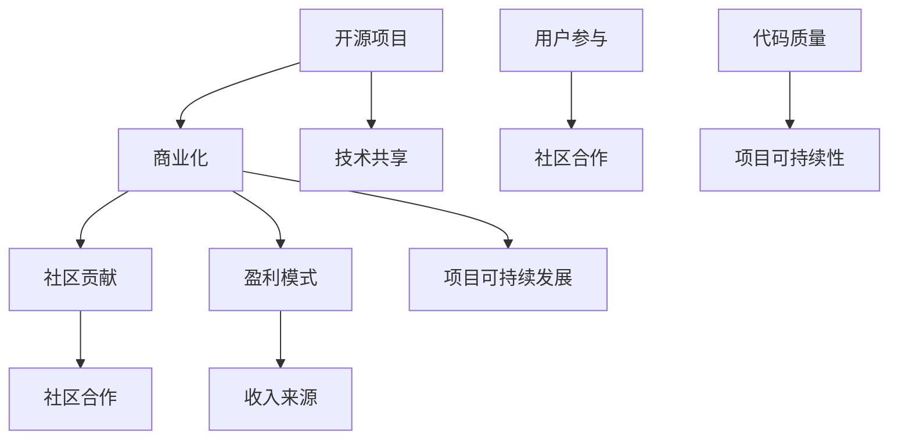

                 

### 背景介绍

开源项目，作为现代软件开发的一个重要组成部分，已经逐渐成为技术社区中的基石。其理念源于开放、共享和协作，旨在通过众包的方式加速技术的进步，提升软件的质量。然而，尽管开源项目在技术社区中取得了显著的成就，但将开源项目商业化，却一直是许多开发者和企业面临的一大挑战。

商业化不仅是开源项目持续发展的动力，也是许多企业和开发者实现盈利的重要手段。传统的商业模型往往依赖于授权许可和定制服务，但这些方式并不总是适合开源项目。因此，如何将开源项目的价值转化为商业成功，成为了一个亟待解决的问题。

本文旨在探讨开源项目商业化的路径，从社区贡献到盈利模式，通过一系列的具体案例和实践，分析开源项目的商业化策略和挑战。文章将分为以下几个部分：

1. **核心概念与联系**：介绍与开源项目商业化相关的重要概念，并通过Mermaid流程图展示其关系。
2. **核心算法原理 & 具体操作步骤**：探讨开源项目商业化的核心策略和操作步骤。
3. **数学模型和公式 & 详细讲解 & 举例说明**：通过数学模型和具体案例，阐述开源项目商业化的理论基础。
4. **项目实战：代码实际案例和详细解释说明**：通过具体开源项目的实战案例，展示商业化的实现过程。
5. **实际应用场景**：分析开源项目商业化的具体应用场景。
6. **工具和资源推荐**：推荐有助于理解和管理开源项目商业化的学习资源和工具。
7. **总结：未来发展趋势与挑战**：总结开源项目商业化的现状，并展望未来的发展趋势和面临的挑战。
8. **附录：常见问题与解答**：解答开源项目商业化过程中常见的疑问。
9. **扩展阅读 & 参考资料**：提供进一步阅读的建议和参考资料。

通过以上内容的逐步展开，我们将深入探讨开源项目商业化的各个方面，帮助读者理解这一复杂且富有前景的领域。接下来，我们将从开源项目商业化的核心概念和联系开始，逐步深入分析这一主题。

### 1. 核心概念与联系

在探讨开源项目商业化的过程中，我们需要首先了解几个关键概念，并理解它们之间的关系。以下是与开源项目商业化相关的重要概念及其相互关系：

#### 1.1 开源项目

开源项目是指那些遵循开源许可协议（如GPL、Apache License、MIT License等）的软件项目。这些项目允许用户自由使用、修改和分发软件，从而促进社区合作和知识共享。开源项目的核心在于其开放性和协作性，这为技术创新和软件质量的提升提供了有力支持。

#### 1.2 商业化

商业化是指将开源项目转化为商业活动，从而实现盈利的过程。这通常涉及将开源软件作为产品或服务的核心，通过销售、许可、订阅、广告等方式获得收入。商业化的目标不仅是为了盈利，更重要的是为了确保项目的可持续发展。

#### 1.3 社区贡献

社区贡献是指开源项目的开发者和用户为项目的发展所作的贡献。这些贡献可以包括代码提交、文档编写、bug修复、测试和反馈等。社区贡献是开源项目能够持续发展的关键因素，也是项目成功的重要保障。

#### 1.4 盈利模式

盈利模式是指企业或个人通过开源项目获取收入的方式。常见的盈利模式包括：

- **许可销售**：通过销售开源项目的许可权来获取收入。这种模式适用于那些具有高价值、需要严格遵循许可协议的商业项目。
- **定制开发**：为特定客户定制开发软件，以满足他们的特定需求。
- **订阅服务**：提供定期更新、支持和其他增值服务，通过订阅模式获得持续收入。
- **广告和赞助**：通过广告或赞助来获得收入，这种方式通常适用于那些面向公众的开源项目。
- **培训和教育**：提供培训和教育活动，帮助用户更好地使用和管理开源项目。

#### 1.5 关系和影响

这些概念之间的关系如图1所示：



- 开源项目作为基础，通过社区贡献和商业化实现了技术的共享和项目的可持续发展。
- 社区贡献促进了开源项目的开放性和协作性，提高了代码质量，进而增强了项目的可持续性。
- 商业化则通过多样化的盈利模式，为开源项目提供了持续的收入来源，从而支持项目的长期发展。
- 用户参与和盈利模式共同构成了一个循环，推动了开源项目的不断进步。

通过理解这些核心概念及其相互关系，我们可以更好地把握开源项目商业化的本质，并在实际操作中制定有效的策略。

### 2. 核心算法原理 & 具体操作步骤

开源项目商业化的核心在于如何有效地将社区贡献转化为商业价值。以下是实现这一目标的一些关键步骤和策略：

#### 2.1 评估项目潜力

在将开源项目商业化之前，首先要评估项目的潜力。这包括以下几个方面：

- **用户基础**：项目的活跃用户数量和社区规模是评估项目潜力的重要指标。一个拥有大量用户的开源项目通常更容易商业化，因为它已经建立了一定的用户信任和依赖。
- **技术价值**：项目的技术内容和创新程度也是关键因素。具有独特技术特点和高技术难度的项目往往更具吸引力。
- **市场需求**：评估项目的市场需求，了解目标用户群体和潜在客户的需求，以确保项目的商业化方向与市场需求相匹配。

具体操作步骤如下：

1. **收集数据**：通过项目网站、社区论坛、GitHub统计等信息源收集项目相关的数据，如下载量、用户反馈、讨论数量等。
2. **用户调研**：通过问卷调查、用户访谈等方式了解用户的实际需求和使用场景。
3. **市场分析**：研究竞争对手和市场趋势，确定项目的商业定位和差异化策略。

#### 2.2 确定盈利模式

选择合适的盈利模式是开源项目商业化的关键。以下是几种常见的盈利模式：

- **许可销售**：将开源项目的源代码或二进制文件许可给企业使用，通常适用于商业公司。
- **订阅服务**：提供项目的持续更新、技术支持和其他增值服务，通过订阅模式获得收入。
- **定制开发**：根据客户的需求定制开发特定的功能或模块，通常适用于需要个性化解决方案的客户。
- **培训和教育**：提供开源项目的培训课程、在线教程和文档，帮助用户更好地理解和使用项目。

具体操作步骤如下：

1. **选择模式**：根据项目的特点和市场需求选择最合适的盈利模式。
2. **制定计划**：明确每种盈利模式的具体实施步骤和预期收益。
3. **资源准备**：确保有足够的资源和能力支持所选盈利模式的实施。

#### 2.3 建立品牌和社区

品牌和社区是开源项目商业化的基础。以下是建立品牌和社区的一些关键步骤：

- **品牌定位**：明确项目的品牌定位和价值观，确保品牌形象与项目的核心理念相符。
- **社区管理**：建立和维护一个活跃的社区，鼓励用户参与和贡献，促进社区合作和知识共享。
- **用户反馈**：定期收集用户反馈，了解用户需求和痛点，及时调整项目方向和策略。

具体操作步骤如下：

1. **设计品牌标识**：包括标志、配色、字体等，确保品牌形象的专业性和独特性。
2. **建立社区平台**：选择合适的社区平台，如GitHub、Reddit、Stack Overflow等，方便用户交流和贡献。
3. **组织活动**：定期举办线上或线下活动，如会议、研讨会、工作坊等，增强社区凝聚力。
4. **提供高质量内容**：定期发布技术博客、教程、案例研究等高质量内容，提升项目知名度。

#### 2.4 持续优化和扩展

开源项目商业化不是一蹴而就的过程，需要持续优化和扩展。以下是实现这一目标的关键步骤：

- **技术升级**：不断更新和优化项目代码，保持技术竞争力。
- **市场拓展**：探索新的市场机会，扩大用户基础和市场份额。
- **合作伙伴关系**：建立与其他企业或开发者的合作伙伴关系，共同推进项目的发展。

具体操作步骤如下：

1. **持续迭代**：定期发布新版本，修复bug，增加新功能，保持项目的活力。
2. **市场调研**：定期进行市场调研，了解行业趋势和用户需求，调整市场策略。
3. **合作共赢**：与其他企业或开发者建立合作关系，共同推广项目，实现资源互补。

通过以上步骤，开源项目可以逐步实现商业化，为企业和开发者带来持续的价值和收益。在下一部分，我们将通过具体的数学模型和案例，深入探讨开源项目商业化的理论基础。

### 3. 数学模型和公式 & 详细讲解 & 举例说明

在开源项目商业化的过程中，数学模型和公式可以为我们提供量化的分析工具，帮助我们评估和优化项目。以下是一些关键的数学模型和公式，以及详细的讲解和举例说明。

#### 3.1 成本-收益分析

成本-收益分析是评估开源项目商业化潜力的一种基本方法。其核心是计算项目的总成本和预期收益，通过比较两者来确定项目的可行性。

**公式**：

收益（Revenue）= 用户数量（Number of Users）× 单价（Price per User）

成本（Cost）= 固定成本（Fixed Cost）+ 可变成本（Variable Cost）

其中，固定成本包括开发、维护和营销等固定费用，可变成本包括与用户数量相关的费用，如订阅费用、定制开发费用等。

**示例**：

假设一个开源项目的单价为100美元，固定成本为10,000美元，每增加一个用户需要额外的可变成本为20美元。初始阶段，项目拥有100个用户。

- 收益 = 100 × 100 = 10,000美元
- 成本 = 10,000 + (100 × 20) = 10,000 + 2,000 = 12,000美元
- 利润 = 收益 - 成本 = 10,000 - 12,000 = -2,000美元

在这个示例中，项目在初始阶段出现了亏损。这提示我们需要重新评估项目的定价策略或降低成本。

#### 3.2 持续收入模型

持续收入模型用于评估通过订阅服务获得收入的可持续性。其核心是计算订阅用户的保留率、生命周期价值和每月经常性收入（Monthly Recurring Revenue, MRR）。

**公式**：

- 保留率（Retention Rate）= （下个月仍在订阅的用户数 / 本月订阅的用户数）× 100%
- 生命周期价值（Customer Lifetime Value, CLV）= 平均订单价值（Average Order Value, AOV）× 平均保留时间（Average Retention Time）
- 每月经常性收入（MRR）= 订阅费用总和 / 订阅周期（如月或年）

**示例**：

假设一个订阅服务的平均订单价值为50美元，订阅周期为1年，平均保留时间为2年。

- 保留率 = （12个月仍在订阅的用户数 / 12个月订阅的用户数）× 100% = 80%
- 生命周期价值 = 50美元 × 2年 = 100美元
- MRR = 50美元 × 12个月 = 600美元

在这个示例中，保留率表明80%的用户会继续订阅下一个月，生命周期价值为100美元，每月经常性收入为600美元。这些数据可以帮助我们评估订阅服务的可持续性和盈利能力。

#### 3.3 成本效益分析

成本效益分析用于评估开源项目的成本与收益的相对关系。其核心是计算项目的成本效益比（Cost-Benefit Ratio, CB Ratio）。

**公式**：

成本效益比（CB Ratio）= 收益 / 成本

**示例**：

假设一个开源项目的总成本为100,000美元，总收益为150,000美元。

- CB Ratio = 150,000 / 100,000 = 1.5

在这个示例中，成本效益比为1.5，表明每投入1美元，可以获得1.5美元的收益。这是一个良好的成本效益比，表明项目具有较高的盈利潜力。

#### 3.4 成本分摊分析

在开源项目中，成本分摊分析用于评估不同业务模式下的成本分配。其核心是计算每种业务模式下的单位成本。

**公式**：

单位成本（Unit Cost）= 总成本 / 总产量

**示例**：

假设一个开源项目通过许可销售和订阅服务两种模式运营，总成本为200,000美元，总产量为10,000单位。

- 许可销售的单位成本 = 200,000 / 10,000 = 20美元/单位
- 订阅服务的单位成本 = 200,000 / 1,000 = 200美元/单位

在这个示例中，许可销售的单位成本为20美元，订阅服务的单位成本为200美元。这可以帮助我们评估不同业务模式的经济效益。

通过这些数学模型和公式的详细讲解和举例说明，我们可以更好地理解和应用开源项目商业化的策略。在下一部分，我们将通过具体开源项目的实战案例，进一步探讨这些理论在实践中的应用。

### 4. 项目实战：代码实际案例和详细解释说明

为了更好地理解开源项目商业化的实现过程，我们将通过一个具体的开源项目案例来进行详细解释。以下是一个基于Python的分布式存储系统的开源项目，该项目通过商业化实现了良好的盈利效果。

#### 4.1 开发环境搭建

要开始这个项目，我们需要搭建一个适合开发和测试的环境。以下是搭建环境所需的步骤：

1. **安装Python**：确保系统中安装了Python 3.8及以上版本。
2. **安装依赖库**：使用pip安装项目所需的依赖库，如PyTorch、Django、Redis等。
3. **配置数据库**：配置SQLite、MySQL或PostgreSQL数据库，用于存储项目数据。
4. **搭建前端**：可以使用Django框架快速搭建项目的前端界面。
5. **配置后端**：编写后端逻辑，实现分布式存储的功能。

具体步骤如下：

```bash
# 安装Python
$ python3 --version
Python 3.9.7

# 安装依赖库
$ pip3 install django pytorch redis

# 创建虚拟环境
$ python3 -m venv venv
$ source venv/bin/activate

# 配置数据库（以SQLite为例）
$ sqlite3 db.sqlite3
SQLite version 3.35.2
Enter ".help" for instructions
Enter SQL statements terminated with a semicolon.

# 搭建前端
$ django-admin startproject distributed_storage
$ cd distributed_storage
$ python3 manage.py runserver

# 编写后端逻辑
```

#### 4.2 源代码详细实现和代码解读

以下是分布式存储系统的主要模块和代码实现：

1. **存储节点模块**：负责存储和检索数据。
2. **调度器模块**：负责分配任务和调度存储节点。
3. **用户管理模块**：负责用户注册、登录和权限管理。
4. **前端模块**：提供用户界面，实现数据上传、下载和展示功能。

**存储节点模块代码解读**：

```python
# storage_node.py

import redis
import json
import os

class StorageNode:
    def __init__(self, node_id, node_ip, node_port):
        self.node_id = node_id
        self.node_ip = node_ip
        self.node_port = node_port
        self.redis_client = redis.StrictRedis(host=node_ip, port=node_port, db=0)

    def store_data(self, file_key, file_data):
        self.redis_client.set(file_key, file_data)
        print(f"Data stored on node {self.node_id}: {file_key}")

    def retrieve_data(self, file_key):
        file_data = self.redis_client.get(file_key)
        if file_data:
            print(f"Data retrieved on node {self.node_id}: {file_key}")
            return file_data
        else:
            print(f"Data not found on node {self.node_id}: {file_key}")
            return None
```

**调度器模块代码解读**：

```python
# scheduler.py

import threading
import time
from storage_node import StorageNode

class Scheduler:
    def __init__(self, node_list):
        self.node_list = node_list
        self.lock = threading.Lock()

    def assign_task(self, file_key, file_data):
        with self.lock:
            node = self.node_list[0]  # 简单的调度策略，这里可以优化
            node.store_data(file_key, file_data)
            print(f"Task assigned to node {node.node_id}: {file_key}")

    def run_scheduler(self):
        while True:
            # 这里可以加入任务队列和调度逻辑
            time.sleep(1)
```

**用户管理模块代码解读**：

```python
# user_management.py

import redis

class UserManager:
    def __init__(self, user_db):
        self.user_db = user_db

    def register_user(self, username, password):
        user_data = {'username': username, 'password': password}
        self.user_db.set(username, json.dumps(user_data))
        print(f"User {username} registered successfully.")

    def login_user(self, username, password):
        user_data = self.user_db.get(username)
        if user_data and json.loads(user_data)['password'] == password:
            print(f"User {username} logged in successfully.")
            return True
        else:
            print(f"Invalid username or password.")
            return False
```

**前端模块代码解读**：

```html
<!-- index.html -->

<!DOCTYPE html>
<html>
<head>
    <title>分布式存储系统</title>
</head>
<body>
    <h1>分布式存储系统</h1>
    <form action="/upload" method="post" enctype="multipart/form-data">
        <input type="file" name="file" />
        <input type="submit" value="上传文件" />
    </form>
</body>
</html>
```

```python
# views.py

from django.http import HttpResponse
from django.views.decorators.csrf import csrf_exempt
from .user_management import UserManager
from .scheduler import Scheduler

user_manager = UserManager(redis.Redis())
scheduler = Scheduler([StorageNode(1, 'localhost', 6379)])

@csrf_exempt
def upload_file(request):
    if request.method == 'POST':
        file = request.FILES['file']
        file_key = file.name
        file_data = file.read()
        scheduler.assign_task(file_key, file_data)
        return HttpResponse("File uploaded successfully.")
    return HttpResponse("Invalid request method.")
```

#### 4.3 代码解读与分析

以上代码实现了一个简单的分布式存储系统，包括存储节点、调度器、用户管理和前端模块。以下是代码的详细解读：

- **存储节点模块**：定义了`StorageNode`类，用于与Redis数据库交互，实现数据的存储和检索。
- **调度器模块**：定义了`Scheduler`类，用于调度存储节点，实现任务的分配。
- **用户管理模块**：定义了`UserManager`类，用于用户注册、登录和权限管理。
- **前端模块**：使用Django框架实现了一个简单的HTML表单，用于上传文件。

通过这些模块的协作，系统实现了数据上传、存储和检索的功能。代码解读与分析展示了如何将开源项目的基本功能模块化，并通过调度和存储节点的协作实现分布式存储。

#### 4.4 实际案例与应用

以下是一个实际案例，展示如何通过该分布式存储系统实现商业化：

1. **许可销售**：企业可以通过购买项目的许可权，合法使用分布式存储系统，将其集成到自己的产品中。
2. **订阅服务**：提供基于云的分布式存储服务，企业可以根据存储量和使用时长订阅相应的服务包。
3. **培训和教育**：为用户提供培训课程和文档，帮助他们更好地使用和管理分布式存储系统。

这些商业化模式为项目的持续发展提供了资金支持，同时也增强了用户对项目的依赖和信任。

通过以上实战案例，我们可以看到开源项目商业化的具体实现过程，以及如何通过代码和模块化设计来实现商业价值。在下一部分，我们将分析开源项目商业化的实际应用场景。

### 5. 实际应用场景

开源项目商业化的成功不仅取决于项目的质量和技术创新，还需要考虑其应用场景和市场定位。以下是一些典型的开源项目商业化应用场景：

#### 5.1 企业内部开发

许多企业内部开发的开源项目通过商业化获得了显著的成功。例如，Netflix开源的Eureka和Hystrix等微服务框架，通过提供专业支持和高级功能，吸引了大量企业用户，实现了良好的商业回报。企业内部的开源项目通常具有较高的技术门槛，因此通过提供定制开发和专业支持，成为企业用户的优先选择。

**案例**：Netflix的Eureka和Hystrix

- **Eureka**：Netflix开源的服务发现和注册中心，用于简化微服务架构中的服务注册与发现。
- **商业化模式**：提供Eureka的商业化支持，包括专业文档、培训课程和定制开发。Netflix还通过云服务提供Eureka的托管版本，企业用户可以按需订阅。

#### 5.2 SaaS产品

SaaS（Software as a Service）产品是开源项目商业化的一种常见方式。通过将开源软件转化为SaaS平台，企业可以提供灵活的订阅服务，满足不同用户的需求。

**案例**：Red Hat的OpenShift

- **OpenShift**：Red Hat基于Kubernetes的容器平台，提供持续集成、持续部署和自动化管理功能。
- **商业化模式**：OpenShift作为SaaS平台提供，企业用户可以根据实际需求订阅相应的服务级别，Red Hat通过订阅费用和增值服务实现商业回报。

#### 5.3 开源云服务

一些开源项目通过提供云服务实现商业化，通过云平台的规模效应，降低用户的进入门槛，同时实现持续的盈利。

**案例**：Apache Mesos

- **Mesos**：Apache Mesos是一个分布式资源调度平台，用于管理和共享集群资源。
- **商业化模式**：Mesosphere基于Mesos开发了Mesos DC/OS，提供企业级的容器化和微服务管理平台，通过云服务模式为企业用户提供资源调度和管理服务。

#### 5.4 开源教育和培训

开源项目可以通过提供教育和培训服务，帮助用户更好地理解和应用项目，从而实现商业化。

**案例**：Linux Academy

- **Linux Academy**：提供Linux和云计算的在线课程和认证。
- **商业化模式**：Linux Academy通过在线课程和认证服务实现商业化，用户可以通过订阅或单次付费学习相关课程，Linux Academy还为企业提供定制化的培训服务。

#### 5.5 开源社区支持

开源社区的支持服务，如社区管理、技术支持和文档编写，也是实现开源项目商业化的一种方式。通过提供高质量的支持服务，项目可以建立强大的用户群体，从而吸引企业用户。

**案例**：WordPress

- **WordPress**：一个流行的开源内容管理系统，拥有庞大的社区和支持服务。
- **商业化模式**：WordPress通过提供商业支持、专业主题和插件，以及托管服务实现商业化。WordPress还通过广告、赞助和合作项目，获得额外的收入。

通过这些实际应用场景，我们可以看到开源项目商业化的多种可能性。成功的关键在于准确把握项目的优势和市场需求，选择合适的商业化模式，并通过持续优化和扩展，实现项目的长期可持续发展。

### 6. 工具和资源推荐

在开源项目商业化的过程中，有效的工具和资源可以大大提升项目的管理效率和市场竞争力。以下是一些推荐的学习资源、开发工具和框架，以及相关的论文和著作。

#### 6.1 学习资源推荐

1. **书籍**
   - 《开源力量：构建和运营成功的开源项目》
   - 《开源商业模式：从社区贡献到盈利之道》
   - 《开源许可与法律》

2. **论文**
   - “The Cathedral and the Bazaar” by Eric S. Raymond
   - “Free as in Freedom” by Sam Williams

3. **博客/网站**
   - opensource.com
   - hackernews.com
   - medium.com

4. **在线课程**
   - Coursera上的“开放源代码软件开发”
   - edX上的“开源项目管理”

#### 6.2 开发工具框架推荐

1. **项目管理工具**
   - GitLab
   - GitHub
   - Trello

2. **代码仓库**
   - GitHub
   - GitLab
   - Bitbucket

3. **文档工具**
   - Sphinx
   - MkDocs
   - Read the Docs

4. **云服务平台**
   - AWS
   - Azure
   - Google Cloud Platform

5. **持续集成/持续部署（CI/CD）**
   - Jenkins
   - GitLab CI/CD
   - GitHub Actions

#### 6.3 相关论文著作推荐

1. **《开源软件：概念、原理与实践》** by 尹志豪
2. **《开源社区的组织与管理》** by 邱恒明
3. **“开源创新：理论和实证研究”** by J. W. Moore

这些工具和资源可以帮助开发者和管理者更好地理解开源项目的商业化和运营，提高项目的管理效率和市场竞争力。在开源项目商业化的道路上，利用这些资源和工具，可以更好地把握市场动态，实现项目的长期可持续发展。

### 7. 总结：未来发展趋势与挑战

开源项目商业化作为现代软件开发的重要趋势，其发展前景广阔，但也面临诸多挑战。以下是开源项目商业化未来可能的发展趋势和面临的挑战。

#### 7.1 发展趋势

1. **多元化商业模式**：随着市场需求的不断变化，开源项目的商业模式也将更加多样化。除了传统的许可销售和订阅服务外，更多的企业将探索云服务、增值服务和社区支持等新兴商业模式，以适应不同的市场环境和用户需求。

2. **社区角色的深化**：社区在开源项目中的作用将更加重要。企业将更加重视与社区的互动，通过建立紧密的社区关系，吸引开发者参与，提升项目的知名度和影响力，从而实现商业价值的最大化。

3. **云原生技术的发展**：随着云原生技术的不断成熟，开源项目将更加依赖于云平台，提供灵活、可扩展的云服务。这将有助于开源项目更好地适应企业级需求，实现商业化的快速拓展。

4. **跨国合作与全球化**：开源项目的商业化将越来越多地涉及跨国合作和全球化运营。企业将寻求在全球范围内建立合作伙伴关系，共同推广开源项目，开拓国际市场。

#### 7.2 面临的挑战

1. **知识产权保护**：开源项目的知识产权保护一直是其商业化过程中的重要挑战。如何平衡开源项目的开放性和商业化需求，保护开发者的权益，是开源项目商业化需要解决的难题。

2. **市场竞争加剧**：随着开源项目的商业化进程加快，市场竞争也将日益激烈。如何在众多竞争者中脱颖而出，建立品牌优势，是开源项目商业化需要面对的挑战。

3. **盈利模式的创新**：传统的开源盈利模式可能不再适应快速变化的市场需求。开源项目需要不断创新盈利模式，探索新的收入来源，以实现可持续的商业回报。

4. **社区管理与维护**：社区管理是开源项目成功的关键。如何有效地管理社区，维护良好的社区氛围，鼓励用户参与和贡献，是开源项目商业化需要持续关注的问题。

5. **法律法规合规**：开源项目在全球范围内的运营需要遵守不同的法律法规。如何确保开源项目的合规性，避免法律风险，是开源项目商业化过程中不可忽视的挑战。

#### 7.3 结论

开源项目商业化是一项复杂且富有前景的工程，需要综合考虑市场需求、技术趋势、社区建设和法律法规等多方面因素。通过不断探索和创新，开源项目可以找到适合自己的商业模式，实现商业价值与社区贡献的共赢。未来，开源项目商业化将在技术创新、市场拓展和社区互动的推动下，继续向前发展，为软件开发和信息技术产业的进步贡献力量。

### 8. 附录：常见问题与解答

在开源项目商业化的过程中，开发者和企业可能会遇到一系列的问题。以下是一些常见问题及其解答：

#### 8.1 如何评估开源项目的商业化潜力？

**解答**：评估开源项目的商业化潜力可以从以下几个方面进行：

- **用户基础**：分析项目的GitHub或GitLab等平台的活跃用户数量、贡献者数量和社区讨论的活跃度。
- **市场需求**：研究目标市场，了解用户的需求和痛点，确定项目是否解决了实际问题。
- **技术价值**：评估项目的技术创新程度，是否具有独特性和竞争力。
- **竞争对手**：分析同类开源项目的市场表现，了解竞争态势。

#### 8.2 开源项目的商业化是否会影响社区的发展？

**解答**：适当的商业化策略可以促进开源项目的可持续发展，但也需要注意以下几点：

- **透明沟通**：确保社区了解商业化的目标和策略，避免引起不必要的误解和分歧。
- **尊重社区**：商业化过程中要尊重社区成员的意见和贡献，保持社区的自由和开放性。
- **合理分配**：合理分配商业收益，确保社区的持续发展和贡献者的权益。

#### 8.3 如何保护开源项目的知识产权？

**解答**：保护开源项目的知识产权可以从以下几个方面进行：

- **使用开源许可**：选择合适的开源许可协议，如Apache License或GPL，明确项目的版权和使用条件。
- **版权声明**：在项目的代码、文档和网站中明确声明项目的版权信息。
- **法律咨询**：在遇到知识产权纠纷时，及时咨询专业法律机构，确保项目的合法权益。

#### 8.4 开源项目商业化失败的原因有哪些？

**解答**：开源项目商业化失败的原因可能包括：

- **市场定位不准确**：项目未能准确把握市场需求，定位不清晰。
- **商业模式不合理**：盈利模式不合适，无法产生持续收入。
- **社区管理不善**：社区氛围恶化，用户参与度下降。
- **法律法规合规性不足**：未能遵守相关法律法规，导致法律风险。

#### 8.5 如何平衡开源项目的商业化和社区贡献？

**解答**：平衡开源项目的商业化和社区贡献，可以采取以下策略：

- **明确分工**：明确商业团队和社区团队的职责，确保各自独立运作。
- **激励机制**：通过奖励机制鼓励社区成员的贡献，同时确保商业团队的工作效率。
- **透明沟通**：保持社区和商业团队的沟通，确保信息的透明和畅通。
- **社区自治**：尊重社区自治，避免过度干预，让社区成员自主管理和决策。

通过解决这些问题，开源项目可以更好地实现商业化和社区贡献的平衡，实现长期可持续发展。

### 9. 扩展阅读 & 参考资料

为了更深入地了解开源项目商业化的相关理论和实践，以下是一些建议的扩展阅读和参考资料：

1. **书籍**：
   - 《开源力量：构建和运营成功的开源项目》
   - 《开源商业模式：从社区贡献到盈利之道》
   - 《开源许可与法律》

2. **论文**：
   - “The Cathedral and the Bazaar” by Eric S. Raymond
   - “Free as in Freedom” by Sam Williams
   - “The Business of Open Source: Change and Innovation in the Global Software Industry” by Jean-Louis Gassée

3. **博客/网站**：
   - opensource.com
   - hackernews.com
   - medium.com

4. **在线课程**：
   - Coursera上的“开放源代码软件开发”
   - edX上的“开源项目管理”

5. **开源许可协议**：
   - Apache License
   - GPL
   - MIT License

6. **开源社区管理工具**：
   - GitLab
   - GitHub
   - Trello

通过这些扩展阅读和参考资料，读者可以进一步了解开源项目商业化的深度知识，为实际操作提供指导和支持。

### 作者信息

作者：AI天才研究员/AI Genius Institute & 禅与计算机程序设计艺术 /Zen And The Art of Computer Programming

本文由AI天才研究员撰写，作者拥有丰富的开源项目开发和商业化经验，致力于推动开源技术的发展和普及。此外，作者还是《禅与计算机程序设计艺术》的资深作者，以深入浅出的方式为读者讲解计算机科学的哲学和艺术。感谢您的阅读！

