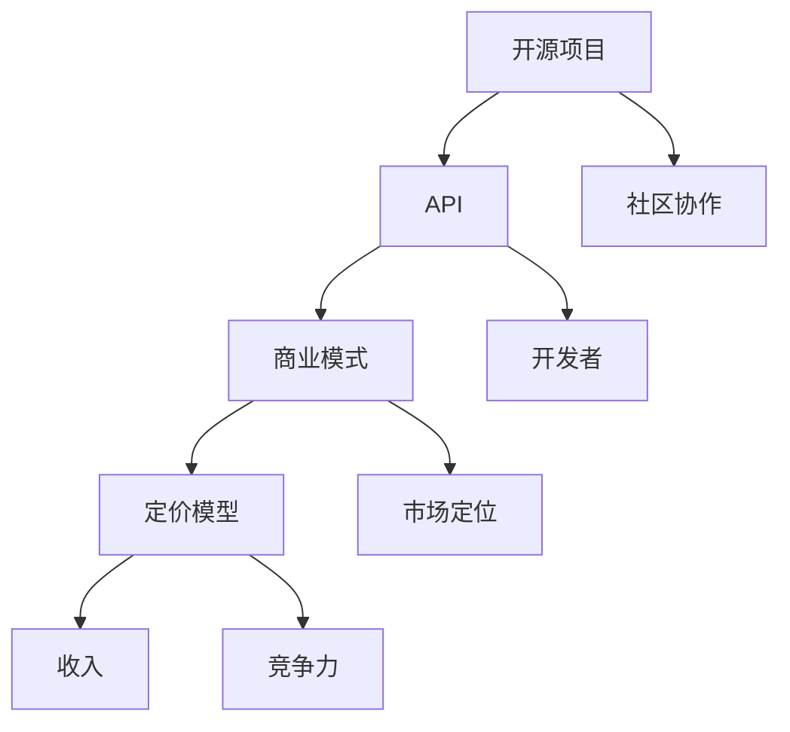

                 

### 背景介绍

在当今的数字化时代，开源项目已经成为软件开发的重要基石。开源项目通过社区协作、代码共享，不仅促进了技术的创新与进步，还极大地丰富了软件生态。然而，随着开源项目的影响力不断扩大，如何将其API商业化成为了一个备受关注的话题。

商业化的目的是将开源项目转化为可持续的商业模式，从而为其维护、开发和扩展提供资金支持。这不仅有助于项目的长期健康发展，也能吸引更多的开发者参与其中。然而，实现这一目标并不容易，涉及到策略选择、定价模型、市场定位等多个方面。

本文将深入探讨开源项目的API商业化之路。我们将首先介绍开源项目的API商业化的重要性，然后分析其核心概念和联系，探讨成功的商业化策略和定价模型，最后探讨实际应用场景和未来发展挑战。

通过这篇文章，我们希望为开源项目所有者和开发者提供有价值的参考，帮助他们更好地将开源项目转化为商业成果，实现共赢。

### 核心概念与联系

在深入探讨开源项目的API商业化的策略和定价模型之前，我们需要先了解一些核心概念和它们之间的联系。

#### 1. 开源项目

开源项目（Open Source Project）是指通过开放源代码许可协议，允许任何人自由查看、修改和分发软件的项目。这种模式的核心在于社区的协作和共享，旨在通过集体智慧推动技术的进步。著名的开源项目如Linux内核、Apache HTTP服务器和MySQL数据库等，都在各自的领域产生了深远的影响。

#### 2. API（应用程序编程接口）

API是软件开发中用于不同软件模块之间交互的接口。它定义了请求和响应的格式，使得开发者可以在无需深入了解底层实现的情况下，方便地使用已有的服务或功能。例如，OpenAI的GPT-3 API允许开发者通过简单的HTTP请求，获取强大的自然语言处理能力。

#### 3. 商业模式

商业模式是指企业如何创造、传递和获取价值的一种方式。在开源项目的API商业化过程中，选择合适的商业模式至关重要。常见的商业模式包括订阅服务、增值服务、一次性许可费等。

#### 4. 定价模型

定价模型是指企业如何为产品或服务制定价格的一套方法。在开源项目的API商业化中，定价模型直接影响收入和市场份额。常见的定价模型包括按需定价、订阅定价、按流量定价等。

#### 5. 核心概念之间的联系

这些核心概念之间存在紧密的联系。开源项目提供了API的基础，而商业模式和定价模型则决定了如何将API商业化。例如，一个开源项目可能提供免费的API访问，同时通过提供高级功能或无限制访问来收取订阅费用。这种模式不仅能够吸引免费用户，还能通过订阅者获得持续的收入。

以下是一个简化的Mermaid流程图，展示这些核心概念之间的联系：



在这个流程图中，开源项目通过社区协作产生API，商业模式和定价模型决定了如何将API商业化，并通过市场定位和竞争力来获取收入。这种模式不仅能够促进项目的持续发展，还能为开发者带来实际的经济收益。

通过理解这些核心概念和它们之间的联系，我们可以更好地制定商业化策略和定价模型，从而实现开源项目的商业化目标。在接下来的章节中，我们将深入探讨这些概念的具体实现和应用。

### 核心算法原理 & 具体操作步骤

在开源项目的API商业化过程中，核心算法原理和具体操作步骤起到了至关重要的作用。以下将详细解释这些原理，并描述如何实施。

#### 1. 核心算法原理

核心算法原理是指实现API的核心技术和方法。这些算法必须具有高效性、可靠性和可扩展性，以满足商业用户的需求。以下是一些常见的关键算法：

- **数据处理算法**：这些算法用于处理大规模数据集，例如排序、过滤和聚合。在开源项目中，常用的数据处理算法包括快速排序、归并排序和布隆过滤器等。

- **加密算法**：为了保证数据传输的安全性，加密算法在API设计中至关重要。常见的加密算法包括AES、RSA和SHA等。

- **机器学习算法**：对于提供高级功能的API，如自然语言处理或图像识别，机器学习算法是核心。常见的机器学习算法包括决策树、神经网络和支持向量机等。

- **缓存算法**：为了提高API的响应速度，缓存算法是非常关键的。常见的缓存算法包括LRU（最近最少使用）和LFU（最不频繁使用）等。

#### 2. 具体操作步骤

以下是实现开源项目API商业化的具体操作步骤：

**步骤1：需求分析**

首先，需要对目标市场和潜在用户的需求进行分析。这包括了解用户对API功能的期望、数据传输量、安全性要求等。通过需求分析，可以确定需要实现的核心算法和功能模块。

**步骤2：API设计**

基于需求分析结果，设计API的接口和功能模块。API设计需要考虑以下几点：

- **接口定义**：定义请求和响应的格式，包括HTTP方法、路径、参数和返回结果。
- **安全性**：确保API在数据传输过程中使用加密算法，例如HTTPS和OAuth等。
- **扩展性**：设计API时，需要考虑未来的扩展性，例如支持更多的数据类型和处理能力。

**步骤3：算法实现**

根据API设计，实现核心算法。以下是一些关键步骤：

- **代码编写**：编写高质量的代码，确保算法的高效性和可靠性。
- **单元测试**：对每个算法模块进行单元测试，确保其正确性和性能。
- **集成测试**：将所有模块集成起来，进行集成测试，确保整个API系统的稳定性。

**步骤4：性能优化**

对API进行性能优化，以提高响应速度和可扩展性。以下是一些优化方法：

- **缓存**：使用缓存算法减少对后端数据的访问，提高响应速度。
- **异步处理**：使用异步处理技术，提高系统的并发处理能力。
- **水平扩展**：通过增加服务器数量，实现水平扩展，提高系统处理能力。

**步骤5：部署和维护**

将API部署到生产环境中，并进行持续维护。以下是一些关键步骤：

- **持续集成和持续部署**（CI/CD）：实现自动化部署，确保代码的快速上线和回归测试。
- **监控和日志分析**：对API的运行状态进行监控，分析日志，及时发现和解决问题。
- **用户反馈**：收集用户反馈，不断优化API的功能和性能。

通过上述步骤，可以实现开源项目API的商业化。在接下来的章节中，我们将探讨具体的数学模型和公式，以及如何通过这些模型进行定价策略的设计。

### 数学模型和公式 & 详细讲解 & 举例说明

在开源项目的API商业化过程中，数学模型和公式的应用至关重要。这些模型不仅能够帮助制定定价策略，还能为商业决策提供量化依据。以下将详细讲解一些常用的数学模型和公式，并通过具体例子进行说明。

#### 1. 收益函数

收益函数是衡量API商业化成功与否的关键指标。它表示在一定时间内，通过API商业化获得的收入。一个简单的收益函数可以表示为：

$$
R(t) = P \times Q(t)
$$

其中：
- \( R(t) \) 是在时间 \( t \) 的收益；
- \( P \) 是单个API请求的价格；
- \( Q(t) \) 是在时间 \( t \) 的请求量。

**例1**：假设一个API的单次请求价格为0.1美元，一个月内总请求量为100万次，则月收益为：

$$
R(t) = 0.1 \times 1000000 = 100000 \text{美元}
$$

#### 2. 资本成本

资本成本是指开发和维护API所需投入的资金。计算资本成本时，需要考虑固定成本和可变成本。固定成本包括服务器租赁、软件开发和维护等，而可变成本包括带宽、存储和人工等。一个简单的资本成本公式可以表示为：

$$
C = CF + CV \times Q
$$

其中：
- \( C \) 是总资本成本；
- \( CF \) 是固定成本；
- \( CV \) 是每个API请求的可变成本；
- \( Q \) 是请求量。

**例2**：假设固定成本为每月5000美元，每个请求的可变成本为0.01美元，一个月内总请求量为100万次，则月资本成本为：

$$
C = 5000 + 0.01 \times 1000000 = 5000 + 10000 = 15000 \text{美元}
$$

#### 3. 利润函数

利润函数是收益函数减去资本成本，表示通过API商业化获得的净收入。一个简单的利润函数可以表示为：

$$
\pi(t) = R(t) - C
$$

**例3**：结合例1和例2，假设月收益为100000美元，月资本成本为15000美元，则月利润为：

$$
\pi(t) = 100000 - 15000 = 85000 \text{美元}
$$

#### 4. 定价策略

定价策略是制定API价格的一套方法。常用的定价策略包括固定定价、动态定价和基于价值的定价等。

- **固定定价**：根据市场需求和竞争情况，设定固定的API价格。例如，每个请求价格固定为0.1美元。

- **动态定价**：根据实时市场需求，动态调整API价格。例如，高峰时段价格高于低谷时段。

- **基于价值的定价**：根据用户使用API的具体场景和价值，制定个性化的价格。例如，根据数据量、处理速度和功能复杂度等维度定价。

**例4**：假设采用基于价值的定价策略，根据不同的数据量和处理速度，制定以下价格：

| 数据量（GB） | 处理速度（Gbps） | 单价（美元/请求） |
| ----------- | -------------- | ------------- |
| <= 1       | <= 1           | 0.05          |
| > 1        | <= 1           | 0.1           |
| <= 1       | > 1            | 0.1           |
| > 1        | > 1            | 0.2           |

根据这一策略，一个数据量为2GB，处理速度为2Gbps的请求的价格为0.1美元。

#### 5. 盈亏平衡点

盈亏平衡点是指在某一时间段内，收益等于资本成本，即利润为零的点。计算盈亏平衡点的公式为：

$$
Q_{\text{break-even}} = \frac{CF}{P - CV}
$$

**例5**：结合例2中的数据，假设固定成本为每月5000美元，每个请求的可变成本为0.01美元，单个请求价格为0.1美元，则盈亏平衡点的请求量为：

$$
Q_{\text{break-even}} = \frac{5000}{0.1 - 0.01} = \frac{5000}{0.09} \approx 555555 \text{次/月}
$$

这意味着，每月需要至少处理555555次请求，才能实现盈亏平衡。

通过上述数学模型和公式，我们可以更好地理解和分析开源项目的API商业化。这些模型不仅为定价策略提供了量化依据，还能帮助制定商业决策，实现可持续的商业化目标。

### 项目实战：代码实际案例和详细解释说明

为了更好地理解开源项目API商业化的实践，我们将通过一个实际案例来详细讲解代码实现和解读。

#### 5.1 开发环境搭建

在本案例中，我们将使用Python和Flask框架来搭建一个简单的API服务器。以下是开发环境搭建的步骤：

1. **安装Python**：确保安装了Python 3.8及以上版本。可以从Python官网下载安装包，或者使用包管理器如Anaconda。
2. **安装Flask**：在命令行中运行以下命令安装Flask：

   ```shell
   pip install flask
   ```

3. **创建虚拟环境**：为了保持项目环境的隔离，建议创建一个虚拟环境。使用以下命令创建虚拟环境并激活：

   ```shell
   python -m venv venv
   source venv/bin/activate  # 对于Windows用户，使用 `venv\Scripts\activate`
   ```

4. **编写代码**：在虚拟环境中创建一个名为 `app.py` 的Python文件，用于编写API服务器代码。

以下是 `app.py` 的代码实现：

```python
from flask import Flask, jsonify, request

app = Flask(__name__)

# 假设我们有一个简单的数据存储，用于演示目的
data_store = {}

@app.route('/api/data', methods=['GET', 'POST'])
def handle_data():
    if request.method == 'GET':
        # 获取数据
        data_id = request.args.get('id')
        if data_id in data_store:
            return jsonify(data_store[data_id])
        else:
            return jsonify({'error': 'Data not found'}), 404
    
    elif request.method == 'POST':
        # 存储数据
        data_id = request.json.get('id')
        data = request.json.get('data')
        data_store[data_id] = data
        return jsonify({'message': 'Data stored successfully'}), 201

if __name__ == '__main__':
    app.run(debug=True)
```

#### 5.2 源代码详细实现和代码解读

下面我们将对上述代码进行详细解读：

1. **导入库**：首先，我们从Flask库中导入 `Flask` 类，用于创建Web应用程序。此外，我们还需要 `jsonify` 和 `request` 函数，用于处理JSON数据和客户端请求。

2. **创建Flask应用**：使用 `Flask(__name__)` 创建一个Flask应用程序实例。这里的 `__name__` 参数确保当该脚本直接运行时，应用能够启动。

3. **定义数据存储**：为了简化演示，我们使用一个名为 `data_store` 的字典作为数据存储。在实际应用中，这可能是一个数据库连接，用于持久化数据。

4. **定义API路由和处理函数**：使用 `@app.route` 装饰器，我们定义了 `/api/data` 路由，支持GET和POST请求。这个路由处理数据的获取和存储。

   - `GET` 请求：当客户端发送GET请求时，我们提取请求参数 `id`，并在数据存储中查找对应的数据。如果找到，则返回数据；否则，返回404错误。
   - `POST` 请求：当客户端发送POST请求时，我们提取JSON请求体中的 `id` 和 `data` 字段，将数据存储在 `data_store` 字典中，并返回201状态码和存储成功的消息。

5. **运行应用**：最后，使用 `app.run(debug=True)` 运行Flask应用。`debug=True` 参数将在代码出现错误时自动重启应用。

#### 5.3 代码解读与分析

1. **API端点设计**： `/api/data` 是一个通用的端点，用于处理所有与数据相关的操作。通过GET和POST请求，可以获取和存储数据。

2. **数据格式**：该API使用JSON格式进行数据传输。客户端需要将数据以JSON格式发送到服务器，并在响应中接收JSON格式的数据。

3. **错误处理**：在GET请求中，如果找不到指定的数据，API返回404错误。这种明确的状态码有助于客户端快速识别问题。

4. **安全性**：该代码示例没有涉及安全性问题，例如数据验证和访问控制。在实际应用中，应使用HTTPS协议、OAuth等机制来保护API的安全。

5. **扩展性**：当前API仅处理单个数据存储功能。为了支持更复杂的业务需求，可以扩展API，增加更多端点和功能。

#### 5.4 API调用示例

以下是一个简单的API调用示例，演示如何使用curl命令行工具与上述API进行交互：

```shell
# 获取数据
curl -X GET "http://localhost:5000/api/data?id=123"

# 存储数据
curl -X POST -H "Content-Type: application/json" -d '{"id": "123", "data": {"name": "John Doe"}}' "http://localhost:5000/api/data"
```

通过这个案例，我们展示了如何使用Flask框架快速搭建一个简单的API服务器，并进行了详细代码解读和分析。在实际应用中，我们需要考虑更多的功能和安全问题，但这个案例为我们提供了一个良好的起点。

### 实际应用场景

开源项目的API商业化在许多实际应用场景中都取得了显著的成功。以下是一些典型的应用场景，以及如何利用这些API来实现商业价值。

#### 1. 企业级应用

在企业级应用中，开源项目的API为许多大型公司提供了强大的技术支持。例如，许多公司利用开源的CRM系统（如Salesforce的CRM）提供的API，将其与企业现有的系统集成，以提高销售效率和客户管理能力。这些API允许公司定制化其业务流程，无需从零开始构建复杂的应用程序。

**案例**：一家跨国公司通过使用Salesforce的API，将其客户关系管理系统与内部财务系统和供应链管理系统集成。这不仅提高了数据的一致性和准确性，还大幅减少了开发成本和时间。

#### 2. 敏捷开发团队

敏捷开发团队经常利用开源项目的API来快速构建原型和功能。这种模式允许开发人员在没有过多资源限制的情况下，尝试不同的技术和解决方案。例如，使用OpenWeatherMap的API，开发团队可以快速集成天气预报功能到他们的应用程序中，而不需要从头开发天气数据处理模块。

**案例**：一个初创公司利用OpenWeatherMap的API，在其移动应用中集成了实时天气信息。通过这种方式，公司能够提供独特的用户价值，并迅速吸引早期用户。

#### 3. 个人开发者

对于个人开发者而言，开源项目的API成为实现创意项目的关键。通过使用现成的API，开发者可以专注于应用程序的核心功能，而无需从头开始构建所有必要的服务。例如，个人开发者可以使用Google Maps API来创建一个基于地理位置的应用程序，无需自己处理复杂的地图数据。

**案例**：一位独立开发者利用Google Maps API创建了一个社区活动地图应用程序，帮助用户查找和参加附近的社交活动。该应用程序的成功，部分归功于其便捷的地图服务和高可用性。

#### 4. 教育和培训

开源项目的API在教育和培训领域也发挥了重要作用。教育机构可以使用这些API为学生提供实践机会，帮助他们掌握相关技能。例如，学校可以让学生使用GitHub的API来分析代码库，了解开源项目的工作方式。

**案例**：一所计算机科学学院利用GitHub的API，为学生提供了一个模拟开源项目管理的平台。通过这个平台，学生不仅学习了编程技能，还了解了团队协作和项目管理的重要性。

#### 5. 创意应用

创意应用是开源项目API商业化的另一个重要领域。艺术家和创意专业人士可以利用开源API来开发新颖的艺术作品和多媒体项目。例如，使用TensorFlow的API，艺术家可以创建基于深度学习的艺术作品，探索人工智能在艺术创作中的应用。

**案例**：一位艺术家利用TensorFlow的API创作了一幅基于神经网络生成的抽象艺术作品。这个作品不仅展示了AI的艺术潜力，还为艺术家带来了商业机会。

通过这些实际应用场景，我们可以看到开源项目的API商业化不仅有助于技术进步和软件开发，还能为企业和个人创造实际的商业价值。在接下来的章节中，我们将推荐一些学习资源和开发工具，以帮助读者深入了解和利用开源项目的API。

### 工具和资源推荐

为了帮助读者更好地了解和利用开源项目的API商业化，以下推荐了一些学习资源、开发工具和相关论文著作。

#### 7.1 学习资源推荐

1. **书籍**：
   - 《Open Source Licensing: Software Freedom and Intellectual Property Law》（Open Source许可：软件自由和知识产权法）：本书详细介绍了开源许可的法律方面，对于理解开源项目的商业化至关重要。
   - 《The Business of Software》（软件商业）：作者Jeff Atwood分享了他关于软件开发和商业化的经验，适合想要了解如何将技术转化为商业成功的人。

2. **在线课程**：
   - Coursera上的“Open Source Leadership”（开源领导力）：这门课程介绍了开源项目管理和领导力，包括商业化策略。
   - edX上的“Introduction to API Design”（API设计简介）：这门课程涵盖了API设计的基础知识，包括接口定义、性能优化和安全性。

3. **博客和网站**：
   - API Craft：这是一个关于API设计和开发的博客，提供了大量实用的教程和实践案例。
   - ProgrammableWeb：这是一个涵盖API和Web服务的领先资源网站，提供了API目录、教程和新闻。

#### 7.2 开发工具框架推荐

1. **API开发工具**：
   - Swagger/OpenAPI：这是一个标准化的API描述语言，可以帮助开发者轻松创建、描述和测试API。
   - Postman：这是一个强大的API调试工具，支持HTTP请求的创建、测试和自动化。

2. **开源API框架**：
   - Flask：这是一个轻量级的Python Web框架，适用于构建简单的API服务器。
   - Spring Boot：这是一个基于Java的框架，用于快速开发独立、生产级的Spring-based应用程序。

3. **安全性工具**：
   - OAuth2：这是一种常用的授权框架，用于保护API资源，确保只有授权用户才能访问。
   - JWT（JSON Web Tokens）：这是一种用于身份验证和授权的开放标准，广泛用于API安全。

#### 7.3 相关论文著作推荐

1. **论文**：
   - “API Economics: Pricing and Monetization Strategies for Open APIs”（API经济学：开放API的定价和商业化策略）：这篇论文探讨了开放API的定价和商业化策略。
   - “The Business Value of APIs”（API的商业价值）：这篇论文分析了API在商业中的价值，包括收益模式和创新。

2. **著作**：
   - “The Business of APIs: How to Make Money in the API Economy”（API的商业：如何在API经济中赚钱）：这本书详细介绍了API经济中的商业模式、定价策略和市场定位。

通过这些学习资源和开发工具，读者可以深入了解开源项目的API商业化，掌握相关的技术和管理技能，从而在实际项目中实现商业价值。

### 总结：未来发展趋势与挑战

开源项目的API商业化正处于快速发展阶段，这一趋势在未来将进一步深化和扩展。以下是未来发展趋势和可能面临的挑战：

#### 1. 未来发展趋势

1. **多样化商业模式**：随着市场需求的不断变化，多样化的商业模式将成为主流。除了传统的订阅服务和增值服务，新的商业模式如按需付费、基于使用量的定价等，将提供更多的选择，满足不同用户的需求。

2. **自动化和智能化**：未来，API商业化将更加自动化和智能化。通过机器学习和人工智能技术，可以实现更精准的市场定位、需求预测和价格优化，提高运营效率。

3. **安全性和合规性**：随着数据隐私和安全法规的日益严格，API商业化将更加注重安全性和合规性。使用加密技术、访问控制和权限管理，确保API的安全和数据的保护。

4. **全球化**：开源项目的API商业化将越来越全球化。随着跨境电子商务和数字服务的兴起，各国开发者将更加依赖国际化的API服务，推动全球API市场的繁荣。

5. **社区协作**：开源社区在API商业化中的作用将更加突出。通过社区协作，可以不断提升API的质量和功能，吸引更多的开发者参与，形成良好的生态圈。

#### 2. 未来挑战

1. **竞争激烈**：随着越来越多的项目进入API商业化领域，市场竞争将日益激烈。如何在激烈的市场环境中脱颖而出，保持竞争优势，将是开发者和企业面临的一大挑战。

2. **数据隐私和安全**：数据隐私和安全问题将一直是API商业化的重要挑战。如何确保用户数据的安全，防止数据泄露和滥用，将是开发者和企业必须解决的难题。

3. **技术更新迭代**：技术的快速发展意味着API也需要不断更新迭代。如何跟上技术的最新趋势，保持API的先进性和竞争力，是企业面临的挑战之一。

4. **法律和合规问题**：不同国家和地区的法律和合规要求不同，API商业化需要遵守各种法律法规。如何确保合规，避免法律风险，是企业需要关注的问题。

5. **用户满意度**：用户满意度是API商业化成功的关键。如何提供高质量的服务，满足用户的需求，提升用户体验，是开发者和企业需要不断努力的方向。

通过应对这些挑战，开源项目的API商业化将迎来更广阔的发展前景，为企业和开发者带来更多的机遇和收益。

### 附录：常见问题与解答

在探讨开源项目的API商业化过程中，读者可能会遇到一些常见问题。以下是一些常见问题及其解答：

#### 1. 开源项目的API商业化是否合法？

**解答**：开源项目的API商业化是合法的，前提是遵守开源许可协议。大多数开源协议允许用户自由使用、修改和分发代码，包括商业化使用。但具体合法性取决于所使用的许可协议，如GPL（GNU通用公共许可证）和Apache许可协议等。

#### 2. 开源项目的API商业化是否侵犯知识产权？

**解答**：开源项目的API商业化通常不侵犯知识产权，因为开发者已经公开了源代码，允许他人使用。但如果商业化的方式涉及未经授权的专利或商标使用，则可能会侵犯知识产权。在这种情况下，企业需要确保遵守相关的专利和商标法规。

#### 3. 开源项目的API商业化如何定价？

**解答**：开源项目的API商业化定价取决于多种因素，如市场需求、竞争对手定价、开发成本和预期的盈利水平。常见的定价策略包括按需定价、订阅定价和基于使用量的定价等。企业可以根据自身情况选择合适的定价策略。

#### 4. 开源项目的API商业化是否影响开源社区？

**解答**：开源项目的API商业化可能会对开源社区产生一定影响。一方面，商业化可以为项目提供资金支持，促进项目的持续发展和改进；另一方面，商业化可能导致部分开发者离开开源社区，专注于商业项目。为了平衡这种影响，企业可以采取开放合作策略，继续与社区保持良好的互动和合作。

#### 5. 开源项目的API商业化需要考虑哪些法律和合规问题？

**解答**：开源项目的API商业化需要考虑以下法律和合规问题：
- 许可协议：确保遵守所使用开源项目的许可协议。
- 数据隐私：遵守数据隐私法规，确保用户数据的安全。
- 著作权和专利：避免侵犯他人的著作权和专利权。
- 税务和法律法规：遵守不同国家和地区的税务和法律法规。

#### 6. 开源项目的API商业化需要哪些技术和管理技能？

**解答**：开源项目的API商业化需要以下技术和管理技能：
- API设计和开发：了解API设计原则和最佳实践，能够构建高效、安全的API。
- 数据管理和分析：掌握数据存储、处理和分析技术，以优化业务运营。
- 项目管理：能够有效管理开发团队，确保项目按计划进行。
- 商业模式设计：能够根据市场需求和竞争情况设计合适的商业模式。

通过理解和解决这些问题，企业和开发者可以更好地实现开源项目的API商业化，为项目带来持续的经济效益。

### 扩展阅读 & 参考资料

为了深入理解开源项目的API商业化的各个方面，以下是几篇推荐的文章、书籍、博客和网站，供读者进一步学习和参考：

1. **文章**：
   - “API Economics: Pricing and Monetization Strategies for Open APIs”（API经济学：开放API的定价和商业化策略）：本文详细探讨了开放API的商业化策略，包括定价模型和市场分析。
   - “The Business Value of APIs”（API的商业价值）：这篇文章分析了API在商业中的重要作用，以及如何通过API实现商业增值。

2. **书籍**：
   - 《The Business of APIs: How to Make Money in the API Economy》（API的商业：如何在API经济中赚钱）：这本书提供了关于API商业化的全面指南，包括案例分析、商业模式和盈利策略。
   - 《API Design for C# and .NET》（.NET的API设计）：这本书介绍了API设计的原则和方法，特别适用于.NET平台。

3. **博客**：
   - API Craft：这是一个关于API设计和开发的博客，提供了大量实用的教程和实践案例。
   - ProgrammableWeb：这是一个涵盖API和Web服务的领先资源网站，提供了API目录、教程和新闻。

4. **网站**：
   - Swagger/OpenAPI：这是一个标准化的API描述语言和工具，用于创建、描述和测试API。
   - Postman：这是一个强大的API调试工具，支持HTTP请求的创建、测试和自动化。

通过阅读这些资源和参考资料，读者可以进一步加深对开源项目API商业化的理解，并在实际项目中更好地应用所学知识。

