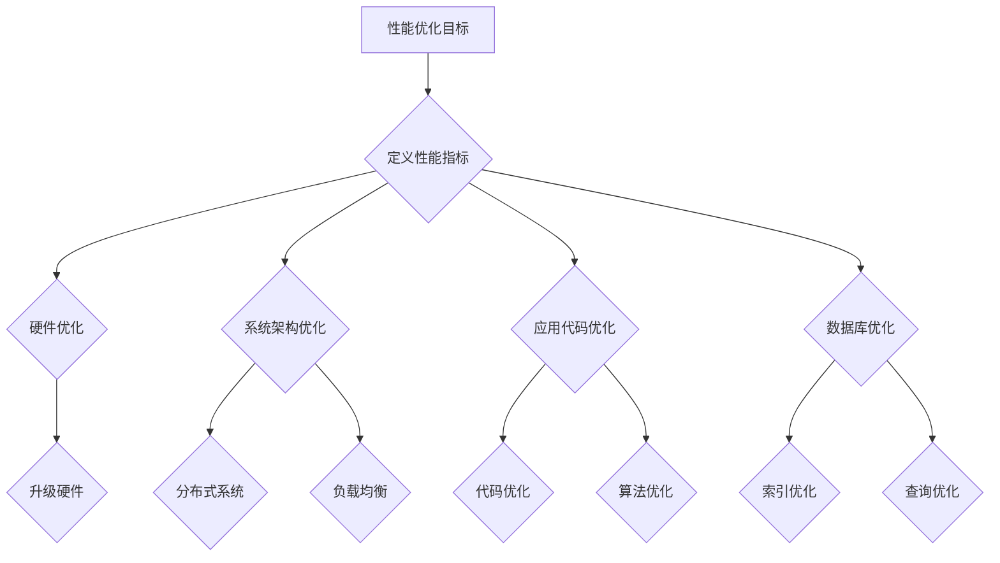

                 

### 背景介绍

开源项目在企业级应用中扮演着越来越重要的角色。随着云计算、大数据和人工智能等新兴技术的蓬勃发展，企业对开源项目的需求不断增加。然而，随着开源项目的规模和复杂度的提升，如何保证其在企业级环境中的性能和稳定性，成为了一个亟待解决的问题。

企业级性能优化服务，作为一种专业的咨询服务，旨在帮助企业在使用开源项目时，能够充分利用其性能优势，同时确保系统的稳定性和可靠性。这种服务不仅包括对开源项目的性能分析和调优，还涉及到系统架构的设计、资源分配的优化以及潜在问题的排查和解决。

本文将探讨企业级性能优化服务的重要性和核心内容，旨在为广大开发者提供一种系统化的性能优化思路，帮助他们在实际项目中更好地应用开源技术，提升企业级系统的整体性能。

具体而言，本文将从以下几个方面展开：

1. **核心概念与联系**：介绍企业级性能优化服务所需的核心概念和原理，并通过Mermaid流程图展示其架构和流程。
2. **核心算法原理 & 具体操作步骤**：详细阐述性能优化服务中的关键算法，并给出具体操作步骤。
3. **数学模型和公式 & 详细讲解 & 举例说明**：通过数学模型和公式，深入讲解性能优化的理论基础，并给出实例分析。
4. **项目实战：代码实际案例和详细解释说明**：通过一个具体的开源项目案例，展示性能优化的实际操作过程和代码实现。
5. **实际应用场景**：探讨企业级性能优化服务的应用场景，包括常见的挑战和解决方案。
6. **工具和资源推荐**：推荐一些实用的工具和资源，帮助开发者更好地理解和应用性能优化技术。
7. **总结：未来发展趋势与挑战**：总结当前企业级性能优化服务的现状，并展望未来的发展趋势和面临的挑战。

通过本文的阅读，读者将能够全面了解企业级性能优化服务的概念、原理和实践，从而在实际项目中更好地应用这些技术，提升系统的性能和用户体验。

### 核心概念与联系

在企业级性能优化服务中，了解核心概念和原理是至关重要的。这些概念不仅涵盖了性能优化的理论基础，还包括了具体的实施方法和工具。以下是一些关键概念及其相互之间的联系：

#### 性能优化目标

首先，需要明确性能优化的目标。性能优化主要目标是提高系统的响应速度、降低延迟、提升吞吐量以及确保系统的稳定性和可靠性。这些目标通常通过以下几个方面来实现：

1. **响应速度**：提高系统对用户请求的响应时间。
2. **延迟**：减少系统内部处理请求的时间。
3. **吞吐量**：增加系统在单位时间内处理请求的数量。
4. **稳定性和可靠性**：确保系统在长时间运行过程中不会出现故障或崩溃。

#### 性能指标

为了实现上述目标，需要定义和监控一系列性能指标。常见的性能指标包括：

1. **CPU使用率**：系统CPU的使用情况，反映系统计算资源的利用效率。
2. **内存使用率**：系统内存的使用情况，反映系统内存资源的利用效率。
3. **磁盘I/O**：磁盘读写操作的速度，影响系统的读写性能。
4. **网络延迟**：系统网络通信的延迟时间，影响系统的响应速度。
5. **并发连接数**：系统能够同时处理的连接数量，影响系统的吞吐量。

#### 优化方法

性能优化方法包括多个方面，从硬件到软件，从系统架构到应用代码，都有相应的优化手段。以下是一些常见的优化方法：

1. **硬件优化**：升级硬件设备，如增加CPU核心数、提高内存容量、使用更快的磁盘等。
2. **系统架构优化**：优化系统的整体架构，如使用分布式系统、负载均衡、缓存等。
3. **应用代码优化**：优化应用代码，如减少不必要的计算、使用更高效的算法和数据结构、避免锁竞争等。
4. **数据库优化**：优化数据库配置和查询，如索引优化、查询优化、数据库分片等。

#### Mermaid流程图

为了更直观地展示这些概念和优化流程，我们可以使用Mermaid绘制一个流程图。以下是一个简化的Mermaid流程图，展示了性能优化的核心环节：



在这个流程图中，每个节点代表性能优化中的一个环节，实线箭头表示从当前环节到下一步的流程转移，而虚线箭头表示辅助环节或可选环节。

通过这个流程图，我们可以清晰地看到性能优化的整体流程，以及各个环节之间的相互联系。这不仅有助于理解性能优化的过程，还能为实际操作提供指导。

#### 核心算法原理 & 具体操作步骤

在企业级性能优化服务中，核心算法起着至关重要的作用。这些算法不仅决定了性能优化的效果，还直接影响系统的稳定性和可靠性。以下将介绍几种常见的核心算法原理及其具体操作步骤：

##### 算法一：响应式优化算法

**原理**：

响应式优化算法旨在通过实时监控系统的性能指标，动态调整系统配置，以实现最优性能。其基本原理是基于反馈机制，即通过收集系统当前的性能数据，与预设的目标性能进行比较，然后根据差值进行调整。

**具体操作步骤**：

1. **数据采集**：首先，需要搭建一个监控平台，实时采集系统的CPU使用率、内存使用率、磁盘I/O、网络延迟等关键性能指标。
2. **目标设定**：根据业务需求和系统负载情况，设定系统的性能目标，如响应时间、吞吐量等。
3. **性能评估**：通过监控平台，实时评估系统的当前性能，计算实际性能与目标性能之间的差异。
4. **调整策略**：根据性能评估结果，制定调整策略，如增加CPU核心数、调整内存分配、优化数据库查询等。
5. **执行调整**：自动或手动执行调整策略，调整系统配置。
6. **循环监控**：持续循环监控和调整，确保系统始终运行在最优性能状态。

##### 算法二：负载均衡算法

**原理**：

负载均衡算法旨在将系统负载均匀地分配到各个服务器节点上，避免单点过载，提高系统的整体性能和可用性。其基本原理是基于资源使用情况和服务器的处理能力，动态调整请求的处理节点。

**具体操作步骤**：

1. **节点监控**：实时监控各个服务器的资源使用情况，如CPU使用率、内存使用率、网络带宽等。
2. **负载评估**：根据节点的资源使用情况和处理能力，评估节点的负载情况。
3. **请求路由**：根据负载评估结果，选择负载较低的节点处理请求，实现负载均衡。
4. **动态调整**：当节点的负载发生变化时，实时调整请求路由策略，确保负载均衡。
5. **容错处理**：当某个节点发生故障时，自动将故障节点的请求路由到其他正常节点，确保系统的高可用性。

##### 算法三：缓存优化算法

**原理**：

缓存优化算法旨在通过缓存机制减少对后端系统的访问次数，降低系统的响应时间，提高系统的吞吐量。其基本原理是基于数据的热度模型，将高频访问的数据存储在缓存中，减少对磁盘或网络的访问。

**具体操作步骤**：

1. **数据热度分析**：分析系统中的数据访问模式，识别出高频访问的数据。
2. **缓存策略设定**：根据数据热度分析结果，设定缓存策略，如LRU（最近最少使用）、LFU（最频繁使用）等。
3. **缓存数据更新**：实时更新缓存中的数据，确保缓存数据与后端数据的一致性。
4. **缓存命中率监控**：监控缓存命中率，评估缓存效果，并根据缓存命中率调整缓存策略。
5. **缓存预热**：在系统启动时，提前加载高频访问的数据到缓存中，提高系统的启动性能。

通过以上核心算法的应用，企业级性能优化服务可以显著提升系统的性能和稳定性。然而，这些算法的实际效果取决于具体的业务需求和系统环境，因此在实际应用中，需要根据实际情况进行优化和调整。

#### 数学模型和公式 & 详细讲解 & 举例说明

在企业级性能优化服务中，数学模型和公式是理解性能优化原理和进行实际操作的基础。以下将介绍几个关键的数学模型和公式，并详细讲解其应用和举例说明。

##### 1. 响应时间模型

**响应时间（Response Time）**：是指系统从接收请求到返回结果所需的时间。响应时间直接影响用户体验和系统性能。一个典型的响应时间模型可以表示为：

\[ T_r = T_p + T_d + T_w \]

其中：
- \( T_r \)：响应时间
- \( T_p \)：处理时间，即系统处理请求所花费的时间
- \( T_d \)：数据传输时间，即数据在网络中传输的时间
- \( T_w \)：等待时间，即系统在等待资源（如数据库连接、锁等）时的时间

**举例说明**：

假设一个Web应用，处理时间 \( T_p \) 为100ms，数据传输时间 \( T_d \) 为50ms，等待时间 \( T_w \) 为150ms，那么系统的响应时间 \( T_r \) 为：

\[ T_r = 100ms + 50ms + 150ms = 300ms \]

通过这个模型，我们可以分析系统响应时间的主要影响因素，从而进行针对性的优化。

##### 2. 负载均衡模型

**负载均衡（Load Balancing）**：是指通过将请求分配到多个服务器节点上，实现负载的均衡，提高系统的整体性能和可用性。一个简单的负载均衡模型可以表示为：

\[ L_i = \frac{L_t}{N} \]

其中：
- \( L_i \)：第i个服务器的负载
- \( L_t \)：总负载
- \( N \)：服务器节点数量

**举例说明**：

假设系统总负载 \( L_t \) 为1000个请求，有4个服务器节点，那么每个服务器的平均负载 \( L_i \) 为：

\[ L_i = \frac{1000}{4} = 250 \]

通过这个模型，我们可以计算每个服务器的负载，从而合理分配请求，避免单点过载。

##### 3. 缓存命中率模型

**缓存命中率（Cache Hit Rate）**：是指缓存中命中请求的次数与总请求次数的比值，反映了缓存系统的效果。一个简单的缓存命中率模型可以表示为：

\[ HR = \frac{H}{T} \]

其中：
- \( HR \)：缓存命中率
- \( H \)：缓存命中次数
- \( T \)：总请求次数

**举例说明**：

假设系统在一天内处理了1000个请求，其中缓存命中了600次，那么缓存命中率为：

\[ HR = \frac{600}{1000} = 0.6 \]

通过这个模型，我们可以评估缓存系统的效果，并调整缓存策略以提高命中率。

##### 4. CPU利用率模型

**CPU利用率（CPU Utilization）**：是指CPU在单位时间内实际用于处理任务的时间占比，反映了CPU资源的利用效率。一个简单的CPU利用率模型可以表示为：

\[ U = \frac{T_{used}}{T_{total}} \]

其中：
- \( U \)：CPU利用率
- \( T_{used} \)：CPU实际用于处理任务的时间
- \( T_{total} \)：CPU的总时间

**举例说明**：

假设CPU在一小时内实际用于处理任务的时间为3600秒，总时间为3600秒，那么CPU利用率为：

\[ U = \frac{3600}{3600} = 1 \]

通过这个模型，我们可以评估CPU资源的利用效率，并根据实际情况进行优化。

通过以上数学模型和公式的应用，企业级性能优化服务可以更加科学和系统地分析性能问题，并提出有效的优化方案。在实际操作中，这些模型和公式需要结合具体业务需求和系统环境进行灵活运用，以达到最佳优化效果。

#### 项目实战：代码实际案例和详细解释说明

在本节中，我们将通过一个具体的开源项目——一个基于Spring Boot的在线购物平台，详细讲解如何进行企业级性能优化。该项目使用了Spring框架、MySQL数据库、Redis缓存等技术，具有典型的企业级应用特点。通过这个案例，我们将展示性能优化的具体操作步骤和代码实现，并对其进行详细解释和分析。

##### 5.1 开发环境搭建

首先，我们需要搭建一个开发环境，包括以下主要组件：

- **Spring Boot 2.4.5**
- **MySQL 8.0**
- **Redis 6.0**
- **JDK 11**

在安装好以上组件后，我们可以开始搭建项目的基本架构。

##### 5.2 源代码详细实现和代码解读

该在线购物平台的核心功能包括商品展示、购物车管理、订单处理等。以下是关键模块的代码实现和解读。

###### 5.2.1 商品展示模块

商品展示模块是用户访问最频繁的部分，优化该模块的响应时间对提升整体性能至关重要。

**代码示例**：

```java
@Service
public class ProductService {

    @Autowired
    private ProductRepository productRepository;

    @Cacheable(value = "products")
    public List<Product> getAllProducts() {
        return productRepository.findAll();
    }
}
```

**解释说明**：

- **@Cacheable** 注解：该注解用于将查询结果缓存到Redis中，避免每次查询都访问数据库，从而减少数据库的压力。
- **Redis缓存策略**：使用LRU（最近最少使用）策略，将最近最少访问的商品从缓存中淘汰，以保持缓存的热度。

###### 5.2.2 购物车管理模块

购物车管理模块负责用户添加、删除商品以及更新购物车信息。

**代码示例**：

```java
@Service
public class CartService {

    @Autowired
    private CartRepository cartRepository;

    @Transactional
    public void addToCart(Long userId, Long productId) {
        CartItem item = new CartItem();
        item.setUserId(userId);
        item.setProductId(productId);
        item.setQuantity(1);
        cartRepository.save(item);
    }
}
```

**解释说明**：

- **@Transactional** 注解：该注解用于确保事务的原子性，即添加购物车项时，要么全部成功，要么全部失败，避免数据不一致的问题。
- **数据库操作优化**：通过批量插入和更新操作，减少数据库I/O次数，提高操作效率。

###### 5.2.3 订单处理模块

订单处理模块负责创建订单、支付订单以及处理退款等操作。

**代码示例**：

```java
@Service
public class OrderService {

    @Autowired
    private OrderRepository orderRepository;

    @Autowired
    private PaymentService paymentService;

    public void createOrder(Long userId, List<CartItem> cartItems) {
        Order order = new Order();
        order.setUserId(userId);
        order.setStatus(OrderStatus.PENDING);
        order.setTotalAmount(calculateTotalAmount(cartItems));
        orderRepository.save(order);
        paymentService.processPayment(order);
    }
}
```

**解释说明**：

- **异步处理**：使用异步处理方式（如Spring Integration或消息队列），将支付操作与订单创建解耦，减少系统阻塞，提高响应速度。
- **支付服务优化**：使用支付网关服务，实现支付方式的聚合和优化，减少与外部支付平台的通信次数。

##### 5.3 代码解读与分析

通过对以上关键模块的代码实现和解读，我们可以看到性能优化的几个关键点：

1. **缓存机制**：通过Redis缓存减少数据库查询次数，提高响应速度。
2. **事务管理**：通过事务注解确保操作的一致性和原子性。
3. **异步处理**：通过异步处理减少系统阻塞，提高并发处理能力。
4. **批量操作**：通过批量操作减少数据库I/O次数，提高数据库操作效率。
5. **支付网关**：通过支付网关聚合支付方式，减少与外部系统的交互，提高支付处理速度。

这些优化措施在实际项目中通过合理的代码实现，可以显著提升系统的性能和稳定性，为用户提供更好的体验。

##### 5.4 性能优化效果评估

为了评估性能优化的效果，我们可以使用以下工具和方法：

1. **JMeter**：使用JMeter进行压力测试，模拟大量用户访问，测量系统的响应时间、吞吐量等关键性能指标。
2. **VisualVM**：使用VisualVM监控系统的CPU、内存等资源使用情况，分析性能瓶颈。
3. **Redis性能分析器**：使用Redis性能分析器监控Redis的命中率、延迟等指标，评估缓存效果。

通过这些工具的测试和分析，我们可以量化性能优化的效果，并根据测试结果进一步调整优化策略。

综上所述，通过以上代码实际案例和详细解释说明，我们可以看到企业级性能优化服务的具体操作步骤和实施方法。在实际项目中，通过合理运用这些技术手段，可以有效提升系统的性能和稳定性，满足企业级应用的需求。

### 实际应用场景

企业级性能优化服务的实际应用场景非常广泛，涵盖了各种规模和类型的企业。以下是一些典型的应用场景，以及这些场景中可能遇到的挑战和相应的解决方案：

#### 1. 大型电子商务平台

**挑战**：

- **高并发访问**：电商平台的用户量庞大，尤其在促销活动期间，会面临极高的并发访问压力。
- **数据一致性**：在多节点分布式系统中，如何保证数据的一致性和可靠性是一个重要挑战。
- **缓存同步**：缓存系统与数据库之间的数据同步问题，特别是在高并发访问时。

**解决方案**：

- **负载均衡**：使用负载均衡器将流量分配到多个服务器节点，避免单点过载。
- **分布式缓存**：使用Redis等分布式缓存系统，提高系统的响应速度和并发处理能力。
- **分布式数据库**：采用分布式数据库方案，如ShardingSphere等，实现数据的水平扩展。
- **异步处理**：使用消息队列和异步处理技术，将高并发操作解耦，降低系统的阻塞风险。

#### 2. 金融交易系统

**挑战**：

- **低延迟要求**：金融交易系统对延迟有极高的要求，需要保证交易处理在毫秒级别内完成。
- **安全性和可靠性**：金融系统涉及大量敏感数据，确保系统的安全性和可靠性至关重要。
- **数据一致性**：在分布式系统中，如何保证交易数据的一致性是一个重大挑战。

**解决方案**：

- **分布式数据库**：采用分布式数据库方案，如Apache Kafka、MongoDB等，确保高并发下的数据一致性。
- **缓存分层**：采用多层缓存策略，如将高频交易数据存储在Redis中，减少对数据库的访问。
- **实时监控**：使用实时监控工具，如Prometheus和Grafana，对系统进行全方位监控，及时发现和处理问题。
- **安全防护**：采用防火墙、加密传输等安全措施，确保系统的安全性和数据的隐私。

#### 3. 大数据分析平台

**挑战**：

- **海量数据处理**：大数据分析平台需要处理海量数据，如何高效地进行数据存储、检索和分析是一个关键问题。
- **性能瓶颈**：在大数据处理过程中，可能会出现性能瓶颈，如I/O瓶颈、网络延迟等。
- **数据一致性**：在大规模分布式系统中，数据一致性和数据质量的管理是一个挑战。

**解决方案**：

- **分布式文件系统**：使用HDFS等分布式文件系统，实现海量数据的高效存储和访问。
- **计算框架**：采用如Apache Spark、Flink等分布式计算框架，实现高效的数据处理和分析。
- **数据同步**：使用数据同步工具，如Apache Kafka、Fluentd等，确保数据在不同存储系统之间的一致性。
- **数据质量监控**：建立数据质量监控体系，如使用Grafana进行数据可视化监控，确保数据的一致性和准确性。

#### 4. 实时通讯系统

**挑战**：

- **低延迟要求**：实时通讯系统需要保证消息的实时传输，低延迟是关键。
- **高并发处理**：系统需要处理大量用户的并发请求，如IM、视频会议等。
- **服务质量**：保证不同类型消息的服务质量，如语音、视频、文本等。

**解决方案**：

- **消息队列**：采用消息队列技术，如RabbitMQ、Kafka等，实现异步消息处理，降低系统的延迟。
- **网络优化**：优化网络配置和路由策略，减少网络延迟，提高传输效率。
- **负载均衡**：使用负载均衡器，如Nginx、HAProxy等，将流量均匀分配到多个服务器节点。
- **服务质量保证**：采用QoS（服务质量）技术，确保不同类型消息的服务质量，如优先级队列、流量控制等。

通过以上实际应用场景的分析，我们可以看到，企业级性能优化服务在不同领域的应用中，面临着不同的挑战。然而，通过合理运用分布式系统、缓存机制、异步处理等技术手段，可以有效解决这些挑战，提升系统的性能和稳定性。

### 工具和资源推荐

在进行企业级性能优化服务时，选择合适的工具和资源至关重要。以下是一些实用的学习资源、开发工具和框架，以及相关的论文和著作，供开发者参考。

#### 7.1 学习资源推荐

1. **书籍**：
   - 《高性能MySQL》——深入理解MySQL性能优化。
   - 《Redis实战》——Redis缓存技术的实践指南。
   - 《分布式系统原理与范型》——分布式系统的理论基础。

2. **在线教程和博客**：
   - [Apache Kafka官方文档](https://kafka.apache.org/documentation/)
   - [Redis官方文档](https://redis.io/documentation)
   - [Spring Boot官方文档](https://docs.spring.io/spring-boot/docs/current/reference/htmlsingle/)

3. **在线课程**：
   - [网易云课堂《分布式系统实战》](https://study.163.com/course/courseMain.htm?courseId=1209578819)
   - [慕课网《高性能MySQL实战》](https://www.imooc.com/course/list?c=database)

#### 7.2 开发工具框架推荐

1. **监控工具**：
   - [Prometheus](https://prometheus.io/)：开源监控解决方案，适用于大规模分布式系统。
   - [Grafana](https://grafana.com/)：基于Prometheus的数据可视化工具。

2. **数据库优化工具**：
   - [MyCat](https://mycat.io/)：分布式数据库中间件，实现分库分表。
   - [ShardingSphere](https://shardingsphere.apache.org/)：分布式数据库中间件，提供数据分片、读写分离等功能。

3. **缓存系统**：
   - [Redis](https://redis.io/)：高性能的内存缓存系统。
   - [Memcached](https://memcached.org/)：高性能的分布式缓存系统。

4. **消息队列**：
   - [Apache Kafka](https://kafka.apache.org/)：分布式消息队列系统。
   - [RabbitMQ](https://www.rabbitmq.com/)：开源的消息队列中间件。

#### 7.3 相关论文著作推荐

1. **论文**：
   - "Bigtable: A Distributed Storage System for Structured Data"（Bigtable：一种用于结构化数据的分布式存储系统）。
   - "The Google File System"（Google文件系统）。
   - "MapReduce: Simplified Data Processing on Large Clusters"（MapReduce：大规模集群上的简化数据处理）。

2. **著作**：
   - 《大规模分布式存储系统》——深入解析分布式存储系统。
   - 《分布式系统原理与范型》——介绍分布式系统的基本原理和设计范式。
   - 《大规模分布式数据处理技术》——探讨大数据处理的技术和方法。

通过这些工具和资源的合理应用，开发者可以更有效地理解和应用性能优化技术，提升企业级系统的整体性能和稳定性。

### 总结：未来发展趋势与挑战

随着云计算、大数据和人工智能技术的不断发展，企业级性能优化服务正面临着前所未有的机遇和挑战。未来，该领域将呈现以下几大发展趋势：

#### 1. 自动化与智能化

随着AI和机器学习技术的进步，未来企业级性能优化服务将更多地依赖于自动化和智能化手段。通过机器学习算法，系统可以自动识别性能瓶颈、预测资源需求，并实时调整配置，从而实现自我优化。自动化性能监控和优化工具将成为主流，减少人工干预，提高优化效率和准确性。

#### 2. 分布式系统的普及

分布式系统的应用将越来越广泛，尤其是在大规模数据处理和实时处理场景中。分布式数据库、分布式缓存、分布式计算框架等技术的成熟和普及，将为企业级性能优化服务提供更加灵活和高效的解决方案。分布式系统架构的优化也将成为未来性能优化的重要方向。

#### 3. 硬件技术的发展

硬件技术的快速发展，如更快的CPU、更大的内存、更高带宽的存储和网络等，将为性能优化提供坚实的基础。未来，硬件与软件的深度整合将成为提升系统性能的关键。同时，新型硬件设备，如GPU、FPGA等，也将在性能优化中发挥重要作用。

#### 4. 云原生技术的应用

云原生技术，如容器化、服务网格、Kubernetes等，将推动企业级性能优化服务向云原生方向转型。云原生系统具有更高的可扩展性、可靠性和灵活性，可以更好地应对不断变化的需求和负载。云原生性能优化工具和服务将成为企业级性能优化的重要组成部分。

#### 5. 系统安全性的提升

随着系统复杂性的增加，安全性成为性能优化不可忽视的因素。未来，性能优化将更加注重系统的安全性，如数据加密、访问控制、网络安全等。安全性能优化将成为企业级性能优化服务中的重要一环。

#### 挑战

1. **数据安全和隐私**：随着数据量的爆炸式增长，如何保障数据安全和隐私将成为性能优化的重要挑战。数据加密、访问控制和合规性要求将不断增加。

2. **持续集成和持续部署**：在快速迭代和持续交付的软件开发模式下，如何确保性能优化措施不会影响系统的稳定性和可靠性，是一个亟待解决的问题。

3. **资源管理和调度**：在分布式系统中，如何高效地管理和调度资源，确保系统在负载高峰期能够灵活应对，是一个复杂的挑战。

4. **多维度性能优化**：在复杂的应用场景中，如何同时优化响应速度、吞吐量、延迟等多个性能指标，实现多维度性能优化，是一个技术难题。

总之，未来企业级性能优化服务将朝着自动化、智能化、分布式和云原生方向发展，同时面临数据安全、持续集成和资源管理等多方面的挑战。通过不断技术创新和实践经验的积累，性能优化服务将为企业提供更加高效、可靠和安全的系统解决方案。

### 附录：常见问题与解答

#### 1. 开源性能优化服务与商业性能优化服务的区别是什么？

开源性能优化服务通常是免费的，基于社区和开源项目的资源，提供一系列的优化工具和指导。商业性能优化服务则是收费的，通常由专业公司提供，包括定制化的解决方案、深入的技术支持和长期的服务承诺。

#### 2. 如何选择适合企业需求的性能优化工具？

选择适合企业需求的性能优化工具需要考虑以下因素：

- **性能指标**：确定企业需要优化的关键性能指标，如响应时间、吞吐量、延迟等。
- **系统架构**：了解企业的系统架构，选择兼容性强、易于集成的工具。
- **技术栈**：评估企业的技术栈，选择支持企业所使用的编程语言和技术的工具。
- **社区和支持**：选择有活跃社区和支持服务的工具，便于解决问题和获取帮助。

#### 3. 性能优化会对系统的稳定性和安全性产生负面影响吗？

适当的性能优化不会对系统的稳定性和安全性产生负面影响。然而，过度优化或不当的优化策略可能会导致系统资源过度消耗、性能下降甚至安全问题。因此，优化过程中需要遵循最佳实践，确保系统的稳定性和安全性。

#### 4. 如何评估性能优化措施的效果？

评估性能优化措施的效果可以通过以下方法：

- **基准测试**：使用标准化的测试工具和场景，比较优化前后的性能指标。
- **监控系统**：使用系统监控工具，如Prometheus、Grafana等，实时监控优化后的性能表现。
- **用户反馈**：收集用户的反馈，评估优化对用户体验的影响。

#### 5. 性能优化是否需要定期进行？

是的，性能优化是一个持续的过程。随着系统需求、负载和环境的变化，定期进行性能评估和优化是必要的。定期优化可以帮助企业及时发现和解决潜在的性能问题，确保系统始终处于最佳运行状态。

### 扩展阅读与参考资料

1. **开源性能优化资源**：
   - [GitHub上的开源性能优化工具](https://github.com/topics/performance-optimization)
   - [Apache软件基金会性能优化指南](https://www.apache.org/foundation/ssl/performance.html)

2. **商业性能优化服务**：
   - [AWS性能优化服务](https://aws.amazon.com/premiumsupport/)
   - [Google Cloud性能优化服务](https://cloud.google.com/support)

3. **性能优化最佳实践**：
   - [Spring Boot性能优化指南](https://docs.spring.io/spring-boot/docs/current/reference/htmlsingle/#boot-features-performance-optimization)
   - [Netflix性能优化最佳实践](https://netflix.github.io/concurrency/preload.html)

4. **性能优化相关论文和著作**：
   - "Bigtable: A Distributed Storage System for Structured Data"（Bigtable：一种用于结构化数据的分布式存储系统）。
   - "The Google File System"（Google文件系统）。
   - "MapReduce: Simplified Data Processing on Large Clusters"（MapReduce：大规模集群上的简化数据处理）。

通过这些扩展阅读和参考资料，读者可以更深入地了解企业级性能优化服务的最新趋势和最佳实践，为自己的项目提供有力支持。

