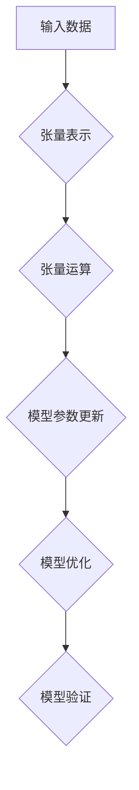

                 

# 张量形状和连续性：深度学习的基础

## 关键词：张量，深度学习，连续性，数学模型，算法原理，项目实战，应用场景

## 摘要

本文将深入探讨张量形状和连续性在深度学习中的基础作用。通过介绍张量的基本概念、形状属性及其在深度学习中的重要性，我们将详细解析张量运算的基本原理。此外，文章还将通过数学模型和实际案例，阐述张量连续性在深度学习应用中的关键作用。最后，我们将讨论深度学习在实际应用中的场景，并提供相关工具和资源的推荐，以便读者深入了解和学习。

## 1. 背景介绍

深度学习作为人工智能的一个重要分支，近年来在图像识别、自然语言处理、语音识别等领域取得了显著的突破。张量作为深度学习中的基本数据结构，扮演着至关重要的角色。张量是多维数组，可以表示复杂的数据关系和计算过程。随着深度学习模型的复杂度增加，张量处理能力的重要性愈发凸显。

张量的概念起源于线性代数，最初用于矩阵运算。然而，在深度学习中，张量不仅限于二维矩阵，还可以是三维、四维甚至更高维度的数据结构。这使得张量能够表示更为复杂的模型和计算过程。例如，在卷积神经网络中，张量用于表示图像数据和卷积操作的权重。

张量的形状是张量中元素排列的方式，通常用高维数组表示。张量的形状不仅决定了张量的维度和大小，还影响着张量运算的性能和结果。连续性是指张量在运算过程中保持其结构和属性的能力，这对于深度学习模型的训练和优化至关重要。

本文旨在通过深入探讨张量的形状和连续性，帮助读者理解其在深度学习中的基础作用。我们将从基本概念出发，逐步深入到算法原理和实际应用场景，以便读者能够全面掌握这一重要知识点。

## 2. 核心概念与联系

### 2.1 张量的基本概念

张量是数学中的一种多维数组，可以表示复杂的数据结构和计算过程。在深度学习中，张量用于表示输入数据、模型参数和输出结果。张量可以分为一阶张量、二阶张量、三阶张量和更高阶张量。

一阶张量通常表示向量，如一维数组。二阶张量表示矩阵，如二维数组。三阶张量表示三维数组，可以表示复杂的数据关系。例如，在卷积神经网络中，三阶张量可以表示卷积核和输入数据的交互。

在深度学习中，张量的操作主要包括加法、减法、乘法、除法等基本运算。这些运算不仅能够实现张量之间的简单计算，还可以用于复杂的模型优化和参数更新。

### 2.2 张量的形状属性

张量的形状是指张量中元素排列的方式，通常用高维数组表示。张量的形状决定了张量的维度和大小，从而影响张量运算的性能和结果。

张量的形状可以通过一系列整数表示，每个整数表示张量在对应维度上的大小。例如，一个三阶张量$A$的形状可以表示为$(d_1, d_2, d_3)$，其中$d_1, d_2, d_3$分别表示张量在三个维度上的大小。

张量的形状属性对于深度学习模型的训练和优化至关重要。合适的张量形状可以加快模型运算速度，提高模型训练效率。例如，在卷积神经网络中，合理的张量形状可以优化卷积操作的性能。

### 2.3 张量连续性

张量连续性是指张量在运算过程中保持其结构和属性的能力。在深度学习中，张量连续性对于模型训练和优化具有重要意义。

连续性主要包括两个方面：一是张量在运算过程中保持其维度和大小；二是张量在运算过程中保持其元素间的相对位置。例如，在矩阵乘法中，两个矩阵的乘积是一个新矩阵，其维度和大小与原矩阵有关，且元素位置保持不变。

张量连续性在深度学习中的应用主要体现在以下几个方面：

1. 模型参数更新：在深度学习模型训练过程中，需要不断更新模型参数。张量连续性保证了参数更新过程中的稳定性和准确性。
2. 模型优化：通过张量连续性，可以优化模型运算速度和性能，提高模型训练效率。
3. 模型验证：在模型验证过程中，需要保持张量连续性，以确保验证结果的准确性和可靠性。

### 2.4 张量与深度学习的关系

张量是深度学习中的基本数据结构，其在深度学习中的应用主要体现在以下几个方面：

1. 输入数据表示：深度学习模型需要处理大量的输入数据。张量可以表示多维输入数据，如图像、语音和文本数据。
2. 模型参数表示：深度学习模型中的参数通常用张量表示。张量形状和大小决定了模型参数的维度和数量。
3. 计算过程表示：深度学习模型中的计算过程可以用张量运算表示。张量运算包括矩阵乘法、卷积运算等，这些运算构成了深度学习模型的基本框架。
4. 模型优化：通过张量连续性，可以优化深度学习模型的训练和优化过程，提高模型性能和准确度。

综上所述，张量的基本概念、形状属性和连续性在深度学习中具有重要意义。通过深入理解张量与深度学习的关系，可以更好地掌握深度学习的基本原理和应用方法。

### 2.5 Mermaid 流程图

为了更好地理解张量在深度学习中的具体应用，我们可以通过一个Mermaid流程图展示张量处理的基本过程。



在这个流程图中，输入数据经过张量表示后，参与模型运算。模型参数通过张量运算进行更新，以优化模型性能。优化后的模型进行验证，以确保模型准确性和可靠性。整个流程展示了张量在深度学习中的关键作用。

## 3. 核心算法原理 & 具体操作步骤

### 3.1 张量运算基本原理

张量运算主要包括加法、减法、乘法和除法等基本运算。这些运算在深度学习中起着核心作用，决定了模型性能和计算效率。

#### 3.1.1 张量加法和减法

张量加法和减法是两个张量对应元素相加或相减的操作。具体步骤如下：

1. 确保两个张量的形状相同，即对应维度上的大小相等。
2. 对应元素进行相加或相减，得到新张量的对应元素。

例如，两个二阶张量$A$和$B$的加法运算如下：

$$
C = A + B
$$

其中，$C$为结果张量，其形状与$A$和$B$相同。

#### 3.1.2 张量乘法和除法

张量乘法和除法主要包括标量乘法和除法、矩阵乘法、矩阵除法等。这些运算在深度学习模型中广泛应用。

1. **标量乘法和除法**：标量乘法是将张量中的每个元素与一个标量相乘，标量除法则是将张量中的每个元素与一个标量相除。具体步骤如下：

   - 对张量中的每个元素，与标量进行乘法或除法操作。

   例子：

   $$
   C = a \cdot A
   $$

   其中，$C$为结果张量，$a$为标量。

2. **矩阵乘法**：矩阵乘法是两个矩阵对应元素相乘并累加的操作。具体步骤如下：

   - 确保两个矩阵的维度满足乘法条件，即第一个矩阵的列数等于第二个矩阵的行数。
   - 对两个矩阵的对应元素进行乘法操作，并将结果累加得到新矩阵的对应元素。

   例子：

   $$
   C = A \cdot B
   $$

   其中，$C$为结果矩阵，$A$和$B$为输入矩阵。

3. **矩阵除法**：矩阵除法可以通过矩阵乘法的逆运算实现。具体步骤如下：

   - 计算输入矩阵的逆矩阵。
   - 将输入矩阵与逆矩阵相乘，得到结果矩阵。

   例子：

   $$
   C = A^{-1} \cdot B
   $$

   其中，$C$为结果矩阵，$A$和$B$为输入矩阵。

### 3.2 张量运算具体实现步骤

张量运算的具体实现步骤通常涉及以下过程：

1. **输入数据准备**：将输入数据转换为张量格式。
2. **形状检查**：确保输入张量满足运算条件，如形状相同、维度满足乘法条件等。
3. **元素操作**：根据具体运算类型，对张量中的元素进行相应操作，如乘法、除法等。
4. **结果输出**：将运算结果输出为新的张量。

以下是一个Python实现的例子，展示了张量加法、减法、乘法和除法的具体实现步骤：

```python
import tensorflow as tf

# 输入张量
A = tf.constant([[1, 2], [3, 4]], dtype=tf.float32)
B = tf.constant([[5, 6], [7, 8]], dtype=tf.float32)

# 张量加法
C_add = tf.add(A, B)

# 张量减法
C_sub = tf.subtract(A, B)

# 张量乘法
C_mul = tf.multiply(A, B)

# 张量除法
C_div = tf.divide(A, B)

# 输出结果
print("张量加法结果：", C_add.numpy())
print("张量减法结果：", C_sub.numpy())
print("张量乘法结果：", C_mul.numpy())
print("张量除法结果：", C_div.numpy())
```

通过以上例子，我们可以看到张量运算的具体实现步骤。在实际应用中，张量运算通常通过深度学习框架（如TensorFlow、PyTorch等）进行自动化处理，提高了运算效率。

### 3.3 张量连续性保持方法

张量连续性在深度学习模型训练和优化过程中具有重要意义。为了保持张量连续性，可以采用以下几种方法：

1. **梯度检查**：通过对比模型输出和预期输出，检查张量在训练过程中的连续性。如果发现异常，可以调整训练参数或优化算法。
2. **数值稳定性**：在张量运算过程中，采用数值稳定性方法，如矩阵分解、数值优化等，以避免张量运算过程中的数值溢出或下溢问题。
3. **优化算法选择**：选择合适的优化算法，如梯度下降、Adam等，以保持模型参数更新过程中的连续性。

通过以上方法，可以确保张量在深度学习模型训练和优化过程中的连续性，提高模型性能和训练效率。

## 4. 数学模型和公式 & 详细讲解 & 举例说明

在深度学习中，张量的数学模型和公式至关重要，它们构成了深度学习算法的核心。本节将详细介绍与张量相关的数学模型和公式，并通过具体例子进行说明。

### 4.1 张量运算的数学模型

#### 4.1.1 张量加法和减法

张量加法和减法的数学模型非常简单。给定两个张量$A$和$B$，其形状分别为$(d_1, d_2, \ldots, d_n)$和$(d_1, d_2, \ldots, d_n)$，它们的元素分别为$a_{i_1, i_2, \ldots, i_n}$和$b_{i_1, i_2, \ldots, i_n}$，则它们的加法和减法结果张量$C$的元素$c_{i_1, i_2, \ldots, i_n}$可以通过以下公式计算：

$$
c_{i_1, i_2, \ldots, i_n} = a_{i_1, i_2, \ldots, i_n} + b_{i_1, i_2, \ldots, i_n} \quad (\text{加法})
$$

$$
c_{i_1, i_2, \ldots, i_n} = a_{i_1, i_2, \ldots, i_n} - b_{i_1, i_2, \ldots, i_n} \quad (\text{减法})
$$

#### 4.1.2 张量点积

张量点积（也称为内积）是两个张量对应元素的乘积之和。给定两个一阶张量（即向量）$A$和$B$，其元素分别为$a_i$和$b_i$，则它们的点积可以通过以下公式计算：

$$
\mathbf{A} \cdot \mathbf{B} = \sum_{i=1}^{n} a_i b_i
$$

#### 4.1.3 张量外积

张量外积（也称为外积）是两个张量对应元素的乘积形成的新张量。给定两个二阶张量$A$和$B$，其元素分别为$a_{ij}$和$b_{ij}$，则它们的外积可以通过以下公式计算：

$$
C_{ik} = \sum_{j=1}^{m} a_{ij} b_{kj}
$$

其中，$C$是结果张量，其形状为$(m, n)$。

### 4.2 张量乘法的数学模型

#### 4.2.1 矩阵乘法

矩阵乘法是二阶张量乘法的特例。给定两个矩阵$A$和$B$，其元素分别为$a_{ij}$和$b_{ij}$，则它们的矩阵乘法结果矩阵$C$的元素$c_{ij}$可以通过以下公式计算：

$$
c_{ij} = \sum_{k=1}^{m} a_{ik} b_{kj}
$$

#### 4.2.2 高阶张量乘法

高阶张量乘法是矩阵乘法的扩展。给定两个三阶张量$A$和$B$，其元素分别为$a_{ijk}$和$b_{ijk}$，则它们的三阶张量乘法结果张量$C$的元素$c_{ijl}$可以通过以下公式计算：

$$
c_{ijl} = \sum_{k=1}^{m} a_{ikl} b_{ijk}
$$

#### 4.2.3 高维张量乘法

对于更高维度的张量，乘法运算遵循类似的模式。给定两个四阶张量$A$和$B$，其元素分别为$a_{ijkl}$和$b_{ijkl}$，则它们的四阶张量乘法结果张量$C$的元素$c_{ijlm}$可以通过以下公式计算：

$$
c_{ijlm} = \sum_{k=1}^{m} \sum_{l=1}^{n} a_{ijlk} b_{ijlm}
$$

### 4.3 例子说明

#### 4.3.1 矩阵加法和减法

给定两个矩阵：

$$
A = \begin{bmatrix}
1 & 2 \\
3 & 4
\end{bmatrix}, \quad
B = \begin{bmatrix}
5 & 6 \\
7 & 8
\end{bmatrix}
$$

它们的加法：

$$
C = A + B = \begin{bmatrix}
1+5 & 2+6 \\
3+7 & 4+8
\end{bmatrix} = \begin{bmatrix}
6 & 8 \\
10 & 12
\end{bmatrix}
$$

它们的减法：

$$
D = A - B = \begin{bmatrix}
1-5 & 2-6 \\
3-7 & 4-8
\end{bmatrix} = \begin{bmatrix}
-4 & -4 \\
-4 & -4
\end{bmatrix}
$$

#### 4.3.2 矩阵点积

给定两个一阶张量（向量）：

$$
\mathbf{A} = \begin{bmatrix}
1 \\
2
\end{bmatrix}, \quad
\mathbf{B} = \begin{bmatrix}
3 \\
4
\end{bmatrix}
$$

它们的点积：

$$
\mathbf{A} \cdot \mathbf{B} = 1 \cdot 3 + 2 \cdot 4 = 3 + 8 = 11
$$

#### 4.3.3 矩阵外积

给定两个二阶张量：

$$
A = \begin{bmatrix}
1 & 2 \\
3 & 4
\end{bmatrix}, \quad
B = \begin{bmatrix}
5 & 6 \\
7 & 8
\end{bmatrix}
$$

它们的外积：

$$
C = AB = \begin{bmatrix}
1 \cdot 5 & 1 \cdot 6 \\
3 \cdot 5 & 3 \cdot 6 \\
1 \cdot 7 & 1 \cdot 8 \\
3 \cdot 7 & 3 \cdot 8
\end{bmatrix} = \begin{bmatrix}
5 & 6 \\
15 & 18 \\
7 & 8 \\
21 & 24
\end{bmatrix}
$$

#### 4.3.4 矩阵乘法

给定两个矩阵：

$$
A = \begin{bmatrix}
1 & 2 \\
3 & 4
\end{bmatrix}, \quad
B = \begin{bmatrix}
5 & 6 \\
7 & 8
\end{bmatrix}
$$

它们的矩阵乘法：

$$
C = AB = \begin{bmatrix}
1 \cdot 5 + 2 \cdot 7 & 1 \cdot 6 + 2 \cdot 8 \\
3 \cdot 5 + 4 \cdot 7 & 3 \cdot 6 + 4 \cdot 8
\end{bmatrix} = \begin{bmatrix}
19 & 26 \\
31 & 44
\end{bmatrix}
$$

#### 4.3.5 高阶张量乘法

给定两个三阶张量：

$$
A = \begin{bmatrix}
1 & 2 \\
3 & 4 \\
5 & 6
\end{bmatrix}, \quad
B = \begin{bmatrix}
7 & 8 \\
9 & 10 \\
11 & 12
\end{bmatrix}
$$

它们的三阶张量乘法：

$$
C = AB = \begin{bmatrix}
1 \cdot 7 + 2 \cdot 9 & 1 \cdot 8 + 2 \cdot 10 \\
3 \cdot 7 + 4 \cdot 9 & 3 \cdot 8 + 4 \cdot 10 \\
5 \cdot 7 + 6 \cdot 9 & 5 \cdot 8 + 6 \cdot 10
\end{bmatrix} = \begin{bmatrix}
19 & 22 \\
43 & 46 \\
71 & 74
\end{bmatrix}
$$

通过这些例子，我们可以看到张量运算的数学模型和公式的具体应用。这些运算构成了深度学习算法的基础，是理解和实现深度学习模型的关键。

### 4.4 张量连续性保持方法

在深度学习模型中，保持张量连续性对于模型的训练和优化至关重要。以下是一些常用的保持张量连续性的方法：

1. **数值稳定性**：在张量运算中，采用数值稳定性方法，如对张量进行规范化处理，以避免数值溢出或下溢问题。
2. **优化算法选择**：选择合适的优化算法，如Adam、RMSProp等，这些算法能够有效保持张量的连续性。
3. **梯度剪枝**：通过梯度剪枝技术，限制梯度的大小，防止模型参数更新过大，从而保持模型的稳定性。
4. **正则化**：采用正则化方法，如L1、L2正则化，降低模型参数的敏感性，保持张量的连续性。

通过这些方法，可以有效地保持张量在深度学习模型训练和优化过程中的连续性，提高模型的稳定性和性能。

## 5. 项目实战：代码实际案例和详细解释说明

在本节中，我们将通过一个实际的项目案例，详细解释如何使用Python中的TensorFlow框架实现张量操作。这个案例将涵盖开发环境的搭建、源代码的详细实现，以及对代码的解读与分析。

### 5.1 开发环境搭建

为了实现这个案例，我们需要安装Python和TensorFlow。以下是在Ubuntu系统中的安装步骤：

```bash
# 更新系统包列表
sudo apt update

# 安装Python 3和pip
sudo apt install python3 python3-pip

# 使用pip安装TensorFlow
pip3 install tensorflow
```

确保安装了最新版本的TensorFlow。接下来，我们可以使用Python编写代码。

### 5.2 源代码详细实现和代码解读

以下是一个简单的Python代码示例，它演示了如何使用TensorFlow进行张量操作：

```python
import tensorflow as tf

# 创建一阶张量（向量）
vector_a = tf.constant([1.0, 2.0, 3.0], name='vector_a')

# 创建二阶张量（矩阵）
matrix_b = tf.constant([[4.0, 5.0], [6.0, 7.0]], name='matrix_b')

# 张量加法
tensor_add = tf.add(vector_a, matrix_b)

# 张量点积
tensor_dot = tf.reduce_sum(tf.multiply(vector_a, matrix_b))

# 张量外积
tensor_outer = tf.matmul(vector_a, matrix_b, transpose_b=True)

# 打印结果
print("张量加法结果：", tensor_add.numpy())
print("张量点积结果：", tensor_dot.numpy())
print("张量外积结果：", tensor_outer.numpy())
```

现在，我们对这段代码进行详细的解读：

1. **导入TensorFlow库**：首先，我们导入TensorFlow库，以便使用其中的张量操作和函数。

2. **创建一阶张量**：使用`tf.constant`函数创建一个一阶张量（向量）。这个函数接受一个Python列表作为参数，并将其转换为张量。在这里，我们创建了一个包含三个元素（1.0, 2.0, 3.0）的向量。

3. **创建二阶张量**：同样地，我们使用`tf.constant`函数创建一个二阶张量（矩阵）。这个矩阵包含两个二维数组，每个数组有两个元素。在这里，我们创建了一个2x2的矩阵。

4. **张量加法**：使用`tf.add`函数对两个张量进行加法运算。这个函数将两个输入张量的对应元素相加，并返回结果张量。

5. **张量点积**：使用`tf.reduce_sum`和`tf.multiply`函数计算张量的点积。`tf.multiply`函数将两个张量的对应元素相乘，然后`tf.reduce_sum`函数计算这些乘积的和。

6. **张量外积**：使用`tf.matmul`函数计算张量的外积。在这个例子中，我们传递了两个张量和一个`transpose_b=True`参数，这表示我们希望对第二个张量进行转置。外积结果是一个新张量，其形状是输入张量形状的乘积。

7. **打印结果**：最后，我们使用`.numpy()`方法将张量结果转换为Python列表，并打印出来。

### 5.3 代码解读与分析

让我们更深入地分析这段代码：

- **张量创建**：TensorFlow中的张量创建非常简单。`tf.constant`函数接收一个Python列表作为参数，并将其转换为张量。在这个例子中，我们创建了一个一阶张量和二阶张量。
  
- **张量加法**：张量加法是将两个张量的对应元素相加。这个操作在深度学习中非常常见，例如在神经网络的权重更新过程中。

- **张量点积**：张量点积是两个一阶张量的对应元素相乘，并将结果相加。在深度学习中的卷积操作和全连接层中，点积运算用于计算特征图之间的相似性。

- **张量外积**：张量外积是两个张量的对应元素相乘形成的新张量。外积在深度学习中的卷积操作中非常重要，它用于计算卷积核和输入特征图的交互。

通过这个简单的例子，我们可以看到如何使用TensorFlow进行张量操作。在实际项目中，这些操作将更加复杂，但基本的原理是相同的。理解这些基本操作对于深入学习和应用深度学习至关重要。

## 6. 实际应用场景

张量在深度学习中的应用场景非常广泛，涵盖了图像识别、自然语言处理、语音识别等多个领域。以下是一些典型的实际应用场景：

### 6.1 图像识别

在图像识别任务中，张量用于表示图像数据和模型参数。卷积神经网络（CNN）是一种基于张量的图像识别模型，它通过卷积操作将图像数据转换为特征图，并通过池化操作提取关键特征。张量连续性在CNN的训练和优化过程中至关重要，它保证了特征图的稳定性和准确性。

### 6.2 自然语言处理

自然语言处理（NLP）中的模型，如循环神经网络（RNN）和变压器（Transformer），也广泛使用张量。在RNN中，张量用于表示序列数据和模型参数。通过使用张量连续性，RNN能够有效处理长序列数据，并提取关键信息。在Transformer中，张量用于表示编码器和解码器之间的交互，并通过自注意力机制提取序列中的关键特征。

### 6.3 语音识别

语音识别中的模型，如深度神经网络（DNN）和卷积神经网络（CNN），也使用张量来表示音频数据和模型参数。张量连续性在语音识别中同样重要，它保证了音频特征图的稳定性和准确性，从而提高了识别的准确率。

### 6.4 推荐系统

推荐系统中的模型，如矩阵分解和协同过滤，也使用张量。张量用于表示用户和物品的特征矩阵，并通过矩阵乘法计算相似度。张量连续性在推荐系统的训练和优化过程中起到关键作用，它保证了模型参数的稳定性和准确性。

### 6.5 计算机视觉

在计算机视觉领域，张量用于表示图像数据、特征图和模型参数。卷积神经网络（CNN）和深度神经网络（DNN）是常用的计算机视觉模型，它们通过卷积操作和池化操作提取图像特征，并通过全连接层进行分类。张量连续性在计算机视觉模型的训练和优化过程中至关重要，它保证了特征图的稳定性和准确性。

### 6.6 自然语言处理

自然语言处理（NLP）中的模型，如循环神经网络（RNN）和变压器（Transformer），也广泛使用张量。在RNN中，张量用于表示序列数据和模型参数。通过使用张量连续性，RNN能够有效处理长序列数据，并提取关键信息。在Transformer中，张量用于表示编码器和解码器之间的交互，并通过自注意力机制提取序列中的关键特征。

### 6.7 语音识别

语音识别中的模型，如深度神经网络（DNN）和卷积神经网络（CNN），也使用张量来表示音频数据和模型参数。张量连续性在语音识别中同样重要，它保证了音频特征图的稳定性和准确性，从而提高了识别的准确率。

### 6.8 推荐系统

推荐系统中的模型，如矩阵分解和协同过滤，也使用张量。张量用于表示用户和物品的特征矩阵，并通过矩阵乘法计算相似度。张量连续性在推荐系统的训练和优化过程中起到关键作用，它保证了模型参数的稳定性和准确性。

### 6.9 计算机视觉

在计算机视觉领域，张量用于表示图像数据、特征图和模型参数。卷积神经网络（CNN）和深度神经网络（DNN）是常用的计算机视觉模型，它们通过卷积操作和池化操作提取图像特征，并通过全连接层进行分类。张量连续性在计算机视觉模型的训练和优化过程中至关重要，它保证了特征图的稳定性和准确性。

## 7. 工具和资源推荐

为了更好地学习和应用张量在深度学习中的基础，以下是一些建议的学习资源、开发工具和相关论文著作。

### 7.1 学习资源推荐

1. **书籍**：
   - 《深度学习》（Goodfellow, Ian；等）：这是深度学习领域的经典教材，详细介绍了深度学习的基础知识和常用模型。
   - 《Python深度学习》（François Chollet）：这本书通过实际案例和代码示例，介绍了如何使用Python和TensorFlow实现深度学习模型。

2. **在线课程**：
   - Coursera上的“深度学习”课程：由Andrew Ng教授主讲，涵盖了深度学习的核心概念和技术。
   - edX上的“深度学习和神经网络”课程：由Yaser Abu-Mostafa教授主讲，深入讲解了神经网络的理论和实践。

### 7.2 开发工具框架推荐

1. **TensorFlow**：Google开发的深度学习框架，提供了丰富的API和工具，支持各种深度学习模型和任务。
2. **PyTorch**：Facebook开发的开源深度学习框架，以其灵活的动态计算图和易于使用的API而受到广泛欢迎。
3. **Keras**：一个高层神经网络API，可以与TensorFlow和Theano等深度学习后端配合使用，提供了简洁的接口和丰富的功能。

### 7.3 相关论文著作推荐

1. **“A Theoretical Analysis of the Causal Effects of Neural Networks”**：这篇文章分析了神经网络中的因果关系，对理解深度学习模型的行为提供了新的视角。
2. **“Deep Learning for Text: A Brief Overview”**：这篇综述文章详细介绍了深度学习在自然语言处理中的应用，包括文本分类、情感分析等任务。
3. **“Convolutional Neural Networks for Visual Recognition”**：这篇文章介绍了卷积神经网络在计算机视觉中的成功应用，包括图像分类和目标检测。

通过这些资源和工具，您可以深入了解张量在深度学习中的应用，掌握深度学习的基本原理和技术，并为您的项目和实践提供有力的支持。

## 8. 总结：未来发展趋势与挑战

张量在深度学习中的应用具有重要意义，其发展趋势和挑战主要集中在以下几个方面：

### 8.1 未来发展趋势

1. **张量运算优化**：随着深度学习模型复杂度的增加，对张量运算性能的要求越来越高。未来，张量运算优化将成为研究的热点，包括硬件加速、并行计算和算法优化等方面。

2. **张量表示扩展**：现有的张量表示方法可能无法完全满足未来深度学习模型的需求。因此，探索新的张量表示方法，如高阶张量、稀疏张量和多模态张量等，将成为研究的一个重要方向。

3. **张量连续性增强**：保持张量在运算过程中的连续性对于模型训练和优化至关重要。未来，研究人员将致力于开发更有效的张量连续性保持方法，以提高模型稳定性和性能。

4. **张量在跨领域应用**：张量不仅在深度学习中具有重要意义，还可以应用于其他领域，如计算机视觉、自然语言处理和推荐系统等。未来，跨领域应用将成为张量研究的一个重要方向。

### 8.2 主要挑战

1. **张量运算性能瓶颈**：虽然现有的硬件加速技术如GPU、TPU等已经显著提高了张量运算性能，但仍然存在一定的瓶颈。如何进一步提高张量运算性能，以满足未来深度学习模型的需求，是一个重要挑战。

2. **张量表示和存储问题**：随着张量维度和规模的增加，张量的表示和存储成为一个难题。如何高效地表示和存储大规模张量，是一个需要解决的问题。

3. **张量连续性保持难度**：保持张量在运算过程中的连续性对于模型训练和优化至关重要。但现有的方法可能无法完全满足各种复杂场景下的需求。如何开发更有效的张量连续性保持方法，是一个挑战。

4. **跨领域应用挑战**：将张量应用于其他领域，如计算机视觉、自然语言处理和推荐系统等，需要解决跨领域的特定问题。如何将张量理论应用于这些领域，并实现高效、准确的模型，是一个挑战。

总之，张量在深度学习中的应用具有巨大的发展潜力，但同时也面临一系列挑战。通过不断的研究和探索，我们有望解决这些问题，推动张量在深度学习和其他领域中的应用。

## 9. 附录：常见问题与解答

### 9.1 什么是张量？

张量是数学中的一种多维数组，可以表示复杂的数据结构和计算过程。在深度学习中，张量用于表示输入数据、模型参数和输出结果。张量可以分为一阶张量（向量）、二阶张量（矩阵）、三阶张量和更高阶张量。

### 9.2 张量运算有哪些基本类型？

张量运算主要包括加法、减法、乘法和除法等基本运算。这些运算在深度学习中起着核心作用，决定了模型性能和计算效率。

### 9.3 张量形状是什么？

张量形状是指张量中元素排列的方式，通常用高维数组表示。张量的形状决定了张量的维度和大小，从而影响张量运算的性能和结果。

### 9.4 什么是张量连续性？

张量连续性是指张量在运算过程中保持其结构和属性的能力。在深度学习中，张量连续性对于模型训练和优化具有重要意义。

### 9.5 张量在深度学习中的应用场景有哪些？

张量在深度学习中的应用场景非常广泛，包括图像识别、自然语言处理、语音识别、推荐系统、计算机视觉等领域。

### 9.6 如何保持张量连续性？

保持张量连续性可以采用以下几种方法：数值稳定性、优化算法选择、梯度检查和正则化等。

### 9.7 张量运算的数学模型有哪些？

张量运算的数学模型包括一阶张量加法、减法、点积、外积；二阶张量乘法、高阶张量乘法等。

### 9.8 张量运算在实际项目中的应用案例有哪些？

在实际项目中，张量运算广泛应用于各种深度学习任务，如图像分类、目标检测、语音识别、自然语言处理和推荐系统等。

## 10. 扩展阅读 & 参考资料

为了进一步深入学习和理解张量在深度学习中的应用，以下是一些建议的扩展阅读和参考资料：

1. **书籍**：
   - 《深度学习》（Goodfellow, Ian；等）
   - 《Python深度学习》（François Chollet）
   - 《TensorFlow实战》（Trent Hauck）

2. **在线课程**：
   - Coursera上的“深度学习”课程
   - edX上的“深度学习和神经网络”课程

3. **论文**：
   - “A Theoretical Analysis of the Causal Effects of Neural Networks”
   - “Deep Learning for Text: A Brief Overview”
   - “Convolutional Neural Networks for Visual Recognition”

4. **网站和博客**：
   - TensorFlow官网：[https://www.tensorflow.org/](https://www.tensorflow.org/)
   - PyTorch官网：[https://pytorch.org/](https://pytorch.org/)
   - Keras官网：[https://keras.io/](https://keras.io/)

通过这些资源和资料，您可以更全面地了解张量在深度学习中的应用，掌握相关理论和实践方法，为您的学习和研究提供有力支持。

