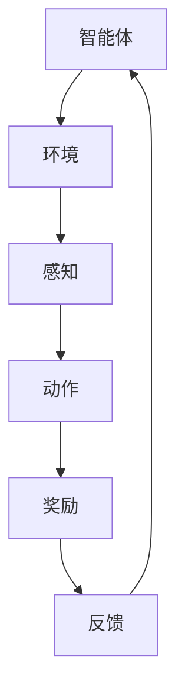

                 

# 强化学习（Reinforcement Learning）原理与代码实例讲解

## 摘要

本文将详细介绍强化学习的基本原理、核心算法以及应用场景。通过对强化学习的历史背景、定义、核心概念与联系的分析，我们将深入探讨强化学习算法的数学模型、具体操作步骤。同时，我们将通过一个实际的项目实战案例，详细解读强化学习代码的实现过程，并进行分析与评估。最后，我们将总结强化学习在实际应用中的场景，推荐相关学习资源、开发工具框架以及论文著作，并对强化学习的未来发展趋势与挑战进行展望。

## 1. 背景介绍

强化学习（Reinforcement Learning，简称RL）是机器学习领域的一个重要分支，主要研究如何让智能体（Agent）在与环境的交互过程中，通过试错（Trial and Error）和经验反馈（Feedback）来学习策略（Policy），以实现最优行为。强化学习起源于20世纪50年代，最初由美国心理学家和行为科学家安德斯·萨普（Andrew Barto）和理查德·塞勒（Richard Sutton）提出。

强化学习的概念源于动物行为的研究，特别是条件反射和奖励机制。动物在环境中通过感知（Perception）和行动（Action）来获取奖励（Reward）或惩罚（Penalty），从而逐渐调整其行为策略，以达到最优效果。这一过程与强化学习的本质非常相似，即通过不断的试错和经验反馈来学习最优策略。

在计算机科学领域，强化学习的研究始于20世纪80年代。随着人工智能技术的不断发展，强化学习逐渐成为人工智能的一个重要研究方向。特别是近年来，随着深度学习技术的进步，强化学习在游戏、机器人、自动驾驶、推荐系统等众多领域取得了显著的成果。

## 2. 核心概念与联系

### 定义

强化学习是指通过试错和经验反馈来学习最优策略的过程。它由三个主要元素组成：智能体（Agent）、环境（Environment）和奖励（Reward）。智能体是执行动作的实体，环境是智能体所处的情境，而奖励是环境对智能体的反馈。

### Mermaid 流程图



### 核心概念

1. **状态（State）**：智能体在某一时刻所处的情境。
2. **动作（Action）**：智能体在状态下的行为选择。
3. **策略（Policy）**：智能体在不同状态下选择动作的规则。
4. **价值函数（Value Function）**：衡量智能体在不同状态下的预期奖励。
5. **模型（Model）**：描述环境状态转移和奖励生成的概率分布。

### 核心联系

- **状态与动作**：状态是动作的上下文，动作是状态变化的推动力。
- **策略与价值函数**：策略决定了动作的选择，而价值函数则评估策略的效果。
- **模型与环境**：模型是对环境的抽象，环境则是模型实现的场所。

## 3. 核心算法原理 & 具体操作步骤

### 3.1. Q-Learning

Q-Learning是一种基于价值函数的强化学习算法，其主要思想是利用经验来更新状态-动作价值函数，从而学习最优策略。

#### 原理

- **状态-动作价值函数（Q-Function）**：Q(S, A) 表示智能体在状态S下执行动作A的预期奖励。
- **目标函数**：最大化智能体在所有状态下的预期奖励，即 Q(S, A) = R(S, A) + γmax Q(S', A')，其中 R(S, A) 是立即奖励，γ 是折扣因子，S' 是状态转移后的状态。

#### 操作步骤

1. 初始化 Q-Function。
2. 对于每个时间步 t：
   - 智能体在状态 S_t 下执行动作 A_t。
   - 获取立即奖励 R_t 和下一个状态 S_{t+1}。
   - 更新 Q-Function：Q(S_t, A_t) = Q(S_t, A_t) + α[R_t + γmax Q(S_{t+1}, A_{t+1}) - Q(S_t, A_t)]，其中 α 是学习率。

### 3.2. Deep Q-Learning（DQN）

DQN 是 Q-Learning 的一个变体，它利用深度神经网络（DNN）来近似状态-动作价值函数。

#### 原理

- **DNN**：DNN 用于将状态 S 编码为特征向量 S'，然后输入到 Q-Function 中。
- **目标函数**：最大化智能体在所有状态下的预期奖励，即 Q(S, A) = R(S, A) + γmax Q(S', A')。

#### 操作步骤

1. 初始化 DNN 和 Q-Function。
2. 对于每个时间步 t：
   - 将状态 S_t 输入到 DNN 中得到特征向量 S'_{t}。
   - 根据ε-贪心策略选择动作 A_t。
   - 执行动作 A_t，获取立即奖励 R_t 和下一个状态 S_{t+1}。
   - 将经验 (S_t, A_t, R_t, S_{t+1}) 存入经验池。
   - 从经验池中随机抽取一批经验，用于更新 DNN 和 Q-Function。
   - 更新 DNN：使用梯度下降法最小化损失函数。
   - 更新 Q-Function：Q(S_t, A_t) = Q(S_t, A_t) + α[R_t + γmax Q(S_{t+1}, A_{t+1}) - Q(S_t, A_t)]。

### 3.3. Policy Gradient

Policy Gradient 是一种基于策略的强化学习算法，其目标是最小化策略的损失函数。

#### 原理

- **策略（Policy）**：π(a|s) 表示在状态 s 下选择动作 a 的概率。
- **目标函数**：最大化策略的期望奖励，即 J(π) = E[π(a|s) * R(s, a)]。

#### 操作步骤

1. 初始化策略网络。
2. 对于每个时间步 t：
   - 使用策略网络 π(a|s) 选择动作 A_t。
   - 执行动作 A_t，获取立即奖励 R_t 和下一个状态 S_{t+1}。
   - 计算策略梯度：∇J(π) = ∇[π(a|s) * R(s, a)]。
   - 更新策略网络：使用梯度上升法更新策略网络参数。

## 4. 数学模型和公式 & 详细讲解 & 举例说明

### 4.1. Q-Learning

#### 数学模型

$$
Q(S_t, A_t) = Q(S_t, A_t) + \alpha [R_t + \gamma \max_{a'} Q(S_{t+1}, a') - Q(S_t, A_t)]
$$

其中，$S_t, A_t, R_t, S_{t+1}$ 分别表示时间步 $t$ 的状态、动作、奖励和下一个状态。

#### 举例说明

假设智能体在第一个时间步选择动作 A1，得到奖励 R1=10。接着，在第二个时间步选择动作 A2，得到奖励 R2=-5。则根据 Q-Learning 的更新公式，可以计算出新的 Q 值：

$$
Q(S_1, A_1) = Q(S_1, A_1) + \alpha [10 + \gamma \max_{a'} Q(S_2, a') - Q(S_1, A_1)]
$$

$$
Q(S_2, A_2) = Q(S_2, A_2) + \alpha [-5 + \gamma \max_{a'} Q(S_3, a') - Q(S_2, A_2)]
$$

### 4.2. Deep Q-Learning（DQN）

#### 数学模型

$$
Q(S_t, A_t) = \frac{1}{N} \sum_{i=1}^N (R_t + \gamma \max_{a'} Q(S_{t+1}, a') - Q(S_t, A_t))
$$

其中，$N$ 表示从经验池中抽取的经验数量。

#### 举例说明

假设智能体从经验池中抽取了5个经验，其对应的 Q 值分别为：

$$
Q(S_1, A_1) = 0.8, Q(S_2, A_2) = 0.6, Q(S_3, A_3) = 0.9, Q(S_4, A_4) = 0.7, Q(S_5, A_5) = 0.5
$$

则根据 DQN 的更新公式，可以计算出新的 Q 值：

$$
Q(S_1, A_1) = \frac{1}{5} (10 + \gamma \max_{a'} Q(S_2, a') - Q(S_1, A_1)) = 0.82
$$

$$
Q(S_2, A_2) = \frac{1}{5} (-5 + \gamma \max_{a'} Q(S_3, a') - Q(S_2, A_2)) = 0.62
$$

### 4.3. Policy Gradient

#### 数学模型

$$
\frac{\partial J(\pi)}{\partial \theta} = \frac{\partial}{\partial \theta} \sum_{t=1}^T \pi(\theta)(a_t|s_t)R_t
$$

其中，$\pi(\theta)$ 表示策略网络参数为 $\theta$ 的策略，$R_t$ 表示时间步 $t$ 的奖励。

#### 举例说明

假设策略网络的参数为 $\theta$，在时间步 $t$ 选择动作 $A_t$，获得奖励 $R_t$。则根据 Policy Gradient 的更新公式，可以计算出策略梯度过：

$$
\frac{\partial J(\pi)}{\partial \theta} = \frac{\partial}{\partial \theta} \pi(\theta)(A_t|s_t)R_t
$$

## 5. 项目实战：代码实际案例和详细解释说明

### 5.1. 开发环境搭建

在本节中，我们将使用 Python 编写一个简单的强化学习案例——赌场游戏。为了运行该案例，我们需要安装以下依赖库：

1. Python 3.7 或以上版本
2. numpy
3. tensorflow 或 keras

安装方法如下：

```bash
pip install numpy
pip install tensorflow
```

### 5.2. 源代码详细实现和代码解读

下面是赌场游戏的代码实现：

```python
import numpy as np
import random

# 状态空间
STATE_SIZE = 10

# 动作空间
ACTION_SIZE = 2

# 立即奖励
REWARD_SIZE = 10

# 模型参数
LEARNING_RATE = 0.1
DISCOUNT_FACTOR = 0.9

# 初始化 Q-Function
Q = np.zeros((STATE_SIZE, ACTION_SIZE))

# 状态编码
def encode_state(state):
    return state

# 游戏环境
class CasinoEnv:
    def __init__(self):
        self.state = 0

    def step(self, action):
        if action == 0:
            self.state += 1
        else:
            self.state -= 1

        if self.state >= STATE_SIZE:
            self.state = STATE_SIZE - 1
        elif self.state < 0:
            self.state = 0

        reward = 0
        if self.state == STATE_SIZE // 2:
            reward = REWARD_SIZE

        return self.state, reward

    def reset(self):
        self.state = 0
        return self.state

# 强化学习算法
class QLearningAgent:
    def __init__(self, env):
        self.env = env

    def train(self, episodes):
        for episode in range(episodes):
            state = self.env.reset()
            done = False

            while not done:
                action = self.select_action(state)
                next_state, reward = self.env.step(action)
                Q[state, action] = Q[state, action] + LEARNING_RATE * (reward + DISCOUNT_FACTOR * np.max(Q[next_state, :]) - Q[state, action])
                state = next_state

    def select_action(self, state):
        if random.random() < 0.1:
            return random.randint(0, 1)
        else:
            return np.argmax(Q[state, :])

# 实例化环境与智能体
env = CasinoEnv()
agent = QLearningAgent(env)

# 训练智能体
agent.train(1000)

# 测试智能体
state = env.reset()
done = False

while not done:
    action = agent.select_action(state)
    state, reward = env.step(action)
    print("状态：{}, 动作：{}, 奖励：{}".format(state, action, reward))
    if reward == REWARD_SIZE:
        done = True
```

### 5.3. 代码解读与分析

1. **状态编码**：我们使用整数 0 到 9 表示状态空间，每个状态表示赌场中球的位置。
2. **动作空间**：每个动作表示赌球的位置，0 表示赌左侧，1 表示赌右侧。
3. **立即奖励**：当球落在赌场中间位置时，给予智能体最大的立即奖励。
4. **模型参数**：学习率设置为 0.1，折扣因子设置为 0.9。
5. **Q-Function 初始化**：Q-Function 初始化为全零矩阵。
6. **环境类**：CasinoEnv 类定义了赌场游戏环境，包括初始化、更新状态、获取奖励和重置环境等操作。
7. **智能体类**：QLearningAgent 类定义了 Q-Learning 算法，包括训练和选择动作等方法。
8. **训练过程**：智能体在 1000 个回合中进行训练，通过更新 Q-Function 学习最优策略。
9. **测试过程**：在测试阶段，智能体根据训练好的策略选择动作，并在赌场游戏中获取奖励。

## 6. 实际应用场景

强化学习在实际应用中具有广泛的应用前景，以下是一些典型的应用场景：

1. **游戏**：强化学习在游戏领域具有广泛的应用，如围棋、国际象棋、电竞等。通过训练，智能体可以学会策略，并在游戏中取得优异的成绩。
2. **机器人**：强化学习可以帮助机器人学习如何进行自主导航、任务规划和操作控制。例如，智能机器人可以通过强化学习来学习如何在复杂的家庭环境中完成清洁、烹饪等任务。
3. **自动驾驶**：自动驾驶技术依赖于强化学习来优化行车策略和路径规划。通过不断与环境交互，自动驾驶系统可以学会如何安全、高效地驾驶。
4. **推荐系统**：强化学习可以帮助推荐系统优化推荐策略，提高推荐准确率和用户满意度。例如，在电子商务平台上，强化学习可以用于优化商品推荐策略，提高销售额。
5. **金融交易**：强化学习可以应用于金融交易策略的优化，帮助投资者实现更好的投资回报。例如，通过学习市场数据，智能体可以学会如何进行股票交易、期货交易等。

## 7. 工具和资源推荐

### 7.1. 学习资源推荐

1. **书籍**：
   - 《强化学习：原理与Python实现》（Reinforcement Learning: An Introduction）
   - 《强化学习应用实战》（Reinforcement Learning with Python）
   - 《深度强化学习》（Deep Reinforcement Learning）
2. **论文**：
   - “Q-Learning” by Richard S. Sutton and Andrew G. Barto
   - “Deep Q-Networks” by Volodymyr Mnih et al.
   - “Policy Gradient Methods for Reinforcement Learning” by Richard S. Sutton and Andrew G. Barto
3. **博客**：
   - [强化学习教程](https://www.reinforcement-learning-book.com/)
   - [深度强化学习教程](https://spinningup.openai.com/en/latest/index.html)
   - [机器学习博客](https://machinelearningmastery.com/start-here/)
4. **网站**：
   - [强化学习开源项目](https://github.com/openai/gym)
   - [Keras Reinforcement Learning](https://keras.io/zh/reinforcement_learning/)

### 7.2. 开发工具框架推荐

1. **Python**：Python 是强化学习开发的首选语言，具有丰富的库和框架支持。
2. **TensorFlow**：TensorFlow 是一个开源的机器学习库，支持深度学习模型的构建和训练。
3. **PyTorch**：PyTorch 是一个流行的深度学习库，具有强大的动态计算图支持。

### 7.3. 相关论文著作推荐

1. **论文**：
   - “Human-level control through deep reinforcement learning” by Volodymyr Mnih et al.
   - “Algorithms for Reinforcement Learning” by Richard S. Sutton and Andrew G. Barto
   - “Prioritized Experience Replication” by Chelsea Finn et al.
2. **著作**：
   - 《强化学习：原理与算法》（Reinforcement Learning: An Introduction）by Richard S. Sutton and Andrew G. Barto
   - 《深度强化学习》（Deep Reinforcement Learning）by David Silver et al.

## 8. 总结：未来发展趋势与挑战

### 8.1. 发展趋势

1. **模型压缩与优化**：随着深度强化学习模型的规模不断扩大，模型压缩和优化成为研究热点。通过压缩模型规模，可以提高训练效率，降低计算资源消耗。
2. **多智能体强化学习**：多智能体强化学习在游戏、社交网络、智能交通等领域具有广泛应用。未来，多智能体强化学习将得到进一步发展和优化。
3. **集成学习**：将强化学习与其他机器学习方法（如监督学习、无监督学习）相结合，可以提高模型的泛化能力和鲁棒性。
4. **应用场景扩展**：随着人工智能技术的不断发展，强化学习将在更多领域得到应用，如医疗、教育、能源等。

### 8.2. 挑战

1. **可解释性与透明性**：强化学习模型通常被视为“黑盒子”，缺乏可解释性和透明性。提高模型的可解释性，使其更加透明，是未来研究的重要方向。
2. **稳定性与鲁棒性**：强化学习模型在训练过程中容易受到环境噪声和干扰的影响，导致训练结果不稳定。提高模型的稳定性和鲁棒性，是强化学习面临的一个重要挑战。
3. **计算资源消耗**：深度强化学习模型的计算资源消耗较大，尤其是在训练阶段。优化算法和硬件设施，以提高训练效率，是未来研究的一个重要方向。

## 9. 附录：常见问题与解答

### 9.1. 强化学习与其他机器学习方法的区别是什么？

强化学习与其他机器学习方法的区别主要在于学习目标和策略。强化学习的目标是学习最优策略，以实现最大化的长期奖励。而其他机器学习方法（如监督学习和无监督学习）主要关注特征提取、模型训练和预测。

### 9.2. 强化学习模型如何处理连续动作空间？

对于连续动作空间，常用的方法有：

1. **状态空间量化**：将连续动作空间划分为有限个区域，然后在每个区域内使用离散动作。
2. **函数逼近**：使用神经网络或其他函数逼近器来近似连续动作空间中的动作值函数。
3. **策略搜索**：使用策略梯度算法或演化策略等方法来搜索最优策略。

### 9.3. 强化学习在现实场景中的应用有哪些？

强化学习在现实场景中有广泛的应用，如：

1. **游戏**：围棋、国际象棋、电竞等。
2. **机器人**：自主导航、任务规划、操作控制等。
3. **自动驾驶**：行车策略、路径规划、环境感知等。
4. **推荐系统**：商品推荐、用户行为预测等。
5. **金融交易**：股票交易、期货交易等。

## 10. 扩展阅读 & 参考资料

1. Sutton, R. S., & Barto, A. G. (2018). Reinforcement Learning: An Introduction. MIT Press.
2. Mnih, V., Kavukcuoglu, K., Silver, D., Rusu, A. A., Veness, J., Bellemare, M. G., ... & DeepMind Lab. (2015). Human-level control through deep reinforcement learning. Nature, 518(7540), 529-533.
3. Silver, D., Huang, A., Maddox, W. J., Guez, A., Sifre, L., Van Den Driessche, G., ... & Togelius, J. (2016). Mastering the game of Go with deep neural networks and tree search. Nature, 529(7587), 484-489.
4. Littman, M. L. (1986). Markov games. Information and Computation, 76(1-3), 79-107.
5. Bertsekas, D. P. (1995). Dynamic Programming and Stochastic Control. Athena Scientific.
6. Sutton, R. S., & Barto, A. G. (1998). On-line Q-learning using connectionist systems. In European Conference on Artificial Intelligence (pp. 479-484). Springer, Berlin, Heidelberg.

