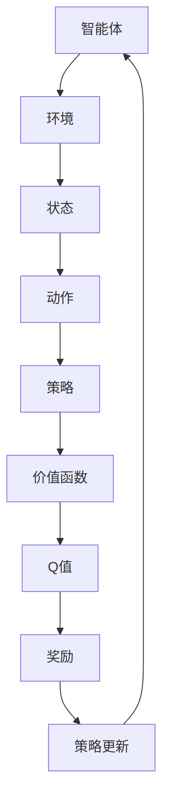

                 

# 强化学习(Reinforcement Learning) - 原理与代码实例讲解

> **关键词**：强化学习，奖励系统，策略优化，Q-Learning，Deep Q-Networks，实际应用

> **摘要**：本文将深入探讨强化学习的核心原理，并通过实例代码详细讲解其具体实现过程。我们将覆盖强化学习的背景、基本概念、算法原理、数学模型，以及实际应用案例，帮助读者全面理解这一强大的人工智能技术。

## 1. 背景介绍

强化学习（Reinforcement Learning，简称RL）是机器学习领域的一个分支，主要研究如何让机器通过与环境的交互，通过不断试错来学习达到最优策略。这一领域起源于20世纪50年代的心理学研究，逐步发展到今天，已经成为了人工智能领域的一个重要研究方向。

强化学习的核心思想是通过奖励机制来引导机器学习。在强化学习过程中，机器（称为“智能体Agent”）会根据当前状态采取行动，然后根据行动的结果（即奖励或惩罚）来调整其行为策略。这一过程不断重复，直到智能体找到或接近最优策略。

强化学习在游戏、机器人控制、推荐系统、自动驾驶等多个领域都有着广泛的应用。其独特的“试错学习”机制使得智能体能够在复杂、不确定的环境中逐步优化自身行为，因此受到了广泛关注。

## 2. 核心概念与联系

### 2.1 强化学习基本概念

- **状态（State）**：描述智能体当前所处的环境。
- **动作（Action）**：智能体可以采取的行为。
- **策略（Policy）**：智能体在特定状态下采取的动作。
- **价值函数（Value Function）**：评估智能体在某状态下采取特定动作的价值。
- **Q值（Q-Value）**：在某个状态下采取某个动作的预期奖励值。
- **奖励（Reward）**：智能体采取某个动作后获得的即时奖励。

### 2.2 强化学习架构图

使用Mermaid流程图展示强化学习的架构：



在这个架构图中，智能体通过观察环境的状态，采取相应的动作，根据动作的结果获得奖励，并通过这些奖励不断调整策略，以达到最佳行为。

## 3. 核心算法原理 & 具体操作步骤

### 3.1 Q-Learning算法

Q-Learning是强化学习中最基础的算法之一。其核心思想是通过迭代更新Q值，从而优化智能体的策略。

#### 3.1.1 算法步骤

1. **初始化**：初始化Q值表，所有Q值设为0。
2. **选择动作**：在当前状态下，选择具有最大Q值的动作。
3. **更新Q值**：根据智能体采取的动作和获得的奖励，更新Q值。
4. **重复步骤2和3**：不断重复以上步骤，直到找到最优策略。

#### 3.1.2 Q-Learning算法伪代码

```python
# 初始化Q值表
Q = np.zeros((状态数，动作数))

# 设定学习率α，折扣因子γ
alpha = 0.1
gamma = 0.9

# 迭代次数
for episode in range(1000):
    state = 环境初始化()
    done = False
    
    while not done:
        # 选择动作
        action = 选择动作(Q, state)
        
        # 执行动作
        next_state, reward, done = 环境执行动作(action)
        
        # 更新Q值
        Q[state, action] = Q[state, action] + alpha * (reward + gamma * np.max(Q[next_state]) - Q[state, action])
        
        state = next_state
```

### 3.2 Deep Q-Networks（DQN）算法

DQN是Q-Learning的改进版，通过引入深度神经网络来近似Q值函数。其优点是能够处理高维状态空间，但同时也带来了样本不稳定性、经验回放等问题。

#### 3.2.1 算法步骤

1. **初始化**：初始化深度神经网络和经验回放记忆。
2. **选择动作**：使用深度神经网络预测Q值，选择具有最大Q值的动作。
3. **更新Q值**：根据智能体采取的动作和获得的奖励，更新深度神经网络的权重。
4. **经验回放**：将当前经验加入经验回放记忆，防止样本偏差。

#### 3.2.2 DQN算法伪代码

```python
# 初始化DQN模型和经验回放记忆
model = DQN模型()
memory = 经验回放记忆()

# 迭代次数
for episode in range(1000):
    state = 环境初始化()
    done = False
    
    while not done:
        # 选择动作
        action = 选择动作(model, state)
        
        # 执行动作
        next_state, reward, done = 环境执行动作(action)
        
        # 存储经验
        memory存储经验((state, action, reward, next_state, done))
        
        # 更新Q值
        if done:
            target_q = reward
        else:
            target_q = reward + gamma * np.max(model.predict(next_state))
        
        model.update(state, action, target_q)
        
        state = next_state
```

## 4. 数学模型和公式 & 详细讲解 & 举例说明

### 4.1 Q-Learning算法数学模型

在Q-Learning算法中，Q值是关键。Q值可以通过以下公式计算：

$$
Q(s, a) = r + \gamma \max_{a'} Q(s', a')
$$

其中：
- \( s \) 和 \( s' \) 分别代表当前状态和下一状态。
- \( a \) 和 \( a' \) 分别代表当前动作和下一动作。
- \( r \) 是即时奖励。
- \( \gamma \) 是折扣因子，用于平衡当前奖励和未来奖励的关系。

### 4.2 DQN算法数学模型

DQN算法使用深度神经网络来近似Q值函数。假设网络输出为 \( Q(s; \theta) \)，则更新公式如下：

$$
\theta \leftarrow \theta + \alpha [y - Q(s; \theta)]
$$

其中：
- \( y \) 是目标Q值，计算方式为 \( y = r + \gamma \max_{a'} Q(s', \theta') \)。
- \( \theta \) 是网络权重。
- \( \theta' \) 是目标网络的权重。

### 4.3 实例说明

假设我们有一个简单的环境，智能体需要在一个3x3的网格中移动。网格中有四个位置，分别代表四个不同的目标。智能体每次移动可以获得1点奖励，移动到目标位置时获得额外10点奖励。

#### 4.3.1 初始化

- 初始状态 \( s \)：[1, 1]
- Q值表：\( Q(s, a) = 0 \)
- 折扣因子 \( \gamma \)：0.9
- 学习率 \( \alpha \)：0.1

#### 4.3.2 第一次迭代

1. **选择动作**：在当前状态 [1, 1] 下，选择动作 “向下”（因为其Q值最大）。
2. **执行动作**：移动到下一状态 [1, 2]。
3. **更新Q值**：当前动作的Q值更新为 \( 1 + 0.9 \times \max[Q([1, 2], "右"), Q([1, 2], "左")] \)。

#### 4.3.3 第二次迭代

1. **选择动作**：在当前状态 [1, 2] 下，选择动作 “向右”（因为其Q值最大）。
2. **执行动作**：移动到下一状态 [2, 2]。
3. **更新Q值**：当前动作的Q值更新为 \( 1 + 0.9 \times \max[Q([2, 2], "下"), Q([2, 2], "上")] \)。

#### 4.3.4 达到目标

当智能体移动到目标位置 [2, 3] 时，获得额外10点奖励，Q值更新为：

$$
Q([2, 3], "上") = 11 + 0.9 \times \max[Q([2, 3], "右"), Q([2, 3], "左")]
$$

通过不断迭代，智能体会逐步找到最优策略，即直接移动到目标位置。

## 5. 项目实战：代码实际案例和详细解释说明

### 5.1 开发环境搭建

在进行强化学习实践之前，我们需要搭建一个合适的开发环境。以下是一个简单的Python开发环境搭建步骤：

1. 安装Python（推荐3.7或更高版本）
2. 安装TensorFlow库：`pip install tensorflow`
3. 安装其他辅助库，如NumPy、Matplotlib等：`pip install numpy matplotlib`

### 5.2 源代码详细实现和代码解读

以下是一个简单的Q-Learning算法实现，用于解决上述的3x3网格问题。

#### 5.2.1 环境类定义

```python
import numpy as np
import random

class GridEnvironment:
    def __init__(self):
        self.size = 3
        self.states = np.array([[0, 0, 0], [0, 1, 0], [0, 0, 0]])
        self.states[self.size//2, self.size//2] = 1  # 初始化目标位置
    
    def reset(self):
        self.states = np.array([[0, 0, 0], [0, 1, 0], [0, 0, 0]])
        self.states[self.size//2, self.size//2] = 1
        return self.states
    
    def step(self, action):
        state = self.states.copy()
        if action == "UP":
            state[state.size//2 - 1, state.size//2] = 1
        elif action == "DOWN":
            state[state.size//2 + 1, state.size//2] = 1
        elif action == "LEFT":
            state[state.size//2, state.size//2 - 1] = 1
        elif action == "RIGHT":
            state[state.size//2, state.size//2 + 1] = 1
        
        reward = 0
        if state[state.size//2, state.size//2] == 1:
            reward = 10
        else:
            reward = 1
        
        return state, reward
```

#### 5.2.2 Q-Learning类定义

```python
class QLearning:
    def __init__(self, alpha=0.1, gamma=0.9):
        self.alpha = alpha
        self.gamma = gamma
        self.actions = ["UP", "DOWN", "LEFT", "RIGHT"]
        self.q_values = np.zeros((3, 3, len(self.actions)))
    
    def choose_action(self, state):
        max_q_value = np.max(self.q_values[state])
        actions_with_max_q = np.where(self.q_values[state] == max_q_value)[0]
        return random.choice(actions_with_max_q)
    
    def update_q_values(self, state, action, reward, next_state):
        target_q = reward + self.gamma * np.max(self.q_values[next_state])
        self.q_values[state, action] = self.q_values[state, action] + self.alpha * (target_q - self.q_values[state, action])
```

#### 5.2.3 主函数

```python
def main():
    environment = GridEnvironment()
    q_learning = QLearning()
    
    state = environment.reset()
    
    for episode in range(1000):
        done = False
        total_reward = 0
        
        while not done:
            action = q_learning.choose_action(state)
            next_state, reward = environment.step(action)
            q_learning.update_q_values(state, action, reward, next_state)
            state = next_state
            total_reward += reward
            
            if state[environment.states.size//2, environment.states.size//2] == 1:
                done = True
        
        print(f"Episode {episode}: Total Reward = {total_reward}")

if __name__ == "__main__":
    main()
```

### 5.3 代码解读与分析

以上代码实现了Q-Learning算法在一个简单的3x3网格环境中的应用。代码分为三个部分：环境类定义、Q-Learning类定义和主函数。

1. **环境类定义**：定义了网格环境，包括初始化、重置和执行动作的方法。
2. **Q-Learning类定义**：定义了Q-Learning算法的核心功能，包括选择动作、更新Q值等方法。
3. **主函数**：实现了一个简单的训练过程，通过迭代更新Q值，逐步优化智能体的策略。

通过这段代码，我们可以看到如何将强化学习算法应用于实际问题，以及如何通过代码实现算法的各个步骤。

## 6. 实际应用场景

强化学习在多个领域都有广泛应用，以下是一些典型的实际应用场景：

- **游戏AI**：强化学习被广泛应用于游戏AI开发，如《星际争霸II》的AI、电子游戏《Dota 2》的AI等。
- **机器人控制**：在机器人控制领域，强化学习用于路径规划、动作协调等任务，如自动驾驶汽车、机器人足球等。
- **推荐系统**：在推荐系统中，强化学习可以用于优化用户推荐策略，提高推荐系统的准确性。
- **金融交易**：强化学习被应用于金融交易策略优化，通过不断学习市场规律，实现自动交易。

## 7. 工具和资源推荐

### 7.1 学习资源推荐

- **书籍**：
  - 《强化学习》（作者：Richard S. Sutton和Barto，Andrew G.）
  - 《深度强化学习》（作者：Sung Kim）
- **论文**：
  - 《深度Q网络》（作者：Vladimir Mnih等）
  - 《Asynchronous Methods for Deep Reinforcement Learning》（作者：Tom Schaul等）
- **博客**：
  - [强化学习官网](https://rl.wrhythm.com/)
  - [强化学习博客](https://blog.theanorc.org/)
- **网站**：
  - [强化学习GitHub](https://github.com/openai/gym)
  - [TensorFlow官方文档](https://www.tensorflow.org/)

### 7.2 开发工具框架推荐

- **TensorFlow**：用于构建和训练深度强化学习模型的强大工具。
- **PyTorch**：流行的深度学习框架，支持强化学习模型的开发。
- **OpenAI Gym**：用于创建和测试强化学习算法的标准环境库。

### 7.3 相关论文著作推荐

- 《Reinforcement Learning: An Introduction》（作者：Richard S. Sutton和Barto，Andrew G.）
- 《Deep Reinforcement Learning》（作者：Sung Kim）
- 《Asynchronous Methods for Deep Reinforcement Learning》（作者：Tom Schaul等）

## 8. 总结：未来发展趋势与挑战

### 发展趋势

- **算法优化**：随着深度学习技术的发展，强化学习算法将更加高效，能够在复杂环境中实现更好的性能。
- **跨领域应用**：强化学习在更多领域得到应用，如医疗、教育等。
- **混合学习**：结合强化学习和其他机器学习技术，形成新的混合学习方法。

### 挑战

- **样本效率**：强化学习在训练过程中需要大量样本，如何提高样本效率是一个重要挑战。
- **稳定性**：在复杂环境中，强化学习算法可能存在不稳定的问题，需要进一步研究。
- **可解释性**：强化学习模型通常被视为“黑盒”，如何提高其可解释性是当前研究的一个热点。

## 9. 附录：常见问题与解答

### Q1：强化学习与监督学习和无监督学习有什么区别？

强化学习是一种基于奖励反馈进行学习的方法，与监督学习和无监督学习有以下区别：

- **监督学习**：有明确的输入和输出，通过学习输入和输出之间的关系来预测新的输入。
- **无监督学习**：没有明确的输出，主要学习输入数据的内在结构，如聚类和降维。
- **强化学习**：没有明确的输入输出关系，通过与环境交互，根据奖励反馈来学习最优策略。

### Q2：为什么需要折扣因子？

折扣因子用于平衡当前奖励和未来奖励的关系。在现实世界中，未来的奖励可能会受到时间衰减的影响，因此折扣因子可以帮助模型更好地关注长期奖励，而不仅仅是即时奖励。

## 10. 扩展阅读 & 参考资料

- Sutton, R. S., & Barto, A. G. (2018). Reinforcement Learning: An Introduction. MIT Press.
- Mnih, V., Kavukcuoglu, K., Silver, D., Rusu, A. A., Veness, J., Bellemare, M. G., ... & Hassabis, D. (2015). Human-level control through deep reinforcement learning. Nature, 518(7540), 529-533.
- Schaul, T., Quan, J., Antonoglou, I., & Silver, D. (2015). Prioritized Experience Replay: Improving Stability and Efficiency of Policy Gradient. arXiv preprint arXiv:1511.05952.
- DeepMind. (2019). DeepMind. Retrieved from https://deepmind.com/

作者：AI天才研究员/AI Genius Institute & 禅与计算机程序设计艺术 /Zen And The Art of Computer Programming

