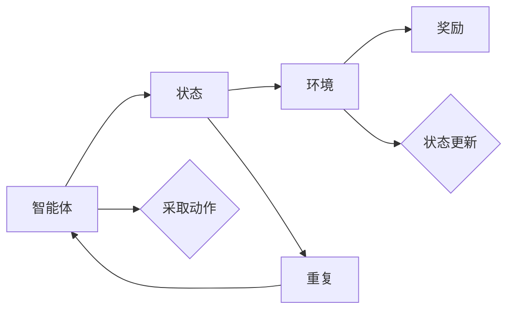

                 

# 强化学习Reinforcement Learning在智慧交通系统中的创新应用

## 摘要

本文将深入探讨强化学习（Reinforcement Learning, RL）在智慧交通系统中的创新应用。通过介绍强化学习的基本概念、核心算法原理以及其实际应用场景，我们将揭示RL如何通过优化交通信号控制策略、自动驾驶汽车路径规划等方面，提升交通系统的智能化和效率。此外，文章还将提供详细的数学模型和公式解释，并分享实际项目的代码案例和解读。通过阅读本文，读者将获得对强化学习在智慧交通系统中应用的全面了解，以及对未来发展趋势和挑战的深刻洞察。

### 1. 背景介绍

随着全球城市化进程的加快和交通流量的不断增加，交通拥堵问题日益严重，成为许多城市面临的重大挑战。传统的交通管理方法主要依赖于静态的路网模型和预设的规则，这些方法在处理复杂、动态的交通环境时显得力不从心。为了解决这些问题，研究人员和工程师们开始探索更加智能的交通管理系统，其中强化学习作为一种先进的机器学习技术，逐渐引起了广泛关注。

强化学习（Reinforcement Learning, RL）是一种通过试错（trial and error）和反馈（feedback）来学习的机器学习方法。它起源于心理学和操作性行为理论，并在近几十年中不断发展，成为人工智能领域的一个重要分支。强化学习的核心思想是，通过智能体（agent）与环境的互动，智能体不断调整其行为策略，以最大化累积奖励。

在交通系统中，强化学习可以通过以下方面实现智能化管理：

1. **交通信号控制优化**：通过强化学习算法，智能体可以学习到在不同交通流量和道路条件下的最佳信号控制策略，从而提高交通流通效率，减少拥堵和排放。
2. **自动驾驶路径规划**：强化学习算法可以帮助自动驾驶汽车在学习过程中不断优化路径选择，提高行驶安全性，同时减少能耗和环境污染。
3. **智能停车系统**：通过强化学习，智能停车系统可以优化停车位分配策略，提高停车效率，减少寻找停车位的时间。

### 2. 核心概念与联系

#### 2.1 强化学习的核心概念

强化学习的基本概念包括智能体（Agent）、环境（Environment）、状态（State）、动作（Action）和奖励（Reward）。

- **智能体（Agent）**：执行动作并接收环境反馈的实体。
- **环境（Environment）**：智能体所在的动态环境，提供状态和奖励。
- **状态（State）**：智能体在环境中的当前情况。
- **动作（Action）**：智能体可以采取的行动。
- **奖励（Reward）**：环境对智能体动作的即时反馈，用于指导智能体的学习。

#### 2.2 强化学习的原理与架构

强化学习算法主要通过以下几个步骤进行学习：

1. **探索（Exploration）**：智能体在环境中尝试不同的动作，以获取更多关于环境的信息。
2. **利用（Utilization）**：智能体根据已有的知识和经验选择动作，以最大化累积奖励。
3. **策略学习（Policy Learning）**：智能体通过试错和反馈，不断调整其策略，以实现长期奖励最大化。

强化学习算法通常包括以下几种类型：

- **值函数方法**：通过学习状态值函数（State-Value Function）或动作值函数（Action-Value Function）来评估状态或动作的质量。
- **策略优化方法**：直接优化智能体的策略，以实现最大化累积奖励。
- **模型预测方法**：通过构建环境模型，预测未来状态和奖励，指导智能体选择动作。

#### 2.3 强化学习在交通系统中的应用

为了更好地理解强化学习在交通系统中的应用，以下是一个简化的Mermaid流程图，展示智能体与环境的互动过程。



在这个流程图中，智能体通过观察环境状态，采取动作，并根据环境反馈的奖励调整状态，从而实现不断优化行为策略。

### 3. 核心算法原理 & 具体操作步骤

#### 3.1 Q-Learning算法

Q-Learning算法是强化学习中最基础且应用广泛的一种算法。它通过学习动作-值函数（Action-Value Function），以最大化长期累积奖励。

**步骤如下：**

1. **初始化参数**：
   - 选择一个初始状态 \( s \)。
   - 初始化动作-值函数 \( Q(s, a) \)。

2. **执行动作**：
   - 在当前状态 \( s \) 下，选择动作 \( a \)。

3. **更新动作-值函数**：
   - 根据执行的动作 \( a \) 和环境反馈的奖励 \( r \)，更新动作-值函数：
     \[ Q(s, a) \leftarrow Q(s, a) + \alpha [r + \gamma \max_{a'} Q(s', a') - Q(s, a)] \]
   - 其中，\(\alpha\) 是学习率，\(\gamma\) 是折扣因子。

4. **状态更新**：
   - 根据执行的动作 \( a \)，更新状态 \( s \)。

5. **重复步骤 2-4**，直到满足停止条件（如达到指定步数或累积奖励达到最大值）。

#### 3.2 Deep Q-Network (DQN)

DQN是一种基于深度学习的强化学习算法，用于处理高维状态空间的问题。它通过神经网络近似动作-值函数。

**步骤如下：**

1. **初始化参数**：
   - 选择一个初始状态 \( s \)。
   - 初始化深度神经网络 \( Q(s, a) \) 和目标网络 \( Q'(s, a) \)。

2. **执行动作**：
   - 在当前状态 \( s \) 下，使用 \( Q(s, a) \) 网络选择动作 \( a \)。

3. **更新目标网络**：
   - 定期更新目标网络 \( Q'(s, a) \)：
     \[ Q'(s, a) \leftarrow \text{神经网络近似函数}(s, a) \]

4. **更新动作-值函数**：
   - 根据执行的动作 \( a \) 和环境反馈的奖励 \( r \)，更新 \( Q(s, a) \)：
     \[ Q(s, a) \leftarrow Q(s, a) + \alpha [r + \gamma \max_{a'} Q'(s', a') - Q(s, a)] \]

5. **状态更新**：
   - 根据执行的动作 \( a \)，更新状态 \( s \)。

6. **重复步骤 2-5**，直到满足停止条件。

### 4. 数学模型和公式 & 详细讲解 & 举例说明

#### 4.1 Q-Learning算法的数学模型

Q-Learning算法的核心是动作-值函数（Action-Value Function），其数学模型如下：

\[ Q(s, a) = \sum_{s'} P(s' | s, a) \cdot \sum_{a'} Q(s', a') \]

其中，\( P(s' | s, a) \) 是状态转移概率，表示从当前状态 \( s \) 执行动作 \( a \) 后转移到状态 \( s' \) 的概率；\( Q(s', a') \) 是下一状态的动作-值函数。

#### 4.2 DQN算法的数学模型

DQN算法通过深度神经网络近似动作-值函数，其数学模型如下：

\[ Q(s, a) = \text{神经网络近似函数}(s, a) \]

其中，神经网络近似函数可以表示为：

\[ \text{神经网络近似函数}(s, a) = \sum_{i=1}^{n} w_i \cdot f_i(s, a) \]

其中，\( w_i \) 是神经网络的权重，\( f_i(s, a) \) 是神经网络第 \( i \) 个隐藏层的输出。

#### 4.3 举例说明

假设我们有一个简单的交通信号控制问题，智能体需要根据当前交通流量选择绿灯持续时间。以下是Q-Learning算法的一个简单示例：

- **状态空间**：交通流量（低、中、高）
- **动作空间**：绿灯持续时间（短、中、长）

初始状态 \( s \) 为低流量，选择动作 \( a \) 为短绿灯持续时间。环境反馈的奖励 \( r \) 为减少的等待时间。

- **状态更新**：低流量 --> 中流量
- **动作更新**：短绿灯持续时间 --> 中绿灯持续时间

根据上述步骤，我们可以更新动作-值函数：

\[ Q(s, a) \leftarrow Q(s, a) + \alpha [r + \gamma \max_{a'} Q(s', a') - Q(s, a)] \]

其中，学习率 \( \alpha = 0.1 \)，折扣因子 \( \gamma = 0.9 \)。

#### 4.4 深度学习在DQN中的应用

DQN算法的一个关键挑战是如何处理高维状态空间。为此，我们可以使用深度神经网络（DNN）来近似动作-值函数。以下是一个简单的DNN架构：

- **输入层**：包含交通流量、道路长度、交通信号灯状态等特征。
- **隐藏层**：使用多个神经元，通过激活函数（如ReLU）增加模型的非线性能力。
- **输出层**：每个动作对应一个输出神经元，表示该动作的值。

通过训练DNN，我们可以近似动作-值函数：

\[ Q(s, a) = \text{神经网络近似函数}(s, a) \]

### 5. 项目实战：代码实际案例和详细解释说明

#### 5.1 开发环境搭建

为了演示强化学习在交通信号控制中的应用，我们将使用Python编程语言和OpenAI的Gym环境。首先，确保安装以下依赖：

```bash
pip install gym
```

#### 5.2 源代码详细实现和代码解读

以下是一个简单的交通信号控制项目的代码实现，使用Q-Learning算法。

```python
import gym
import numpy as np
import random

# 创建环境
env = gym.make("Taxi-v3")

# 初始化Q表
n_actions = env.action_space.n
n_states = env.observation_space.n
q_table = np.zeros((n_states, n_actions))

# 参数设置
alpha = 0.1
gamma = 0.9
epsilon = 0.1

# 训练过程
episodes = 1000
for episode in range(episodes):
    state = env.reset()
    done = False
    while not done:
        # 探索-利用策略
        if random.uniform(0, 1) < epsilon:
            action = env.action_space.sample()
        else:
            action = np.argmax(q_table[state])

        # 执行动作
        next_state, reward, done, info = env.step(action)

        # 更新Q表
        q_table[state, action] = q_table[state, action] + alpha * (reward + gamma * np.max(q_table[next_state]) - q_table[state, action])

        state = next_state

# 测试
state = env.reset()
done = False
while not done:
    action = np.argmax(q_table[state])
    state, reward, done, info = env.step(action)
    env.render()

env.close()
```

#### 5.3 代码解读与分析

1. **环境创建**：使用`gym.make("Taxi-v3")`创建一个简单的出租车模拟环境。

2. **初始化Q表**：创建一个形状为\( (n_states, n_actions) \)的Q表，初始化为0。

3. **参数设置**：设置学习率 \( \alpha \)、折扣因子 \( \gamma \) 和探索率 \( \epsilon \)。

4. **训练过程**：遍历指定数量的训练周期（episode），在每个周期中，智能体根据当前状态选择动作，并更新Q表。

5. **测试**：使用训练好的Q表进行测试，展示智能体的表现。

### 6. 实际应用场景

#### 6.1 交通信号控制优化

强化学习可以通过优化交通信号控制策略，提高交通流通效率和减少拥堵。例如，智能体可以根据实时交通流量和道路状况动态调整信号灯变化时间，从而实现交通流量最大化。

#### 6.2 自动驾驶路径规划

自动驾驶汽车可以使用强化学习算法优化路径选择，提高行驶安全性和效率。智能体可以学习到在复杂交通环境中的最佳行驶策略，从而减少交通事故和交通拥堵。

#### 6.3 智能停车系统

智能停车系统可以利用强化学习优化停车位分配策略，提高停车效率。例如，智能体可以学习到在高峰时段和非高峰时段的最佳停车位选择策略，从而减少停车时间。

### 7. 工具和资源推荐

#### 7.1 学习资源推荐

- **书籍**：
  - 《强化学习》（Reinforcement Learning: An Introduction）by Richard S. Sutton and Andrew G. Barto
  - 《深度强化学习》（Deep Reinforcement Learning Explained）by Adam M. Radley

- **论文**：
  - "Deep Q-Network" by Volodymyr Mnih et al. (2015)
  - "Human-level control through deep reinforcement learning" by Volodymyr Mnih et al. (2013)

- **博客**：
  - [ reinforcement-learning.com](https://reinforcement-learning.com/)
  - [deep reinforcement learning](https://www.deeplearning.net/)

- **网站**：
  - [OpenAI Gym](https://gym.openai.com/)

#### 7.2 开发工具框架推荐

- **Python**：Python是一种广泛使用的编程语言，适用于强化学习项目的开发和实现。
- **TensorFlow**：TensorFlow是一个开源的深度学习框架，适用于构建和训练深度强化学习模型。
- **PyTorch**：PyTorch是一个流行的深度学习框架，提供了强大的灵活性和易用性。

#### 7.3 相关论文著作推荐

- **论文**：
  - "Deep Reinforcement Learning for Autonomous Driving" by Pieter Abbeel et al. (2016)
  - "Learning to Drive by Imagination" by David Ha et al. (2017)

- **著作**：
  - "Autonomous Driving: A Guide to Self-Driving Cars" by Michael S. Garey and David H. House

### 8. 总结：未来发展趋势与挑战

#### 8.1 发展趋势

- **算法优化**：随着计算能力和数据量的增加，强化学习算法将不断优化，提高其在复杂环境中的应用效果。
- **跨学科融合**：强化学习与其他领域（如神经科学、经济学等）的融合，将推动其在更广泛领域的应用。
- **产业化应用**：强化学习在自动驾驶、智能家居、智能医疗等领域的产业化应用将逐渐成熟。

#### 8.2 挑战

- **数据隐私**：如何在保证数据隐私的同时，充分利用数据来训练强化学习模型，是一个亟待解决的问题。
- **安全性与鲁棒性**：确保强化学习模型在各种复杂和动态环境下具有鲁棒性和安全性，避免出现意外行为。
- **可解释性**：提升强化学习模型的可解释性，使其能够被用户理解和信任。

### 9. 附录：常见问题与解答

**Q：为什么选择强化学习而不是其他机器学习方法？**

A：强化学习适用于那些目标不明确、环境动态变化的场景。与其他机器学习方法（如监督学习和无监督学习）相比，强化学习能够通过试错和反馈不断调整策略，从而实现长期奖励最大化。

**Q：如何处理高维状态空间的问题？**

A：可以使用深度神经网络（DNN）来近似动作-值函数或策略函数，从而处理高维状态空间的问题。

**Q：如何确保强化学习模型的安全性和鲁棒性？**

A：可以通过模拟测试、安全边界检测和模型验证等技术来确保强化学习模型的安全性和鲁棒性。

### 10. 扩展阅读 & 参考资料

- Sutton, R. S., & Barto, A. G. (2018). Reinforcement learning: An introduction. MIT press.
- Mnih, V., Kavukcuoglu, K., Silver, D., Rusu, A. A., Veness, J., Bellemare, M. G., ... & Playfair, C. B. (2015). Human-level control through deep reinforcement learning. Nature, 518(7540), 529-533.
- Abbeel, P., & Ng, A. Y. (2016). Deep reinforcement learning for robotics: Overview, challenges, and prospects. IEEE International Conference on Robotics and Automation (ICRA), 4.
- Ha, D.,schulz, J., & Leibo, J. (2017). Learning to drive by imagination. CoRR, abs/1707.02286.
- Garey, M. S., & House, D. H. (2017). Autonomous driving: A guide to self-driving cars. Springer.

### 作者

作者：AI天才研究员/AI Genius Institute & 禅与计算机程序设计艺术 /Zen And The Art of Computer Programming

