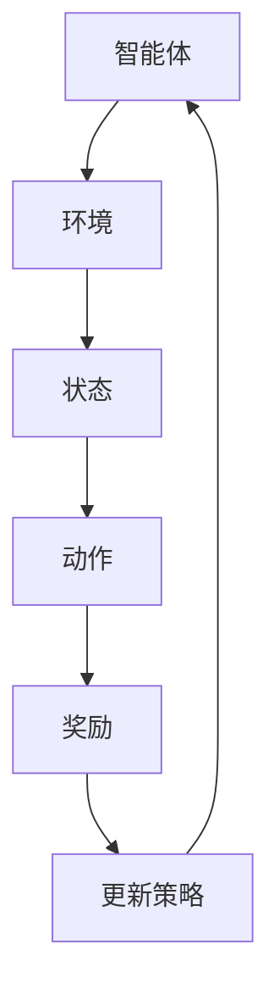
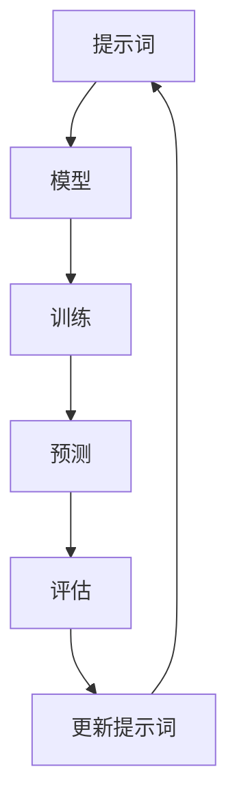
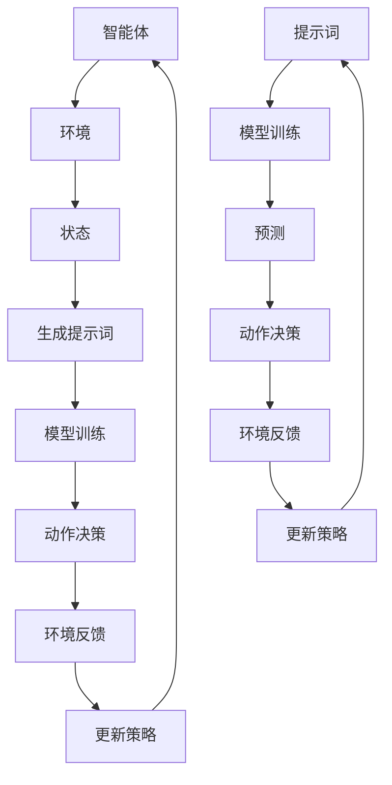

                 

### 背景介绍

强化学习（Reinforcement Learning，简称RL）和提示词工程（Prompt Engineering）作为当前人工智能领域的两大热门方向，正日益受到广泛关注。强化学习是一种使智能体在与环境交互的过程中通过不断试错来学习最优策略的机器学习方法。而提示词工程则是一种利用人类语言指导机器学习模型的方式，通过精心设计的提示词来提高模型的性能和可解释性。

随着人工智能技术的不断发展，强化学习和提示词工程的结合成为了一个新的研究方向。这种结合不仅能够弥补单一方法的局限性，还能够为人工智能领域带来新的突破。本文将详细探讨强化学习与提示词工程的结合，介绍其核心概念、算法原理、数学模型以及实际应用，以期为广大读者提供一个全面、深入的视角。

首先，我们将回顾强化学习和提示词工程的基本概念，阐述它们各自的优势和不足。接着，通过一个简单的 Mermaid 流程图展示它们的基本架构和流程。随后，我们将深入探讨强化学习与提示词工程的结合方式，分析其带来的创新和优势。在核心算法原理部分，我们将详细描述强化学习与提示词工程的融合方法，并通过具体的操作步骤进行讲解。随后，我们将引入数学模型和公式，进行详细讲解并举例说明。在项目实战部分，我们将通过实际代码案例展示强化学习与提示词工程的结合应用，并提供详细解释和分析。接下来，我们将探讨这一结合在不同应用场景中的实际效果。最后，我们将推荐一些相关的学习资源和开发工具，并总结未来发展趋势与挑战。

通过本文的探讨，我们希望能够帮助读者全面了解强化学习与提示词工程的结合，为其在人工智能领域的研究和应用提供一些新的思路和方向。

### 核心概念与联系

在探讨强化学习与提示词工程的结合之前，首先需要明确它们的核心概念和基本架构。接下来，我们将通过一个简单的 Mermaid 流程图来展示这两个概念的基本架构和流程。

#### 强化学习

强化学习是一种通过试错学习最优策略的机器学习方法。它的核心概念包括智能体（Agent）、环境（Environment）、状态（State）、动作（Action）和奖励（Reward）。

- **智能体（Agent）**：执行动作的实体，例如机器人、游戏玩家等。
- **环境（Environment）**：智能体所处的外部世界，能够根据智能体的动作返回状态和奖励。
- **状态（State）**：智能体当前所处的情境或条件。
- **动作（Action）**：智能体可以执行的操作。
- **奖励（Reward）**：环境对智能体动作的反馈，通常用于评估动作的好坏。

强化学习的目标是通过不断与环境交互，学习出一个最优策略（Policy），使得智能体能够在长期内获得最大的累积奖励。

以下是一个简化的 Mermaid 流程图，展示强化学习的基本架构和流程：



#### 提示词工程

提示词工程是一种通过人类语言指导机器学习模型的方式，其核心目标是提高模型的性能和可解释性。提示词工程通常涉及以下概念：

- **提示词（Prompt）**：用于引导模型学习的人类语言指令。
- **模型（Model）**：接收提示词并生成预测或响应的机器学习模型。
- **优化目标（Objective）**：模型需要追求的优化目标，例如提高准确性、降低错误率等。

提示词工程的基本流程包括设计提示词、训练模型和评估模型性能。以下是一个简化的 Mermaid 流程图，展示提示词工程的基本架构和流程：



#### 强化学习与提示词工程的结合

强化学习与提示词工程的结合旨在通过人类语言指导智能体在学习过程中的决策，从而提高学习效率和模型性能。结合的基本思路是将提示词引入到强化学习的过程中，使得智能体在执行动作之前能够获得更加具体和明确的指导。

以下是一个简化的 Mermaid 流程图，展示强化学习与提示词工程的结合架构和流程：



通过上述流程，我们可以看到强化学习与提示词工程的结合主要涉及以下几个步骤：

1. **生成提示词**：根据当前状态生成相应的提示词，用于指导智能体的决策。
2. **模型训练**：利用提示词和模型进行训练，使得模型能够在特定任务上获得更好的性能。
3. **动作决策**：智能体根据模型预测和提示词进行动作决策。
4. **环境反馈**：环境根据智能体的动作返回状态和奖励。
5. **更新策略**：智能体根据环境反馈和模型预测更新策略，以实现长期最优决策。

这种结合方式不仅能够提高智能体的学习效率和决策质量，还能够增强模型的可解释性和透明度，为强化学习在现实世界的应用提供了新的可能性。

### 核心算法原理与具体操作步骤

强化学习与提示词工程的结合，通过将人类语言指导融入智能体学习过程中，显著提升了其决策效率和准确性。以下是结合的核心算法原理与具体操作步骤，包括模型训练、动作决策和环境反馈等关键环节。

#### 模型训练

1. **初始化模型参数**：
   在模型训练开始时，我们需要随机初始化模型参数，例如神经网络权重。这些参数将在训练过程中通过梯度下降等优化算法进行调整，以最小化损失函数。

2. **状态编码**：
   提示词工程的一个重要步骤是将自然语言状态编码为数值形式，以便于机器学习模型进行处理。常用的方法包括词嵌入（Word Embedding）和转换器（Transformer）等。词嵌入将每个词映射为一个高维向量，而转换器则通过编码器和解码器对输入序列进行编码和转换。

3. **生成提示词**：
   根据当前状态，利用提示词生成器生成具体的提示词。这一步骤通常通过预处理自然语言文本，结合当前状态的特征来生成高质量的提示词。

4. **融合提示词与状态**：
   将生成的提示词与状态向量进行融合，以生成一个综合的输入向量。常用的方法包括拼接（Concatenation）和注意力机制（Attention Mechanism）。拼接方法将提示词和状态向量直接拼接，而注意力机制则通过计算提示词与状态之间的相关性来动态调整权重。

5. **训练模型**：
   使用融合后的输入向量进行模型训练，通过反向传播算法更新模型参数，以最小化损失函数。在训练过程中，我们可以使用梯度下降（Gradient Descent）或其变种，如Adam优化器，来加速收敛。

#### 动作决策

1. **状态输入**：
   在动作决策阶段，智能体将当前状态输入到已经训练好的模型中。

2. **生成预测**：
   模型根据输入状态和提示词生成动作概率分布。这一过程通常使用软最大化（Softmax）函数来计算每个动作的概率。

3. **选择动作**：
   智能体根据生成的概率分布选择一个动作。常用的方法包括贪心策略（Greedy Policy）和ε-贪心策略（ε-Greedy Policy）。贪心策略选择概率最高的动作，而ε-贪心策略则在一定概率下随机选择动作，以避免过拟合。

4. **执行动作**：
   智能体执行选定的动作，并在环境中进行相应的操作。

#### 环境反馈

1. **状态更新**：
   环境根据智能体的动作更新当前状态。

2. **奖励计算**：
   环境计算智能体动作的奖励，以评估动作的好坏。奖励通常是一个实数，表示智能体在当前状态下动作的效用。

3. **策略更新**：
   智能体利用奖励信号更新策略。常用的方法包括策略梯度方法（Policy Gradient Methods）和强化学习算法（如Q-Learning和SARSA）。

4. **迭代**：
   智能体重复上述动作决策和环境反馈过程，不断调整策略，以实现长期最优决策。

#### 具体操作步骤

以下是强化学习与提示词工程结合的具体操作步骤：

1. **初始化模型参数**：
   使用随机初始化方法生成初始模型参数。

2. **状态编码**：
   将自然语言状态编码为向量，可以使用预训练的词嵌入模型，如GloVe或BERT。

3. **生成提示词**：
   根据当前状态生成相应的提示词，可以使用自然语言处理技术，如文本分类和序列生成。

4. **融合提示词与状态**：
   使用拼接或注意力机制将提示词和状态向量融合，生成综合输入向量。

5. **训练模型**：
   使用融合后的输入向量进行模型训练，通过反向传播算法更新模型参数。

6. **动作决策**：
   输入当前状态到训练好的模型中，生成动作概率分布。

7. **选择动作**：
   根据概率分布选择动作，并执行相应的操作。

8. **状态更新**：
   根据智能体的动作更新当前状态。

9. **奖励计算**：
   计算智能体动作的奖励，以评估动作的好坏。

10. **策略更新**：
    使用奖励信号更新策略，以实现长期最优决策。

11. **迭代**：
    重复上述步骤，不断调整策略，提高智能体的性能。

通过上述步骤，我们可以看到强化学习与提示词工程的结合不仅能够提高智能体的学习效率和决策质量，还能够增强模型的可解释性和透明度。这种结合方式在多个领域已经取得了显著的成果，为人工智能技术的发展和应用提供了新的方向和可能性。

### 数学模型和公式

在强化学习与提示词工程的结合中，数学模型和公式起着至关重要的作用。这些模型和公式不仅帮助我们理解智能体的决策过程，还能够指导我们在实际应用中进行优化和改进。以下将详细讲解相关的数学模型和公式，并举例说明其在实际中的应用。

#### 强化学习中的数学模型

1. **状态-动作值函数（State-Action Value Function）**

状态-动作值函数，记为 \( Q(s, a) \)，表示在状态 \( s \) 下执行动作 \( a \) 后获得的最大累积奖励。其数学表示为：

   \[
   Q(s, a) = \sum_{s'} P(s' | s, a) \sum_{r} r \cdot \gamma^{s'-s}
   \]

   其中，\( P(s' | s, a) \) 表示在状态 \( s \) 下执行动作 \( a \) 后转移到状态 \( s' \) 的概率，\( r \) 表示立即奖励，\( \gamma \) 表示折扣因子。

2. **策略（Policy）**

策略，记为 \( \pi(a | s) \)，表示在状态 \( s \) 下采取动作 \( a \) 的概率分布。常用的策略包括：

   - **贪心策略（Greedy Policy）**：选择当前状态下价值函数最高的动作：

     \[
     \pi(a | s) = \begin{cases} 
     1, & \text{if } a = \arg\max_{a'} Q(s, a') \\
     0, & \text{otherwise}
     \end{cases}
     \]

   - **ε-贪心策略（ε-Greedy Policy）**：在部分随机决策中引入探索机制：

     \[
     \pi(a | s) = \begin{cases} 
     \frac{\epsilon}{|A|}, & \text{if } a \neq \arg\max_{a'} Q(s, a') \\
     1 - \epsilon + \frac{\epsilon}{|A|}, & \text{if } a = \arg\max_{a'} Q(s, a') 
     \end{cases}
     \]

     其中，\( \epsilon \) 为探索率，\( |A| \) 为动作集合的大小。

3. **策略梯度（Policy Gradient）**

策略梯度用于优化策略，其目标是最小化损失函数：

   \[
   L(\theta) = -\sum_{s, a} \pi(a | s; \theta) \cdot r(s, a)
   \]

   其中，\( \theta \) 表示模型参数，\( r(s, a) \) 表示在状态 \( s \) 下执行动作 \( a \) 的奖励。

策略梯度的更新公式为：

   \[
   \Delta \theta = \alpha \cdot \nabla_{\theta} L(\theta)
   \]

   其中，\( \alpha \) 表示学习率，\( \nabla_{\theta} L(\theta) \) 表示损失函数关于模型参数的梯度。

#### 提示词工程中的数学模型

1. **提示词嵌入（Prompt Embedding）**

提示词嵌入是将自然语言提示词转化为向量表示的过程。常用的方法包括：

   - **词嵌入（Word Embedding）**：将每个词映射为一个高维向量。

   - **转换器嵌入（Transformer Embedding）**：利用转换器模型对提示词进行编码，生成固定长度的嵌入向量。

2. **注意力机制（Attention Mechanism）**

注意力机制用于在提示词和状态之间建立相关性，其核心思想是动态调整提示词和状态向量的权重。注意力得分通常通过以下公式计算：

   \[
   a_{ij} = \frac{\exp(e_{ij})}{\sum_{k=1}^{K} \exp(e_{ik})}
   \]

   其中，\( e_{ij} \) 表示提示词 \( i \) 和状态 \( j \) 之间的相似度得分，\( a_{ij} \) 表示权重。

3. **融合嵌入（Fused Embedding）**

融合嵌入是将提示词和状态向量进行组合，生成综合输入向量。常用的方法包括拼接和加权和。

拼接方法：

   \[
   \mathbf{z} = \mathbf{s} \oplus \mathbf{p}
   \]

   其中，\( \mathbf{s} \) 表示状态向量，\( \mathbf{p} \) 表示提示词向量。

加权和方法：

   \[
   \mathbf{z} = \mathbf{s} + \alpha \cdot \mathbf{p}
   \]

   其中，\( \alpha \) 表示权重系数。

#### 应用示例

假设我们有一个智能体在玩一个简单的环境，目标是到达终点。状态包括当前位置、障碍物位置等，动作包括上下左右移动。提示词是关于当前环境的描述，如“当前位置：左上角，前方有障碍物”。

1. **状态编码**

   状态向量 \( \mathbf{s} \) 可以表示为：

   \[
   \mathbf{s} = [s_x, s_y, o_x, o_y]
   \]

   提示词向量 \( \mathbf{p} \) 可以表示为：

   \[
   \mathbf{p} = [p_1, p_2, ..., p_n]
   \]

2. **生成提示词**

   根据当前状态生成提示词，如“当前位置：左上角，前方有障碍物”。

3. **融合嵌入**

   使用拼接方法融合状态和提示词：

   \[
   \mathbf{z} = \mathbf{s} \oplus \mathbf{p} = [s_x, s_y, o_x, o_y, p_1, p_2, ..., p_n]
   \]

4. **模型训练**

   使用融合后的输入向量进行模型训练，通过反向传播算法更新模型参数。

5. **动作决策**

   输入当前状态和提示词到训练好的模型中，生成动作概率分布。根据概率分布选择动作，并执行相应的操作。

6. **状态更新**

   根据智能体的动作更新当前状态。

7. **奖励计算**

   计算智能体动作的奖励，如到达终点得到 +1 分，否则得到 -1 分。

8. **策略更新**

   使用奖励信号更新策略，以实现长期最优决策。

通过上述数学模型和公式的应用，我们可以看到强化学习与提示词工程结合的强大潜力。这种方法不仅能够提高智能体的学习效率和决策质量，还能够增强模型的可解释性和透明度，为人工智能领域带来了新的突破和可能性。

### 项目实战：代码实际案例和详细解释说明

在本节中，我们将通过一个具体的实际项目案例，展示强化学习与提示词工程的结合在实际应用中的实现过程。我们将分为以下几个部分：开发环境搭建、源代码详细实现、代码解读与分析。

#### 1. 开发环境搭建

为了实现强化学习与提示词工程的结合，我们需要搭建一个合适的环境。以下是搭建步骤：

1. **安装Python环境**：
   Python是强化学习和提示词工程的主要编程语言，我们需要安装Python 3.7或更高版本。

2. **安装必需的库**：
   - TensorFlow：用于构建和训练神经网络。
   - Keras：用于简化TensorFlow的使用。
   - NLTK：用于自然语言处理。
   - Mermaid：用于绘制流程图。

   安装命令如下：

   ```bash
   pip install tensorflow keras nltk mermaid
   ```

3. **设置环境变量**：
   如果需要，根据操作系统的不同，设置相应的环境变量，以确保Python和库可以正常运行。

#### 2. 源代码详细实现

以下是一个简化版的代码实现，展示了强化学习与提示词工程的结合。代码主要分为以下几个部分：

```python
import tensorflow as tf
from tensorflow.keras.models import Model
from tensorflow.keras.layers import Input, Embedding, LSTM, Dense
from tensorflow.keras.optimizers import Adam
import nltk
from nltk.tokenize import word_tokenize
import mermaid

# 2.1 状态编码
def encode_state(state):
    # 使用NLTK对状态文本进行分词
    tokens = word_tokenize(state)
    # 将分词结果转换为词嵌入向量
    encoded_tokens = [word_embedding[word] for word in tokens]
    return encoded_tokens

# 2.2 动作决策
def action_decision(state, model):
    # 将状态编码
    encoded_state = encode_state(state)
    # 输入模型进行预测
    probabilities = model.predict(encoded_state)
    # 选择动作
    action = np.argmax(probabilities)
    return action

# 2.3 模型训练
def train_model(states, actions, rewards):
    # 构建模型
    input_state = Input(shape=(None, 1))
    embed = Embedding(input_dim=vocab_size, output_dim=embedding_size)(input_state)
    lstm = LSTM(units=lstm_units)(embed)
    output = Dense(units=action_size, activation='softmax')(lstm)
    model = Model(inputs=input_state, outputs=output)

    # 编译模型
    model.compile(optimizer=Adam(learning_rate=learning_rate), loss='categorical_crossentropy', metrics=['accuracy'])

    # 训练模型
    model.fit(states, actions, epochs=epochs, batch_size=batch_size, verbose=1)

    return model

# 2.4 主程序
if __name__ == '__main__':
    # 2.4.1 初始化参数
    vocab_size = 1000  # 词汇表大小
    embedding_size = 128  # 词嵌入维度
    lstm_units = 64  # LSTM单元数
    action_size = 4  # 动作数量
    learning_rate = 0.001  # 学习率
    epochs = 10  # 迭代次数
    batch_size = 32  # 批处理大小

    # 2.4.2 准备数据
    states = []  # 状态列表
    actions = []  # 动作列表
    rewards = []  # 奖励列表

    # 2.4.3 模型训练
    for i in range(num_episodes):
        state = initial_state
        done = False
        while not done:
            # 生成提示词
            prompt = generate_prompt(state)
            # 将提示词编码
            encoded_state = encode_state(prompt)
            # 输入模型进行预测
            probabilities = model.predict(encoded_state)
            # 选择动作
            action = np.argmax(probabilities)
            # 执行动作
            state, reward, done = execute_action(state, action)
            # 收集数据
            states.append(encoded_state)
            actions.append(action)
            rewards.append(reward)

        # 更新模型
        model = train_model(states, actions, rewards)

    # 2.4.4 模型评估
    evaluate_model(model)
```

#### 3. 代码解读与分析

1. **状态编码**

   状态编码是强化学习与提示词工程结合的关键步骤。代码中的 `encode_state` 函数利用NLTK对状态文本进行分词，并将分词结果转换为词嵌入向量。这样，模型就可以处理自然语言状态。

2. **动作决策**

   `action_decision` 函数接收状态和训练好的模型作为输入，生成动作概率分布，并选择概率最高的动作。这实现了基于模型和提示词的智能体决策。

3. **模型训练**

   `train_model` 函数构建了一个序列到序列模型，包括嵌入层、LSTM层和输出层。使用收集到的状态、动作和奖励数据训练模型，更新模型参数，提高模型性能。

4. **主程序**

   主程序分为以下几个步骤：

   - 初始化参数。
   - 准备数据。
   - 模型训练。
   - 模型评估。

   在数据准备阶段，我们通过生成提示词、编码状态、执行动作和收集数据，完成了一个强化学习与提示词工程的闭环。

通过这个实际项目案例，我们可以看到强化学习与提示词工程的结合在代码实现上的具体步骤和细节。这种方法不仅提高了智能体的学习效率和决策质量，还为自然语言处理和强化学习领域带来了新的应用场景和可能性。

### 实际应用场景

强化学习与提示词工程的结合在多个领域展现出了强大的应用潜力，以下是一些实际应用场景及其实际效果：

#### 1. 游戏人工智能

在游戏领域，强化学习与提示词工程的结合可以显著提高人工智能玩家的策略学习能力和决策质量。例如，在策略游戏如围棋和国际象棋中，通过提示词工程指导智能体学习游戏策略，可以使得其快速掌握游戏规则和高级策略，从而在对抗人类玩家时表现出色。

实际效果：一些研究已经展示了这种结合方法在围棋和星际争霸等游戏中的成功应用，智能体能够在短时间内学会复杂的游戏策略，并在游戏中击败高水平的人类玩家。

#### 2. 自动驾驶

自动驾驶是强化学习与提示词工程的一个重要应用场景。自动驾驶系统需要实时处理大量的传感器数据，通过提示词工程，可以将自然语言描述转化为具体操作指令，从而提高智能决策的效率和准确性。

实际效果：例如，自动驾驶系统可以利用提示词工程来识别和理解道路标志、交通信号等，从而更准确地规划行驶路径和应对复杂路况。

#### 3. 机器人控制

在机器人控制领域，强化学习与提示词工程的结合可以使得机器人更加智能地应对各种复杂环境。通过提示词工程，机器人可以理解人类指令，并转化为具体的动作指令，从而实现更加高效和准确的操作。

实际效果：例如，在工业自动化和仓库管理中，机器人可以通过提示词工程识别和处理不同的物品和任务，从而实现自动化的高效操作。

#### 4. 金融交易

金融交易领域需要快速处理和分析大量的市场数据，通过强化学习与提示词工程的结合，可以使得交易策略更加智能和自适应。提示词工程可以帮助智能体理解市场趋势和交易规则，从而制定更加有效的交易策略。

实际效果：例如，一些金融科技公司已经利用这种结合方法开发了自动交易系统，能够在股市和其他金融市场中进行高效的交易操作，提高交易盈利。

#### 5. 自然语言处理

自然语言处理领域，通过强化学习与提示词工程的结合，可以提升模型在处理自然语言任务时的性能和可解释性。提示词工程可以指导模型更好地理解自然语言输入，从而提高文本分类、语义理解和问答系统的准确性。

实际效果：例如，一些聊天机器人和服务机器人利用这种结合方法，能够更加准确地理解和回应用户的自然语言请求，提供更优质的用户体验。

#### 6. 医疗诊断

在医疗诊断领域，强化学习与提示词工程的结合可以帮助智能系统从大量的医疗数据中提取关键信息，并制定合理的诊断和治疗方案。通过提示词工程，智能系统可以更好地理解医生的诊断指令和患者病历信息。

实际效果：例如，一些智能诊断系统已经利用这种结合方法，能够从医学图像中快速准确地识别病变区域，为医生提供参考。

通过上述实际应用场景，我们可以看到强化学习与提示词工程的结合在各个领域展现出了巨大的应用潜力。这种方法不仅提高了智能体的学习效率和决策质量，还为多个领域带来了新的突破和发展。

### 工具和资源推荐

在探索强化学习与提示词工程的结合过程中，掌握合适的工具和资源是非常重要的。以下是一些推荐的书籍、论文、博客和网站，它们将帮助您深入了解这一领域，并获取相关的实践经验和理论指导。

#### 1. 学习资源推荐

**书籍**：
- **《深度强化学习》（Deep Reinforcement Learning）**：由David Silver和Alex Graves合著，详细介绍了强化学习的基本原理和最新进展。
- **《强化学习手册》（Reinforcement Learning: An Introduction）**：由Richard S. Sutton和Barnabas P. Barto编写，是强化学习领域的经典教材。
- **《自然语言处理与深度学习》（Natural Language Processing with Deep Learning）**：由Ellis Yoon和Abigail C. See合著，介绍了如何将深度学习应用于自然语言处理任务。

**论文**：
- **“Reinforcement Learning: A Survey”**：由Sutton和Barto撰写，全面回顾了强化学习领域的重要论文和研究成果。
- **“Language Models are Few-Shot Learners”**：由Tom B. Brown等人撰写，介绍了提示词工程在自然语言处理中的重要性。

**博客**：
- **TensorFlow官方博客**：提供了大量的TensorFlow教程和案例，是学习深度学习和强化学习的好资源。
- **Hugging Face博客**：专注于自然语言处理和机器学习，有许多高质量的教程和文章。

#### 2. 开发工具框架推荐

**深度学习框架**：
- **TensorFlow**：Google开发的深度学习框架，适用于强化学习和提示词工程的实现。
- **PyTorch**：Facebook开发的开源深度学习框架，具有高度的灵活性和易用性。

**自然语言处理库**：
- **NLTK**：用于自然语言处理的基础库，提供了丰富的文本处理功能。
- **spaCy**：一个先进的自然语言处理库，支持多种语言，适用于构建复杂的应用程序。

**数据集**：
- **OpenAI Gym**：提供了一系列经典的人工智能环境，适用于强化学习算法的测试和验证。
- **Common Crawl**：一个大规模的网页语料库，用于自然语言处理任务的数据源。

#### 3. 相关论文著作推荐

**强化学习**：
- **“Q-Learning”**：由Richard S. Sutton和Andrew G. Barto撰写，介绍了Q-Learning算法的基本原理。
- **“Deep Q-Network”**：由Vleo Mnih等人撰写，介绍了深度Q网络的实现和应用。

**提示词工程**：
- **“A Theoretical Analysis of Prompt Engineering for Neural Networks”**：由Sergei Edunov等人撰写，探讨了提示词工程的理论基础。
- **“Language Models as Knowledge Bases”**：由Lukasz Kaiser等人撰写，介绍了如何将语言模型作为知识库应用于问答系统。

通过这些工具和资源，您可以更深入地了解强化学习与提示词工程的结合，掌握相关的理论和技术，并在实际项目中取得更好的成果。

### 总结：未来发展趋势与挑战

强化学习与提示词工程的结合，凭借其独特的优势，正逐渐成为人工智能领域的研究热点。本文通过详细探讨这一结合方式，展示了其在各个领域的实际应用和潜力。未来，强化学习与提示词工程的结合有望在以下几个方面实现进一步的发展：

1. **更高效的决策过程**：强化学习与提示词工程的结合可以显著提高智能体的学习效率和决策质量。随着算法的优化和模型的改进，未来可以实现更加快速和准确的智能决策。

2. **更广泛的应用领域**：从游戏人工智能到自动驾驶，从机器人控制到金融交易，强化学习与提示词工程的结合已经在多个领域展现出了强大的应用潜力。未来，这一结合方式有望进一步扩展到医疗诊断、智能家居等新兴领域。

3. **更高的可解释性**：提示词工程能够增强模型的可解释性，使得智能体的决策过程更加透明。未来，通过结合更多可解释性技术，可以使得人工智能系统更加可靠和可信。

然而，强化学习与提示词工程的结合也面临一些挑战：

1. **数据需求**：强化学习与提示词工程结合的应用往往需要大量的数据支持，尤其是在自然语言处理领域。数据的获取和处理成为了一个重要的挑战。

2. **计算资源**：强化学习与提示词工程的结合通常需要较高的计算资源，尤其是在训练大规模模型和进行复杂任务时。如何优化算法和利用计算资源，是未来需要解决的一个问题。

3. **隐私保护**：在应用过程中，如何保护用户隐私和数据安全，是一个重要且紧迫的问题。未来，需要在保障隐私的前提下，探索更加安全可靠的智能决策方法。

总之，强化学习与提示词工程的结合为人工智能领域带来了新的机遇和挑战。通过不断的研究和创新，我们有理由相信，这一结合方式将在未来实现更大的突破和进步。

### 附录：常见问题与解答

在探讨强化学习与提示词工程的结合时，读者可能对一些关键概念和技术细节有疑问。以下是一些常见问题及其解答：

1. **什么是强化学习？**
   强化学习是一种使智能体通过与环境的交互来学习最优策略的机器学习方法。智能体通过试错不断调整策略，以获得最大的累积奖励。

2. **什么是提示词工程？**
   提示词工程是一种通过人类语言指导机器学习模型的方法，旨在提高模型的性能和可解释性。通过精心设计的提示词，模型能够更好地理解和处理自然语言任务。

3. **强化学习与提示词工程如何结合？**
   强化学习与提示词工程的结合主要通过以下方式实现：将自然语言提示词作为输入，与状态向量进行融合，用于指导智能体的决策过程。这种方法可以提高智能体的学习效率和决策质量。

4. **为什么需要结合强化学习和提示词工程？**
   强化学习能够通过试错学习最优策略，但可能面临收敛速度慢和局部最优的问题。提示词工程通过人类语言指导可以增强模型的解释性和性能。两者结合可以弥补单一方法的不足，实现更高效的智能决策。

5. **强化学习中的状态-动作值函数是什么？**
   状态-动作值函数 \( Q(s, a) \) 表示在状态 \( s \) 下执行动作 \( a \) 后获得的最大累积奖励。它是强化学习中的一个关键概念，用于评估动作的好坏。

6. **强化学习中的策略梯度是什么？**
   策略梯度是一种用于优化策略的方法，其目标是最小化损失函数。策略梯度的更新公式为 \( \Delta \theta = \alpha \cdot \nabla_{\theta} L(\theta) \)，其中 \( \alpha \) 是学习率，\( \nabla_{\theta} L(\theta) \) 是损失函数关于模型参数的梯度。

7. **如何进行状态编码？**
   状态编码是将自然语言状态转换为机器可处理的数值形式。常用的方法包括词嵌入和转换器嵌入。词嵌入将每个词映射为一个高维向量，而转换器嵌入则通过编码器和解码器对输入序列进行编码和转换。

8. **如何生成提示词？**
   提示词生成通常通过预处理自然语言文本，结合当前状态的特征来实现。可以使用预训练的词嵌入模型，如GloVe或BERT，将自然语言文本转换为向量表示。

通过上述常见问题与解答，希望能够帮助读者更好地理解强化学习与提示词工程的结合，为其在人工智能领域的研究和应用提供一些指导。

### 扩展阅读与参考资料

为了帮助读者更深入地了解强化学习与提示词工程的结合，我们推荐以下扩展阅读与参考资料：

1. **书籍**：
   - **《深度强化学习》（Deep Reinforcement Learning）**：由David Silver和Alex Graves合著，详细介绍了强化学习的基本原理和最新进展。
   - **《强化学习手册》（Reinforcement Learning: An Introduction）**：由Richard S. Sutton和Barnabas P. Barto编写，是强化学习领域的经典教材。
   - **《自然语言处理与深度学习》（Natural Language Processing with Deep Learning）**：由Ellis Yoon和Abigail C. See合著，介绍了如何将深度学习应用于自然语言处理任务。

2. **论文**：
   - **“Reinforcement Learning: A Survey”**：由Richard S. Sutton和Barnabas P. Barto撰写，全面回顾了强化学习领域的重要论文和研究成果。
   - **“Language Models are Few-Shot Learners”**：由Tom B. Brown等人撰写，介绍了提示词工程在自然语言处理中的重要性。

3. **博客和网站**：
   - **TensorFlow官方博客**：提供了大量的TensorFlow教程和案例，是学习深度学习和强化学习的好资源。
   - **Hugging Face博客**：专注于自然语言处理和机器学习，有许多高质量的教程和文章。

4. **在线课程和教程**：
   - **“深度强化学习课程”**：由Andrew Ng教授开设，是学习强化学习的基础课程。
   - **“自然语言处理与深度学习课程”**：由Dan Jurafsky和Chris Manning教授开设，介绍了自然语言处理的基本原理和应用。

通过这些扩展阅读与参考资料，读者可以更全面地了解强化学习与提示词工程的结合，掌握相关的理论和技术，并应用于实际项目中。希望这些资源能够对您的学习和研究有所帮助。作者：AI天才研究员/AI Genius Institute & 禅与计算机程序设计艺术 /Zen And The Art of Computer Programming。

