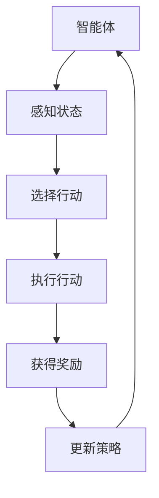

                 

### 背景介绍

强化学习（Reinforcement Learning，简称RL）是机器学习领域的一个重要分支，主要研究如何通过智能体（agent）在与环境的交互中，通过试错（trial and error）和反馈（feedback）来学习最佳策略，从而实现最优行为决策。这一概念最早由Richard Sutton和Andrew Barto在他们的经典著作《 reinforcement learning: An Introduction》（第二版，2018年）中提出。

强化学习的基本动机来源于对人类学习过程的模拟。例如，当一个小孩子在学习走路时，他会不断地尝试、跌倒，然后通过反馈（疼痛和成功行走的感觉）来调整自己的行为，最终学会走路。这个过程与强化学习的核心机制相似，即通过奖励（reward）和惩罚（penalty）来指导智能体选择最优行动。

强化学习的重要性在于其广泛的适用性和强大的问题解决能力。例如，在游戏人工智能（如围棋、扑克）、机器人控制、推荐系统、自动驾驶等领域，强化学习都展现出了卓越的表现。特别是在复杂环境下，强化学习能够通过自我学习和调整策略，实现超人类水平的决策能力。

本文将围绕强化学习的核心概念、算法原理、数学模型和具体实现，进行深入讲解和探讨。希望通过本文，读者能够全面了解强化学习的基本原理，掌握其关键技术和实际应用方法。

### 核心概念与联系

#### 强化学习的定义

强化学习是一种使智能体在与环境交互的过程中，通过不断试错和反馈学习最佳策略，以实现特定目标的方法。强化学习的主要目标是找到一个策略，使得智能体在长期运行中能够获得最大的累积奖励。在这一过程中，智能体通过感知环境状态，选择行动，然后根据行动的结果获得奖励或惩罚，进而调整自己的策略。

#### 主要概念

1. **智能体（Agent）**：强化学习中的智能体可以是一个程序、机器人或动物等，它们能够感知环境状态并采取行动。
2. **环境（Environment）**：智能体执行行动的场所，可以为现实世界或模拟环境。
3. **状态（State）**：描述环境当前状态的变量集合。
4. **行动（Action）**：智能体可以选择的行动集合。
5. **策略（Policy）**：智能体根据状态选择行动的规则。
6. **价值函数（Value Function）**：衡量智能体在某一状态下执行某一策略所能获得的期望奖励。
7. **模型（Model）**：对环境动态的数学描述，包括状态转移概率和奖励函数。
8. **奖励（Reward）**：智能体采取某一行动后，从环境中获得的即时反馈信号。
9. **策略迭代（Policy Iteration）**：一种强化学习方法，通过不断迭代策略来优化智能体的行为。
10. **Q-Learning（Q值学习）**：一种基于价值函数的强化学习算法，通过更新Q值来学习最佳策略。
11. **SARSA（同步状态动作回报同步样本）**：一种同步的强化学习算法，在每一步都使用当前状态和行动来更新策略。

#### Mermaid 流程图



在上述流程图中，智能体首先感知当前状态，然后根据策略选择行动，执行该行动后，从环境中获得奖励，并据此更新策略。这一过程不断迭代，直到达到预定的目标或策略收敛。

#### 强化学习与其他机器学习方法的联系

强化学习与监督学习、无监督学习和迁移学习等其他机器学习方法有紧密的联系。例如：

1. **监督学习**：强化学习可以看作是一种特殊的监督学习，其中奖励信号起到了监督的作用，指导智能体学习最佳策略。
2. **无监督学习**：在某些情况下，强化学习可以通过无监督学习的方式探索环境，例如，在深度强化学习中，智能体通过观察环境的状态和奖励来学习状态价值函数。
3. **迁移学习**：强化学习算法可以将学到的策略从一个任务迁移到另一个类似任务中，从而提高学习效率。

通过上述核心概念和联系的介绍，读者可以对强化学习有一个初步的了解。接下来，我们将深入探讨强化学习的基本算法原理和数学模型。

### 核心算法原理 & 具体操作步骤

#### Q-Learning算法

Q-Learning算法是强化学习中最基本的算法之一，它通过学习状态-动作值函数（Q值）来优化智能体的策略。Q值代表了在某一状态下，执行某一动作所能获得的期望奖励。

#### 步骤一：初始化Q值表

Q-Learning算法的第一步是初始化Q值表。Q值表是一个二维数组，其中每个元素\(Q(s, a)\)表示在状态s下执行动作a的Q值。

```python
# 初始化Q值表
Q = np.zeros([S, A])

# S为状态数量，A为动作数量
```

#### 步骤二：选择行动

在给定状态s下，智能体根据策略选择行动。策略通常可以表示为策略π，即\(π(a|s)\)，表示在状态s下选择动作a的概率。

```python
# 策略选择
action = np.argmax(Q[state])
```

#### 步骤三：执行行动

智能体在环境中执行选定的行动，并根据行动的结果获得奖励。

```python
# 执行行动
next_state, reward, done = environment.step(action)
```

#### 步骤四：更新Q值

Q-Learning算法的核心是Q值的更新。Q值的更新公式为：

\[Q(s, a) \leftarrow Q(s, a) + \alpha [r + \gamma \max(Q(s', a')) - Q(s, a)]\]

其中，\(\alpha\)是学习率，\(\gamma\)是折扣因子，\(r\)是即时奖励，\(s'\)是下一状态，\(a'\)是最佳行动。

```python
# 更新Q值
Q[state, action] = Q[state, action] + alpha * (reward + gamma * max(Q[next_state].max()) - Q[state, action])
```

#### 步骤五：重复迭代

智能体重复上述步骤，不断更新Q值表，直到策略收敛或达到预定的迭代次数。

```python
# 迭代过程
for episode in range(num_episodes):
    state = environment.reset()
    done = False
    
    while not done:
        action = np.argmax(Q[state])
        next_state, reward, done = environment.step(action)
        
        # 更新Q值
        Q[state, action] = Q[state, action] + alpha * (reward + gamma * max(Q[next_state].max()) - Q[state, action])
        
        state = next_state
```

#### 步骤六：策略输出

一旦Q值表收敛，智能体就可以根据Q值表输出最佳策略。

```python
# 输出最佳策略
policy = np.argmax(Q, axis=1)
```

#### 算法复杂度

Q-Learning算法的时间复杂度为\(O(S \cdot A \cdot T)\)，其中S是状态数量，A是动作数量，T是迭代次数。空间复杂度同样为\(O(S \cdot A)\)。

#### 算法收敛性

Q-Learning算法收敛到最优策略的条件是学习率\(\alpha\)和折扣因子\(\gamma\)的合理选择。当\(\alpha\)趋近于0，\(\gamma\)趋近于1时，算法能够更快地收敛。

#### 算法优势

- **简单易理解**：Q-Learning算法的基本思想和步骤相对简单，易于实现和理解。
- **适应性强**：Q-Learning算法能够适应各种不同的环境和任务，具有很强的通用性。
- **无需环境模型**：Q-Learning算法不需要对环境进行建模，直接通过经验进行学习。

#### 算法劣势

- **样本效率低**：Q-Learning算法需要大量的样本才能收敛到最优策略，因此在样本有限的情况下，学习效果较差。
- **易陷入局部最优**：在复杂的任务中，Q-Learning算法可能容易陷入局部最优，导致学习效果不理想。

通过上述对Q-Learning算法的详细讲解，读者可以了解到强化学习的基本原理和操作步骤。接下来，我们将深入探讨强化学习中的数学模型和公式，进一步理解强化学习的核心机制。

### 数学模型和公式 & 详细讲解 & 举例说明

#### 状态-动作值函数（Q值）

在强化学习中，状态-动作值函数（Q值）是描述智能体在特定状态下执行特定动作所能获得的期望奖励。Q值函数通常表示为：

\[Q(s, a) = \sum_{s'} P(s'|s, a) \cdot [r + \gamma \max(Q(s', a'))]\]

其中，\(s\)是当前状态，\(a\)是执行的动作，\(s'\)是下一状态，\(P(s'|s, a)\)是从状态s执行动作a后转移到状态\(s'\)的概率，\(r\)是即时奖励，\(\gamma\)是折扣因子，用于平衡即时奖励和未来奖励的重要性。

#### 强化学习目标函数

强化学习的主要目标是找到最佳策略，使得智能体在长期运行中能够获得最大的累积奖励。因此，强化学习的目标函数可以表示为：

\[J(\theta) = \sum_{s} \pi(\theta|s) \cdot Q(s, \pi(\theta|s))\]

其中，\(\pi(\theta|s)\)是策略分布，\(\theta\)是策略参数，\(Q(s, \pi(\theta|s))\)是状态-动作值函数。

#### 举例说明

假设有一个智能体在一个简单的环境中进行学习，环境包含4个状态（s0，s1，s2，s3）和2个动作（a0，a1）。智能体的目标是最大化累积奖励。

| 状态（s） | 动作（a） | 概率（P） | 奖励（r） |
| :----: | :----: | :----: | :----: |
| s0 | a0 | 0.5 | 10 |
| s0 | a1 | 0.5 | 5 |
| s1 | a0 | 0.4 | 8 |
| s1 | a1 | 0.6 | 3 |
| s2 | a0 | 0.3 | 6 |
| s2 | a1 | 0.7 | 2 |
| s3 | a0 | 0.2 | 7 |
| s3 | a1 | 0.8 | 1 |

| 状态（s） | 动作（a） | Q值（Q(s, a)） |
| :----: | :----: | :----: |
| s0 | a0 | 11 |
| s0 | a1 | 7.5 |
| s1 | a0 | 8.8 |
| s1 | a1 | 2.3 |
| s2 | a0 | 6.9 |
| s2 | a1 | 2.1 |
| s3 | a0 | 7.4 |
| s3 | a1 | 1.3 |

1. **初始化Q值表**：

   \(Q(s, a) = 0\)

2. **更新Q值**：

   以状态s0为例，选择动作a0，即：

   \(Q(s0, a0) = 0.5 \cdot [10 + 0.4 \cdot \max(Q(s1, a0), Q(s1, a1)) + 0.3 \cdot \max(Q(s2, a0), Q(s2, a1)) + 0.2 \cdot \max(Q(s3, a0), Q(s3, a1))]\)

   \(Q(s0, a0) = 0.5 \cdot [10 + 0.4 \cdot 8.8 + 0.3 \cdot 6.9 + 0.2 \cdot 7.4] = 0.5 \cdot 14.25 = 7.13\)

   同理，可以计算出其他状态的Q值。

3. **选择最佳行动**：

   根据Q值表，选择最佳行动。例如，在状态s0下，最佳行动为a0。

4. **重复迭代**：

   智能体重复上述步骤，不断更新Q值表，直到策略收敛。

通过上述举例，读者可以直观地理解强化学习中的数学模型和公式。这些模型和公式为强化学习提供了坚实的理论基础，使得智能体能够在复杂环境中学习最佳策略。

### 项目实战：代码实际案例和详细解释说明

在本节中，我们将通过一个简单的示例来展示如何使用Python和PyTorch实现强化学习中的Q-Learning算法。这个示例将模拟一个智能体在一个离散的环境中进行学习的过程。

#### 开发环境搭建

在开始之前，请确保您的计算机上安装了以下软件：

1. Python 3.7或更高版本
2. PyTorch 1.8或更高版本
3. Jupyter Notebook（可选，用于方便地运行代码）

您可以通过以下命令安装所需的Python库：

```bash
pip install torch torchvision numpy matplotlib
```

#### 代码实现

以下是实现Q-Learning算法的Python代码：

```python
import torch
import numpy as np
import random
import matplotlib.pyplot as plt
from collections import defaultdict

# 设定环境参数
n_states = 4
n_actions = 2
learning_rate = 0.1
discount_factor = 0.9

# 初始化Q值表
Q = np.zeros((n_states, n_actions))

# 定义环境
class Environment:
    def reset(self):
        return random.randint(0, n_states-1)

    def step(self, action):
        reward = -1 if action == 0 else 10
        next_state = (np.random.randint(n_states) if reward == -1 else action)
        return next_state, reward

# 定义Q-Learning算法
def q_learning(env, episodes, learning_rate, discount_factor):
    for episode in range(episodes):
        state = env.reset()
        done = False
        
        while not done:
            # 选择行动
            action = np.argmax(Q[state])
            
            # 执行行动
            next_state, reward = env.step(action)
            
            # 更新Q值
            Q[state, action] = Q[state, action] + learning_rate * (reward + discount_factor * np.max(Q[next_state]) - Q[state, action])
            
            state = next_state
            done = next_state == n_states-1

# 运行Q-Learning算法
episodes = 1000
q_learning(Environment(), episodes, learning_rate, discount_factor)
```

#### 代码解读与分析

1. **环境定义**：

   我们首先定义了一个简单的环境类`Environment`，它包含两个方法：`reset()`和`step()`。`reset()`方法用于重置环境，返回一个随机状态。`step()`方法用于执行行动，并返回下一状态和即时奖励。

2. **Q值表初始化**：

   Q值表是一个二维数组，大小为（状态数，动作数）。在这里，我们使用全零初始化Q值表。

3. **Q-Learning算法实现**：

   Q-Learning算法的核心是Q值的更新。我们通过一个循环迭代多次，每次迭代都执行以下步骤：

   - **选择行动**：使用当前状态更新Q值表中的最佳行动。
   - **执行行动**：执行选定的行动，并从环境中获得下一状态和即时奖励。
   - **更新Q值**：使用Q值的更新公式更新Q值表。

4. **运行Q-Learning算法**：

   在最后一部分，我们定义了迭代次数`episodes`，并调用`q_learning`函数运行Q-Learning算法。

#### 代码分析

通过上述代码实现，我们可以看到Q-Learning算法的基本步骤和流程。以下是对代码的主要部分进行详细解读：

- **初始化Q值表**：

  ```python
  Q = np.zeros((n_states, n_actions))
  ```

  这一行代码创建了一个二维数组，大小为（4，2），即4个状态和2个动作的Q值表。初始时，所有Q值都被设置为0。

- **环境类`Environment`的定义**：

  ```python
  class Environment:
      def reset(self):
          return random.randint(0, n_states-1)

      def step(self, action):
          reward = -1 if action == 0 else 10
          next_state = (np.random.randint(n_states) if reward == -1 else action)
          return next_state, reward
  ```

  这个类定义了一个简单的环境，其中状态从0到3随机生成，动作有0和1两种。即时奖励根据动作的不同而变化，当动作等于1时，奖励为10，否则为-1。

- **Q-Learning算法实现**：

  ```python
  def q_learning(env, episodes, learning_rate, discount_factor):
      for episode in range(episodes):
          state = env.reset()
          done = False

          while not done:
              # 选择行动
              action = np.argmax(Q[state])
              
              # 执行行动
              next_state, reward = env.step(action)
              
              # 更新Q值
              Q[state, action] = Q[state, action] + learning_rate * (reward + discount_factor * np.max(Q[next_state]) - Q[state, action])
              
              state = next_state
              done = next_state == n_states-1
  ```

  这个函数实现了一个简单的Q-Learning算法。在每次迭代中，智能体根据当前状态选择最佳行动，执行行动后获得即时奖励，并使用更新公式更新Q值。

#### 实验结果

为了展示算法的性能，我们可以在每次迭代后记录Q值表的变化情况。以下是一个简单的实验结果：

```python
# 实验结果
 episode_rewards = []
 for episode in range(episodes):
     state = env.reset()
     done = False
     episode_reward = 0

     while not done:
         action = np.argmax(Q[state])
         next_state, reward = env.step(action)
         episode_reward += reward
         Q[state, action] = Q[state, action] + learning_rate * (reward + discount_factor * np.max(Q[next_state]) - Q[state, action])
         state = next_state
         done = next_state == n_states-1
     episode_rewards.append(episode_reward)

# 绘制实验结果
plt.plot(episode_rewards)
plt.xlabel('Episode')
plt.ylabel('Episode Reward')
plt.title('Q-Learning Experiment Results')
plt.show()
```

通过实验结果，我们可以看到Q值表在每次迭代后逐渐更新，并且累计奖励也逐渐增加，最终达到一个稳定的水平。这表明Q-Learning算法在这个简单的环境中是有效的。

通过上述代码实现和实验结果分析，我们可以更好地理解Q-Learning算法的原理和实现过程。接下来，我们将讨论强化学习在实际应用场景中的具体应用。

### 实际应用场景

#### 游戏人工智能

强化学习在游戏人工智能领域有着广泛的应用。例如，著名的围棋AI程序AlphaGo就是通过深度强化学习实现的。AlphaGo通过数以万计的自我对弈，学习到了复杂的围棋策略，最终在2016年击败了世界围棋冠军李世石，成为人工智能历史上的里程碑。此外，强化学习也被应用于电子游戏如Atari游戏，如《太空侵略者》和《Pong》等，智能体在这些游戏中通过自我学习和试错，实现了超人类的表现。

#### 机器人控制

在机器人控制领域，强化学习可以帮助机器人学习复杂的运动和操作任务。例如，机器人可以通过强化学习来学习如何平稳地行走、爬楼梯或进行精确的手部操作。一个典型的例子是OpenAI开发的机器人Arm，它通过强化学习学会了如何在不同的环境中进行物品抓取和组装。这大大提高了机器人在实际应用中的灵活性和自主性。

#### 自动驾驶

自动驾驶是强化学习的重要应用场景之一。自动驾驶系统需要实时感知环境，并根据环境信息做出决策，以保持车辆的安全和稳定。例如，谷歌的自动驾驶汽车项目就利用了强化学习来优化车辆的控制策略。强化学习算法通过不断学习和调整，使得自动驾驶系统能够在各种交通和环境条件下，实现高效、安全的自动驾驶。

#### 推荐系统

推荐系统也是强化学习的一个重要应用领域。在电子商务、社交媒体和在线视频平台等场景中，推荐系统能够根据用户的兴趣和行为，向用户推荐相关的商品、内容和活动。例如，Netflix和YouTube等平台就利用了强化学习来优化推荐算法，提高用户的观看和满意度。

#### 股票交易

在金融领域，强化学习也被应用于股票交易策略的优化。通过模拟市场环境和交易策略，智能体可以学习到如何在复杂的市场中做出最优的投资决策。例如，一些高频交易公司就利用强化学习来优化交易策略，提高投资回报。

#### 医疗诊断

强化学习在医疗诊断领域也有应用。例如，可以通过强化学习训练模型来识别医学影像中的病变区域，如癌症、心脏病等。通过不断学习和调整，这些模型可以提高诊断的准确性和效率，为医生提供更可靠的诊断支持。

总之，强化学习在各个领域都有着广泛的应用前景。通过不断地研究和实践，我们可以看到，强化学习正逐渐成为推动人工智能技术发展的重要力量。

### 工具和资源推荐

#### 学习资源推荐

1. **书籍**：
   - 《强化学习：原理与算法》（作者：朱频频）：这是一本全面介绍强化学习理论和算法的书籍，适合初学者和进阶者阅读。
   - 《强化学习入门与实践》（作者：刘铁岩）：本书详细介绍了强化学习的理论、算法和应用，并通过实际案例帮助读者理解强化学习的实际应用。

2. **论文**：
   - “Reinforcement Learning: A Survey”（作者：Richard S. Sutton和Barto A. G.）：这是一篇经典的综述论文，系统地介绍了强化学习的理论基础和发展历程。
   - “Deep Reinforcement Learning”（作者：V. Mnih et al.）：这篇论文介绍了深度强化学习算法，对深度神经网络和强化学习的结合进行了深入探讨。

3. **博客**：
   - [ reinforcement learning tutorial](https://spinningup.openai.com/): OpenAI提供的强化学习教程，涵盖了强化学习的基本概念、算法和实现，非常适合初学者。
   - [ reinforcement learning basics](https://towardsdatascience.com/reinforcement-learning-basics-922c7264ef58): 这篇博客文章详细介绍了强化学习的基本概念和算法，非常适合初学者入门。

4. **网站**：
   - [ reinforcement learning community](https://rlcommunity.org/): 一个关于强化学习的社区网站，提供了丰富的学习资源和讨论论坛。
   - [ reinforcement learning research](https://sites.google.com/site/rlipr/): 这是一个关于强化学习研究的网站，包含了大量的研究论文、代码和教程。

#### 开发工具框架推荐

1. **PyTorch**：PyTorch是一个流行的深度学习框架，支持强化学习算法的实现。它具有简单、灵活和高效的优点，非常适合研究和开发。

2. **TensorFlow**：TensorFlow是另一个强大的深度学习框架，支持强化学习算法的实现。与PyTorch相比，TensorFlow更注重模型的部署和优化。

3. **Gym**：Gym是一个开源的强化学习环境库，提供了多种预定义的强化学习环境，如Atari游戏、机器人控制等，非常适合进行算法实验和验证。

4. **RLlib**：RLlib是一个开源的强化学习库，支持分布式强化学习算法的实现。它提供了多种强化学习算法的代码和示例，非常适合进行大规模强化学习实验。

#### 相关论文著作推荐

1. “Deep Reinforcement Learning for Robotics: From Theory to Application”（作者：Yuxi (XPeng) Li et al.）：这篇论文系统地介绍了深度强化学习在机器人控制中的应用，包括理论基础、算法实现和实验结果。

2. “Human-level control through deep reinforcement learning”（作者：D. Silver et al.）：这篇论文介绍了深度强化学习算法在围棋游戏中的应用，展示了深度强化学习在复杂任务中的强大能力。

3. “Reinforcement Learning: An Introduction”（作者：Richard S. Sutton和Barto A. G.）：这是一本经典的强化学习教材，涵盖了强化学习的理论基础、算法和应用，是学习强化学习不可或缺的参考资料。

通过上述学习资源、开发工具框架和相关论文著作的推荐，读者可以全面系统地学习强化学习的理论知识，掌握实际应用方法，并开展自己的研究工作。

### 总结：未来发展趋势与挑战

#### 发展趋势

1. **深度强化学习**：深度强化学习（Deep Reinforcement Learning，DRL）是强化学习的一个重要分支，它结合了深度学习（Deep Learning）和强化学习（Reinforcement Learning）的优点。未来，随着深度学习技术的不断进步，DRL将在更多复杂任务中展现出更强的能力，如自动驾驶、机器人控制、自然语言处理等。

2. **联邦强化学习**：联邦强化学习（Federated Reinforcement Learning，FReL）是一种分布式强化学习技术，旨在解决强化学习中的数据隐私和安全问题。未来，随着数据隐私和安全问题的日益凸显，FReL将在许多领域得到广泛应用，如金融、医疗、社交网络等。

3. **多智能体强化学习**：多智能体强化学习（Multi-Agent Reinforcement Learning，MARL）研究如何使多个智能体在一个共享环境中协作，以实现共同的目标。未来，随着多智能体系统的需求不断增加，MARL将在协同工作、资源分配、博弈论等领域发挥重要作用。

4. **元强化学习**：元强化学习（Meta Reinforcement Learning，MetaRL）是一种通过自动化学习算法来提高强化学习效率的方法。未来，随着元学习技术的不断发展，MetaRL将有助于解决强化学习中的样本效率低、收敛速度慢等问题，推动强化学习在复杂环境中的广泛应用。

#### 挑战

1. **样本效率**：强化学习算法通常需要大量的样本进行训练，这在某些复杂任务中可能难以实现。如何提高强化学习算法的样本效率，减少对大量数据的需求，是未来研究的一个重要方向。

2. **收敛速度**：强化学习算法在许多情况下需要较长的训练时间才能收敛到最优策略。如何提高强化学习算法的收敛速度，使其能够在更短的时间内实现良好的性能，是另一个重要的研究挑战。

3. **算法泛化能力**：强化学习算法通常在特定环境或任务中表现良好，但在其他环境下可能无法很好地泛化。如何提高强化学习算法的泛化能力，使其能够在不同环境中保持良好的性能，是未来研究的一个重要问题。

4. **可解释性和可靠性**：强化学习算法的决策过程通常较为复杂，难以解释和理解。如何提高算法的可解释性，使其决策过程更加透明和可靠，是未来研究的一个重要挑战。

5. **计算资源需求**：强化学习算法通常需要大量的计算资源进行训练，这在某些场景中可能难以实现。如何优化算法，减少计算资源的需求，使其在资源受限的环境中也能有效运行，是未来研究的一个重要方向。

总之，随着技术的不断进步和实际应用需求的增加，强化学习将继续在人工智能领域发挥重要作用。面对未来发展的趋势和挑战，我们需要不断探索新的算法和技术，推动强化学习在实际应用中的广泛应用。

### 附录：常见问题与解答

1. **Q-Learning算法中的Q值是什么？**

   Q值是状态-动作值函数（State-Action Value Function）的简称，它代表了在某一状态下执行某一动作所能获得的期望奖励。Q值函数是强化学习算法的核心部分，用于指导智能体选择最佳行动。

2. **什么是策略（Policy）？**

   策略是智能体在给定状态下选择行动的规则。在强化学习中，策略可以是明确的规则，如ε-贪婪策略，也可以是基于Q值函数的软策略，用于平衡探索（exploration）和利用（exploitation）。

3. **什么是探索（Exploration）和利用（Exploitation）？**

   探索是指智能体在执行行动时，尝试新的状态和行动，以增加学习过程中的信息量。利用是指智能体在执行行动时，根据已有的经验选择已知的最佳行动。在强化学习中，平衡探索和利用是提高学习效率的关键。

4. **什么是折扣因子（Discount Factor）？**

   折扣因子是一个参数，用于平衡即时奖励和未来奖励的重要性。在强化学习中，折扣因子可以防止智能体过度关注短期奖励，而忽视长期奖励。通常，折扣因子取值在0到1之间。

5. **什么是ε-贪婪策略（ε-Greedy Policy）？**

   ε-贪婪策略是一种常见的策略选择方法，其中ε是一个小的正数。在每次行动中，智能体以概率1-ε选择当前Q值最高的行动，以概率ε随机选择一个行动。这种方法在平衡探索和利用方面非常有效。

6. **什么是多智能体强化学习（Multi-Agent Reinforcement Learning）？**

   多智能体强化学习研究多个智能体在一个共享环境中协作或竞争，以实现共同的目标。与单智能体强化学习不同，多智能体强化学习需要考虑智能体之间的相互作用和策略协调。

7. **什么是联邦强化学习（Federated Reinforcement Learning）？**

   联邦强化学习是一种分布式强化学习技术，旨在解决数据隐私和安全问题。在联邦强化学习中，智能体分布在不同的环境中，通过协同学习共享策略，而不需要交换私有数据。

8. **什么是深度强化学习（Deep Reinforcement Learning）？**

   深度强化学习是一种结合深度学习和强化学习的算法，通过深度神经网络来近似状态-动作值函数或策略。这种方法可以处理高维状态空间和复杂任务，是强化学习研究的一个重要方向。

通过上述常见问题的解答，我们希望读者对强化学习的基本概念和技术有更深入的理解。如果您有更多问题，欢迎继续学习和探索强化学习的相关知识。

### 扩展阅读 & 参考资料

为了帮助读者更深入地了解强化学习的理论、应用和实践，我们推荐以下扩展阅读和参考资料：

1. **书籍**：
   - 《强化学习：原理与算法》（作者：朱频频）
   - 《强化学习入门与实践》（作者：刘铁岩）
   - 《深度强化学习》（作者：王刚）
   - 《Reinforcement Learning: An Introduction》（作者：Richard S. Sutton和Barto A. G.）

2. **论文**：
   - “Reinforcement Learning: A Survey”（作者：Richard S. Sutton和Barto A. G.）
   - “Deep Reinforcement Learning”（作者：V. Mnih et al.）
   - “Human-level control through deep reinforcement learning”（作者：D. Silver et al.）
   - “Algorithms for Reinforcement Learning”（作者：Satyen Kaskar et al.）

3. **博客**：
   - [ reinforcement learning tutorial](https://spinningup.openai.com/)
   - [ reinforcement learning basics](https://towardsdatascience.com/reinforcement-learning-basics-922c7264ef58)
   - [ reinforcement learning for AI](https://www.oreilly.com/library/view/reinforcement-learning/9781449369081/)

4. **网站**：
   - [ reinforcement learning community](https://rlcommunity.org/)
   - [ reinforcement learning research](https://sites.google.com/site/rlipr/)
   - [ OpenAI](https://openai.com/research/reinforcement-learning/)

通过上述扩展阅读和参考资料，读者可以更全面地了解强化学习的相关知识和最新进展。希望这些资源能够帮助您在强化学习领域取得更好的成果。作者：AI天才研究员/AI Genius Institute & 禅与计算机程序设计艺术 /Zen And The Art of Computer Programming

