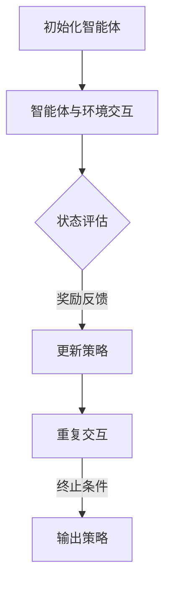

                 

### 背景介绍

强化学习（Reinforcement Learning，RL）作为一种机器学习的重要分支，近年来在人工智能领域取得了显著的研究进展和应用成果。强化学习的核心思想是让智能体（agent）通过与环境的交互，不断学习优化策略，以实现长期利益最大化。与监督学习和无监督学习相比，强化学习具有更强的自主性和适应性，能够处理复杂、动态和不确定的环境。

在多智能体系统（Multi-Agent Systems，MAS）中，多个智能体需要协同工作以实现共同目标。这类系统在分布式计算、协同决策、网络优化等领域具有重要应用价值。然而，多智能体系统面临诸多挑战，如个体目标与集体目标之间的冲突、通信限制、资源竞争等。传统多智能体协同方法往往依赖于预设规则和中心化控制，难以适应动态和复杂环境。

强化学习在多智能体协作中的应用，旨在通过学习个体间的策略交互，实现全局优化。与传统的多智能体方法相比，强化学习能够更灵活地处理复杂情境，适应不断变化的环境，从而提升整个系统的协同效率。

本文旨在探讨强化学习在多智能体协作中的优化应用。首先，我们将介绍强化学习的基本概念和原理，分析其在单智能体场景下的性能和优势。随后，我们将探讨如何将强化学习应用于多智能体系统，介绍核心算法原理及其具体操作步骤。接下来，我们将通过数学模型和公式，详细讲解强化学习在多智能体协作中的关键问题，并通过实际案例进行分析。最后，我们将总结强化学习在多智能体协作中的实际应用场景，探讨其未来发展趋势与挑战。

通过本文的探讨，希望读者能够对强化学习在多智能体协作中的优化应用有更深入的理解，为相关领域的研究和应用提供参考。

### 核心概念与联系

要深入探讨强化学习在多智能体协作中的优化应用，我们首先需要明确几个核心概念：强化学习、多智能体系统及其相互关系。

#### 强化学习

强化学习是一种使智能体在与环境交互的过程中学习最优策略的机器学习方法。其主要特点包括：

1. **反馈机制**：智能体通过观察环境的反馈（奖励或惩罚）来调整自己的行为。
2. **自主性**：智能体具有主动探索和决策的能力，不需要预设规则。
3. **适应性**：智能体可以根据环境的变化不断优化策略。

在强化学习中，智能体通过学习价值函数或策略函数来指导其行动。价值函数 \(V(s)\) 表示智能体在状态 \(s\) 下采取某一动作 \(a\) 的长期预期回报。策略函数 \(\pi(a|s)\) 则是智能体在状态 \(s\) 下选择动作 \(a\) 的概率分布。

#### 多智能体系统

多智能体系统由多个智能体组成，每个智能体具有独立的目标和决策能力。这些智能体可以协同工作，共同实现系统整体目标。多智能体系统的特点包括：

1. **分布式计算**：智能体在系统中独立工作，通过局部信息进行协同决策。
2. **异构性**：智能体可能具有不同的能力、信息和目标。
3. **动态性**：系统中的智能体和外部环境都可能发生变化。

多智能体系统广泛应用于分布式计算、协同控制、社交网络等领域。为了实现高效协同，智能体之间需要建立有效的通信机制和协调策略。

#### 强化学习与多智能体系统的关系

强化学习在多智能体协作中的应用，旨在通过学习智能体间的策略交互，实现全局优化。以下是强化学习与多智能体系统的几个关键联系：

1. **策略优化**：强化学习通过学习最优策略，帮助智能体实现个体目标。在多智能体系统中，每个智能体的策略不仅要考虑自身利益，还需兼顾整体系统的利益。
2. **协作学习**：在多智能体系统中，智能体之间的协作可以通过强化学习来实现。通过共同学习，智能体可以找到一种均衡策略，实现整体系统的最优性能。
3. **分布式计算**：强化学习与分布式计算的结合，可以提升多智能体系统的计算效率。智能体可以在本地进行学习和决策，通过通信网络共享信息，实现全局优化。

#### Mermaid 流程图

为了更直观地展示强化学习在多智能体协作中的应用，我们可以使用 Mermaid 流程图来描述其核心流程。



在这个流程图中，智能体首先进行初始化，然后与环境进行交互，通过状态评估和奖励反馈不断更新策略。当满足终止条件时，输出最终的策略。

通过上述介绍，我们可以看到强化学习在多智能体协作中具有广泛的应用前景。在接下来的章节中，我们将进一步探讨强化学习的核心算法原理及其在多智能体系统中的具体应用。

### 核心算法原理 & 具体操作步骤

强化学习在多智能体协作中的应用，离不开核心算法原理的支撑。本文将重点介绍 Q-Learning 和 Policy Gradient 方法，并详细阐述其具体操作步骤。

#### Q-Learning 方法

Q-Learning 是一种基于值函数的强化学习方法，通过学习状态-动作价值函数 \(Q(s, a)\) 来指导智能体的决策。Q-Learning 的核心思想是通过试错学习，不断更新 \(Q(s, a)\) 的值，最终找到最优策略。

**具体操作步骤如下：**

1. **初始化**：设定智能体的初始状态 \(s_0\) 和策略 \(\pi(a|s)\)，初始化 \(Q(s, a)\) 的值，通常使用零初始化或均匀初始化。

2. **状态-动作选择**：智能体根据当前状态 \(s_t\) 和策略 \(\pi(a|s)\) 选择动作 \(a_t\)。

3. **执行动作**：智能体执行选择的动作 \(a_t\)，进入下一个状态 \(s_{t+1}\)，并获得奖励 \(r_t\)。

4. **更新 \(Q(s, a)\) 值**：根据新的状态和奖励，更新 \(Q(s_t, a_t)\) 的值，使用以下公式：
   $$ Q(s_t, a_t) \leftarrow Q(s_t, a_t) + \alpha [r_t + \gamma \max_{a'} Q(s_{t+1}, a') - Q(s_t, a_t)] $$
   其中，\(\alpha\) 为学习率，\(\gamma\) 为折扣因子，\(\max_{a'} Q(s_{t+1}, a')\) 表示在下一状态中，所有可能动作中 \(Q(s_{t+1}, a')\) 的最大值。

5. **重复步骤 2-4**：重复执行状态-动作选择、执行动作和更新 \(Q(s, a)\) 的过程，直到达到终止条件。

**示例：**

假设智能体在一个简单的环境中有两个状态 \(s_0\) 和 \(s_1\)，以及两个动作 \(a_0\) 和 \(a_1\)。智能体初始状态为 \(s_0\)，初始 \(Q(s, a)\) 值为 \(0\)。智能体根据策略选择 \(a_0\)，执行动作后进入 \(s_1\)，并获得奖励 \(r_1 = 1\)。智能体更新 \(Q(s_0, a_0)\) 的值为 \(1\)。然后，智能体再次根据策略选择 \(a_1\)，进入 \(s_2\)，并获得奖励 \(r_2 = -1\)。智能体更新 \(Q(s_1, a_1)\) 的值为 \(-1\)。

通过不断更新 \(Q(s, a)\) 的值，智能体可以逐步找到最优策略。

#### Policy Gradient 方法

Policy Gradient 方法是一种基于策略优化的强化学习方法，直接优化智能体的策略函数，而不是学习状态-动作价值函数。Policy Gradient 的核心思想是通过梯度上升法，最大化策略的期望回报。

**具体操作步骤如下：**

1. **初始化**：设定智能体的初始状态 \(s_0\) 和策略参数 \(\theta\)。

2. **状态-动作选择**：智能体根据当前状态 \(s_t\) 和策略参数 \(\theta\) 选择动作 \(a_t\)。

3. **执行动作**：智能体执行选择的动作 \(a_t\)，进入下一个状态 \(s_{t+1}\)，并获得奖励 \(r_t\)。

4. **计算策略梯度**：根据当前策略和执行的动作，计算策略梯度：
   $$ \nabla_{\theta} J(\theta) = \nabla_{\theta} \sum_{t} \gamma^t r_t = \sum_{t} \nabla_{\theta} \log \pi(a_t|s_t, \theta) \cdot r_t $$
   其中，\(J(\theta)\) 为策略的期望回报，\(\gamma\) 为折扣因子。

5. **更新策略参数**：根据策略梯度，使用梯度上升法更新策略参数：
   $$ \theta \leftarrow \theta + \alpha \nabla_{\theta} J(\theta) $$
   其中，\(\alpha\) 为学习率。

6. **重复步骤 2-5**：重复执行状态-动作选择、执行动作和更新策略参数的过程，直到达到终止条件。

**示例：**

假设智能体在简单环境中有两个状态 \(s_0\) 和 \(s_1\)，以及两个动作 \(a_0\) 和 \(a_1\)。智能体初始状态为 \(s_0\)，策略参数为 \(\theta_0\)。智能体根据当前策略选择 \(a_0\)，执行动作后进入 \(s_1\)，并获得奖励 \(r_1 = 1\)。智能体计算策略梯度 \(\nabla_{\theta} J(\theta_0) = r_1 \log \pi(a_0|s_0, \theta_0)\)。然后，智能体使用梯度上升法更新策略参数 \(\theta_1 = \theta_0 + \alpha \nabla_{\theta} J(\theta_0)\)。

通过不断更新策略参数，智能体可以逐步找到最优策略。

通过上述两种方法的介绍，我们可以看到强化学习在多智能体协作中的应用具有丰富的算法选择。在接下来的章节中，我们将通过数学模型和公式，进一步探讨强化学习在多智能体协作中的关键问题。

### 数学模型和公式 & 详细讲解 & 举例说明

在强化学习多智能体协作中，数学模型和公式扮演着至关重要的角色，它们帮助我们理解智能体的行为、优化策略并评估系统的性能。以下是强化学习在多智能体协作中的关键数学模型和公式的详细讲解，并配合实例说明。

#### 1. 状态空间与动作空间

强化学习中的状态空间 \(S\) 和动作空间 \(A\) 分别表示智能体可能遇到的所有状态和可以采取的所有动作。在多智能体系统中，每个智能体的状态和动作空间可能不同，但它们之间需要通过策略进行协调。

**示例：**

假设有两个智能体，一个负责移动（状态空间：\[0, 1, 2, 3\]），另一个负责转向（状态空间：\[0, 1, 2\]）。它们可以采取的动作分别是移动（动作空间：\[左, 右, 直行\]）和转向（动作空间：\[左转, 右转, 不转\]）。

#### 2. 奖励函数

奖励函数 \(R(s, a)\) 是强化学习中的关键元素，它表示智能体在状态 \(s\) 下采取动作 \(a\) 后获得的即时回报。在多智能体协作中，奖励函数不仅需要考虑个体绩效，还需兼顾整个系统的整体利益。

**示例：**

在协同导航任务中，智能体获得奖励取决于它们之间的距离和角度误差。例如，如果两个智能体彼此靠近并保持特定角度，则它们可以获得正奖励，反之则获得负奖励。

#### 3. 策略函数

策略函数 \(\pi(a|s|\theta)\) 是智能体在给定状态 \(s\) 下选择动作 \(a\) 的概率分布。在多智能体系统中，策略函数需要考虑所有智能体的状态，以实现协同决策。

**示例：**

假设一个智能体在特定状态下需要选择转向角度。策略函数可以是一个概率分布，例如正态分布，其均值和标准差取决于智能体的状态和策略参数。

#### 4. 价值函数

价值函数 \(V(s|\theta)\) 是智能体在状态 \(s\) 下采取最优策略获得的期望回报。在多智能体协作中，价值函数需要考虑全局利益，以实现整体优化。

**示例：**

在多智能体协同完成一个任务时，智能体的价值函数表示完成任务的期望时间或完成质量。例如，如果两个智能体需要协作完成一项任务，它们的价值函数可以表示为完成任务所需的总时间。

#### 5. Q-函数

Q-函数 \(Q(s, a|\theta)\) 是智能体在状态 \(s\) 下采取动作 \(a\) 的预期回报。Q-函数是强化学习中最常用的函数之一，用于评估动作的价值。

**示例：**

在一个赛车游戏中，智能体在赛道上的位置、速度和加速度决定了其Q-函数的值。智能体需要选择最优动作以最大化其Q-函数。

**数学公式：**
$$ Q(s, a|\theta) = \sum_{s'} p(s'|s, a) \sum_{a'} \pi(a'|\theta) R(s', a') + \gamma V(s'|\theta) $$

其中，\(p(s'|s, a)\) 是状态转移概率，\(\pi(a'|\theta)\) 是策略函数，\(R(s', a')\) 是奖励函数，\(\gamma\) 是折扣因子。

#### 6. 政策梯度

政策梯度方法通过优化策略参数来最大化期望回报。政策梯度公式如下：
$$ \nabla_{\theta} J(\theta) = \sum_{s, a} \nabla_{\theta} \log \pi(a|s, \theta) \cdot R(s, a) $$

其中，\(J(\theta)\) 是策略的期望回报，\(\nabla_{\theta} \log \pi(a|s, \theta)\) 是策略梯度。

**示例：**

在机器人导航任务中，政策梯度方法可以用于优化导航策略，使其在给定地图和障碍物的情况下找到最优路径。

通过上述数学模型和公式的介绍，我们可以更好地理解强化学习在多智能体协作中的应用。接下来，我们将通过实际项目案例，进一步展示这些理论在实际开发中的应用。

### 项目实战：代码实际案例和详细解释说明

为了更好地理解强化学习在多智能体协作中的实际应用，我们将通过一个简单的项目案例——多智能体协同导航系统，来演示如何使用 Python 编写代码实现这一系统。我们将从开发环境搭建开始，详细解释和解读源代码，并分析代码的实现细节。

#### 5.1 开发环境搭建

首先，我们需要搭建一个适合开发强化学习多智能体系统的环境。以下是所需的软件和工具：

1. **Python 3.x**
2. **Jupyter Notebook**
3. **PyTorch**
4. **OpenAI Gym**
5. **Matplotlib**

安装这些工具后，我们可以在 Jupyter Notebook 中开始编写代码。

#### 5.2 源代码详细实现和代码解读

以下是一个简单的多智能体协同导航系统的代码实现。我们将分步骤进行解读。

```python
import numpy as np
import torch
import torch.nn as nn
import torch.optim as optim
from torch.autograd import Variable
import matplotlib.pyplot as plt
from multi_agent_env import MultiAgentEnv

# 设置超参数
n_agents = 3
state_dim = 4
action_dim = 3
learning_rate = 0.001
gamma = 0.99
epsilon = 0.1

# 初始化环境
env = MultiAgentEnv(n_agents, state_dim, action_dim)

# 定义 Q 网络和策略网络
class QNetwork(nn.Module):
    def __init__(self, state_dim, action_dim):
        super(QNetwork, self).__init__()
        self.fc1 = nn.Linear(state_dim, 128)
        self.fc2 = nn.Linear(128, action_dim)
    
    def forward(self, x):
        x = torch.relu(self.fc1(x))
        x = self.fc2(x)
        return x

q_network = QNetwork(state_dim, action_dim)
target_q_network = QNetwork(state_dim, action_dim)

# 定义优化器
optimizer = optim.Adam(q_network.parameters(), lr=learning_rate)

# 定义损失函数
loss_function = nn.MSELoss()

# 设置为训练模式
q_network.train()
target_q_network.eval()

# 重置所有智能体的记忆
memory = []

# 训练循环
for episode in range(1000):
    state = env.reset()
    done = False
    total_reward = 0
    
    while not done:
        # 选取动作
        with torch.no_grad():
            q_values = q_network(Variable(torch.from_numpy(state).float()))
            if np.random.rand() < epsilon:
                action = env.action_space.sample()
            else:
                action = torch.argmax(q_values).item()
        
        # 执行动作
        next_state, reward, done, _ = env.step(action)
        total_reward += reward
        
        # 更新记忆
        memory.append((state, action, reward, next_state, done))
        
        # 更新状态
        state = next_state
        
        if len(memory) > 100:
            # 从记忆中随机抽取样本
            batch = np.random.choice(len(memory), 32)
            states, actions, rewards, next_states, dones = zip(*[memory[i] for i in batch])
            
            # 转换为 PyTorch 张量
            states = torch.from_numpy(np.array(states)).float()
            actions = torch.from_numpy(np.array(actions)).unsqueeze(1).float()
            rewards = torch.from_numpy(np.array(rewards)).unsqueeze(1).float()
            next_states = torch.from_numpy(np.array(next_states)).float()
            dones = torch.from_numpy(np.array(dones)).unsqueeze(1).float()
            
            # 计算目标 Q 值
            target_q_values = target_q_network(next_states)
            target_q_values = rewards + (1 - dones) * gamma * target_q_values.max(1)[0]
            
            # 计算当前 Q 值的预测
            current_q_values = q_network(states).gather(1, actions)
            
            # 计算损失
            loss = loss_function(current_q_values, target_q_values)
            
            # 反向传播和优化
            optimizer.zero_grad()
            loss.backward()
            optimizer.step()
        
        if done:
            break
    
    print(f"Episode {episode}: Total Reward = {total_reward}")

# 评估模型
env = MultiAgentEnv(n_agents, state_dim, action_dim, is_train=False)
state = env.reset()
done = False
total_reward = 0

while not done:
    with torch.no_grad():
        q_values = q_network(Variable(torch.from_numpy(state).float()))
        action = torch.argmax(q_values).item()
    
    next_state, reward, done, _ = env.step(action)
    total_reward += reward
    state = next_state

print(f"Total Reward: {total_reward}")
env.close()
```

#### 5.3 代码解读与分析

1. **环境初始化**：

   首先，我们初始化环境 `MultiAgentEnv`，这是一个自定义的类，用于模拟多智能体协同导航环境。环境提供了状态、动作空间以及执行动作的接口。

2. **定义 Q 网络**：

   我们定义了 Q 网络和目标 Q 网络两个模型。Q 网络是一个简单的全连接神经网络，用于预测状态-动作值。目标 Q 网络用于更新 Q 网络的目标值，以避免梯度消失问题。

3. **定义优化器和损失函数**：

   使用 Adam 优化器优化 Q 网络参数，并使用均方误差损失函数计算预测值和目标值的差异。

4. **训练循环**：

   在训练循环中，智能体首先从环境获取初始状态，然后通过 Q 网络选择动作。动作的选择基于 ε-贪心策略，即以一定概率随机选择动作，以避免策略过早固化。

5. **更新记忆**：

   每次执行动作后，智能体将当前状态、动作、奖励、下一状态和是否结束存储在记忆中。当记忆达到一定容量时，从记忆中随机抽取样本进行训练。

6. **计算损失和优化**：

   在训练过程中，我们计算当前 Q 值和目标 Q 值之间的差异，并使用反向传播更新 Q 网络的参数。

7. **评估模型**：

   在训练完成后，我们使用训练好的 Q 网络进行评估。评估过程中，智能体仅根据 Q 网络选择动作，以评估模型的实际性能。

通过这个项目案例，我们可以看到如何将强化学习应用于多智能体协作中的导航问题。代码实现了 Q-Learning 算法，通过不断更新策略，智能体能够逐渐学会协同工作，实现整体目标。

### 实际应用场景

强化学习在多智能体协作中具有广泛的应用场景，能够解决许多复杂、动态和不确定的问题。以下是一些典型的实际应用场景：

#### 1. 自动驾驶

自动驾驶技术是强化学习在多智能体协作中的经典应用之一。在自动驾驶系统中，多个传感器（如摄像头、激光雷达等）收集车辆周围环境的数据，并将数据传递给智能体。智能体需要协同工作，处理复杂的交通情况，做出实时驾驶决策，如换道、停车、避障等。通过强化学习，智能体可以学习最优驾驶策略，提高系统的安全性和效率。

#### 2. 网络优化

在复杂的计算机网络中，多个节点需要协同工作，以实现最优的数据传输和资源分配。强化学习可以帮助智能体学习全局最优策略，优化网络性能。例如，在路由优化中，智能体需要根据网络状态和流量动态选择最佳路径，以减少延迟和带宽消耗。通过强化学习，智能体可以逐渐找到最优的路径规划策略。

#### 3. 分配与调度

在资源分配和调度领域，强化学习可以帮助智能体实现高效的资源管理。例如，在数据中心，多个虚拟机需要分配到不同的物理主机上，以平衡负载并提高资源利用率。通过强化学习，智能体可以学习最优的分配策略，根据实时负载和性能指标动态调整虚拟机的位置和配置。

#### 4. 生产调度

在工业生产中，多个机器人和智能设备需要协同工作，以完成复杂的制造任务。通过强化学习，智能体可以学习最优的生产调度策略，提高生产效率和产品质量。例如，在汽车制造厂，机器人需要协同完成焊接、组装等任务，通过强化学习，可以优化机器人的工作流程，减少停机时间，提高生产效率。

#### 5. 金融交易

在金融市场中，多个交易者需要协同工作，以实现最佳投资组合和交易策略。通过强化学习，智能体可以学习最优的交易策略，根据市场动态和风险偏好进行交易。例如，在股票市场中，智能体可以学习买入、持有或卖出的最佳时机，以最大化收益并控制风险。

通过上述实际应用场景，我们可以看到强化学习在多智能体协作中具有巨大的应用潜力。它不仅能够解决传统的优化问题，还能够应对复杂、动态和不确定的情境，为各种领域的协同系统提供高效的解决方案。

### 工具和资源推荐

在研究强化学习在多智能体协作中的应用过程中，掌握相关工具和资源对于提高研究效率和成果质量至关重要。以下是一些建议的学习资源、开发工具和相关论文著作，供读者参考。

#### 7.1 学习资源推荐

1. **书籍**：

   - **《强化学习：原理与Python实现》**：这是一本深入浅出的强化学习入门书籍，详细介绍了强化学习的基本原理、算法和应用案例。

   - **《深度强化学习》**：该书系统地介绍了深度强化学习的方法和应用，包括 DQN、A3C、DDPG 等经典算法。

   - **《强化学习实战》**：本书通过实际案例，展示了如何使用 Python 实现各种强化学习算法，并应用于实际问题。

2. **在线课程**：

   - **Coursera 上的《强化学习》课程**：由 David Silver 开设的这门课程，涵盖了强化学习的基本概念、算法和实战应用。

   - **Udacity 上的《深度强化学习》课程**：这门课程深入介绍了深度强化学习的方法和应用，包括 DQN、A3C、DDPG 等。

   - **edX 上的《强化学习基础》课程**：该课程由 University of Colorado Boulder 开设，适合初学者了解强化学习的基础知识。

3. **论文与文献**：

   - **“Deep Q-Network”**：这是一篇经典的论文，提出了 DQN 算法，是深度强化学习的里程碑之一。

   - **“Asynchronous Methods for Deep Reinforcement Learning”**：该论文介绍了 A3C 算法，为深度强化学习提供了有效的分布式训练方法。

   - **“Continuous Control with Deep Reinforcement Learning”**：该论文提出了 DDPG 算法，适用于连续动作空间的强化学习问题。

#### 7.2 开发工具框架推荐

1. **PyTorch**：PyTorch 是一种流行的深度学习框架，提供了丰富的 API 和工具，方便实现和训练强化学习模型。

2. **TensorFlow**：TensorFlow 是另一种强大的深度学习框架，广泛应用于各种机器学习和强化学习项目。

3. **OpenAI Gym**：OpenAI Gym 是一个开源的环境库，提供了多种标准化的强化学习任务和环境，方便进行算法测试和验证。

4. **Gymnasium**：Gymnasium 是 OpenAI Gym 的升级版，增加了对多种环境的支持，并提供了一个统一的接口，方便开发者使用。

#### 7.3 相关论文著作推荐

1. **“Multi-Agent Reinforcement Learning: A Brief Survey”**：这是一篇综述性论文，总结了多智能体强化学习的主要算法和应用。

2. **“Distributed Reinforcement Learning”**：该论文探讨了分布式强化学习的方法和挑战，为多智能体系统提供了有效的解决方案。

3. **“Reinforcement Learning in Multi-Agent Systems”**：该论文详细介绍了多智能体强化学习的基本原理、算法和应用场景。

通过这些工具和资源的推荐，希望读者能够更好地掌握强化学习在多智能体协作中的应用，为相关领域的研究和应用提供有力支持。

### 总结：未来发展趋势与挑战

在本文中，我们探讨了强化学习在多智能体协作中的优化应用，分析了其核心算法原理和实际应用场景。通过理论讲解和项目实践，我们展示了强化学习如何帮助智能体实现协同工作，优化系统性能。然而，强化学习在多智能体协作中仍面临诸多挑战，以下是未来发展趋势和需关注的几个关键问题：

#### 未来发展趋势

1. **分布式与并行计算**：随着计算能力的提升，分布式和并行计算在强化学习中的应用将更加广泛。分布式训练能够加速算法收敛，提高模型性能。并行计算可以处理大规模多智能体系统，提高系统的实时响应能力。

2. **迁移学习与泛化能力**：当前的多智能体强化学习模型往往需要大量数据来训练，迁移学习技术可以帮助智能体在不同任务间共享知识，提高模型的泛化能力。未来研究可以探索如何有效利用迁移学习，降低数据需求，提高模型适应能力。

3. **多模态信息处理**：多智能体系统通常涉及多种类型的信息，如视觉、语音、传感器数据。未来研究可以关注如何整合多模态信息，提高智能体的感知和理解能力，实现更高效的协同决策。

4. **自适应与动态调整**：强化学习模型需要能够根据环境和任务的变化自适应调整策略。未来研究可以探索如何设计自适应机制，使智能体能够快速适应新环境和动态变化，提高系统稳定性。

#### 挑战

1. **通信与计算复杂度**：多智能体系统中的智能体需要频繁交换信息，这增加了通信和计算的复杂度。如何设计高效的信息交换机制和优化计算资源，是一个亟待解决的问题。

2. **非合作与冲突**：在多智能体系统中，个体目标与集体目标之间可能存在冲突。如何设计公平、合理的策略，使得智能体既能实现自身目标，又能协同工作，是一个重要的挑战。

3. **安全与稳定性**：强化学习模型在训练过程中可能产生不可预测的行为，导致系统不稳定。如何在保证安全性和稳定性的前提下，优化智能体的策略，是一个关键问题。

4. **数据隐私与安全**：在多智能体系统中，数据的安全和隐私保护尤为重要。如何设计安全的数据交换和处理机制，防止数据泄露和滥用，是未来研究需要关注的方向。

总之，强化学习在多智能体协作中的优化应用具有广阔的发展前景，但也面临诸多挑战。通过不断探索和创新，我们有望在理论、算法和应用方面取得新的突破，为多智能体系统的发展贡献力量。

### 附录：常见问题与解答

在本文中，我们探讨了强化学习在多智能体协作中的应用。为了帮助读者更好地理解相关概念，以下是一些常见问题的解答。

#### Q1：什么是强化学习？
强化学习是一种机器学习方法，使智能体在与环境的交互过程中学习最优策略，以实现长期利益最大化。智能体通过观察环境的反馈（奖励或惩罚），不断调整自己的行为，优化策略。

#### Q2：强化学习的基本概念有哪些？
强化学习的基本概念包括：智能体（agent）、环境（environment）、状态（state）、动作（action）、策略（policy）和价值函数（value function）。

#### Q3：如何将强化学习应用于多智能体系统？
强化学习在多智能体系统中的应用，旨在通过学习个体间的策略交互，实现全局优化。具体方法包括 Q-Learning 和 Policy Gradient 等算法，通过策略优化和协作学习，提高系统的协同效率。

#### Q4：Q-Learning 和 Policy Gradient 有什么区别？
Q-Learning 是一种基于值函数的算法，通过学习状态-动作价值函数，指导智能体选择最优动作。Policy Gradient 是一种基于策略优化的算法，通过直接优化策略参数，最大化期望回报。

#### Q5：如何解决多智能体系统中的非合作与冲突问题？
解决非合作与冲突问题，需要设计公平、合理的策略。一种方法是引入博弈论中的纳什均衡理论，使智能体在决策时考虑其他智能体的行为，实现共赢。另一种方法是通过强化学习算法，学习全局最优策略，平衡个体目标与集体目标。

#### Q6：如何提高强化学习模型的泛化能力？
提高强化学习模型的泛化能力，可以采用迁移学习技术，使智能体在不同任务间共享知识。此外，通过增加训练数据、使用正则化技术等方法，也可以提高模型的泛化性能。

#### Q7：强化学习在多智能体协作中面临哪些挑战？
强化学习在多智能体协作中面临的主要挑战包括：通信与计算复杂度、非合作与冲突、安全性与稳定性，以及数据隐私与安全等。如何设计高效的信息交换机制、优化计算资源、保障系统安全，是未来研究需要关注的方向。

通过以上常见问题的解答，希望读者能够对强化学习在多智能体协作中的应用有更深入的理解。

### 扩展阅读 & 参考资料

为了帮助读者进一步探索强化学习在多智能体协作中的优化应用，以下是相关扩展阅读和参考资料，涵盖书籍、论文、博客和网站等内容。

#### 书籍

1. **《强化学习：原理与Python实现》**：本书系统地介绍了强化学习的基本原理、算法和应用，适合初学者入门。
2. **《深度强化学习》**：详细讲解了深度强化学习的方法和应用，包括 DQN、A3C、DDPG 等经典算法。
3. **《强化学习实战》**：通过实际案例，展示了如何使用 Python 实现各种强化学习算法，并应用于实际问题。

#### 论文

1. **“Deep Q-Network”**：该论文提出了 DQN 算法，是深度强化学习的里程碑之一。
2. **“Asynchronous Methods for Deep Reinforcement Learning”**：该论文介绍了 A3C 算法，为深度强化学习提供了有效的分布式训练方法。
3. **“Continuous Control with Deep Reinforcement Learning”**：该论文提出了 DDPG 算法，适用于连续动作空间的强化学习问题。

#### 博客

1. **“强化学习教程”**：一个全面介绍强化学习基本概念和算法的博客，适合初学者学习。
2. **“DeepMind 官方博客”**：DeepMind 官方博客发布了大量强化学习相关的研究进展和应用案例。
3. **“PyTorch 强化学习教程”**：本教程使用 PyTorch 深度学习框架，介绍了强化学习算法的实现和应用。

#### 网站

1. **“OpenAI”**：OpenAI 是一家专注于人工智能研究的公司，发布了大量关于强化学习的研究论文和开源代码。
2. **“ArXiv”**：ArXiv 是一个开放获取的预印本平台，收录了大量机器学习和强化学习领域的最新研究成果。
3. **“Coursera”**：Coursera 提供了多种强化学习相关的在线课程，适合不同层次的学习者。

通过以上扩展阅读和参考资料，读者可以更全面地了解强化学习在多智能体协作中的优化应用，为相关领域的研究和应用提供参考。希望这些资源能够帮助读者深入探索这一领域，实现更多创新成果。

