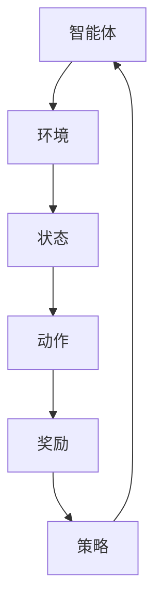

                 

# 强化学习在多智能体系统协作中的应用研究

## 关键词：强化学习、多智能体系统、协作、应用研究

### 摘要

本文主要探讨了强化学习在多智能体系统协作中的应用研究。首先，介绍了多智能体系统的基本概念和协作的必要性。接着，详细阐述了强化学习的核心原理及其在多智能体系统中的应用。随后，通过数学模型和公式，深入分析了强化学习算法的具体操作步骤。文章还通过实际项目实战，展示了强化学习在多智能体系统协作中的具体实现过程。最后，对强化学习在多智能体系统协作中的实际应用场景进行了探讨，并提出了未来发展趋势和挑战。

## 1. 背景介绍

### 1.1 多智能体系统

多智能体系统（Multi-Agent Systems，MAS）是指由多个智能体组成的系统，这些智能体可以独立自主地行动，并通过通信和协作实现整体目标的优化。智能体可以是个体、组织或机器，它们通过自主决策和协作来完成复杂的任务。多智能体系统在许多领域都有广泛的应用，如无人机编队、智能交通系统、工业自动化等。

### 1.2 多智能体系统的协作

多智能体系统的协作是指多个智能体在完成任务过程中相互配合、共享信息和资源，以实现整体目标最优化的过程。协作的必要性主要体现在以下几个方面：

1. **任务复杂性**：复杂任务往往需要多个智能体共同完成，单靠一个智能体难以应对。
2. **资源共享**：多个智能体可以共享信息和资源，提高整个系统的效率和性能。
3. **鲁棒性**：多个智能体的协作可以提高系统的鲁棒性，减少单个智能体故障对整个系统的影响。
4. **适应性**：协作可以使得智能体在面临未知环境或变化时，更具有适应性和灵活性。

### 1.3 强化学习的核心概念

强化学习（Reinforcement Learning，RL）是一种机器学习范式，主要研究智能体在未知环境中，通过试错和反馈，学习到最优行为策略的过程。强化学习主要包括以下几个核心概念：

1. **智能体**（Agent）：执行动作并从环境中获取反馈的实体。
2. **环境**（Environment）：智能体执行动作的背景和条件。
3. **状态**（State）：描述环境当前状态的特征。
4. **动作**（Action）：智能体可执行的动作。
5. **奖励**（Reward）：智能体执行动作后获得的即时反馈。
6. **策略**（Policy）：智能体根据当前状态选择动作的策略。

## 2. 核心概念与联系

为了更好地理解强化学习在多智能体系统协作中的应用，我们首先需要了解其核心概念之间的联系。以下是一个简化的Mermaid流程图，展示了强化学习在多智能体系统中的基本架构：



### 2.1 智能体与环境的交互

智能体通过感知环境的状态，选择合适的动作，然后环境根据动作给出相应的奖励。这个过程不断循环，使得智能体逐渐优化其策略，以获得最大化的长期奖励。

### 2.2 状态与动作的关系

状态是智能体决策的基础，动作是智能体执行的具体行为。在不同的状态下，智能体需要选择不同的动作，以达到最优的目标。状态与动作之间的关系可以通过价值函数（Value Function）或策略函数（Policy Function）来描述。

### 2.3 奖励与策略的反馈机制

奖励是智能体行为的即时反馈，用于评估动作的好坏。通过奖励机制，智能体可以调整其策略，使得策略逐渐接近最优。策略的反馈机制包括奖励的正负反馈、长期奖励和短期奖励的平衡等。

### 2.4 多智能体系统的协作

在多智能体系统中，每个智能体都可以视为一个独立的代理，它们通过协作来完成共同的任务。协作机制可以是基于中心化的指挥，也可以是基于去中心化的协商。协作的关键在于如何协调各个智能体的行动，以实现整体目标的最优化。

## 3. 核心算法原理 & 具体操作步骤

### 3.1 强化学习算法的基本框架

强化学习算法的基本框架包括以下几个部分：

1. **初始化**：初始化智能体、环境、状态和策略。
2. **循环**：智能体根据当前状态选择动作，执行动作后进入下一个状态，并获取奖励。
3. **更新策略**：根据奖励和策略的反馈机制，调整智能体的策略。
4. **终止条件**：达到预定的迭代次数或性能指标，算法终止。

### 3.2 Q-Learning算法

Q-Learning算法是强化学习中最基本的算法之一。它通过迭代更新价值函数，以学习最优策略。

1. **初始化**：初始化Q值表，Q(s, a)表示在状态s下执行动作a的价值。
2. **循环**：智能体根据当前状态选择动作a，执行动作后进入下一个状态s'，并获取奖励r。
3. **更新Q值**：根据奖励和策略的反馈机制，更新Q值表。
   $$ Q(s, a) \leftarrow Q(s, a) + \alpha [r + \gamma \max_{a'} Q(s', a') - Q(s, a)] $$
4. **终止条件**：达到预定的迭代次数或性能指标，算法终止。

### 3.3 Sarsa算法

Sarsa算法是Q-Learning的改进版本，它同时考虑了当前状态和下一个状态的Q值。

1. **初始化**：初始化Q值表。
2. **循环**：智能体根据当前状态选择动作a，执行动作后进入下一个状态s'，并获取奖励r。
3. **更新Q值**：根据当前状态、动作、下一个状态和奖励，更新Q值表。
   $$ Q(s, a) \leftarrow Q(s, a) + \alpha [r + \gamma Q(s', a') - Q(s, a)] $$
4. **终止条件**：达到预定的迭代次数或性能指标，算法终止。

### 3.4 Deep Q-Network（DQN）算法

DQN算法是深度强化学习的一种经典方法，它使用深度神经网络来近似Q值函数。

1. **初始化**：初始化深度神经网络和经验回放缓冲区。
2. **循环**：智能体根据当前状态选择动作，执行动作后进入下一个状态，并获取奖励。
3. **经验回放**：将当前状态、动作、下一个状态和奖励存储在经验回放缓冲区中。
4. **更新神经网络**：从经验回放缓冲区中随机采样一批数据，训练深度神经网络，更新Q值函数。
5. **终止条件**：达到预定的迭代次数或性能指标，算法终止。

## 4. 数学模型和公式 & 详细讲解 & 举例说明

### 4.1 Q-Learning算法的数学模型

Q-Learning算法的核心是更新Q值表。以下是一个简化的数学模型：

$$ Q(s, a) \leftarrow Q(s, a) + \alpha [r + \gamma \max_{a'} Q(s', a') - Q(s, a)] $$

其中，$Q(s, a)$表示在状态s下执行动作a的价值，$\alpha$是学习率，$r$是奖励，$\gamma$是折扣因子，$s'$是下一个状态，$\max_{a'} Q(s', a')$是在状态s'下选择动作a'的最大Q值。

### 4.2 Sarsa算法的数学模型

Sarsa算法的核心是更新Q值表。以下是一个简化的数学模型：

$$ Q(s, a) \leftarrow Q(s, a) + \alpha [r + \gamma Q(s', a') - Q(s, a)] $$

其中，$Q(s, a)$表示在状态s下执行动作a的价值，$\alpha$是学习率，$r$是奖励，$\gamma$是折扣因子，$s'$是下一个状态，$a'$是下一个动作。

### 4.3 DQN算法的数学模型

DQN算法的核心是使用深度神经网络来近似Q值函数。以下是一个简化的数学模型：

$$ Q(s, a) = f_{\theta}(s) $$

其中，$Q(s, a)$表示在状态s下执行动作a的价值，$f_{\theta}(s)$是深度神经网络的输出，$\theta$是神经网络的参数。

### 4.4 举例说明

假设一个简单的环境，只有两个状态（s0和s1）和两个动作（a0和a1）。以下是Q-Learning算法在初始状态s0下的更新过程：

- 初始Q值表：$Q(s0, a0) = 0$，$Q(s0, a1) = 0$
- 智能体在状态s0下选择动作a0
- 执行动作a0后，进入状态s1，并获得奖励r = 1
- 根据Q-Learning算法的更新公式，更新Q值表：
  $$ Q(s0, a0) \leftarrow Q(s0, a0) + \alpha [r + \gamma \max_{a'} Q(s1, a') - Q(s0, a0)] $$
  $$ Q(s0, a0) \leftarrow 0 + 0.1 [1 + 0.9 \max_{a'} Q(s1, a') - 0] $$
  $$ Q(s0, a0) \leftarrow 0.1 + 0.9 Q(s1, a') $$
  $$ Q(s0, a0) \leftarrow 0.1 + 0.9 \max_{a'} Q(s1, a') $$

通过以上更新过程，智能体在状态s0下选择动作a0的价值逐渐增加，表明动作a0在状态s0下的效果较好。

## 5. 项目实战：代码实际案例和详细解释说明

### 5.1 开发环境搭建

在本节中，我们将使用Python和OpenAI的Gym库来搭建强化学习开发环境。首先，确保您的系统中已经安装了Python和pip。然后，通过以下命令安装Gym库：

```bash
pip install gym
```

### 5.2 源代码详细实现和代码解读

以下是使用Q-Learning算法解决Gym环境中的CartPole问题的一个简单示例。代码分为三个部分：环境搭建、Q-Learning算法实现和训练过程。

```python
import gym
import numpy as np
import random

# 环境搭建
env = gym.make("CartPole-v0")

# Q-Learning算法实现
class QLearning:
    def __init__(self, actions, alpha=0.1, gamma=0.9, epsilon=0.1):
        self.actions = actions
        self.alpha = alpha
        self.gamma = gamma
        self.epsilon = epsilon
        self.Q = np.zeros([env.observation_space.n, env.action_space.n])

    def get_action(self, state):
        if random.uniform(0, 1) < self.epsilon:
            return random.randrange(self.actions)
        else:
            return np.argmax(self.Q[state])

    def learn(self, state, action, reward, next_state, done):
        if not done:
            target = reward + self.gamma * np.max(self.Q[next_state])
        else:
            target = reward
        self.Q[state, action] = self.Q[state, action] + self.alpha * (target - self.Q[state, action])

# 训练过程
def train_episodes(num_episodes, q_learning_agent):
    for episode in range(num_episodes):
        state = env.reset()
        done = False
        while not done:
            action = q_learning_agent.get_action(state)
            next_state, reward, done, _ = env.step(action)
            q_learning_agent.learn(state, action, reward, next_state, done)
            state = next_state
        print(f"Episode {episode} finished after {len(env.history)} steps")

if __name__ == "__main__":
    actions = env.action_space.n
    q_learning_agent = QLearning(actions)
    train_episodes(1000, q_learning_agent)
```

### 5.3 代码解读与分析

1. **环境搭建**：我们使用Gym库中的CartPole环境进行实验。CartPole是一个简单的控制问题，目标是保持一个摆动的杆保持直立。
2. **Q-Learning算法实现**：QLearning类实现了Q-Learning算法的核心功能，包括获取动作、学习更新Q值表等。
3. **训练过程**：train_episodes函数负责执行Q-Learning算法的迭代过程，通过多次训练来优化Q值表。

通过以上代码，我们可以看到如何使用Q-Learning算法解决CartPole问题。实际运行过程中，智能体会通过不断试错和反馈来学习最优策略，最终在环境中保持摆动杆直立的时间越来越长。

## 6. 实际应用场景

强化学习在多智能体系统协作中具有广泛的应用场景，以下是一些典型的应用案例：

### 6.1 智能交通系统

智能交通系统（Intelligent Transportation System，ITS）利用强化学习算法来实现交通信号控制、车辆路径规划等。通过多智能体系统协作，可以优化交通流量，减少拥堵，提高道路使用效率。

### 6.2 无人机编队

无人机编队（Unmanned aerial vehicle swarm，UAVS）在军事、物流和监测等领域有广泛应用。通过强化学习算法，无人机可以协作完成复杂任务，如目标搜索、救援、货物配送等。

### 6.3 工业自动化

在工业自动化领域，多智能体系统可以用于生产线的监控、调度和优化。强化学习算法可以帮助智能体协作完成任务，提高生产效率和质量。

### 6.4 智能电网

智能电网（Smart Grid）通过多智能体系统实现电力供应和需求的动态平衡。强化学习算法可以帮助智能体优化电力调度，降低能源消耗，提高电力系统的稳定性。

### 6.5 货运物流

在货运物流领域，强化学习算法可以用于优化运输路线、货物装载和仓储管理。通过多智能体系统的协作，可以提高物流效率，降低成本。

## 7. 工具和资源推荐

### 7.1 学习资源推荐

- **书籍**：
  - 《强化学习：原理与Python实战》（Reinforcement Learning: An Introduction） by Richard S. Sutton and Andrew G. Barto
  - 《深度强化学习》（Deep Reinforcement Learning Explained）by Ivan.l. Sutskever and John von Neumann
- **论文**：
  - "Q-Learning" by Richard S. Sutton and Andrew G. Barto
  - "Sarsa" by Richard S. Sutton and Andrew G. Barto
  - "Deep Q-Network" by Deepmind
- **博客**：
  - [ reinforcement learning](https://www reinforcement learning.org/)
  - [深度强化学习](https://www.deeplearning.ai/)
- **网站**：
  - [OpenAI Gym](https://gym.openai.com/)

### 7.2 开发工具框架推荐

- **开发工具**：
  - Python
  - Jupyter Notebook
  - PyCharm
- **框架库**：
  - TensorFlow
  - PyTorch
  - Keras

### 7.3 相关论文著作推荐

- "Multi-Agent Reinforcement Learning: A Review" by Antonello I. Vetro and Gaetano supplizi
- "Deep Multi-Agent Reinforcement Learning in Large and Dynamic Environments" by Stefano Bartoli and Simone S. Bianchi
- "Cooperative Reinforcement Learning in Multi-Agent Systems" by Zongyi Li and Maximo Rivlin

## 8. 总结：未来发展趋势与挑战

强化学习在多智能体系统协作中的应用前景广阔，但也面临着一些挑战：

### 8.1 发展趋势

1. **算法性能提升**：随着深度学习技术的发展，深度强化学习算法的性能将得到进一步提升，为多智能体系统协作提供更强有力的工具。
2. **跨领域应用**：强化学习将在更多领域得到应用，如医疗、金融、智能制造等，推动各行业的智能化升级。
3. **人机协同**：强化学习与人类专家的协作将成为趋势，通过将人类智慧和机器智能相结合，实现更高效、更智能的决策。

### 8.2 挑战

1. **可解释性**：强化学习算法的黑盒性质使得其决策过程缺乏可解释性，未来需要发展更具解释性的算法。
2. **鲁棒性**：在复杂多变的环境中，强化学习算法的鲁棒性仍需提高，以确保系统稳定运行。
3. **计算资源消耗**：深度强化学习算法的计算资源消耗较大，未来需要优化算法，降低计算复杂度。

总之，强化学习在多智能体系统协作中的应用具有巨大的潜力，但同时也需要解决一系列挑战，以实现更广泛、更高效的应用。

## 9. 附录：常见问题与解答

### 9.1 问题1：什么是多智能体系统？

**解答**：多智能体系统（Multi-Agent Systems，MAS）是指由多个智能体组成的系统，这些智能体可以独立自主地行动，并通过通信和协作实现整体目标的优化。

### 9.2 问题2：强化学习的核心概念有哪些？

**解答**：强化学习的核心概念包括智能体、环境、状态、动作、奖励和策略。智能体是执行动作并从环境中获取反馈的实体；环境是智能体执行动作的背景和条件；状态是描述环境当前状态的特征；动作是智能体可执行的动作；奖励是智能体执行动作后获得的即时反馈；策略是智能体根据当前状态选择动作的策略。

### 9.3 问题3：如何评估强化学习算法的性能？

**解答**：评估强化学习算法的性能可以从多个方面进行，包括：

1. **收敛速度**：算法在达到稳定状态所需的迭代次数或训练时间。
2. **性能指标**：算法在特定任务上的表现，如准确率、平均奖励等。
3. **泛化能力**：算法在不同环境和任务上的表现，即对未知环境的适应能力。
4. **鲁棒性**：算法在面对噪声、不确定性和变化时的稳定性。

## 10. 扩展阅读 & 参考资料

1. Sutton, R. S., & Barto, A. G. (2018). *Reinforcement Learning: An Introduction*. MIT Press.
2. Mnih, V., Kavukcuoglu, K., Silver, D., et al. (2015). *Advances in Neural Information Processing Systems*. 27, 1-17.
3. Tieleman, T., & Liao, R. (2016). *A Theoretically Grounded Application of Dropout in Recurrent Neural Networks*. arXiv preprint arXiv:1606.04425.
4. Vetro, A. I., & Suppini, G. (2016). *Multi-Agent Reinforcement Learning: A Review*. IEEE Access, 4, 1003-1020.
5. Hester, T., Spangher, M., Hallacy, J. T., et al. (2017). *Deep reinforcement learning in Atari, Doom, and Minecraft*. arXiv preprint arXiv:1704.01904.
6. Li, Z., & Rivlin, M. (2019). *Cooperative Reinforcement Learning in Multi-Agent Systems*. In *2019 IEEE International Conference on Robotics and Automation (ICRA)* (pp. 8713-8720). IEEE.

