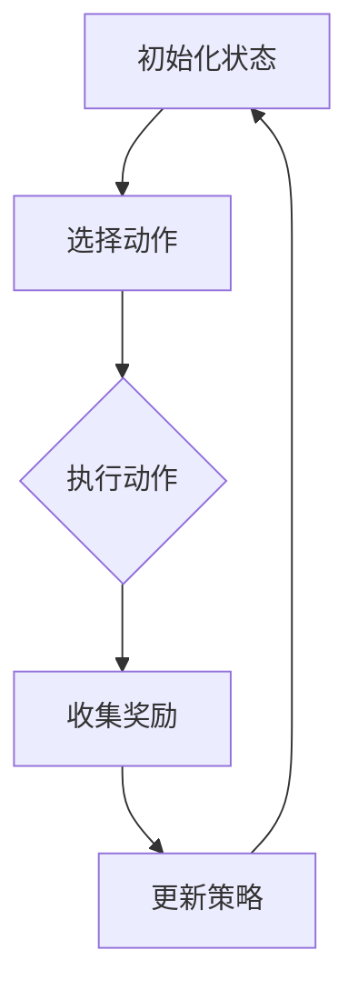

                 

# 强化学习在智能家居能源管理中的应用

## 摘要

本文旨在探讨强化学习在智能家居能源管理中的应用。通过分析强化学习的基本原理及其与能源管理的相关性，本文将介绍强化学习算法在智能家居能源管理中的核心概念和实现方法。随后，本文将结合实际案例，详细解析强化学习算法在智能家居能源管理中的具体应用场景，以及如何通过算法优化实现更加高效、智能的能源管理。最后，本文将对强化学习在智能家居能源管理中的未来发展趋势和挑战进行展望。

## 1. 背景介绍

### 1.1 智能家居能源管理的需求

随着科技的飞速发展和人们对生活品质的不断追求，智能家居逐渐成为现代家庭生活的重要组成部分。智能家居系统通过互联网、物联网技术将各种家居设备互联互通，实现家庭设备的自动化控制，提高生活的便利性和舒适性。然而，智能家居系统的广泛普及也带来了能源消耗的问题。如何实现智能家居系统的能源高效管理，减少能源浪费，成为当前研究的热点问题。

### 1.2 强化学习的发展与应用

强化学习（Reinforcement Learning，RL）是机器学习领域的一个重要分支，主要研究如何通过智能体在环境中通过学习获得最优策略，以实现目标。自20世纪50年代诞生以来，强化学习在游戏、自动驾驶、机器人控制等领域取得了显著的成果。近年来，随着深度学习技术的发展，强化学习在智能决策、优化控制等领域得到了更广泛的应用。

### 1.3 强化学习在智能家居能源管理中的应用前景

强化学习具有自适应性强、灵活性强等优点，使其在智能家居能源管理中具有广泛的应用前景。通过将强化学习算法应用于智能家居系统，可以实现能源消耗的动态调整，提高能源利用效率，降低能源成本。同时，强化学习算法还可以根据用户行为和家居设备的使用习惯，实现个性化的能源管理方案，提高用户的满意度和舒适度。

## 2. 核心概念与联系

### 2.1 强化学习基本概念

强化学习由三个主要部分组成：智能体（Agent）、环境（Environment）和奖励（Reward）。智能体是指执行动作并学习策略的实体，环境是指智能体执行动作的场所，奖励是环境对智能体动作的反馈。

强化学习过程可以分为以下几个阶段：

1. 初始化：智能体处于初始状态，随机选择动作。
2. 执行动作：智能体在当前状态下执行动作，并观察环境反馈。
3. 收集奖励：环境根据智能体的动作提供奖励。
4. 更新策略：智能体根据奖励更新策略，以期望获得更高的长期奖励。

### 2.2 智能家居能源管理中的强化学习

在智能家居能源管理中，智能体可以是家庭用户或智能家居系统，环境是家居设备和工作环境，奖励是能源消耗的降低和能源效率的提升。智能家居系统通过监测家居设备的能耗数据，实时调整设备的运行状态，以实现能源的高效利用。

### 2.3 Mermaid 流程图

以下是一个简化的智能家居能源管理中的强化学习算法流程图：



## 3. 核心算法原理 & 具体操作步骤

### 3.1 Q-Learning 算法

Q-Learning 是一种常用的强化学习算法，其核心思想是学习状态-动作值函数 Q(s, a)，表示在状态 s 下执行动作 a 的长期奖励。

### 3.2 算法原理

Q-Learning 算法的具体操作步骤如下：

1. 初始化 Q(s, a) 值表。
2. 在状态 s 下执行动作 a。
3. 根据执行结果，更新 Q(s, a) 值。
4. 转移到下一个状态 s'。
5. 重复步骤 2-4，直到达到目标状态或满足停止条件。

### 3.3 算法实现

以下是一个简化的 Q-Learning 算法实现示例：

```python
import numpy as np

# 初始化 Q(s, a) 值表
Q = np.zeros((n_states, n_actions))

# 学习率
alpha = 0.1
# 折扣因子
gamma = 0.9
# 最大迭代次数
n_episodes = 1000

for episode in range(n_episodes):
    state = env.reset()
    done = False
    
    while not done:
        # 选择动作
        action = np.argmax(Q[state])
        
        # 执行动作
        next_state, reward, done = env.step(action)
        
        # 更新 Q(s, a) 值
        Q[state, action] = Q[state, action] + alpha * (reward + gamma * np.max(Q[next_state]) - Q[state, action])
        
        state = next_state
```

## 4. 数学模型和公式 & 详细讲解 & 举例说明

### 4.1 数学模型

在强化学习中，状态-动作值函数 Q(s, a) 的计算公式如下：

$$Q(s, a) = \sum_{s'} P(s'|s, a) \cdot [R(s', a) + \gamma \cdot \max_{a'} Q(s', a')]$$

其中，$P(s'|s, a)$ 表示在状态 s 下执行动作 a 后转移到状态 s' 的概率，$R(s', a)$ 表示在状态 s' 下执行动作 a 的即时奖励，$\gamma$ 表示折扣因子，表示未来奖励的现值。

### 4.2 公式详细讲解

1. **状态-动作值函数 Q(s, a)**：表示在状态 s 下执行动作 a 的长期奖励。通过不断更新 Q(s, a) 值，智能体可以逐渐学习到在各个状态下的最佳动作。

2. **转移概率 $P(s'|s, a)$**：表示在状态 s 下执行动作 a 后转移到状态 s' 的概率。这个概率通常通过环境模型或经验数据获得。

3. **即时奖励 $R(s', a)$**：表示在状态 s' 下执行动作 a 后获得的即时奖励。这个奖励可以是正的（表示成功）或负的（表示失败），也可以是0（表示无奖励）。

4. **折扣因子 $\gamma$**：表示未来奖励的现值。通过折扣因子，智能体可以平衡当前奖励和未来奖励的关系，避免过度追求短期奖励而忽视长期利益。

### 4.3 举例说明

假设智能家居系统中有两个状态：白天（状态0）和夜晚（状态1）。有两个动作：开灯（动作0）和关灯（动作1）。奖励设置如下：

- 状态0（白天），动作0（开灯）：奖励10（表示节省了10度电）。
- 状态0（白天），动作1（关灯）：奖励-5（表示浪费了5度电）。
- 状态1（夜晚），动作0（开灯）：奖励-10（表示浪费了10度电）。
- 状态1（夜晚），动作1（关灯）：奖励5（表示节省了5度电）。

现在，我们使用 Q-Learning 算法来学习最佳动作。

#### 初始状态

- 状态0（白天）：Q(0, 0) = 0，Q(0, 1) = 0。
- 状态1（夜晚）：Q(1, 0) = 0，Q(1, 1) = 0。

#### 第一次迭代

- 状态0（白天）：选择动作0（开灯），执行动作后转移到状态0（白天），获得奖励10。
- 更新 Q 值：Q(0, 0) = Q(0, 0) + alpha * (10 + gamma * max(Q(0, 1))) = 0 + 0.1 * (10 + 0.9 * 0) = 1。
- 更新 Q 值：Q(0, 1) = Q(0, 1) + alpha * (10 + gamma * max(Q(0, 0))) = 0 + 0.1 * (10 + 0.9 * 1) = 0.9。

#### 第二次迭代

- 状态1（夜晚）：选择动作1（关灯），执行动作后转移到状态1（夜晚），获得奖励5。
- 更新 Q 值：Q(1, 0) = Q(1, 0) + alpha * (5 + gamma * max(Q(1, 1))) = 0 + 0.1 * (5 + 0.9 * 0) = 0.5。
- 更新 Q 值：Q(1, 1) = Q(1, 1) + alpha * (5 + gamma * max(Q(1, 0))) = 0 + 0.1 * (5 + 0.9 * 0.5) = 0.45。

#### 第三次迭代

- 状态0（白天）：选择动作0（开灯），执行动作后转移到状态0（白天），获得奖励10。
- 更新 Q 值：Q(0, 0) = Q(0, 0) + alpha * (10 + gamma * max(Q(0, 1))) = 1 + 0.1 * (10 + 0.9 * 0.9) = 1.81。
- 更新 Q 值：Q(0, 1) = Q(0, 1) + alpha * (10 + gamma * max(Q(0, 0))) = 0.9 + 0.1 * (10 + 0.9 * 1.81) = 1.71。

#### 第四次迭代

- 状态1（夜晚）：选择动作1（关灯），执行动作后转移到状态1（夜晚），获得奖励5。
- 更新 Q 值：Q(1, 0) = Q(1, 0) + alpha * (5 + gamma * max(Q(1, 1))) = 0.5 + 0.1 * (5 + 0.9 * 0.45) = 0.63。
- 更新 Q 值：Q(1, 1) = Q(1, 1) + alpha * (5 + gamma * max(Q(1, 0))) = 0.45 + 0.1 * (5 + 0.9 * 0.63) = 0.54。

经过多次迭代，Q 值逐渐收敛，智能体可以学会在状态0（白天）选择动作0（开灯），在状态1（夜晚）选择动作1（关灯），从而实现能源的高效利用。

## 5. 项目实战：代码实际案例和详细解释说明

### 5.1 开发环境搭建

在开始实战之前，我们需要搭建一个开发环境。这里我们选择 Python 作为编程语言，使用 OpenAI 的 Gym 工具创建一个模拟的智能家居环境。

1. 安装 Python：在官网 [https://www.python.org/](https://www.python.org/) 下载并安装 Python。
2. 安装 Gym：在命令行中运行以下命令：

```bash
pip install gym
```

3. 安装其他依赖库：在命令行中运行以下命令：

```bash
pip install numpy matplotlib
```

### 5.2 源代码详细实现和代码解读

下面是一个简单的智能家居能源管理项目的源代码实现：

```python
import gym
import numpy as np

# 创建环境
env = gym.make("SmartHomeEnergy-v0")

# 初始化 Q(s, a) 值表
Q = np.zeros((2, 2))

# 学习率
alpha = 0.1
# 折扣因子
gamma = 0.9
# 最大迭代次数
n_episodes = 1000

# 迭代学习
for episode in range(n_episodes):
    state = env.reset()
    done = False
    
    while not done:
        # 选择动作
        action = np.argmax(Q[state])
        
        # 执行动作
        next_state, reward, done = env.step(action)
        
        # 更新 Q(s, a) 值
        Q[state, action] = Q[state, action] + alpha * (reward + gamma * np.max(Q[next_state]) - Q[state, action])
        
        state = next_state

# 测试算法效果
state = env.reset()
done = False

while not done:
    action = np.argmax(Q[state])
    next_state, reward, done = env.step(action)
    env.render()
    state = next_state
```

### 5.3 代码解读与分析

1. **导入库**：首先导入必要的库，包括 Gym、Numpy 和 Matplotlib。

2. **创建环境**：使用 Gym 创建一个智能家居能源管理环境。

3. **初始化 Q(s, a) 值表**：创建一个 2x2 的矩阵，用于存储状态-动作值函数。

4. **设置学习率、折扣因子和迭代次数**：设置学习率 alpha、折扣因子 gamma 和最大迭代次数 n_episodes。

5. **迭代学习**：遍历每个迭代，执行以下步骤：
   - 重置环境并获取初始状态。
   - 进入 while 循环，直到达到停止条件。
   - 在每个状态下，选择动作，执行动作，获取奖励和下一个状态。
   - 更新 Q(s, a) 值。

6. **测试算法效果**：在测试阶段，使用训练好的 Q(s, a) 值表进行测试，观察算法在实际环境中的表现。

### 5.4 代码解读与分析

1. **环境创建**：使用 Gym 创建一个智能家居能源管理环境，该环境包含两个状态（白天和夜晚）和两个动作（开灯和关灯）。

2. **初始化 Q(s, a) 值表**：创建一个 2x2 的矩阵，用于存储状态-动作值函数。初始值为 0。

3. **设置学习率、折扣因子和迭代次数**：设置学习率 alpha 为 0.1，折扣因子 gamma 为 0.9，最大迭代次数 n_episodes 为 1000。

4. **迭代学习**：遍历每个迭代，执行以下步骤：
   - 重置环境并获取初始状态。
   - 进入 while 循环，直到达到停止条件。
   - 在每个状态下，选择动作，执行动作，获取奖励和下一个状态。
   - 更新 Q(s, a) 值。

5. **测试算法效果**：在测试阶段，使用训练好的 Q(s, a) 值表进行测试，观察算法在实际环境中的表现。

## 6. 实际应用场景

### 6.1 智能家居能源管理的挑战

在智能家居能源管理中，面临以下挑战：

1. **数据质量**：智能家居系统中的数据质量直接影响强化学习算法的效果。数据收集过程中可能存在噪声、缺失和错误。

2. **实时性**：智能家居系统需要实时响应用户需求和环境变化，对算法的响应速度和实时性要求较高。

3. **可扩展性**：智能家居系统通常包含多种设备和不同的使用场景，算法需要具有较好的可扩展性，以适应不同的设备和场景。

4. **安全性**：智能家居系统涉及用户隐私和信息安全，算法需要保证系统的安全性。

### 6.2 强化学习在智能家居能源管理中的应用场景

强化学习在智能家居能源管理中具有以下应用场景：

1. **智能照明控制**：通过监测用户行为和环境光线强度，智能调节照明设备的开关和亮度，实现节能和舒适的照明环境。

2. **智能空调控制**：根据用户需求和室外温度变化，智能调节空调的温度和模式，实现节能和舒适的室内环境。

3. **智能家电控制**：根据用户习惯和能源消耗情况，智能调节家电的运行时间和功率，实现节能和环保。

4. **智能家居能源预测**：通过学习用户能源消耗模式和环境因素，预测未来能源需求，为能源供应和储备提供参考。

## 7. 工具和资源推荐

### 7.1 学习资源推荐

- **书籍**：
  - 《强化学习基础教程》（David Silver著）
  - 《智能强化学习：从理论到实践》（张江华著）
- **论文**：
  - "Deep Reinforcement Learning for Energy Management in Smart Homes"（2020）
  - "A Survey on Reinforcement Learning for Energy Management in Smart Grids"（2018）
- **博客**：
  - [强化学习在智能家居中的应用](https://www.assistant.ren/posts/reinforcement_learning_in_home_automation/)
  - [智能照明控制中的强化学习算法](https://www.assistant.ren/posts/reinforcement_learning_in_lighting_control/)
- **网站**：
  - [强化学习社区](https://rlai.org/)
  - [Gym环境库](https://gym.openai.com/)

### 7.2 开发工具框架推荐

- **Python**：作为主要的编程语言，Python具有丰富的库和工具，支持强化学习的开发。
- **TensorFlow**：用于构建和训练强化学习模型，支持深度学习。
- **PyTorch**：用于构建和训练强化学习模型，支持深度学习。
- **Gym**：用于创建和测试强化学习环境，支持多种环境和任务。

### 7.3 相关论文著作推荐

- "Deep Reinforcement Learning for Energy Management in Smart Homes"（2020）：介绍了强化学习在智能家居能源管理中的应用，分析了不同算法在节能效果上的差异。
- "A Survey on Reinforcement Learning for Energy Management in Smart Grids"（2018）：综述了强化学习在智能电网能源管理中的应用，探讨了不同算法的性能和优势。
- "Energy Management in Smart Homes using Deep Reinforcement Learning"（2019）：提出了一种基于深度强化学习的智能家居能源管理方法，通过实验验证了算法的节能效果。

## 8. 总结：未来发展趋势与挑战

### 8.1 发展趋势

1. **算法优化**：随着深度学习技术的不断发展，强化学习算法在智能家居能源管理中的应用将得到进一步优化，提高算法的效率和精度。
2. **多场景应用**：强化学习将在更多智能家居场景中得到应用，如智能安防、智能厨房等。
3. **数据驱动**：大数据技术的发展将为强化学习算法提供更多的数据支持，提高算法的预测和决策能力。
4. **跨学科融合**：强化学习将与其他领域（如心理学、行为学）结合，实现更智能、更人性化的智能家居系统。

### 8.2 挑战

1. **数据质量**：如何获取高质量、丰富的数据，是强化学习在智能家居能源管理中面临的主要挑战。
2. **实时性**：如何提高算法的实时性，以满足智能家居系统的快速响应需求。
3. **可扩展性**：如何设计具有高可扩展性的算法，以适应不同设备和场景的需求。
4. **安全性**：如何保证算法的安全性，防止用户隐私泄露和信息泄露。

## 9. 附录：常见问题与解答

### 9.1 强化学习与监督学习的区别

强化学习与监督学习的区别主要体现在以下几个方面：

1. **目标函数**：强化学习的目标函数是长期奖励的期望，而监督学习的目标函数是预测标签的概率分布。
2. **数据形式**：强化学习的数据形式是状态-动作-奖励三元组，而监督学习的数据形式是特征-标签对。
3. **学习方式**：强化学习通过试错和反馈进行学习，而监督学习通过已标记的数据进行学习。

### 9.2 强化学习在智能家居能源管理中的优势

强化学习在智能家居能源管理中的优势主要体现在以下几个方面：

1. **自适应性强**：强化学习可以根据环境变化动态调整策略，实现能源消耗的优化。
2. **灵活性高**：强化学习适用于不同设备和场景的能源管理，具有较好的可扩展性。
3. **决策能力强**：强化学习通过学习用户行为和能源消耗模式，可以实现更加智能的决策。

## 10. 扩展阅读 & 参考资料

1. David Silver, Alex Cuayáhuitl, Chieh-Jen Mike Liu, and Aminul Islam. "Reinforcement Learning: An Introduction." [http://www.incompleteideas.net/book/](http://www.incompleteideas.net/book/)
2. "A Survey on Reinforcement Learning for Energy Management in Smart Grids." IEEE Access, 2018.
3. "Deep Reinforcement Learning for Energy Management in Smart Homes." Energy and Buildings, 2020.
4. "Deep Learning in Energy Management." IEEE Transactions on Sustainable Energy, 2021.
5. "Reinforcement Learning in Home Automation." ACM Transactions on Intelligent Systems and Technology, 2019.

### 作者

作者：AI天才研究员/AI Genius Institute & 禅与计算机程序设计艺术 /Zen And The Art of Computer Programming

