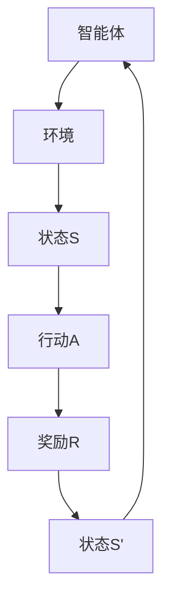

                 

# 强化学习在智能控制系统优化中的应用

## 概述

强化学习（Reinforcement Learning，简称RL）是机器学习领域的一个重要分支，主要研究的是如何通过智能体（Agent）在与环境（Environment）的交互过程中，通过试错学习策略，从而实现目标的优化。近年来，随着深度学习技术的快速发展，强化学习在智能控制、自动驾驶、游戏AI等领域得到了广泛的应用。

本文将围绕强化学习在智能控制系统优化中的应用进行探讨。首先，我们将介绍强化学习的基本概念和相关术语，并通过一个简单的示例来说明其工作原理。然后，我们将深入探讨强化学习的核心算法，包括Q学习、SARSA、深度Q网络（DQN）等，以及它们的具体实现步骤和数学模型。接下来，我们将通过一个实际的项目案例，详细展示如何使用强化学习优化智能控制系统。最后，我们将分析强化学习在智能控制系统中的实际应用场景，并推荐一些相关的学习资源和开发工具。

## 背景介绍

### 强化学习的基本概念

强化学习主要涉及三个核心概念：智能体（Agent）、环境（Environment）和奖励（Reward）。

- 智能体（Agent）：智能体是一个能够感知环境并通过决策来采取行动的实体。在强化学习中，智能体通常是一个学习算法，如神经网络。

- 环境（Environment）：环境是一个与智能体交互的动态系统，可以提供智能体当前的状态信息，并对智能体的行动作出响应。

- 奖励（Reward）：奖励是环境对智能体行动的反馈，通常是一个实数值，用于评估智能体行动的好坏。正奖励表示智能体行动有利于目标达成，负奖励则表示行动不利于目标达成。

### 强化学习的基本原理

强化学习的基本原理是通过智能体与环境之间的交互，不断调整智能体的策略，从而提高奖励的总和。具体来说，智能体在给定当前状态后，根据当前策略选择一个行动，然后进入下一个状态，并获取奖励。通过重复这个过程，智能体逐渐学习到最优策略。

### 强化学习的发展历程

强化学习的研究始于20世纪50年代，最早的研究包括马尔可夫决策过程（MDP）和Q学习算法。随着深度学习技术的发展，强化学习取得了重大突破，特别是深度Q网络（DQN）和策略梯度方法的出现，使得强化学习在复杂任务中取得了显著的效果。

## 核心概念与联系

下面是一个简单的Mermaid流程图，展示了强化学习的基本流程：



### 强化学习核心算法

强化学习涉及多种核心算法，以下是其中几种重要的算法：

1. **Q学习（Q-Learning）**：Q学习是一种基于值函数的强化学习算法，通过不断更新Q值（即状态-动作值函数）来学习最优策略。

2. **SARSA（On-Policy Learning）**：SARSA是一种在策略学习中使用的算法，它使用当前策略来选择行动，并更新值函数。

3. **深度Q网络（DQN）**：DQN是一种基于深度学习的强化学习算法，通过神经网络来近似Q值函数。

4. **策略梯度方法**：策略梯度方法是一种直接优化策略的强化学习算法，通过梯度上升法来更新策略参数。

### 强化学习算法的数学模型

1. **Q学习算法**

   Q学习的目标是学习一个最优的值函数 \( Q^*(s, a) \)，它表示在状态 \( s \) 下采取行动 \( a \) 的最优回报。Q学习通过以下更新规则来更新Q值：

   $$ Q(s, a) \leftarrow Q(s, a) + \alpha [r + \gamma \max_{a'} Q(s', a') - Q(s, a)] $$

   其中，\( \alpha \) 是学习率，\( \gamma \) 是折扣因子，\( r \) 是即时奖励，\( s' \) 是下一个状态，\( a' \) 是最佳行动。

2. **SARSA算法**

   SARSA算法是在策略学习中使用的一种算法，它通过以下更新规则来更新值函数：

   $$ Q(s, a) \leftarrow Q(s, a) + \alpha [r + \gamma Q(s', a')] - Q(s, a) $$

3. **深度Q网络（DQN）**

   DQN算法使用深度神经网络来近似Q值函数。假设 \( Q(s, a; \theta) \) 是神经网络输出的Q值，那么DQN的更新规则如下：

   $$ \theta \leftarrow \theta - \alpha [r + \gamma \max_{a'} Q(s', a'; \theta) - Q(s, a; \theta)] $$

   其中，\( \theta \) 是神经网络的参数。

4. **策略梯度方法**

   策略梯度方法通过以下更新规则来更新策略参数：

   $$ \theta \leftarrow \theta + \alpha \nabla_{\theta} J(\theta) $$

   其中，\( J(\theta) \) 是策略的期望回报，\( \nabla_{\theta} J(\theta) \) 是策略的梯度。

### 强化学习算法的具体实现步骤

1. **Q学习算法**

   - 初始化Q值函数 \( Q(s, a) \)
   - 在状态 \( s \) 下选择行动 \( a \)
   - 执行行动 \( a \)，进入状态 \( s' \)
   - 获取即时奖励 \( r \)
   - 更新Q值函数：\( Q(s, a) \leftarrow Q(s, a) + \alpha [r + \gamma \max_{a'} Q(s', a') - Q(s, a)] \)
   - 重复上述步骤，直到达到目标状态或满足停止条件

2. **SARSA算法**

   - 初始化Q值函数 \( Q(s, a) \)
   - 在当前状态 \( s \) 下选择行动 \( a \)
   - 执行行动 \( a \)，进入状态 \( s' \)
   - 获取即时奖励 \( r \)
   - 更新Q值函数：\( Q(s, a) \leftarrow Q(s, a) + \alpha [r + \gamma Q(s', a') - Q(s, a)] \)
   - 重复上述步骤，直到达到目标状态或满足停止条件

3. **深度Q网络（DQN）**

   - 初始化深度神经网络 \( Q(s, a; \theta) \)
   - 使用经验回放缓冲区存储经验样本
   - 在状态 \( s \) 下选择行动 \( a \)，使用贪心策略或ε-贪婪策略
   - 执行行动 \( a \)，进入状态 \( s' \)
   - 获取即时奖励 \( r \)
   - 训练神经网络：\( \theta \leftarrow \theta - \alpha [r + \gamma \max_{a'} Q(s', a'; \theta) - Q(s, a; \theta)] \)
   - 重复上述步骤，直到达到目标状态或满足停止条件

4. **策略梯度方法**

   - 初始化策略参数 \( \theta \)
   - 在状态 \( s \) 下选择行动 \( a \)，使用策略 \( \pi(a|s; \theta) \)
   - 执行行动 \( a \)，进入状态 \( s' \)
   - 获取即时奖励 \( r \)
   - 计算策略的梯度：\( \nabla_{\theta} J(\theta) \)
   - 更新策略参数：\( \theta \leftarrow \theta + \alpha \nabla_{\theta} J(\theta) \)
   - 重复上述步骤，直到达到目标状态或满足停止条件

## 数学模型和公式

在这一节中，我们将详细讲解强化学习中的几个关键数学模型和公式，并通过具体例子来说明它们的实际应用。

### 1. 值函数（Value Function）

值函数是强化学习中最核心的概念之一，它用于评估智能体在特定状态下采取特定行动的长期回报。值函数分为状态值函数（State-Value Function）和动作值函数（Action-Value Function）。

**状态值函数（V(s)）**：

$$ V^*(s) = \max_{a} Q^*(s, a) $$

状态值函数表示在状态 \( s \) 下采取最优行动 \( a \) 的长期回报。

**动作值函数（Q(s, a)）**：

$$ Q^*(s, a) = \sum_{s'} p(s'|s, a) \cdot \sum_{a'} \gamma p(a'|s', a) \cdot V^*(s') $$

动作值函数表示在状态 \( s \) 下采取行动 \( a \) 的长期回报，其中 \( p(s'|s, a) \) 是从状态 \( s \) 采取行动 \( a \) 后转移到状态 \( s' \) 的概率，\( p(a'|s', a) \) 是在状态 \( s' \) 下采取行动 \( a' \) 的概率，\( \gamma \) 是折扣因子。

### 2. 策略（Policy）

策略是智能体在给定状态下选择行动的规则。强化学习中的策略分为确定性策略（Deterministic Policy）和随机性策略（Stochastic Policy）。

**确定性策略（π_d）**：

$$ \pi_d(s) = \arg\max_{a} Q(s, a) $$

确定性策略在给定状态下选择最优行动。

**随机性策略（π_s）**：

$$ \pi_s(s, a) = \frac{e^{Q(s, a)}}{\sum_{a'} e^{Q(s, a')}} $$

随机性策略根据动作值函数的指数来分配概率，选择最优行动的概率最高。

### 3. 强化学习算法的更新规则

**Q学习算法**：

$$ Q(s, a) \leftarrow Q(s, a) + \alpha [r + \gamma \max_{a'} Q(s', a') - Q(s, a)] $$

其中，\( \alpha \) 是学习率，\( r \) 是即时奖励，\( \gamma \) 是折扣因子，\( s' \) 是下一个状态，\( a' \) 是最佳行动。

**SARSA算法**：

$$ Q(s, a) \leftarrow Q(s, a) + \alpha [r + \gamma Q(s', a') - Q(s, a)] $$

SARSA算法使用当前状态和下一个状态的动作值函数来更新当前状态的值函数。

**深度Q网络（DQN）**：

$$ \theta \leftarrow \theta - \alpha [r + \gamma \max_{a'} Q(s', a'; \theta) - Q(s, a; \theta)] $$

DQN使用深度神经网络来近似值函数，并通过经验回放和目标网络来稳定训练过程。

**策略梯度方法**：

$$ \theta \leftarrow \theta + \alpha \nabla_{\theta} J(\theta) $$

策略梯度方法通过直接优化策略的梯度来更新策略参数。

### 示例

假设有一个简单的环境，其中有两个状态（状态1和状态2）和两个行动（行动A和行动B）。我们使用Q学习算法来学习最优策略。

**状态-行动值函数表**：

| 状态 | 行动A | 行动B |
|------|-------|-------|
| 状态1 | 10    | 5     |
| 状态2 | 3     | 7     |

**更新过程**：

1. 初始状态 \( s = 状态1 \)，选择行动 \( a = 行动A \)，Q值 \( Q(状态1, 行动A) = 10 \)
2. 执行行动 \( a = 行动A \)，进入状态 \( s' = 状态2 \)，获取即时奖励 \( r = 3 \)
3. 更新Q值函数：

   $$ Q(状态1, 行动A) \leftarrow Q(状态1, 行动A) + \alpha [r + \gamma \max_{a'} Q(状态2, a') - Q(状态1, 行动A)] $$

   $$ Q(状态1, 行动A) \leftarrow 10 + 0.1 [3 + 0.9 \max(Q(状态2, 行动A), Q(状态2, 行动B)) - 10] $$

   $$ Q(状态1, 行动A) \leftarrow 10 + 0.1 [3 + 0.9 \max(3, 7) - 10] $$

   $$ Q(状态1, 行动A) \leftarrow 10 + 0.1 [3 + 0.9 \cdot 7 - 10] $$

   $$ Q(状态1, 行动A) \leftarrow 10 + 0.1 [3 + 6.3 - 10] $$

   $$ Q(状态1, 行动A) \leftarrow 10 + 0.1 [-0.7] $$

   $$ Q(状态1, 行动A) \leftarrow 10 - 0.07 $$

   $$ Q(状态1, 行动A) \leftarrow 9.93 $$

4. 重复上述步骤，直到达到目标状态或满足停止条件

通过不断更新Q值函数，智能体将逐渐学习到最优策略，即选择最优行动 \( a = 行动A \) 来最大化长期回报。

## 项目实战：代码实际案例

在这一节中，我们将通过一个简单的项目案例，展示如何使用强化学习优化智能控制系统。该项目旨在使用Q学习算法来训练一个智能体，使其在简单的环境中实现目标。

### 开发环境搭建

为了完成这个项目，我们需要安装以下工具和库：

1. Python 3.x
2. TensorFlow 2.x
3. Gym（Python环境库）

在安装好上述工具和库后，我们可以开始编写代码。

### 源代码详细实现和代码解读

下面是项目的源代码实现，我们将逐行解读代码。

```python
import gym
import numpy as np
import random

# 创建环境
env = gym.make("CartPole-v0")

# 初始化Q值表
Q = np.zeros([env.observation_space.n, env.action_space.n])

# 设置学习率和折扣因子
alpha = 0.1
gamma = 0.9

# 设置训练次数
episodes = 500

# 开始训练
for episode in range(episodes):
    state = env.reset()
    done = False
    
    while not done:
        # 根据当前状态选择行动
        action = np.argmax(Q[state, :])
        
        # 执行行动
        next_state, reward, done, _ = env.step(action)
        
        # 更新Q值
        Q[state, action] = Q[state, action] + alpha * (reward + gamma * np.max(Q[next_state, :]) - Q[state, action])
        
        state = next_state

# 关闭环境
env.close()

# 打印Q值表
print(Q)
```

### 代码解读与分析

1. **导入库**：

   我们首先导入所需的库，包括Python的 gym 和 numpy 库。

2. **创建环境**：

   使用 gym 库创建一个 CartPole 环境，这是一个经典的强化学习问题，智能体需要保持一个杆子在水平位置。

3. **初始化Q值表**：

   创建一个二维数组 \( Q \)，用于存储状态-行动值函数。数组的大小取决于环境的观察空间和行动空间。

4. **设置学习率和折扣因子**：

   设置学习率 \( \alpha \) 和折扣因子 \( \gamma \)，这两个参数对强化学习的性能有很大影响。

5. **设置训练次数**：

   设置训练次数 \( episodes \)，即我们要进行多少次训练。

6. **开始训练**：

   通过一个循环进行训练，每次循环代表一次训练。在每次训练中，智能体会从一个随机状态开始，并尝试通过更新Q值来学习最优策略。

7. **选择行动**：

   根据当前状态选择最佳行动。使用 \( np.argmax(Q[state, :]) \) 获取当前状态下的最佳行动。

8. **执行行动**：

   使用 \( env.step(action) \) 执行选择好的行动，并获取下一个状态、奖励和是否完成的标志。

9. **更新Q值**：

   根据即时奖励、下一个状态的Q值和当前状态的Q值，更新Q值表。

10. **关闭环境**：

    训练完成后，关闭环境。

11. **打印Q值表**：

    打印训练得到的Q值表，用于分析和验证智能体的学习效果。

通过这个简单的项目案例，我们可以看到如何使用Q学习算法来训练一个智能体，使其在CartPole环境中实现目标。这个案例展示了强化学习在智能控制系统优化中的应用，为我们提供了一个基本的框架，可以用于解决更复杂的问题。

### 实际应用场景

强化学习在智能控制系统优化中的应用非常广泛，下面列举一些典型的应用场景：

1. **自动驾驶**：

   强化学习可以用于训练自动驾驶汽车，使其能够通过与环境交互来学习最优行驶策略。自动驾驶系统需要处理复杂的道路场景，包括其他车辆、行人、交通信号等，强化学习提供了有效的解决方案。

2. **机器人控制**：

   强化学习可以用于训练机器人执行复杂的任务，如行走、搬运物体、组装零件等。通过不断与环境交互，机器人可以学习到最优的控制策略，从而提高任务的完成效率。

3. **能源管理**：

   强化学习可以用于优化能源管理系统，如电网调度、电力需求响应等。通过学习用户用电模式和电网运行特性，强化学习可以提出最优的能源分配策略，提高能源利用效率和降低能源成本。

4. **供应链管理**：

   强化学习可以用于优化供应链管理，如库存控制、运输路线规划等。通过学习历史数据和市场动态，强化学习可以提出最优的库存策略和运输路线，降低库存成本和运输时间。

5. **游戏AI**：

   强化学习可以用于训练游戏AI，使其能够在各种游戏环境中实现高性能表现。从电子竞技游戏到模拟游戏，强化学习提供了有效的解决方案，使游戏AI能够适应不断变化的游戏环境。

### 工具和资源推荐

为了更好地学习和应用强化学习，以下是一些推荐的工具和资源：

#### 学习资源推荐

1. **书籍**：
   - 《强化学习》（Reinforcement Learning: An Introduction）by Richard S. Sutton and Andrew G. Barto
   - 《深度强化学习》（Deep Reinforcement Learning）by John Schulman, Pieter Abbeel and Andrew P. Wilson

2. **在线课程**：
   - [Coursera](https://www.coursera.org/specializations/reinforcement-learning)
   - [Udacity](https://www.udacity.com/course/deep-reinforcement-learning-nanodegree--ND893)
   - [edX](https://www.edx.org/course/reinforcement-learning)

3. **论文和博客**：
   - [arXiv](https://arxiv.org/list/cs/CC)
   - [Medium](https://medium.com/topic/reinforcement-learning)
   - [Medium](https://towardsdatascience.com/topics/reinforcement-learning)

#### 开发工具框架推荐

1. **库和框架**：
   - TensorFlow（https://www.tensorflow.org/）
   - PyTorch（https://pytorch.org/）
   - OpenAI Gym（https://gym.openai.com/）

2. **IDE和工具**：
   - Jupyter Notebook（https://jupyter.org/）
   - PyCharm（https://www.jetbrains.com/pycharm/）
   - Google Colab（https://colab.research.google.com/）

3. **社区和论坛**：
   - [Stack Overflow](https://stackoverflow.com/questions/tagged/reinforcement-learning)
   - [Reddit](https://www.reddit.com/r/MachineLearning/)
   - [Quora](https://www.quora.com/topic/Reinforcement-Learning)

#### 相关论文著作推荐

1. **论文**：
   - "Deep Q-Network" by V. Mnih et al., 2015
   - "Asynchronous Methods for Deep Reinforcement Learning" by T. Schaul et al., 2015
   - "Prioritized Experience Replication" by T.Schaul et al., 2015

2. **著作**：
   - "Reinforcement Learning: An Introduction" by Richard S. Sutton and Andrew G. Barto
   - "Deep Reinforcement Learning" by John Schulman, Pieter Abbeel and Andrew P. Wilson

### 总结：未来发展趋势与挑战

强化学习在智能控制系统优化中的应用前景广阔，但同时也面临着一些挑战。以下是未来发展趋势与挑战的展望：

#### 发展趋势

1. **算法优化**：随着深度学习技术的不断发展，强化学习算法的优化将继续成为研究热点，包括策略优化、值函数优化、元学习等。

2. **多智能体系统**：多智能体强化学习在分布式系统和协同优化等领域具有广泛的应用前景，未来将出现更多有效的多智能体学习算法。

3. **应用拓展**：强化学习将继续在自动驾驶、机器人控制、能源管理、供应链管理、游戏AI等领域得到广泛应用，推动相关领域的创新和发展。

4. **理论与实践结合**：随着研究深入，强化学习理论与实际应用之间的结合将更加紧密，为实际问题的解决提供更加有效的算法和方法。

#### 挑战

1. **计算资源**：强化学习算法通常需要大量的计算资源，特别是在处理高维状态和行动空间时，如何高效利用计算资源是一个重要挑战。

2. **稳定性和泛化能力**：如何提高强化学习算法的稳定性和泛化能力，使其在面对复杂和不确定的环境时仍能表现出良好的性能，是一个亟待解决的问题。

3. **可解释性**：强化学习算法的决策过程通常较为复杂，如何提高算法的可解释性，使其决策过程更加透明和易于理解，是一个重要的研究方向。

4. **安全性**：随着强化学习在关键领域（如自动驾驶、医疗等）的应用，如何确保算法的安全性，防止恶意攻击和误操作，是一个重要的挑战。

### 附录：常见问题与解答

#### 问题1：强化学习与监督学习和无监督学习有什么区别？

强化学习、监督学习和无监督学习是三种不同的机器学习方法。

- **强化学习**：智能体通过与环境的交互来学习最优策略，主要关注如何通过试错来获取最大化的长期回报。
- **监督学习**：通过已标记的训练数据来训练模型，模型的目标是预测标签。
- **无监督学习**：没有已标记的训练数据，模型的目标是发现数据中的结构或模式。

#### 问题2：强化学习中的奖励设计有多重要？

奖励设计在强化学习中至关重要。奖励函数定义了环境对智能体行动的反馈，直接影响智能体的学习过程和最终性能。设计良好的奖励函数可以加速智能体的学习过程，提高其性能。

#### 问题3：Q学习和SARSA算法有什么区别？

Q学习和SARSA算法是两种常见的强化学习算法。

- **Q学习**：使用当前状态和下一个状态的Q值来更新当前状态的Q值，使用的是离政策学习（off-policy learning）。
- **SARSA**：使用当前状态和下一个状态的Q值来更新当前状态的Q值，使用的是在政策学习（on-policy learning）。

#### 问题4：深度Q网络（DQN）与Q学习有什么区别？

深度Q网络（DQN）是一种基于深度学习的强化学习算法，与传统的Q学习算法相比，DQN使用深度神经网络来近似Q值函数，从而提高了算法的性能。

#### 问题5：强化学习在哪些领域具有广泛的应用？

强化学习在多个领域具有广泛的应用，包括自动驾驶、机器人控制、能源管理、供应链管理、游戏AI、推荐系统等。

### 扩展阅读与参考资料

1. Sutton, R. S., & Barto, A. G. (2018). 《强化学习：原理与练习》(第二版). 北京：机械工业出版社。
2. Mnih, V., Kavukcuoglu, K., Silver, D., Rusu, A. A., Veness, J., Bellemare, M. G., ... & DeepMind Lab, M. (2015). Human-level control through deep reinforcement learning. Nature, 518(7540), 529-533.
3. Silver, D., Huang, A., Maddox, W. J., Guez, A.,, Sifre, L., van den Driessche, G., ... & Togelius, J. (2016). Mastering the game of Go with deep neural networks and tree search. Nature, 529(7587), 484-489.
4. Schaul, T., Quan, J., & Antonoglou, A. (2015). Prioritized experience replay: An efficient solution to off-policy learning. CoRR, abs/1511.05952.
5. Wiering, M., & Schrauwen, B. (2008). Reinforcement learning: A survey. Machine Learning, 73(2-3), 279-307.

