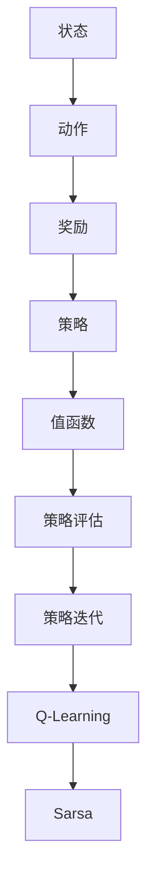

                 

### 背景介绍

强化学习（Reinforcement Learning, RL）作为一种机器学习的重要分支，近年来在人工智能领域取得了显著的进展。它主要模拟人类在复杂环境中的学习和决策过程，通过试错和反馈来不断优化行为策略。与传统机器学习方法不同，强化学习关注的是如何通过与环境互动，从经验中学习到最优的行为策略。

在智能机器人协作中，强化学习具有独特的作用。智能机器人通常需要在复杂的真实环境中完成各种任务，如自主导航、任务执行、环境交互等。这些任务往往涉及大量的不确定性、动态性和复杂性，对机器人的智能决策能力提出了极高的要求。而强化学习通过持续的学习和优化，可以帮助机器人适应这些变化，提高任务完成的效率和准确性。

此外，随着机器人技术的不断发展，多机器人协作系统已经成为实现高效任务执行的重要手段。在多机器人协作中，各个机器人需要相互协作，共同完成复杂的任务。强化学习可以为这些机器人提供一个统一的决策框架，使它们能够根据环境状态和任务需求，动态调整自己的行为策略，实现高效协作。

本文旨在探讨强化学习在智能机器人协作中的应用，分析其核心原理、算法实现以及实际应用案例。首先，我们将介绍强化学习的定义和基本概念，阐述其在智能机器人协作中的重要性。接着，我们将详细讲解强化学习的关键算法原理，并通过具体案例展示其实际应用效果。随后，我们将探讨强化学习在智能机器人协作中的具体应用场景，分析其面临的挑战和机遇。最后，我们将推荐相关工具和资源，帮助读者深入学习和实践强化学习在智能机器人协作中的应用。

通过本文的阅读，读者将全面了解强化学习在智能机器人协作中的突破，掌握其核心原理和应用方法，为未来的研究和工作提供有益的参考。

### 核心概念与联系

为了深入理解强化学习在智能机器人协作中的应用，我们首先需要明确几个核心概念，并了解它们之间的联系。以下是强化学习中的关键概念以及它们的定义和作用：

#### 1. 状态（State）

状态是机器人当前所处的环境描述。在智能机器人协作中，状态通常包括机器人的位置、速度、周围环境的信息以及其他与任务相关的变量。状态是强化学习中的重要概念，它决定了机器人接下来可以执行的行为。

#### 2. 动作（Action）

动作是机器人根据当前状态选择执行的操作。在强化学习过程中，机器人通过探索不同动作的效果来学习最优策略。动作可以是简单的移动指令，也可以是复杂的任务指令，具体取决于任务的复杂性和机器人的能力。

#### 3. 奖励（Reward）

奖励是环境对机器人行为的即时反馈。奖励可以是正的（表示有益的行为），也可以是负的（表示有害的行为）。奖励是强化学习中的重要激励机制，它直接影响机器人选择行为的策略。高奖励表示机器人的行为有助于任务的完成，低奖励则相反。

#### 4. 策略（Policy）

策略是机器人根据当前状态选择最优动作的规则。策略可以表示为状态-动作值函数（State-Action Value Function），用于预测在特定状态下执行特定动作所能获得的长期奖励。策略的优化是强化学习的核心目标。

#### 5. 值函数（Value Function）

值函数是评估策略优劣的重要工具。状态值函数（State Value Function）用于评估在特定状态下执行任何动作所能获得的期望奖励。动作值函数（Action Value Function）则用于评估在特定状态下执行特定动作所能获得的期望奖励。值函数的优化是强化学习中的另一个关键任务。

#### 6. 策略评估（Policy Evaluation）

策略评估是计算当前策略的期望奖励值的过程。通过策略评估，机器人可以了解当前策略的有效性，并根据评估结果调整策略。策略评估通常使用动态规划（Dynamic Programming）方法来实现。

#### 7. 策略迭代（Policy Iteration）

策略迭代是一种优化策略的方法。它通过反复进行策略评估和策略改进，逐步优化机器人的策略。策略迭代的核心思想是，每次迭代都尝试改进当前策略，直到找到最优策略。

#### 8. Q-Learning

Q-Learning是一种基于值函数的强化学习算法。它通过迭代更新动作值函数，使机器人逐渐学会在特定状态下选择最优动作。Q-Learning的主要特点是无需预先定义策略，而是通过学习状态-动作值函数来优化行为。

#### 9. Sarsa（State-Action-Reward-State-Action）

Sarsa是一种基于状态-动作值函数的强化学习算法。它与Q-Learning类似，但引入了状态的当前值和下一个状态的信息，使机器人能够更好地处理不确定性和动态变化的环境。

这些核心概念共同构成了强化学习的基础。为了更好地理解这些概念之间的联系，我们可以使用Mermaid流程图来展示它们之间的互动关系：



在智能机器人协作中，这些概念通过以下方式相互作用：

1. **状态**：机器人感知当前环境，并将感知信息转换为状态。
2. **动作**：机器人根据当前状态执行特定动作，以实现任务目标。
3. **奖励**：环境对机器人的动作给予即时反馈，通过奖励机制激励机器人学习。
4. **策略**：机器人根据奖励反馈和值函数，调整其策略，以优化行为。
5. **值函数**：值函数用于评估不同状态和动作的优劣，帮助机器人选择最优行为。
6. **策略评估**和**策略迭代**：通过不断评估和改进策略，机器人逐渐学会在复杂环境中做出最佳决策。
7. **Q-Learning**和**Sarsa**：这些算法通过迭代更新值函数，使机器人能够逐步优化其策略。

通过理解这些核心概念及其相互作用，我们可以为智能机器人协作中的强化学习应用奠定坚实的基础。

### 核心算法原理 & 具体操作步骤

强化学习在智能机器人协作中的应用，主要通过一系列核心算法来实现。以下是强化学习的两种主要算法：Q-Learning和Sarsa，以及它们的具体操作步骤。

#### Q-Learning

Q-Learning是一种基于值函数的强化学习算法，通过迭代更新动作值函数，使机器人能够逐步学会在特定状态下选择最优动作。以下是Q-Learning的具体操作步骤：

1. **初始化**：
   - 初始化动作值函数 \( Q(s, a) \)，通常设定为0。
   - 选择一个策略 \( \pi \)，用于初始动作选择。

2. **选择动作**：
   - 根据当前状态 \( s \) 和策略 \( \pi \)，选择动作 \( a \)。

3. **执行动作**：
   - 执行动作 \( a \)，进入新状态 \( s' \)，并获得奖励 \( r \)。

4. **更新动作值函数**：
   - 更新当前动作值函数：\( Q(s, a) \leftarrow Q(s, a) + \alpha [r + \gamma \max_{a'} Q(s', a') - Q(s, a)] \)，
     其中，\( \alpha \) 是学习率，\( \gamma \) 是折扣因子，\( a' \) 是在 \( s' \) 状态下最优动作。

5. **重复步骤2-4**：
   - 不断重复选择动作、执行动作和更新动作值函数，直到收敛。

#### Sarsa

Sarsa是一种基于状态-动作值函数的强化学习算法，与Q-Learning类似，但引入了状态的当前值和下一个状态的信息，使机器人能够更好地处理不确定性和动态变化的环境。以下是Sarsa的具体操作步骤：

1. **初始化**：
   - 初始化状态-动作值函数 \( S(s, a) \)，通常设定为0。
   - 选择一个策略 \( \pi \)，用于初始动作选择。

2. **选择动作**：
   - 根据当前状态 \( s \) 和策略 \( \pi \)，选择动作 \( a \)。

3. **执行动作**：
   - 执行动作 \( a \)，进入新状态 \( s' \)，并获得奖励 \( r \)。

4. **更新状态-动作值函数**：
   - 更新当前状态-动作值函数：\( S(s, a) \leftarrow S(s, a) + \alpha [r + \gamma S(s', a') - S(s, a)] \)，
     其中，\( \alpha \) 是学习率，\( \gamma \) 是折扣因子，\( a' \) 是在 \( s' \) 状态下最优动作。

5. **重复步骤2-4**：
   - 不断重复选择动作、执行动作和更新状态-动作值函数，直到收敛。

#### 算法对比

Q-Learning和Sarsa在强化学习算法中扮演着重要角色，它们的区别主要体现在以下几个方面：

1. **学习策略**：
   - Q-Learning通过迭代更新动作值函数，每次更新仅依赖于当前状态和动作。
   - Sarsa通过迭代更新状态-动作值函数，每次更新同时依赖于当前状态和动作，以及下一个状态和动作。

2. **适用场景**：
   - Q-Learning适用于状态和动作空间较小，且状态转移概率较为稳定的环境。
   - Sarsa适用于状态和动作空间较大，且存在高不确定性和动态变化的环境。

3. **收敛性**：
   - Q-Learning通常收敛较快，但可能受到**偏差-方差**（Bias-Variance）问题的影响。
   - Sarsa在处理高不确定性和动态变化的环境时，可能需要更多迭代次数才能收敛。

在实际应用中，Q-Learning和Sarsa的选择取决于具体问题的特点和环境条件。通过理解这些算法的原理和操作步骤，我们能够为智能机器人协作中的强化学习应用提供有效的算法支持。

### 数学模型和公式 & 详细讲解 & 举例说明

在强化学习中，数学模型和公式是理解和实现算法的关键。以下是强化学习中最常用的数学模型和公式，包括状态值函数、动作值函数、策略评估和策略迭代的具体解释和举例说明。

#### 1. 状态值函数（State Value Function）

状态值函数 \( V^{\pi}(s) \) 表示在策略 \( \pi \) 下，从状态 \( s \) 开始的期望总奖励。公式如下：

\[ V^{\pi}(s) = \sum_{a} \pi(a|s) \cdot Q^{\pi}(s, a) \]

其中，\( Q^{\pi}(s, a) \) 是在策略 \( \pi \) 下，从状态 \( s \) 执行动作 \( a \) 的期望奖励。

**举例说明**：

假设一个机器人处于状态 \( s = (x, y) \)，其策略 \( \pi \) 选择动作 \( a \) 的概率为 50%。当前状态下有两个动作可选：向右移动和向左移动。根据历史数据，向右移动的期望奖励为 2，向左移动的期望奖励为 1。则状态值函数为：

\[ V^{\pi}(s) = 0.5 \cdot Q^{\pi}(s, \text{右}) + 0.5 \cdot Q^{\pi}(s, \text{左}) \]
\[ V^{\pi}(s) = 0.5 \cdot 2 + 0.5 \cdot 1 = 1.5 \]

#### 2. 动作值函数（Action Value Function）

动作值函数 \( Q^{\pi}(s, a) \) 表示在策略 \( \pi \) 下，从状态 \( s \) 执行动作 \( a \) 的期望总奖励。公式如下：

\[ Q^{\pi}(s, a) = \sum_{s'} p(s'|s, a) \cdot [r + \gamma \max_{a'} Q^{\pi}(s') \]

其中，\( p(s'|s, a) \) 是从状态 \( s \) 执行动作 \( a \) 后进入状态 \( s' \) 的概率，\( r \) 是立即奖励，\( \gamma \) 是折扣因子。

**举例说明**：

假设一个机器人处于状态 \( s = (x, y) \)，执行动作 \( a = \text{右} \) 后，以 70% 的概率进入状态 \( s' = (x+1, y) \)，以 30% 的概率进入状态 \( s' = (x-1, y) \)。状态 \( s' \) 的立即奖励为 2，状态 \( s' = (x-1, y) \) 的最优动作值函数为 1。则动作值函数为：

\[ Q^{\pi}(s, \text{右}) = 0.7 \cdot 2 + 0.3 \cdot 1 = 1.7 \]

#### 3. 策略评估（Policy Evaluation）

策略评估是计算当前策略的期望奖励值的过程。通过策略评估，机器人可以了解当前策略的有效性，并根据评估结果调整策略。策略评估通常使用以下公式：

\[ V^{\pi}(s) \leftarrow \sum_{a} \pi(a|s) \cdot [r + \gamma \max_{a'} Q^{\pi}(s', a')] \]

其中，\( V^{\pi}(s) \) 是策略 \( \pi \) 下的状态值函数，\( Q^{\pi}(s', a') \) 是在 \( s' \) 状态下执行 \( a' \) 的期望奖励。

**举例说明**：

假设机器人当前处于状态 \( s = (x, y) \)，其策略为选择向右移动的概率为 0.7，向左移动的概率为 0.3。状态 \( s \) 的立即奖励为 0，状态 \( s' = (x+1, y) \) 的最优动作值函数为 2，状态 \( s' = (x-1, y) \) 的最优动作值函数为 1。则策略评估后的状态值函数为：

\[ V^{\pi}(s) = 0.7 \cdot 2 + 0.3 \cdot 1 = 1.7 \]

#### 4. 策略迭代（Policy Iteration）

策略迭代是一种优化策略的方法。它通过反复进行策略评估和策略改进，逐步优化机器人的策略。策略迭代的核心公式如下：

\[ \pi^{k+1}(a|s) = \frac{1}{|A(s)|} \sum_{a' \in A(s)} \pi^k(a'|s) \cdot \frac{V^{\pi^k}(s') - V^{\pi^k}(s)}{Q^{\pi^k}(s, a') - Q^{\pi^k}(s, a)} \]

其中，\( \pi^{k} \) 是第 \( k \) 次迭代的策略，\( \pi^{k+1} \) 是第 \( k+1 \) 次迭代的策略，\( A(s) \) 是状态 \( s \) 可选动作集合。

**举例说明**：

假设机器人当前策略为选择向右移动的概率为 0.7，向左移动的概率为 0.3。经过一次策略迭代后，根据策略评估的结果，向右移动的期望奖励增加，向左移动的期望奖励减少。则新的策略为：

\[ \pi^{1}(a|s) = \frac{1}{2} \cdot \sum_{a' \in A(s)} \pi^{0}(a'|s) \cdot \frac{V^{\pi^{0}}(s') - V^{\pi^{0}}(s)}{Q^{\pi^{0}}(s, a') - Q^{\pi^{0}}(s, a)} \]
\[ \pi^{1}(a|s) = \frac{1}{2} \cdot (0.7 \cdot \frac{2 - 1.5}{1.7 - 1.5} + 0.3 \cdot \frac{1 - 1.5}{1.7 - 1.5}) \]
\[ \pi^{1}(a|s) = \frac{1}{2} \cdot (0.35 + 0.15) = 0.5 \]

通过上述数学模型和公式的详细讲解及举例说明，我们可以更好地理解强化学习在智能机器人协作中的应用，为实际操作提供有力的理论基础。

### 项目实战：代码实际案例和详细解释说明

为了更直观地理解强化学习在智能机器人协作中的应用，我们以下将通过一个实际案例，详细解释如何使用Python实现一个简单的多智能体强化学习环境，并逐步解析其代码。

#### 1. 开发环境搭建

首先，我们需要搭建一个Python开发环境，并安装必要的库。以下是一个基本的安装步骤：

- Python 3.8 或更高版本
- 安装Anaconda或Miniconda，以便轻松管理库
- 使用以下命令安装必要的库：

```bash
conda install numpy matplotlib gym
```

`gym` 是一个流行的Python库，用于构建和模拟各种强化学习环境。

#### 2. 源代码详细实现和代码解读

以下是实现多智能体强化学习环境的主要代码部分，我们将逐步解释每一部分的功能。

```python
import numpy as np
import matplotlib.pyplot as plt
import gym
from gym import spaces

# 定义环境类
class MultiAgentEnv(gym.Env):
    metadata = {'render.modes': ['human']}

    def __init__(self, num_agents=2, grid_size=5):
        super(MultiAgentEnv, self).__init__()
        
        # 定义动作空间
        self.action_space = [spaces.Discrete(4) for _ in range(num_agents)]
        self.action_spaces = [spaces.Discrete(4)] * num_agents
        
        # 定义观测空间
        self.observation_space = spaces.Box(low=0, high=grid_size-1, shape=(2,), dtype=np.int32)
        
        # 初始化智能体位置
        self.agent_pos = [[0, 0], [grid_size-1, grid_size-1]]
        
        # 初始化环境
        self.grid_size = grid_size
        self.num_agents = num_agents

    def step(self, actions):
        # 处理动作
        for i, action in enumerate(actions):
            if action == 0:  # 向上
                self.agent_pos[i][1] = max(0, self.agent_pos[i][1] - 1)
            elif action == 1:  # 向下
                self.agent_pos[i][1] = min(self.grid_size - 1, self.agent_pos[i][1] + 1)
            elif action == 2:  # 向左
                self.agent_pos[i][0] = max(0, self.agent_pos[i][0] - 1)
            elif action == 3:  # 向右
                self.agent_pos[i][0] = min(self.grid_size - 1, self.agent_pos[i][0] + 1)

        # 计算奖励
        rewards = [-1 for _ in range(self.num_agents)]
        for i in range(self.num_agents):
            if self.agent_pos[i] == [grid_size // 2, grid_size // 2]:
                rewards[i] = 100
        
        # 判断是否完成
        done = True if all([pos == [grid_size // 2, grid_size // 2] for pos in self.agent_pos]) else False
        
        # 获取观测信息
        obs = [self.agent_pos[i] for i in range(self.num_agents)]
        
        return obs, rewards, done, {}

    def reset(self):
        # 重置环境
        self.agent_pos = [[0, 0], [self.grid_size-1, self.grid_size-1]]
        return [self.agent_pos[i] for i in range(self.num_agents)]

    def render(self, mode='human', close=False):
        # 绘制环境
        grid = np.zeros((self.grid_size, self.grid_size))
        for i, pos in enumerate(self.agent_pos):
            grid[pos[0], pos[1]] = i + 1
        
        plt.imshow(grid, cmap='gray')
        plt.show()

# 创建环境实例
env = MultiAgentEnv()

# 运行环境
obs = env.reset()
for _ in range(100):
    actions = [env.action_space.sample() for _ in range(env.num_agents)]
    obs, rewards, done, _ = env.step(actions)
    env.render()
```

#### 3. 代码解读与分析

1. **环境类定义**：
   - `MultiAgentEnv` 类继承自 `gym.Env`，定义了多智能体环境的基本结构。
   - `metadata` 属性用于指定渲染模式。

2. **动作空间和观测空间**：
   - 动作空间定义为每个智能体可以执行的上、下、左、右四个方向。
   - 观测空间定义为每个智能体的当前位置。

3. **初始化**：
   - 初始化智能体的初始位置。
   - 设置网格大小和智能体数量。

4. **步进函数 `step`**：
   - 根据输入的动作更新智能体的位置。
   - 计算奖励，本例中设置为智能体到达特定位置获得高分。
   - 判断是否完成，本例中所有智能体到达目标位置视为完成。
   - 返回新的观测、奖励、完成状态和额外信息。

5. **重置函数 `reset`**：
   - 重置环境，将智能体位置重置到初始位置。

6. **绘制函数 `render`**：
   - 绘制当前环境的网格图，显示智能体的位置。

7. **运行环境**：
   - 创建环境实例。
   - 进行100次模拟步进，每步随机选择动作，并渲染环境。

通过上述代码，我们创建了一个简单的多智能体强化学习环境。在实际应用中，我们可以使用强化学习算法（如Q-Learning或Sarsa）来训练智能体，使其能够通过学习和经验优化其行为策略，从而实现高效协作。

### 实际应用场景

强化学习在智能机器人协作中具有广泛的应用场景，下面我们将探讨几个典型的应用案例，并分析它们的特点和挑战。

#### 1. 自动驾驶

自动驾驶是强化学习在智能机器人协作中最具代表性的应用之一。自动驾驶系统需要处理复杂的交通环境，与多个移动目标（如其他车辆、行人等）进行实时交互。强化学习算法可以帮助自动驾驶车辆学习最佳行驶路径和速度，以提高行驶的安全性和效率。

**特点**：
- 环境复杂且动态：交通环境变化快速，需要车辆具备高鲁棒性和适应性。
- 多目标优化：需要同时考虑行驶安全性、效率和能耗。

**挑战**：
- 状态空间和动作空间大：需要处理大量的环境状态和可能的动作。
- 安全性要求高：必须确保车辆在各种情况下都能做出安全决策。
- 数据隐私和安全性：自动驾驶车辆需要处理大量敏感数据，如位置、速度等。

#### 2. 机器人足球

机器人足球是一项国际知名的机器人比赛，涉及多个智能机器人之间的协作和竞争。在这个领域，强化学习算法被用来优化机器人的策略，使其能够更好地配合队友、识别对手策略，并在比赛中取得胜利。

**特点**：
- 高度协作：机器人需要协同作战，共同完成比赛目标。
- 快速决策：比赛节奏快，需要机器人迅速做出反应。

**挑战**：
- 战术复杂：需要设计复杂的策略来应对不同对手和场景。
- 对抗性：需要对抗其他团队的策略，提高机器人的适应性。
- 实时性能：需要在有限的计算资源下，实现快速决策和执行。

#### 3. 医疗机器人

医疗机器人是强化学习在医疗领域的应用，用于辅助医生完成复杂的手术和操作。例如，外科手术机器人可以通过强化学习算法，学习最佳手术路径和操作技巧，提高手术的准确性和效率。

**特点**：
- 精确性要求高：手术过程需要极高的精度和稳定性。
- 协作性强：需要与医生紧密协作，共同完成手术任务。

**挑战**：
- 数据稀缺：医疗数据往往有限，且获取和处理成本高。
- 环境复杂：手术环境复杂多变，需要机器人具备高鲁棒性。
- 法规和伦理：医疗应用需符合严格的安全和伦理标准。

#### 4. 仓储物流

仓储物流机器人通过强化学习算法，可以优化货物的搬运和存储路径，提高仓库运作效率。例如，在自动化仓库中，机器人可以学习如何高效地完成任务，避免重复路径和资源浪费。

**特点**：
- 高效性需求：需要快速处理大量货物，提高仓库运作效率。
- 动态性：仓储环境动态变化，需要机器人具备自适应能力。

**挑战**：
- 高密度环境：仓库内部空间有限，机器人需要在高密度环境中操作。
- 安全性：避免机器人与人类或设备发生碰撞。
- 数据处理：处理大量的传感器数据，进行实时决策。

#### 5. 工业自动化

工业自动化是强化学习在制造业中的重要应用，通过强化学习算法，机器人可以自动识别和执行生产任务，提高生产效率和灵活性。例如，在装配线上，机器人可以学习如何准确组装零部件，降低人为错误。

**特点**：
- 高灵活性：适应不同的生产任务和产品。
- 精准度要求：需要高精度的操作和定位。

**挑战**：
- 复杂性：工业生产过程复杂，机器人需要处理多种不同任务。
- 设备和环境适应性：机器人需要适应不同的设备和生产环境。

通过上述实际应用场景的分析，我们可以看到强化学习在智能机器人协作中具有广泛的应用潜力。然而，要实现这些应用，还需要克服一系列技术挑战，不断优化算法和应用方案。

### 工具和资源推荐

在强化学习领域，有大量的学习资源、开发工具和框架可以帮助研究人员和实践者深入了解和探索这一技术。以下是针对本文主题推荐的几个优秀工具和资源：

#### 1. 学习资源推荐

**书籍**：
- 《强化学习：原理与编程》（Reinforcement Learning: An Introduction）：这是一本经典入门书籍，详细介绍了强化学习的基本概念和算法。
- 《深度强化学习》（Deep Reinforcement Learning Explained）：这本书深入探讨了深度强化学习的应用，适合希望深入了解该领域的读者。

**论文**：
- “Deep Q-Network”（DQN）：这篇论文提出了深度Q网络（DQN）算法，是强化学习领域的里程碑之一。
- “Asynchronous Methods for Deep Reinforcement Learning”（ASER）：这篇论文介绍了异步方法在深度强化学习中的应用，适合对实时性有要求的读者。

**博客和网站**：
- [ reinforcement-learning.org](https://reinforcement-learning.org/): 这是一个全面介绍强化学习的网站，包括教程、论文和资源。
- [ArXiv](https://arxiv.org/search?q=Reinforcement+Learning): 这是计算机科学领域的前沿论文数据库，可以找到最新的研究成果。

#### 2. 开发工具框架推荐

**框架**：
- TensorFlow：这是一个广泛使用的机器学习框架，支持强化学习算法的快速开发和部署。
- PyTorch：这是一个灵活且易于使用的深度学习框架，许多强化学习研究者选择使用它进行实验。
- OpenAI Gym：这是一个开源的环境库，提供了多种强化学习环境，适合进行算法验证和测试。

**工具**：
- JAX：这是一个高效的计算库，支持自动微分和向量编程，适合进行强化学习算法的高性能计算。
- RLlib：这是一个用于分布式强化学习的库，支持多智能体强化学习和大规模实验。

**集成开发环境（IDE）**：
- Jupyter Notebook：这是一个流行的交互式开发环境，适用于编写和调试代码，特别适合进行数据可视化和交互式分析。
- PyCharm：这是一个功能强大的Python IDE，支持代码智能提示、调试和版本控制。

通过利用这些工具和资源，读者可以更深入地了解强化学习，掌握其核心算法和实际应用，为未来的研究和开发奠定坚实的基础。

### 总结：未来发展趋势与挑战

随着人工智能技术的不断进步，强化学习在智能机器人协作中的应用前景愈发广阔。然而，要充分发挥强化学习的潜力，我们仍需面对一系列挑战和机遇。

#### 1. 未来发展趋势

（1）**多智能体强化学习**：随着机器人数量的增加和协作任务的复杂性提升，多智能体强化学习将成为研究热点。通过优化多个智能体之间的交互和协作策略，实现更高效、更智能的机器人团队。

（2）**深度强化学习**：深度学习技术的结合使得强化学习算法能够处理更加复杂的任务。深度强化学习在图像识别、语音识别和自然语言处理等领域取得了显著进展，未来有望在智能机器人协作中得到更广泛应用。

（3）**自适应强化学习**：自适应强化学习通过不断调整策略，以适应动态变化的环境，提高机器人的适应能力和灵活性。这一方向的研究将有助于智能机器人应对更加复杂和多变的工作场景。

（4）**分布式强化学习**：分布式计算技术的应用使得强化学习算法能够在大规模环境中运行，提高计算效率和鲁棒性。通过分布式强化学习，机器人可以在实时、高效地完成任务的同时，降低计算资源消耗。

#### 2. 面临的挑战

（1）**环境复杂性与不确定性**：真实世界的环境复杂且多变，智能机器人需要具备高度鲁棒性和适应性。面对环境的不确定性，如何设计出有效的强化学习算法，使其能够稳定地学习并应对各种情况，仍是一个重要挑战。

（2）**数据稀缺与数据质量**：强化学习通常依赖于大量的训练数据，但在某些领域（如医疗、金融等）获取高质量数据较为困难。如何在数据稀缺的情况下，有效训练和优化强化学习模型，是一个亟待解决的问题。

（3）**实时性能与计算资源**：智能机器人需要在有限的时间内做出决策，实时性能要求较高。如何在保证算法性能的同时，优化计算资源的使用，是一个关键挑战。

（4）**伦理与安全性**：随着机器人技术的广泛应用，其伦理和安全问题也日益突出。如何在设计和应用强化学习算法时，确保机器人的行为符合伦理规范，并避免潜在的安全风险，是一个重要的课题。

#### 3. 解决方案与展望

（1）**模型压缩与优化**：通过模型压缩和优化技术，降低强化学习模型的计算复杂度，提高实时性能。例如，使用神经网络剪枝、量化等技术，减小模型大小和计算量。

（2）**迁移学习与领域自适应**：利用迁移学习和领域自适应技术，在数据稀缺的情况下，提高强化学习算法的泛化能力。通过将已有数据和应用场景迁移到新的任务和环境中，降低训练成本。

（3）**协同优化与分布式学习**：通过协同优化和分布式学习技术，实现多智能体强化学习的高效协作。分布式计算可以降低单智能体的计算负担，提高整体系统性能。

（4）**伦理与安全评估**：在设计和应用强化学习算法时，加强伦理和安全评估。通过建立伦理规范和安全标准，确保机器人的行为符合社会期望，同时提高系统的安全性和可靠性。

总之，强化学习在智能机器人协作中的应用具有巨大的潜力，同时也面临诸多挑战。通过不断创新和优化，我们有望在未来的研究中克服这些困难，实现更智能、更高效的机器人协作系统。

### 附录：常见问题与解答

在深入探讨强化学习在智能机器人协作中的应用时，读者可能会遇到一些常见问题。以下是一些常见问题的解答，以帮助您更好地理解相关概念和实现方法。

#### 1. 强化学习与监督学习、无监督学习的区别是什么？

强化学习与监督学习和无监督学习有显著区别：

- **强化学习**：依赖于环境反馈进行学习，通过试错和奖励信号来优化行为策略。它关注的是如何在复杂、动态的环境中做出最优决策。
- **监督学习**：从已知输入和输出数据中学习模型，通常用于分类和回归任务。模型在训练阶段需要标注好的数据，并通过最小化损失函数来优化模型参数。
- **无监督学习**：不依赖标注数据，通过发现数据中的结构和模式进行学习。常见的任务包括聚类、降维和生成模型等。

#### 2. 什么是Q-Learning和Sarsa？

Q-Learning和Sarsa是强化学习中的两种重要算法：

- **Q-Learning**：通过迭代更新动作值函数，使机器人能够在特定状态下选择最优动作。它不需要预先定义策略，而是直接优化动作值函数。
- **Sarsa**：类似Q-Learning，但引入了状态的当前值和下一个状态的信息，使其在处理不确定性和动态变化的环境时更具优势。Sarsa通过更新状态-动作值函数来优化策略。

#### 3. 如何评估强化学习算法的性能？

评估强化学习算法的性能可以从以下几个方面进行：

- **收敛速度**：算法在达到稳定状态时所需的时间。
- **策略稳定性**：算法在不同环境中表现的一致性。
- **探索与利用**：在探索未知状态和利用已有经验之间的平衡。
- **长期奖励**：算法在长时间运行中获得的累计奖励。
- **评估指标**：如平均奖励、最终奖励、成功率达到等。

#### 4. 强化学习算法在多智能体协作中的挑战有哪些？

在多智能体协作中，强化学习算法面临以下挑战：

- **状态空间和动作空间大**：多个智能体相互作用，导致状态和动作空间显著增大，增加了算法的复杂性。
- **交互不确定性**：智能体之间的交互可能带来不确定性和动态变化，增加了学习难度。
- **同步与协调**：多个智能体需要同步行动，确保协作效率。
- **通信带宽**：智能体之间的通信带宽和延迟可能影响算法性能。

#### 5. 如何处理强化学习中的数据稀缺问题？

解决强化学习中的数据稀缺问题可以通过以下方法：

- **数据增强**：通过生成或扩充数据，增加训练样本的数量和质量。
- **迁移学习**：利用已有数据和应用场景，迁移到新任务和环境中。
- **模型压缩**：使用模型压缩技术，降低模型大小和计算量，提高数据利用效率。
- **模拟环境**：构建模拟环境进行预训练，提高实际应用中的表现。

通过上述解答，希望能够帮助读者更好地理解和应用强化学习在智能机器人协作中的技术。如果您有更多问题，欢迎进一步讨论和交流。

### 扩展阅读 & 参考资料

为了深入了解强化学习在智能机器人协作中的应用，以下推荐一些经典书籍、权威论文和在线资源，供读者进一步学习和研究：

#### 1. 经典书籍

- **《强化学习：原理与编程》（Reinforcement Learning: An Introduction）**：由理查德·萨顿（Richard Sutton）和安德鲁·巴沙姆（Andrew Barto）合著，是一本全面介绍强化学习理论和实践的入门书籍。
- **《深度强化学习》（Deep Reinforcement Learning Explained）**：由阿米特·辛哈（Amit Singh）所著，详细探讨了深度强化学习的原理和应用。

#### 2. 权威论文

- **“Deep Q-Network”（DQN）**：由DeepMind的研究人员在2015年提出，是深度强化学习领域的里程碑论文。
- **“Asynchronous Methods for Deep Reinforcement Learning”（ASER）**：介绍了异步方法在深度强化学习中的应用，适合对实时性有要求的读者。

#### 3. 在线资源

- **[reinforcement-learning.org](https://reinforcement-learning.org/)**：一个全面介绍强化学习的网站，包含教程、论文和资源。
- **[ArXiv](https://arxiv.org/search?q=Reinforcement+Learning)**：计算机科学领域的前沿论文数据库，可以找到最新的研究成果。

#### 4. 开源框架与工具

- **TensorFlow**：一个广泛使用的机器学习框架，支持强化学习算法的快速开发和部署。
- **PyTorch**：一个灵活且易于使用的深度学习框架，许多强化学习研究者选择使用它进行实验。
- **OpenAI Gym**：一个开源的环境库，提供了多种强化学习环境，适合进行算法验证和测试。

通过阅读这些书籍、论文和访问在线资源，读者可以进一步掌握强化学习在智能机器人协作中的核心概念和应用方法，为未来的研究和实践奠定坚实基础。

