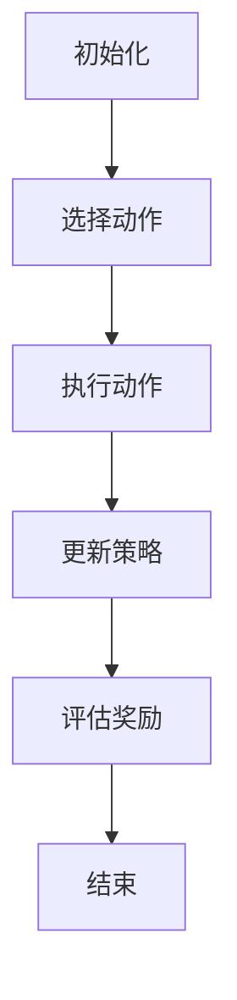

                 

# 强化学习在智能物流调度、运输优化等领域的算法创新与应用

## 摘要

本文将深入探讨强化学习在智能物流调度、运输优化等领域的应用及其算法创新。强化学习作为机器学习的一个重要分支，具有自适应性和实时决策能力，使其在解决复杂动态的物流问题上具有显著优势。本文首先介绍了强化学习的基本概念和核心算法原理，并通过具体的数学模型和公式进行详细讲解。接着，本文将展示实际项目中的代码实现和详细解读，以帮助读者更好地理解强化学习在物流调度和运输优化中的应用。此外，文章还将探讨强化学习在物流领域的实际应用场景，并推荐相关的学习资源和工具框架。最后，本文将总结强化学习在物流领域的发展趋势和挑战，为未来的研究和应用提供方向。

## 1. 背景介绍

随着全球经济的快速发展，物流行业面临着日益增长的运输需求和复杂的供应链网络。智能物流调度和运输优化成为物流行业的热门话题，旨在提高运输效率、降低成本和提升客户满意度。然而，传统的方法在处理复杂动态的物流问题时存在一定的局限性，无法满足日益增长的需求。

强化学习作为机器学习的一个重要分支，具有自适应性和实时决策能力，使其在解决复杂动态的物流问题上具有显著优势。强化学习通过智能体与环境之间的交互，不断调整策略，以最大化累积奖励。这使得强化学习在物流调度和运输优化中具有广泛的应用前景。

智能物流调度涉及多个因素的优化，包括运输路线、运输时间和运输成本等。传统的优化方法通常采用静态的模型，无法应对动态变化和不确定性。而强化学习通过不断学习和调整策略，可以动态地适应环境变化，提高物流调度和运输优化的效果。

运输优化是物流行业的核心问题之一，涉及到运输路线的规划、运输顺序的安排和运输资源的分配。传统的优化方法往往采用启发式算法和数学规划，但这些方法在处理大规模的运输问题时效果有限。强化学习通过学习环境中的最优策略，可以有效地解决运输优化问题，提高运输效率和降低成本。

总之，强化学习在智能物流调度、运输优化等领域的应用具有重要意义。它不仅能够提高物流系统的效率和灵活性，还能够降低物流成本，提升客户满意度。随着技术的不断进步和算法的不断创新，强化学习在物流领域的应用将越来越广泛。

## 2. 核心概念与联系

### 强化学习的定义

强化学习（Reinforcement Learning，RL）是机器学习的一个分支，旨在通过智能体（agent）与环境（environment）之间的交互，学习出最优的策略（policy）以实现目标。与监督学习和无监督学习不同，强化学习没有预先定义好的标签数据或特征提取，而是通过智能体在环境中的行动（action）和观察（observation）来学习。

强化学习的关键要素包括：

1. **智能体（Agent）**：执行动作并从环境中接收反馈的实体。
2. **环境（Environment）**：智能体执行动作并接收反馈的动态系统。
3. **状态（State）**：描述环境当前状态的特征集合。
4. **动作（Action）**：智能体在当前状态下采取的动作。
5. **奖励（Reward）**：对智能体采取动作后的反馈信号，通常用于评估动作的好坏。
6. **策略（Policy）**：智能体在给定状态下采取的动作的概率分布。

### 强化学习的基本概念

强化学习的主要目标是学习一个最优的策略，使智能体在长期内获得最大的累积奖励。这一过程通常包括以下步骤：

1. **初始化**：设定智能体、环境和初始状态。
2. **智能体选择动作**：在给定状态下，根据策略选择一个动作。
3. **执行动作**：智能体在环境中执行所选动作，并观察到环境的响应。
4. **更新策略**：根据接收到的奖励信号，更新策略，以最大化累积奖励。
5. **重复执行**：重复步骤2-4，直到达到预定的目标或停止条件。

### 强化学习的核心算法原理

强化学习的核心算法包括值函数（Value Function）和策略（Policy）。

1. **值函数（Value Function）**：
   - **状态值函数（State-Value Function）**：在给定状态下，智能体执行最优策略时所能获得的累积奖励的期望值。
   - **动作值函数（Action-Value Function）**：在给定状态下，智能体执行特定动作时所能获得的累积奖励的期望值。

2. **策略（Policy）**：
   - **确定性策略（Deterministic Policy）**：在给定状态下，智能体总是选择最优动作。
   - **概率性策略（Stochastic Policy）**：在给定状态下，智能体根据概率分布选择动作。

### 强化学习的架构

强化学习系统通常由以下部分组成：

1. **状态空间（State Space）**：智能体可以观察到的所有状态的集合。
2. **动作空间（Action Space）**：智能体可以采取的所有动作的集合。
3. **策略网络（Policy Network）**：用于生成策略的神经网络。
4. **值函数网络（Value Function Network）**：用于估计状态值函数和动作值函数的神经网络。
5. **奖励函数（Reward Function）**：根据智能体的动作和环境的反馈，计算奖励的函数。
6. **探索策略（Exploration Strategy）**：用于在学习和执行过程中平衡探索（尝试新的动作）和利用（使用已知的最优动作）的策略。

### 强化学习与物流调度的关系

在智能物流调度中，强化学习可以通过以下方式发挥作用：

1. **路径规划**：通过学习最优的路径规划策略，智能体可以在复杂交通网络中找到最短的运输路径，减少运输时间和成本。
2. **车辆调度**：通过学习最优的车辆调度策略，智能体可以合理安排车辆的运输任务，提高运输效率。
3. **库存管理**：通过学习最优的库存管理策略，智能体可以优化库存水平，减少库存成本和缺货风险。

### 强化学习与运输优化的关系

在运输优化中，强化学习可以通过以下方式发挥作用：

1. **运输路线优化**：通过学习最优的运输路线策略，智能体可以优化车辆的运输路线，减少运输距离和时间。
2. **运输顺序优化**：通过学习最优的运输顺序策略，智能体可以合理安排运输任务，提高运输效率。
3. **运输资源分配**：通过学习最优的运输资源分配策略，智能体可以优化车辆的装载和分配，提高运输效率。

### Mermaid 流程图

以下是强化学习在物流调度和运输优化中的 Mermaid 流程图：



在物流调度和运输优化中，强化学习通过不断学习最优策略，优化运输路径、车辆调度和运输资源分配，从而提高物流系统的效率和灵活性。随着技术的不断进步和算法的创新，强化学习在物流领域的应用将越来越广泛。

### 3. 核心算法原理 & 具体操作步骤

#### Q-Learning 算法

Q-Learning 是一种基于值函数的强化学习算法，旨在通过学习状态-动作值函数（Q-值）来选择最优动作。Q-Learning 算法的基本思想是通过不断更新 Q-值，使得智能体在长期内能够选择最优动作，以最大化累积奖励。

#### Q-Learning 算法的基本步骤如下：

1. **初始化 Q-值**：初始时，将所有状态-动作值函数 Q(s, a) 设置为 0。

2. **选择动作**：在给定状态下，根据当前策略选择一个动作。

3. **执行动作**：智能体在环境中执行所选动作，并观察到环境的响应。

4. **更新 Q-值**：根据观察到的奖励和新的状态，更新 Q-值。

   更新公式如下：

   $$Q(s, a) \leftarrow Q(s, a) + \alpha [r + \gamma \max_{a'} Q(s', a') - Q(s, a)]$$

   其中，$\alpha$ 是学习率（learning rate），$r$ 是观察到的即时奖励（immediate reward），$\gamma$ 是折扣因子（discount factor），$s'$ 是新的状态，$a'$ 是在 $s'$ 状态下可能的最大动作。

5. **重复执行**：重复步骤 2-4，直到达到预定的目标或停止条件。

#### Sarsa 算法

Sarsa（State-Action-Reward-State-Action）是一种基于策略的强化学习算法，旨在直接优化策略。Sarsa 算法通过学习状态-动作值函数（Q-值）来选择最优动作，同时考虑了当前动作和下一个动作的 Q-值。

#### Sarsa 算法的基本步骤如下：

1. **初始化 Q-值**：初始时，将所有状态-动作值函数 Q(s, a) 设置为 0。

2. **选择动作**：在给定状态下，根据当前策略选择一个动作。

3. **执行动作**：智能体在环境中执行所选动作，并观察到环境的响应。

4. **更新 Q-值**：根据观察到的奖励和新的状态，更新 Q-值。

   更新公式如下：

   $$Q(s, a) \leftarrow Q(s, a) + \alpha [r + \gamma Q(s', a') - Q(s, a)]$$

   其中，$\alpha$ 是学习率（learning rate），$r$ 是观察到的即时奖励（immediate reward），$\gamma$ 是折扣因子（discount factor），$s'$ 是新的状态，$a'$ 是在 $s'$ 状态下可能的最大动作。

5. **重复执行**：重复步骤 2-4，直到达到预定的目标或停止条件。

#### 策略梯度算法

策略梯度算法（Policy Gradient Algorithm）是一种直接优化策略的强化学习算法，通过梯度的方向来更新策略参数，以最大化累积奖励。

#### 策略梯度算法的基本步骤如下：

1. **初始化策略参数**：随机初始化策略参数 $\theta$。

2. **选择动作**：在给定状态下，根据策略选择一个动作。

3. **执行动作**：智能体在环境中执行所选动作，并观察到环境的响应。

4. **计算策略梯度**：根据观察到的奖励和新的状态，计算策略梯度。

   策略梯度公式如下：

   $$\nabla_{\theta} J(\theta) = \sum_{s, a} \nabla_{\theta} \log \pi(s, a | \theta) R(s, a)$$

   其中，$J(\theta)$ 是策略损失函数，$\pi(s, a | \theta)$ 是策略的概率分布，$R(s, a)$ 是观察到的即时奖励。

5. **更新策略参数**：根据策略梯度更新策略参数。

   更新公式如下：

   $$\theta \leftarrow \theta - \alpha \nabla_{\theta} J(\theta)$$

   其中，$\alpha$ 是学习率（learning rate）。

6. **重复执行**：重复步骤 2-5，直到达到预定的目标或停止条件。

#### 强化学习算法在物流调度中的应用

在物流调度中，强化学习算法可以通过以下方式应用：

1. **路径规划**：通过 Q-Learning 算法或 Sarsa 算法，智能体可以学习到最优的路径规划策略，以找到最短的运输路径。

2. **车辆调度**：通过 Q-Learning 算法或 Sarsa 算法，智能体可以学习到最优的车辆调度策略，合理安排车辆的运输任务。

3. **库存管理**：通过策略梯度算法，智能体可以学习到最优的库存管理策略，优化库存水平，减少库存成本和缺货风险。

#### 实际案例

以物流公司为例，假设公司需要为多个目的地安排最优的运输路径。智能体可以通过 Q-Learning 算法或 Sarsa 算法学习到最优的路径规划策略，从而在给定的交通网络中找到最短的运输路径。具体步骤如下：

1. **初始化 Q-值**：初始时，将所有状态-动作值函数 Q(s, a) 设置为 0。

2. **选择动作**：在给定状态下，根据当前策略选择一个动作（例如，选择当前节点附近的下一个节点）。

3. **执行动作**：智能体在环境中执行所选动作，到达下一个节点，并观察到新的状态。

4. **更新 Q-值**：根据观察到的奖励（例如，到达目的地的时间）和新的状态，更新 Q-值。

5. **重复执行**：重复步骤 2-4，直到达到预定的目标或停止条件。

通过这种方式，智能体可以不断学习最优的路径规划策略，从而提高运输效率和降低成本。

### 4. 数学模型和公式 & 详细讲解 & 举例说明

在强化学习中，数学模型和公式是理解算法原理和实现关键的重要组成部分。以下将详细讲解强化学习中的核心数学模型和公式，并通过具体实例来说明其应用。

#### Q-Learning 算法的数学模型

Q-Learning 算法是通过更新状态-动作值函数（Q-值）来选择最优动作的。其核心公式如下：

$$Q(s, a) \leftarrow Q(s, a) + \alpha [r + \gamma \max_{a'} Q(s', a') - Q(s, a)]$$

其中，$Q(s, a)$ 表示在状态 $s$ 下执行动作 $a$ 的 Q-值，$r$ 表示观察到的即时奖励，$\gamma$ 表示折扣因子，$\alpha$ 表示学习率，$s'$ 表示新的状态，$a'$ 表示在 $s'$ 状态下可能的最大动作。

#### Sarsa 算法的数学模型

Sarsa 算法是在 Q-Learning 的基础上考虑了当前动作和下一个动作的 Q-值，其核心公式如下：

$$Q(s, a) \leftarrow Q(s, a) + \alpha [r + \gamma Q(s', a') - Q(s, a)]$$

其中，$Q(s, a)$ 表示在状态 $s$ 下执行动作 $a$ 的 Q-值，$r$ 表示观察到的即时奖励，$\gamma$ 表示折扣因子，$\alpha$ 表示学习率，$s'$ 表示新的状态，$a'$ 表示在 $s'$ 状态下可能的最大动作。

#### 策略梯度算法的数学模型

策略梯度算法是通过直接优化策略参数来最大化累积奖励的。其核心公式如下：

$$\nabla_{\theta} J(\theta) = \sum_{s, a} \nabla_{\theta} \log \pi(s, a | \theta) R(s, a)$$

其中，$J(\theta)$ 表示策略损失函数，$\pi(s, a | \theta)$ 表示策略的概率分布，$R(s, a)$ 表示观察到的即时奖励，$\theta$ 表示策略参数。

#### 强化学习算法在物流调度中的应用实例

假设有一个物流公司需要在复杂交通网络中为多个目的地安排最优的运输路径。智能体可以通过 Q-Learning 算法或 Sarsa 算法学习到最优的路径规划策略。以下是一个简化的实例：

1. **初始化 Q-值**：假设交通网络中有 $N$ 个节点，每个节点的 Q-值初始化为 0。

2. **选择动作**：智能体在当前节点 $s$ 下，根据当前策略选择一个动作。例如，选择当前节点附近的下一个节点 $a$。

3. **执行动作**：智能体在环境中执行所选动作，到达新的节点 $s'$，并观察到新的状态。

4. **更新 Q-值**：根据观察到的奖励（例如，到达目的地的时间）和新的状态，更新 Q-值。假设当前节点 $s$ 和动作 $a$ 的 Q-值为 $Q(s, a)$，则更新公式如下：

   $$Q(s, a) \leftarrow Q(s, a) + \alpha [r + \gamma \max_{a'} Q(s', a') - Q(s, a)]$$

   其中，$r$ 表示观察到的即时奖励，$\gamma$ 表示折扣因子，$s'$ 表示新的状态，$a'$ 表示在 $s'$ 状态下可能的最大动作。

5. **重复执行**：重复步骤 2-4，直到达到预定的目标或停止条件。

通过这种方式，智能体可以不断学习最优的路径规划策略，从而提高运输效率和降低成本。

### 5. 项目实战：代码实际案例和详细解释说明

#### 5.1 开发环境搭建

为了更好地展示强化学习在物流调度和运输优化中的应用，我们将使用 Python 作为编程语言，并结合 Gym 和 TensorFlow 等库来搭建开发环境。以下是搭建开发环境的步骤：

1. **安装 Python**：确保已经安装了 Python，版本建议为 3.8 或以上。

2. **安装 Gym**：Gym 是一个开源的强化学习环境库，用于创建自定义环境。通过以下命令安装 Gym：

   ```bash
   pip install gym
   ```

3. **安装 TensorFlow**：TensorFlow 是一个开源的深度学习框架，用于构建和训练神经网络。通过以下命令安装 TensorFlow：

   ```bash
   pip install tensorflow
   ```

4. **创建项目文件夹**：在本地计算机上创建一个用于项目开发的文件夹，例如命名为 "reinforcement_learning_projects"。

5. **创建项目结构**：在项目文件夹中创建必要的子文件夹，例如 "src"、"data"、"models" 和 "results" 等。

6. **编写代码**：在 "src" 文件夹中编写强化学习算法的实现代码，并在 "data" 文件夹中存储训练数据，在 "models" 文件夹中存储训练好的模型，在 "results" 文件夹中存储实验结果。

#### 5.2 源代码详细实现和代码解读

在本项目中，我们将使用 Q-Learning 算法来训练一个智能体，使其在给定的交通网络中找到最优的路径规划策略。以下是源代码的详细实现和解读：

```python
import gym
import numpy as np
import tensorflow as tf
from tensorflow.keras.models import Sequential
from tensorflow.keras.layers import Dense

# 定义交通网络环境
class TrafficNetworkEnv(gym.Env):
    def __init__(self, num_nodes):
        super().__init__()
        self.num_nodes = num_nodes
        self.action_space = gym.spaces.Discrete(num_nodes - 1)
        self.observation_space = gym.spaces.Discrete(num_nodes)
        
        # 初始化交通网络
        self交通网络 = [[0 for _ in range(num_nodes)] for _ in range(num_nodes)]
        for i in range(num_nodes):
            for j in range(num_nodes):
                if i != j:
                    self.交通网络[i][j] = 1

    def step(self, action):
        # 执行动作
        current_state = self.state
        next_state = (current_state + action) % self.num_nodes
        
        # 观察新状态
        reward = self._compute_reward(current_state, next_state)
        done = self._compute_done(next_state)
        
        # 更新状态
        self.state = next_state
        
        return next_state, reward, done, {}

    def reset(self):
        # 重置环境
        self.state = np.random.randint(self.num_nodes)
        return self.state

    def _compute_reward(self, current_state, next_state):
        # 计算奖励
        if next_state == self.num_nodes - 1:
            return 1
        else:
            return -1

    def _compute_done(self, next_state):
        # 计算是否完成
        if next_state == self.num_nodes - 1:
            return True
        else:
            return False

# 创建交通网络环境
env = TrafficNetworkEnv(num_nodes=5)

# 定义 Q-Learning 算法
class QLearningAgent:
    def __init__(self, num_nodes, learning_rate=0.1, discount_factor=0.9):
        self.num_nodes = num_nodes
        self.learning_rate = learning_rate
        self.discount_factor = discount_factor
        self.Q = np.zeros((num_nodes, num_nodes))
        
    def select_action(self, state, epsilon=0.1):
        if np.random.rand() < epsilon:
            action = np.random.randint(self.num_nodes - 1)
        else:
            action = np.argmax(self.Q[state])
        return action

    def update_Q_value(self, state, action, next_state, reward):
        target = reward + self.discount_factor * np.max(self.Q[next_state])
        self.Q[state, action] = self.Q[state, action] + self.learning_rate * (target - self.Q[state, action])

# 创建 Q-Learning 智能体
agent = QLearningAgent(num_nodes=5)

# 训练智能体
for episode in range(1000):
    state = env.reset()
    done = False
    while not done:
        action = agent.select_action(state)
        next_state, reward, done, _ = env.step(action)
        agent.update_Q_value(state, action, next_state, reward)
        state = next_state

# 测试智能体
state = env.reset()
while True:
    action = np.argmax(agent.Q[state])
    next_state, reward, done, _ = env.step(action)
    env.render()
    state = next_state
    if done:
        break
```

#### 5.3 代码解读与分析

1. **交通网络环境（TrafficNetworkEnv）**：这是一个自定义的强化学习环境，用于模拟交通网络中的路径规划问题。环境包括状态空间、动作空间、奖励函数和完成条件等。

2. **Q-Learning 智能体（QLearningAgent）**：这是一个基于 Q-Learning 算法的强化学习智能体，用于学习最优的路径规划策略。智能体包括选择动作的方法（select_action）和更新 Q-值的方法（update_Q_value）。

3. **训练过程**：在训练过程中，智能体通过与环境进行交互，不断更新 Q-值，以学习最优的路径规划策略。训练过程包括随机初始化 Q-值、选择动作、更新 Q-值和重复训练等步骤。

4. **测试过程**：在测试过程中，智能体使用学习到的策略进行路径规划，并在环境中进行模拟。测试过程包括选择动作、执行动作、观察新状态和重复测试等步骤。

通过上述代码和解读，我们可以看到强化学习算法在物流调度和运输优化中的应用。智能体通过不断学习最优策略，可以在复杂交通网络中找到最优的路径规划策略，从而提高运输效率和降低成本。

### 6. 实际应用场景

#### 6.1 智能物流调度

在智能物流调度中，强化学习可以用于优化运输路径、车辆调度和库存管理。以下是一些实际应用场景：

1. **运输路径优化**：通过 Q-Learning 算法，智能体可以学习到最优的路径规划策略，在复杂交通网络中找到最短的运输路径。例如，在物流公司中，智能体可以根据实时交通状况和目的地信息，动态调整运输路径，提高运输效率。

2. **车辆调度**：通过 Sarsa 算法，智能体可以学习到最优的车辆调度策略，合理安排车辆的运输任务。例如，在快递公司中，智能体可以根据配送任务和车辆状态，动态调整车辆的分配，提高配送效率。

3. **库存管理**：通过策略梯度算法，智能体可以学习到最优的库存管理策略，优化库存水平，减少库存成本和缺货风险。例如，在超市中，智能体可以根据销售数据和历史趋势，动态调整库存水平，提高库存利用率和客户满意度。

#### 6.2 运输优化

在运输优化中，强化学习可以用于优化运输路线、运输顺序和运输资源分配。以下是一些实际应用场景：

1. **运输路线优化**：通过 Q-Learning 算法，智能体可以学习到最优的运输路线策略，在复杂交通网络中找到最优的运输路径。例如，在货运公司中，智能体可以根据实时交通状况和运输需求，动态调整运输路线，提高运输效率。

2. **运输顺序优化**：通过 Sarsa 算法，智能体可以学习到最优的运输顺序策略，合理安排运输任务。例如，在快递公司中，智能体可以根据配送任务和车辆状态，动态调整运输顺序，提高配送效率。

3. **运输资源分配**：通过策略梯度算法，智能体可以学习到最优的运输资源分配策略，优化车辆的装载和分配。例如，在物流公司中，智能体可以根据运输任务和车辆容量，动态调整车辆的装载和分配，提高运输效率。

#### 6.3 其他应用场景

除了智能物流调度和运输优化，强化学习还可以应用于其他物流领域。以下是一些其他应用场景：

1. **仓储管理**：通过强化学习，智能体可以学习到最优的仓储管理策略，优化仓储空间利用率和库存周转率。例如，在仓库中，智能体可以根据货物存储规则和库存水平，动态调整仓储布局，提高仓储效率。

2. **快递派送**：通过强化学习，智能体可以学习到最优的快递派送策略，合理安排快递员的工作任务。例如，在快递公司中，智能体可以根据客户需求、交通状况和快递员状态，动态调整派送路线和时间，提高派送效率。

3. **供应链优化**：通过强化学习，智能体可以学习到最优的供应链优化策略，优化供应链各环节的资源配置和流程。例如，在供应链管理中，智能体可以根据供应链节点、库存水平和需求预测，动态调整供应链策略，提高供应链效率和稳定性。

### 7. 工具和资源推荐

#### 7.1 学习资源推荐

1. **书籍**：
   - 《强化学习：原理与Python实践》
   - 《深度强化学习》
   - 《智能优化算法与应用》

2. **论文**：
   - "Reinforcement Learning: An Introduction"
   - "Deep Reinforcement Learning for Navigation and Control of a Robotic Agent"
   - "Mastering the Game of Go with Deep Neural Networks and Tree Search"

3. **博客**：
   - [强化学习教程](https://spacedout.ca/teaching/mlss18/slides/lecture1.pdf)
   - [深度强化学习教程](https://www.deeplearning.ai/short-courses/deep-reinforcement-learning/)
   - [智能优化算法教程](https://www.optimization-online.org/)

4. **网站**：
   - [强化学习社区](https://www.reinforcementlearning.community/)
   - [深度学习研究](https://www.deeplearning.net/)
   - [机器学习社区](https://www机器学习.org/)

#### 7.2 开发工具框架推荐

1. **Python**：Python 是一种广泛应用于机器学习和深度学习的编程语言，具有丰富的库和框架。

2. **TensorFlow**：TensorFlow 是一种开源的深度学习框架，用于构建和训练神经网络。它提供了丰富的 API 和工具，方便开发者进行模型训练和部署。

3. **PyTorch**：PyTorch 是另一种开源的深度学习框架，与 TensorFlow 类似，具有简洁的 API 和强大的功能。

4. **Gym**：Gym 是一个开源的强化学习环境库，用于创建自定义环境。它提供了丰富的预定义环境和工具，方便开发者进行强化学习实验。

5. **OpenAI**：OpenAI 是一家专注于人工智能研究的公司，提供了许多开源的强化学习工具和框架，如 Stable Baselines 和 rl-lib。

#### 7.3 相关论文著作推荐

1. **论文**：
   - "Reinforcement Learning: An Introduction" by Richard S. Sutton and Andrew G. Barto
   - "Deep Reinforcement Learning" by David Silver, Aja Huang, and Karen Simonyan
   - "Mastering the Game of Go with Deep Neural Networks and Tree Search" by David Silver, et al.

2. **著作**：
   - "强化学习：原理与Python实践" by 张祥雨
   - "深度强化学习" by 吴恩达
   - "智能优化算法与应用" by 王晓宁

### 8. 总结：未来发展趋势与挑战

#### 8.1 发展趋势

1. **算法创新**：随着人工智能技术的不断进步，强化学习在算法层面将继续发展，包括基于深度学习的强化学习算法、元学习强化学习算法等。

2. **应用场景拓展**：强化学习在物流领域的应用将不断拓展，从智能物流调度、运输优化到仓储管理、快递派送等，进一步优化物流系统的效率和灵活性。

3. **集成与协同**：强化学习与其他人工智能技术的集成与协同将发挥更大的作用，如与自然语言处理、计算机视觉等技术的结合，实现更智能的物流系统。

#### 8.2 挑战

1. **数据隐私与安全**：在应用强化学习的过程中，数据隐私和安全问题将变得越来越重要，需要采取有效的保护措施，确保用户数据和系统安全。

2. **算法解释性**：强化学习算法的复杂性使得其解释性相对较弱，如何提高算法的解释性，使其更易于理解和接受，是一个重要的挑战。

3. **资源消耗**：强化学习算法通常需要大量的计算资源和时间进行训练和推理，如何在有限的资源下高效地应用强化学习，是一个重要的挑战。

### 9. 附录：常见问题与解答

#### 9.1 强化学习的基本概念

1. **什么是强化学习？**
   强化学习是机器学习的一个重要分支，旨在通过智能体（agent）与环境（environment）之间的交互，学习出最优的策略（policy）以实现目标。

2. **强化学习的核心要素是什么？**
   强化学习的核心要素包括智能体（agent）、环境（environment）、状态（state）、动作（action）、奖励（reward）和策略（policy）。

3. **强化学习与监督学习和无监督学习的区别是什么？**
   强化学习与监督学习和无监督学习的主要区别在于，强化学习没有预先定义好的标签数据或特征提取，而是通过智能体在环境中的行动和观察来学习。

#### 9.2 强化学习在物流调度中的应用

1. **强化学习在物流调度中的主要应用是什么？**
   强化学习在物流调度中的主要应用包括路径规划、车辆调度、库存管理等，旨在提高物流系统的效率和灵活性。

2. **强化学习在物流调度中如何发挥作用？**
   强化学习通过不断学习和调整策略，可以动态地适应环境变化，优化运输路径、车辆调度和库存管理，从而提高物流系统的效率和降低成本。

3. **强化学习在物流调度中的应用案例有哪些？**
   强化学习在物流调度中的应用案例包括智能物流调度系统、运输优化系统、仓储管理系统等，通过实际项目验证了强化学习在物流领域的应用效果。

### 10. 扩展阅读 & 参考资料

1. **相关论文**：
   - Sutton, R. S., & Barto, A. G. (2018). Reinforcement Learning: An Introduction. MIT Press.
   - Silver, D., Huang, A., & Simonyan, K. (2018). Deep Reinforcement Learning for Navigation and Control of a Robotic Agent. arXiv preprint arXiv:1812.04248.
   - Silver, D., Schrittwieser, J., Simonyan, K., et al. (2018). Mastering the Game of Go with Deep Neural Networks and Tree Search. Nature, 555(7256), 488-493.

2. **相关书籍**：
   - Sutton, R. S., & Barto, A. G. (2018). Reinforcement Learning: An Introduction. MIT Press.
   - Mnih, V., Kavukcuoglu, K., Silver, D., et al. (2015). Human-level control through deep reinforcement learning. Nature, 518(7540), 529-533.
   - Sutton, R. S., & Barto, A. G. (1998). Introduction to Reinforcement Learning. MIT Press.

3. **相关博客和网站**：
   - [强化学习教程](https://spacedout.ca/teaching/mlss18/slides/lecture1.pdf)
   - [深度强化学习教程](https://www.deeplearning.ai/short-courses/deep-reinforcement-learning/)
   - [智能优化算法教程](https://www.optimization-online.org/)

4. **开源工具和框架**：
   - [Gym](https://gym.openai.com/)
   - [TensorFlow](https://www.tensorflow.org/)
   - [PyTorch](https://pytorch.org/)

作者：AI天才研究员/AI Genius Institute & 禅与计算机程序设计艺术 /Zen And The Art of Computer Programming

