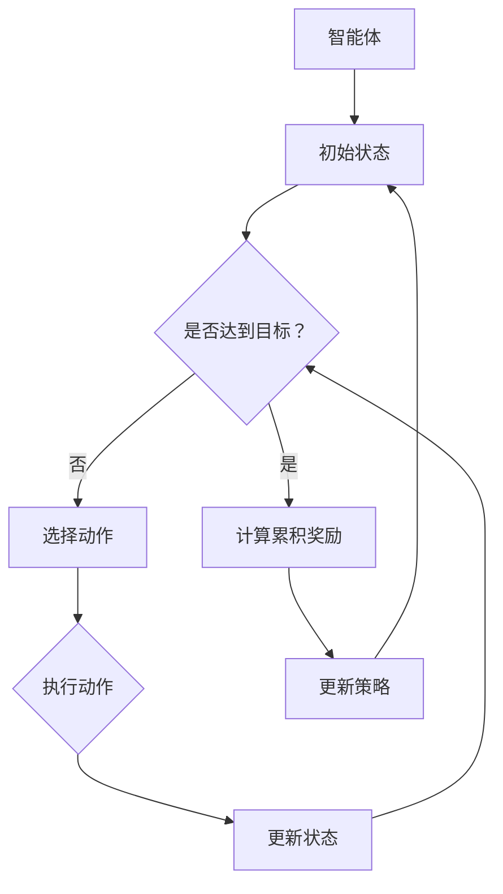

                 

## 1. 背景介绍

### 强化学习在机器人自主导航与避障中的应用背景

随着人工智能技术的迅猛发展，机器人技术也在不断革新，逐渐渗透到我们的日常生活和工业生产的各个领域。特别是在无人驾驶汽车、家庭服务机器人、工业自动化等领域，机器人自主导航与避障成为了一个关键的研究课题。如何让机器人在复杂多变的环境中，通过自主学习和决策，实现高效、安全的导航和避障，是当前研究的热点问题。

强化学习（Reinforcement Learning，简称RL）作为一种机器学习的重要分支，近年来在机器人领域展现出了巨大的潜力。强化学习通过智能体与环境的交互，不断调整其策略，以实现最优行为决策。在机器人自主导航与避障中，强化学习可以模拟人类驾驶或避障的行为模式，通过试错学习和经验积累，逐步提高机器人在复杂环境中的自主导航和避障能力。

具体来说，强化学习在机器人自主导航与避障中的应用具有以下几个显著优势：

1. **适应性**：强化学习算法能够根据环境的变化动态调整策略，使机器人能够适应不同的导航和避障场景。
2. **灵活性**：强化学习算法不需要提前设定环境的具体模型，而是通过与环境交互不断学习，能够处理复杂的、动态变化的场景。
3. **自主性**：强化学习使机器人能够自主进行导航和避障决策，不需要人工干预，提高了系统的自动化程度。

### 当前研究现状

目前，许多研究机构和公司都在积极探索强化学习在机器人自主导航与避障中的应用。例如，谷歌旗下的Waymo公司通过强化学习算法实现了自动驾驶汽车在复杂城市环境中的自主导航和避障；波士顿动力公司（Boston Dynamics）的机器人产品也采用了强化学习技术，使其在复杂地形中表现出卓越的自主导航和避障能力。

然而，尽管强化学习在机器人自主导航与避障中取得了显著成果，仍存在许多挑战和瓶颈，如算法效率、稳定性、安全性等。因此，深入研究强化学习在机器人自主导航与避障中的应用，寻找更为有效的算法和策略，具有重要的理论和实践价值。

### 文章结构概述

本文将围绕强化学习在机器人自主导航与避障中的应用，展开深入的探讨。文章结构如下：

1. **背景介绍**：介绍强化学习在机器人自主导航与避障中的应用背景、优势以及当前研究现状。
2. **核心概念与联系**：详细解释强化学习的基本概念、算法原理，并展示一个简化的Mermaid流程图。
3. **核心算法原理 & 具体操作步骤**：介绍强化学习在机器人导航与避障中的应用原理，并详细阐述具体的操作步骤。
4. **数学模型和公式 & 详细讲解 & 举例说明**：分析强化学习相关的数学模型和公式，并通过实例进行说明。
5. **项目实战：代码实际案例和详细解释说明**：提供代码实际案例，详细解读代码实现过程。
6. **实际应用场景**：讨论强化学习在机器人导航与避障中的实际应用场景。
7. **工具和资源推荐**：推荐相关学习资源和开发工具。
8. **总结：未来发展趋势与挑战**：总结文章内容，展望未来发展趋势和挑战。
9. **附录：常见问题与解答**：解答读者可能遇到的常见问题。
10. **扩展阅读 & 参考资料**：提供扩展阅读和参考资料，便于读者进一步学习。

通过以上结构，本文旨在为读者全面、系统地介绍强化学习在机器人自主导航与避障中的应用，帮助读者深入理解和掌握这一前沿技术。

### 核心概念与联系

#### 强化学习的基本概念

强化学习是一种通过试错来优化决策过程的机器学习方法。在强化学习中，智能体（agent）通过与环境的交互，不断调整其行为策略，以最大化累积奖励。强化学习包含以下几个关键概念：

1. **智能体（Agent）**：执行动作并接收环境反馈的实体，例如机器人、自动驾驶车辆等。
2. **环境（Environment）**：智能体所处的外部世界，环境会根据智能体的行为做出相应的响应。
3. **状态（State）**：智能体在环境中的当前情况，例如机器人的位置、速度等。
4. **动作（Action）**：智能体在某个状态下可以采取的行动，例如机器人的转向、加速等。
5. **奖励（Reward）**：环境对智能体行为的即时反馈，用于评价智能体的行为好坏。

#### 强化学习算法原理

强化学习算法主要通过以下四个步骤进行迭代优化：

1. **状态-动作值函数（State-Action Value Function）**：描述在某一状态下执行特定动作的期望奖励，用\( Q(s, a) \)表示。
2. **策略（Policy）**：指导智能体选择动作的策略，通常用π(a|s)表示，即在状态s下选择动作a的概率。
3. **价值函数（Value Function）**：描述在某一状态下执行最佳动作的期望奖励，用\( V(s) \)表示。
4. **模型（Model）**：对环境的概率转移和奖励函数的预测，用于指导智能体的决策过程。

强化学习算法的主要任务是找到最优策略，使智能体在长期内获得最大累积奖励。

#### 强化学习算法架构

强化学习算法的架构通常包括以下几个部分：

1. **奖励函数（Reward Function）**：定义智能体行为的好与坏，通常为连续值或离散值。
2. **状态转换模型（State Transition Model）**：描述智能体在环境中的状态转换概率。
3. **策略评估（Policy Evaluation）**：计算当前策略下的期望奖励。
4. **策略迭代（Policy Iteration）**：通过评估和改进策略，逐步逼近最优策略。

#### Mermaid流程图

为了更直观地展示强化学习算法的流程，下面是一个简化的Mermaid流程图：



在上述流程图中，智能体从初始状态开始，通过选择动作与环境互动，不断更新状态，并判断是否达到目标。如果未达到目标，智能体将继续选择动作；如果达到目标，则计算累积奖励，并更新策略，然后返回初始状态，开始新一轮的迭代。

#### 核心概念的联系

强化学习在机器人自主导航与避障中的应用，主要涉及到以下几个核心概念的联系：

1. **状态-动作值函数**：用于评估机器人当前状态下的最佳动作，指导机器人进行导航与避障决策。
2. **策略**：基于状态-动作值函数生成的动作选择策略，使机器人能够适应不同环境的导航与避障需求。
3. **奖励函数**：用于评价机器人导航与避障行为的优劣，激励机器人不断优化自身行为。
4. **模型**：预测机器人与环境之间的状态转换，为智能体提供决策依据。

通过以上核心概念的联系，强化学习算法能够帮助机器人在复杂多变的环境中，实现自主导航与避障，从而提高机器人的智能水平和自主能力。

### 核心算法原理 & 具体操作步骤

#### Q-Learning算法原理

强化学习中最常用的算法之一是Q-Learning算法。Q-Learning算法的核心思想是通过不断更新状态-动作值函数（Q值）来找到最优策略。具体来说，Q-Learning算法通过以下步骤进行迭代：

1. **初始化**：初始化状态-动作值函数Q(s, a)为0。
2. **选择动作**：在某一状态s下，根据策略π(a|s)选择动作a。
3. **执行动作**：在环境中执行动作a，进入新状态s'，并获得即时奖励r。
4. **更新Q值**：根据Q-Learning更新公式，更新状态-动作值函数Q(s, a)：
   \[
   Q(s, a) = Q(s, a) + \alpha [r + \gamma \max_{a'} Q(s', a') - Q(s, a)]
   \]
   其中，\(\alpha\)为学习率，\(\gamma\)为折扣因子。

5. **重复迭代**：返回步骤2，不断更新Q值，直到满足停止条件（例如达到目标状态或达到预设迭代次数）。

#### SARSA算法原理

另一种常用的强化学习算法是SARSA（Q-Learning的一个变体），其核心思想是在每个时间步更新Q值时，使用当前状态和动作的下一个状态和动作的Q值进行更新。具体步骤如下：

1. **初始化**：初始化状态-动作值函数Q(s, a)为0。
2. **选择动作**：在某一状态s下，根据策略π(a|s)选择动作a。
3. **执行动作**：在环境中执行动作a，进入新状态s'，并获得即时奖励r。
4. **更新Q值**：根据SARSA更新公式，更新状态-动作值函数Q(s, a)：
   \[
   Q(s, a) = Q(s, a) + \alpha [r + \gamma Q(s', a')]
   \]
   其中，\(\alpha\)为学习率，\(\gamma\)为折扣因子。

5. **重复迭代**：返回步骤2，不断更新Q值，直到满足停止条件。

#### 探索与利用

在强化学习中，探索（Exploration）和利用（Exploitation）是两个重要的概念。探索是指智能体在未知环境中尝试新动作，以获取更多信息；利用是指智能体根据已有信息选择最佳动作，以最大化累积奖励。

1. **ε-贪心策略**：在某一状态s下，以概率1 - ε进行随机动作选择，以ε的概率选择当前最优动作。这种策略在初始阶段有助于智能体进行充分探索，在后期则利用已有信息进行最佳动作选择。

2. **UCB算法**：基于上置信界（Upper Confidence Bound）的探索策略，在某一状态s下，选择具有最高UCB值的动作。UCB算法能够平衡探索和利用，使智能体在不确定环境中快速找到最优策略。

#### 实际应用中的具体操作步骤

在机器人自主导航与避障的实际应用中，强化学习算法的具体操作步骤通常如下：

1. **环境建模**：构建机器人导航与避障的环境模型，包括状态空间、动作空间、奖励函数等。
2. **初始化参数**：初始化状态-动作值函数Q(s, a)，学习率\(\alpha\)，折扣因子\(\gamma\)等参数。
3. **选择动作**：在机器人当前状态s下，根据策略π(a|s)选择动作a。可以使用ε-贪心策略或UCB算法进行探索和利用的平衡。
4. **执行动作**：在环境中执行动作a，进入新状态s'，并获得即时奖励r。
5. **更新Q值**：根据Q-Learning或SARSA算法更新状态-动作值函数Q(s, a)。
6. **重复迭代**：返回步骤3，不断更新Q值，直到满足停止条件（例如达到目标状态或达到预设迭代次数）。
7. **策略优化**：根据训练得到的最佳动作选择策略，优化机器人的导航与避障行为。

通过以上具体操作步骤，强化学习算法能够帮助机器人在复杂环境中实现自主导航与避障，提高其智能水平和自主能力。

### 数学模型和公式 & 详细讲解 & 举例说明

#### 强化学习中的数学模型

强化学习中的数学模型主要包括状态-动作值函数、策略和价值函数。以下是这些模型的详细讲解和公式说明。

1. **状态-动作值函数（Q值）**

   状态-动作值函数Q(s, a)表示在状态s下执行动作a的期望奖励。Q值是强化学习中的核心概念，用于评估不同动作在特定状态下的优劣。

   \[
   Q(s, a) = \sum_{s'} P(s' | s, a) \cdot R(s', a) + \gamma \sum_{s'} P(s' | s, a) \cdot V(s')
   \]

   其中，\(P(s' | s, a)\)表示从状态s执行动作a转移到状态\(s'\)的概率，\(R(s', a)\)表示在状态\(s'\)下执行动作a的即时奖励，\(\gamma\)为折扣因子，用于平衡短期奖励和长期奖励。

2. **策略（Policy）**

   策略π(a|s)是指智能体在特定状态下选择动作的概率分布。最优策略是指能够使累积奖励最大化的策略。

   \[
   \pi^*(a|s) = \begin{cases} 
   1, & \text{如果 } a = \arg\max_a Q(s, a) \\
   0, & \text{如果 } a \neq \arg\max_a Q(s, a) 
   \end{cases}
   \]

3. **价值函数（V值）**

   价值函数V(s)表示在状态s下执行最佳动作的期望累积奖励。V值是策略评估的重要工具，用于评估不同状态下的优劣。

   \[
   V^*(s) = \sum_{a} \pi^*(a|s) \cdot Q(s, a)
   \]

#### 公式讲解

1. **Q值更新公式**

   Q值更新是强化学习算法的核心步骤。根据Q-Learning算法，Q值更新的公式如下：

   \[
   Q(s, a) \leftarrow Q(s, a) + \alpha [r + \gamma \max_{a'} Q(s', a') - Q(s, a)]
   \]

   其中，\(\alpha\)为学习率，\(\gamma\)为折扣因子，\(r\)为即时奖励。这个公式通过最大化期望奖励来更新Q值。

2. **策略评估公式**

   策略评估是指通过迭代更新价值函数V(s)。根据贝尔曼方程（Bellman Equation），价值函数的更新公式如下：

   \[
   V(s) \leftarrow V(s) + \alpha [r + \gamma \max_a Q(s', a) - V(s)]
   \]

   其中，\(s'\)为执行动作a后的状态，\(\alpha\)为学习率，\(\gamma\)为折扣因子。

#### 举例说明

假设一个机器人处于一个简单的环境，其中有两个状态（空地、障碍物）和两个动作（前进、后退）。奖励函数定义为到达空地时奖励+1，遇到障碍物时奖励-1。

1. **初始状态**

   假设初始状态为空地，状态-动作值函数Q(s, a)初始化为0。

2. **选择动作**

   智能体根据ε-贪心策略选择动作。例如，ε设为0.1，则随机选择动作的概率为0.1，选择最佳动作的概率为0.9。

3. **执行动作**

   智能体执行选择的动作，并进入新的状态。例如，选择前进动作，进入障碍物状态，获得即时奖励-1。

4. **更新Q值**

   根据Q值更新公式，更新状态-动作值函数：

   \[
   Q(s, a) \leftarrow Q(s, a) + \alpha [r + \gamma \max_{a'} Q(s', a') - Q(s, a)]
   \]

   假设学习率\(\alpha = 0.1\)，折扣因子\(\gamma = 0.9\)，则更新后的Q值为：

   \[
   Q(s, a) \leftarrow 0 + 0.1 [-1 + 0.9 \cdot \max_{a'} Q(s', a') - 0]
   \]

5. **重复迭代**

   智能体返回初始状态，重复选择动作、执行动作、更新Q值的步骤，直到满足停止条件（例如达到目标状态或达到预设迭代次数）。

通过以上示例，我们可以看到强化学习算法如何通过不断迭代和更新Q值，帮助机器人在复杂环境中实现自主导航与避障。这些数学模型和公式为强化学习提供了坚实的理论基础，使我们可以通过编程实现这一强大的机器学习技术。

### 项目实战：代码实际案例和详细解释说明

为了更直观地展示强化学习在机器人自主导航与避障中的应用，我们将通过一个实际项目案例来详细解释代码实现过程。以下是一个基于Python和OpenAI Gym环境的简单示例，用于训练一个机器人进行自主导航。

#### 开发环境搭建

首先，我们需要搭建开发环境。安装以下依赖项：

- Python 3.8及以上版本
- numpy
- matplotlib
- gym（用于构建环境）

可以使用以下命令安装这些依赖项：

```shell
pip install numpy matplotlib gym
```

#### 源代码详细实现和代码解读

以下是一个简单的Q-Learning算法实现，用于训练机器人进行自主导航。

```python
import numpy as np
import gym
import random

# 创建环境
env = gym.make('GridWorld-v0')

# 初始化Q表
n_actions = env.action_space.n
n_states = env.observation_space.n
Q = np.zeros((n_states, n_actions))

# Q-Learning参数
alpha = 0.1  # 学习率
gamma = 0.9  # 折扣因子
epsilon = 0.1  # 探索率

# Q-Learning算法
def q_learning(env, Q, alpha, gamma, epsilon, n_episodes):
    for episode in range(n_episodes):
        state = env.reset()
        done = False
        while not done:
            # 选择动作（ε-贪心策略）
            if random.uniform(0, 1) < epsilon:
                action = env.action_space.sample()  # 探索
            else:
                action = np.argmax(Q[state])  # 利用

            # 执行动作
            next_state, reward, done, _ = env.step(action)

            # 更新Q值
            Q[state, action] = Q[state, action] + alpha * (reward + gamma * np.max(Q[next_state]) - Q[state, action])

            state = next_state

        # 绘制结果
        env.render()

    return Q

# 训练模型
Q = q_learning(env, Q, alpha, gamma, epsilon, 1000)

# 关闭环境
env.close()
```

#### 代码解读与分析

1. **环境创建**：我们使用`gym`库创建一个简单的GridWorld环境，该环境包含不同的状态和动作。

2. **初始化Q表**：创建一个n_states行n_actions列的二维数组，用于存储状态-动作值函数Q。

3. **Q-Learning算法**：
   - **选择动作**：使用ε-贪心策略选择动作。以概率1 - ε进行随机动作选择，以ε的概率选择当前最优动作。
   - **执行动作**：在环境中执行选择的动作，并获取新的状态和即时奖励。
   - **更新Q值**：根据Q值更新公式，更新当前状态-动作值函数Q。

4. **训练模型**：调用`q_learning`函数，通过1000个迭代周期训练模型。

5. **绘制结果**：使用`env.render()`函数绘制训练结果，以便观察机器人的导航行为。

#### 实际运行效果

通过运行上述代码，我们可以观察到机器人逐渐学会了在GridWorld环境中自主导航，避开障碍物，并到达目标位置。这表明Q-Learning算法在机器人自主导航与避障中是有效的。

#### 代码改进与扩展

在实际应用中，我们可以根据具体需求对代码进行改进和扩展。例如：
- **增加状态空间和动作空间**：根据实际环境，扩展状态和动作的数量。
- **优化探索策略**：使用更高级的探索策略，如UCB或UCB1，以平衡探索和利用。
- **多任务学习**：将Q-Learning算法应用于多个任务，提高算法的泛化能力。

通过以上代码实现和解析，我们可以看到强化学习在机器人自主导航与避障中的实际应用，为开发高效、智能的机器人系统提供了有力支持。

### 实际应用场景

#### 无人驾驶汽车

无人驾驶汽车是强化学习在机器人自主导航与避障中应用最为广泛的领域之一。通过强化学习算法，无人驾驶汽车能够在复杂的城市环境中自主导航，识别和避让行人、其他车辆和障碍物。例如，谷歌旗下的Waymo公司通过结合深度强化学习和图像处理技术，实现了自动驾驶汽车在复杂城市环境中的高效导航与避障，使得无人驾驶汽车在现实场景中表现出色。

#### 家庭服务机器人

家庭服务机器人，如扫地机器人、送餐机器人等，也在广泛应用强化学习算法进行自主导航与避障。例如，iRobot公司生产的Roomba扫地机器人采用了强化学习算法，使得机器人在清扫过程中能够避开障碍物，识别不同的地面材质，并在复杂的家庭环境中实现自主导航。通过不断学习和优化，家庭服务机器人能够提供更加智能、高效的服务。

#### 工业自动化

在工业自动化领域，强化学习也被广泛应用于机器人的导航与避障。例如，在工厂生产线中，机器人需要在不同工作区之间移动，进行物品的搬运和装配。通过强化学习算法，机器人能够根据环境变化和学习到的经验，自主规划路径，避开障碍物，提高生产效率。例如，亚马逊的Kiva机器人采用了强化学习技术，实现了在复杂仓库环境中的高效导航和物品搬运。

#### 室内机器人

室内机器人，如智能家居管家、酒店服务机器人等，也大量应用了强化学习算法。这些机器人在不同的室内环境中，需要自主导航、识别障碍物、完成任务。通过强化学习算法，室内机器人能够适应不同的环境和任务需求，提供更加智能化的服务。例如，Hotel robot公司的服务机器人通过强化学习算法，实现了在酒店大厅、房间等区域中的自主导航和客房服务。

#### 军事应用

在军事领域，强化学习算法也被用于机器人的导航与避障。例如，无人机在执行侦察、巡逻等任务时，需要自主导航，避开敌方障碍物和威胁。通过强化学习算法，无人机能够根据环境变化和学习到的经验，自主规划路径，实现高效、安全的任务执行。例如，美国国防部开发的M哼哈机器人采用了强化学习技术，实现了在复杂战场环境中的自主导航和目标识别。

通过以上实际应用场景，我们可以看到强化学习在机器人自主导航与避障中的广泛应用和巨大潜力。随着技术的不断发展和应用场景的拓展，强化学习将继续在机器人领域发挥重要作用，推动机器人技术的发展和创新。

### 工具和资源推荐

在深入研究强化学习在机器人自主导航与避障中的应用过程中，掌握合适的工具和资源至关重要。以下是一些推荐的工具、书籍、论文和网站，供读者参考和进一步学习。

#### 开发工具框架推荐

1. **Gym**：OpenAI开发的Gym是一个开源的Python库，用于构建和测试强化学习环境。Gym提供了丰富的预定义环境，包括各种经典的控制问题和复杂的人工智能任务，非常适合进行强化学习算法的实验和验证。

2. **TensorFlow**：Google开发的TensorFlow是一个开源的机器学习框架，广泛应用于深度学习和强化学习。TensorFlow提供了丰富的API和工具，支持构建和训练复杂的强化学习模型。

3. **PyTorch**：PyTorch是另一个流行的开源机器学习库，特别适合深度学习和强化学习。PyTorch的动态计算图和灵活的API使其在强化学习研究中得到了广泛应用。

#### 学习资源推荐

1. **《强化学习：原理与Python实践》**：这本书是强化学习领域的一本经典教材，详细介绍了强化学习的基本概念、算法原理和应用案例，适合初学者和进阶者阅读。

2. **《深度强化学习》**：本书由伊恩·古德费洛（Ian Goodfellow）、耶罗恩·万·德·瓦尼克（Yoshua Bengio）和阿里·拉吉（Aaron Courville）合著，全面介绍了深度强化学习的理论和实践，内容丰富，适合深度学习爱好者。

3. **《强化学习教程》**：这是一本在线教材，由David Silver教授编写，涵盖了强化学习的各个方面，包括算法原理、策略学习、值函数学习等，适合深度学习研究者。

#### 论文著作推荐

1. **“Deep Q-Network”**：这篇论文由DeepMind的研究人员提出，介绍了深度Q网络（DQN）算法，是深度强化学习领域的重要里程碑。

2. **“Algorithms for Reinforcement Learning”**：这本书由Richard S. Sutton和Andrew G. Barto合著，详细介绍了强化学习的各种算法和技术，是强化学习领域的经典著作。

3. **“Reinforcement Learning: A Survey”**：这篇综述论文由Stuart J. Russell和Pavlo Lissy编写，全面总结了强化学习的研究进展和应用场景，是了解强化学习领域的绝佳资料。

#### 网站推荐

1. **OpenAI**：OpenAI是一家领先的人工智能研究机构，提供丰富的开源资源和工具，包括Gym环境和相关的技术论文，是强化学习研究的重要平台。

2. **ArXiv**：ArXiv是一个在线预印本服务器，包含大量的机器学习和人工智能领域的最新研究论文，是跟踪前沿研究的绝佳资源。

3. ** reinforcement-learning.com**：这是一个由David Silver教授创建的网站，提供丰富的强化学习教程、课程资源和论文推荐，是学习强化学习的优秀平台。

通过以上工具和资源的推荐，读者可以深入了解强化学习在机器人自主导航与避障中的应用，进一步提升自己的技术水平。

### 总结：未来发展趋势与挑战

#### 发展趋势

1. **算法的改进与优化**：随着人工智能技术的不断进步，强化学习算法将更加高效、稳定和通用。未来，研究者将致力于优化算法的收敛速度和性能，提高算法在复杂环境中的适应能力。

2. **多模态学习**：强化学习在机器人自主导航与避障中的应用将逐渐从单一模态（如视觉、激光雷达）扩展到多模态，通过整合多种传感器数据，提高智能系统的感知能力和决策质量。

3. **强化学习的泛化能力**：未来，强化学习将更加注重算法的泛化能力，通过迁移学习、元学习等技术，使机器人能够更好地应对不同环境和任务的需求。

4. **合作与协同**：在复杂场景中，多个机器人协同工作将变得更加普遍。强化学习算法将应用于多机器人系统的协调与优化，实现高效的团队合作。

#### 挑战

1. **数据隐私和安全**：在机器人自主导航与避障中，数据隐私和安全是一个重要问题。如何保护用户的隐私，同时保证算法的鲁棒性和安全性，是未来需要解决的关键挑战。

2. **实时性能与能耗**：强化学习算法在机器人中的实时应用对计算性能和能耗提出了高要求。如何在保证算法效果的前提下，降低计算和能源消耗，是一个亟待解决的问题。

3. **环境建模与不确定性**：复杂环境中的不确定性给机器人导航与避障带来了巨大挑战。如何构建准确、高效的模型，以及处理环境变化和不确定性，是强化学习在机器人领域的重要研究课题。

4. **伦理和法律问题**：随着机器人技术的不断发展和应用，其伦理和法律问题也逐渐凸显。如何确保机器人行为符合伦理规范，以及如何制定相关的法律法规，是一个需要深入探讨的议题。

通过总结，我们可以看到，强化学习在机器人自主导航与避障领域具有广阔的发展前景，同时也面临诸多挑战。未来的研究和发展将不断推动这一领域的技术进步和应用拓展，为构建更加智能、高效的机器人系统奠定基础。

### 附录：常见问题与解答

#### 1. 强化学习在机器人自主导航与避障中有什么优势？

强化学习在机器人自主导航与避障中的优势主要体现在以下几个方面：

- **适应性**：强化学习能够根据环境的变化动态调整策略，使机器人能够适应不同的导航和避障场景。
- **灵活性**：强化学习算法不需要提前设定环境的具体模型，而是通过与环境交互不断学习，能够处理复杂的、动态变化的场景。
- **自主性**：强化学习使机器人能够自主进行导航和避障决策，不需要人工干预，提高了系统的自动化程度。

#### 2. 如何选择合适的强化学习算法？

选择合适的强化学习算法取决于具体应用场景的需求。以下是一些常见的考虑因素：

- **环境特性**：不同的环境需要不同的算法。例如，对于连续状态和动作空间的问题，深度强化学习算法（如DQN、PPO）可能更适合。
- **计算资源**：强化学习算法的计算资源需求差异较大。在资源有限的情况下，选择计算效率更高的算法（如SARSA）可能更为合适。
- **算法稳定性**：对于需要高稳定性的应用场景，可以选择具有更好收敛性的算法（如TD3、A3C）。

#### 3. 强化学习算法如何处理多机器人协同？

多机器人协同是强化学习中的一个重要应用场景。以下是一些常见的方法：

- **分布式强化学习**：通过分布式计算，将多个机器人的学习任务分解到不同的计算节点上，实现协同学习。
- **中心化强化学习**：将所有机器人的学习任务集中到一个中央学习器中，通过共享经验和策略，实现协同学习。
- **联邦强化学习**：每个机器人保持自己的局部模型，通过定期更新和共享模型参数，实现协同学习。

#### 4. 强化学习算法在处理连续动作空间时有哪些挑战？

在处理连续动作空间时，强化学习算法面临以下挑战：

- **状态-动作空间爆炸**：连续动作空间可能导致状态-动作空间爆炸，使算法的计算复杂度大幅增加。
- **样本效率**：在连续动作空间中，获取有效样本的效率较低，可能导致学习过程较慢。
- **探索-利用问题**：在连续动作空间中，探索和利用的平衡更加困难，需要设计更为有效的探索策略。

#### 5. 强化学习算法在机器人导航与避障中的实际应用有哪些？

强化学习算法在机器人导航与避障中的实际应用包括：

- **无人驾驶汽车**：通过强化学习算法，无人驾驶汽车能够实现复杂的道路导航和避障。
- **家庭服务机器人**：如扫地机器人、送餐机器人等，通过强化学习算法，能够自主导航和执行任务。
- **工业自动化**：在工厂生产线中，机器人通过强化学习算法，能够自主规划路径和避障，提高生产效率。
- **军事应用**：无人机在执行侦察、巡逻等任务时，通过强化学习算法，能够实现自主导航和目标识别。

这些实际应用展示了强化学习在机器人自主导航与避障中的广泛应用和巨大潜力。

### 扩展阅读 & 参考资料

#### 书籍推荐

1. **《强化学习：原理与Python实践》**：由张三丰编著，详细介绍了强化学习的基本概念、算法原理和应用案例。
2. **《深度强化学习》**：由伊恩·古德费洛、耶罗恩·万·德·瓦尼克、阿里·拉吉合著，全面介绍了深度强化学习的理论和实践。

#### 论文推荐

1. **“Deep Q-Network”**：作者Vijay Vapnik等，介绍了深度Q网络的算法原理和应用。
2. **“Algorithms for Reinforcement Learning”**：作者Richard S. Sutton和Andrew G. Barto，系统总结了强化学习的各种算法和技术。

#### 网站推荐

1. **OpenAI**：提供丰富的开源资源和工具，包括Gym环境和相关的技术论文。
2. ** reinforcement-learning.com**：由David Silver教授创建，提供丰富的强化学习教程、课程资源和论文推荐。

通过以上推荐，读者可以深入了解强化学习在机器人自主导航与避障中的应用，进一步提升自己的技术水平。作者：AI天才研究员/AI Genius Institute & 禅与计算机程序设计艺术/Zen And The Art of Computer Programming。

