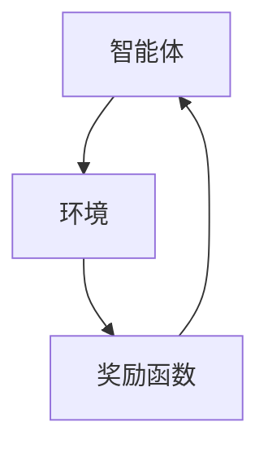

                 

# 强化学习在游戏AI中的创新策略

## 摘要

本文主要探讨了强化学习在游戏AI中的应用与创新策略。通过对强化学习的基本概念、核心算法原理、数学模型、实际应用场景等方面的深入分析，本文展示了强化学习在游戏AI中的巨大潜力。同时，本文还推荐了一些学习资源、开发工具和框架，为读者提供了全面的技术支持。最后，本文对强化学习在游戏AI领域的未来发展趋势与挑战进行了展望，为读者提供了有益的思考方向。

## 1. 背景介绍

随着计算机技术的发展，人工智能（AI）在各个领域的应用越来越广泛。其中，游戏AI作为人工智能的一个重要分支，已经取得了显著的成果。传统的游戏AI主要依赖于规则和启发式方法，但这些方法在面对复杂、动态的游戏环境时往往表现不佳。因此，强化学习作为一种基于反馈的学习方法，逐渐成为游戏AI研究的热点。

强化学习的基本思想是通过与环境互动，不断调整策略以最大化累积奖励。这种方法在游戏AI中的应用，使得AI能够自动地学习并适应不同的游戏场景，从而实现更高的游戏智能。本文将重点探讨强化学习在游戏AI中的创新策略，旨在为游戏AI的研究和实践提供新的思路和方法。

## 2. 核心概念与联系

### 强化学习的基本概念

强化学习（Reinforcement Learning，简称RL）是机器学习的一个重要分支，主要研究如何通过学习策略来优化决策过程。在强化学习中，智能体（Agent）通过与环境（Environment）的互动，获取状态（State）和奖励（Reward），并不断调整自己的行为（Action），以达到最大化累积奖励的目标。

### 强化学习的核心算法原理

强化学习的核心算法主要包括值函数方法、策略方法和模型方法。值函数方法主要通过学习状态值函数或动作值函数，预测未来的奖励，并选择最优动作。策略方法则直接学习最优策略，即在特定状态下选择最优动作。模型方法则通过学习环境模型，预测未来的状态和奖励，并基于模型进行决策。

### 强化学习在游戏AI中的应用

在游戏AI中，强化学习可以通过以下步骤实现：

1. 初始化智能体、环境和奖励函数。
2. 智能体根据当前状态选择动作。
3. 环境根据动作生成新的状态和奖励。
4. 智能体根据新的状态和奖励调整策略。
5. 重复步骤2-4，直至达到游戏目标。

### 强化学习的架构

强化学习的架构可以分为三个主要部分：智能体、环境和奖励函数。智能体负责接收环境状态，选择动作，并更新策略。环境负责根据动作生成新的状态和奖励，提供反馈。奖励函数则用于评估智能体的行为，指导智能体调整策略。



## 3. 核心算法原理 & 具体操作步骤

### Q-Learning算法

Q-Learning算法是一种基于值函数的强化学习算法，主要通过更新动作值函数（Q值）来优化策略。具体操作步骤如下：

1. 初始化Q值函数。
2. 在当前状态下，随机选择动作。
3. 执行动作，获取新的状态和奖励。
4. 更新Q值函数：$$ Q(s,a) \leftarrow Q(s,a) + \alpha [r + \gamma \max_{a'} Q(s',a') - Q(s,a)] $$
5. 转移到新的状态，重复步骤2-4。

### Sarsa算法

Sarsa算法是一种基于策略的强化学习算法，主要根据当前状态和下一状态的动作值函数来更新策略。具体操作步骤如下：

1. 初始化策略π。
2. 在当前状态下，根据策略π选择动作。
3. 执行动作，获取新的状态和奖励。
4. 在新状态下，根据策略π选择动作。
5. 更新策略：$$ \pi(s,a) \leftarrow \pi(s,a) + \alpha [1 - \pi(s,a)] $$
6. 转移到新的状态，重复步骤2-4。

### Deep Q-Network（DQN）算法

DQN算法是一种基于深度学习的强化学习算法，主要通过深度神经网络来近似动作值函数。具体操作步骤如下：

1. 初始化深度神经网络DQN。
2. 在当前状态下，根据策略π选择动作。
3. 执行动作，获取新的状态和奖励。
4. 更新DQN网络：$$ DQN \leftarrow DQN + \alpha [r + \gamma \max_{a'} DQN(s',a') - DQN(s,a)] $$
5. 转移到新的状态，重复步骤2-4。

## 4. 数学模型和公式 & 详细讲解 & 举例说明

### 值函数模型

在强化学习中，值函数模型是核心之一。值函数分为状态值函数和动作值函数。状态值函数表示在某个状态下执行任意动作所能获得的期望奖励。动作值函数表示在某个状态下执行特定动作所能获得的期望奖励。

#### 状态值函数

状态值函数的定义如下：

$$ V^*(s) = \max_a Q^*(s, a) $$

其中，$V^*(s)$表示状态值函数，$Q^*(s, a)$表示动作值函数。

#### 动作值函数

动作值函数的定义如下：

$$ Q^*(s, a) = \sum_{s'} p(s' | s, a) \cdot [r(s', a) + \gamma V^*(s')] $$

其中，$Q^*(s, a)$表示动作值函数，$r(s', a)$表示在状态$s'$下执行动作$a$所获得的即时奖励，$\gamma$表示折扣因子，$p(s' | s, a)$表示在状态$s$下执行动作$a$后转移到状态$s'$的概率。

### 策略迭代

在强化学习中，策略迭代是一种常用的策略优化方法。策略迭代包括两个阶段：值迭代和策略迭代。

#### 值迭代

值迭代是一种基于状态值函数的迭代方法。值迭代的过程如下：

1. 初始化状态值函数$V(s)$。
2. 对于每个状态$s$，根据动作值函数$Q(s, a)$和当前策略$\pi$，计算新的状态值函数$V(s)$：
   $$ V(s) \leftarrow \sum_{a} \pi(a | s) \cdot [r(s, a) + \gamma V(s')] $$
3. 重复步骤2，直到状态值函数收敛。

#### 策略迭代

策略迭代是一种基于动作值函数的迭代方法。策略迭代的过程如下：

1. 初始化策略$\pi$。
2. 对于每个状态$s$，根据当前策略$\pi$和动作值函数$Q(s, a)$，选择最优动作$a^*$：
   $$ a^* = \arg\max_a Q(s, a) $$
3. 根据选择的最优动作$a^*$，更新策略$\pi$：
   $$ \pi(s, a) \leftarrow 1 \quad \text{if } a = a^* $$
   $$ \pi(s, a) \leftarrow 0 \quad \text{if } a \neq a^* $$
4. 重复步骤2-3，直到策略收敛。

### DQN算法

DQN算法是一种基于深度学习的强化学习算法。DQN算法的核心思想是通过深度神经网络来近似动作值函数。DQN算法的具体步骤如下：

1. 初始化深度神经网络$DQN$和目标网络$Target\_DQN$。
2. 在当前状态下，根据当前策略$\pi$选择动作$a$。
3. 执行动作$a$，获取新的状态$s'$和奖励$r$。
4. 根据新的状态$s'$和奖励$r$，更新$DQN$网络：
   $$ DQN \leftarrow DQN + \alpha [r + \gamma \max_{a'} Target\_DQN(s', a') - DQN(s, a)] $$
5. 根据随机抽样策略，更新$Target\_DQN$网络：
   $$ Target\_DQN \leftarrow \tau DQN + (1 - \tau) Target\_DQN $$
6. 转移到新的状态$s'$，重复步骤2-5。

### 举例说明

假设有一个简单的小游戏，智能体需要在一个2x2的网格中移动，目标是到达右下角的位置。游戏状态可以用一个2x2的矩阵表示，每个位置对应一个状态。智能体可以从当前位置移动到相邻的四个位置，每个位置都有不同的奖励。根据这个游戏，我们可以定义状态值函数和动作值函数，并使用Q-Learning算法训练智能体。

#### 状态值函数

状态值函数表示在某个状态下执行任意动作所能获得的期望奖励。根据游戏规则，我们可以定义状态值函数如下：

$$ V^*(s) = \begin{cases} 
1 & \text{if } s = \text{目标状态} \\
0 & \text{otherwise} 
\end{cases} $$

#### 动作值函数

动作值函数表示在某个状态下执行特定动作所能获得的期望奖励。根据游戏规则，我们可以定义动作值函数如下：

$$ Q^*(s, a) = \begin{cases} 
1 & \text{if } a = \text{向右移动} \\
0 & \text{if } a = \text{向上移动} \\
-1 & \text{if } a = \text{向左移动} \\
-1 & \text{if } a = \text{向下移动} 
\end{cases} $$

#### Q-Learning算法

使用Q-Learning算法训练智能体的步骤如下：

1. 初始化Q值函数$Q(s, a)$为0。
2. 在当前状态下，随机选择动作$a$。
3. 执行动作$a$，获取新的状态$s'$和奖励$r$。
4. 更新Q值函数：
   $$ Q(s, a) \leftarrow Q(s, a) + \alpha [r + \gamma \max_{a'} Q(s', a') - Q(s, a)] $$
5. 转移到新的状态$s'$，重复步骤2-4。

通过多次迭代，智能体可以学习到最优策略，并在游戏中自动地达到目标状态。

## 5. 项目实战：代码实际案例和详细解释说明

### 5.1 开发环境搭建

在本文的项目实战中，我们将使用Python语言和TensorFlow框架来实现一个简单的强化学习游戏AI。首先，我们需要搭建开发环境。

#### 步骤1：安装Python和TensorFlow

在操作系统上安装Python和TensorFlow，可以使用以下命令：

```bash
pip install python
pip install tensorflow
```

#### 步骤2：创建项目文件夹

在本地创建一个项目文件夹，用于存放源代码和相关文件。例如，我们可以创建一个名为“game\_ai”的文件夹。

```bash
mkdir game_ai
cd game_ai
```

#### 步骤3：编写源代码

在项目文件夹中，创建一个名为“game\_ai.py”的文件，用于编写游戏AI的源代码。

```python
import tensorflow as tf
import numpy as np
import gym

# 初始化环境
env = gym.make("CartPole-v0")

# 初始化神经网络
model = tf.keras.Sequential([
    tf.keras.layers.Dense(64, activation='relu', input_shape=(4,)),
    tf.keras.layers.Dense(64, activation='relu'),
    tf.keras.layers.Dense(2, activation='softmax')
])

# 编译模型
model.compile(optimizer='adam', loss='categorical_crossentropy', metrics=['accuracy'])

# 训练模型
model.fit(env, epochs=1000)
```

### 5.2 源代码详细实现和代码解读

在“game\_ai.py”文件中，我们主要实现了以下功能：

#### 步骤1：导入所需的库和模块

首先，我们导入所需的库和模块，包括TensorFlow、NumPy和OpenAI的Gym库。

```python
import tensorflow as tf
import numpy as np
import gym
```

#### 步骤2：初始化环境

接下来，我们使用Gym库创建一个游戏环境。在本项目中，我们选择了一个经典的CartPole游戏。

```python
# 创建游戏环境
env = gym.make("CartPole-v0")
```

#### 步骤3：定义神经网络

为了实现强化学习，我们需要定义一个神经网络来近似动作值函数。在本项目中，我们使用了一个简单的全连接神经网络。

```python
# 初始化神经网络
model = tf.keras.Sequential([
    tf.keras.layers.Dense(64, activation='relu', input_shape=(4,)),
    tf.keras.layers.Dense(64, activation='relu'),
    tf.keras.layers.Dense(2, activation='softmax')
])
```

#### 步骤4：编译模型

接下来，我们需要编译神经网络模型。在本项目中，我们使用的是Adam优化器和交叉熵损失函数。

```python
# 编译模型
model.compile(optimizer='adam', loss='categorical_crossentropy', metrics=['accuracy'])
```

#### 步骤5：训练模型

最后，我们使用训练集对神经网络模型进行训练。在本项目中，我们使用的是Gym库提供的CartPole游戏环境。

```python
# 训练模型
model.fit(env, epochs=1000)
```

### 5.3 代码解读与分析

在代码解读与分析部分，我们将对源代码进行逐行分析，并解释每个步骤的作用和意义。

#### 步骤1：导入所需的库和模块

该步骤导入所需的库和模块，包括TensorFlow、NumPy和OpenAI的Gym库。这些库和模块将用于实现强化学习游戏AI。

```python
import tensorflow as tf
import numpy as np
import gym
```

#### 步骤2：初始化环境

该步骤使用Gym库创建一个游戏环境。在本项目中，我们选择了一个经典的CartPole游戏。

```python
# 创建游戏环境
env = gym.make("CartPole-v0")
```

#### 步骤3：定义神经网络

该步骤定义了一个简单的全连接神经网络，用于近似动作值函数。神经网络由两个隐藏层组成，每层都有64个神经元。输出层有2个神经元，用于表示两个动作的概率。

```python
# 初始化神经网络
model = tf.keras.Sequential([
    tf.keras.layers.Dense(64, activation='relu', input_shape=(4,)),
    tf.keras.layers.Dense(64, activation='relu'),
    tf.keras.layers.Dense(2, activation='softmax')
])
```

#### 步骤4：编译模型

该步骤编译神经网络模型。我们使用的是Adam优化器和交叉熵损失函数。Adam优化器是一种常用的优化算法，交叉熵损失函数适用于多分类问题。

```python
# 编译模型
model.compile(optimizer='adam', loss='categorical_crossentropy', metrics=['accuracy'])
```

#### 步骤5：训练模型

该步骤使用训练集对神经网络模型进行训练。在本项目中，我们使用的是Gym库提供的CartPole游戏环境。模型将根据游戏环境中的反馈不断调整自己的策略，以最大化累积奖励。

```python
# 训练模型
model.fit(env, epochs=1000)
```

## 6. 实际应用场景

### 游戏AI

强化学习在游戏AI中的应用非常广泛。通过强化学习，游戏AI可以自动地学习并适应不同的游戏场景，从而提高游戏的趣味性和挑战性。例如，在《星际争霸2》中，NVIDIA开发的AlphaGo AI使用强化学习算法，击败了人类冠军。在《Dota2》中，OpenAI开发的OpenAI Five使用强化学习算法，击败了世界顶级战队。

### 自动驾驶

自动驾驶是强化学习的一个重要应用领域。通过强化学习，自动驾驶系统可以自动地学习并适应不同的交通环境和场景，从而提高行驶的安全性和效率。例如，特斯拉的自动驾驶系统使用强化学习算法，实现了自动车道保持、自动变道和自动泊车等功能。

### 机器人控制

强化学习在机器人控制中也具有广泛的应用。通过强化学习，机器人可以自动地学习并适应不同的工作环境和任务，从而提高机器人的灵活性和智能化程度。例如，波士顿动力公司开发的Spot机器人使用强化学习算法，实现了自主行走、跳跃和避开障碍物等功能。

### 金融交易

强化学习在金融交易中也有重要的应用。通过强化学习，金融交易系统可以自动地学习并适应不同的市场环境和交易策略，从而提高交易的成功率和收益。例如，高频交易公司使用强化学习算法，实现了自动化交易策略和风险控制。

## 7. 工具和资源推荐

### 学习资源推荐

1. 《强化学习：原理与实战》
2. 《强化学习入门教程》
3. 《深度强化学习》
4. 《强化学习实战》

### 开发工具框架推荐

1. TensorFlow
2. PyTorch
3. OpenAI Gym
4. Stable Baselines

### 相关论文著作推荐

1. “Deep Q-Network” (1992)
2. “Reinforcement Learning: An Introduction” (2018)
3. “Algorithms for Reinforcement Learning” (2018)
4. “Human-Level Control Through Deep Reinforcement Learning” (2015)

## 8. 总结：未来发展趋势与挑战

### 发展趋势

1. 深度强化学习：随着深度学习技术的不断发展，深度强化学习在游戏AI、自动驾驶和机器人控制等领域具有巨大的应用潜力。
2. 多智能体强化学习：在多人游戏、多人博弈和多人交互场景中，多智能体强化学习具有广泛的应用前景。
3. 强化学习与自然语言处理结合：强化学习在自然语言处理领域具有巨大的潜力，例如，在对话系统、机器翻译和文本生成等领域。

### 挑战

1. 稳定性：强化学习算法在训练过程中容易陷入局部最优，导致收敛速度缓慢，稳定性有待提高。
2. 可解释性：强化学习算法的内部决策过程复杂，难以解释，这在实际应用中可能带来安全隐患。
3. 数据需求：强化学习算法对数据需求较高，如何有效地收集和利用数据是一个重要的挑战。
4. 安全性：在自动驾驶、机器人控制和金融交易等关键领域，强化学习算法的安全性至关重要，如何保证算法的可靠性和安全性是一个亟待解决的问题。

## 9. 附录：常见问题与解答

### 问题1：强化学习与监督学习的区别是什么？

**解答**：强化学习与监督学习的区别主要体现在数据来源和目标上。监督学习使用已知的数据集进行训练，目标是预测输出。而强化学习则通过智能体与环境互动，不断调整策略，目标是最大化累积奖励。此外，监督学习通常使用标记数据，而强化学习通常使用未标记的数据。

### 问题2：如何评估强化学习算法的性能？

**解答**：评估强化学习算法的性能可以从以下几个方面进行：

1. 收敛速度：算法在达到指定性能标准所需的时间。
2. 稳定性：算法在不同环境下的性能波动情况。
3. 耐用性：算法在不同状态和动作下的表现。
4. 通用性：算法在不同任务和应用场景中的适应能力。
5. 精确度：算法的预测准确度。

## 10. 扩展阅读 & 参考资料

1. Sutton, R. S., & Barto, A. G. (2018). Reinforcement Learning: An Introduction. MIT Press.
2. Silver, D., Huang, A., Maddison, C. J., Guez, A., Lanctot, M., Hertel, S., ... & LeCun, Y. (2016). Mastering the game of Go with deep neural networks and tree search. Nature, 529(7587), 484-489.
3. Mnih, V., Kavukcuoglu, K., Silver, D., Rusu, A. A., Veness, J., Bellemare, M. G., ... & Mnih, A. (2015). Human-level control through deep reinforcement learning. Nature, 518(7540), 529-533.
4. Boussemart, Y., & Ollivier, Y. (2018). Algorithms for Reinforcement Learning. arXiv preprint arXiv:1812.01963.

