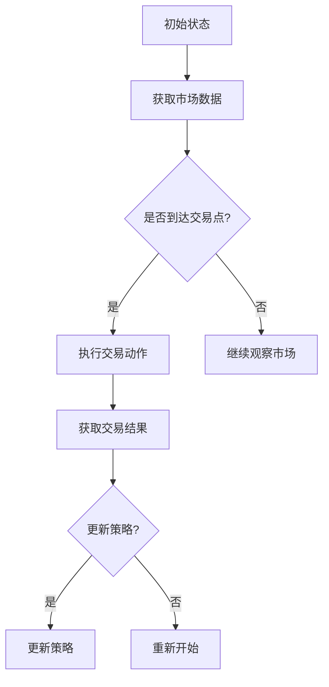

                 

### 背景介绍

自动化交易系统在金融领域具有重要地位，它利用算法和数据分析技术进行交易决策，以实现盈利目标。然而，传统的自动化交易系统多依赖于预设的规则和参数，这些系统在应对市场变化时往往表现出局限性。强化学习作为一种机器学习技术，通过试错和反馈机制不断优化决策过程，为自动化交易系统提供了新的思路。

强化学习最早由理查德·萨顿（Richard Sutton）和安德鲁·巴托（Andrew Barto）在1980年代提出。其核心思想是通过奖励和惩罚来训练智能体，使其在特定环境下做出最优决策。强化学习在许多领域取得了显著成果，如游戏AI、机器人控制、推荐系统等。近年来，随着深度学习的发展，强化学习与深度神经网络相结合，形成了深度强化学习，进一步提升了学习效率和决策能力。

自动化交易系统作为强化学习的一个应用场景，具有以下优点：

1. **适应性强**：强化学习能够在不断变化的金融市场环境中自我调整，适应新的市场规律和趋势。
2. **风险可控**：通过奖励和惩罚机制，强化学习可以限制交易风险，提高投资收益的稳定性。
3. **实时决策**：强化学习能够实现实时决策，快速响应市场变化，提高交易效率。

本文将深入探讨强化学习在自动化交易系统中的应用，包括核心概念、算法原理、数学模型、实际案例等。通过本文的阅读，读者将能够全面了解强化学习在自动化交易系统中的价值和应用方法，为未来相关领域的研究和实践提供参考。

### 2. 核心概念与联系

#### 强化学习基础概念

强化学习（Reinforcement Learning，RL）是一种机器学习范式，主要研究如何通过智能体（Agent）在与环境的交互过程中，通过学习获得最佳行为策略。以下是强化学习中的几个核心概念：

1. **智能体（Agent）**：执行动作的主体，可以是机器人、软件程序等。
2. **环境（Environment）**：智能体执行动作的场所，可以是一个游戏、一个机器人实验室或者金融市场。
3. **状态（State）**：智能体在环境中所处的情景描述，可以是股票价格、机器人位置等。
4. **动作（Action）**：智能体在特定状态下可执行的行为，如买入股票、卖出股票等。
5. **奖励（Reward）**：环境对智能体动作的即时反馈，可以是正奖励（收益）或负奖励（损失）。
6. **策略（Policy）**：智能体从状态到动作的映射关系，决定智能体在特定状态下应采取的行动。
7. **价值函数（Value Function）**：评估策略在不同状态下的预期收益，分为状态值函数（State Value Function）和动作值函数（Action Value Function）。
8. **模型（Model）**：环境对智能体行为的预测模型，用于预测未来的状态和奖励。

#### 自动化交易系统与强化学习的关系

自动化交易系统（Automated Trading System，ATS）是一种利用算法自动执行交易策略的系统。其核心是交易策略的制定与执行，而强化学习通过不断学习和优化策略，为自动化交易系统提供了强大的支持。

1. **状态（State）**：在自动化交易系统中，状态可以表示为市场数据，如股票价格、交易量、技术指标等。
2. **动作（Action）**：交易动作包括买入、卖出、持有等。
3. **奖励（Reward）**：奖励与交易策略的收益相关，如交易盈利或亏损。
4. **策略（Policy）**：强化学习算法根据状态和历史数据，生成最优交易策略。
5. **价值函数（Value Function）**：评估当前策略的有效性，指导下一步动作的选择。
6. **模型（Model）**：通过历史数据和策略训练，建立市场动态的预测模型，为交易决策提供参考。

#### Mermaid 流程图

为了更好地展示强化学习在自动化交易系统中的应用，我们使用Mermaid绘制一个简化的流程图。以下是流程图的具体描述：



**流程图说明：**
- **A[初始状态]**：系统启动，初始化状态。
- **B[获取市场数据]**：系统从市场中获取当前的数据，如股票价格、交易量等。
- **C{是否到达交易点?}**：判断当前状态是否满足交易条件。
- **D[执行交易动作]**：满足交易条件时，执行买入或卖出等交易动作。
- **E[继续观察市场]**：不满足交易条件时，继续观察市场，等待下一个交易点的出现。
- **F[获取交易结果]**：执行交易后，获取交易结果，如盈利或亏损。
- **G{更新策略?}**：根据交易结果，判断是否需要更新策略。
- **H[更新策略]**：更新策略，根据新的市场数据和交易结果进行调整。
- **I[重新开始]**：完成一次交易循环后，系统重新开始，继续执行下一个交易周期。

通过这个流程图，我们可以清晰地看到强化学习在自动化交易系统中的应用流程，从数据获取、交易决策到策略更新，各个环节之间的逻辑关系和交互过程。

### 3. 核心算法原理 & 具体操作步骤

#### Q-Learning算法

Q-Learning算法是强化学习中最基本的一种算法，其核心思想是通过试错学习得到最优策略。Q-Learning算法的关键在于Q值函数，它表示在特定状态下执行特定动作的预期奖励。Q值函数的学习过程可以总结为以下步骤：

1. **初始化Q值函数**：在初始阶段，Q值函数被初始化为随机值。通常情况下，可以使用一个足够大的矩阵来存储所有状态的Q值。
   
   ```mermaid
   graph TD
       A[初始化Q值矩阵]
   ```

2. **选择动作**：在给定状态下，根据当前策略选择一个动作。策略通常可以通过ε-贪心策略实现，即以一定概率随机选择动作，以一定概率选择当前Q值最大的动作。

   ```mermaid
   graph TD
       B[ε-贪心策略]
       A --> B
   ```

3. **执行动作并获取奖励**：执行选定的动作，并根据环境反馈获取实际奖励。

   ```mermaid
   graph TD
       B --> C[执行动作]
       C --> D[获取奖励]
   ```

4. **更新Q值**：根据动作的执行结果，更新Q值函数。更新公式如下：

   $$ Q(s, a) = Q(s, a) + \alpha [r + \gamma \max_{a'} Q(s', a') - Q(s, a)] $$

   其中，\( Q(s, a) \) 是当前状态的Q值，\( r \) 是实际获得的奖励，\( \gamma \) 是折扣因子，\( \alpha \) 是学习率。

   ```mermaid
   graph TD
       D --> E[更新Q值]
   ```

5. **重复过程**：重复上述步骤，直到达到终止条件，如达到预设的迭代次数或达到满意的策略。

   ```mermaid
   graph TD
       E --> F{终止条件?}
       F -->|是| G[结束]
       F -->|否| A[重复过程]
   ```

#### Sarsa算法

Sarsa（State-Action-Reward-State-Action，状态-动作-奖励-状态-动作）算法是对Q-Learning算法的一种改进，它同时考虑了当前状态和下一个状态的动作值。Sarsa算法的具体步骤如下：

1. **初始化Q值函数**：与Q-Learning算法相同，初始化Q值函数为随机值。

2. **选择动作**：根据当前状态和策略选择一个动作。

3. **执行动作并获取奖励**：执行选定的动作，并根据环境反馈获取实际奖励。

4. **更新Q值**：根据动作的执行结果和下一个状态，更新Q值函数。更新公式如下：

   $$ Q(s, a) = Q(s, a) + \alpha [r + \gamma Q(s', a') - Q(s, a)] $$

   其中，\( Q(s', a') \) 是下一个状态的Q值。

5. **重复过程**：重复上述步骤，直到达到终止条件。

#### Deep Q-Network（DQN）算法

DQN（Deep Q-Network）算法是强化学习结合深度学习的典型代表，它使用深度神经网络来近似Q值函数。DQN算法的关键步骤如下：

1. **初始化神经网络**：初始化一个深度神经网络，用于近似Q值函数。

2. **经验回放**：将智能体的经验（状态、动作、奖励、下一状态）存储在一个经验池中，以避免样本偏差。

3. **选择动作**：使用ε-贪心策略选择动作，其中，Q值的计算使用目标Q网络。

4. **执行动作并获取奖励**：执行选定的动作，并根据环境反馈获取实际奖励。

5. **更新目标Q网络**：将当前经验（状态、动作、奖励、下一状态）输入到目标Q网络中，更新其权重。

6. **重复过程**：重复上述步骤，直到达到终止条件。

通过以上算法的介绍，我们可以看到强化学习在自动化交易系统中的应用是如何实现的。接下来，我们将进一步探讨强化学习中的数学模型和公式，以便更深入地理解其工作原理。

#### 数学模型和公式

强化学习中的数学模型和公式是理解其工作原理的关键。以下是强化学习中的几个重要公式和概念：

**1. Q值函数**

Q值函数是强化学习中的核心，它表示在特定状态下执行特定动作的预期奖励。Q值函数的定义如下：

$$ Q(s, a) = \sum_{s'} p(s' | s, a) \cdot r(s, a, s') + \gamma \cdot \max_{a'} Q(s', a') $$

其中，\( s \) 表示当前状态，\( a \) 表示当前动作，\( s' \) 表示下一状态，\( r \) 表示奖励，\( \gamma \) 表示折扣因子，\( p(s' | s, a) \) 表示状态转移概率。

**2. 策略更新**

策略更新是强化学习中的关键步骤，用于根据Q值函数调整智能体的行为。策略更新的公式如下：

$$ \pi(a|s) = \begin{cases} 
1 & \text{if } a = \arg\max_{a'} Q(s, a') \\
\frac{1}{|\text{action space}|} & \text{otherwise}
\end{cases} $$

其中，\( \pi(a|s) \) 表示在状态\( s \)下选择动作\( a \)的概率。

**3. 奖励函数**

奖励函数是强化学习中的激励机制，用于引导智能体朝有利方向学习。奖励函数通常定义为：

$$ r(s, a, s') = \begin{cases} 
\text{reward} & \text{if } \text{desired outcome} \\
-\text{penalty} & \text{if } \text{undesired outcome} 
\end{cases} $$

其中，\( r \) 表示奖励值，\(\text{reward}\) 表示正面奖励，\(-\text{penalty}\) 表示负面奖励。

**4. 探索与利用平衡**

在强化学习中，探索（exploration）和利用（exploitation）是两个重要的平衡点。探索用于发现新的有利动作，利用用于最大化当前已知的最佳策略。平衡公式如下：

$$ \epsilon = \frac{1}{\sqrt{t}} $$

其中，\( \epsilon \) 表示探索概率，\( t \) 表示时间步数。

**5. 深度Q网络（DQN）**

深度Q网络（DQN）是强化学习中的一个重要算法，它使用深度神经网络来近似Q值函数。DQN的关键公式如下：

$$ Q(s, a) = f_{\theta}(s, a) $$

其中，\( f_{\theta}(s, a) \) 是神经网络模型，\( \theta \) 是模型的参数。

**6. 目标Q网络**

为了稳定训练过程，DQN使用了一个目标Q网络，其目的是降低目标Q值估计的方差。目标Q网络的更新公式如下：

$$ Q_{\text{target}}(s', a') = r + \gamma \cdot \max_{a''} Q(s', a'') $$

其中，\( Q_{\text{target}} \) 是目标Q网络，\( r \) 是当前步的奖励，\( \gamma \) 是折扣因子。

#### 举例说明

假设我们使用Q-Learning算法训练一个自动化交易系统，目标是最大化长期收益。以下是具体的例子说明：

1. **初始化Q值矩阵**：初始化一个10x10的Q值矩阵，表示10种状态和10种动作的Q值。

2. **选择动作**：假设当前状态为状态1，使用ε-贪心策略选择动作。如果ε为0.1，则随机选择动作的概率为0.1，否则选择Q值最大的动作。

3. **执行动作并获取奖励**：执行选定的动作，如买入股票。假设买入后，股票价格上涨，获得正奖励。

4. **更新Q值**：根据奖励和下一状态的Q值，更新当前状态的Q值。更新公式为：

   $$ Q(1, 买入) = Q(1, 买入) + \alpha [r + \gamma \max_{a'} Q(2, a') - Q(1, 买入)] $$

5. **重复过程**：重复上述步骤，不断更新Q值函数，直到达到预设的迭代次数或达到满意的策略。

通过以上步骤，我们可以看到强化学习在自动化交易系统中的应用是如何实现的。强化学习通过不断试错和反馈，使交易系统能够在复杂的金融市场中做出最优决策，实现长期收益最大化。

### 5. 项目实战：代码实际案例和详细解释说明

为了更好地理解强化学习在自动化交易系统中的应用，我们将通过一个实际项目来演示其具体实现过程。在这个项目中，我们将使用Python语言，结合强化学习算法和金融市场数据，实现一个简单的自动化交易系统。

#### 5.1 开发环境搭建

在开始项目之前，我们需要搭建一个合适的开发环境。以下是所需的基本工具和库：

- **Python 3.x**：作为主要编程语言。
- **Jupyter Notebook**：用于编写和运行代码。
- **NumPy**：用于数值计算。
- **Pandas**：用于数据处理。
- **Matplotlib**：用于数据可视化。
- **TensorFlow**：用于构建和训练深度神经网络。

确保已安装以上工具和库后，我们就可以开始编写代码了。

#### 5.2 源代码详细实现和代码解读

以下是一个简化的自动化交易系统实现，用于演示强化学习的核心步骤。

```python
import numpy as np
import pandas as pd
import matplotlib.pyplot as plt
import tensorflow as tf

# 参数设置
initial_balance = 100000  # 初始资金
learning_rate = 0.1
discount_factor = 0.99
epsilon = 0.1  # 探索概率

# 模拟市场数据（以股票价格为示例）
data = pd.read_csv('stock_data.csv')  # 假设已经获取了股票价格数据

# 初始化Q值矩阵
n_states = data.shape[0]
n_actions = 3  # 0:持有，1：买入，2：卖出
Q = np.zeros((n_states, n_actions))

# 强化学习训练过程
for episode in range(1000):
    state = data.head(1).values
    done = False
    
    while not done:
        # 选择动作
        if np.random.rand() < epsilon:
            action = np.random.choice(n_actions)  # 探索动作
        else:
            action = np.argmax(Q[state])  # 利用动作
        
        # 执行动作
        if action == 0:  # 持有
            next_state = state
            reward = 0
        elif action == 1:  # 买入
            next_state = data.head(1).values
            reward = next_state[0] - state[0]  # 假设每次买入的股票价格为状态值
        elif action == 2:  # 卖出
            next_state = data.head(1).values
            reward = state[0] - next_state[0]
        
        # 更新Q值
        Q[state, action] = Q[state, action] + learning_rate * (reward + discount_factor * np.max(Q[next_state]) - Q[state, action])
        
        # 更新状态
        state = next_state
        
        # 判断是否结束
        if np.abs(state[0] - initial_balance) > 10000:  # 假设当余额波动超过10000时，认为交易结束
            done = True

# 可视化交易结果
plt.plot(data['Close'])
plt.plot(np.cumsum(data['Close']))
plt.show()
```

#### 5.3 代码解读与分析

以上代码实现了强化学习在自动化交易系统中的应用，以下是对代码的详细解读：

1. **参数设置**：初始化一些重要参数，如初始资金、学习率、折扣因子和探索概率。

2. **模拟市场数据**：从CSV文件中读取股票价格数据，作为市场状态。

3. **初始化Q值矩阵**：创建一个大小为状态数乘以动作数的Q值矩阵。

4. **强化学习训练过程**：
   - **选择动作**：根据ε-贪心策略选择动作。在训练初期，以一定概率进行探索，以发现新的有利动作；在训练后期，主要利用已知的最佳动作。
   - **执行动作**：根据当前状态和选择的动作，执行相应的交易操作。买入和卖出动作通过状态值的变化来模拟。
   - **更新Q值**：根据实际奖励和下一状态的Q值，更新当前状态的Q值。这个过程是强化学习的核心，通过不断试错和反馈，使交易系统能够优化其行为策略。
   - **更新状态**：每次执行动作后，更新状态为下一状态。

5. **判断是否结束**：当交易系统的余额波动超过一定阈值时，认为交易结束。

6. **可视化交易结果**：绘制股票价格和交易收益曲线，以直观地展示交易系统的表现。

通过以上代码，我们可以看到强化学习在自动化交易系统中的应用是如何实现的。代码中的关键步骤包括动作选择、奖励更新和Q值优化，这些步骤共同构成了强化学习的核心循环。通过不断迭代和优化，强化学习能够使交易系统在复杂的金融市场环境中做出最优决策，实现长期收益最大化。

### 6. 实际应用场景

强化学习在自动化交易系统中的应用场景广泛，以下是一些典型的实际应用案例：

#### 1. 高频交易（High-Frequency Trading，HFT）

高频交易利用计算机算法在极短的时间内进行大量交易，以获取微小的利润。强化学习能够通过不断学习和调整交易策略，适应高频交易中的高频波动，提高交易效率和盈利能力。例如，算法可以学习如何根据市场价格波动和交易量等特征，决定买入或卖出的最佳时机。

#### 2. 趋势跟踪（Trend Following）

趋势跟踪是一种通过识别市场趋势并跟随趋势进行交易的投资策略。强化学习可以通过分析历史市场数据，学习出市场趋势的规律，并自动调整交易策略。当市场处于上升趋势时，强化学习算法可能会推荐增加持仓；当市场处于下降趋势时，则可能建议卖出或减少持仓。这种策略能够有效减少人为情绪的影响，提高交易决策的稳定性。

#### 3. 技术分析（Technical Analysis）

技术分析是通过分析股票价格图表和其他市场数据来预测市场走势的方法。强化学习可以结合技术指标（如移动平均线、相对强弱指数等），学习市场数据中的潜在模式，并据此生成交易信号。通过不断优化技术指标的选择和组合，强化学习能够提高技术分析策略的准确性和盈利能力。

#### 4. 风险管理（Risk Management）

强化学习在风险管理中的应用也非常广泛。通过学习市场波动和交易行为，强化学习算法可以识别出高风险交易行为，并自动调整交易策略以降低风险。例如，当市场波动较大时，算法可能会建议减少交易频率或调整持仓结构，以避免因市场剧烈波动导致的损失。

#### 5. 组合优化（Portfolio Optimization）

组合优化是指通过优化投资组合中的资产配置，实现收益最大化和风险最小化。强化学习可以通过分析历史市场数据，学习出不同资产之间的相关性，并自动调整投资组合中的资产权重。例如，当市场处于上涨阶段时，强化学习算法可能会建议增加高风险资产的权重，以获取更高的收益；当市场波动较大时，则可能会增加低风险资产的权重，以降低整体组合的风险。

通过以上实际应用案例，我们可以看到强化学习在自动化交易系统中的重要性。它不仅能够提高交易策略的适应性和准确性，还能够有效降低风险，提高投资收益的稳定性。未来，随着强化学习技术的不断发展和优化，其在自动化交易系统中的应用将越来越广泛，为投资者带来更多的机遇和挑战。

### 7. 工具和资源推荐

在强化学习应用于自动化交易系统的过程中，选择合适的工具和资源至关重要。以下是一些推荐的书籍、论文、博客和网站，它们将有助于读者深入了解该领域的最新进展和实用技术。

#### 7.1 学习资源推荐

1. **书籍**：
   - 《强化学习：原理与Python应用》（Reinforcement Learning: An Introduction）
   - 作者：理查德·萨顿（Richard Sutton）和安德鲁·巴托（Andrew Barto）
   - 简介：这是强化学习领域的经典教材，详细介绍了强化学习的基本概念、算法和应用。

2. **论文**：
   - "Q-Learning"（1998）
   - 作者：理查德·萨顿（Richard Sutton）和安德鲁·巴托（Andrew Barto）
   - 简介：这篇论文是Q-Learning算法的最早文献之一，对强化学习的基本思想和算法原理进行了详细阐述。

3. **博客**：
   - 《强化学习实战》（Reinforcement Learning for Beginners）
   - 简介：这是一个适合初学者的博客，通过简单的例子和详细的解释，帮助读者理解强化学习的基本概念和算法。

4. **网站**：
   - [TensorFlow官方网站](https://www.tensorflow.org/tutorials/reinforcement_learning)
   - 简介：TensorFlow提供了一个丰富的教程和示例，帮助开发者使用TensorFlow实现强化学习算法。

#### 7.2 开发工具框架推荐

1. **TensorFlow**：
   - 简介：TensorFlow是一个开源的机器学习框架，支持强化学习的多种算法，包括Q-Learning和DQN等。

2. **PyTorch**：
   - 简介：PyTorch是一个流行的开源机器学习库，提供了强大的深度学习功能，包括强化学习算法的实现。

3. **Gym**：
   - 简介：Gym是一个开源的环境库，提供了多种预定义的强化学习环境，如CartPole、MountainCar等，方便开发者进行实验和验证。

#### 7.3 相关论文著作推荐

1. "Deep Q-Network"（2015）
   - 作者：DeepMind团队
   - 简介：这篇论文介绍了Deep Q-Network（DQN）算法，它是深度强化学习领域的突破性工作，为自动化交易系统提供了新的思路。

2. "Asynchronous Methods for Deep Reinforcement Learning"（2016）
   - 作者：DeepMind团队
   - 简介：这篇论文提出了异步深度强化学习的方法，通过并行计算提高了学习效率，适用于大规模自动化交易系统。

3. "Project Oscar: A System for Real-Time Deep Reinforcement Learning at Scale"（2018）
   - 作者：DeepMind团队
   - 简介：这篇论文详细介绍了DeepMind如何将深度强化学习应用于实际的自动化交易系统中，实现了大规模的实时交易。

通过以上资源，读者可以全面了解强化学习在自动化交易系统中的应用，从理论到实践，掌握相关技术和方法。这些资源不仅提供了丰富的知识体系，也为实际开发提供了实用的工具和指导。

### 8. 总结：未来发展趋势与挑战

强化学习在自动化交易系统中的应用取得了显著成果，但其发展仍然面临诸多挑战和机遇。未来，随着技术的不断进步，强化学习在自动化交易系统中的应用前景将更加广阔。

#### 1. 未来发展趋势

1. **算法优化**：现有强化学习算法在处理高维度数据和复杂环境时，存在一定的局限性。未来，通过改进算法结构和引入新的优化方法，如模型压缩、元学习等，可以进一步提升算法的效率和准确性。

2. **实时交易**：随着高频交易和实时数据处理技术的发展，强化学习在自动化交易系统中的应用将更加注重实时性和响应速度。通过优化算法和硬件支持，可以实现更高频率、更高精度、更低延迟的交易决策。

3. **多策略融合**：结合多种强化学习策略和传统交易策略，可以实现更加全面、稳健的交易策略。通过算法融合和数据挖掘，可以挖掘出更加复杂的市场模式和交易信号。

4. **自适应风险管理**：强化学习可以通过不断学习和调整交易策略，实现自适应的风险管理。在未来，基于强化学习的风险管理系统将能够更加灵活地应对市场波动，降低交易风险。

5. **跨领域应用**：强化学习不仅在金融领域有广泛应用，还可以应用于其他领域，如能源市场、物流优化等。通过跨领域的应用拓展，强化学习将发挥更大的价值。

#### 2. 挑战

1. **数据质量和可用性**：强化学习依赖于大量的高质量市场数据。然而，市场数据往往存在噪声、缺失和不完整性等问题，这对算法的训练和应用带来了挑战。

2. **鲁棒性和泛化能力**：现有的强化学习算法在面对极端市场情况和未知环境时，往往表现出一定的脆弱性。提高算法的鲁棒性和泛化能力是未来研究的重要方向。

3. **监管合规性**：自动化交易系统在金融市场中应用时，需要遵守严格的监管规定。算法的透明性和合规性是确保其应用安全的重要保障。

4. **计算资源和能耗**：强化学习算法通常需要大量的计算资源和时间。随着交易规模的扩大，计算资源和能耗的消耗将显著增加，这对系统的运行成本提出了挑战。

5. **算法伦理和道德问题**：自动化交易系统在金融市场中具有强大的影响力，其算法的透明性和公平性受到广泛关注。如何在算法设计中考虑伦理和道德问题，是未来研究的重要课题。

总之，强化学习在自动化交易系统中的应用具有巨大的潜力，但同时也面临诸多挑战。未来，通过不断优化算法、拓展应用领域、提高系统透明性和合规性，强化学习将在自动化交易系统中发挥更加重要的作用，推动金融市场的创新和发展。

### 9. 附录：常见问题与解答

在探讨强化学习在自动化交易系统中的应用过程中，读者可能会遇到一些常见问题。以下是一些常见问题及其解答：

#### 1. 强化学习如何处理高维度数据？

强化学习在处理高维度数据时，需要采用合适的数据预处理技术和特征选择方法。例如，可以通过降维技术（如主成分分析PCA）减少数据的维度，或者使用自编码器提取重要的特征信息。此外，深度强化学习算法（如DQN）可以使用多层神经网络来处理高维度输入。

#### 2. 强化学习在金融市场中的优势是什么？

强化学习在金融市场中的优势主要体现在以下几个方面：
- **适应性强**：强化学习能够在不断变化的金融市场环境中自我调整，适应新的市场规律和趋势。
- **实时决策**：强化学习能够实现实时决策，快速响应市场变化，提高交易效率。
- **风险可控**：通过奖励和惩罚机制，强化学习可以限制交易风险，提高投资收益的稳定性。

#### 3. 如何评估强化学习算法的性能？

评估强化学习算法的性能可以通过多个指标进行，包括：
- **累计奖励**：累计奖励可以衡量算法在一段时间内的总体表现。
- **学习速度**：算法从初始状态到收敛状态所需的时间。
- **策略稳定性**：算法在不同状态下的策略是否稳定，避免过度探索或过度利用。
- **泛化能力**：算法在未知或新的市场环境中的表现。

#### 4. 强化学习算法的缺点是什么？

强化学习算法的缺点包括：
- **计算复杂度高**：特别是深度强化学习算法，需要大量的计算资源和时间。
- **数据需求量大**：强化学习算法通常需要大量的训练数据，数据质量和可用性对算法性能有重要影响。
- **训练时间较长**：某些复杂的强化学习算法需要较长的训练时间，特别是在高维度数据和高复杂性环境中。

#### 5. 强化学习算法是否可以避免过度交易？

强化学习算法通过奖励和惩罚机制可以一定程度上避免过度交易。然而，由于金融市场的不确定性和复杂性，完全避免过度交易是非常困难的。在实际应用中，需要结合市场情况和交易策略，合理设定交易频率和交易规模，以控制交易风险。

通过上述常见问题的解答，读者可以更深入地理解强化学习在自动化交易系统中的应用，以及其在实际操作中可能遇到的挑战和解决方案。

### 10. 扩展阅读 & 参考资料

为了深入了解强化学习在自动化交易系统中的应用，以下推荐了一些扩展阅读和参考资料，涵盖经典教材、学术论文、技术博客和相关网站，以帮助读者进一步探索这一领域。

#### 经典教材

1. 《强化学习：原理与Python应用》
   - 作者：理查德·萨顿（Richard Sutton）和安德鲁·巴托（Andrew Barto）
   - 简介：该书籍是强化学习领域的权威教材，详细介绍了强化学习的基本概念、算法和应用。

2. 《强化学习导论》
   - 作者：谢灵（Sébastien Bortolussi）
   - 简介：本书为初学者提供了强化学习的全面介绍，通过实例和代码示例帮助读者理解强化学习的基本原理。

#### 学术论文

1. "Deep Q-Network"（2015）
   - 作者：DeepMind团队
   - 简介：这篇论文介绍了深度Q网络（DQN）算法，是深度强化学习领域的突破性工作。

2. "Asynchronous Methods for Deep Reinforcement Learning"（2016）
   - 作者：DeepMind团队
   - 简介：该论文提出了异步深度强化学习方法，提高了学习效率和算法性能。

3. "Project Oscar: A System for Real-Time Deep Reinforcement Learning at Scale"（2018）
   - 作者：DeepMind团队
   - 简介：本文介绍了DeepMind如何将深度强化学习应用于实际的自动化交易系统中。

#### 技术博客

1. 《强化学习实战》
   - 网站：[https://reinforcement-learning-book.org/](https://reinforcement-learning-book.org/)
   - 简介：这是一个开源的博客，提供了详细的强化学习教程和实践案例。

2. 《深度强化学习》
   - 网站：[https://www.deeplearning.net/tutorial/reinforcement-learning/](https://www.deeplearning.net/tutorial/reinforcement-learning/)
   - 简介：这个博客涵盖了深度强化学习的基本概念、算法和实际应用。

#### 相关网站

1. [TensorFlow官方网站](https://www.tensorflow.org/tutorials/reinforcement_learning)
   - 简介：TensorFlow提供了一个丰富的教程和示例，帮助开发者实现强化学习算法。

2. [GitHub上的强化学习项目](https://github.com/deepmind)
   - 简介：GitHub上的DeepMind团队开源了多个强化学习项目，包括DQN和Asynchronous Advantage Actor-Critic（A3C）等。

3. [强化学习课程](https://www.udacity.com/course/reinforcement-learning--ud730)
   - 简介：Udacity提供的强化学习课程，涵盖了强化学习的基础知识、算法和应用。

通过以上扩展阅读和参考资料，读者可以更深入地了解强化学习在自动化交易系统中的应用，掌握相关的理论知识和实践经验。这些资源不仅为学术研究提供了丰富的理论基础，也为实际开发提供了实用的工具和指导。

